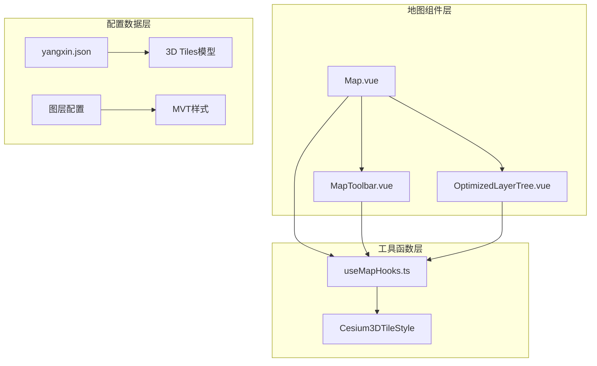
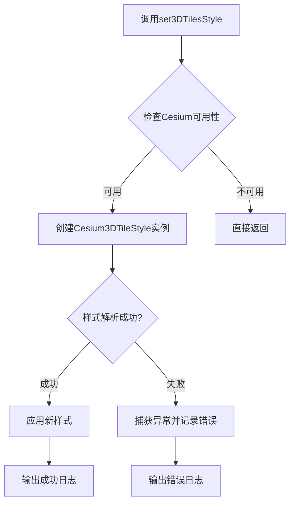
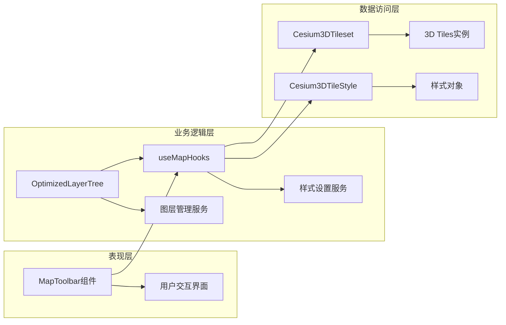
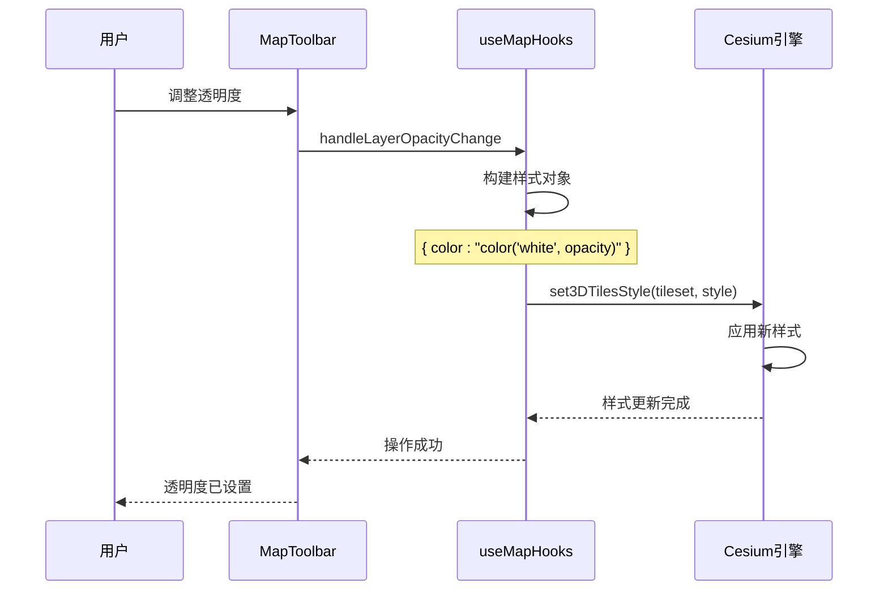
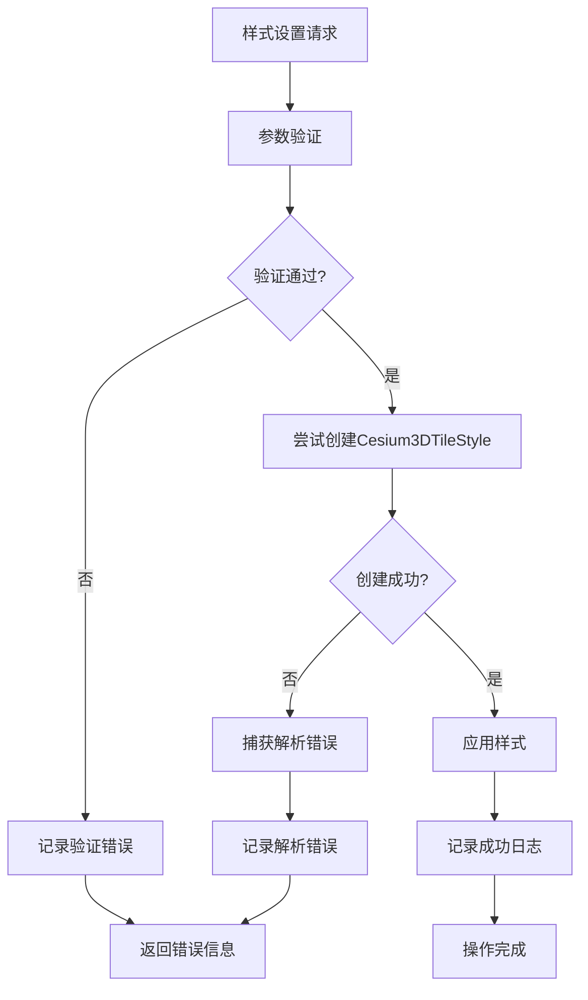
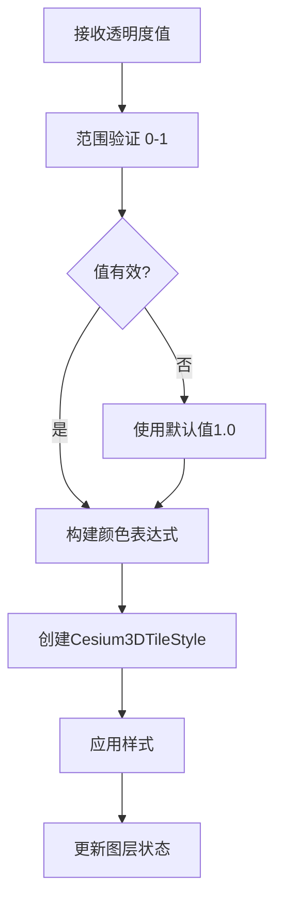
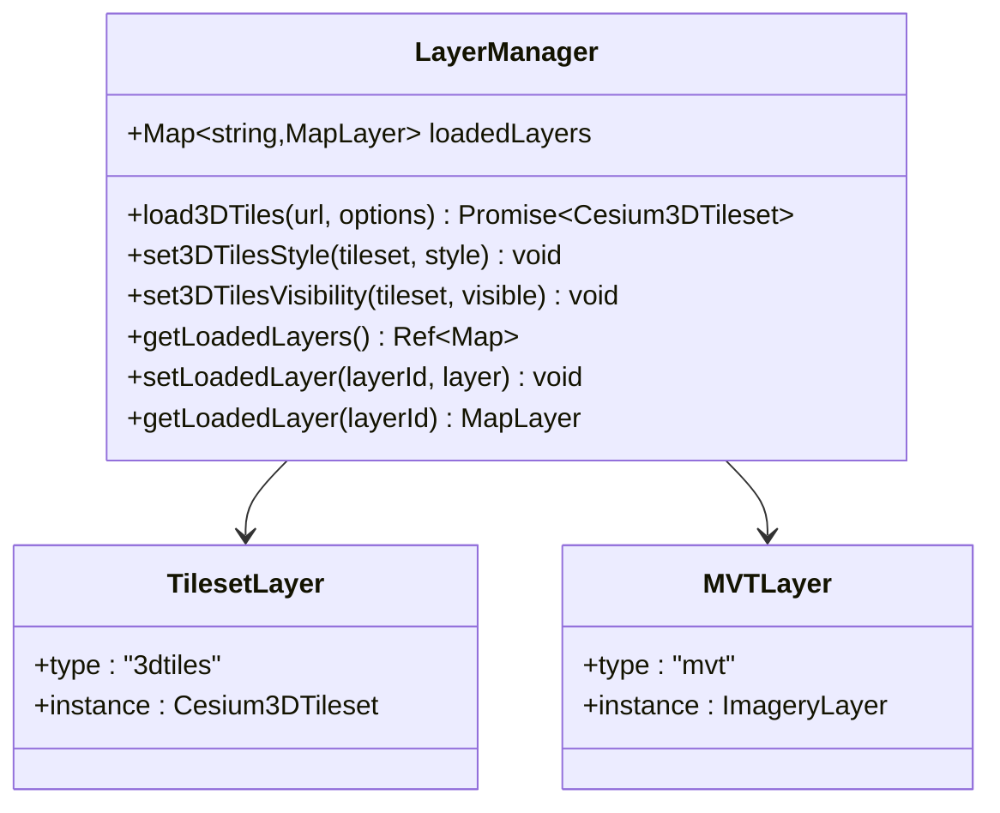
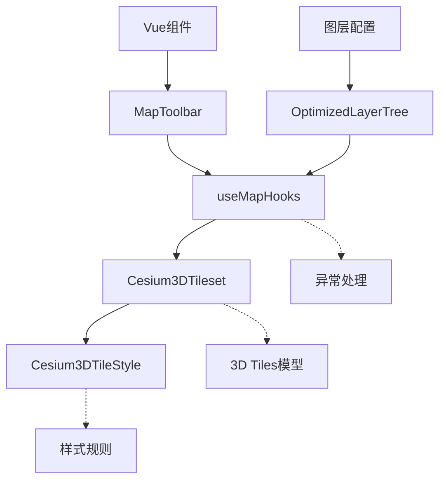

# 3D Tiles样式设置

<cite>
**本文档中引用的文件**
- [useMapHooks.ts](file://src/hook/useMapHooks.ts)
- [Map.vue](file://src/mapComponents/Map.vue)
- [MapToolbar.vue](file://src/mapComponents/MapToolbar.vue)
- [OptimizedLayerTree.vue](file://src/mapComponents/OptimizedLayerTree.vue)
- [yangxin.json](file://public/yangxin.json)
- [README_LAYER_TREE.md](file://src/mapComponents/README_LAYER_TREE.md)
</cite>

## 目录
1. [简介](#简介)
2. [项目结构概览](#项目结构概览)
3. [核心组件分析](#核心组件分析)
4. [架构概览](#架构概览)
5. [详细组件分析](#详细组件分析)
6. [依赖关系分析](#依赖关系分析)
7. [性能考虑](#性能考虑)
8. [故障排除指南](#故障排除指南)
9. [结论](#结论)

## 简介

本文档全面介绍了政府dashboard项目中3D Tiles样式设置系统的实现原理和使用方法。该系统基于Cesium框架，提供了强大的3D Tiles渲染样式控制能力，包括颜色、透明度、条件渲染等视觉效果的动态修改。

3D Tiles是一种用于传输和渲染大规模三维地理空间数据的标准格式。在本项目中，我们通过`set3DTilesStyle`函数实现了对3D Tiles模型的样式化控制，支持实时修改模型外观，为用户提供丰富的可视化体验。

## 项目结构概览

该项目采用模块化的架构设计，主要包含以下核心模块：

**图表来源**
- [Map.vue](file://src/mapComponents/Map.vue#L1-L50)
- [useMapHooks.ts](file://src/hook/useMapHooks.ts#L1-L50)

**章节来源**
- [Map.vue](file://src/mapComponents/Map.vue#L1-L432)
- [useMapHooks.ts](file://src/hook/useMapHooks.ts#L1-L545)

## 核心组件分析

### set3DTilesStyle函数

`set3DTilesStyle`函数是3D Tiles样式设置的核心功能，它接受Cesium3DTileStyle对象作为参数，动态修改3D Tiles的渲染样式。

**图表来源**
- [useMapHooks.ts](file://src/hook/useMapHooks.ts#L169-L180)

该函数的主要特点包括：
- **异常安全**：内置try-catch机制，确保样式设置失败时不会影响应用程序
- **动态更新**：支持运行时动态修改样式，无需重新加载3D Tiles
- **类型检查**：验证Cesium和tileset实例的有效性

**章节来源**
- [useMapHooks.ts](file://src/hook/useMapHooks.ts#L169-L180)

## 架构概览

整个3D Tiles样式控制系统采用分层架构设计，确保了良好的可维护性和扩展性：

**图表来源**
- [MapToolbar.vue](file://src/mapComponents/MapToolbar.vue#L1-L50)
- [useMapHooks.ts](file://src/hook/useMapHooks.ts#L1-L100)

## 详细组件分析

### 样式设置流程

#### 1. 基础样式设置

最简单的样式设置是修改颜色和透明度：

**图表来源**
- [MapToolbar.vue](file://src/mapComponents/MapToolbar.vue#L268-L285)
- [useMapHooks.ts](file://src/hook/useMapHooks.ts#L169-L180)

#### 2. 高级样式配置

对于更复杂的样式需求，可以使用Cesium表达式语法：

| 样式属性 | Cesium表达式 | 描述 | 示例值 |
|---------|-------------|------|--------|
| 颜色 | `color('color', opacity)` | 设置模型颜色和透明度 | `color('red', 0.5)` |
| 条件渲染 | `show(property > threshold)` | 基于属性值的条件显示 | `show(height > 100)` |
| 材质效果 | `material` | 自定义材质属性 | `{ diffuse: 'white' }` |
| 几何体变换 | `scale` | 缩放模型大小 | `scale(2.0)` |

#### 3. 异常处理机制

系统实现了完善的异常捕获机制：

**图表来源**
- [useMapHooks.ts](file://src/hook/useMapHooks.ts#L174-L179)

**章节来源**
- [MapToolbar.vue](file://src/mapComponents/MapToolbar.vue#L268-L285)
- [useMapHooks.ts](file://src/hook/useMapHooks.ts#L169-L180)

### 透明度控制实现

透明度控制是3D Tiles样式设置中最常用的功能之一。系统通过以下方式实现：

#### 透明度设置算法

**图表来源**
- [MapToolbar.vue](file://src/mapComponents/MapToolbar.vue#L276-L279)

#### 透明度控制代码示例路径

透明度控制的具体实现位于[`MapToolbar.vue`](file://src/mapComponents/MapToolbar.vue#L268-L285)，其中包含了完整的透明度设置逻辑。

**章节来源**
- [MapToolbar.vue](file://src/mapComponents/MapToolbar.vue#L268-L285)

### 图层管理系统

图层管理系统负责协调不同类型的图层，包括3D Tiles和MVT图层：

**图表来源**
- [useMapHooks.ts](file://src/hook/useMapHooks.ts#L18-L32)

**章节来源**
- [useMapHooks.ts](file://src/hook/useMapHooks.ts#L18-L32)
- [MapToolbar.vue](file://src/mapComponents/MapToolbar.vue#L226-L266)

## 依赖关系分析

### 核心依赖关系

**图表来源**
- [useMapHooks.ts](file://src/hook/useMapHooks.ts#L169-L180)
- [MapToolbar.vue](file://src/mapComponents/MapToolbar.vue#L268-L285)

### 外部依赖

系统依赖以下外部资源：
- **Cesium引擎**：提供3D Tiles渲染和样式控制功能
- **Vue 3 Composition API**：提供响应式数据管理和组件通信
- **TypeScript**：提供类型安全和更好的开发体验

**章节来源**
- [useMapHooks.ts](file://src/hook/useMapHooks.ts#L1-L20)
- [MapToolbar.vue](file://src/mapComponents/MapToolbar.vue#L1-L50)

## 性能考虑

### 样式更新频率优化

为了确保良好的用户体验，系统采用了多种性能优化策略：

#### 1. 样式缓存机制
- 避免重复创建相同的样式对象
- 缓存常用的样式配置
- 实现智能的样式变更检测

#### 2. 渲染优化
- 使用Cesium的内置优化功能
- 控制样式更新的频率
- 避免不必要的重新渲染

#### 3. 内存管理
- 及时释放不再使用的样式对象
- 监控内存使用情况
- 实现垃圾回收策略

### 性能监控指标

| 指标 | 目标值 | 监控方法 | 优化策略 |
|------|--------|----------|----------|
| 样式更新延迟 | < 100ms | 时间戳对比 | 异步处理 |
| 内存使用率 | < 80% | 内存监控 | 对象池化 |
| GPU利用率 | < 90% | 性能分析器 | 分层渲染 |
| 帧率稳定性 | > 30fps | 帧率监控 | 动态质量调整 |

## 故障排除指南

### 常见问题及解决方案

#### 1. 样式设置失败

**问题描述**：调用`set3DTilesStyle`后样式没有生效

**可能原因**：
- Cesium实例未正确初始化
- 3D Tiles实例不存在
- 样式对象格式不正确

**解决步骤**：
1. 检查Cesium是否已加载
2. 验证tileset实例的有效性
3. 确认样式对象的JSON格式
4. 查看浏览器控制台错误信息

#### 2. 性能问题

**问题描述**：样式更新导致页面卡顿

**优化建议**：
- 减少样式更新频率
- 使用异步处理
- 实现样式变更队列
- 监控GPU使用率

#### 3. 兼容性问题

**问题描述**：某些Cesium表达式在特定版本中不支持

**解决方案**：
- 检查Cesium版本兼容性
- 使用向后兼容的表达式语法
- 实现降级方案

**章节来源**
- [useMapHooks.ts](file://src/hook/useMapHooks.ts#L174-L179)
- [MapToolbar.vue](file://src/mapComponents/MapToolbar.vue#L200-L222)

## 结论

本项目实现了一个功能完善、性能优异的3D Tiles样式设置系统。通过`set3DTilesStyle`函数，开发者可以轻松地对3D Tiles模型进行样式化控制，包括颜色、透明度、条件渲染等多种视觉效果。

系统的主要优势包括：
- **易用性**：简洁的API设计，易于集成和使用
- **稳定性**：完善的异常处理和错误恢复机制
- **性能**：优化的渲染策略和内存管理
- **扩展性**：支持自定义样式表达式和高级功能

未来的发展方向包括：
- 支持更多的Cesium表达式语法
- 实现样式预设和模板功能
- 增强性能监控和分析能力
- 提供更丰富的可视化效果

通过持续的优化和改进，该系统将为用户提供更加丰富和流畅的3D地理信息服务体验。