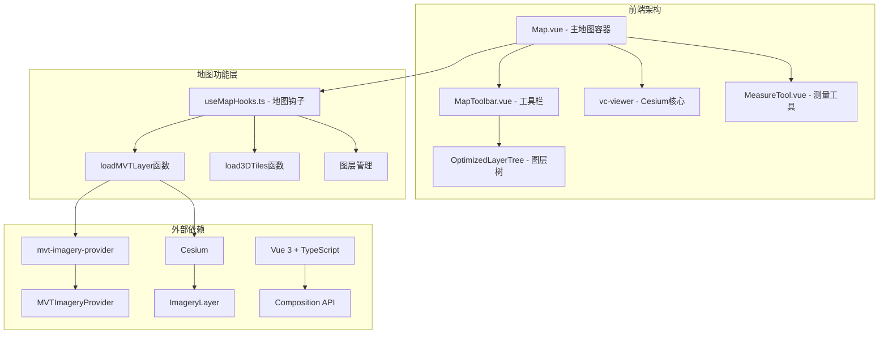
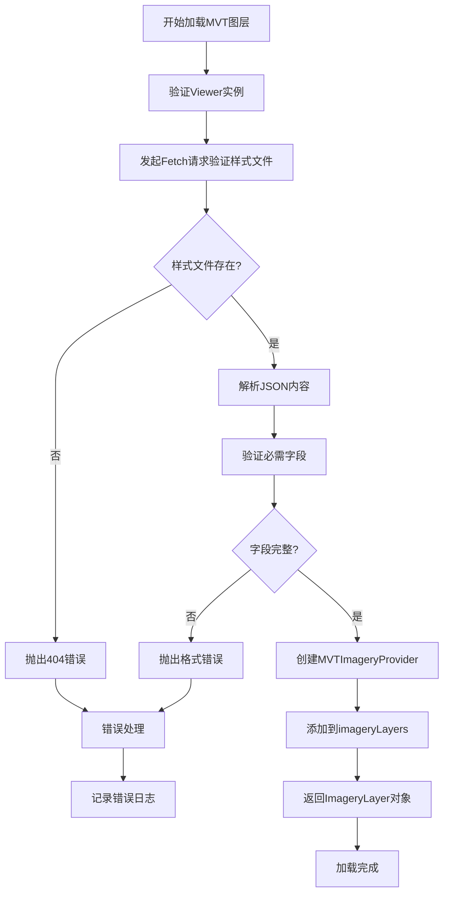
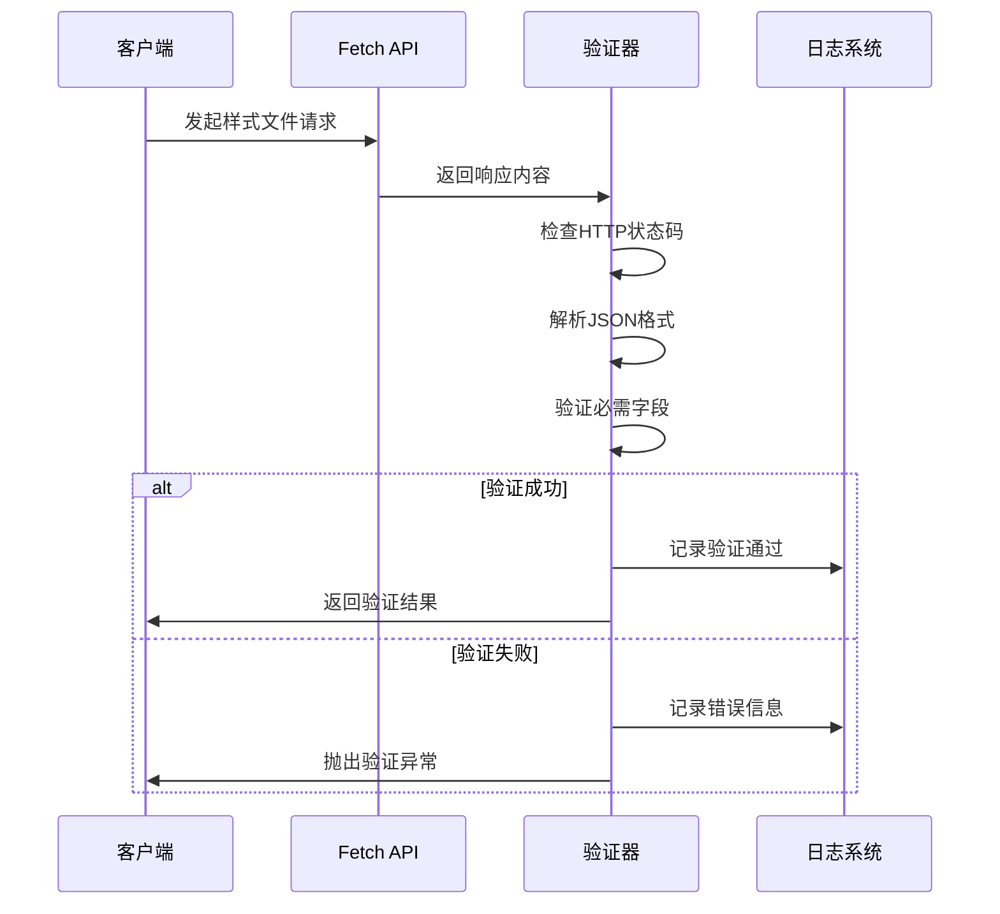
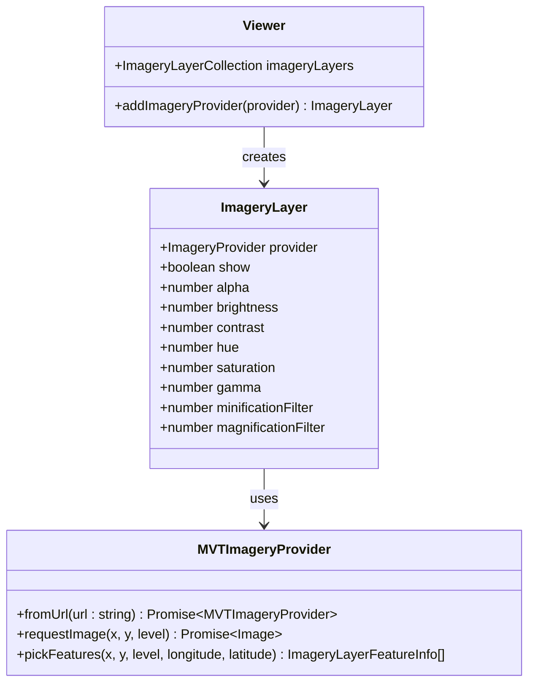
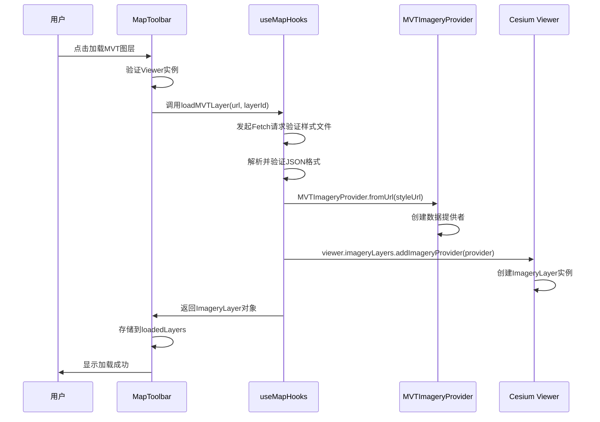
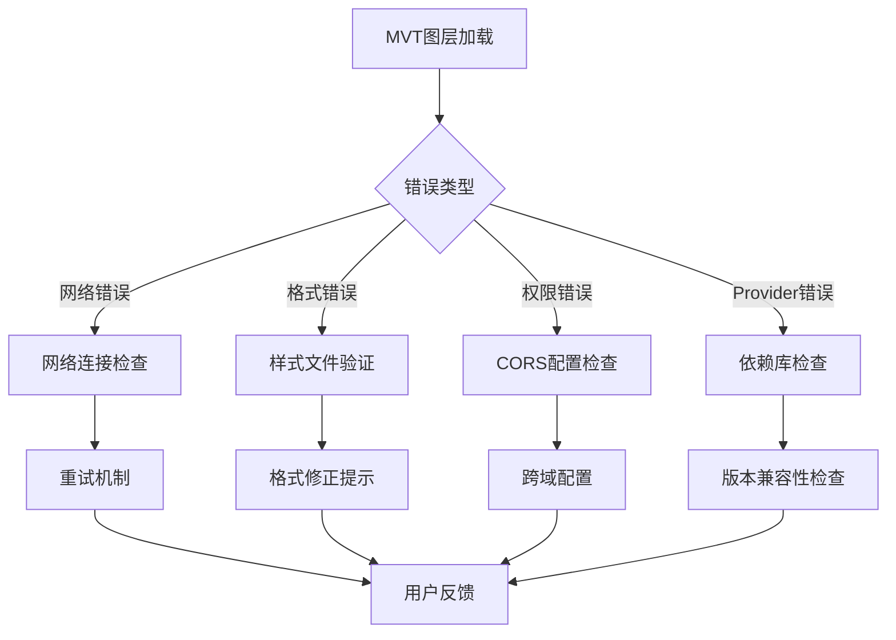
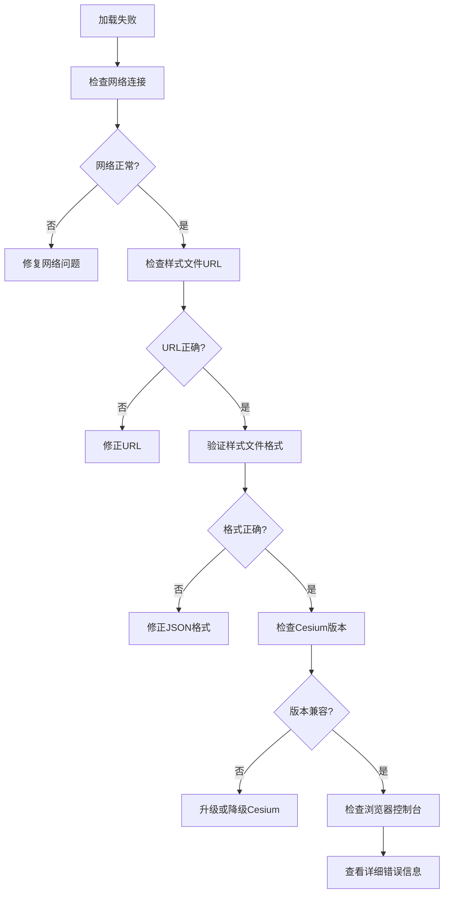

# MVT图层加载

<cite>
**本文档中引用的文件**
- [useMapHooks.ts](file://src/hook/useMapHooks.ts)
- [MapToolbar.vue](file://src/mapComponents/MapToolbar.vue)
- [Map.vue](file://src/mapComponents/Map.vue)
- [mapLayers.ts](file://src/stores/mapLayers.ts)
- [MAP_TOOLBAR_INTEGRATION.md](file://MAP_TOOLBAR_INTEGRATION.md)
- [package.json](file://package.json)
</cite>

## 目录
1. [简介](#简介)
2. [项目架构概览](#项目架构概览)
3. [MVT图层加载核心流程](#mvt图层加载核心流程)
4. [MVTImageryProvider.fromUrl详解](#mvtimageryproviderfromurl详解)
5. [样式文件验证机制](#样式文件验证机制)
6. [ImageryLayer与Provider的区别](#imagerylayer与provider的区别)
7. [完整加载流程分析](#完整加载流程分析)
8. [错误处理与调试](#错误处理与调试)
9. [最佳实践与注意事项](#最佳实践与注意事项)
10. [故障排除指南](#故障排除指南)

## 简介

MVT（Mapbox Vector Tiles）图层加载是政府Dashboard项目中的核心功能之一，它允许用户通过矢量瓦片技术高效地加载和显示大规模地理数据。本文档详细说明了`handleLoadMVT`方法如何通过`useMapHooks`中的`loadMVTLayer`函数实现MVT图层加载，重点阐述了MVTImageryProvider的使用方式、样式文件URL的传入格式以及fetch验证机制。

该项目基于Vue 3和Cesium构建，采用了现代化的地图开发架构，通过组合式API实现了地图功能的模块化和可复用性。

## 项目架构概览

政府Dashboard项目采用分层架构设计，主要包含以下核心组件：



**图表来源**
- [Map.vue](file://src/mapComponents/Map.vue#L1-L50)
- [MapToolbar.vue](file://src/mapComponents/MapToolbar.vue#L1-L50)
- [useMapHooks.ts](file://src/hook/useMapHooks.ts#L1-L32)

**章节来源**
- [Map.vue](file://src/mapComponents/Map.vue#L1-L100)
- [MapToolbar.vue](file://src/mapComponents/MapToolbar.vue#L1-L100)
- [useMapHooks.ts](file://src/hook/useMapHooks.ts#L1-L32)

## MVT图层加载核心流程

MVT图层加载的核心流程遵循严格的验证和初始化步骤，确保图层能够稳定可靠地加载：



**图表来源**
- [useMapHooks.ts](file://src/hook/useMapHooks.ts#L40-L93)

**章节来源**
- [useMapHooks.ts](file://src/hook/useMapHooks.ts#L40-L93)

## MVTImageryProvider.fromUrl详解

`MVTImageryProvider.fromUrl`是MVT图层加载的核心方法，它负责从指定的样式文件URL创建MVT数据提供者：

### 方法签名与参数

```typescript
async function loadMVTLayer(viewer: any, styleUrl: string): Promise<any>
```

- **viewer**: Cesium Viewer实例，必须具有`imageryLayers`属性
- **styleUrl**: 样式文件的URL路径，通常指向一个符合Mapbox Vector Tile规范的JSON文件
- **返回值**: Promise<ImageryLayer>对象，可用于控制图层的显隐和透明度

### 样式文件URL格式要求

样式文件URL必须满足以下要求：

1. **HTTP/HTTPS协议**: 必须使用安全的传输协议
2. **JSON格式**: 文件必须是有效的JSON格式
3. **Mapbox Vector Tile规范**: 符合Mapbox Vector Tile的样式规范
4. **跨域支持**: 如果样式文件位于不同域名，需要正确的CORS配置

### MVTImageryProvider工作原理

`MVTImageryProvider.fromUrl`方法的工作流程包括：

1. **网络请求**: 发起HTTP请求获取样式文件
2. **格式验证**: 验证JSON格式和必需字段
3. **数据解析**: 解析瓦片数据源和图层配置
4. **提供者创建**: 基于解析结果创建MVTImageryProvider实例
5. **图层绑定**: 将Provider绑定到Cesium的imageryLayers系统

**章节来源**
- [useMapHooks.ts](file://src/hook/useMapHooks.ts#L14-L16)
- [useMapHooks.ts](file://src/hook/useMapHooks.ts#L76-L77)

## 样式文件验证机制

样式文件验证是MVT图层加载过程中的关键环节，确保样式文件的完整性和兼容性：

### 验证步骤



**图表来源**
- [useMapHooks.ts](file://src/hook/useMapHooks.ts#L45-L74)

### 必需字段验证

样式文件必须包含以下三个核心字段：

| 字段名 | 类型 | 描述 | 必需性 |
|--------|------|------|--------|
| `version` | Number/String | 样式文件版本号 | 必需 |
| `sources` | Object | 数据源配置 | 必需 |
| `layers` | Array | 图层定义列表 | 必需 |

### 错误类型与处理

系统针对不同类型的错误提供了详细的错误信息：

- **网络错误**: HTTP 404、网络超时等
- **格式错误**: JSON解析失败、字段缺失等
- **权限错误**: CORS拒绝、认证失败等

**章节来源**
- [useMapHooks.ts](file://src/hook/useMapHooks.ts#L45-L74)

## ImageryLayer与Provider的区别

理解ImageryLayer和Provider之间的区别对于正确控制MVT图层至关重要：

### 架构对比



**图表来源**
- [useMapHooks.ts](file://src/hook/useMapHooks.ts#L18-L21)
- [useMapHooks.ts](file://src/hook/useMapHooks.ts#L80-L85)

### 功能差异

| 特性 | MVTImageryProvider | ImageryLayer |
|------|-------------------|--------------|
| **职责** | 数据提供者，负责获取瓦片数据 | 图层容器，负责显示和控制 |
| **显隐控制** | 无show属性 | 有show属性，可控制显示/隐藏 |
| **透明度控制** | 无alpha属性 | 有alpha属性，可设置透明度 |
| **样式控制** | 无样式属性 | 支持多种视觉效果控制 |
| **生命周期** | 数据提供阶段 | 图层显示阶段 |

### 返回ImageryLayer的重要性

`loadMVTLayer`函数返回ImageryLayer而非Provider的主要原因：

1. **显隐控制**: ImageryLayer具有`show`属性，可以直接控制图层的显示状态
2. **透明度调节**: ImageryLayer的`alpha`属性支持透明度设置
3. **样式管理**: ImageryLayer支持更丰富的视觉效果控制
4. **状态管理**: ImageryLayer可以被统一管理和追踪

**章节来源**
- [useMapHooks.ts](file://src/hook/useMapHooks.ts#L84-L85)
- [MAP_TOOLBAR_INTEGRATION.md](file://MAP_TOOLBAR_INTEGRATION.md#L180-L220)

## 完整加载流程分析

以下是MVT图层加载的完整流程，从触发到完成的每个步骤都经过精心设计：

### 触发阶段



**图表来源**
- [MapToolbar.vue](file://src/mapComponents/MapToolbar.vue#L147-L161)
- [useMapHooks.ts](file://src/hook/useMapHooks.ts#L40-L93)

### 关键代码路径

#### MapToolbar中的触发代码

MapToolbar组件负责接收用户的加载请求并协调整个加载过程：

```typescript
// MapToolbar.vue - handleLoadMVT函数
const handleLoadMVT = async (url: string, layerId: string) => {
  if (!props.viewerInstance) {
    console.warn("⚠️ Viewer 实例未就绪");
    return;
  }

  try {
    console.log(`🔄 加载MVT图层: ${url}`);
    
    // loadMVTLayer 返回的是 ImageryLayer 对象
    const imageryLayer = await cesiumUtils.loadMVTLayer(props.viewerInstance, url);
    loadedLayers.value.set(layerId, { type: "mvt", instance: imageryLayer });
    
    console.log(`✅ MVT图层加载成功: ${layerId}`);
  } catch (error: any) {
    // 错误处理逻辑
  }
};
```

#### useMapHooks中的核心实现

useMapHooks模块提供了MVT图层加载的核心功能：

```typescript
// useMapHooks.ts - loadMVTLayer函数
async function loadMVTLayer(viewer: any, styleUrl: string): Promise<any> {
  try {
    console.log(`开始加载MVT图层，样式URL: ${styleUrl}`);
    
    // 样式文件验证
    const response = await fetch(styleUrl);
    if (!response.ok) {
      throw new Error(`样式文件不存在: ${styleUrl} (HTTP ${response.status})`);
    }
    
    const styleJson = await response.json();
    
    // 字段验证
    if (!styleJson.version) {
      throw new Error('样式文件缺少 "version" 字段');
    }
    if (!styleJson.sources) {
      throw new Error('样式文件缺少 "sources" 字段');
    }
    if (!styleJson.layers) {
      throw new Error('样式文件缺少 "layers" 字段');
    }
    
    // 创建Provider
    const provider = await MVTImageryProvider.fromUrl(styleUrl);
    
    // 添加到图层系统
    if (viewer && viewer.imageryLayers) {
      const imageryLayer = viewer.imageryLayers.addImageryProvider(provider);
      console.log("✅ MVT图层加载成功");
      
      // 返回ImageryLayer对象
      return imageryLayer;
    } else {
      throw new Error("Viewer或imageryLayers不可用");
    }
  } catch (error) {
    console.error("❌ 加载MVT图层失败:", error);
    throw new Error(`Failed to load MVT layer: ${error}`);
  }
}
```

### 显隐控制实现

加载完成后，可以通过ImageryLayer对象控制图层的显示状态：

```typescript
// 图层显隐控制
const handleLayerToggle = (layerId: string, visible: boolean) => {
  const layer = loadedLayers.value.get(layerId);
  
  if (layer?.type === "mvt" && layer.instance) {
    layer.instance.show = visible;
    console.log(`✅ MVT图层已${visible ? '显示' : '隐藏'}: ${layerId}`);
  }
};

// 透明度控制
const handleLayerOpacityChange = (layerId: string, opacity: number) => {
  const layer = loadedLayers.value.get(layerId);
  
  if (layer?.type === "mvt" && layer.instance) {
    layer.instance.alpha = opacity;
    console.log(`✅ MVT图层透明度已设置: ${layerId} = ${opacity}`);
  }
};
```

**章节来源**
- [MapToolbar.vue](file://src/mapComponents/MapToolbar.vue#L147-L161)
- [useMapHooks.ts](file://src/hook/useMapHooks.ts#L40-L93)

## 错误处理与调试

完善的错误处理机制确保MVT图层加载的稳定性和用户体验：

### 错误分类与处理策略



**图表来源**
- [MapToolbar.vue](file://src/mapComponents/MapToolbar.vue#L162-L183)

### 常见错误及解决方案

| 错误类型 | 错误信息 | 解决方案 |
|----------|----------|----------|
| **404错误** | "样式文件不存在" | 检查URL路径和服务器配置 |
| **格式错误** | "样式文件格式错误" | 验证JSON格式和必需字段 |
| **CORS错误** | "跨域访问被拒绝" | 配置服务器CORS头 |
| **Provider错误** | "Provider创建失败" | 检查mvt-imagery-provider版本 |
| **Viewer错误** | "Viewer不可用" | 确认Cesium Viewer已初始化 |

### 调试技巧

1. **控制台日志**: 利用console.log输出详细的调试信息
2. **错误捕获**: 使用try-catch块捕获和处理异常
3. **状态监控**: 监控loadedLayers的状态变化
4. **网络检查**: 使用浏览器开发者工具检查网络请求

**章节来源**
- [MapToolbar.vue](file://src/mapComponents/MapToolbar.vue#L162-L183)
- [useMapHooks.ts](file://src/hook/useMapHooks.ts#L90-L92)

## 最佳实践与注意事项

为了确保MVT图层加载功能的稳定性和性能，建议遵循以下最佳实践：

### 性能优化建议

1. **懒加载策略**: 只在需要时加载MVT图层
2. **缓存机制**: 缓存已加载的样式文件和图层实例
3. **并发控制**: 限制同时加载的图层数量
4. **内存管理**: 及时清理不需要的图层资源

### 安全考虑

1. **URL验证**: 验证样式文件URL的安全性
2. **CORS配置**: 正确配置跨域资源共享
3. **输入过滤**: 过滤用户输入的URL参数
4. **权限控制**: 实施适当的访问控制机制

### 兼容性处理

1. **浏览器兼容**: 确保支持目标浏览器
2. **Cesium版本**: 兼容不同版本的Cesium库
3. **网络环境**: 处理弱网和离线情况
4. **移动端适配**: 优化移动端用户体验

### 代码组织建议

1. **模块化设计**: 将功能拆分为独立的模块
2. **类型安全**: 使用TypeScript确保类型安全
3. **错误边界**: 实现适当的错误边界处理
4. **测试覆盖**: 编写全面的单元测试和集成测试

**章节来源**
- [useMapHooks.ts](file://src/hook/useMapHooks.ts#L1-L32)
- [MAP_TOOLBAR_INTEGRATION.md](file://MAP_TOOLBAR_INTEGRATION.md#L376-L410)

## 故障排除指南

当MVT图层加载出现问题时，可以按照以下步骤进行排查：

### 诊断流程



### 常见问题解决

1. **样式文件404错误**
   - 检查文件路径是否正确
   - 确认服务器配置和文件权限
   - 验证CORS设置

2. **JSON格式错误**
   - 使用JSON验证工具检查语法
   - 确认必需字段的存在
   - 验证数据类型和格式

3. **CORS跨域问题**
   - 配置服务器CORS头
   - 使用代理服务器
   - 检查浏览器安全策略

4. **Provider创建失败**
   - 检查mvt-imagery-provider版本
   - 确认Cesium库的正确加载
   - 验证依赖项的完整性

### 调试工具和技巧

1. **浏览器开发者工具**: 使用Network标签页检查请求
2. **控制台日志**: 查看详细的错误堆栈信息
3. **断点调试**: 在关键位置设置断点
4. **性能分析**: 使用Performance标签页分析性能

**章节来源**
- [MapToolbar.vue](file://src/mapComponents/MapToolbar.vue#L162-L183)
- [useMapHooks.ts](file://src/hook/useMapHooks.ts#L90-L92)

## 结论

MVT图层加载功能是政府Dashboard项目中的重要组成部分，通过精心设计的架构和完善的错误处理机制，确保了地图功能的稳定性和用户体验。本文档详细阐述了从`handleLoadMVT`方法到`loadMVTLayer`函数的完整实现过程，重点强调了ImageryLayer与Provider的区别，以及显隐控制和透明度调节的实现方式。

通过遵循本文档提供的最佳实践和故障排除指南，开发者可以有效地集成和维护MVT图层加载功能，为用户提供高质量的地图服务体验。