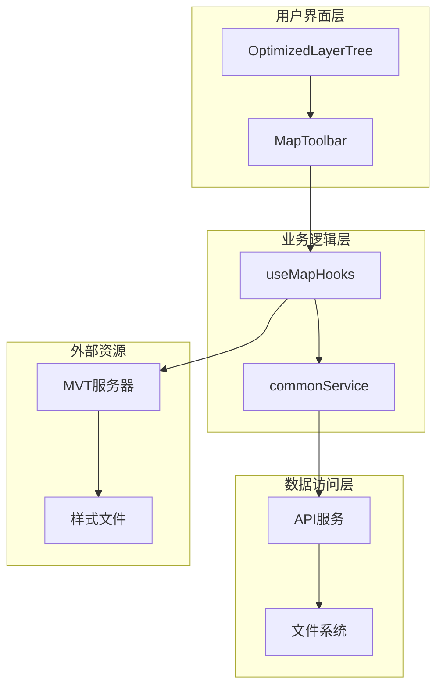
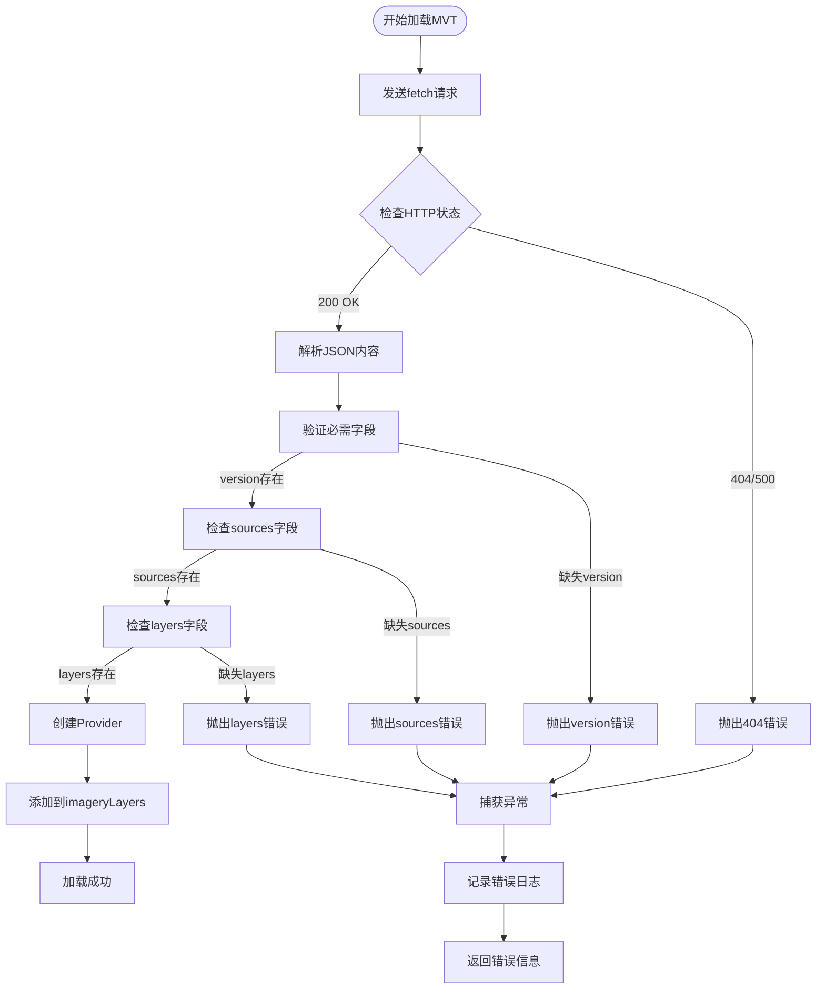
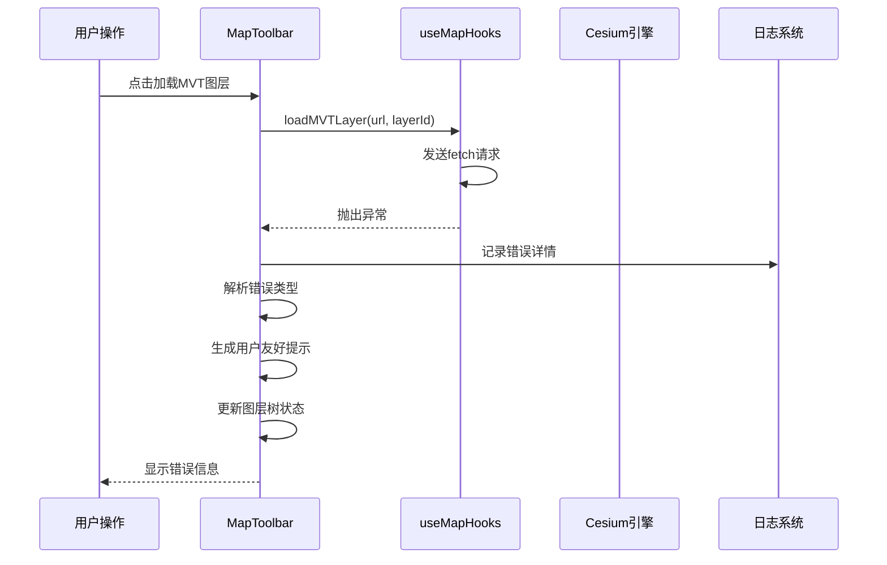
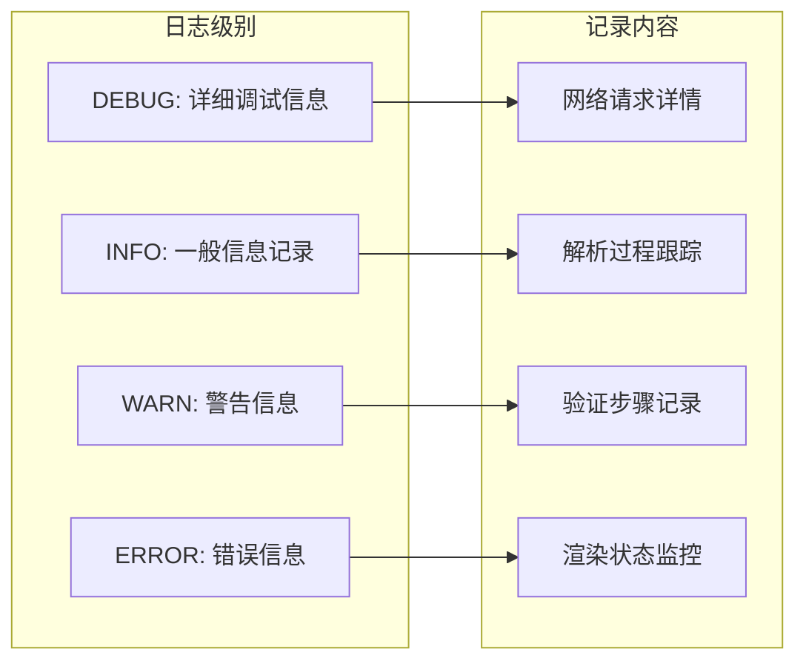

# MVT图层加载错误处理

<cite>
**本文档引用的文件**
- [useMapHooks.ts](file://src/hook/useMapHooks.ts)
- [MapToolbar.vue](file://src/mapComponents/MapToolbar.vue)
- [OptimizedLayerTree.vue](file://src/mapComponents/OptimizedLayerTree.vue)
- [commonService.ts](file://src/services/commonService.ts)
- [mapStore.ts](file://src/stores/mapStore.ts)
- [yangxin.json](file://public/yangxin.json)
</cite>

## 目录
1. [概述](#概述)
2. [系统架构](#系统架构)
3. [核心错误类型](#核心错误类型)
4. [错误处理机制](#错误处理机制)
5. [用户友好提示](#用户友好提示)
6. [调试指南](#调试指南)
7. [故障排除清单](#故障排除清单)
8. [最佳实践](#最佳实践)

## 概述

MVT（Mapbox Vector Tiles）图层加载错误处理系统是一个多层次的错误监控和用户反馈机制，旨在确保地图应用在面对各种网络和配置问题时能够优雅地降级，并向用户提供清晰的错误信息。

该系统主要由以下组件构成：
- **useMapHooks.ts**：提供核心的MVT图层加载逻辑和错误捕获
- **MapToolbar.vue**：负责用户界面交互和错误状态展示
- **OptimizedLayerTree.vue**：管理图层树状态和UI反馈
- **错误处理管道**：从底层网络请求到用户界面的完整错误链路

## 系统架构



**图表来源**
- [MapToolbar.vue](file://src/mapComponents/MapToolbar.vue#L1-L50)
- [useMapHooks.ts](file://src/hook/useMapHooks.ts#L1-L100)
- [commonService.ts](file://src/services/commonService.ts#L85-L95)

## 核心错误类型

### 1. 网络请求错误

#### 样式文件不存在（404错误）
- **触发条件**：样式文件URL无效或文件不存在
- **错误特征**：HTTP 404状态码
- **处理策略**：立即终止加载流程，显示"样式文件不存在"

#### 网络连接超时
- **触发条件**：网络延迟过高或服务器无响应
- **错误特征**：Fetch请求超时
- **处理策略**：重试机制，显示"网络连接失败"

#### CORS跨域问题
- **触发条件**：服务器未正确配置CORS头
- **错误特征**：浏览器安全策略阻止请求
- **处理策略**：显示"跨域访问被拒绝"

### 2. 样式文件格式错误

#### 缺少必需字段
- **version字段缺失**：Mapbox规范要求的版本标识
- **sources字段缺失**：数据源定义
- **layers字段缺失**：图层配置信息

#### JSON格式错误
- **语法错误**：JSON字符串格式不正确
- **编码问题**：字符编码不匹配
- **大小限制**：文件过大导致解析失败

### 3. 内部处理错误

#### Cesium初始化失败
- **场景模式不匹配**：2D/3D模式冲突
- **内存不足**：系统资源耗尽
- **版本兼容性**：Cesium版本不兼容

#### 图层实例化失败
- **Provider创建失败**：MVTImageryProvider初始化错误
- **图层添加失败**：imageryLayers.addImageryProvider调用失败

**章节来源**
- [useMapHooks.ts](file://src/hook/useMapHooks.ts#L44-L74)
- [MapToolbar.vue](file://src/mapComponents/MapToolbar.vue#L169-L177)

## 错误处理机制

### fetch预检机制

系统在加载MVT图层前会进行预检验证，确保样式文件的有效性：



**图表来源**
- [useMapHooks.ts](file://src/hook/useMapHooks.ts#L44-L74)

### try-catch异常捕获

系统采用多层异常捕获机制：

1. **网络层捕获**：处理fetch请求异常
2. **解析层捕获**：处理JSON解析异常
3. **验证层捕获**：处理样式文件格式验证异常
4. **渲染层捕获**：处理Cesium渲染异常

### 错误传播链



**图表来源**
- [MapToolbar.vue](file://src/mapComponents/MapToolbar.vue#L147-L184)
- [useMapHooks.ts](file://src/hook/useMapHooks.ts#L40-L92)

**章节来源**
- [useMapHooks.ts](file://src/hook/useMapHooks.ts#L40-L92)
- [MapToolbar.vue](file://src/mapComponents/MapToolbar.vue#L147-L184)

## 用户友好提示

### 错误信息映射表

| 原始错误信息 | 用户友好提示 | 显示场景 |
|-------------|-------------|----------|
| `404` 或 `不存在` | 样式文件不存在 | 样式文件路径错误 |
| `version` 字段缺失 | 样式文件格式错误 | Mapbox规范不兼容 |
| `sources` 字段缺失 | 样式文件格式错误 | 数据源配置错误 |
| `layers` 字段缺失 | 样式文件格式错误 | 图层配置错误 |
| `404` 或 `Failed to fetch` | 3D模型文件不存在 | 3D Tiles资源缺失 |
| `not a function` | Cesium版本不兼容 | 版本兼容性问题 |

### 图层树UI状态更新

系统通过`updateLayerState`方法更新图层树的UI状态：

```mermaid
stateDiagram-v2
[*] --> Loading : 开始加载
Loading --> Success : 加载成功
Loading --> Error : 加载失败
Success --> [*] : 移除状态
Error --> Loading : 重试加载
Error --> [*] : 清除错误
note right of Error : 显示用户友好错误信息<br/>error : "样式文件不存在"<br/>loading : false
```

**图表来源**
- [OptimizedLayerTree.vue](file://src/mapComponents/OptimizedLayerTree.vue#L417-L434)

### 实时状态反馈

系统提供实时的状态反馈机制：

1. **加载中状态**：显示旋转动画
2. **成功状态**：显示✓图标
3. **错误状态**：显示红色警告图标
4. **重试按钮**：提供重新加载选项

**章节来源**
- [MapToolbar.vue](file://src/mapComponents/MapToolbar.vue#L166-L183)
- [OptimizedLayerTree.vue](file://src/mapComponents/OptimizedLayerTree.vue#L417-L434)

## 调试指南

### 日志记录策略

系统采用分级日志记录：



### 调试工具和技巧

#### 1. 浏览器开发者工具
- **Network面板**：监控网络请求状态和响应时间
- **Console面板**：查看详细的错误堆栈信息
- **Application面板**：检查本地存储和缓存状态

#### 2. 网络诊断
```javascript
// 网络连通性测试
fetch('/style.json', { method: 'HEAD' })
  .then(response => console.log('网络可用:', response.ok))
  .catch(error => console.error('网络错误:', error));

// CORS检测
fetch('/style.json', { mode: 'cors' })
  .then(response => console.log('CORS正常'))
  .catch(error => console.error('CORS问题:', error));
```

#### 3. 样式文件验证
```javascript
// JSON格式验证
fetch('/style.json')
  .then(response => response.json())
  .then(data => console.log('JSON格式正确'))
  .catch(error => console.error('JSON格式错误:', error));
```

### 性能监控

系统内置性能监控机制：

1. **加载时间监控**：记录各阶段耗时
2. **内存使用监控**：跟踪内存占用情况
3. **错误频率统计**：分析错误发生规律

**章节来源**
- [useMapHooks.ts](file://src/hook/useMapHooks.ts#L42-L92)
- [MapToolbar.vue](file://src/mapComponents/MapToolbar.vue#L153-L161)

## 故障排除清单

### 常见问题及解决方案

#### 1. 样式文件加载失败

**症状**：图层无法显示，控制台出现404错误

**排查步骤**：
1. 检查样式文件URL是否正确
2. 验证文件是否存在且可访问
3. 确认服务器CORS配置
4. 检查网络连接状态

**解决方案**：
```typescript
// URL验证示例
const isValidUrl = (url: string): boolean => {
  try {
    new URL(url);
    return true;
  } catch (e) {
    return false;
  }
};
```

#### 2. 样式文件格式错误

**症状**：出现"样式文件格式错误"提示

**排查步骤**：
1. 验证JSON语法正确性
2. 检查必需字段完整性
3. 确认Mapbox规范兼容性

**解决方案**：
```json
{
  "version": 8,
  "sources": {
    "vector-tiles": {
      "type": "vector",
      "url": "https://example.com/tiles.json"
    }
  },
  "layers": []
}
```

#### 3. Cesium渲染问题

**症状**：图层加载但不显示

**排查步骤**：
1. 检查Cesium版本兼容性
2. 验证场景模式设置
3. 确认GPU支持情况

#### 4. 性能问题

**症状**：加载缓慢或卡顿

**排查步骤**：
1. 监控网络带宽使用
2. 检查系统内存占用
3. 分析瓦片数据大小

### 自动化诊断脚本

```typescript
// 诊断脚本示例
async function diagnoseMVTLoading(url: string): Promise<void> {
  console.log('开始MVT加载诊断...');
  
  // 1. 网络连通性检查
  try {
    const response = await fetch(url, { method: 'HEAD' });
    console.log(`网络状态: ${response.ok} (${response.status})`);
  } catch (error) {
    console.error('网络连接失败:', error);
  }
  
  // 2. JSON格式检查
  try {
    const response = await fetch(url);
    const json = await response.json();
    console.log('JSON格式验证通过');
    
    // 3. 必需字段检查
    const requiredFields = ['version', 'sources', 'layers'];
    const missingFields = requiredFields.filter(field => !json[field]);
    
    if (missingFields.length > 0) {
      console.error('缺少必需字段:', missingFields);
    } else {
      console.log('样式文件格式正确');
    }
  } catch (error) {
    console.error('JSON解析失败:', error);
  }
}
```

**章节来源**
- [useMapHooks.ts](file://src/hook/useMapHooks.ts#L44-L74)
- [MapToolbar.vue](file://src/mapComponents/MapToolbar.vue#L169-L177)

## 最佳实践

### 1. 错误预防策略

#### URL验证
```typescript
// 完整的URL验证函数
function validateMVTUrl(url: string): boolean {
  try {
    const parsedUrl = new URL(url);
    
    // 检查协议
    if (!['http:', 'https:'].includes(parsedUrl.protocol)) {
      return false;
    }
    
    // 检查文件扩展名
    const pathname = parsedUrl.pathname.toLowerCase();
    if (!pathname.endsWith('.json') && !pathname.includes('style.json')) {
      return false;
    }
    
    return true;
  } catch {
    return false;
  }
}
```

#### 样式文件预验证
```typescript
// 样式文件结构验证
function validateStyleStructure(styleJson: any): boolean {
  const requiredFields = ['version', 'sources', 'layers'];
  
  for (const field of requiredFields) {
    if (!(field in styleJson)) {
      console.warn(`样式文件缺少必需字段: ${field}`);
      return false;
    }
  }
  
  // 验证字段类型
  if (typeof styleJson.version !== 'number') {
    console.warn('version字段必须是数字');
    return false;
  }
  
  if (typeof styleJson.sources !== 'object' || styleJson.sources === null) {
    console.warn('sources字段必须是对象');
    return false;
  }
  
  if (!Array.isArray(styleJson.layers)) {
    console.warn('layers字段必须是数组');
    return false;
  }
  
  return true;
}
```

### 2. 用户体验优化

#### 渐进式加载
```typescript
// 渐进式加载策略
async function loadMVTWithProgress(url: string): Promise<any> {
  const progressCallback = (progress: number) => {
    // 更新进度指示器
    updateProgressBar(progress);
  };
  
  try {
    // 第一阶段：网络连接
    progressCallback(20);
    const response = await fetch(url);
    
    // 第二阶段：文件下载
    progressCallback(50);
    const styleJson = await response.json();
    
    // 第三阶段：样式验证
    progressCallback(70);
    if (!validateStyleStructure(styleJson)) {
      throw new Error('样式文件格式验证失败');
    }
    
    // 第四阶段：图层创建
    progressCallback(90);
    const provider = await MVTImageryProvider.fromUrl(url);
    
    // 第五阶段：最终渲染
    progressCallback(100);
    return provider;
    
  } catch (error) {
    progressCallback(-1); // 显示错误状态
    throw error;
  }
}
```

#### 错误恢复机制
```typescript
// 自动重试机制
async function loadWithRetry(url: string, maxRetries: number = 3): Promise<any> {
  let lastError: Error;
  
  for (let i = 0; i < maxRetries; i++) {
    try {
      return await loadMVTLayer(url);
    } catch (error) {
      lastError = error;
      console.warn(`加载失败，重试 ${i + 1}/${maxRetries}`);
      
      // 指数退避
      await new Promise(resolve => 
        setTimeout(resolve, Math.pow(2, i) * 1000)
      );
    }
  }
  
  throw lastError;
}
```

### 3. 监控和告警

#### 错误统计
```typescript
// 错误统计模块
class ErrorStatistics {
  private errors = new Map<string, number>();
  
  recordError(errorType: string): void {
    const count = this.errors.get(errorType) || 0;
    this.errors.set(errorType, count + 1);
    
    // 超过阈值时发送告警
    if (count > 10) {
      this.sendAlert(errorType);
    }
  }
  
  sendAlert(errorType: string): void {
    // 发送告警通知
    console.error(`频繁错误告警: ${errorType}`);
  }
}
```

#### 性能指标
```typescript
// 性能监控
class PerformanceMonitor {
  private metrics = new Map<string, number[]>();
  
  recordMetric(name: string, value: number): void {
    const values = this.metrics.get(name) || [];
    values.push(value);
    
    if (values.length > 100) {
      values.shift(); // 保留最近100个数据点
    }
    
    this.metrics.set(name, values);
  }
  
  getAverageMetric(name: string): number {
    const values = this.metrics.get(name) || [];
    return values.reduce((sum, val) => sum + val, 0) / values.length;
  }
}
```

### 4. 文档和培训

#### 错误处理文档模板
```markdown
# MVT图层加载错误处理指南

## 错误类型：{{ error_type }}
- **错误描述**：{{ error_description }}
- **触发条件**：{{ trigger_conditions }}
- **解决步骤**：
  1. {{ step_1 }}
  2. {{ step_2 }}
  3. {{ step_3 }}
- **相关配置**：{{ related_config }}
- **影响范围**：{{ impact_scope }}
```

#### 团队培训材料
- **错误识别训练**：帮助团队成员快速识别常见错误类型
- **调试技能培养**：提供系统性的调试方法和工具使用指导
- **最佳实践分享**：定期分享错误处理经验和优化案例

通过实施这些最佳实践，可以显著提高系统的稳定性和用户体验，同时降低维护成本和用户投诉率。

**章节来源**
- [useMapHooks.ts](file://src/hook/useMapHooks.ts#L1-L93)
- [MapToolbar.vue](file://src/mapComponents/MapToolbar.vue#L1-L504)