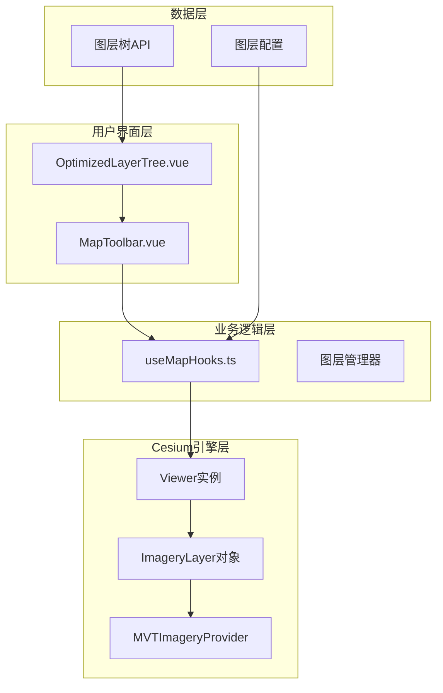
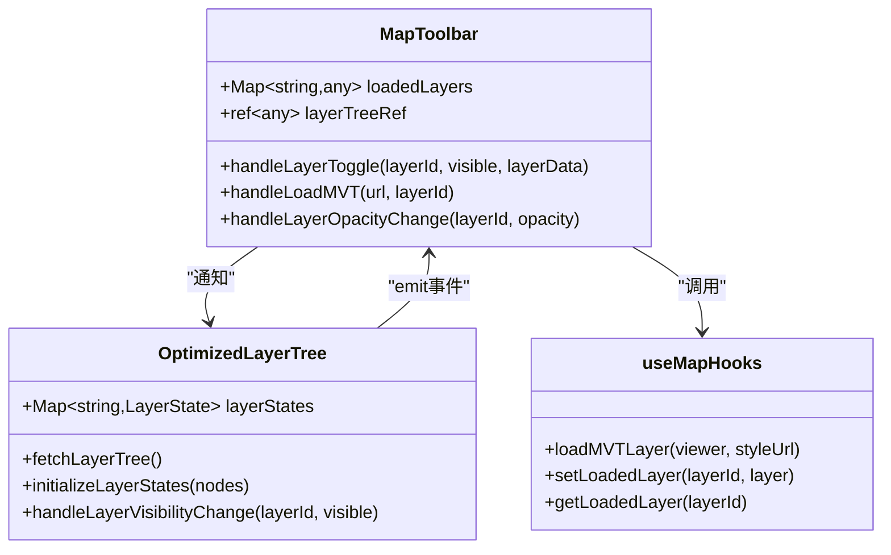
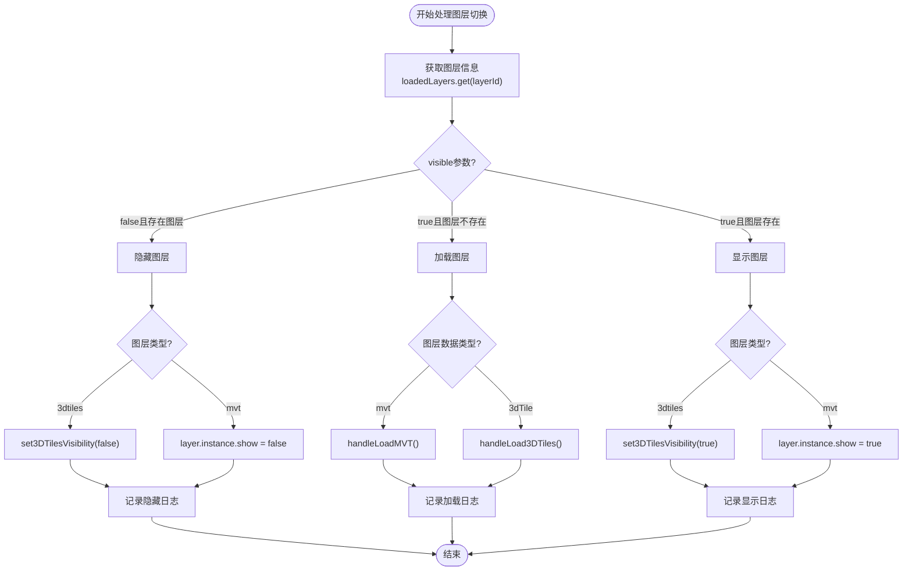
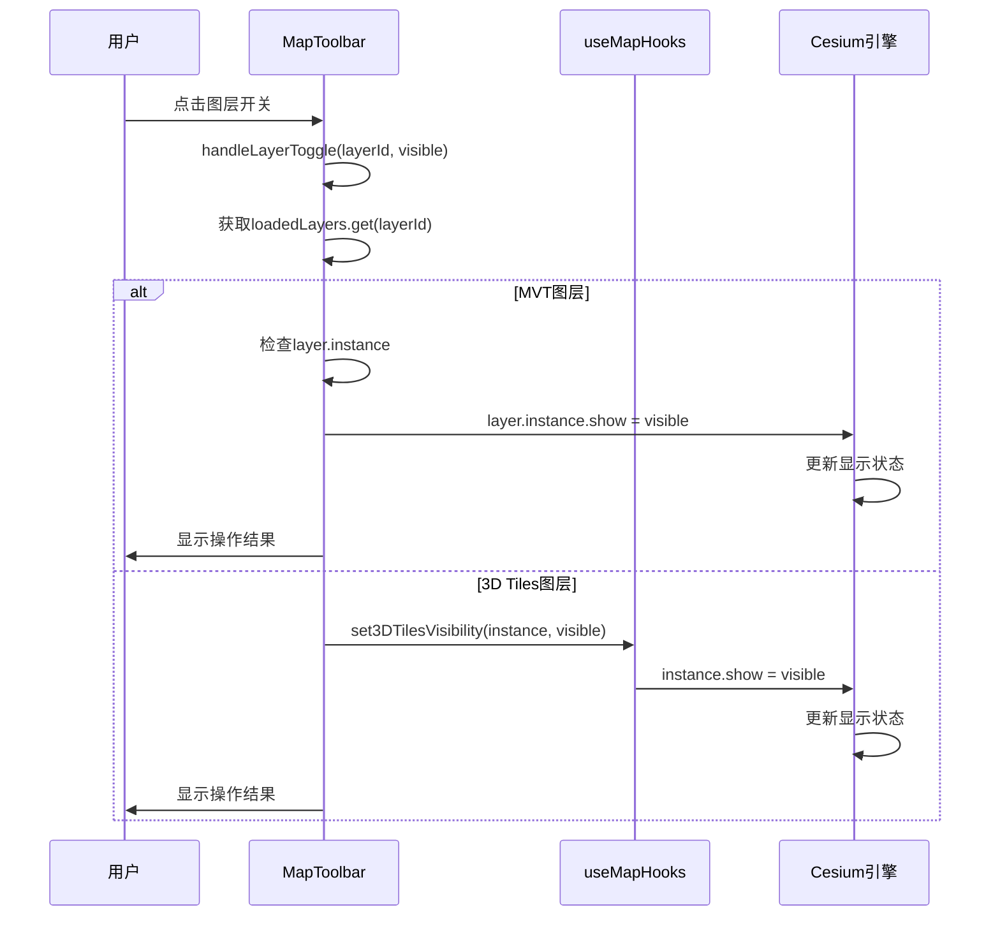
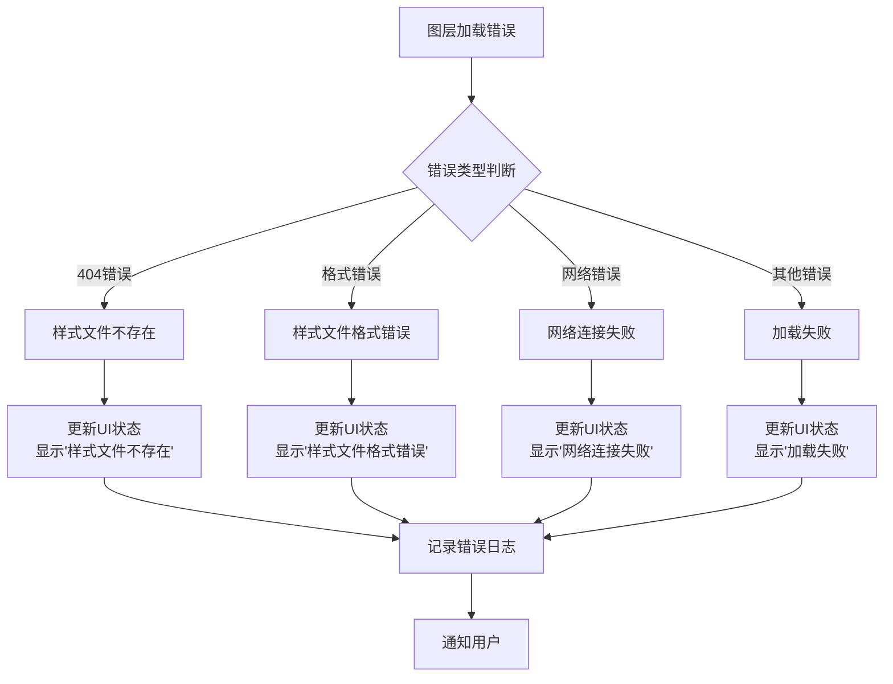
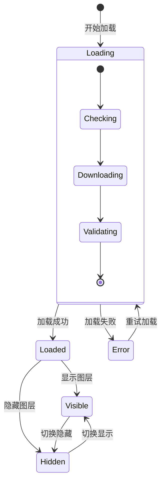
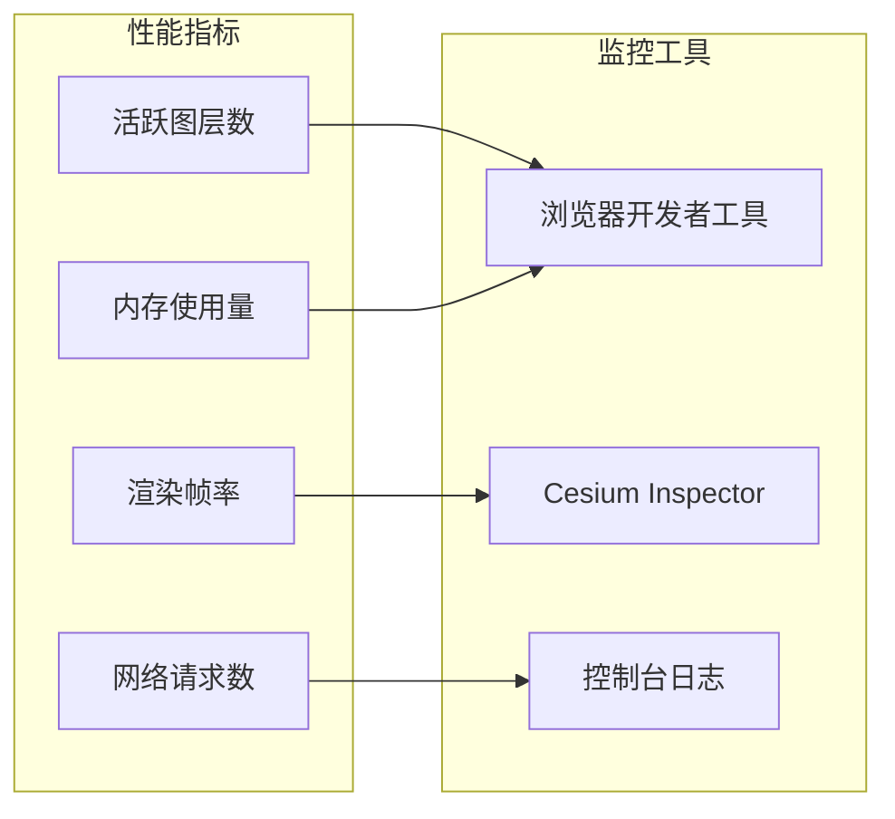

# MVT图层显隐控制

<cite>
**本文档中引用的文件**
- [MAP_TOOLBAR_INTEGRATION.md](file://MAP_TOOLBAR_INTEGRATION.md)
- [MapToolbar.vue](file://src/mapComponents/MapToolbar.vue)
- [useMapHooks.ts](file://src/hook/useMapHooks.ts)
- [OptimizedLayerTree.vue](file://src/mapComponents/OptimizedLayerTree.vue)
- [common.ts](file://src/api/common.ts)
</cite>

## 目录
1. [概述](#概述)
2. [系统架构](#系统架构)
3. [核心组件分析](#核心组件分析)
4. [handleLayerToggle方法详解](#handlelayertoggle方法详解)
5. [ImageryLayer对象的重要性](#imagerylayer对象的重要性)
6. [错误处理机制](#错误处理机制)
7. [用户反馈系统](#用户反馈系统)
8. [最佳实践](#最佳实践)
9. [故障排除指南](#故障排除指南)

## 概述

MVT（Mapbox Vector Tiles）图层显隐控制是政府Dashboard地图系统中的核心功能之一。该功能通过MapToolbar组件实现，允许用户动态显示或隐藏MVT矢量瓦片图层，同时提供完整的错误处理和用户反馈机制。

系统采用Vue 3组合式API设计，结合Cesium地图引擎，实现了高效的图层管理和用户交互体验。

## 系统架构



**图表来源**
- [MapToolbar.vue](file://src/mapComponents/MapToolbar.vue#L1-L504)
- [useMapHooks.ts](file://src/hook/useMapHooks.ts#L1-L545)
- [OptimizedLayerTree.vue](file://src/mapComponents/OptimizedLayerTree.vue#L1-L200)

## 核心组件分析

### MapToolbar组件

MapToolbar是地图工具栏的核心组件，负责处理用户的所有图层操作请求。该组件维护着一个`loadedLayers`响应式映射表，存储所有已加载图层的实例信息。



**图表来源**
- [MapToolbar.vue](file://src/mapComponents/MapToolbar.vue#L108-L110)
- [OptimizedLayerTree.vue](file://src/mapComponents/OptimizedLayerTree.vue#L100-L112)
- [useMapHooks.ts](file://src/hook/useMapHooks.ts#L33-L545)

**章节来源**
- [MapToolbar.vue](file://src/mapComponents/MapToolbar.vue#L1-L504)
- [OptimizedLayerTree.vue](file://src/mapComponents/OptimizedLayerTree.vue#L1-L200)

## handleLayerToggle方法详解

`handleLayerToggle`方法是MVT图层显隐控制的核心逻辑，位于MapToolbar组件中。该方法根据图层类型执行不同的显示/隐藏操作。

### 方法流程图



**图表来源**
- [MapToolbar.vue](file://src/mapComponents/MapToolbar.vue#L227-L266)

### MVT图层显隐控制逻辑

当处理MVT图层时，系统会执行以下关键步骤：

1. **图层实例验证**：确保`layer.instance`存在
2. **属性设置**：直接操作`ImageryLayer`对象的`show`属性
3. **状态同步**：更新图层树的状态显示

**章节来源**
- [MapToolbar.vue](file://src/mapComponents/MapToolbar.vue#L227-L266)

## ImageryLayer对象的重要性

### 关键修复说明

在MAP_TOOLBAR_INTEGRATION.md中详细描述了关键的技术修复：

```typescript
// ❌ 错误实现 - 返回Provider而非ImageryLayer
async loadMVTLayer(viewer: any, styleUrl: string): Promise<any> {
  const provider = await MVTImageryProvider.fromUrl(styleUrl);
  viewer.imageryLayers.addImageryProvider(provider);
  return provider; // ❌ Provider没有show属性
}

// ✅ 正确实现 - 返回ImageryLayer对象
async loadMVTLayer(viewer: any, styleUrl: string): Promise<any> {
  const provider = await MVTImageryProvider.fromUrl(styleUrl);
  // addImageryProvider返回ImageryLayer对象
  const imageryLayer = viewer.imageryLayers.addImageryProvider(provider);
  return imageryLayer; // ✅ ImageryLayer有show属性
}
```

### ImageryLayer vs Provider的区别

| 特性 | MVTImageryProvider | ImageryLayer |
|------|-------------------|--------------|
| **用途** | 提供瓦片数据 | 管理显示状态 |
| **show属性** | ❌ 不存在 | ✅ 存在，可控制显隐 |
| **alpha属性** | ❌ 不存在 | ✅ 存在，可控制透明度 |
| **生命周期** | 数据提供者 | 完整的图层实例 |
| **控制能力** | 仅提供数据 | 完全控制显示效果 |

### 显隐控制实现



**图表来源**
- [MapToolbar.vue](file://src/mapComponents/MapToolbar.vue#L240-L264)
- [useMapHooks.ts](file://src/hook/useMapHooks.ts#L158-L163)

**章节来源**
- [MAP_TOOLBAR_INTEGRATION.md](file://MAP_TOOLBAR_INTEGRATION.md#L180-L221)
- [useMapHooks.ts](file://src/hook/useMapHooks.ts#L40-L93)

## 错误处理机制

### 加载错误分类

系统实现了完善的错误处理机制，针对不同类型的错误提供相应的用户友好提示：



**图表来源**
- [MapToolbar.vue](file://src/mapComponents/MapToolbar.vue#L165-L184)

### 错误处理策略

| 错误类型 | 检测方式 | 用户提示 | 日志记录 |
|----------|----------|----------|----------|
| **样式文件不存在** | HTTP 404状态码 | "样式文件不存在" | 详细错误信息 |
| **样式格式错误** | JSON字段缺失 | "样式文件格式错误" | 字段验证详情 |
| **网络超时** | Fetch超时 | "网络连接失败" | 超时时间戳 |
| **Cesium初始化失败** | Viewer实例检查 | "地图初始化失败" | 初始化状态 |

**章节来源**
- [MapToolbar.vue](file://src/mapComponents/MapToolbar.vue#L153-L195)

## 用户反馈系统

### 图层树状态更新

系统通过`OptimizedLayerTree`组件实时更新图层状态，提供直观的视觉反馈：



### 状态同步机制

1. **实时状态更新**：加载过程中显示加载状态
2. **错误状态标记**：加载失败时显示错误图标
3. **进度指示**：长时间加载时显示进度条
4. **操作确认**：显隐操作完成后显示成功日志

**章节来源**
- [OptimizedLayerTree.vue](file://src/mapComponents/OptimizedLayerTree.vue#L145-L162)

## 最佳实践

### 性能优化建议

1. **懒加载策略**：仅在需要时加载图层
2. **缓存机制**：复用已加载的图层实例
3. **批量操作**：合并多个图层操作以减少重绘
4. **内存管理**：及时释放不需要的图层资源

### 代码质量保证

1. **类型安全**：使用TypeScript确保类型正确
2. **错误边界**：每个异步操作都有适当的错误处理
3. **日志记录**：关键操作都有详细的日志输出
4. **单元测试**：为核心功能编写测试用例

### 用户体验优化

1. **即时反馈**：用户操作立即得到视觉反馈
2. **状态持久化**：保存用户的图层显示偏好
3. **无障碍支持**：提供键盘导航和屏幕阅读器支持
4. **响应式设计**：适配不同屏幕尺寸

## 故障排除指南

### 常见问题及解决方案

| 问题症状 | 可能原因 | 解决方案 |
|----------|----------|----------|
| **图层无法显示** | ImageryLayer对象未正确返回 | 检查loadMVTLayer返回值 |
| **显隐控制失效** | 使用Provider而非ImageryLayer | 确保返回ImageryLayer对象 |
| **样式文件加载失败** | 网络连接或文件路径错误 | 验证URL和网络连接 |
| **透明度调节无效** | 图层类型判断错误 | 检查图层类型检测逻辑 |

### 调试技巧

1. **控制台日志**：启用详细日志输出
2. **开发者工具**：使用浏览器开发者工具检查网络请求
3. **Cesium Inspector**：使用Cesium内置调试工具
4. **状态监控**：监控`loadedLayers`映射表状态

### 性能监控



**章节来源**
- [MAP_TOOLBAR_INTEGRATION.md](file://MAP_TOOLBAR_INTEGRATION.md#L440-L540)

## 结论

MVT图层显隐控制系统通过精心设计的架构和完善的错误处理机制，为用户提供了一个稳定可靠的图层管理功能。关键的技术改进包括：

1. **正确的ImageryLayer返回**：确保显隐控制功能正常工作
2. **完善的错误处理**：提供用户友好的错误提示
3. **实时状态同步**：保持UI状态与实际图层状态一致
4. **性能优化**：通过懒加载和缓存提升用户体验

该系统的设计充分体现了现代Web应用的最佳实践，为后续的功能扩展奠定了坚实的基础。