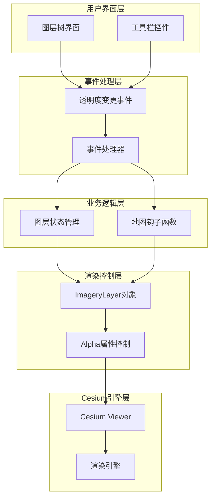
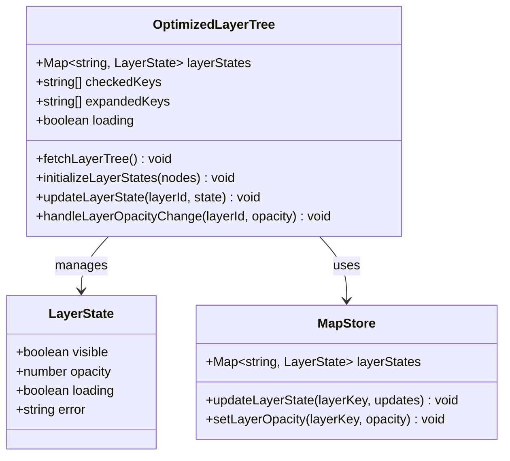
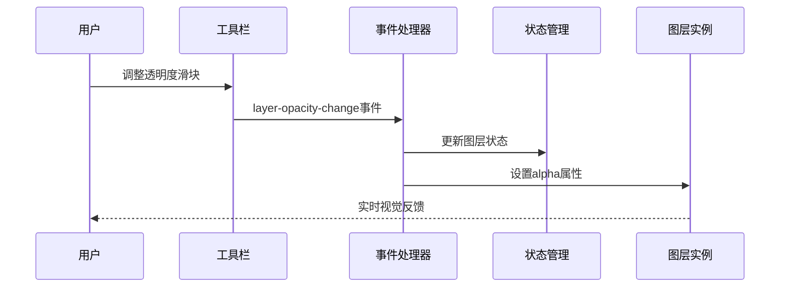
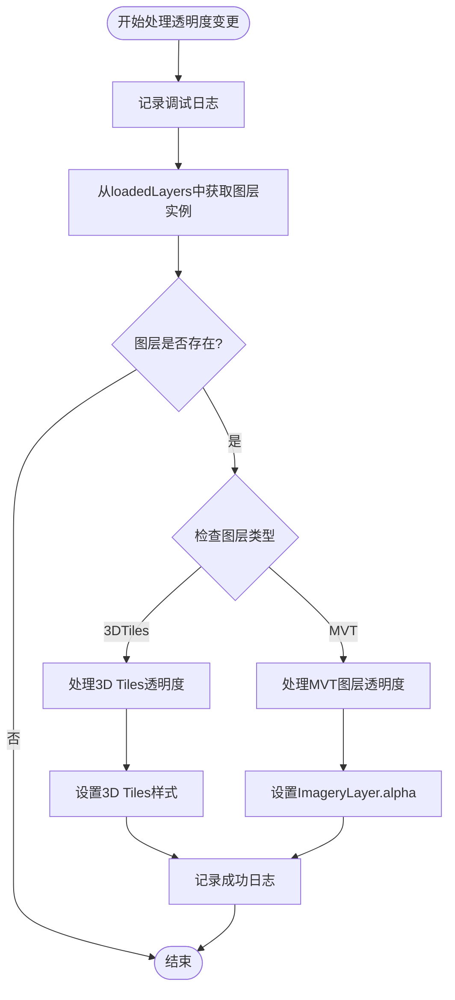
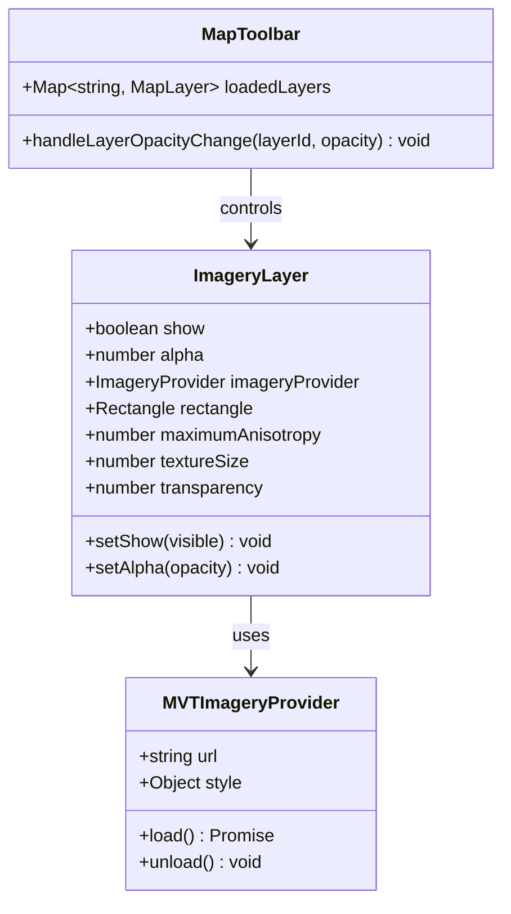
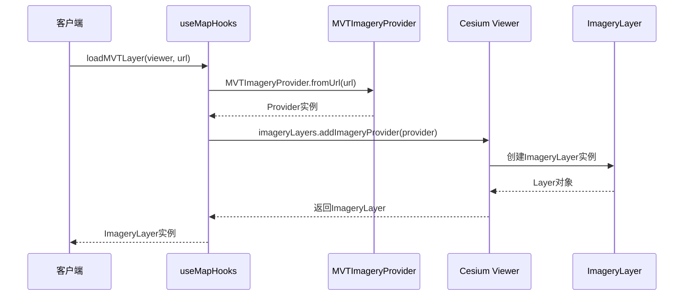
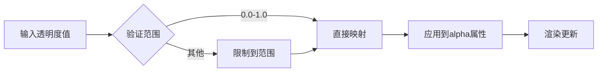
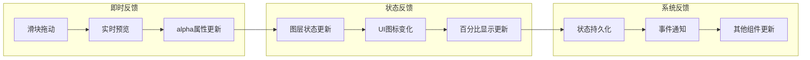
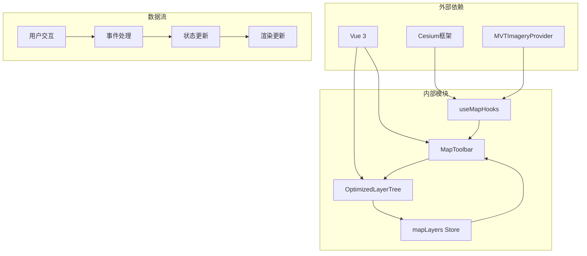

# MVT图层透明度控制

<cite>
**本文档引用的文件**
- [MapToolbar.vue](file://src/mapComponents/MapToolbar.vue)
- [useMapHooks.ts](file://src/hook/useMapHooks.ts)
- [OptimizedLayerTree.vue](file://src/mapComponents/OptimizedLayerTree.vue)
- [mapLayers.ts](file://src/stores/mapLayers.ts)
- [MapView.vue](file://src/views/MapView.vue)
- [MAP_TOOLBAR_INTEGRATION.md](file://MAP_TOOLBAR_INTEGRATION.md)
</cite>

## 目录
1. [简介](#简介)
2. [系统架构概览](#系统架构概览)
3. [核心组件分析](#核心组件分析)
4. [handleLayerOpacityChange方法详解](#handlelayeropacitychange方法详解)
5. [ImageryLayer对象透明度控制](#imagerylayer对象透明度控制)
6. [透明度值映射机制](#透明度值映射机制)
7. [实时反馈效果](#实时反馈效果)
8. [依赖关系分析](#依赖关系分析)
9. [最佳实践建议](#最佳实践建议)
10. [故障排除指南](#故障排除指南)

## 简介

MVT（Mapbox Vector Tiles）图层透明度控制是政府Dashboard项目中的核心功能之一，它允许用户通过可视化界面动态调整MVT图层的透明度，从而实现图层叠加显示和视觉效果优化。该功能基于Cesium框架的ImageryLayer对象，通过alpha属性实现精确的透明度控制。

透明度控制系统采用分层架构设计，包含用户界面层、业务逻辑层和底层渲染层，确保了良好的用户体验和系统性能。通过统一的事件机制和状态管理，实现了图层透明度的实时响应和持久化存储。

## 系统架构概览

**图表来源**
- [MapToolbar.vue](file://src/mapComponents/MapToolbar.vue#L268-L285)
- [OptimizedLayerTree.vue](file://src/mapComponents/OptimizedLayerTree.vue#L85-L89)
- [useMapHooks.ts](file://src/hook/useMapHooks.ts#L30-L32)

## 核心组件分析

### 图层树组件（OptimizedLayerTree）

OptimizedLayerTree组件作为透明度控制的主要入口点，提供了完整的图层管理和交互功能：

**图表来源**
- [OptimizedLayerTree.vue](file://src/mapComponents/OptimizedLayerTree.vue#L100-L112)
- [mapLayers.ts](file://src/stores/mapLayers.ts#L5-L11)

### 工具栏组件（MapToolbar）

MapToolbar组件提供直观的透明度控制接口，支持实时预览和批量操作：

**图表来源**
- [MapToolbar.vue](file://src/mapComponents/MapToolbar.vue#L268-L285)

**章节来源**
- [OptimizedLayerTree.vue](file://src/mapComponents/OptimizedLayerTree.vue#L1-L200)
- [MapToolbar.vue](file://src/mapComponents/MapToolbar.vue#L268-L285)

## handleLayerOpacityChange方法详解

`handleLayerOpacityChange`方法是透明度控制的核心逻辑实现，位于MapToolbar组件中，负责处理透明度变更请求并执行相应的图层操作。

### 方法签名和参数

该方法接收两个参数：
- `layerId: string` - 图层唯一标识符
- `opacity: number` - 透明度值（范围：0.0-1.0）

### 执行流程

**图表来源**
- [MapToolbar.vue](file://src/mapComponents/MapToolbar.vue#L268-L285)

### MVT图层透明度处理逻辑

对于MVT图层，方法通过以下步骤实现透明度控制：

1. **图层实例验证**：确保图层存在于loadedLayers映射中
2. **类型检查**：确认图层类型为"mvt"
3. **实例访问**：获取ImageryLayer对象实例
4. **属性设置**：直接设置`layer.instance.alpha = opacity`
5. **状态同步**：更新图层状态和UI反馈

**章节来源**
- [MapToolbar.vue](file://src/mapComponents/MapToolbar.vue#L268-L285)

## ImageryLayer对象透明度控制

### ImageryLayer对象结构

ImageryLayer是Cesium框架中用于处理栅格图像和矢量瓦片的核心类，它提供了丰富的属性和方法来控制图层的显示行为。

**图表来源**
- [useMapHooks.ts](file://src/hook/useMapHooks.ts#L18-L26)
- [MapToolbar.vue](file://src/mapComponents/MapToolbar.vue#L108-L108)

### alpha属性的工作原理

alpha属性是ImageryLayer对象的关键属性，它控制图层的整体透明度：

- **值范围**：0.0（完全透明）到1.0（完全不透明）
- **计算方式**：alpha值直接影响最终渲染像素的透明度
- **混合模式**：与其他图层进行Alpha混合运算
- **性能影响**：较高的透明度值对GPU性能影响较小

### 图层加载过程中的ImageryLayer创建

**图表来源**
- [useMapHooks.ts](file://src/hook/useMapHooks.ts#L40-L93)

**章节来源**
- [useMapHooks.ts](file://src/hook/useMapHooks.ts#L40-L93)
- [MapToolbar.vue](file://src/mapComponents/MapToolbar.vue#L147-L158)

## 透明度值映射机制

### 数值范围和精度

透明度控制系统采用标准化的数值范围：

| 参数类型 | 取值范围 | 精度要求 | 映射规则 |
|---------|---------|---------|---------|
| opacity | 0.0 - 1.0 | 2位小数 | 直接映射 |
| 百分比显示 | 0% - 100% | 整数 | opacity × 100 |
| UI滑块 | 0 - 100 | 整数 | 滑块值 / 100 |

### 实时映射算法

透明度值的映射遵循以下算法：

**图表来源**
- [MapToolbar.vue](file://src/mapComponents/MapToolbar.vue#L269-L285)

### 状态同步机制

透明度变更不仅影响视觉效果，还需要同步更新系统状态：

1. **UI状态更新**：滑块位置和百分比显示
2. **图层状态管理**：更新layerStates映射
3. **持久化存储**：保存到本地存储或服务器
4. **事件通知**：触发相关组件更新

**章节来源**
- [MapToolbar.vue](file://src/mapComponents/MapToolbar.vue#L269-L285)
- [OptimizedLayerTree.vue](file://src/mapComponents/OptimizedLayerTree.vue#L417-L434)

## 实时反馈效果

### 视觉反馈机制

透明度控制系统提供多层次的视觉反馈：

**图表来源**
- [MapToolbar.vue](file://src/mapComponents/MapToolbar.vue#L269-L285)

### 性能优化策略

为了确保流畅的用户体验，系统采用了多种性能优化技术：

1. **防抖处理**：减少频繁的状态更新
2. **批量操作**：合并多个状态变更
3. **增量渲染**：只更新受影响的图层
4. **内存管理**：及时释放不需要的对象

### 用户体验设计

透明度控制界面遵循以下设计原则：

- **直观性**：滑块位置直观反映透明度水平
- **可预测性**：透明度变化结果可预期
- **一致性**：与系统其他透明度控制保持一致
- **可访问性**：支持键盘操作和屏幕阅读器

**章节来源**
- [MapToolbar.vue](file://src/mapComponents/MapToolbar.vue#L269-L285)
- [OptimizedLayerTree.vue](file://src/mapComponents/OptimizedLayerTree.vue#L417-L434)

## 依赖关系分析

### 组件间依赖关系

**图表来源**
- [useMapHooks.ts](file://src/hook/useMapHooks.ts#L1-L15)
- [MapToolbar.vue](file://src/mapComponents/MapToolbar.vue#L80-L82)

### 数据流向分析

透明度控制的数据流遵循单向数据流原则：

1. **用户输入**：通过UI控件产生透明度变更事件
2. **事件传播**：事件从OptimizedLayerTree传播到MapToolbar
3. **状态处理**：MapToolbar处理事件并更新状态
4. **图层控制**：通过ImageryLayer对象控制实际渲染
5. **反馈循环**：更新UI状态并通知相关组件

### 错误处理机制

系统建立了完善的错误处理机制：

- **输入验证**：验证透明度值的有效性
- **异常捕获**：捕获和处理运行时异常
- **降级策略**：在错误情况下提供备用方案
- **用户提示**：向用户提供清晰的错误信息

**章节来源**
- [useMapHooks.ts](file://src/hook/useMapHooks.ts#L1-L93)
- [MapToolbar.vue](file://src/mapComponents/MapToolbar.vue#L147-L195)

## 最佳实践建议

### 开发规范

1. **参数验证**：始终验证透明度值在有效范围内
2. **错误处理**：为所有异步操作添加错误处理
3. **性能监控**：监控透明度变更对性能的影响
4. **代码复用**：抽象通用的透明度控制逻辑

### 性能优化

- **批量更新**：合并多个透明度变更操作
- **缓存机制**：缓存常用的ImageryLayer实例
- **懒加载**：按需加载图层资源
- **内存管理**：及时释放不再使用的图层

### 用户体验优化

- **渐进式增强**：提供基础功能和高级功能
- **响应式设计**：适配不同设备和屏幕尺寸
- **无障碍支持**：确保所有用户都能使用
- **国际化**：支持多语言界面

## 故障排除指南

### 常见问题及解决方案

| 问题描述 | 可能原因 | 解决方案 |
|---------|---------|---------|
| 透明度不生效 | 图层未正确加载 | 检查图层URL和网络连接 |
| 性能下降 | 频繁的透明度变更 | 实施防抖和批量更新 |
| 内存泄漏 | 图层实例未释放 | 确保正确清理图层资源 |
| UI不同步 | 状态管理错误 | 检查状态更新逻辑 |

### 调试技巧

1. **日志记录**：启用详细的调试日志
2. **开发者工具**：使用浏览器开发者工具
3. **性能分析**：使用Cesium性能分析工具
4. **单元测试**：编写透明度控制的单元测试

### 兼容性考虑

- **浏览器兼容性**：确保在主流浏览器中正常工作
- **Cesium版本**：验证与不同Cesium版本的兼容性
- **移动端适配**：测试在移动设备上的表现
- **网络环境**：考虑不同网络条件下的表现

**章节来源**
- [MapToolbar.vue](file://src/mapComponents/MapToolbar.vue#L161-L184)
- [useMapHooks.ts](file://src/hook/useMapHooks.ts#L76-L92)