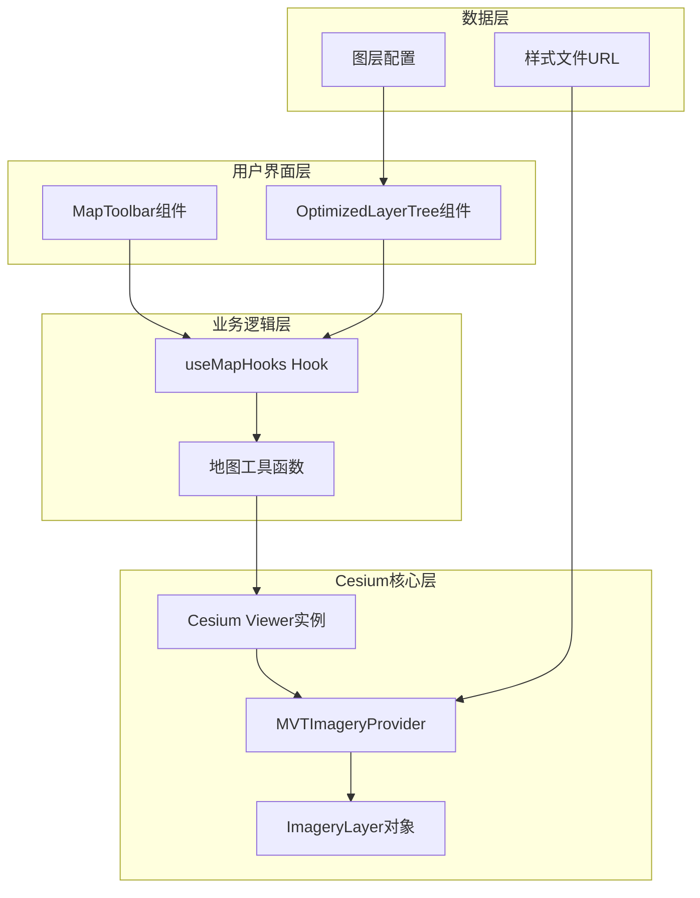
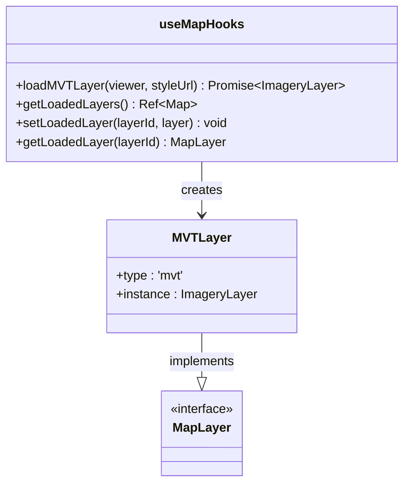
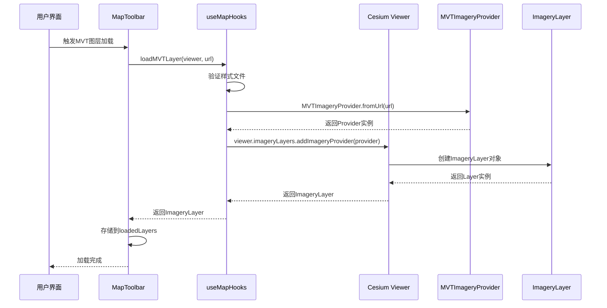
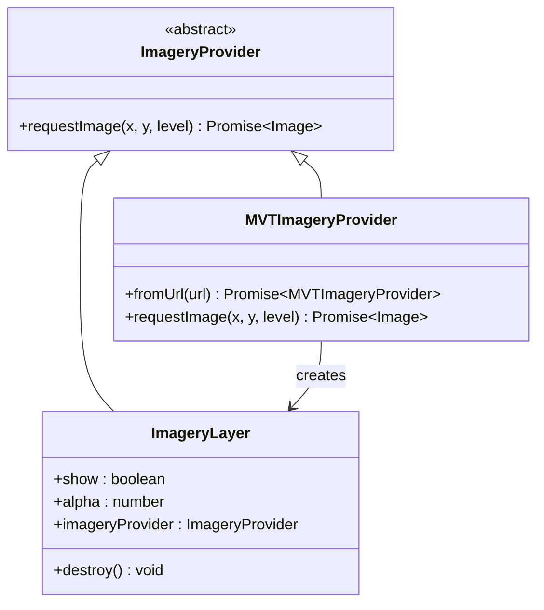
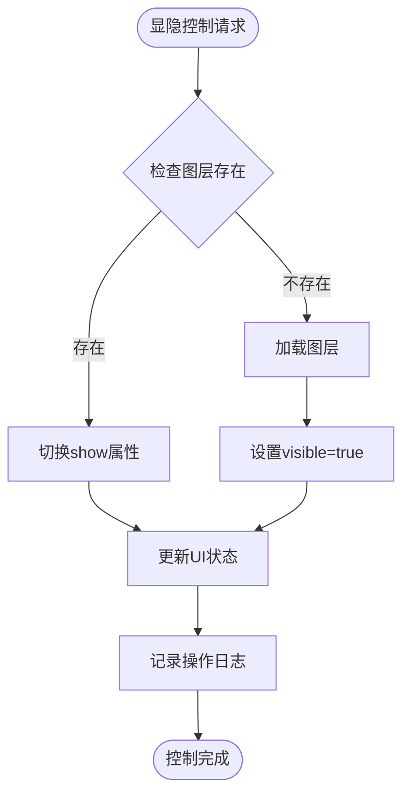
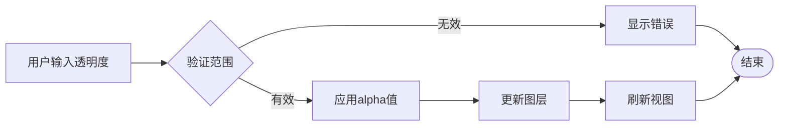
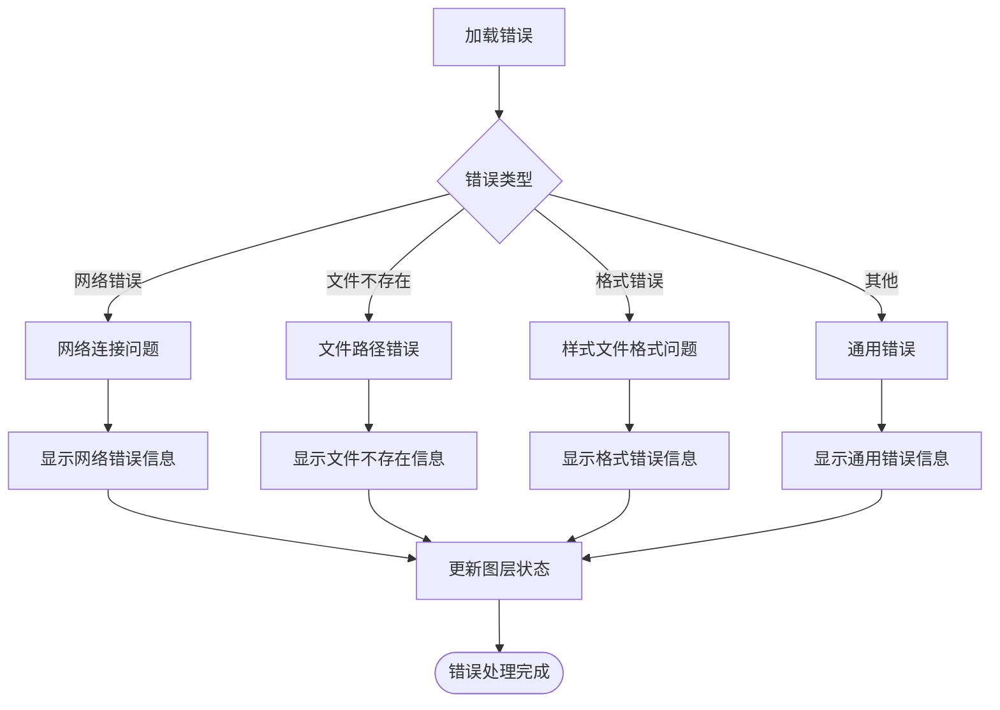

# MVT图层集成

<cite>
**本文档引用的文件**
- [useMapHooks.ts](file://src/hook/useMapHooks.ts)
- [MapToolbar.vue](file://src/mapComponents/MapToolbar.vue)
- [OptimizedLayerTree.vue](file://src/mapComponents/OptimizedLayerTree.vue)
- [MAP_TOOLBAR_INTEGRATION.md](file://MAP_TOOLBAR_INTEGRATION.md)
- [README_LAYER_TREE.md](file://src/mapComponents/README_LAYER_TREE.md)
- [yangxin.json](file://public/yangxin.json)
</cite>

## 目录
1. [概述](#概述)
2. [架构设计](#架构设计)
3. [核心组件分析](#核心组件分析)
4. [MVT图层加载流程](#mvt图层加载流程)
5. [ImageryLayer与Provider的区别](#imagerylayer与provider的区别)
6. [显隐控制机制](#显隐控制机制)
7. [透明度控制](#透明度控制)
8. [MVT样式URL配置规范](#mvt样式url配置规范)
9. [错误处理与故障排查](#错误处理与故障排查)
10. [最佳实践](#最佳实践)

## 概述

MVT（Mapbox Vector Tiles）图层集成是政府Dashboard系统中的核心功能之一，通过`useMapHooks`提供的`loadMVTLayer`方法实现。该系统采用Vue Composition API设计，实现了完整的MVT图层生命周期管理，包括加载、显隐控制、透明度调节等功能。

### 主要特性

- **完整的图层生命周期管理**：从加载到销毁的全过程控制
- **灵活的显隐控制**：基于ImageryLayer对象的show属性
- **精确的透明度调节**：支持0-1范围的alpha值控制
- **智能错误处理**：详细的错误信息和用户友好的提示
- **类型安全**：完整的TypeScript类型定义

## 架构设计

系统采用分层架构设计，确保组件职责清晰、耦合度低。



**图表来源**
- [useMapHooks.ts](file://src/hook/useMapHooks.ts#L33-L93)
- [MapToolbar.vue](file://src/mapComponents/MapToolbar.vue#L153-L195)

## 核心组件分析

### useMapHooks Hook

`useMapHooks`是整个MVT图层集成的核心Hook，提供了完整的图层管理功能。



**图表来源**
- [useMapHooks.ts](file://src/hook/useMapHooks.ts#L17-L29)

### 图层类型定义

系统定义了清晰的图层类型结构，确保类型安全：

| 类型 | 描述 | 实例类型 |
|------|------|----------|
| `MVTLayer` | MVT矢量瓦片图层 | `ImageryLayer`对象 |
| `TilesetLayer` | 3D Tiles图层 | `Cesium3DTileset`对象 |
| `MapLayer` | 图层联合类型 | `MVTLayer \| TilesetLayer` |

**章节来源**
- [useMapHooks.ts](file://src/hook/useMapHooks.ts#L17-L29)

## MVT图层加载流程

MVT图层的加载过程经过精心设计，确保稳定性和可靠性。



**图表来源**
- [useMapHooks.ts](file://src/hook/useMapHooks.ts#L40-L93)
- [MapToolbar.vue](file://src/mapComponents/MapToolbar.vue#L153-L195)

### 加载步骤详解

1. **样式文件验证**：检查样式文件是否存在且格式正确
2. **Provider创建**：使用`MVTImageryProvider.fromUrl()`创建数据提供者
3. **图层添加**：通过`viewer.imageryLayers.addImageryProvider()`添加图层
4. **实例返回**：返回`ImageryLayer`对象而非`Provider`

**章节来源**
- [useMapHooks.ts](file://src/hook/useMapHooks.ts#L40-L93)

## ImageryLayer与Provider的区别

这是MVT图层集成中的关键概念，理解两者的区别对于正确实现显隐控制至关重要。

### MVTImageryProvider

- **作用**：数据提供者，负责从服务器获取瓦片数据
- **特点**：只提供数据，不参与显示控制
- **局限性**：没有`show`和`alpha`属性

### ImageryLayer

- **作用**：图层对象，负责在地图上显示瓦片数据
- **特点**：继承自`ImageryProvider`，增加了显示控制功能
- **优势**：具有`show`和`alpha`属性，可直接控制显隐和透明度



**图表来源**
- [useMapHooks.ts](file://src/hook/useMapHooks.ts#L76-L85)

### 为什么必须返回ImageryLayer？

**错误实现**（无法控制显隐）：
```typescript
// ❌ 错误：返回Provider而非Layer
async loadMVTLayer(viewer: any, styleUrl: string): Promise<any> {
  const provider = await MVTImageryProvider.fromUrl(styleUrl);
  viewer.imageryLayers.addImageryProvider(provider);
  return provider; // ❌ Provider没有show属性
}
```

**正确实现**（支持显隐控制）：
```typescript
// ✅ 正确：返回ImageryLayer
async loadMVTLayer(viewer: any, styleUrl: string): Promise<any> {
  const provider = await MVTImageryProvider.fromUrl(styleUrl);
  const imageryLayer = viewer.imageryLayers.addImageryProvider(provider);
  return imageryLayer; // ✅ Layer有show和alpha属性
}
```

**章节来源**
- [MAP_TOOLBAR_INTEGRATION.md](file://MAP_TOOLBAR_INTEGRATION.md#L180-L221)

## 显隐控制机制

基于ImageryLayer的`show`属性实现精确的显隐控制。

### 控制流程



**图表来源**
- [MapToolbar.vue](file://src/mapComponents/MapToolbar.vue#L234-L266)

### 实现细节

显隐控制通过以下方式实现：

```typescript
// 显示图层
layer.instance.show = true;

// 隐藏图层  
layer.instance.show = false;
```

**章节来源**
- [MapToolbar.vue](file://src/mapComponents/MapToolbar.vue#L234-L266)

## 透明度控制

ImageryLayer的`alpha`属性提供了精确的透明度控制能力。

### 透明度范围

- **取值范围**：0.0（完全透明）到 1.0（完全不透明）
- **默认值**：1.0（完全不透明）
- **精度**：支持小数点后两位

### 控制实现

```typescript
// 设置透明度（例如50%透明度）
layer.instance.alpha = 0.5;

// 完全透明
layer.instance.alpha = 0.0;

// 完全不透明
layer.instance.alpha = 1.0;
```

### 透明度控制流程



**图表来源**
- [MapToolbar.vue](file://src/mapComponents/MapToolbar.vue#L269-L290)

**章节来源**
- [MapToolbar.vue](file://src/mapComponents/MapToolbar.vue#L269-L290)

## MVT样式URL配置规范

正确的样式文件配置是MVT图层正常工作的基础。

### 样式文件要求

系统对样式文件进行了严格的验证，确保其符合标准。

#### 必需字段验证

| 字段 | 类型 | 必需性 | 描述 |
|------|------|--------|------|
| `version` | string | 必需 | 样式版本标识 |
| `sources` | object | 必需 | 数据源配置 |
| `layers` | array | 必需 | 图层定义列表 |

#### 样式文件结构示例

```json
{
  "version": "8",
  "name": "MVT样式示例",
  "sources": {
    "vector-tiles": {
      "type": "vector",
      "url": "/tiles/{z}/{x}/{y}.pbf"
    }
  },
  "layers": [
    {
      "id": "roads",
      "source": "vector-tiles",
      "source-layer": "roads",
      "type": "line",
      "paint": {
        "line-color": "#ff0000",
        "line-width": 2
      }
    }
  ]
}
```

### URL配置规范

#### 基础URL格式

```
http(s)://host:port/path/to/style.json
```

#### 支持的URL类型

| 类型 | 示例 | 说明 |
|------|------|------|
| 相对路径 | `/styles/mvt-style.json` | 项目根目录下的相对路径 |
| 绝对路径 | `https://cdn.example.com/styles/mvt.json` | 完整的网络地址 |
| 本地开发 | `http://localhost:3000/assets/mvt.json` | 开发环境测试 |

#### 文件命名约定

- **推荐命名**：`style.json` 或 `{layer-name}-style.json`
- **扩展名**：必须为`.json`
- **编码**：UTF-8编码

**章节来源**
- [useMapHooks.ts](file://src/hook/useMapHooks.ts#L45-L93)

## 错误处理与故障排查

系统提供了完善的错误处理机制，帮助开发者快速定位和解决问题。

### 常见错误类型

#### 1. 样式文件不存在

**错误信息**：
```
样式文件不存在: /styles/mvt-style.json (HTTP 404)
```

**排查步骤**：
1. 检查URL是否正确
2. 验证文件是否存在于服务器
3. 确认服务器是否有访问权限

#### 2. 样式文件格式错误

**错误信息**：
```
样式文件缺少 "version" 字段
```

**排查步骤**：
1. 验证JSON语法是否正确
2. 检查必需字段是否存在
3. 使用在线JSON验证工具

#### 3. 网络连接问题

**错误信息**：
```
Failed to load MVT layer: Network error
```

**排查步骤**：
1. 检查网络连接
2. 验证跨域设置
3. 检查防火墙配置

### 错误处理流程



**图表来源**
- [MapToolbar.vue](file://src/mapComponents/MapToolbar.vue#L161-L184)

### 用户友好错误信息

系统会将技术错误转换为用户友好的提示：

| 技术错误 | 用户提示 | 处理建议 |
|----------|----------|----------|
| HTTP 404 | "样式文件不存在" | 检查文件路径和服务器配置 |
| 缺少version字段 | "样式文件格式错误" | 验证JSON格式和必需字段 |
| 网络超时 | "加载失败" | 检查网络连接 |

**章节来源**
- [MapToolbar.vue](file://src/mapComponents/MapToolbar.vue#L161-L184)

## 最佳实践

### 性能优化建议

1. **合理设置图层顺序**：将常用图层放在前面
2. **及时释放资源**：不再使用的图层应及时移除
3. **控制并发数量**：避免同时加载过多图层

### 代码组织建议

1. **分离关注点**：将图层管理逻辑与UI逻辑分离
2. **使用类型安全**：充分利用TypeScript类型定义
3. **错误边界处理**：为每个图层操作设置错误边界

### 调试技巧

1. **启用详细日志**：在开发环境中开启详细日志输出
2. **使用浏览器开发者工具**：监控网络请求和Cesium状态
3. **图层状态检查**：定期检查loadedLayers的状态

### 部署注意事项

1. **CDN配置**：将样式文件部署到CDN以提高加载速度
2. **缓存策略**：合理设置静态资源缓存
3. **跨域配置**：确保服务器正确配置CORS

通过遵循这些最佳实践，可以确保MVT图层集成的稳定性、性能和可维护性。