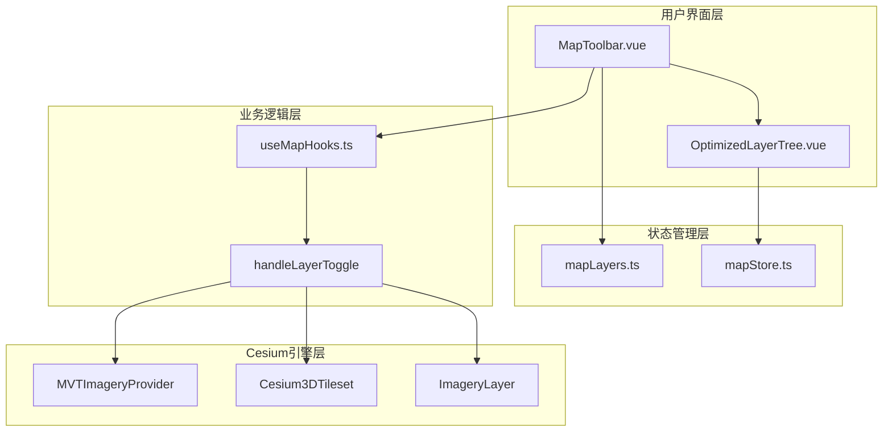
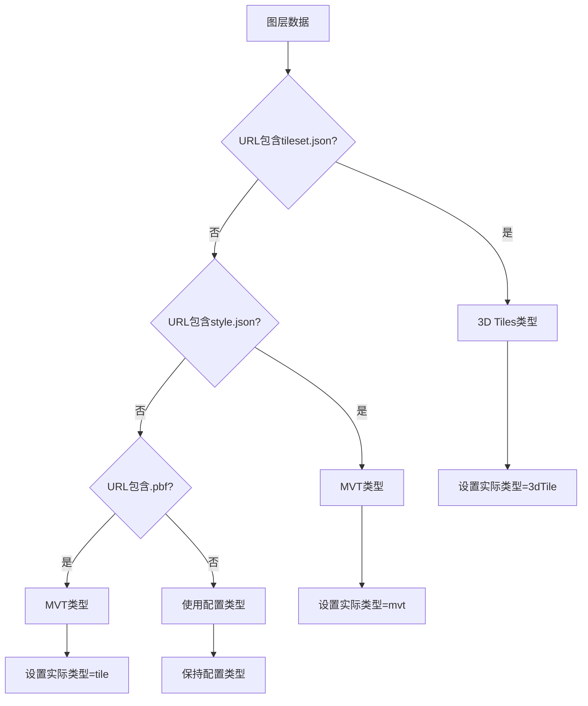
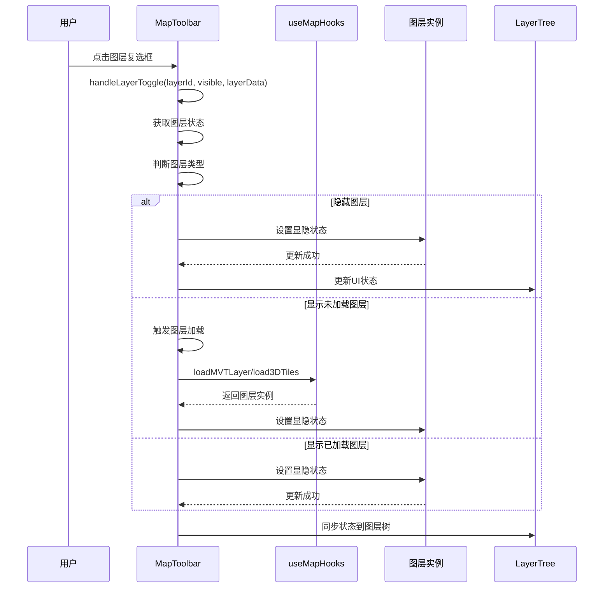
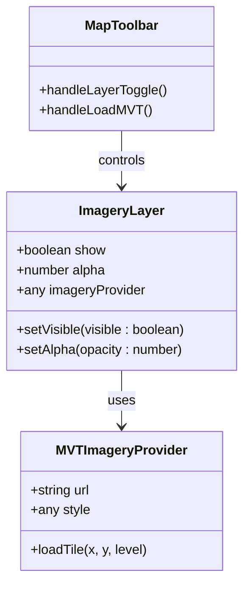
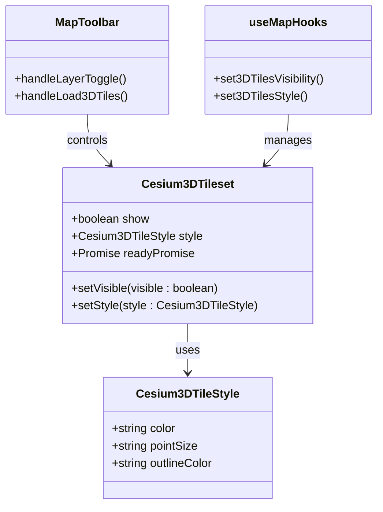
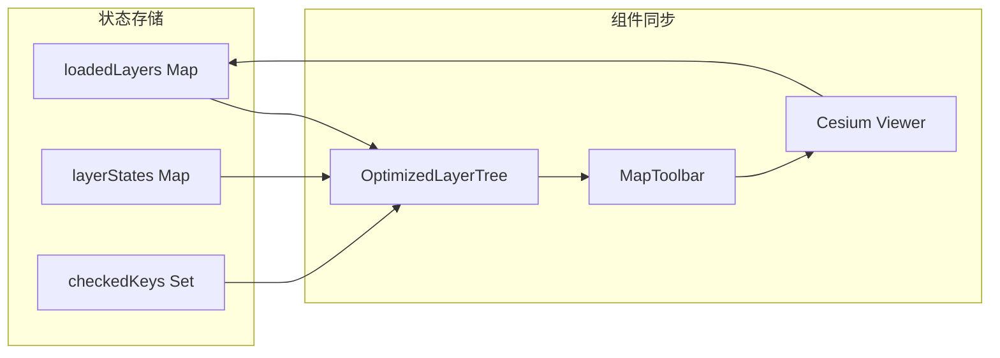
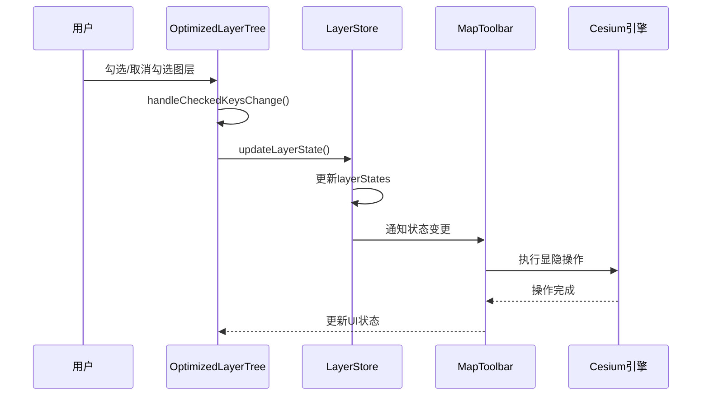
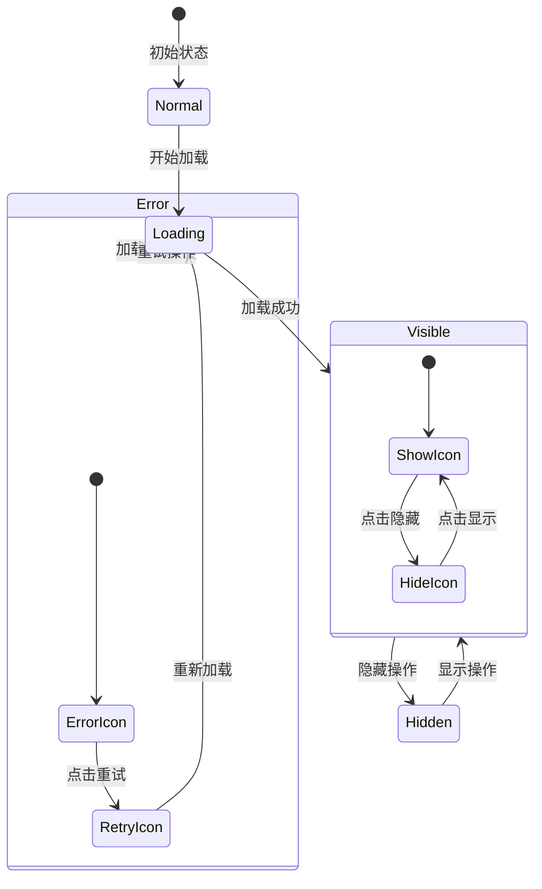
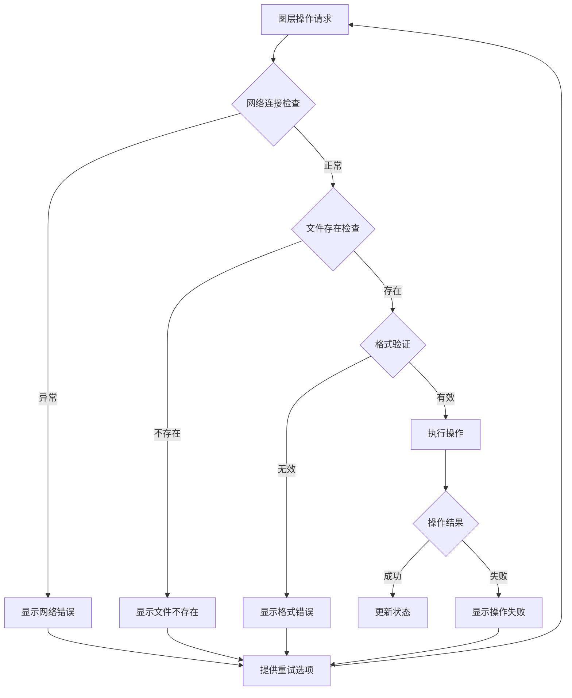
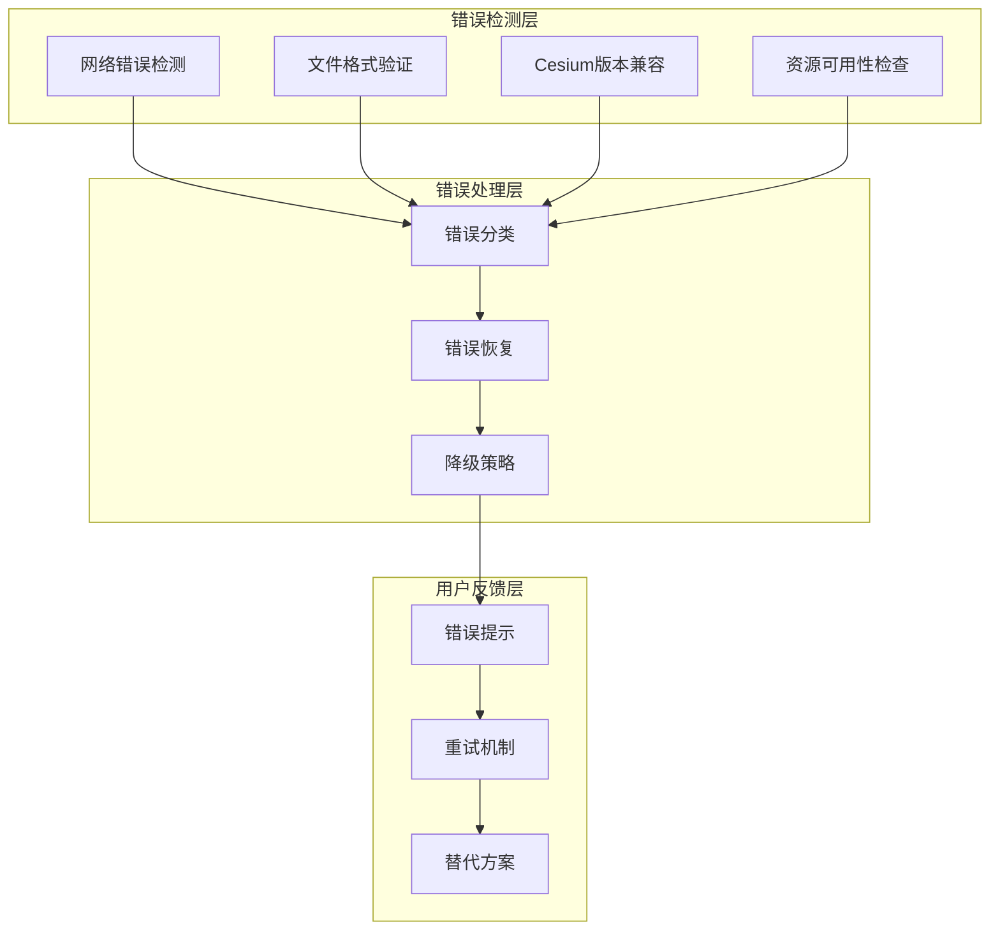

# 图层显隐控制

<cite>
**本文档引用的文件**
- [MapToolbar.vue](file://src/mapComponents/MapToolbar.vue)
- [useMapHooks.ts](file://src/hook/useMapHooks.ts)
- [OptimizedLayerTree.vue](file://src/mapComponents/OptimizedLayerTree.vue)
- [mapLayers.ts](file://src/stores/mapLayers.ts)
- [mapStore.ts](file://src/stores/mapStore.ts)
- [MAP_TOOLBAR_INTEGRATION.md](file://MAP_TOOLBAR_INTEGRATION.md)
</cite>

## 目录
1. [概述](#概述)
2. [系统架构](#系统架构)
3. [图层类型与控制机制](#图层类型与控制机制)
4. [handleLayerToggle 方法详解](#handlelayertoggle-方法详解)
5. [MVT 图层显隐控制](#mvt-图层显隐控制)
6. [3D Tiles 图层显隐控制](#3d-tiles-图层显隐控制)
7. [图层状态同步机制](#图层状态同步机制)
8. [用户交互反馈](#用户交互反馈)
9. [错误处理与容错机制](#错误处理与容错机制)
10. [最佳实践与优化建议](#最佳实践与优化建议)

## 概述

图层显隐控制系统是政府Dashboard地图应用的核心功能之一，负责管理不同类型图层的显示与隐藏状态。系统支持两种主要的图层类型：MVT（矢量瓦片）图层和3D Tiles图层，每种类型都有其独特的显隐控制机制。

该系统采用分层架构设计，通过组件间的协作实现图层状态的统一管理和用户交互的实时反馈。系统具备完善的错误处理机制和容错能力，确保在各种异常情况下都能提供良好的用户体验。

## 系统架构



**图表来源**
- [MapToolbar.vue](file://src/mapComponents/MapToolbar.vue#L20-L22)
- [OptimizedLayerTree.vue](file://src/mapComponents/OptimizedLayerTree.vue#L70-L90)
- [useMapHooks.ts](file://src/hook/useMapHooks.ts#L33-L545)

系统采用分层架构，各层职责明确：

- **用户界面层**：负责用户交互和状态展示
- **状态管理层**：管理图层状态和持久化
- **业务逻辑层**：实现核心业务逻辑和图层控制
- **Cesium引擎层**：与Cesium引擎直接交互

## 图层类型与控制机制

系统支持两种主要的图层类型，每种类型都有其特定的显隐控制机制：

### 图层类型分类

| 图层类型 | 文件扩展名 | 控制属性 | 显隐机制 | 透明度控制 |
|---------|-----------|----------|----------|-----------|
| MVT图层 | `.pbf`, `style.json` | `ImageryLayer.show` | `layer.instance.show = true/false` | `layer.instance.alpha = opacity` |
| 3D Tiles | `tileset.json` | `Cesium3DTileset.show` | `tileset.show = true/false` | `Cesium3DTileStyle` |
| WMS图层 | `.wms` | `ImageryLayer.show` | `layer.instance.show = true/false` | `layer.instance.alpha = opacity` |

### 图层检测机制

系统实现了智能的图层类型检测机制，能够根据URL特征自动识别图层类型：



**图表来源**
- [OptimizedLayerTree.vue](file://src/mapComponents/OptimizedLayerTree.vue#L329-L351)

**章节来源**
- [OptimizedLayerTree.vue](file://src/mapComponents/OptimizedLayerTree.vue#L329-L351)
- [useMapHooks.ts](file://src/hook/useMapHooks.ts#L18-L28)

## handleLayerToggle 方法详解

`handleLayerToggle` 是图层显隐控制的核心方法，位于 `MapToolbar.vue` 中，负责处理图层的显示和隐藏操作。

### 方法签名与参数

```typescript
const handleLayerToggle = (
  layerId: string,
  visible: boolean,
  layerData: any
) => {
  // 实现细节
}
```

### 执行流程



**图表来源**
- [MapToolbar.vue](file://src/mapComponents/MapToolbar.vue#L227-L266)

### 状态判断逻辑

方法根据不同的条件组合执行相应的操作：

1. **隐藏图层** (`!visible && layer`)
   - 检查图层类型
   - 调用对应的显隐控制函数
   - 更新控制台日志

2. **显示未加载图层** (`visible && !layer`)
   - 根据图层类型触发加载
   - MVT图层：调用 `handleLoadMVT`
   - 3D Tiles图层：调用 `handleLoad3DTiles`

3. **显示已加载图层** (`visible && layer`)
   - 检查图层类型
   - 调用对应的显隐控制函数
   - 更新控制台日志

**章节来源**
- [MapToolbar.vue](file://src/mapComponents/MapToolbar.vue#L227-L266)

## MVT 图层显隐控制

MVT（Mapbox Vector Tiles）图层的显隐控制通过Cesium的 `ImageryLayer` 对象实现，利用其内置的 `show` 属性进行控制。

### ImageryLayer 显隐控制



**图表来源**
- [useMapHooks.ts](file://src/hook/useMapHooks.ts#L40-L86)
- [MapToolbar.vue](file://src/mapComponents/MapToolbar.vue#L147-L184)

### 实现细节

#### 图层加载过程

1. **样式文件验证**：系统首先验证MVT样式文件的有效性
2. **Provider创建**：使用 `MVTImageryProvider.fromUrl()` 创建数据提供者
3. **图层实例化**：通过 `viewer.imageryLayers.addImageryProvider()` 获取 `ImageryLayer` 对象
4. **状态存储**：将图层实例存储到 `loadedLayers` 映射中

#### 显隐控制实现

```typescript
// 隐藏MVT图层
if (layer.instance) {
    layer.instance.show = false;
    console.log(`✅ MVT图层已隐藏: ${layerId}`);
}

// 显示MVT图层  
if (layer.instance) {
    layer.instance.show = true;
    console.log(`✅ MVT图层已显示: ${layerId}`);
}
```

### 透明度控制

MVT图层还支持透明度控制，通过 `ImageryLayer.alpha` 属性实现：

```typescript
// 设置透明度
layer.instance.alpha = opacity;
console.log(`✅ MVT图层透明度已设置: ${layerId} = ${opacity}`);
```

**章节来源**
- [MapToolbar.vue](file://src/mapComponents/MapToolbar.vue#L147-L184)
- [useMapHooks.ts](file://src/hook/useMapHooks.ts#L40-L86)

## 3D Tiles 图层显隐控制

3D Tiles图层的显隐控制通过Cesium的 `Cesium3DTileset` 对象实现，利用其内置的 `show` 属性进行控制。

### 3D Tiles 显隐控制



**图表来源**
- [useMapHooks.ts](file://src/hook/useMapHooks.ts#L153-L204)
- [MapToolbar.vue](file://src/mapComponents/MapToolbar.vue#L188-L224)

### 实现细节

#### 图层加载过程

1. **样式验证**：验证3D Tiles样式文件的有效性
2. **Tileset创建**：使用 `Cesium.Cesium3DTileset` 构造函数创建图层实例
3. **可见性设置**：初始化时设置 `tileset.show = true`
4. **场景添加**：将图层添加到 `viewer.scene.primitives`
5. **等待就绪**：等待 `readyPromise` 完成
6. **相机调整**：自动调整相机视角以适应3D模型

#### 显隐控制实现

```typescript
// 隐藏3D Tiles图层
cesiumUtils.set3DTilesVisibility(layer.instance, false);

// 显示3D Tiles图层
cesiumUtils.set3DTilesVisibility(layer.instance, true);
```

#### 透明度控制

3D Tiles图层的透明度控制通过 `Cesium3DTileStyle` 实现：

```typescript
// 设置透明度
cesiumUtils.set3DTilesStyle(layer.instance, {
    color: `color('white', ${opacity})`,
});
```

### 性能优化

系统在3D Tiles图层控制中实现了多项性能优化：

- **延迟加载**：仅在需要时加载3D模型
- **内存管理**：及时释放不需要的图层资源
- **预设参数**：使用合理的 `maximumScreenSpaceError` 和 `maximumMemoryUsage` 参数
- **渐进式加载**：支持按需加载不同精度的3D模型

**章节来源**
- [MapToolbar.vue](file://src/mapComponents/MapToolbar.vue#L188-L224)
- [useMapHooks.ts](file://src/hook/useMapHooks.ts#L102-L147)

## 图层状态同步机制

图层状态同步机制确保系统各组件之间的状态一致性，包括图层树、工具栏和Cesium引擎的状态同步。

### 状态管理架构



**图表来源**
- [OptimizedLayerTree.vue](file://src/mapComponents/OptimizedLayerTree.vue#L100-L112)
- [MapToolbar.vue](file://src/mapComponents/MapToolbar.vue#L108-L109)

### 状态同步流程

#### 图层树状态同步



**图表来源**
- [OptimizedLayerTree.vue](file://src/mapComponents/OptimizedLayerTree.vue#L302-L322)

#### 状态同步实现

1. **图层状态映射**：使用 `Map<string, LayerState>` 存储图层状态
2. **状态更新**：通过 `updateLayerState()` 方法更新状态
3. **双向绑定**：确保图层树和Cesium引擎状态的一致性
4. **批量更新**：支持批量状态更新以提高性能

### 状态持久化

系统实现了状态的持久化机制：

```typescript
// 图层状态接口
interface LayerState {
    visible: boolean;
    opacity: number;
    loading: boolean;
    error: string | null;
}

// 状态更新方法
function updateLayerState(
    layerId: string,
    state: Partial<LayerState>
) {
    const currentState = layerStates.value.get(layerId);
    if (currentState) {
        layerStates.value.set(layerId, {
            ...currentState,
            ...state,
        });
    }
}
```

**章节来源**
- [OptimizedLayerTree.vue](file://src/mapComponents/OptimizedLayerTree.vue#L100-L112)
- [OptimizedLayerTree.vue](file://src/mapComponents/OptimizedLayerTree.vue#L417-L434)

## 用户交互反馈

用户交互反馈机制为用户提供即时的操作反馈，包括视觉反馈、状态提示和错误信息。

### 反馈类型与实现

#### 1. 视觉反馈



**图表来源**
- [OptimizedLayerTree.vue](file://src/mapComponents/OptimizedLayerTree.vue#L302-L322)

#### 2. 控制台日志反馈

系统在关键操作点输出详细的控制台日志：

```typescript
// 成功操作日志
console.log(`✅ MVT图层已显示: ${layerId}`);
console.log(`✅ 3D Tiles图层加载成功: ${layerId}`);

// 错误操作日志  
console.error(`❌ MVT图层加载失败: ${layerId}`, errorMessage);
console.error(`❌ 3D Tiles图层加载失败: ${layerId}`, errorMessage);

// 状态变更日志
console.log(`${visible ? "显示" : "隐藏"}图层:`, layerId);
```

#### 3. 图层树状态更新

```typescript
// 更新图层树状态
layerTreeRef.value.updateLayerState(layerId, {
    loading: false,
    error: userFriendlyError,
});

// 显示具体错误信息
if (errorMessage.includes("404") || errorMessage.includes("不存在")) {
    userFriendlyError = "样式文件不存在";
} else if (errorMessage.includes("version")) {
    userFriendlyError = "样式文件格式错误";
}
```

### 错误处理策略

#### 错误分类与处理

| 错误类型 | 检测方式 | 处理策略 | 用户提示 |
|---------|----------|----------|----------|
| 网络错误 | HTTP状态码404 | 显示"样式文件不存在" | 提供重试按钮 |
| 格式错误 | JSON解析失败 | 显示"样式文件格式错误" | 引导修复配置 |
| 版本错误 | Cesium版本不兼容 | 显示"Cesium版本不兼容" | 建议升级 |
| 资源缺失 | 文件不存在 | 显示"3D模型文件不存在" | 提供替代方案 |

#### 容错机制



**图表来源**
- [MapToolbar.vue](file://src/mapComponents/MapToolbar.vue#L161-L184)

**章节来源**
- [MapToolbar.vue](file://src/mapComponents/MapToolbar.vue#L161-L184)
- [OptimizedLayerTree.vue](file://src/mapComponents/OptimizedLayerTree.vue#L417-L434)

## 错误处理与容错机制

系统实现了完善的错误处理和容错机制，确保在各种异常情况下都能提供稳定的用户体验。

### 错误处理架构



**图表来源**
- [MapToolbar.vue](file://src/mapComponents/MapToolbar.vue#L161-L184)
- [useMapHooks.ts](file://src/hook/useMapHooks.ts#L42-L86)

### 具体错误处理实现

#### MVT图层错误处理

```typescript
try {
    // 验证样式文件
    const response = await fetch(styleUrl);
    if (!response.ok) {
        throw new Error(`样式文件不存在: ${styleUrl} (HTTP ${response.status})`);
    }
    
    const styleJson = await response.json();
    
    // 验证必需字段
    if (!styleJson.version) {
        throw new Error('样式文件缺少 "version" 字段');
    }
    if (!styleJson.sources) {
        throw new Error('样式文件缺少 "sources" 字段');
    }
    if (!styleJson.layers) {
        throw new Error('样式文件缺少 "layers" 字段');
    }
} catch (error) {
    console.error("❌ 样式文件验证失败:", error);
    throw error;
}
```

#### 3D Tiles错误处理

```typescript
try {
    // 验证Cesium可用性
    const Cesium = (window as any).Cesium;
    if (!Cesium) {
        throw new Error("Cesium未加载");
    }
    
    // 验证tileset.json
    const response = await fetch(url);
    if (!response.ok) {
        throw new Error(`3D模型文件不存在: ${url}`);
    }
    
    // 创建tileset
    const tileset = new Cesium.Cesium3DTileset({
        url,
        maximumScreenSpaceError: 16,
        maximumMemoryUsage: 512,
    });
    
    // 等待准备完成
    await tileset.readyPromise;
    
} catch (error) {
    console.error("❌ 加载3D Tiles失败:", error);
    throw new Error(`Failed to load 3D Tiles: ${error}`);
}
```

### 容错机制

#### 1. 类型检测容错

```typescript
function detectLayerType(layerData: any): string {
    const url = layerData.url || '';
    const type = layerData.type || '';
    
    // URL优先级高于配置类型
    if (url.includes('tileset.json')) {
        if (type !== '3dTile') {
            console.warn(`⚠️ 图层类型不匹配: ${layerData.name}, 配置类型=${type}, 实际应为=3dTile`);
        }
        return '3dTile';
    }
    
    if (url.includes('style.json') || url.includes('.pbf')) {
        if (type !== 'mvt' && type !== 'tile') {
            console.warn(`⚠️ 图层类型不匹配: ${layerData.name}, 配置类型=${type}, 实际应为=mvt`);
        }
        return url.includes('style.json') ? 'mvt' : 'tile';
    }
    
    // 使用配置类型作为最后手段
    return type;
}
```

#### 2. 状态恢复机制

```typescript
// 图层状态恢复
function recoverLayerState(layerId: string, fallbackState: LayerState) {
    const currentState = layerStates.value.get(layerId);
    if (!currentState) {
        layerStates.value.set(layerId, fallbackState);
    }
}
```

**章节来源**
- [MapToolbar.vue](file://src/mapComponents/MapToolbar.vue#L161-L184)
- [useMapHooks.ts](file://src/hook/useMapHooks.ts#L42-L86)
- [OptimizedLayerTree.vue](file://src/mapComponents/OptimizedLayerTree.vue#L329-L351)

## 最佳实践与优化建议

基于系统的实际运行经验，以下是图层显隐控制的最佳实践和优化建议。

### 性能优化建议

#### 1. 图层懒加载

```typescript
// 实现图层懒加载机制
const lazyLoadThreshold = 1000; // 1秒阈值

const handleLayerToggle = async (layerId: string, visible: boolean, layerData: any) => {
    if (visible && !loadedLayers.value.has(layerId)) {
        // 延迟加载，避免频繁操作
        await new Promise(resolve => setTimeout(resolve, lazyLoadThreshold));
        // 执行加载逻辑
    }
};
```

#### 2. 内存管理

```typescript
// 实现图层缓存和清理机制
const MAX_CACHED_LAYERS = 10;

function manageLayerCache() {
    const layers = Array.from(loadedLayers.value.entries());
    if (layers.length > MAX_CACHED_LAYERS) {
        // 清理最久未使用的图层
        const oldestLayer = layers[0][0];
        unloadLayer(oldestLayer);
    }
}
```

#### 3. 并发控制

```typescript
// 限制并发加载数量
const MAX_CONCURRENT_LOADS = 3;
let activeLoads = 0;

async function loadLayerWithConcurrency(layerId: string) {
    if (activeLoads >= MAX_CONCURRENT_LOADS) {
        return new Promise(resolve => {
            // 等待队列处理
        });
    }
    
    activeLoads++;
    try {
        await loadLayer(layerId);
    } finally {
        activeLoads--;
    }
}
```

### 用户体验优化

#### 1. 加载状态指示

```typescript
// 实现加载状态指示
function updateLayerLoadingState(layerId: string, isLoading: boolean) {
    updateLayerState(layerId, {
        loading: isLoading,
        error: isLoading ? null : undefined
    });
}
```

#### 2. 批量操作优化

```typescript
// 批量处理图层操作
function batchLayerOperations(operations: LayerOperation[]) {
    const startTime = performance.now();
    
    operations.forEach(op => {
        handleLayerToggle(op.layerId, op.visible, op.data);
    });
    
    const endTime = performance.now();
    console.log(`批量操作耗时: ${endTime - startTime}ms`);
}
```

### 代码质量保证

#### 1. 类型安全

```typescript
// 使用严格的类型定义
interface LayerOperation {
    layerId: string;
    visible: boolean;
    data: LayerData;
}

function handleLayerToggle(operation: LayerOperation): void {
    // 类型安全的实现
}
```

#### 2. 错误边界

```typescript
// 实现错误边界
function safeLayerOperation(operation: LayerOperation) {
    try {
        handleLayerToggle(operation);
    } catch (error) {
        console.error('图层操作失败:', error);
        // 降级处理
        updateLayerState(operation.layerId, { error: '操作失败' });
    }
}
```

### 监控与调试

#### 1. 性能监控

```typescript
// 性能监控埋点
function monitorLayerPerformance(layerId: string, operation: string, duration: number) {
    console.log(`图层性能监控: ${layerId} ${operation} ${duration}ms`);
    
    // 发送到监控系统
    if (window.performanceMonitor) {
        window.performanceMonitor.recordMetric('layer_operation', {
            layerId,
            operation,
            duration,
            success: true
        });
    }
}
```

#### 2. 调试工具

```typescript
// 调试工具函数
function debugLayerState(layerId: string) {
    const layer = loadedLayers.value.get(layerId);
    const state = layerStates.value.get(layerId);
    
    console.table({
        layerId,
        type: layer?.type,
        visible: state?.visible,
        opacity: state?.opacity,
        loading: state?.loading,
        error: state?.error
    });
}
```

这些最佳实践和优化建议能够显著提升系统的稳定性、性能和用户体验，同时为后续的功能扩展和维护奠定良好的基础。