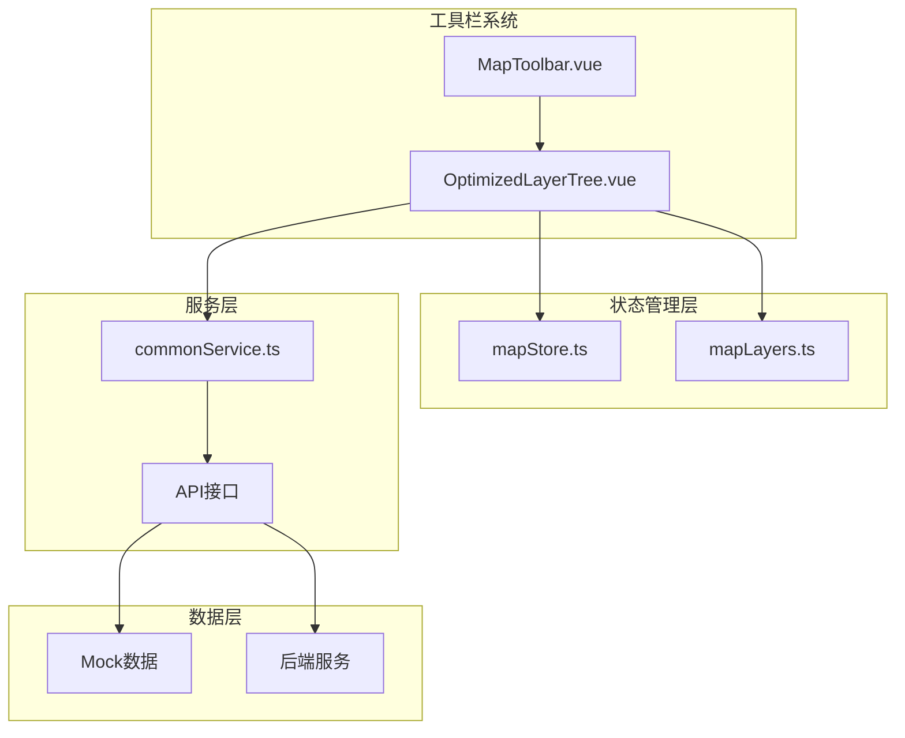
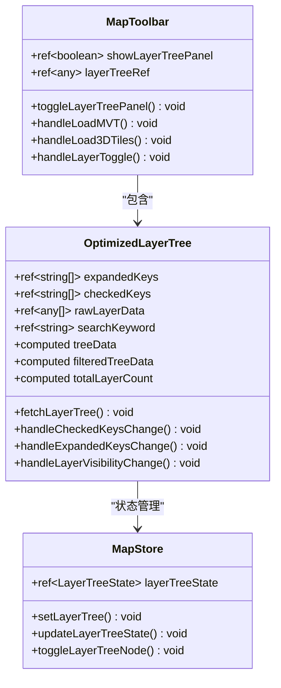
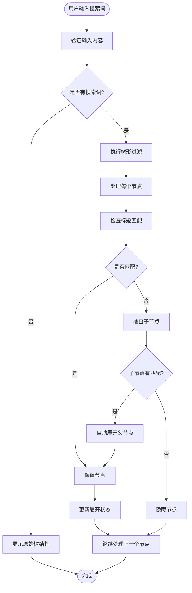
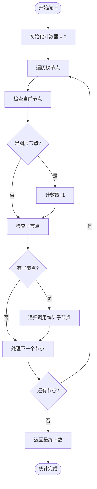
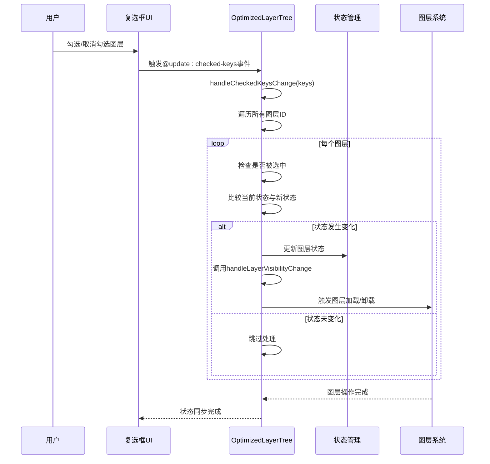
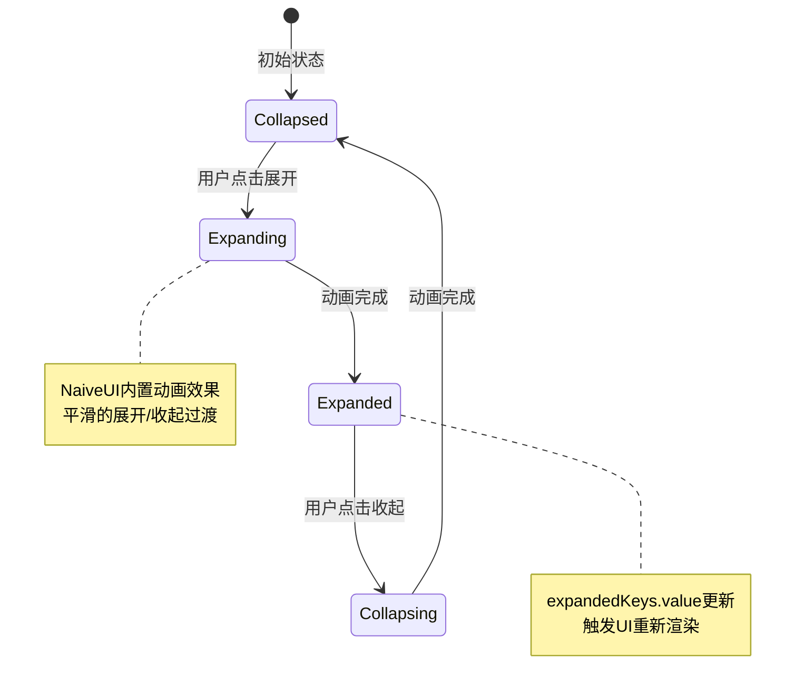
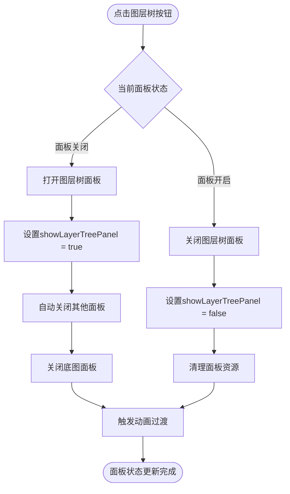

# 图层树UI行为与交互

<cite>
**本文档引用的文件**
- [OptimizedLayerTree.vue](file://src/mapComponents/OptimizedLayerTree.vue)
- [MapToolbar.vue](file://src/mapComponents/MapToolbar.vue)
- [mapLayers.ts](file://src/stores/mapLayers.ts)
- [mapStore.ts](file://src/stores/mapStore.ts)
- [commonService.ts](file://src/services/commonService.ts)
- [LAYER_TREE_QUICK_START.md](file://LAYER_TREE_QUICK_START.md)
- [README_LAYER_TREE.md](file://src/mapComponents/README_LAYER_TREE.md)
</cite>

## 目录
1. [概述](#概述)
2. [项目架构](#项目架构)
3. [核心组件分析](#核心组件分析)
4. [搜索功能实现](#搜索功能实现)
5. [图层数统计功能](#图层数统计功能)
6. [复选框勾选行为](#复选框勾选行为)
7. [展开/收起动画效果](#展开收起动画效果)
8. [图层树面板显示/隐藏](#图层树面板显示隐藏)
9. [性能优化策略](#性能优化策略)
10. [故障排除指南](#故障排除指南)

## 概述

OptimizedLayerTree.vue是一个高度优化的地图图层树组件，提供了完整的图层管理功能。该组件采用Vue 3 Composition API构建，支持多种图层类型（MVT、3D Tiles、瓦片图层等），具备智能搜索、实时统计、动画过渡等现代化UI特性。

### 主要功能特性

- **多图层类型支持**：MVT矢量瓦片、3D Tiles三维模型、普通瓦片、WMS服务
- **智能搜索过滤**：实时关键词匹配，自动展开匹配节点的父级
- **图层数统计**：递归计算树形结构中的图层数量
- **复选框控制**：直观的勾选操作，触发图层显隐逻辑
- **动画过渡**：平滑的展开/收起动画效果
- **状态管理**：完善的图层状态跟踪和错误处理

## 项目架构

**图表来源**
- [MapToolbar.vue](file://src/mapComponents/MapToolbar.vue#L1-L50)
- [OptimizedLayerTree.vue](file://src/mapComponents/OptimizedLayerTree.vue#L1-L100)
- [mapStore.ts](file://src/stores/mapStore.ts#L1-L50)

## 核心组件分析

### OptimizedLayerTree组件结构

OptimizedLayerTree组件采用模块化设计，包含以下核心部分：

**图表来源**
- [OptimizedLayerTree.vue](file://src/mapComponents/OptimizedLayerTree.vue#L70-L150)
- [MapToolbar.vue](file://src/mapComponents/MapToolbar.vue#L80-L130)
- [mapStore.ts](file://src/stores/mapStore.ts#L39-L60)

**章节来源**
- [OptimizedLayerTree.vue](file://src/mapComponents/OptimizedLayerTree.vue#L1-L447)
- [MapToolbar.vue](file://src/mapComponents/MapToolbar.vue#L1-L334)

## 搜索功能实现

### searchKeyword响应式搜索机制

搜索功能通过`searchKeyword`响应式变量实现，支持实时过滤和智能展开：

**图表来源**
- [OptimizedLayerTree.vue](file://src/mapComponents/OptimizedLayerTree.vue#L218-L269)

### 搜索算法实现原理

搜索功能的核心实现在`filteredTreeData`计算属性中，采用递归深度优先搜索算法：

1. **关键词标准化**：将搜索词转换为小写并去除首尾空格
2. **节点匹配检测**：检查节点标题是否包含搜索关键词
3. **智能展开逻辑**：当子节点匹配时，自动展开父节点
4. **去重处理**：使用Set集合避免重复展开相同的节点

**章节来源**
- [OptimizedLayerTree.vue](file://src/mapComponents/OptimizedLayerTree.vue#L218-L269)

## 图层数统计功能

### totalLayerCount计算属性实现

图层数统计功能通过递归遍历树结构实现，确保准确统计所有叶子节点：

**图表来源**
- [OptimizedLayerTree.vue](file://src/mapComponents/OptimizedLayerTree.vue#L271-L290)

### 统计算法特点

- **递归遍历**：深度优先遍历整个树结构
- **类型识别**：通过`isLayer`属性区分图层节点和分组节点
- **性能优化**：只统计叶子节点，忽略中间分组节点
- **实时更新**：依赖Vue响应式系统，数据变更时自动重新计算

**章节来源**
- [OptimizedLayerTree.vue](file://src/mapComponents/OptimizedLayerTree.vue#L271-L290)

## 复选框勾选行为

### handleCheckedKeysChange方法流程

复选框勾选行为通过`handleCheckedKeysChange`方法实现，建立了图层状态与UI选择的双向绑定：

**图表来源**
- [OptimizedLayerTree.vue](file://src/mapComponents/OptimizedLayerTree.vue#L300-L323)

### 图层显隐逻辑处理

`handleLayerVisibilityChange`方法负责处理图层的显示和隐藏逻辑：

1. **图层类型检测**：智能识别MVT、3D Tiles、瓦片等不同类型
2. **加载策略**：仅在显示时才加载图层，隐藏时不释放资源
3. **错误处理**：提供详细的错误信息和用户友好的提示
4. **状态同步**：确保UI状态与实际图层状态保持一致

**章节来源**
- [OptimizedLayerTree.vue](file://src/mapComponents/OptimizedLayerTree.vue#L300-L394)

## 展开/收起动画效果

### expandedKeys双向绑定机制

展开/收起动画效果通过`expandedKeys`响应式变量实现，配合NaiveUI Tree组件的动画系统：

**图表来源**
- [OptimizedLayerTree.vue](file://src/mapComponents/OptimizedLayerTree.vue#L292-L297)

### 动画实现细节

- **内置动画**：使用NaiveUI Tree组件的原生动画效果
- **状态同步**：`expandedKeys`与Tree组件的`expanded-keys`属性双向绑定
- **性能优化**：仅对可见节点应用动画，隐藏节点跳过动画处理
- **用户体验**：流畅的视觉过渡，避免突兀的状态变化

**章节来源**
- [OptimizedLayerTree.vue](file://src/mapComponents/OptimizedLayerTree.vue#L292-L297)

## 图层树面板显示/隐藏

### toggleLayerTreePanel方法实现

图层树面板的显示/隐藏通过MapToolbar组件的`toggleLayerTreePanel`方法控制：

**图表来源**
- [MapToolbar.vue](file://src/mapComponents/MapToolbar.vue#L128-L135)

### 互斥逻辑机制

MapToolbar实现了严格的面板互斥逻辑，确保同时只能显示一个侧边面板：

| 当前状态 | 操作 | 结果 | 说明 |
|---------|------|------|------|
| 图层树关闭 | 点击图层树按钮 | 打开图层树，关闭底图 | 互斥逻辑保证 |
| 底图面板开启 | 点击图层树按钮 | 关闭底图，打开图层树 | 自动切换 |
| 图层树开启 | 点击底图按钮 | 关闭图层树，打开底图 | 互斥保证 |
| 底图面板关闭 | 点击底图按钮 | 打开底图，关闭图层树 | 正常切换 |

**章节来源**
- [MapToolbar.vue](file://src/mapComponents/MapToolbar.vue#L128-L144)

## 性能优化策略

### 渲染性能优化

1. **虚拟滚动**：对于大量图层的场景，考虑实现虚拟滚动
2. **懒加载**：仅在需要时加载图层数据
3. **防抖处理**：搜索功能使用防抖技术减少计算频率
4. **内存管理**：及时清理不再使用的图层实例

### 状态管理优化

1. **细粒度更新**：只更新发生变化的部分状态
2. **计算属性缓存**：利用Vue的计算属性缓存机制
3. **事件委托**：减少事件监听器的数量
4. **异步处理**：将耗时操作放到微任务队列中执行

## 故障排除指南

### 常见问题及解决方案

| 问题类型 | 症状 | 可能原因 | 解决方案 |
|---------|------|----------|----------|
| 图层树不显示 | 面板空白或无数据 | API调用失败 | 检查getLayerTree接口返回值 |
| 搜索无响应 | 输入关键词无变化 | 搜索逻辑错误 | 验证searchKeyword绑定 |
| 图层加载失败 | 控制台报错 | URL错误或网络问题 | 检查图层URL和网络连接 |
| 状态不同步 | UI状态与实际不符 | 状态更新延迟 | 检查事件监听器绑定 |
| 动画卡顿 | 展开/收起不流畅 | DOM操作过多 | 优化CSS动画性能 |

### 调试技巧

1. **浏览器开发者工具**：监控网络请求和控制台错误
2. **Vue DevTools**：检查组件状态和事件流
3. **日志输出**：在关键方法中添加console.log语句
4. **Mock数据测试**：使用本地Mock数据验证功能

**章节来源**
- [LAYER_TREE_QUICK_START.md](file://LAYER_TREE_QUICK_START.md#L133-L150)
- [OptimizedLayerTree.vue](file://src/mapComponents/OptimizedLayerTree.vue#L114-L140)

## 总结

OptimizedLayerTree.vue组件展现了现代前端开发的最佳实践，通过Vue 3的响应式系统、Composition API和模块化架构，实现了功能丰富、性能优异的图层树管理界面。其智能搜索、实时统计、动画过渡等功能特性，为用户提供直观高效的图层管理体验。

该组件的设计充分考虑了可扩展性和维护性，通过清晰的职责分离和事件驱动架构，为后续的功能扩展奠定了坚实基础。无论是作为独立组件使用还是集成到更大的地图应用中，都能提供稳定可靠的服务。