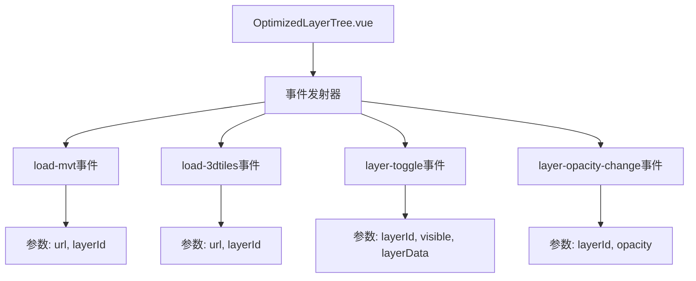
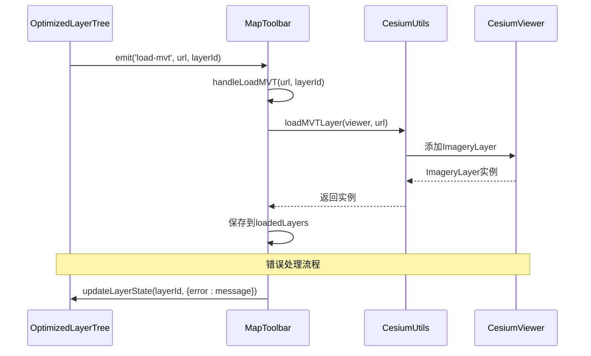
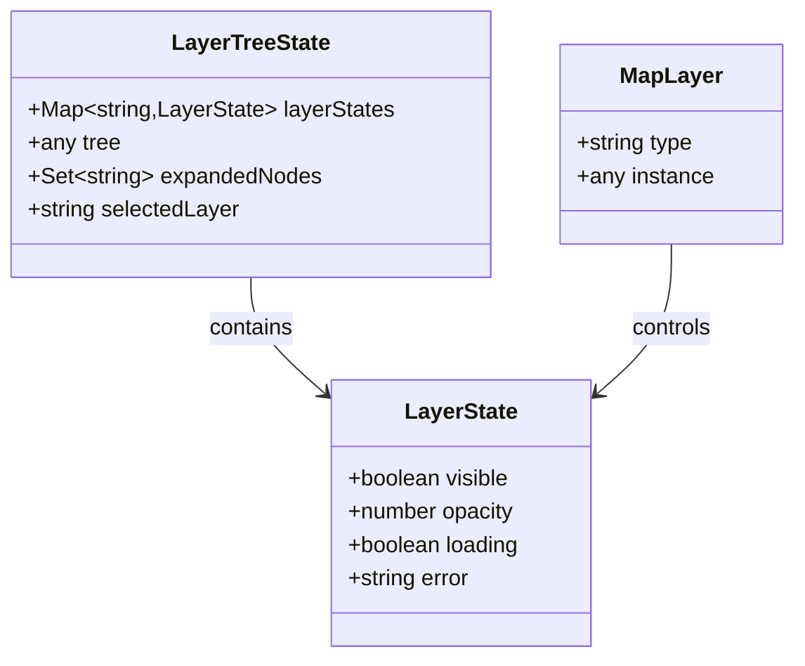
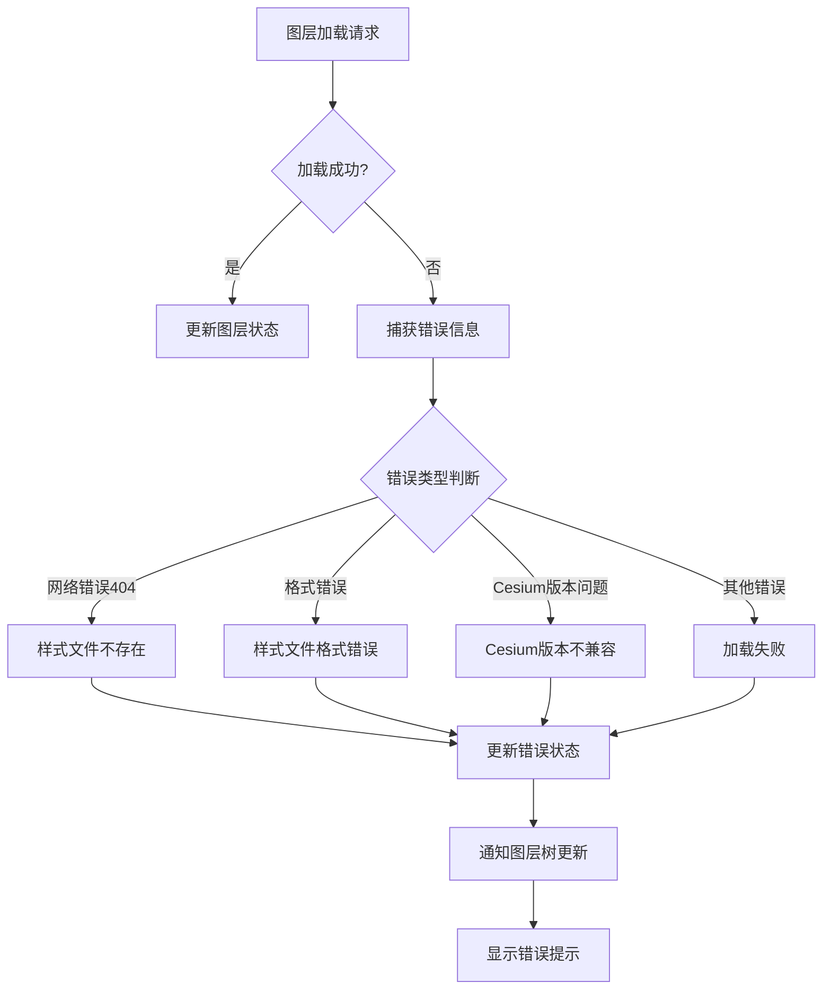
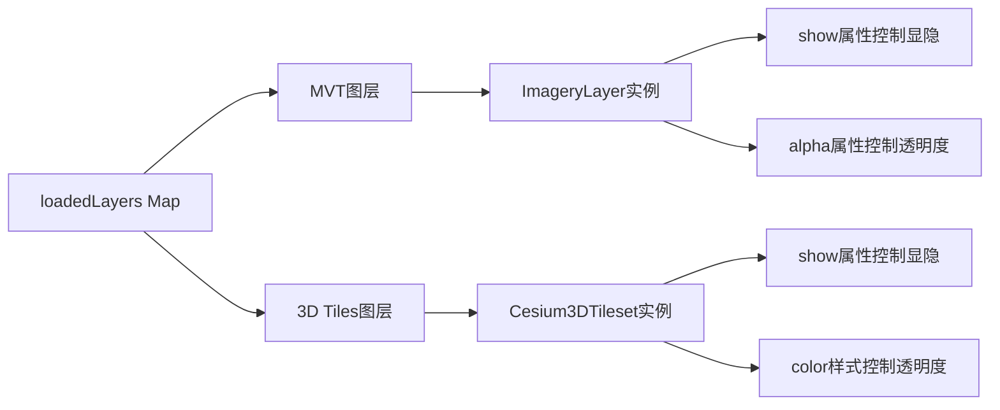
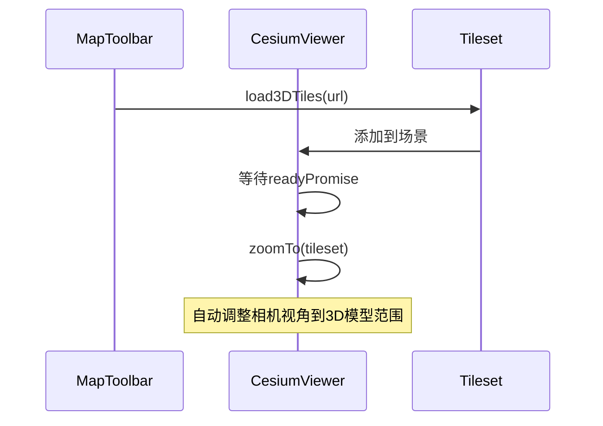
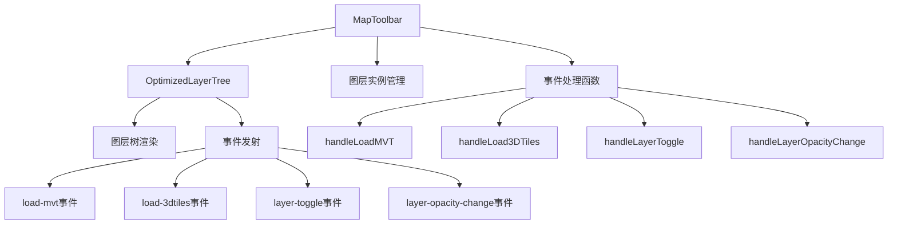

# 图层树事件通信机制

<cite>
**本文档引用的文件**
- [OptimizedLayerTree.vue](file://src/mapComponents/OptimizedLayerTree.vue)
- [MapToolbar.vue](file://src/mapComponents/MapToolbar.vue)
- [useMapHooks.ts](file://src/hook/useMapHooks.ts)
- [mapStore.ts](file://src/stores/mapStore.ts)
- [README_LAYER_TREE.md](file://src/mapComponents/README_LAYER_TREE.md)
</cite>

## 目录
1. [概述](#概述)
2. [事件定义与触发机制](#事件定义与触发机制)
3. [事件监听与处理流程](#事件监听与处理流程)
4. [参数类型与数据结构](#参数类型与数据结构)
5. [错误处理机制](#错误处理机制)
6. [Cesium地图实例交互](#cesium地图实例交互)
7. [架构设计与组件关系](#架构设计与组件关系)
8. [性能优化考虑](#性能优化考虑)
9. [故障排查指南](#故障排查指南)

## 概述

OptimizedLayerTree.vue与MapToolbar.vue之间通过Vue的事件通信机制实现图层树与工具栏的功能协作。该机制定义了四种核心事件：`load-mvt`、`load-3dtiles`、`layer-toggle`和`layer-opacity-change`，用于处理不同类型的图层加载、显隐控制和透明度调整操作。

### 核心特性

- **事件驱动架构**：采用Vue事件系统实现组件间解耦通信
- **多图层类型支持**：统一处理MVT、3D Tiles、WMS等不同图层类型
- **状态同步机制**：确保图层树状态与实际地图状态一致
- **错误恢复能力**：完善的错误处理和状态回滚机制

## 事件定义与触发机制

### 事件声明与参数规范

OptimizedLayerTree.vue通过`defineEmits`声明了四个核心事件：



**图表来源**
- [OptimizedLayerTree.vue](file://src/mapComponents/OptimizedLayerTree.vue#L85-L89)

### 事件触发时机

| 事件类型 | 触发条件 | 数据来源 |
|---------|---------|---------|
| `load-mvt` | 用户勾选MVT图层 | `handleLayerVisibilityChange()` |
| `load-3dtiles` | 用户勾选3D Tiles图层 | `handleLayerVisibilityChange()` |
| `layer-toggle` | 图层显隐状态变化 | `handleCheckedKeysChange()` |
| `layer-opacity-change` | 图层透明度调整 | 用户界面交互 |

**章节来源**
- [OptimizedLayerTree.vue](file://src/mapComponents/OptimizedLayerTree.vue#L356-L393)

## 事件监听与处理流程

### MapToolbar中的事件监听

MapToolbar通过`@`语法监听OptimizedLayerTree发出的事件，并提供对应的处理函数：



**图表来源**
- [MapToolbar.vue](file://src/mapComponents/MapToolbar.vue#L147-L272)

### 事件处理函数详解

#### handleLoadMVT函数

负责处理MVT矢量瓦片图层的加载：

- **输入参数**：`url: string`（样式文件URL）、`layerId: string`（图层标识）
- **处理流程**：
  1. 验证Cesium Viewer实例可用性
  2. 调用`cesiumUtils.loadMVTLayer()`加载图层
  3. 将返回的ImageryLayer实例保存到`loadedLayers`映射
  4. 捕获加载异常并更新图层状态

#### handleLoad3DTiles函数

负责处理3D Tiles三维模型图层的加载：

- **输入参数**：`url: string`（tileset.json URL）、`layerId: string`（图层标识）
- **处理流程**：
  1. 验证Cesium Viewer实例
  2. 调用`cesiumUtils.load3DTiles()`创建3D Tiles实例
  3. 将tileset添加到场景中
  4. 设置初始可见性和相机视角
  5. 处理加载失败情况

#### handleLayerToggle函数

统一处理图层显隐状态切换：

- **输入参数**：`layerId: string`、`visible: boolean`、`layerData: any`
- **处理逻辑**：
  1. 检查图层是否已加载
  2. 根据类型调用相应的显示/隐藏方法
  3. 对于未加载的图层，触发相应类型的加载

#### handleLayerOpacityChange函数

处理图层透明度调整：

- **输入参数**：`layerId: string`、`opacity: number`（0-1范围）
- **处理逻辑**：
  1. 获取已加载的图层实例
  2. 根据图层类型设置不同的透明度控制方式
  3. MVT图层使用`alpha`属性，3D Tiles使用`color`样式

**章节来源**
- [MapToolbar.vue](file://src/mapComponents/MapToolbar.vue#L147-L272)

## 参数类型与数据结构

### 事件参数详细说明

#### load-mvt事件参数

| 参数名 | 类型 | 描述 | 示例值 |
|-------|------|------|--------|
| `url` | string | MVT样式文件URL | `/api/tiles/style.json` |
| `layerId` | string | 图层唯一标识符 | `layer-bridge-001` |

#### load-3dtiles事件参数

| 参数名 | 类型 | 描述 | 示例值 |
|-------|------|------|--------|
| `url` | string | 3D Tiles tileset.json URL | `/api/3dtiles/buildings/tileset.json` |
| `layerId` | string | 图层唯一标识符 | `layer-building-001` |

#### layer-toggle事件参数

| 参数名 | 类型 | 描述 | 示例值 |
|-------|------|------|--------|
| `layerId` | string | 图层唯一标识符 | `layer-water-001` |
| `visible` | boolean | 是否可见 | `true` 或 `false` |
| `layerData` | any | 完整图层数据对象 | `{id: '...', name: '...', type: '...'}` |

#### layer-opacity-change事件参数

| 参数名 | 类型 | 描述 | 取值范围 |
|-------|------|------|----------|
| `layerId` | string | 图层唯一标识符 | 全局唯一字符串 |
| `opacity` | number | 透明度值 | 0.0 - 1.0 |

### 图层状态数据结构



**图表来源**
- [mapStore.ts](file://src/stores/mapStore.ts#L243-L263)
- [OptimizedLayerTree.vue](file://src/mapComponents/OptimizedLayerTree.vue#L101-L111)

**章节来源**
- [OptimizedLayerTree.vue](file://src/mapComponents/OptimizedLayerTree.vue#L85-L89)
- [MapToolbar.vue](file://src/mapComponents/MapToolbar.vue#L147-L272)

## 错误处理机制

### 错误分类与处理策略

系统实现了完善的错误处理机制，针对不同类型的错误提供友好的用户反馈：



**图表来源**
- [MapToolbar.vue](file://src/mapComponents/MapToolbar.vue#L161-L222)

### 错误信息映射表

| 错误特征 | 用户友好错误信息 | 处理策略 |
|---------|-----------------|---------|
| 包含"404"或"不存在"| 样式文件不存在 | 提示检查URL配置 |
| 包含"version"、"sources"、"layers"| 样式文件格式错误 | 建议检查JSON格式 |
| 包含"not a function"| Cesium版本不兼容 | 建议升级Cesium版本 |
| 其他网络错误 | 加载失败 | 通用错误提示 |

### 状态同步机制

错误发生时，系统通过以下步骤确保状态一致性：

1. **错误捕获**：在异步加载函数中捕获所有异常
2. **状态更新**：调用`updateLayerState()`更新图层错误状态
3. **用户反馈**：在图层树中显示具体的错误信息
4. **状态回滚**：自动将图层状态重置为未加载状态

**章节来源**
- [MapToolbar.vue](file://src/mapComponents/MapToolbar.vue#L161-L222)
- [OptimizedLayerTree.vue](file://src/mapComponents/OptimizedLayerTree.vue#L417-L434)

## Cesium地图实例交互

### 图层实例管理

MapToolbar维护了一个`loadedLayers`映射，用于跟踪已加载的图层实例：



**图表来源**
- [MapToolbar.vue](file://src/mapComponents/MapToolbar.vue#L108-L109)

### 图层控制方法

#### MVT图层控制

- **显示/隐藏**：通过`ImageryLayer.show`属性
- **透明度控制**：通过`ImageryLayer.alpha`属性
- **实例获取**：从`loadedLayers`映射中获取

#### 3D Tiles图层控制

- **显示/隐藏**：通过`Cesium3DTileset.show`属性
- **透明度控制**：通过`Cesium3DTileStyle`设置颜色样式
- **实例获取**：从`loadedLayers`映射中获取

### 相机视角控制

系统提供了智能的相机视角调整功能：



**图表来源**
- [useMapHooks.ts](file://src/hook/useMapHooks.ts#L141-L143)

**章节来源**
- [MapToolbar.vue](file://src/mapComponents/MapToolbar.vue#L108-L272)
- [useMapHooks.ts](file://src/hook/useMapHooks.ts#L141-L143)

## 架构设计与组件关系

### 组件层次结构



**图表来源**
- [MapToolbar.vue](file://src/mapComponents/MapToolbar.vue#L18-L23)

### 数据流向

事件通信遵循单向数据流原则：

1. **用户交互** → 图层树组件
2. **事件发射** → 工具栏组件
3. **状态更新** → Cesium地图实例
4. **状态同步** → 图层树组件

### 组件职责分离

| 组件 | 职责 | 输入 | 输出 |
|------|------|------|------|
| OptimizedLayerTree | 图层树渲染与状态管理 | 图层数据、用户交互 | 事件发射 |
| MapToolbar | 图层加载与控制 | 事件监听、Cesium实例 | 图层实例管理 |

**章节来源**
- [OptimizedLayerTree.vue](file://src/mapComponents/OptimizedLayerTree.vue#L70-L90)
- [MapToolbar.vue](file://src/mapComponents/MapToolbar.vue#L78-L106)

## 性能优化考虑

### 按需加载策略

系统采用懒加载模式，只有在用户勾选图层时才进行实际加载：

- **初始渲染**：仅渲染图层树结构，不加载图层数据
- **延迟加载**：用户勾选图层时触发加载
- **资源释放**：用户取消勾选时释放图层资源

### 状态缓存机制

- **图层状态缓存**：使用Map存储图层状态，避免重复计算
- **实例复用**：已加载的图层实例在显隐切换时复用
- **防抖处理**：透明度调整使用防抖机制减少频繁更新

### 内存管理

- **及时清理**：取消勾选时从`loadedLayers`中移除图层实例
- **弱引用**：避免循环引用导致内存泄漏
- **错误恢复**：加载失败时自动清理临时状态

## 故障排查指南

### 常见问题诊断

#### 图层树不显示

**可能原因**：
- `getLayerTree`接口返回空数据
- 数据格式不符合`LayerTreeNode`接口
- 网络请求失败

**排查步骤**：
1. 检查浏览器开发者工具中的网络请求
2. 验证API返回的数据格式
3. 查看控制台错误信息

#### MVT图层加载失败

**可能原因**：
- 样式文件URL不可访问
- style.json格式不正确
- 网络连接问题

**排查步骤**：
1. 直接访问样式文件URL确认可访问性
2. 验证style.json的JSON格式正确性
3. 检查Cesium控制台错误信息

#### 3D Tiles加载失败

**可能原因**：
- tileset.json文件不存在
- Cesium版本不支持3D Tiles
- 网络请求超时

**排查步骤**：
1. 检查tileset.json文件路径
2. 确认Cesium版本支持3D Tiles功能
3. 查看网络请求状态码

### 调试技巧

#### 启用详细日志

在关键函数中添加调试输出：

```typescript
console.log(`🔄 加载${layerType}图层: ${layerId}`);
console.log(`✅ ${layerType}图层加载成功: ${layerId}`);
console.error(`❌ ${layerType}图层加载失败: ${layerId}`, error);
```

#### 状态监控

使用Vue DevTools监控图层状态变化：

- `layerStates`：图层状态Map
- `loadedLayers`：已加载图层映射
- `loading`：加载状态指示器

**章节来源**
- [README_LAYER_TREE.md](file://src/mapComponents/README_LAYER_TREE.md#L228-L244)

## 总结

OptimizedLayerTree与MapToolbar之间的事件通信机制体现了现代前端架构的最佳实践：

- **解耦设计**：通过事件系统实现组件间的松耦合
- **类型安全**：严格的TypeScript类型定义确保参数正确性
- **错误恢复**：完善的错误处理机制保证系统稳定性
- **性能优化**：按需加载和状态缓存提升用户体验

这套机制不仅满足了当前的功能需求，还为未来的扩展提供了良好的基础。通过清晰的事件定义、合理的错误处理和高效的资源管理，系统能够稳定地处理各种复杂的图层操作场景。