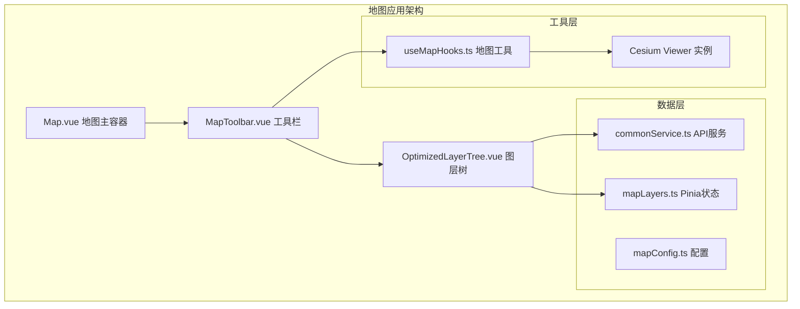
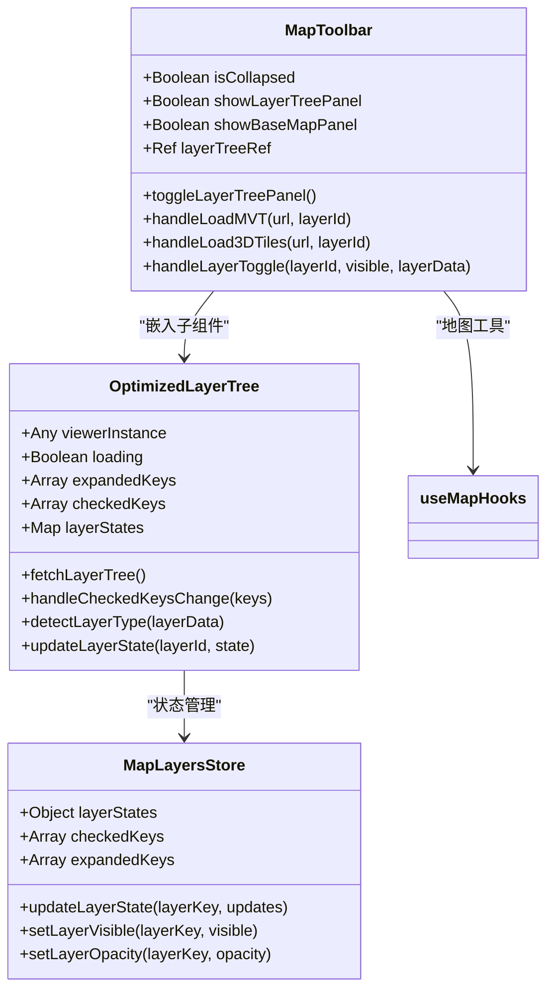
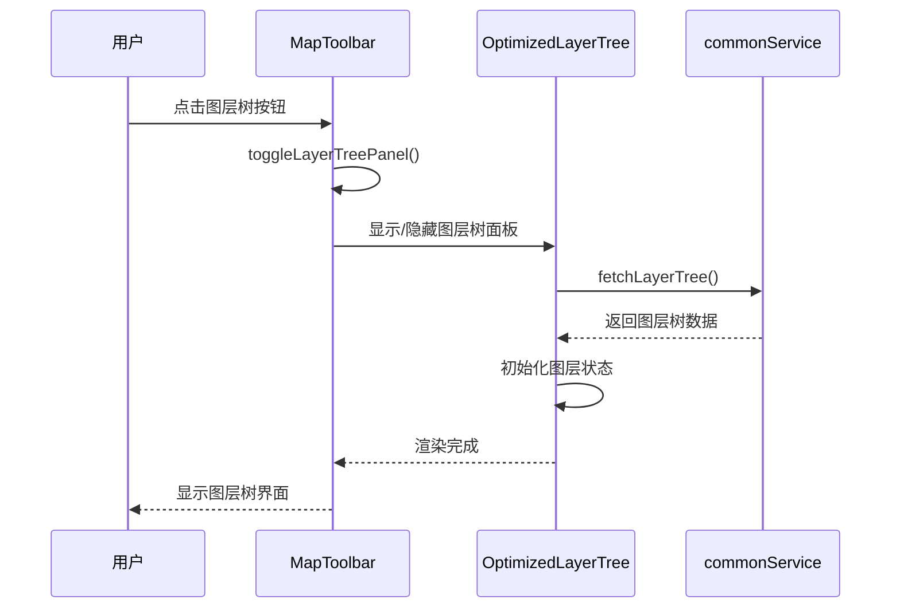
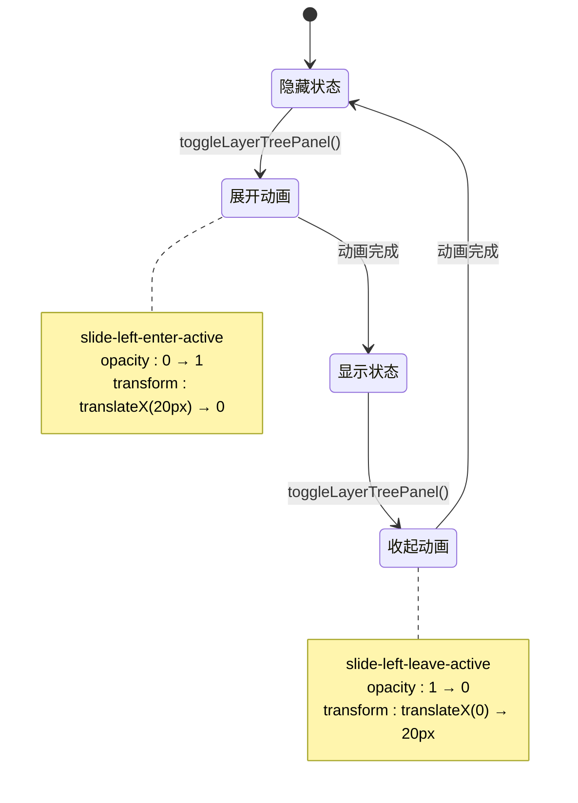
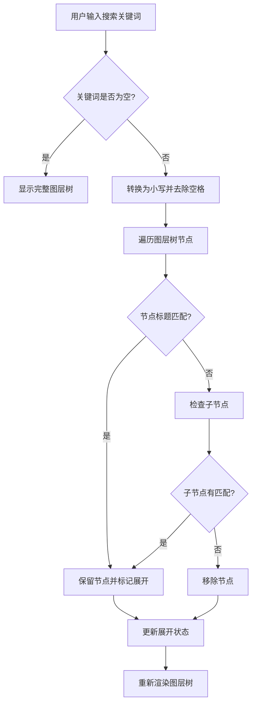
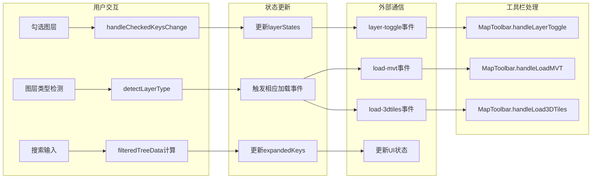
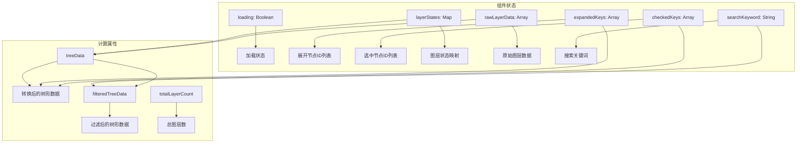
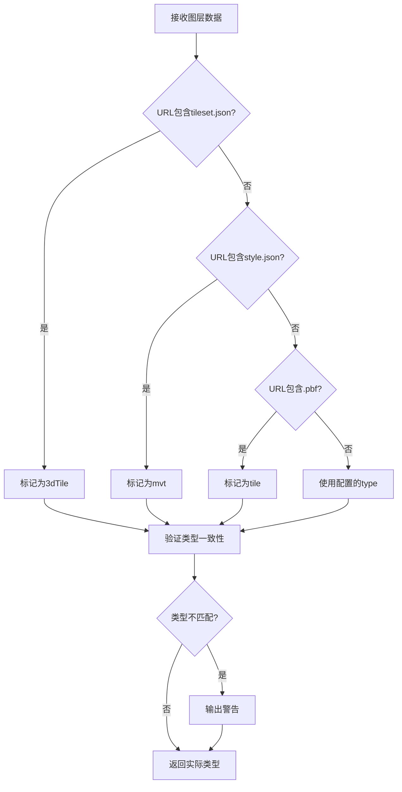
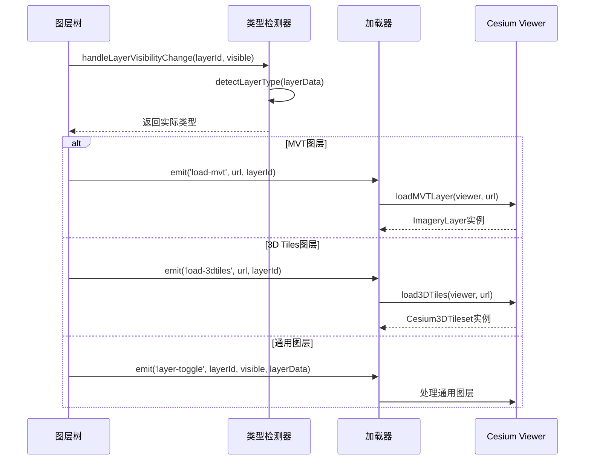
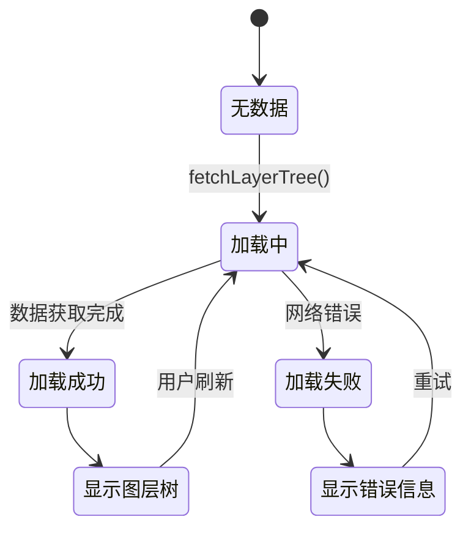

# 图层树组件集成文档

<cite>
**本文档引用的文件**
- [OptimizedLayerTree.vue](file://src/mapComponents/OptimizedLayerTree.vue)
- [MapToolbar.vue](file://src/mapComponents/MapToolbar.vue)
- [mapLayers.ts](file://src/stores/mapLayers.ts)
- [commonService.ts](file://src/services/commonService.ts)
- [useMapHooks.ts](file://src/hook/useMapHooks.ts)
- [mapConfig.ts](file://src/config/mapConfig.ts)
- [LAYER_TREE_QUICK_START.md](file://LAYER_TREE_QUICK_START.md)
- [MAP_TOOLBAR_INTEGRATION.md](file://MAP_TOOLBAR_INTEGRATION.md)
</cite>

## 目录
1. [简介](#简介)
2. [组件架构](#组件架构)
3. [MapToolbar集成](#maptoolbar集成)
4. [图层树显示逻辑](#图层树显示逻辑)
5. [事件通信机制](#事件通信机制)
6. [数据结构定义](#数据结构定义)
7. [状态管理机制](#状态管理机制)
8. [图层类型处理](#图层类型处理)
9. [动画效果实现](#动画效果实现)
10. [故障排除指南](#故障排除指南)

## 简介

OptimizedLayerTree.vue是一个高性能的图层树组件，专门设计用于GIS地图应用中的图层管理和可视化。该组件作为MapToolbar.vue的子组件嵌入，提供了完整的图层树功能，包括图层显示/隐藏、透明度调节、搜索过滤等功能。

### 核心特性

- **高性能渲染**：基于Naive UI Tree组件，支持大数据量图层树的流畅展示
- **智能图层加载**：按需加载MVT和3D Tiles图层，优化内存使用
- **实时状态同步**：与工具栏组件保持状态同步
- **丰富的交互体验**：支持搜索、展开/折叠、拖拽等操作
- **完善的错误处理**：提供详细的加载状态和错误信息

## 组件架构

### 整体架构图



**架构图来源**
- [Map.vue](file://src/mapComponents/Map.vue)
- [MapToolbar.vue](file://src/mapComponents/MapToolbar.vue)
- [OptimizedLayerTree.vue](file://src/mapComponents/OptimizedLayerTree.vue)

### 组件层次结构



**类图来源**
- [MapToolbar.vue](file://src/mapComponents/MapToolbar.vue#L78-L106)
- [OptimizedLayerTree.vue](file://src/mapComponents/OptimizedLayerTree.vue#L77-L90)
- [mapLayers.ts](file://src/stores/mapLayers.ts#L11-L113)

## MapToolbar集成

### 嵌入方式

OptimizedLayerTree作为MapToolbar的子组件，通过条件渲染和过渡动画实现动态显示：



**序列图来源**
- [MapToolbar.vue](file://src/mapComponents/MapToolbar.vue#L128-L135)
- [OptimizedLayerTree.vue](file://src/mapComponents/OptimizedLayerTree.vue#L116-L139)

### Props传递

MapToolbar向OptimizedLayerTree传递必要的Props：

| Prop名称 | 类型 | 描述 | 必需 |
|---------|------|------|------|
| `viewerInstance` | `any` | Cesium Viewer实例 | 否 |
| `@load-mvt` | `Function` | MVT图层加载事件 | 是 |
| `@load-3dtiles` | `Function` | 3D Tiles图层加载事件 | 是 |
| `@layer-toggle` | `Function` | 图层显隐切换事件 | 是 |
| `@layer-opacity-change` | `Function` | 图层透明度变化事件 | 是 |

**节来源**
- [MapToolbar.vue](file://src/mapComponents/MapToolbar.vue#L18-L22)
- [OptimizedLayerTree.vue](file://src/mapComponents/OptimizedLayerTree.vue#L85-L89)

## 图层树显示逻辑

### 展开/收起动画

图层树面板使用Vue的transition组件实现平滑的展开/收起动画：



**状态图来源**
- [MapToolbar.vue](file://src/mapComponents/MapToolbar.vue#L487-L501)

### 搜索功能实现

图层树支持实时搜索过滤，当输入关键词时自动展开匹配的节点：



**流程图来源**
- [OptimizedLayerTree.vue](file://src/mapComponents/OptimizedLayerTree.vue#L219-L268)

**节来源**
- [OptimizedLayerTree.vue](file://src/mapComponents/OptimizedLayerTree.vue#L9-L23)

## 事件通信机制

### 事件流图



**事件流图来源**
- [OptimizedLayerTree.vue](file://src/mapComponents/OptimizedLayerTree.vue#L300-L323)
- [MapToolbar.vue](file://src/mapComponents/MapToolbar.vue#L146-L226)

### 事件定义

| 事件名称 | 参数 | 描述 |
|---------|------|------|
| `layer-toggle` | `(layerId: string, visible: boolean, layerData: any)` | 图层显隐状态变化 |
| `layer-opacity-change` | `(layerId: string, opacity: number)` | 图层透明度变化 |
| `load-mvt` | `(url: string, layerId: string)` | 加载MVT图层 |
| `load-3dtiles` | `(url: string, layerId: string)` | 加载3D Tiles图层 |

**节来源**
- [OptimizedLayerTree.vue](file://src/mapComponents/OptimizedLayerTree.vue#L85-L89)

## 数据结构定义

### 图层树数据结构

图层树组件支持多层次的嵌套结构：

```typescript
interface TreeNode {
  id: string;           // 唯一标识符
  name: string;         // 显示名称
  type: string;         // 图层类型 (group/mvt/3dTile/tile/wms)
  url?: string;         // 图层URL
  visible?: boolean;    // 可见性
  opacity?: number;     // 透明度
  expanded?: boolean;   // 展开状态
  child?: TreeNode[];   // 子节点
}
```

### 图层状态结构

```typescript
interface LayerState {
  visible: boolean;     // 是否可见
  opacity: number;      // 透明度 (0-1)
  loading: boolean;     // 加载状态
  error: string | null; // 错误信息
}
```

### 示例数据格式

```json
{
  "id": "group-1",
  "name": "业务图层",
  "type": "group",
  "expanded": "true",
  "child": [
    {
      "id": "layer-1",
      "name": "桥梁设施",
      "type": "mvt",
      "url": "/api/tiles/bridges/style.json",
      "visible": "true",
      "opacity": 1.0
    }
  ]
}
```

**节来源**
- [OptimizedLayerTree.vue](file://src/mapComponents/OptimizedLayerTree.vue#L101-L111)
- [commonService.ts](file://src/services/commonService.ts#L87-L91)

## 状态管理机制

### 内部状态管理

OptimizedLayerTree组件内部维护以下状态：



**状态图来源**
- [OptimizedLayerTree.vue](file://src/mapComponents/OptimizedLayerTree.vue#L93-L111)

### 状态同步机制

组件通过多种方式保持状态同步：

1. **Props传递**：从父组件接收viewer实例和回调函数
2. **事件发射**：向父组件发送状态变更事件
3. **内部计算**：通过computed属性自动更新派生状态
4. **响应式更新**：使用Vue的响应式系统自动更新UI

**节来源**
- [OptimizedLayerTree.vue](file://src/mapComponents/OptimizedLayerTree.vue#L77-L90)

## 图层类型处理

### 支持的图层类型

| 类型 | 说明 | URL示例 | 加载方式 |
|------|------|---------|----------|
| `group` | 分组节点 | 无需URL | 本地处理 |
| `mvt` | MVT矢量瓦片 | `/api/tiles/style.json` | `loadMVTLayer` |
| `3dTile` | 3D Tiles模型 | `/api/3dtiles/tileset.json` | `load3DTiles` |
| `tile` | 普通瓦片 | `/api/tiles/{z}/{x}/{y}.pbf` | 通用图层加载 |
| `wms` | WMS服务 | `http://geoserver/wms` | 通用图层加载 |

### 智能类型检测

组件实现了智能的图层类型检测机制：



**流程图来源**
- [OptimizedLayerTree.vue](file://src/mapComponents/OptimizedLayerTree.vue#L326-L351)

### 图层加载流程



**序列图来源**
- [OptimizedLayerTree.vue](file://src/mapComponents/OptimizedLayerTree.vue#L354-L394)
- [useMapHooks.ts](file://src/hook/useMapHooks.ts#L39-L92)

**节来源**
- [OptimizedLayerTree.vue](file://src/mapComponents/OptimizedLayerTree.vue#L326-L394)

## 动画效果实现

### 展开/收起动画

图层树面板使用CSS过渡动画实现流畅的展开/收起效果：

```scss
// 展开动画
.slide-left-enter-active {
  transition: all 0.3s ease;
}

.slide-left-enter-from {
  opacity: 0;
  transform: translateX(20px);
}

// 收起动画
.slide-left-leave-active {
  transition: all 0.3s ease;
}

.slide-left-leave-to {
  opacity: 0;
  transform: translateX(20px);
}
```

### 加载状态动画

组件提供了完整的加载状态反馈：



**状态图来源**
- [OptimizedLayerTree.vue](file://src/mapComponents/OptimizedLayerTree.vue#L33-L34)

### 交互反馈动画

- **节点悬停效果**：背景色渐变
- **复选框切换**：平滑的选中状态变化
- **图标动画**：展开/折叠图标旋转
- **搜索高亮**：匹配项背景色变化

**节来源**
- [OptimizedLayerTree.vue](file://src/mapComponents/OptimizedLayerTree.vue#L487-L501)

## 故障排除指南

### 常见问题及解决方案

#### 1. 图层树不显示

**症状**：点击图层树按钮后面板不出现

**可能原因**：
- `getLayerTree()` API调用失败
- 网络连接问题
- 数据格式不正确

**解决步骤**：
1. 检查浏览器开发者工具中的网络请求
2. 验证API返回的数据格式
3. 确认后端服务正常运行

#### 2. MVT图层加载失败

**症状**：选择MVT图层后无显示或报错

**可能原因**：
- 样式文件URL错误
- 网络权限问题
- Cesium版本不兼容

**解决步骤**：
1. 验证style.json文件存在且可访问
2. 检查跨域资源共享(CORS)设置
3. 确认Cesium版本支持MVT加载

#### 3. 3D Tiles图层显示异常

**症状**：3D模型不显示或显示不完整

**可能原因**：
- tileset.json格式错误
- 模型文件缺失
- 相机位置不当

**解决步骤**：
1. 验证tileset.json文件格式
2. 检查模型文件路径
3. 调整相机视角

### 调试技巧

#### 1. 启用详细日志

```typescript
// 在OptimizedLayerTree中添加调试信息
console.log('图层树数据:', rawLayerData.value);
console.log('图层状态:', layerStates.value);
console.log('选中节点:', checkedKeys.value);
```

#### 2. 检查事件触发

```typescript
// 在MapToolbar中监听事件
const handleLoadMVT = (url: string, layerId: string) => {
  console.log('MVT加载事件:', { url, layerId });
  // ... 实际处理逻辑
};
```

#### 3. 验证Props传递

```typescript
// 在OptimizedLayerTree中验证Props
watch(() => props.viewerInstance, (newValue) => {
  console.log('Viewer实例更新:', newValue);
});
```

**节来源**
- [LAYER_TREE_QUICK_START.md](file://LAYER_TREE_QUICK_START.md#L133-L152)
- [MAP_TOOLBAR_INTEGRATION.md](file://MAP_TOOLBAR_INTEGRATION.md#L142-L226)

## 总结

OptimizedLayerTree.vue组件作为现代GIS应用的核心组件，提供了完整的图层管理功能。通过与MapToolbar的深度集成，实现了流畅的用户体验和高效的状态管理。

### 主要优势

1. **高性能渲染**：基于Vue响应式系统和Naive UI组件库
2. **智能加载**：按需加载图层，优化资源使用
3. **丰富交互**：支持搜索、过滤、拖拽等多种操作
4. **完善错误处理**：提供详细的加载状态和错误信息
5. **易于扩展**：清晰的架构设计便于功能扩展

### 最佳实践建议

1. **合理使用缓存**：对于频繁访问的图层数据进行缓存
2. **优化网络请求**：使用CDN加速图层资源加载
3. **监控性能指标**：定期检查组件渲染性能
4. **完善错误处理**：为各种异常情况提供友好的用户提示

通过遵循本文档的指导原则和最佳实践，开发者可以充分发挥OptimizedLayerTree组件的强大功能，构建出色的GIS应用界面。