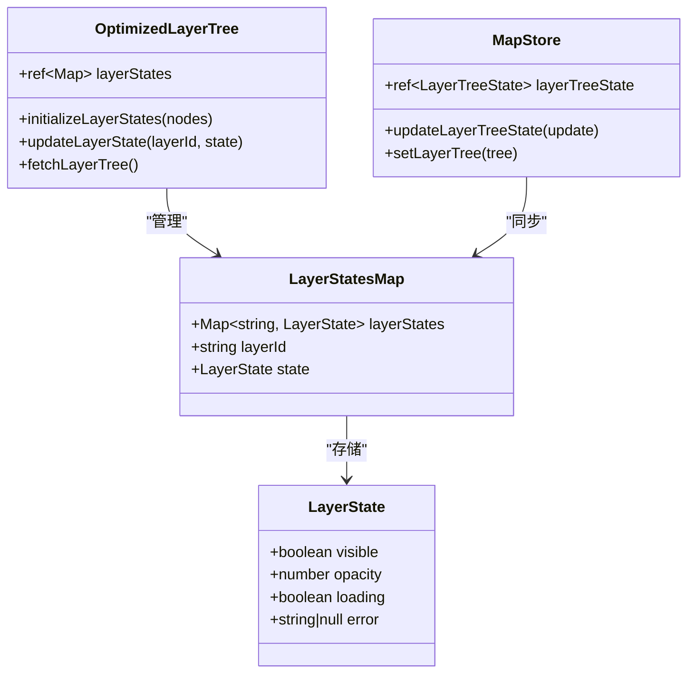
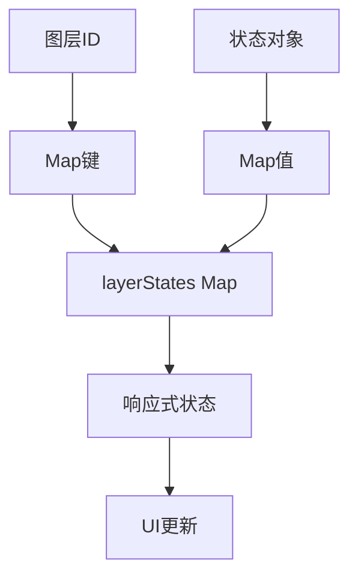
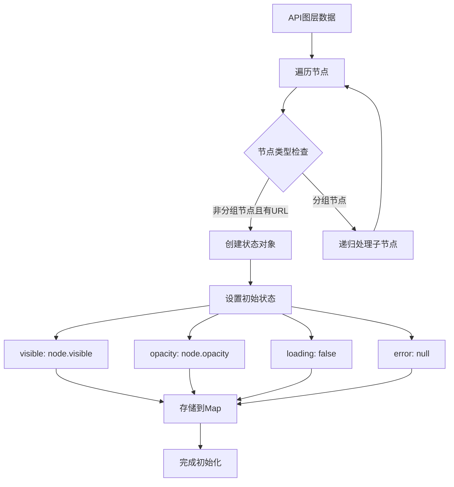
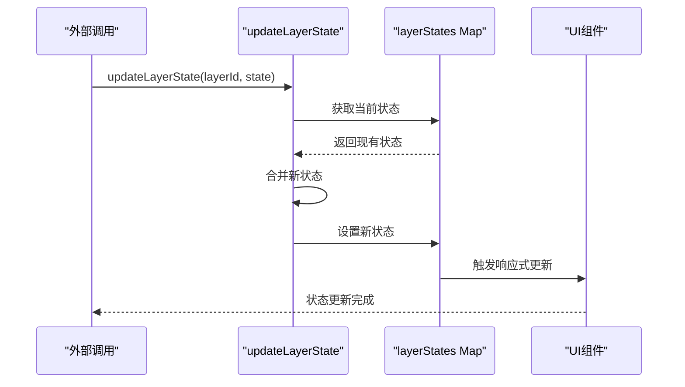
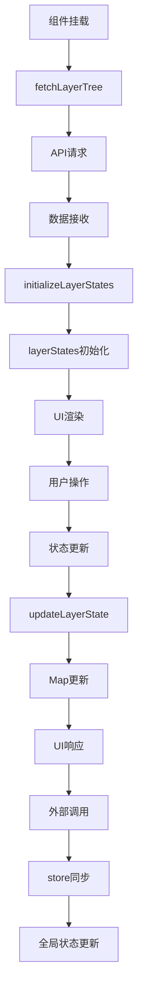
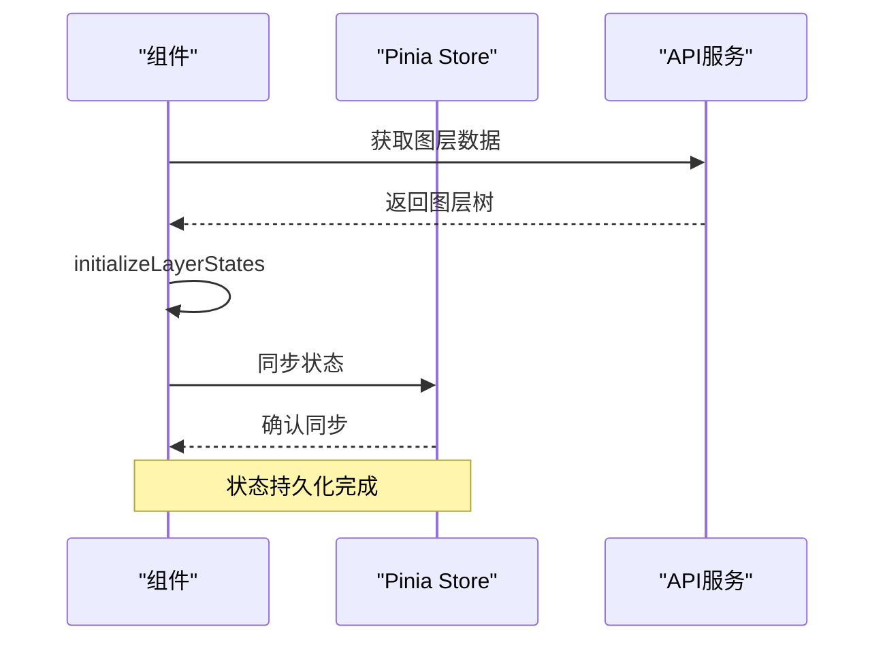

# 图层状态管理机制

<cite>
**本文档引用的文件**
- [OptimizedLayerTree.vue](file://src/mapComponents/OptimizedLayerTree.vue)
- [mapStore.ts](file://src/stores/mapStore.ts)
- [mapLayers.ts](file://src/stores/mapLayers.ts)
- [commonService.ts](file://src/services/commonService.ts)
- [MapToolbar.vue](file://src/mapComponents/MapToolbar.vue)
- [mapConfig.ts](file://src/config/mapConfig.ts)
</cite>

## 目录
1. [概述](#概述)
2. [核心架构](#核心架构)
3. [layerStates Map设计](#layerstates-map设计)
4. [状态初始化机制](#状态初始化机制)
5. [状态更新流程](#状态更新流程)
6. [与Pinia Store的交互](#与pinia-store的交互)
7. [组件生命周期管理](#组件生命周期管理)
8. [最佳实践](#最佳实践)
9. [常见问题解决](#常见问题解决)
10. [总结](#总结)

## 概述

OptimizedLayerTree.vue中的layerStates Map对象是整个图层管理系统的核心状态存储机制。该Map对象负责维护每个图层的完整状态信息，包括可见性、透明度、加载状态和错误信息，为图层树组件提供了统一的状态管理接口。

## 核心架构

### 状态存储结构



**图表来源**
- [OptimizedLayerTree.vue](file://src/mapComponents/OptimizedLayerTree.vue#L101-L111)
- [mapStore.ts](file://src/stores/mapStore.ts#L39-L45)

### 状态字段详解

layerStates Map中的每个图层状态包含以下四个核心字段：

| 字段名 | 类型 | 默认值 | 描述 |
|--------|------|--------|------|
| visible | boolean | false | 图层可见性状态 |
| opacity | number | 1.0 | 图层透明度值(0-1) |
| loading | boolean | false | 图层加载状态 |
| error | string \| null | null | 错误信息描述 |

**章节来源**
- [OptimizedLayerTree.vue](file://src/mapComponents/OptimizedLayerTree.vue#L148-L153)

## layerStates Map设计

### 数据结构定义

layerStates是一个Vue响应式的Map对象，专门用于存储每个图层的状态信息：

```typescript
const layerStates = ref<Map<string, {
  visible: boolean;
  opacity: number;
  loading: boolean;
  error: string | null;
}>>(new Map());
```

### 设计特点

1. **键值对存储**: 以图层ID作为键，状态对象作为值
2. **响应式更新**: 使用Vue的ref包装，确保状态变化能触发UI更新
3. **类型安全**: 严格的TypeScript类型定义，防止状态结构错误
4. **灵活扩展**: 支持动态添加和删除图层状态

### 状态映射关系



**图表来源**
- [OptimizedLayerTree.vue](file://src/mapComponents/OptimizedLayerTree.vue#L101-L111)

**章节来源**
- [OptimizedLayerTree.vue](file://src/mapComponents/OptimizedLayerTree.vue#L101-L111)

## 状态初始化机制

### initializeLayerStates函数

initializeLayerStates函数负责从API返回的图层数据中提取状态信息并初始化layerStates Map：



**图表来源**
- [OptimizedLayerTree.vue](file://src/mapComponents/OptimizedLayerTree.vue#L145-L162)

### 初始化流程详解

1. **数据验证**: 检查节点是否为图层类型（非分组且有URL）
2. **状态提取**: 从节点配置中提取可见性和透明度信息
3. **类型转换**: 将字符串形式的布尔值转换为布尔类型
4. **默认值设置**: 为loading和error字段设置初始值
5. **Map存储**: 将状态对象存储到layerStates Map中

### 状态初始化代码路径

- [initializeLayerStates函数](file://src/mapComponents/OptimizedLayerTree.vue#L145-L162)
- [状态初始化调用](file://src/mapComponents/OptimizedLayerTree.vue#L126-L128)

**章节来源**
- [OptimizedLayerTree.vue](file://src/mapComponents/OptimizedLayerTree.vue#L145-L162)

## 状态更新流程

### updateLayerState方法

updateLayerState方法提供了外部调用的接口来更新图层状态：



**图表来源**
- [updateLayerState方法](file://src/mapComponents/OptimizedLayerTree.vue#L417-L434)

### 状态更新机制

1. **状态合并**: 新状态会与现有状态进行浅合并
2. **部分更新**: 只更新指定的状态字段，保持其他字段不变
3. **响应式触发**: Vue的响应式系统自动检测变化并更新UI
4. **错误处理**: 如果图层ID不存在，更新操作会被忽略

### 外部调用示例

MapToolbar组件通过updateLayerState方法更新图层状态：

```typescript
// 加载失败时更新状态
layerTreeRef.value.updateLayerState(layerId, {
  loading: false,
  error: userFriendlyError,
});

// 图层显隐切换
layerTreeRef.value.updateLayerState(layerId, {
  visible: isChecked,
});
```

**章节来源**
- [updateLayerState方法](file://src/mapComponents/OptimizedLayerTree.vue#L417-L434)
- [MapToolbar中的调用](file://src/mapComponents/MapToolbar.vue#L178-L182)

## 与Pinia Store的交互

### store交互关系

OptimizedLayerTree中的layerStates与Pinia store中的layerTreeState存在双向同步关系：

```mermaid
graph LR
A[OptimizedLayerTree<br/>layerStates] < --> B[Pinia Store<br/>layerTreeState]
C[MapStore] --> B
D[MapLayersStore] --> B
subgraph "状态同步"
E[状态变更] --> F[store更新]
F --> G[其他组件订阅]
G --> H[UI响应]
end
```

**图表来源**
- [mapStore.ts](file://src/stores/mapStore.ts#L39-L45)
- [OptimizedLayerTree.vue](file://src/mapComponents/OptimizedLayerTree.vue#L98-L98)

### 状态同步机制

1. **写入同步**: OptimizedLayerTree的状态变更会同步到Pinia store
2. **读取同步**: Pinia store的状态变更会影响OptimizedLayerTree的显示
3. **冲突处理**: 优先级由业务逻辑决定，通常以OptimizedLayerTree为准

### store方法对应关系

| OptimizedLayerTree方法 | Pinia Store方法 | 用途 |
|------------------------|-----------------|------|
| updateLayerState | updateLayerTreeState | 更新图层状态 |
| layerStates | layerTreeState.layerStates | 获取状态Map |

**章节来源**
- [mapStore.ts](file://src/stores/mapStore.ts#L247-L262)

## 组件生命周期管理

### 生命周期流转图



**图表来源**
- [OptimizedLayerTree.vue](file://src/mapComponents/OptimizedLayerTree.vue#L436-L446)

### 关键生命周期节点

1. **组件挂载**: onMounted钩子触发数据加载
2. **数据获取**: fetchLayerTree异步获取图层树数据
3. **状态初始化**: initializeLayerStates构建初始状态
4. **UI渲染**: 响应式状态驱动界面更新
5. **状态变更**: 用户操作或外部调用触发状态更新
6. **持久化**: 状态变更同步到Pinia store

### 状态持久化流程



**图表来源**
- [commonService.ts](file://src/services/commonService.ts#L87-L91)
- [OptimizedLayerTree.vue](file://src/mapComponents/OptimizedLayerTree.vue#L116-L140)

**章节来源**
- [OptimizedLayerTree.vue](file://src/mapComponents/OptimizedLayerTree.vue#L436-L446)

## 最佳实践

### 状态管理原则

1. **单一职责**: 每个状态字段只负责一个功能
2. **不可变更新**: 使用Vue的响应式系统自动处理状态更新
3. **类型安全**: 严格使用TypeScript类型定义
4. **错误处理**: 完善的错误状态管理和用户友好的错误提示

### 性能优化策略

1. **懒加载**: 只在需要时加载图层状态
2. **批量更新**: 避免频繁的状态更新
3. **内存管理**: 及时清理不需要的状态
4. **响应式优化**: 合理使用computed和watch

### 代码组织建议

1. **模块化**: 将状态管理逻辑封装在独立函数中
2. **可测试性**: 提供清晰的接口便于单元测试
3. **文档化**: 为复杂的状态逻辑提供详细注释
4. **版本兼容**: 考虑状态结构的向后兼容性

## 常见问题解决

### 问题诊断表格

| 问题症状 | 可能原因 | 解决方案 |
|----------|----------|----------|
| 图层状态不更新 | 状态对象未正确更新 | 检查updateLayerState调用 |
| 状态丢失 | 组件重新渲染导致状态重置 | 确保状态持久化到store |
| 性能问题 | 频繁的状态更新 | 使用防抖或批量更新 |
| 内存泄漏 | 状态Map未及时清理 | 实现适当的清理机制 |

### 常见错误处理

1. **空状态处理**: 检查图层ID是否存在
2. **类型错误**: 确保状态字段类型正确
3. **并发问题**: 避免同时更新同一图层状态
4. **网络错误**: 实现重试机制和错误恢复

### 调试技巧

1. **状态监控**: 使用Vue DevTools观察状态变化
2. **日志记录**: 添加详细的console.log语句
3. **断点调试**: 在关键状态更新点设置断点
4. **单元测试**: 为状态管理逻辑编写测试用例

## 总结

OptimizedLayerTree.vue中的layerStates Map对象构成了一个完整而高效的地图图层状态管理机制。该机制通过以下特点实现了优秀的用户体验和开发体验：

1. **统一的状态管理**: 通过Map对象集中管理所有图层状态
2. **响应式更新**: 自动化的UI更新机制
3. **类型安全**: TypeScript提供的编译时类型检查
4. **可扩展性**: 支持动态添加和删除图层状态
5. **性能优化**: 合理的状态更新策略和内存管理

该状态管理机制不仅满足了当前的功能需求，还为未来的功能扩展提供了良好的基础。通过遵循本文档中的最佳实践和注意事项，开发者可以有效地维护和扩展这个重要的状态管理系统。