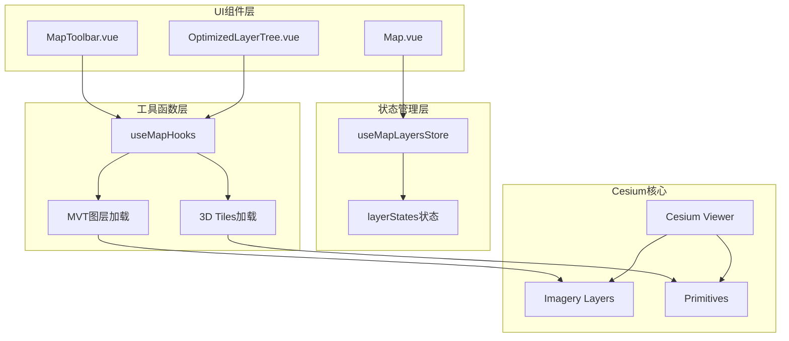
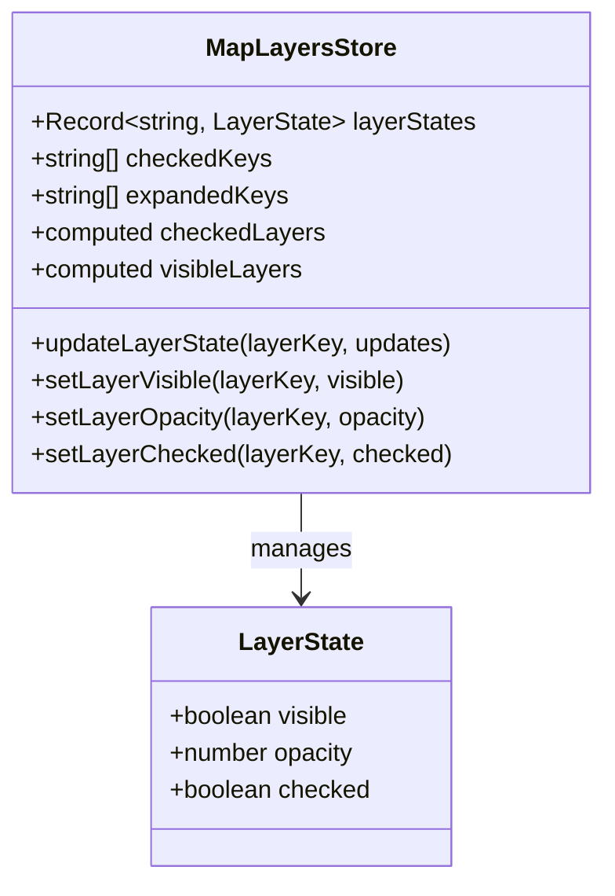
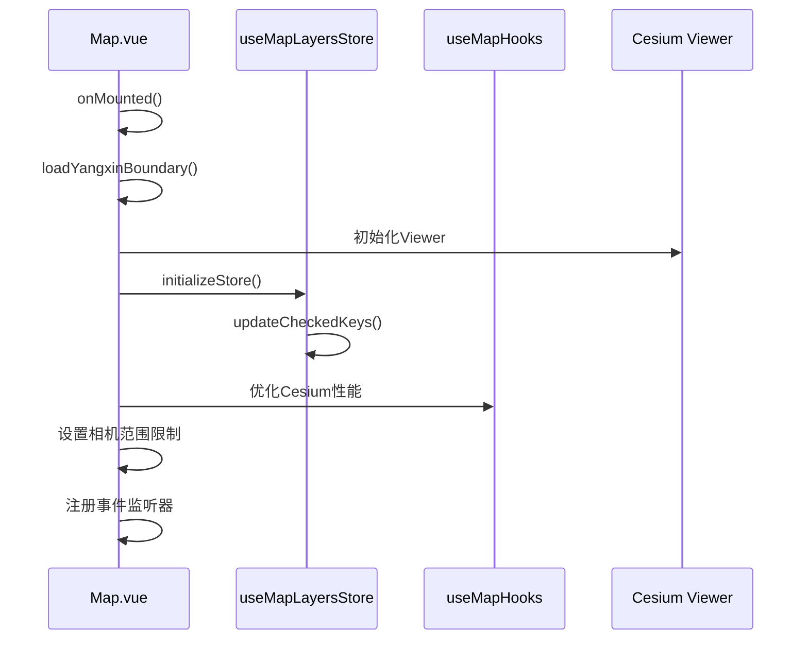
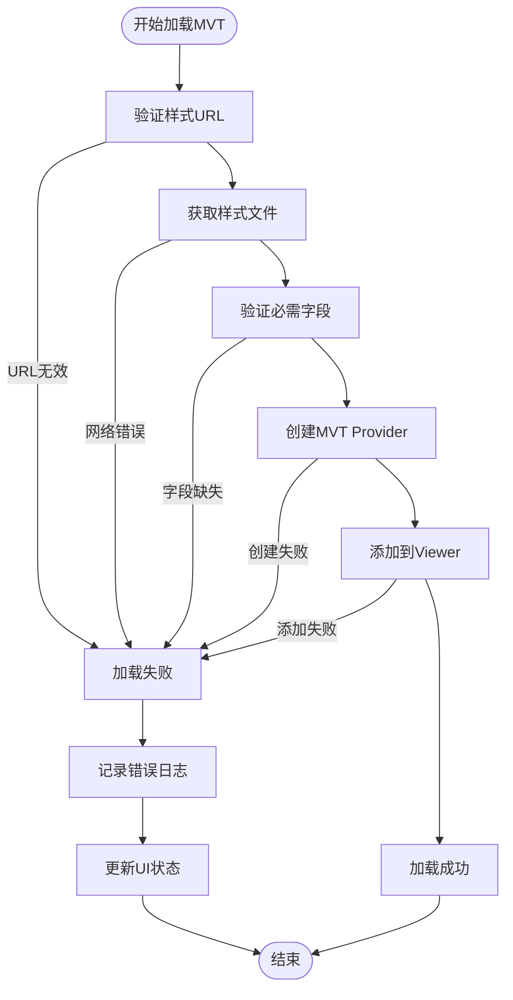
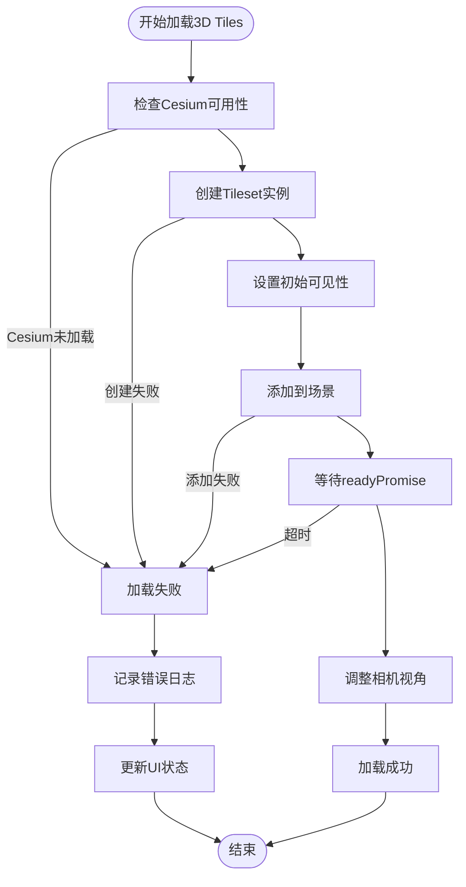
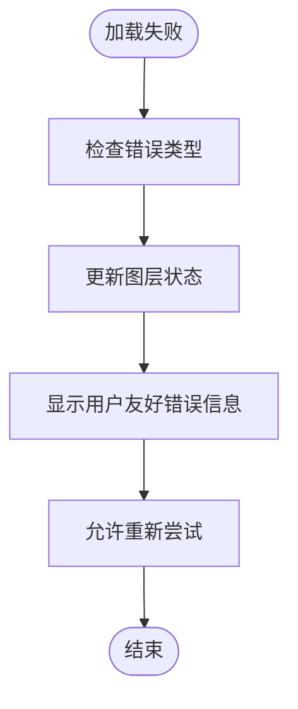
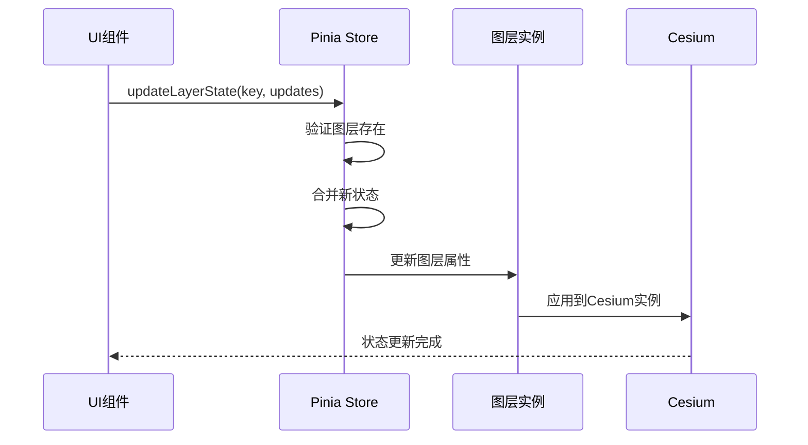
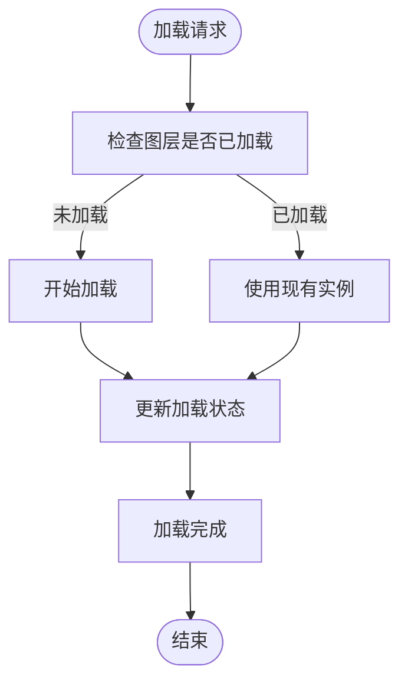

# 图层加载管理

<cite>
**本文档中引用的文件**
- [mapLayers.ts](file://src/stores/mapLayers.ts)
- [Map.vue](file://src/mapComponents/Map.vue)
- [OptimizedLayerTree.vue](file://src/mapComponents/OptimizedLayerTree.vue)
- [MapToolbar.vue](file://src/mapComponents/MapToolbar.vue)
- [useMapHooks.ts](file://src/hook/useMapHooks.ts)
- [mapConfig.ts](file://src/config/mapConfig.ts)
</cite>

## 目录
1. [简介](#简介)
2. [系统架构概览](#系统架构概览)
3. [Pinia状态管理](#pinia状态管理)
4. [图层状态字段详解](#图层状态字段详解)
5. [Map组件初始化流程](#map组件初始化流程)
6. [MVT图层异步加载机制](#mvt图层异步加载机制)
7. [3D Tiles图层异步加载机制](#3d-tiles图层异步加载机制)
8. [错误处理策略](#错误处理策略)
9. [图层状态更新机制](#图层状态更新机制)
10. [性能优化与重复加载避免](#性能优化与重复加载避免)
11. [实际代码示例](#实际代码示例)
12. [总结](#总结)

## 简介

本系统采用Vue 3 + Pinia + Cesium的架构，实现了完整的图层加载管理系统。通过Pinia的状态管理，结合Map组件的初始化流程，提供了高效的MVT和3D Tiles图层异步加载机制，同时具备完善的错误处理和性能优化策略。

## 系统架构概览



**图表来源**
- [mapLayers.ts](file://src/stores/mapLayers.ts#L11-L114)
- [Map.vue](file://src/mapComponents/Map.vue#L54-L432)
- [useMapHooks.ts](file://src/hook/useMapHooks.ts#L33-L545)

## Pinia状态管理

系统使用Pinia作为状态管理解决方案，主要通过`useMapLayersStore`管理图层状态。

### 核心状态结构



**图表来源**
- [mapLayers.ts](file://src/stores/mapLayers.ts#L5-L18)

### 状态初始化

系统在初始化时会设置默认的图层状态：

| 图层类型 | 默认可见性 | 默认透明度 | 默认勾选状态 |
|---------|-----------|----------|------------|
| bridge_layer | false | 1.0 | false |
| manhole_layer | false | 1.0 | false |

**章节来源**
- [mapLayers.ts](file://src/stores/mapLayers.ts#L13-L24)

## 图层状态字段详解

### visible字段
- **类型**: `boolean`
- **作用**: 控制图层在地图上的可见性
- **影响**: 直接影响Cesium中图层的显示状态
- **更新方式**: 通过`setLayerVisible()`或`updateLayerState()`方法

### opacity字段  
- **类型**: `number` (0.0 - 1.0)
- **作用**: 控制图层的透明度
- **影响**: 影响MVT图层的alpha值和3D Tiles的颜色强度
- **更新方式**: 通过`setLayerOpacity()`方法

### checked字段
- **类型**: `boolean`
- **作用**: 控制图层在图层树中的勾选状态
- **影响**: 决定图层树UI的显示状态和后续的可见性控制
- **更新方式**: 通过`setLayerChecked()`方法

**章节来源**
- [mapLayers.ts](file://src/stores/mapLayers.ts#L5-L8)

## Map组件初始化流程

Map组件在挂载时执行以下初始化流程：



**图表来源**
- [Map.vue](file://src/mapComponents/Map.vue#L361-L387)
- [mapLayers.ts](file://src/stores/mapLayers.ts#L90-L94)

### 初始化步骤详解

1. **组件挂载**: `onMounted()`生命周期钩子触发
2. **边界数据加载**: 异步加载阳新县行政区域GeoJSON数据
3. **Viewer初始化**: 创建Cesium Viewer实例
4. **状态初始化**: 调用`initializeStore()`同步勾选状态
5. **性能优化**: 应用Cesium性能优化设置
6. **事件绑定**: 注册相机变化等事件监听器

**章节来源**
- [Map.vue](file://src/mapComponents/Map.vue#L361-L387)

## MVT图层异步加载机制

### 加载流程



**图表来源**
- [useMapHooks.ts](file://src/hook/useMapHooks.ts#L40-L92)

### 样式文件验证

系统会对MVT样式文件进行严格验证：

| 验证项目 | 必需字段 | 错误处理 |
|---------|---------|---------|
| 版本号 | `version` | 抛出"缺少version字段"错误 |
| 数据源 | `sources` | 抛出"缺少sources字段"错误 |
| 图层列表 | `layers` | 抛出"缺少layers字段"错误 |

### 加载参数配置

```typescript
// 默认加载参数
const defaultMVTOptions = {
  maximumScreenSpaceError: 16,
  maximumMemoryUsage: 512,
  show: true
}
```

**章节来源**
- [useMapHooks.ts](file://src/hook/useMapHooks.ts#L40-L92)

## 3D Tiles图层异步加载机制

### 加载流程



**图表来源**
- [useMapHooks.ts](file://src/hook/useMapHooks.ts#L102-L151)

### 加载参数配置

```typescript
// 默认3D Tiles加载参数
const default3DTilesOptions = {
  maximumScreenSpaceError: 16,
  maximumMemoryUsage: 512,
  show: true
}
```

### 可见性控制

系统提供了专门的3D Tiles可见性控制函数：

```typescript
function set3DTilesVisibility(tileset: any, visible: boolean): void {
  if (tileset) {
    tileset.show = visible;
    console.log(`3D Tiles可见性已设置为: ${visible}`);
  }
}
```

**章节来源**
- [useMapHooks.ts](file://src/hook/useMapHooks.ts#L102-L151)
- [useMapHooks.ts](file://src/hook/useMapHooks.ts#L158-L162)

## 错误处理策略

### MVT图层错误处理

系统针对MVT图层加载失败提供了详细的错误分类和用户友好提示：

| 错误类型 | 错误信息特征 | 用户友好提示 |
|---------|-------------|-------------|
| 文件不存在 | 包含"404"或"不存在" | "样式文件不存在" |
| 格式错误 | 包含"version"、"sources"、"layers" | "样式文件格式错误" |
| 其他错误 | 默认情况 | "加载失败" |

### 3D Tiles图层错误处理

针对3D Tiles图层加载失败的错误分类：

| 错误类型 | 错误信息特征 | 用户友好提示 |
|---------|-------------|-------------|
| 文件不存在 | 包含"404"或"Failed to fetch" | "3D模型文件不存在" |
| 版本不兼容 | 包含"not a function" | "Cesium版本不兼容" |
| 其他错误 | 默认情况 | "加载失败" |

### 错误恢复机制



**图表来源**
- [MapToolbar.vue](file://src/mapComponents/MapToolbar.vue#L165-L183)
- [MapToolbar.vue](file://src/mapComponents/MapToolbar.vue#L206-L222)

**章节来源**
- [MapToolbar.vue](file://src/mapComponents/MapToolbar.vue#L153-L272)

## 图层状态更新机制

### updateLayerState方法

这是系统的核心状态更新方法：

```typescript
function updateLayerState(layerKey: string, updates: Partial<LayerState>) {
  if (layerStates.value[layerKey]) {
    layerStates.value[layerKey] = {
      ...layerStates.value[layerKey],
      ...updates
    }
  }
}
```

### 状态更新流程



**图表来源**
- [mapLayers.ts](file://src/stores/mapLayers.ts#L47-L54)

### 计算属性更新

系统提供了两个重要的计算属性：

1. **checkedLayers**: 过滤出所有勾选的图层
2. **visibleLayers**: 过滤出所有可见的图层

这些计算属性会自动响应状态变化，确保UI始终与状态保持同步。

**章节来源**
- [mapLayers.ts](file://src/stores/mapLayers.ts#L33-L44)

## 性能优化与重复加载避免

### 图层实例缓存

系统使用Map结构缓存已加载的图层实例：

```typescript
const loadedLayers: Ref<Map<string, MapLayer>> = ref(new Map());
```

### 加载状态管理

每个图层都有独立的加载状态管理：

```typescript
interface LayerState {
  visible: boolean;
  opacity: number;
  loading: boolean;    // 新增加载状态
  error: string | null; // 新增错误信息
}
```

### 避免重复加载策略



**图表来源**
- [MapToolbar.vue](file://src/mapComponents/MapToolbar.vue#L247-L265)

### 性能优化措施

1. **延迟加载**: 只有当图层被勾选时才开始加载
2. **实例复用**: 已加载的图层实例会被缓存，避免重复创建
3. **状态同步**: 使用Pinia确保状态变更的高效传播
4. **错误隔离**: 单个图层加载失败不影响其他图层

**章节来源**
- [MapToolbar.vue](file://src/mapComponents/MapToolbar.vue#L108-L110)

## 实际代码示例

### MVT图层加载示例

以下是MVT图层加载的完整流程：

```typescript
// 在MapToolbar.vue中
const handleLoadMVT = async (url: string, layerId: string) => {
  if (!props.viewerInstance) {
    console.warn("⚠️ Viewer 实例未就绪");
    return;
  }

  try {
    console.log(`🔄 加载MVT图层: ${url}`);
    
    // 调用工具函数加载MVT图层
    const imageryLayer = await cesiumUtils.loadMVTLayer(props.viewerInstance, url);
    
    // 缓存图层实例
    loadedLayers.value.set(layerId, { type: "mvt", instance: imageryLayer });
    
    console.log(`✅ MVT图层加载成功: ${layerId}`);
  } catch (error: any) {
    const errorMessage = error?.message || error;
    console.error(`❌ MVT图层加载失败: ${layerId}`, errorMessage);
    
    // 更新图层树状态
    if (layerTreeRef.value) {
      let userFriendlyError = "加载失败";
      
      if (errorMessage.includes("404") || errorMessage.includes("不存在")) {
        userFriendlyError = "样式文件不存在";
      } else if (
        errorMessage.includes("version") ||
        errorMessage.includes("sources") ||
        errorMessage.includes("layers")
      ) {
        userFriendlyError = "样式文件格式错误";
      }
      
      layerTreeRef.value.updateLayerState(layerId, {
        loading: false,
        error: userFriendlyError,
      });
    }
  }
};
```

### 3D Tiles图层加载示例

```typescript
// 在MapToolbar.vue中
const handleLoad3DTiles = async (url: string, layerId: string) => {
  if (!props.viewerInstance) {
    console.warn("⚠️ Viewer 实例未就绪");
    return;
  }

  try {
    console.log(`🔄 加载3D Tiles图层: ${url}`);
    
    // 调用工具函数加载3D Tiles
    const tileset = await cesiumUtils.load3DTiles(props.viewerInstance, url);
    
    // 缓存图层实例
    loadedLayers.value.set(layerId, { type: "3dtiles", instance: tileset });
    
    console.log(`✅ 3D Tiles图层加载成功: ${layerId}`);
  } catch (error: any) {
    const errorMessage = error?.message || error;
    console.error(`❌ 3D Tiles图层加载失败: ${layerId}`, errorMessage);
    
    // 更新图层树状态
    if (layerTreeRef.value) {
      let userFriendlyError = "加载失败";
      
      if (
        errorMessage.includes("404") ||
        errorMessage.includes("Failed to fetch")
      ) {
        userFriendlyError = "3D模型文件不存在";
      } else if (errorMessage.includes("not a function")) {
        userFriendlyError = "Cesium版本不兼容";
      }
      
      layerTreeRef.value.updateLayerState(layerId, {
        loading: false,
        error: userFriendlyError,
      });
    }
  }
};
```

### 图层显隐切换示例

```typescript
// 在MapToolbar.vue中
const handleLayerToggle = (
  layerId: string,
  visible: boolean,
  layerData: any
) => {
  console.log(`${visible ? "显示" : "隐藏"}图层:`, layerId);

  const layer = loadedLayers.value.get(layerId);

  if (!visible && layer) {
    // 隐藏图层
    if (layer.type === "3dtiles") {
      cesiumUtils.set3DTilesVisibility(layer.instance, false);
    } else if (layer.type === "mvt") {
      if (layer.instance) {
        layer.instance.show = false;
        console.log(`✅ MVT图层已隐藏: ${layerId}`);
      }
    }
  } else if (visible && !layer) {
    // 图层未加载，需要加载
    if (layerData.type === "mvt") {
      handleLoadMVT(layerData.url, layerId);
    } else if (layerData.type === "3dTile") {
      handleLoad3DTiles(layerData.url, layerId);
    }
  } else if (visible && layer) {
    // 显示已加载的图层
    if (layer.type === "3dtiles") {
      cesiumUtils.set3DTilesVisibility(layer.instance, true);
    } else if (layer.type === "mvt") {
      if (layer.instance) {
        layer.instance.show = true;
        console.log(`✅ MVT图层已显示: ${layerId}`);
      }
    }
  }
};
```

**章节来源**
- [MapToolbar.vue](file://src/mapComponents/MapToolbar.vue#L147-L266)

## 总结

本系统通过以下关键特性实现了高效的图层加载管理：

1. **统一的状态管理**: 使用Pinia集中管理所有图层状态
2. **异步加载机制**: 支持MVT和3D Tiles的异步加载
3. **完善的错误处理**: 提供详细的错误分类和用户友好提示
4. **性能优化**: 通过实例缓存和状态同步避免重复加载
5. **灵活的控制**: 支持图层的显示/隐藏、透明度调节等功能

这种设计不仅保证了系统的稳定性和用户体验，还为未来的功能扩展提供了良好的基础架构。