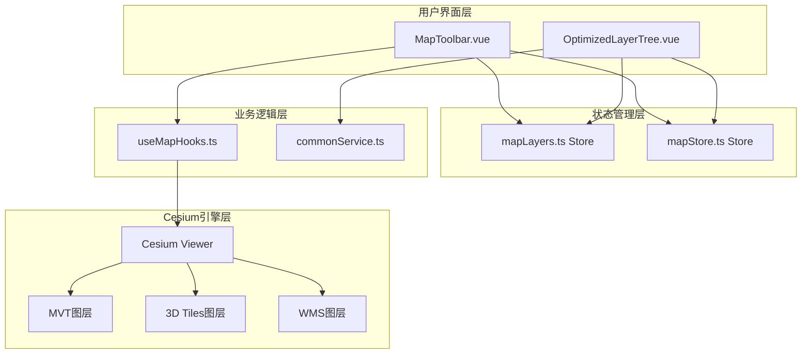
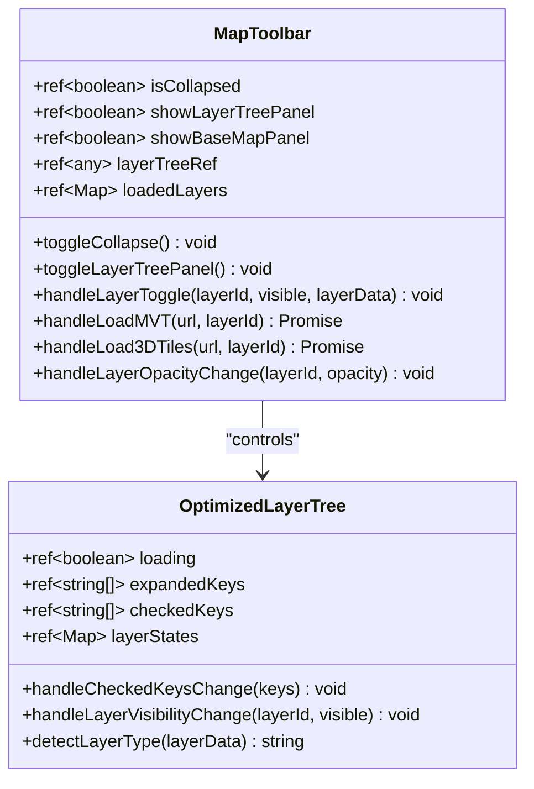
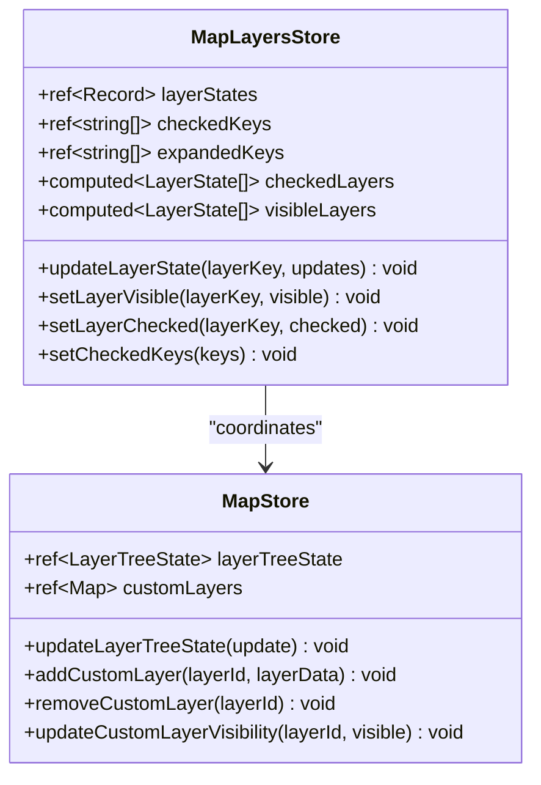
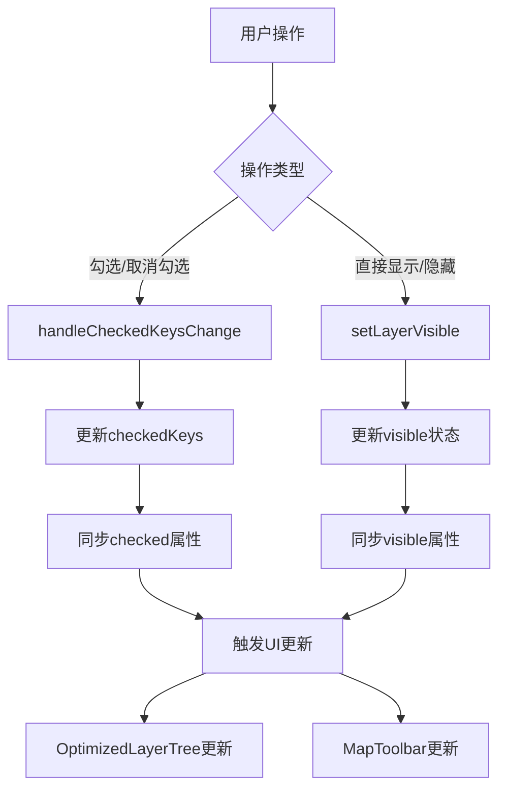
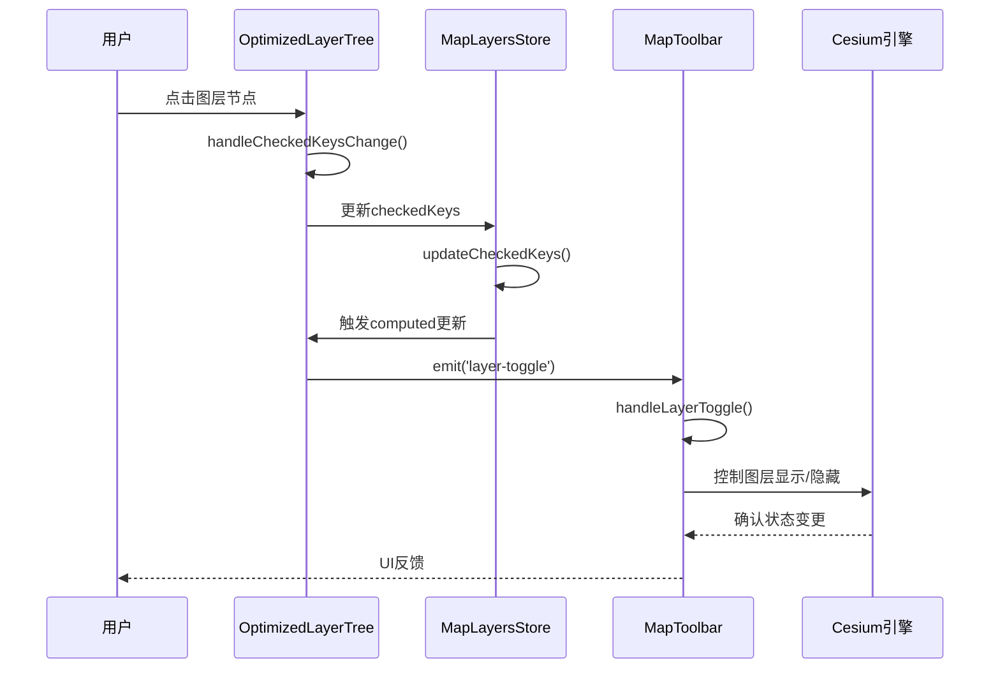
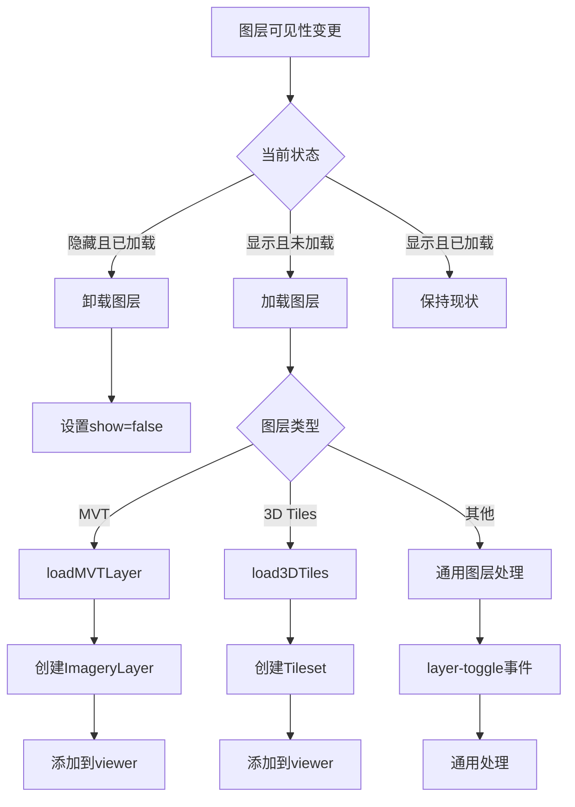
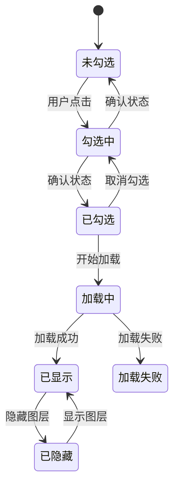

# 图层显隐控制

<cite>
**本文档引用的文件**
- [MapToolbar.vue](file://src/mapComponents/MapToolbar.vue)
- [OptimizedLayerTree.vue](file://src/mapComponents/OptimizedLayerTree.vue)
- [mapLayers.ts](file://src/stores/mapLayers.ts)
- [mapStore.ts](file://src/stores/mapStore.ts)
- [useMapHooks.ts](file://src/hook/useMapHooks.ts)
- [commonService.ts](file://src/services/commonService.ts)
- [mapConfig.ts](file://src/config/mapConfig.ts)
</cite>

## 目录
1. [概述](#概述)
2. [系统架构](#系统架构)
3. [核心组件分析](#核心组件分析)
4. [状态管理机制](#状态管理机制)
5. [用户交互流程](#用户交互流程)
6. [图层状态同步机制](#图层状态同步机制)
7. [性能优化策略](#性能优化策略)
8. [故障排除指南](#故障排除指南)
9. [总结](#总结)

## 概述

图层显隐控制系统是政府Dashboard地图应用的核心功能模块，负责管理地图上各种地理信息图层的显示与隐藏。该系统采用Vue 3组合式API和Pinia状态管理，实现了响应式的图层控制机制，支持多种图层类型（MVT矢量瓦片、3D Tiles、WMS等）的动态加载和卸载。

系统的主要特点包括：
- **响应式状态管理**：基于Pinia的集中式状态管理
- **多图层类型支持**：统一处理不同类型的地理数据图层
- **智能图层加载**：按需加载，提升性能
- **实时状态同步**：UI状态与图层状态的双向同步
- **容错机制**：完善的错误处理和状态恢复

## 系统架构

**图表来源**
- [MapToolbar.vue](file://src/mapComponents/MapToolbar.vue#L1-L504)
- [OptimizedLayerTree.vue](file://src/mapComponents/OptimizedLayerTree.vue#L1-L687)
- [mapLayers.ts](file://src/stores/mapLayers.ts#L1-L114)
- [mapStore.ts](file://src/stores/mapStore.ts#L1-L400)

## 核心组件分析

### MapToolbar组件

MapToolbar作为地图工具栏的主控制器，负责协调图层树面板的显示和图层状态的管理。

**图表来源**
- [MapToolbar.vue](file://src/mapComponents/MapToolbar.vue#L78-L333)
- [OptimizedLayerTree.vue](file://src/mapComponents/OptimizedLayerTree.vue#L70-L446)

### OptimizedLayerTree组件

OptimizedLayerTree是图层树的核心组件，提供了完整的图层管理界面和状态控制功能。

**章节来源**
- [OptimizedLayerTree.vue](file://src/mapComponents/OptimizedLayerTree.vue#L1-L687)

### 状态管理Store

系统采用双Store架构，分别管理不同的状态域：

**图表来源**
- [mapLayers.ts](file://src/stores/mapLayers.ts#L11-L114)
- [mapStore.ts](file://src/stores/mapStore.ts#L18-L400)

**章节来源**
- [mapLayers.ts](file://src/stores/mapLayers.ts#L1-L114)
- [mapStore.ts](file://src/stores/mapStore.ts#L1-L400)

## 状态管理机制

### 图层状态结构

每个图层在系统中维护三种状态：

| 状态属性 | 类型 | 描述 | 用途 |
|---------|------|------|------|
| `visible` | boolean | 实际渲染状态 | 控制Cesium图层的显示/隐藏 |
| `checked` | boolean | 用户选择状态 | 控制复选框的勾选状态 |
| `opacity` | number | 透明度值 | 控制图层的透明度 |

### checkedKeys与visibleLayers计算属性

这两个计算属性是状态同步的核心机制：

**图表来源**
- [OptimizedLayerTree.vue](file://src/mapComponents/OptimizedLayerTree.vue#L302-L322)
- [mapLayers.ts](file://src/stores/mapLayers.ts#L56-L83)

**章节来源**
- [mapLayers.ts](file://src/stores/mapLayers.ts#L26-L44)

## 用户交互流程

### 图层树节点点击流程

当用户点击图层树节点时，系统按照以下流程处理状态变更：

**图表来源**
- [OptimizedLayerTree.vue](file://src/mapComponents/OptimizedLayerTree.vue#L302-L322)
- [MapToolbar.vue](file://src/mapComponents/MapToolbar.vue#L227-L266)

### 图层加载与卸载机制

系统根据图层的可见性状态决定是否加载或卸载图层：

**图表来源**
- [MapToolbar.vue](file://src/mapComponents/MapToolbar.vue#L227-L266)
- [OptimizedLayerTree.vue](file://src/mapComponents/OptimizedLayerTree.vue#L356-L393)

**章节来源**
- [MapToolbar.vue](file://src/mapComponents/MapToolbar.vue#L227-L266)
- [OptimizedLayerTree.vue](file://src/mapComponents/OptimizedLayerTree.vue#L356-L393)

## 图层状态同步机制

### checked属性与visible属性的区别

理解这两个属性的区别对于正确使用系统至关重要：

| 属性 | 数据来源 | 更新时机 | 影响范围 |
|------|----------|----------|----------|
| `checked` | 用户交互 | 用户点击时立即更新 | UI复选框状态 |
| `visible` | 系统逻辑 | 用户确认后更新 | Cesium图层渲染 |

### 状态同步流程

**章节来源**
- [mapLayers.ts](file://src/stores/mapLayers.ts#L56-L83)

## 性能优化策略

### 按需加载机制

系统采用懒加载策略，只在需要时才加载图层：

- **延迟初始化**：图层仅在用户首次勾选时加载
- **内存管理**：隐藏的图层会释放相关资源
- **缓存机制**：已加载的图层保持在内存中，避免重复加载

### 状态更新优化

- **批量更新**：使用computed属性进行批量状态计算
- **防抖处理**：避免频繁的状态更新导致的性能问题
- **增量更新**：只更新发生变化的部分

## 故障排除指南

### 常见问题及解决方案

| 问题类型 | 症状 | 可能原因 | 解决方案 |
|---------|------|----------|----------|
| 图层无法显示 | 勾选后无反应 | 图层加载失败 | 检查网络连接和图层URL |
| 性能问题 | 界面卡顿 | 图层过多 | 启用图层过滤和简化 |
| 状态不同步 | UI与实际不符 | 状态更新延迟 | 强制刷新状态计算 |
| 内存泄漏 | 页面变慢 | 图层未正确卸载 | 检查图层生命周期管理 |

### 调试技巧

1. **启用详细日志**：在开发环境中开启详细的控制台输出
2. **状态检查**：使用浏览器开发者工具检查Pinia状态
3. **网络监控**：观察图层加载的网络请求状态
4. **性能分析**：使用Chrome DevTools分析性能瓶颈

**章节来源**
- [MapToolbar.vue](file://src/mapComponents/MapToolbar.vue#L147-L183)
- [OptimizedLayerTree.vue](file://src/mapComponents/OptimizedLayerTree.vue#L364-L393)

## 总结

图层显隐控制系统通过精心设计的架构和状态管理机制，实现了高效、响应式的地图图层控制功能。系统的核心优势包括：

1. **清晰的状态分离**：checked和visible属性的明确分工
2. **响应式更新**：基于Vue 3的自动状态同步
3. **性能优化**：按需加载和智能缓存机制
4. **容错能力**：完善的错误处理和状态恢复
5. **扩展性**：支持多种图层类型的统一管理

该系统为政府Dashboard提供了强大的地图可视化能力，能够满足复杂地理信息系统的展示需求，同时保持良好的用户体验和系统性能。