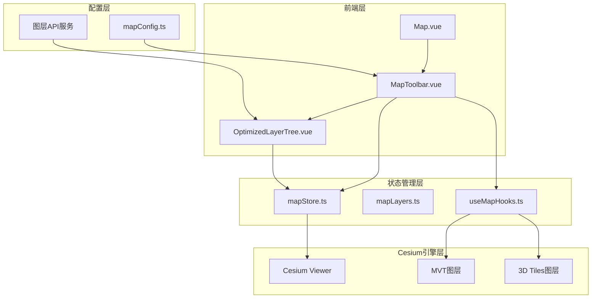
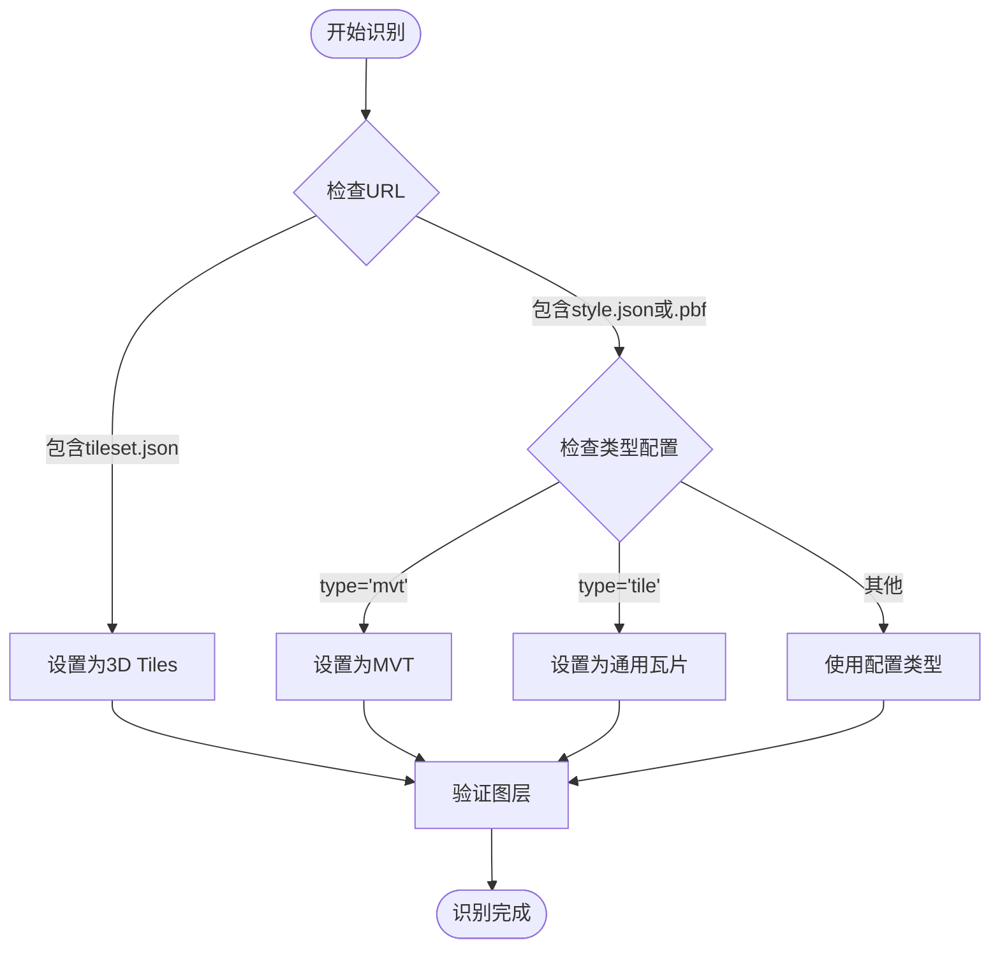
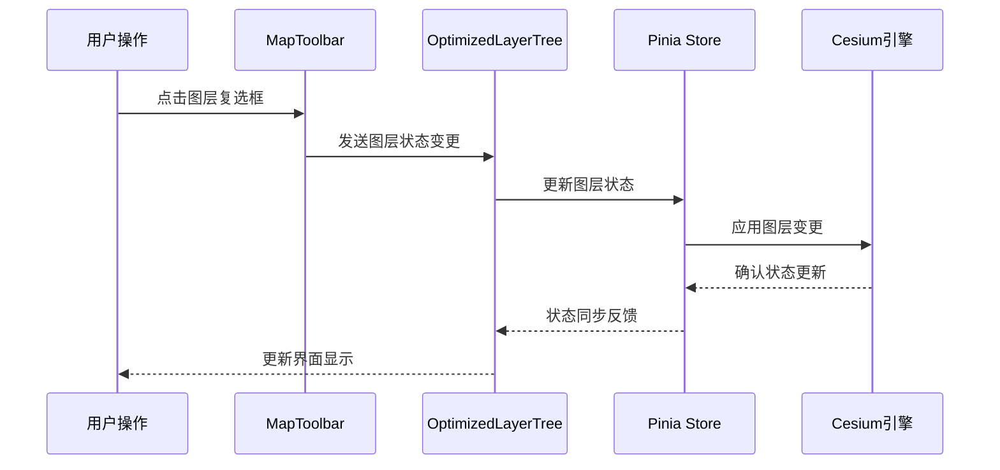
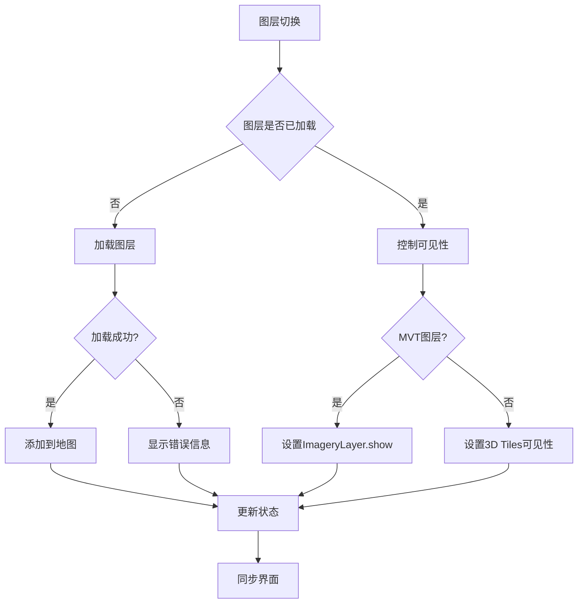
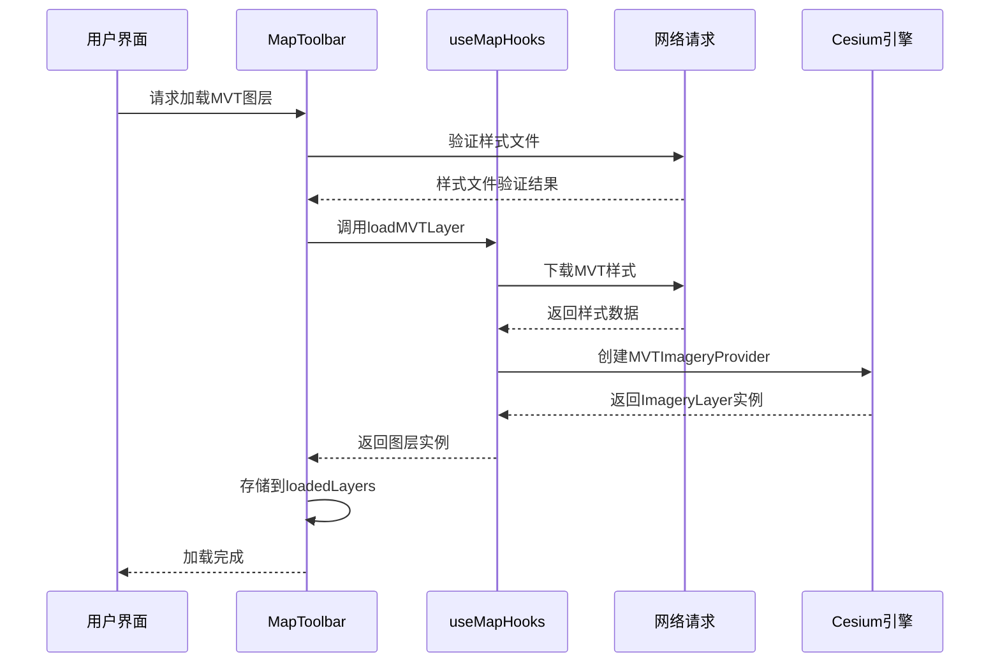
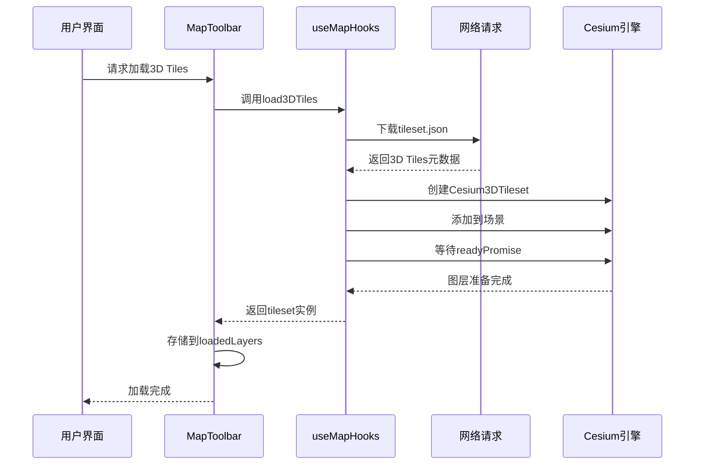
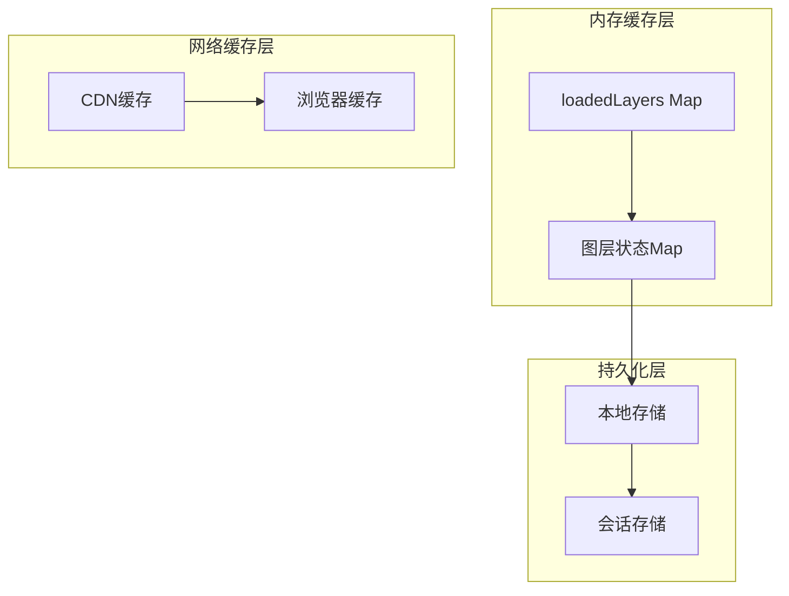
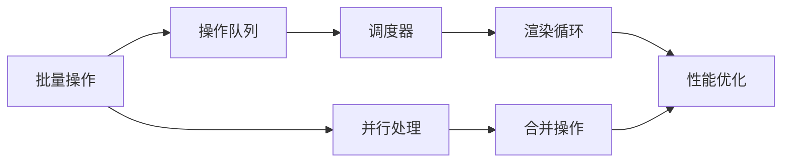

# 图层状态管理

<cite>
**本文档中引用的文件**
- [MapToolbar.vue](file://src/mapComponents/MapToolbar.vue)
- [OptimizedLayerTree.vue](file://src/mapComponents/OptimizedLayerTree.vue)
- [useMapHooks.ts](file://src/hook/useMapHooks.ts)
- [mapStore.ts](file://src/stores/mapStore.ts)
- [mapLayers.ts](file://src/stores/mapLayers.ts)
- [Map.vue](file://src/mapComponents/Map.vue)
- [mapConfig.ts](file://src/config/mapConfig.ts)
</cite>

## 目录
1. [概述](#概述)
2. [系统架构](#系统架构)
3. [核心组件分析](#核心组件分析)
4. [图层类型与存储结构](#图层类型与存储结构)
5. [图层状态管理机制](#图层状态管理机制)
6. [图层加载与卸载流程](#图层加载与卸载流程)
7. [错误处理与容错机制](#错误处理与容错机制)
8. [缓存策略与内存管理](#缓存策略与内存管理)
9. [性能优化建议](#性能优化建议)
10. [最佳实践指南](#最佳实践指南)

## 概述

本系统采用分层架构设计，通过MapToolbar.vue组件为核心控制器，结合多种状态管理方案，实现了高效的图层状态管理系统。系统支持MVT矢量瓦片图层和3D Tiles三维图层两种主要类型，提供了完整的图层生命周期管理功能。

### 主要特性

- **多图层类型支持**：同时管理MVT和3D Tiles两种图层类型
- **状态同步机制**：确保图层状态与地图渲染效果实时同步
- **智能缓存策略**：基于Map对象的高效图层缓存管理
- **容错处理机制**：完善的错误检测和用户友好提示
- **内存优化**：合理的资源释放和内存管理策略

## 系统架构



**图表来源**
- [MapToolbar.vue](file://src/mapComponents/MapToolbar.vue#L1-L504)
- [OptimizedLayerTree.vue](file://src/mapComponents/OptimizedLayerTree.vue#L1-L687)
- [mapStore.ts](file://src/stores/mapStore.ts#L1-L400)

## 核心组件分析

### MapToolbar组件

MapToolbar.vue是图层状态管理的核心控制器，负责协调各个图层组件之间的交互。

#### 主要功能模块

1. **图层状态存储**：使用`loadedLayers` Map对象管理已加载的图层实例
2. **图层操作接口**：提供加载、卸载、显示/隐藏、透明度控制等功能
3. **错误处理机制**：捕获图层加载异常并提供用户友好的错误提示
4. **状态同步**：确保图层状态与地图渲染效果保持一致

#### 核心数据结构

```typescript
// 图层实例存储结构
const loadedLayers = ref<Map<string, {
    type: 'mvt' | '3dtiles';
    instance: any; // Cesium图层实例
}>>()

// 图层状态管理
interface LayerState {
    visible: boolean;
    opacity: number;
    loading: boolean;
    error: string | null;
}
```

**章节来源**
- [MapToolbar.vue](file://src/mapComponents/MapToolbar.vue#L108-L110)

### OptimizedLayerTree组件

OptimizedLayerTree.vue负责图层树的展示和用户交互，提供直观的图层管理界面。

#### 核心特性

1. **智能图层类型检测**：根据URL自动识别MVT或3D Tiles类型
2. **搜索过滤功能**：支持按关键字搜索和过滤图层
3. **状态持久化**：保存用户的展开/折叠状态
4. **实时状态更新**：与后端API保持状态同步

**章节来源**
- [OptimizedLayerTree.vue](file://src/mapComponents/OptimizedLayerTree.vue#L1-L687)

## 图层类型与存储结构

### MVT矢量瓦片图层

MVT（Mapbox Vector Tiles）图层通过MVTImageryProvider实现，具有以下特点：

#### 存储结构
```typescript
interface MVTLayer {
    type: 'mvt';
    instance: ImageryLayer; // Cesium ImageryLayer对象
}
```

#### 特性优势
- **高性能渲染**：客户端矢量瓦片渲染，减少服务器带宽
- **灵活样式**：支持动态样式修改和主题切换
- **响应式设计**：适应不同分辨率和设备

### 3D Tiles三维图层

3D Tiles图层基于Cesium原生支持，提供丰富的三维可视化能力。

#### 存储结构
```typescript
interface TilesetLayer {
    type: '3dtiles';
    instance: Cesium3DTileset; // Cesium 3D Tiles对象
}
```

#### 技术特点
- **LOD支持**：多层次细节层次，优化渲染性能
- **材质系统**：支持复杂材质和光照效果
- **动画能力**：支持时间轴动画和关键帧动画

### 图层类型智能识别

系统实现了智能的图层类型识别机制：



**图表来源**
- [OptimizedLayerTree.vue](file://src/mapComponents/OptimizedLayerTree.vue#L326-L351)

**章节来源**
- [useMapHooks.ts](file://src/hook/useMapHooks.ts#L14-L32)

## 图层状态管理机制

### 状态同步架构

系统采用多层状态管理架构，确保图层状态的一致性和实时性：



**图表来源**
- [MapToolbar.vue](file://src/mapComponents/MapToolbar.vue#L226-L265)
- [OptimizedLayerTree.vue](file://src/mapComponents/OptimizedLayerTree.vue#L300-L323)

### 状态变更流程

#### 图层显示/隐藏控制



**图表来源**
- [MapToolbar.vue](file://src/mapComponents/MapToolbar.vue#L226-L265)

### 透明度控制机制

系统为不同类型的图层提供专门的透明度控制方法：

#### MVT图层透明度控制
- 使用`ImageryLayer.alpha`属性
- 支持0-1范围的透明度设置
- 实时生效，无需重新加载

#### 3D Tiles图层透明度控制
- 使用`Cesium3DTileStyle`对象
- 通过颜色混合实现透明效果
- 支持复杂的材质透明度控制

**章节来源**
- [MapToolbar.vue](file://src/mapComponents/MapToolbar.vue#L268-L285)

## 图层加载与卸载流程

### MVT图层加载流程



**图表来源**
- [MapToolbar.vue](file://src/mapComponents/MapToolbar.vue#L146-L184)
- [useMapHooks.ts](file://src/hook/useMapHooks.ts#L35-L93)

### 3D Tiles图层加载流程



**图表来源**
- [MapToolbar.vue](file://src/mapComponents/MapToolbar.vue#L187-L224)
- [useMapHooks.ts](file://src/hook/useMapHooks.ts#L95-L151)

### 图层卸载机制

当用户取消选择图层时，系统会执行优雅的卸载流程：

1. **状态标记**：将图层状态标记为非可见
2. **实例保留**：保留图层实例以备下次快速加载
3. **内存优化**：释放不必要的渲染资源
4. **状态同步**：更新所有相关组件的状态

**章节来源**
- [MapToolbar.vue](file://src/mapComponents/MapToolbar.vue#L236-L246)

## 错误处理与容错机制

### 错误分类与处理策略

系统针对不同类型的图层错误实现了专门的处理策略：

#### MVT图层错误处理

```mermaid
flowchart TD
MVTErr[MVT加载错误] --> CheckMsg{检查错误消息}
CheckMsg --> |404/不存在| StyleNotFound[样式文件不存在]
CheckMsg --> |version/sources/layers| StyleFormat[样式文件格式错误]
CheckMsg --> |其他| GeneralError[通用加载失败]
StyleNotFound --> ShowFriendly1[显示"样式文件不存在"]
StyleFormat --> ShowFriendly2[显示"样式文件格式错误"]
GeneralError --> ShowFriendly3[显示"加载失败"]
ShowFriendly1 --> UpdateUI[更新图层树状态]
ShowFriendly2 --> UpdateUI
ShowFriendly3 --> UpdateUI
```

**图表来源**
- [MapToolbar.vue](file://src/mapComponents/MapToolbar.vue#L169-L183)

#### 3D Tiles图层错误处理

```mermaid
flowchart TD
T3DErr[3D Tiles加载错误] --> CheckMsg2{检查错误消息}
CheckMsg2 --> |404/Failed to fetch| ModelNotFound[3D模型文件不存在]
CheckMsg2 --> |not a function| VersionError[Cesium版本不兼容]
CheckMsg2 --> |其他| GeneralError2[通用加载失败]
ModelNotFound --> ShowFriendly4[显示"3D模型文件不存在"]
VersionError --> ShowFriendly5[显示"Cesium版本不兼容"]
GeneralError2 --> ShowFriendly6[显示"加载失败"]
ShowFriendly4 --> UpdateUI2[更新图层树状态]
ShowFriendly5 --> UpdateUI2
ShowFriendly6 --> UpdateUI2
```

**图表来源**
- [MapToolbar.vue](file://src/mapComponents/MapToolbar.vue#L209-L222)

### 用户友好错误提示

系统实现了智能的错误消息转换机制，将技术错误信息转换为用户可理解的提示：

| 原始错误消息 | 用户友好提示 | 处理策略 |
|-------------|-------------|----------|
| 404 Not Found | 样式文件不存在 | 检查URL配置 |
| Failed to fetch | 3D模型文件不存在 | 验证文件路径 |
| version: | 样式文件格式错误 | 检查JSON格式 |
| not a function | Cesium版本不兼容 | 更新Cesium版本 |

**章节来源**
- [MapToolbar.vue](file://src/mapComponents/MapToolbar.vue#L169-L222)

## 缓存策略与内存管理

### 图层缓存架构

系统采用多层缓存策略，最大化利用已加载的图层资源：



**图表来源**
- [MapToolbar.vue](file://src/mapComponents/MapToolbar.vue#L108-L110)
- [mapStore.ts](file://src/stores/mapStore.ts#L238-L240)

### 内存管理策略

#### 图层实例管理

1. **延迟加载**：只在需要时加载图层
2. **实例复用**：已加载的图层实例被缓存
3. **状态分离**：图层实例与显示状态分离管理
4. **垃圾回收**：及时释放不再使用的图层资源

#### 性能监控指标

```typescript
// 内存使用监控示例
interface MemoryMetrics {
    loadedLayersCount: number; // 已加载图层数量
    memoryUsage: number; // 内存使用量(MB)
    cacheHitRate: number; // 缓存命中率(%)
    loadTime: number; // 平均加载时间(ms)
}
```

### 缓存优化建议

#### 图层预加载策略

1. **智能预测**：基于用户行为预测可能需要的图层
2. **优先级队列**：根据重要性排序预加载任务
3. **资源池管理**：维护一个可用的图层实例池
4. **定期清理**：清除长时间未使用的图层实例

#### 内存阈值控制

```typescript
// 内存使用阈值配置
const MEMORY_THRESHOLD = {
    warning: 100, // MB
    critical: 200, // MB
    cleanup: 300 // MB
};
```

**章节来源**
- [useMapHooks.ts](file://src/hook/useMapHooks.ts#L30-L32)

## 性能优化建议

### 渲染性能优化

#### LOD优化策略

1. **动态LOD调整**：根据视距动态调整细节层次
2. **预加载策略**：提前加载视野内的图层
3. **渐进式加载**：分阶段加载图层细节
4. **剔除优化**：移除不可见的图层片段

#### 批量操作优化



### 网络性能优化

#### 图层数据压缩

1. **矢量瓦片压缩**：使用PBF格式减少传输大小
2. **纹理压缩**：对3D Tiles纹理进行压缩
3. **增量更新**：只传输变化的数据部分
4. **缓存策略**：合理设置HTTP缓存头

#### 连接池管理

```typescript
// 网络连接优化配置
const NETWORK_CONFIG = {
    maxConnections: 6, // 最大并发连接数
    timeout: 30000, // 请求超时时间(ms)
    retryCount: 3, // 重试次数
    compression: true // 启用压缩
};
```

### 内存使用优化

#### 对象池模式

```typescript
// 图层对象池实现
class LayerPool {
    private pool: Map<string, any[]> = new Map();
    
    get(type: string): any {
        const layerPool = this.pool.get(type);
        return layerPool && layerPool.length > 0 
            ? layerPool.pop() 
            : this.createLayer(type);
    }
    
    release(type: string, layer: any): void {
        if (this.pool.has(type)) {
            this.pool.get(type)!.push(layer);
        }
    }
}
```

## 最佳实践指南

### 开发规范

#### 图层命名规范

1. **唯一标识符**：每个图层必须有唯一的ID
2. **语义化命名**：使用描述性的图层名称
3. **版本控制**：对图层配置进行版本管理
4. **类型前缀**：使用统一的类型前缀区分图层

#### 状态管理最佳实践

```typescript
// 推荐的状态更新模式
function updateLayerState(layerId: string, updates: Partial<LayerState>): void {
    const currentState = loadedLayers.value.get(layerId);
    if (currentState) {
        loadedLayers.value.set(layerId, {
            ...currentState,
            ...updates,
            lastUpdated: Date.now()
        });
    }
}
```

### 故障排除指南

#### 常见问题诊断

| 问题症状 | 可能原因 | 解决方案 |
|---------|---------|----------|
| 图层加载缓慢 | 网络延迟或数据量过大 | 启用压缩，优化数据结构 |
| 内存泄漏 | 图层实例未正确释放 | 检查清理逻辑，使用弱引用 |
| 渲染卡顿 | 图层数量过多 | 实现LOD，启用剔除 |
| 样式错误 | 样式文件格式问题 | 验证JSON格式，检查必需字段 |

#### 性能监控指标

```typescript
// 关键性能指标监控
const PERFORMANCE_METRICS = {
    // 图层加载性能
    layerLoadTime: {
        average: 0,
        max: 0,
        min: 0,
        count: 0
    },
    
    // 内存使用情况
    memoryUsage: {
        heapUsed: 0,
        heapTotal: 0,
        external: 0
    },
    
    // 渲染性能
    frameRate: {
        fps: 0,
        droppedFrames: 0,
        renderTime: 0
    }
};
```

### 部署优化建议

#### 生产环境配置

1. **启用压缩**：对静态资源启用GZIP/Brotli压缩
2. **CDN加速**：使用CDN分发图层数据
3. **缓存策略**：设置合理的HTTP缓存头
4. **监控告警**：建立性能监控和告警机制

#### 安全考虑

1. **CORS配置**：正确配置跨域资源共享
2. **数据验证**：验证所有外部输入数据
3. **访问控制**：实施适当的访问权限控制
4. **安全传输**：使用HTTPS加密传输

通过遵循这些最佳实践，可以构建一个高性能、稳定可靠的图层状态管理系统，为用户提供流畅的地图浏览体验。