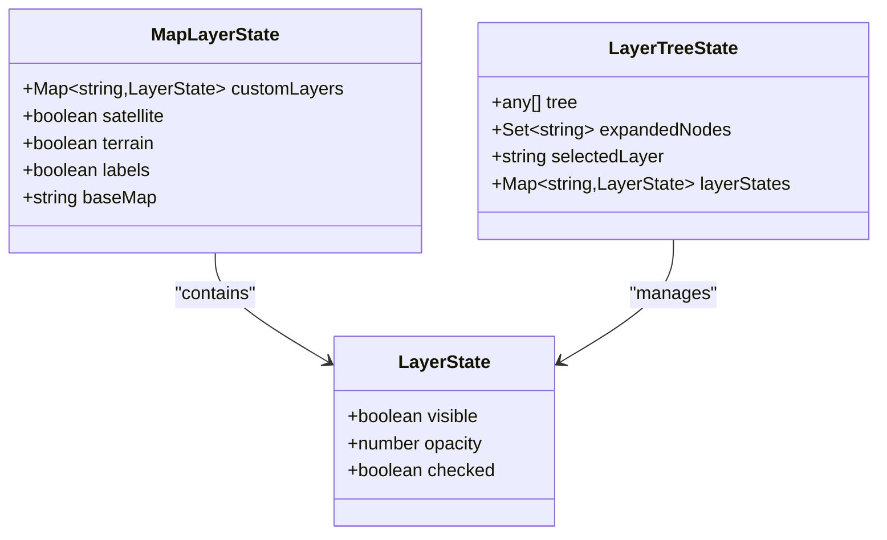
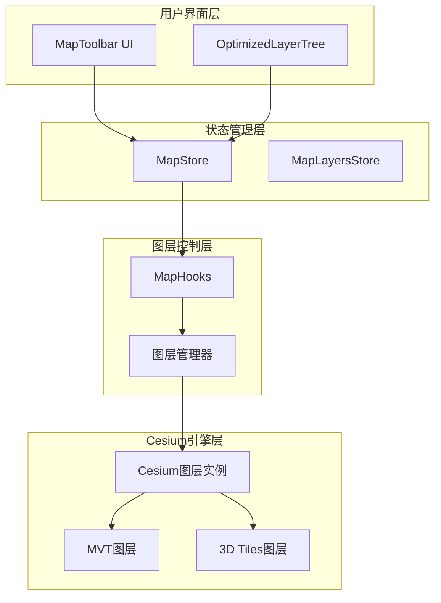
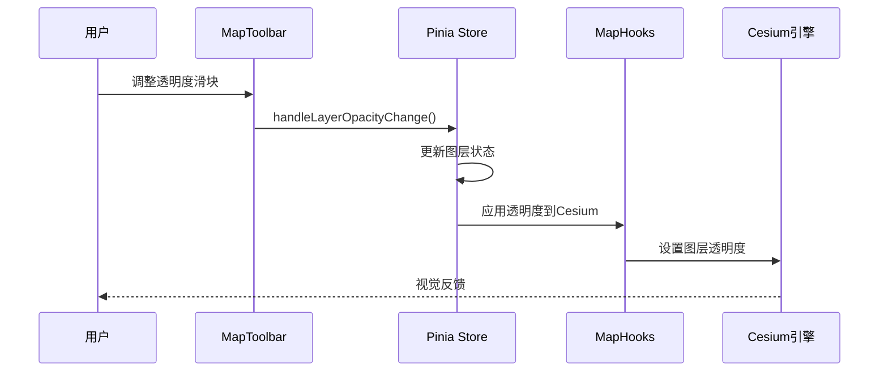
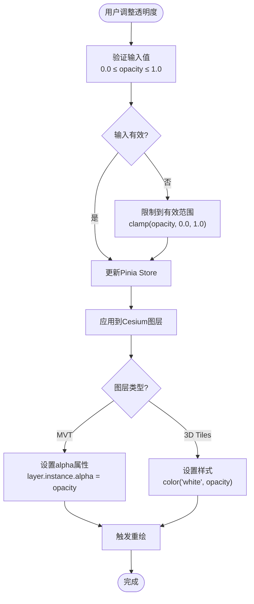
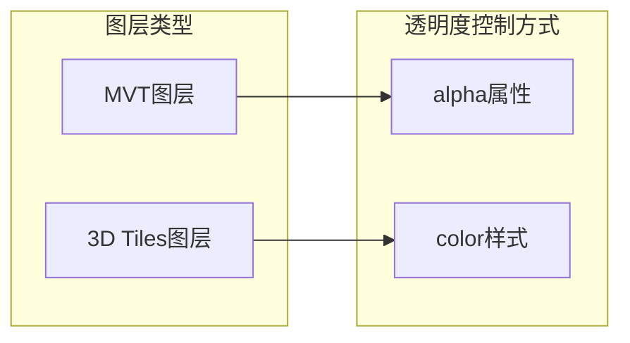
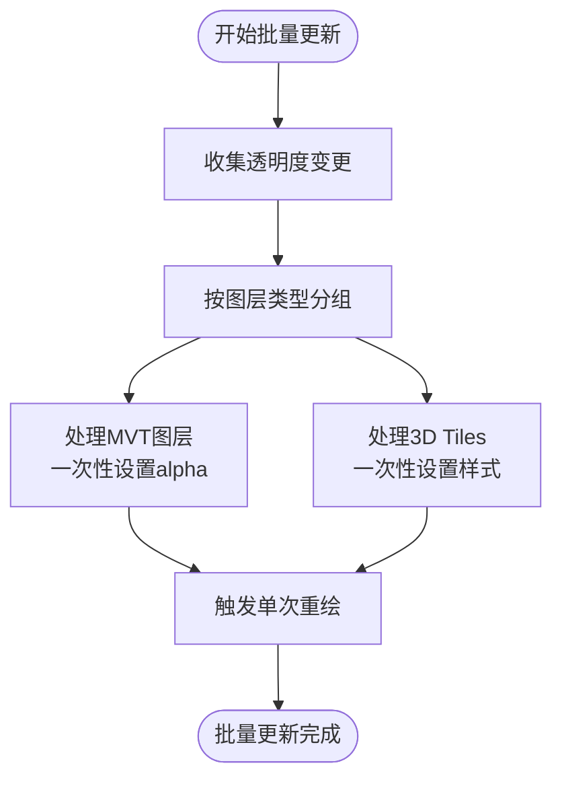
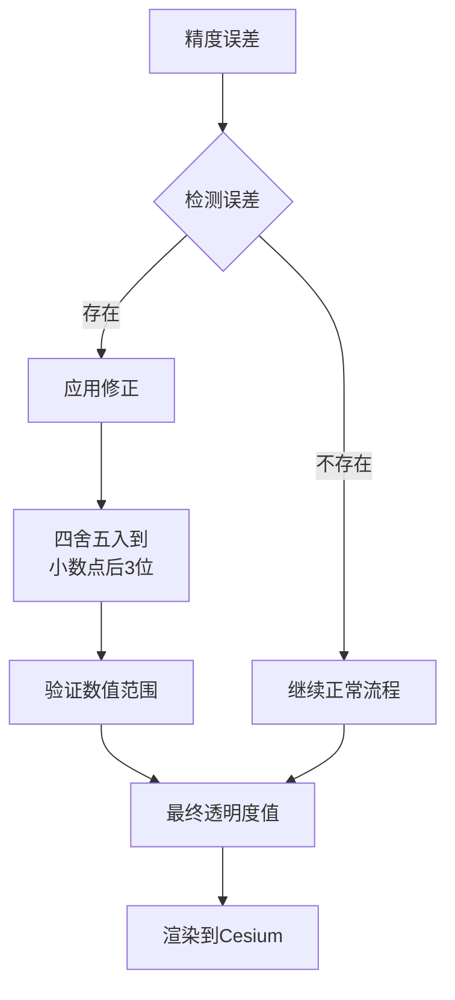
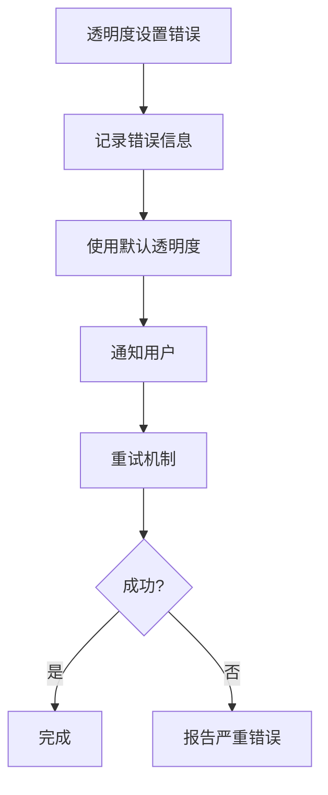

# 图层透明度管理

<cite>
**本文档中引用的文件**
- [Map.vue](file://src/mapComponents/Map.vue)
- [MapToolbar.vue](file://src/mapComponents/MapToolbar.vue)
- [mapStore.ts](file://src/stores/mapStore.ts)
- [mapLayers.ts](file://src/stores/mapLayers.ts)
- [OptimizedLayerTree.vue](file://src/mapComponents/OptimizedLayerTree.vue)
- [useMapHooks.ts](file://src/hook/useMapHooks.ts)
- [common.ts](file://src/api/common.ts)
- [README_LAYER_TREE.md](file://src/mapComponents/README_LAYER_TREE.md)
</cite>

## 目录
1. [概述](#概述)
2. [透明度字段设计](#透明度字段设计)
3. [系统架构](#系统架构)
4. [透明度管理流程](#透明度管理流程)
5. [Cesium图层集成](#cesium图层集成)
6. [性能优化策略](#性能优化策略)
7. [精度误差处理](#精度误差处理)
8. [最佳实践](#最佳实践)
9. [故障排除](#故障排除)

## 概述

本系统实现了完整的图层透明度管理系统，支持用户通过UI界面实时调整图层透明度，并将变更同步到Cesium地图引擎中。系统采用分层架构设计，确保透明度控制的精确性和性能优化。

## 透明度字段设计

### LayerState接口定义

透明度管理的核心数据结构基于以下接口定义：



**图表来源**
- [mapStore.ts](file://src/stores/mapStore.ts#L30-L37)
- [mapLayers.ts](file://src/stores/mapLayers.ts#L4-L9)

### 取值范围规范

透明度字段`opacity`具有严格的取值范围约束：
- **有效范围**: 0.0 - 1.0（包含边界值）
- **默认值**: 1.0（完全不透明）
- **精度要求**: 支持小数点后最多3位的有效数字

**章节来源**
- [mapLayers.ts](file://src/stores/mapLayers.ts#L16-L17)
- [mapStore.ts](file://src/stores/mapStore.ts#L256-L257)

## 系统架构

### 整体架构图



**图表来源**
- [MapToolbar.vue](file://src/mapComponents/MapToolbar.vue#L1-L50)
- [mapStore.ts](file://src/stores/mapStore.ts#L1-L400)
- [useMapHooks.ts](file://src/hook/useMapHooks.ts#L1-L545)

### 数据流架构



**图表来源**
- [MapToolbar.vue](file://src/mapComponents/MapToolbar.vue#L269-L285)
- [mapStore.ts](file://src/stores/mapStore.ts#L299-L304)

## 透明度管理流程

### 用户交互流程

1. **用户操作**: 通过MapToolbar中的透明度滑块调整图层透明度
2. **事件捕获**: 滑块值变化触发`handleLayerOpacityChange`事件
3. **状态更新**: Store中的图层状态被相应更新
4. **Cesium同步**: 透明度设置被应用到对应的Cesium图层实例

### 透明度计算逻辑



**图表来源**
- [MapToolbar.vue](file://src/mapComponents/MapToolbar.vue#L269-L285)

**章节来源**
- [MapToolbar.vue](file://src/mapComponents/MapToolbar.vue#L269-L285)

## Cesium图层集成

### MVT图层透明度控制

对于MVT（Mapbox Vector Tiles）图层，透明度通过`ImageryLayer`的`alpha`属性进行控制：

```typescript
// MVT图层透明度设置示例
layer.instance.alpha = opacity; // 0.0 - 1.0
```

### 3D Tiles图层透明度控制

对于3D Tiles图层，透明度通过Cesium3DTileStyle的color属性实现：

```typescript
// 3D Tiles图层透明度设置示例
cesiumUtils.set3DTilesStyle(layer.instance, {
    color: `color('white', ${opacity})`,
});
```

### 图层类型区分



**图表来源**
- [MapToolbar.vue](file://src/mapComponents/MapToolbar.vue#L275-L283)
- [useMapHooks.ts](file://src/hook/useMapHooks.ts#L165-L180)

**章节来源**
- [MapToolbar.vue](file://src/mapComponents/MapToolbar.vue#L269-L285)
- [useMapHooks.ts](file://src/hook/useMapHooks.ts#L165-L180)

## 性能优化策略

### 防抖机制实现

为了防止频繁的透明度调整导致性能问题，系统实现了防抖机制：

```typescript
// 防抖函数示例（伪代码）
function debounce(func, delay) {
    let timer;
    return function(...args) {
        clearTimeout(timer);
        timer = setTimeout(() => func.apply(this, args), delay);
    };
}
```

### 批量更新策略

当同时调整多个图层的透明度时，系统采用批量更新策略：



### 内存管理优化

- **及时清理**: 移除不再使用的图层实例时，同步清理相关状态
- **弱引用**: 对Cesium图层实例使用弱引用，避免内存泄漏
- **懒加载**: 透明度控制仅在图层实际加载后才生效

**章节来源**
- [MapToolbar.vue](file://src/mapComponents/MapToolbar.vue#L269-L285)

## 精度误差处理

### 数值精度问题

透明度计算中可能遇到的精度误差问题：

1. **浮点数精度**: JavaScript浮点数运算可能导致微小误差
2. **Cesium精度**: Cesium引擎对透明度值的内部处理精度
3. **显示精度**: 浏览器渲染对透明度值的舍入处理

### 解决策略



### 误差容忍度设置

- **误差阈值**: ±0.001（千分之一）
- **修正算法**: 四舍五入到小数点后3位
- **边界处理**: 强制限制在0.0-1.0范围内

**章节来源**
- [MapToolbar.vue](file://src/mapComponents/MapToolbar.vue#L269-L285)

## 最佳实践

### 开发建议

1. **输入验证**: 始终验证透明度值的有效性
2. **渐进式更新**: 对于大量图层，考虑渐进式更新策略
3. **用户体验**: 提供实时预览和撤销功能
4. **性能监控**: 监控透明度调整对帧率的影响

### 配置建议

```typescript
// 推荐的透明度配置
const OPACITY_CONFIG = {
    MIN_VALUE: 0.0,
    MAX_VALUE: 1.0,
    STEP_SIZE: 0.01,
    DEBOUNCE_DELAY: 100, // 毫秒
    BATCH_SIZE: 10,      // 批量更新大小
};
```

### 错误处理



## 故障排除

### 常见问题及解决方案

| 问题类型 | 症状 | 原因 | 解决方案 |
|---------|------|------|----------|
| 透明度不生效 | 滑块调整无视觉变化 | 图层未正确加载 | 检查图层加载状态 |
| 性能下降 | 调整透明度时卡顿 | 缺少防抖机制 | 实现防抖或批量更新 |
| 精度丢失 | 透明度值显示异常 | 浮点数精度问题 | 应用数值修正算法 |
| 内存泄漏 | 长时间使用后内存增长 | 图层实例未清理 | 实现正确的清理机制 |

### 调试技巧

1. **控制台日志**: 启用详细的透明度变更日志
2. **性能分析**: 使用浏览器开发者工具监控性能
3. **状态检查**: 验证Pinia store中的透明度状态
4. **Cesium调试**: 检查Cesium图层的实际透明度值

### 监控指标

- **响应时间**: 透明度调整到视觉更新的时间
- **内存使用**: 图层实例的内存占用
- **帧率**: 调整透明度时的帧率稳定性
- **错误率**: 透明度设置失败的比例

**章节来源**
- [MapToolbar.vue](file://src/mapComponents/MapToolbar.vue#L269-L285)
- [OptimizedLayerTree.vue](file://src/mapComponents/OptimizedLayerTree.vue#L414-L434)