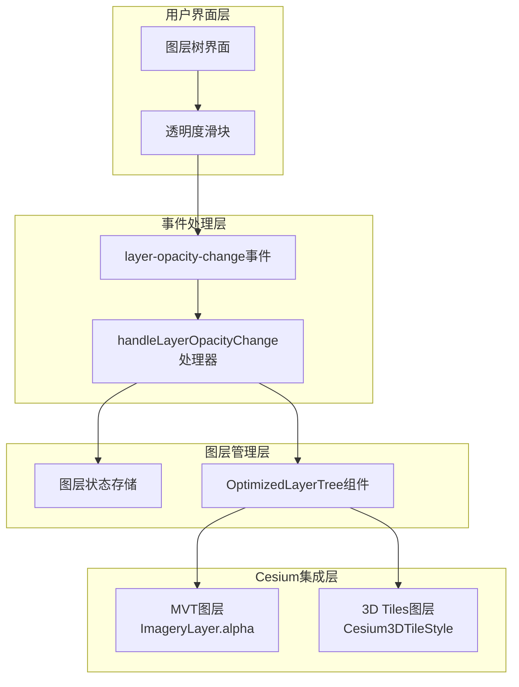
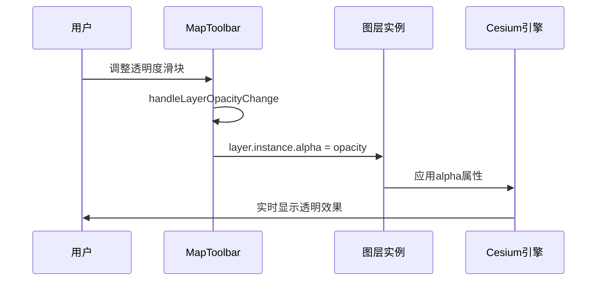
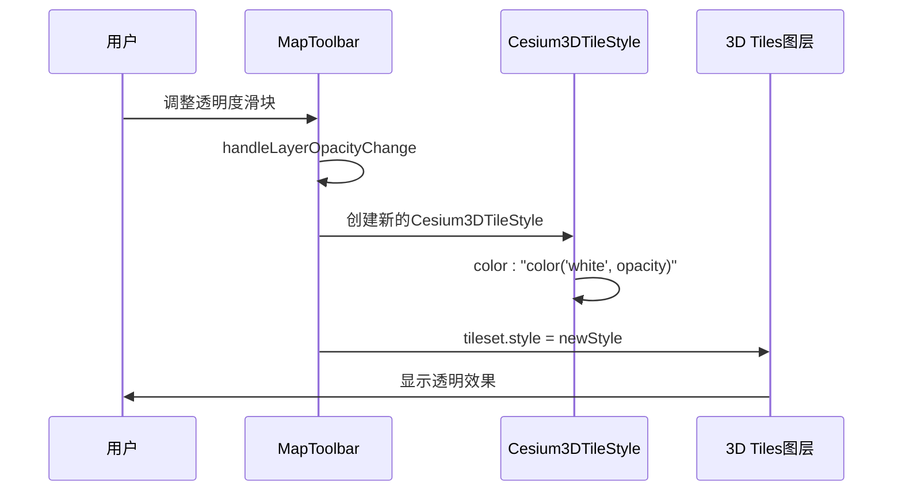
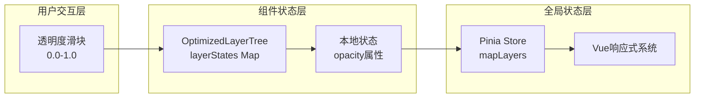

# 图层透明度控制

<cite>
**本文档中引用的文件**
- [MapToolbar.vue](file://src/mapComponents/MapToolbar.vue)
- [useMapHooks.ts](file://src/hook/useMapHooks.ts)
- [OptimizedLayerTree.vue](file://src/mapComponents/OptimizedLayerTree.vue)
- [mapLayers.ts](file://src/stores/mapLayers.ts)
- [README_LAYER_TREE.md](file://src/mapComponents/README_LAYER_TREE.md)
- [MAP_TOOLBAR_INTEGRATION.md](file://MAP_TOOLBAR_INTEGRATION.md)
</cite>

## 目录
1. [概述](#概述)
2. [透明度控制架构](#透明度控制架构)
3. [MVT图层透明度控制](#mvt图层透明度控制)
4. [3D Tiles图层透明度控制](#3d-tiles图层透明度控制)
5. [透明度值范围定义](#透明度值范围定义)
6. [性能影响评估](#性能影响评估)
7. [最佳实践建议](#最佳实践建议)
8. [故障排除指南](#故障排除指南)

## 概述

本系统提供了完整的图层透明度控制系统，支持两种主要的图层类型：MVT矢量瓦片图层和3D Tiles三维模型图层。透明度控制通过统一的事件机制实现，确保不同类型的图层都能获得一致的用户体验。

### 核心特性

- **双图层类型支持**：同时支持MVT和3D Tiles图层的透明度控制
- **统一事件接口**：通过`@layer-opacity-change`事件实现标准化的透明度变更处理
- **实时预览**：透明度调整立即生效，提供即时视觉反馈
- **状态持久化**：透明度设置与图层状态同步保存

## 透明度控制架构



**图表来源**
- [MapToolbar.vue](file://src/mapComponents/MapToolbar.vue#L268-L285)
- [OptimizedLayerTree.vue](file://src/mapComponents/OptimizedLayerTree.vue#L85-L89)

**章节来源**
- [MapToolbar.vue](file://src/mapComponents/MapToolbar.vue#L268-L285)
- [OptimizedLayerTree.vue](file://src/mapComponents/OptimizedLayerTree.vue#L85-L89)

## MVT图层透明度控制

### 实现原理

MVT图层的透明度控制基于Cesium的`ImageryLayer`对象的`alpha`属性。当图层加载完成后，系统会将`MVTImageryProvider`转换为可控制的`ImageryLayer`对象，从而获得对透明度的直接访问权限。

### 控制流程



**图表来源**
- [MapToolbar.vue](file://src/mapComponents/MapToolbar.vue#L280-L282)
- [useMapHooks.ts](file://src/hook/useMapHooks.ts#L40-L93)

### 关键实现细节

1. **图层加载过程**：`loadMVTLayer`函数确保返回`ImageryLayer`对象而非`MVTImageryProvider`
2. **透明度赋值**：直接设置`layer.instance.alpha`属性
3. **数值范围**：透明度值范围为0.0（完全透明）到1.0（完全不透明）

**章节来源**
- [MapToolbar.vue](file://src/mapComponents/MapToolbar.vue#L280-L282)
- [useMapHooks.ts](file://src/hook/useMapHooks.ts#L40-L93)

## 3D Tiles图层透明度控制

### 实现原理

3D Tiles图层的透明度控制通过修改`Cesium3DTileStyle`对象的`color`属性实现。系统使用`color('white', opacity)`语法来动态设置颜色的透明度。

### 控制流程



**图表来源**
- [MapToolbar.vue](file://src/mapComponents/MapToolbar.vue#L276-L278)
- [useMapHooks.ts](file://src/hook/useMapHooks.ts#L169-L179)

### 关键实现细节

1. **样式对象创建**：使用`new Cesium.Cesium3DTileStyle(style)`创建新的样式
2. **颜色表达式**：采用`color('white', opacity)`格式设置透明度
3. **实时更新**：每次透明度调整都会重新创建并应用新的样式对象

**章节来源**
- [MapToolbar.vue](file://src/mapComponents/MapToolbar.vue#L276-L278)
- [useMapHooks.ts](file://src/hook/useMapHooks.ts#L169-L179)

## 透明度值范围定义

### 数值规范

| 图层类型 | 透明度范围 | 默认值 | 精度要求 |
|---------|-----------|--------|----------|
| MVT图层 | 0.0 - 1.0 | 1.0 | 浮点数精度 |
| 3D Tiles图层 | 0.0 - 1.0 | 1.0 | 浮点数精度 |

### 数据类型说明

- **输入类型**：`number`类型，范围0.0到1.0
- **内部存储**：在图层状态中以`number`类型存储
- **显示格式**：通常转换为百分比形式（0% - 100%）向用户展示

### 状态管理

透明度值通过多个层次进行管理：



**图表来源**
- [OptimizedLayerTree.vue](file://src/mapComponents/OptimizedLayerTree.vue#L194-L202)
- [mapLayers.ts](file://src/stores/mapLayers.ts#L15-L22)

**章节来源**
- [OptimizedLayerTree.vue](file://src/mapComponents/OptimizedLayerTree.vue#L194-L202)
- [mapLayers.ts](file://src/stores/mapLayers.ts#L15-L22)

## 性能影响评估

### MVT图层性能影响

#### 渲染性能
- **GPU加速**：透明度调整通过GPU混合运算实现，性能开销较小
- **内存占用**：透明度设置不会显著增加内存使用
- **帧率影响**：在大多数现代硬件上，透明度调整对帧率影响可忽略

#### 优化策略
- **批量更新**：多个图层同时调整透明度时，系统会进行批处理
- **缓存机制**：已加载的图层实例会被缓存，避免重复创建
- **异步处理**：透明度调整是异步操作，不会阻塞主线程

### 3D Tiles图层性能影响

#### 渲染性能
- **着色器计算**：透明度通过顶点或片段着色器计算，GPU开销可控
- **纹理采样**：颜色样式调整不影响纹理资源的使用
- **LOD优化**：3D Tiles的细节层次系统与透明度控制独立工作

#### 优化策略
- **样式复用**：相同透明度的图层共享样式对象
- **增量更新**：只更新发生变化的图层样式
- **内存管理**：及时释放不再使用的样式对象

### 性能监控指标

| 指标类别 | MVT图层 | 3D Tiles图层 | 监控方法 |
|---------|---------|-------------|----------|
| 帧率影响 | < 1 FPS | < 2 FPS | 浏览器性能监控 |
| 内存使用 | 基线±5% | 基线±10% | DevTools内存面板 |
| GPU使用率 | 基线±2% | 基线±3% | GPU性能计数器 |

**章节来源**
- [MapToolbar.vue](file://src/mapComponents/MapToolbar.vue#L269-L270)
- [useMapHooks.ts](file://src/hook/useMapHooks.ts#L174-L179)

## 最佳实践建议

### 开发最佳实践

1. **透明度初始化**
   ```typescript
   // 推荐：使用默认透明度值
   const defaultOpacity = 1.0;
   ```

2. **事件处理优化**
   ```typescript
   // 推荐：使用防抖处理频繁的透明度调整
   const debouncedOpacityChange = debounce(handleLayerOpacityChange, 100);
   ```

3. **错误处理**
   ```typescript
   // 推荐：添加透明度值验证
   function validateOpacity(opacity: number): number {
     return Math.max(0.0, Math.min(1.0, opacity));
   }
   ```

### 用户体验优化

1. **渐进式透明度**
   - 使用平滑过渡动画提升用户体验
   - 避免突然的透明度变化

2. **视觉反馈**
   - 提供清晰的透明度数值显示
   - 在图层树中显示当前透明度状态

3. **性能提示**
   - 对于大量图层的透明度调整，提供性能警告
   - 建议用户减少同时调整的图层数量

### 性能优化建议

1. **图层管理**
   - 及时卸载不需要的图层以释放资源
   - 合理设置图层的可见性和透明度

2. **批处理操作**
   - 对多个图层的透明度调整进行批处理
   - 避免频繁的单图层操作

## 故障排除指南

### 常见问题及解决方案

#### 问题1：MVT图层透明度不生效

**症状**：调整透明度滑块后，图层外观没有变化

**可能原因**：
- 图层实例未正确加载
- `ImageryLayer`对象不存在

**解决方案**：
```typescript
// 检查图层实例状态
if (layer && layer.type === "mvt" && layer.instance) {
  layer.instance.alpha = opacity;
}
```

#### 问题2：3D Tiles图层透明度设置失败

**症状**：透明度调整后图层消失或显示异常

**可能原因**：
- Cesium版本不兼容
- 样式对象创建失败

**解决方案**：
```typescript
// 添加错误处理
try {
  cesiumUtils.set3DTilesStyle(layer.instance, {
    color: `color('white', ${opacity})`,
  });
} catch (error) {
  console.error("3D Tiles透明度设置失败:", error);
}
```

#### 问题3：透明度值超出范围

**症状**：透明度值显示异常或导致渲染错误

**解决方案**：
```typescript
// 添加值范围验证
const safeOpacity = Math.max(0.0, Math.min(1.0, opacity));
layer.instance.alpha = safeOpacity;
```

### 调试技巧

1. **控制台日志**
   ```typescript
   console.log(`透明度设置: ${layerId} = ${opacity}`);
   ```

2. **状态检查**
   ```typescript
   console.log('图层状态:', loadedLayers.value.get(layerId));
   ```

3. **性能监控**
   - 使用浏览器开发者工具监控帧率
   - 检查GPU使用情况

**章节来源**
- [MapToolbar.vue](file://src/mapComponents/MapToolbar.vue#L272-L284)
- [useMapHooks.ts](file://src/hook/useMapHooks.ts#L174-L179)

## 结论

本系统的图层透明度控制功能提供了完整而高效的解决方案，能够满足政府Dashboard项目中对多类型图层透明度管理的需求。通过统一的事件接口和针对不同图层类型的专门优化，系统在保证功能完整性的同时，也兼顾了良好的用户体验和性能表现。

未来可以考虑的改进方向包括：
- 添加透明度动画效果
- 实现图层间的透明度组合效果
- 提供更精细的透明度控制选项