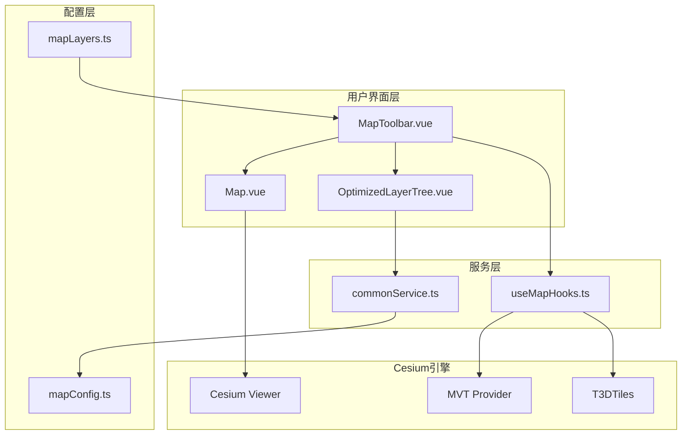
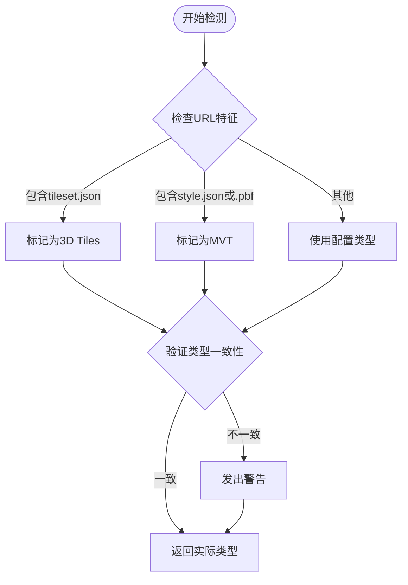
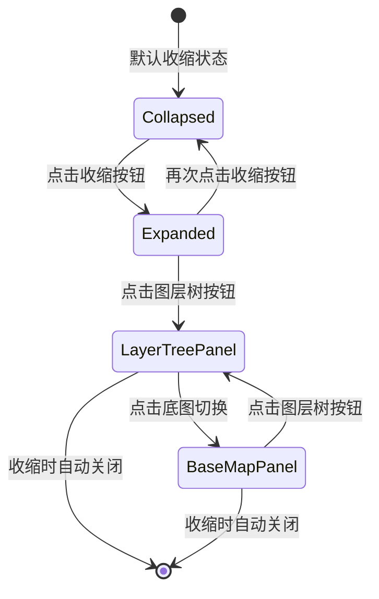
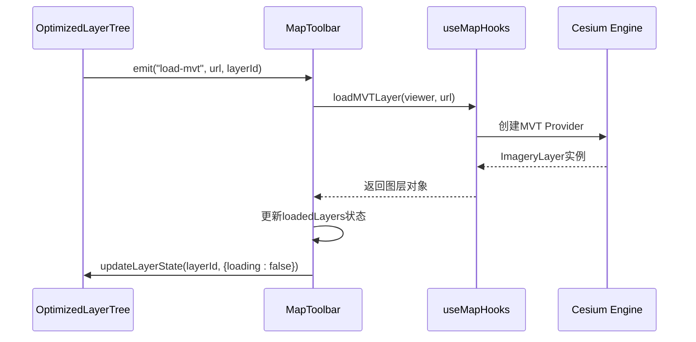
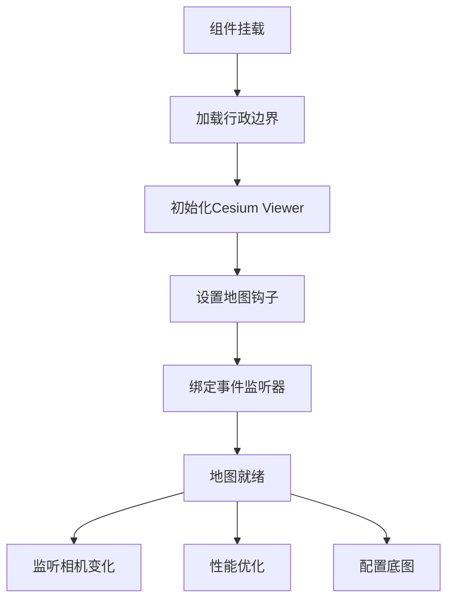
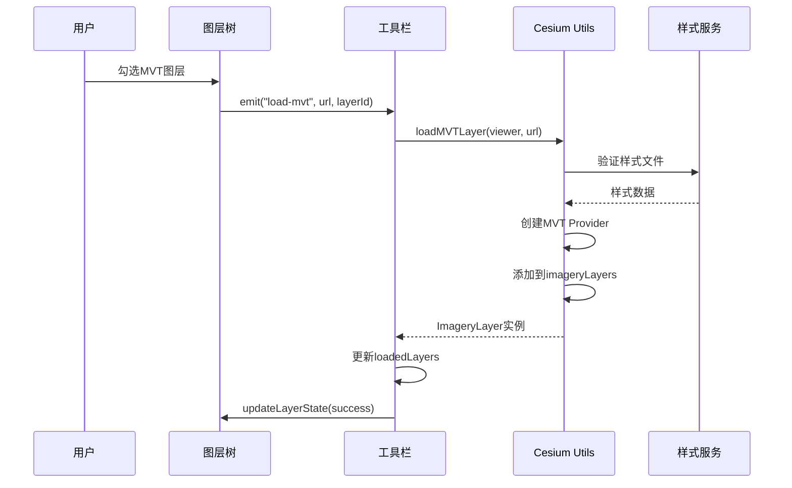
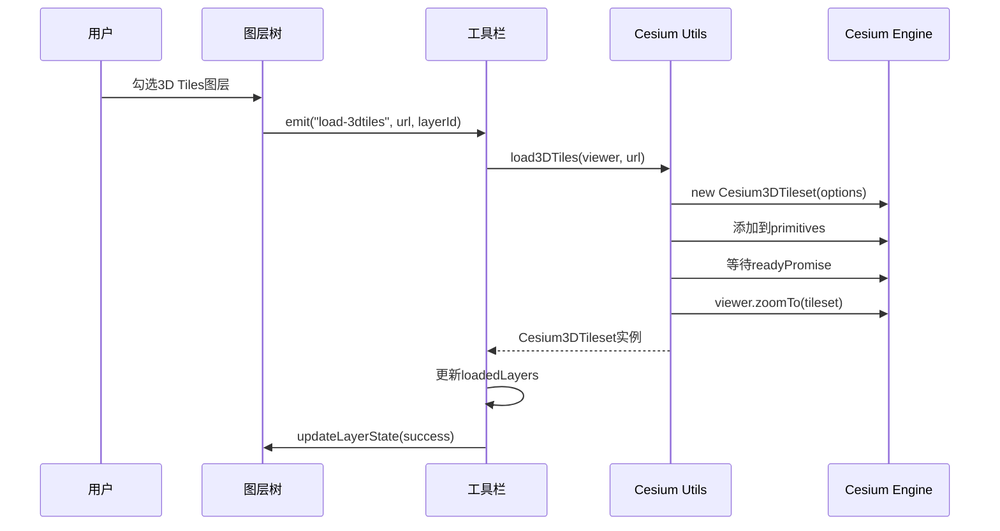
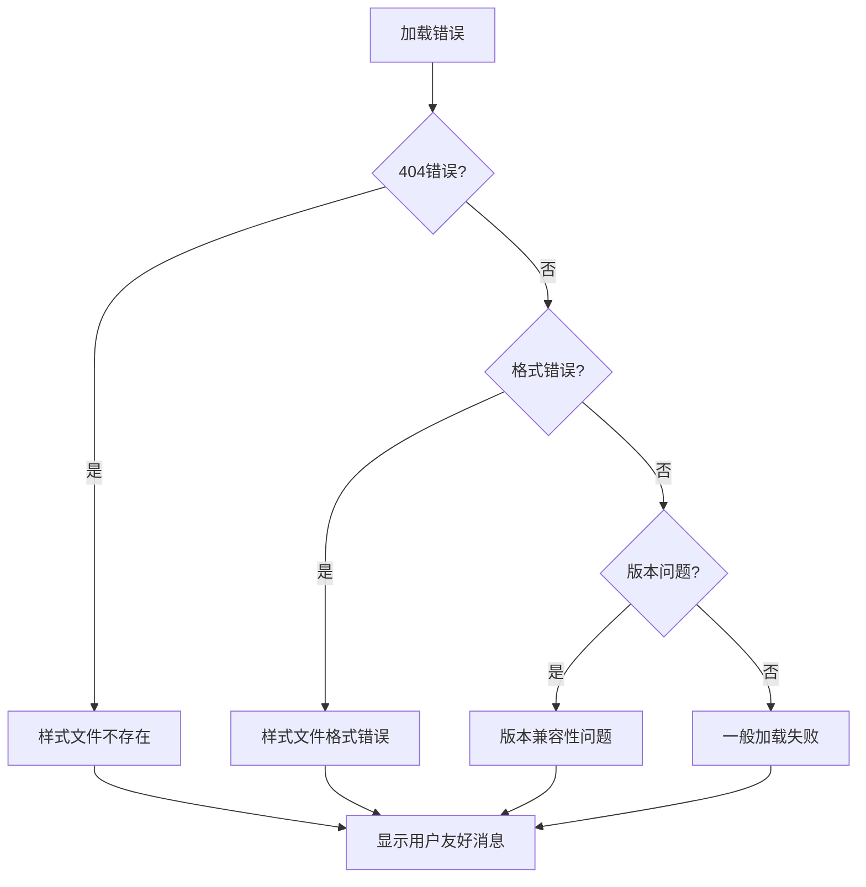
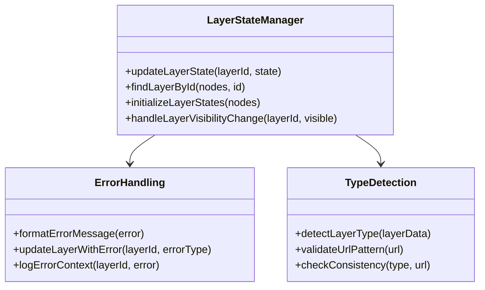
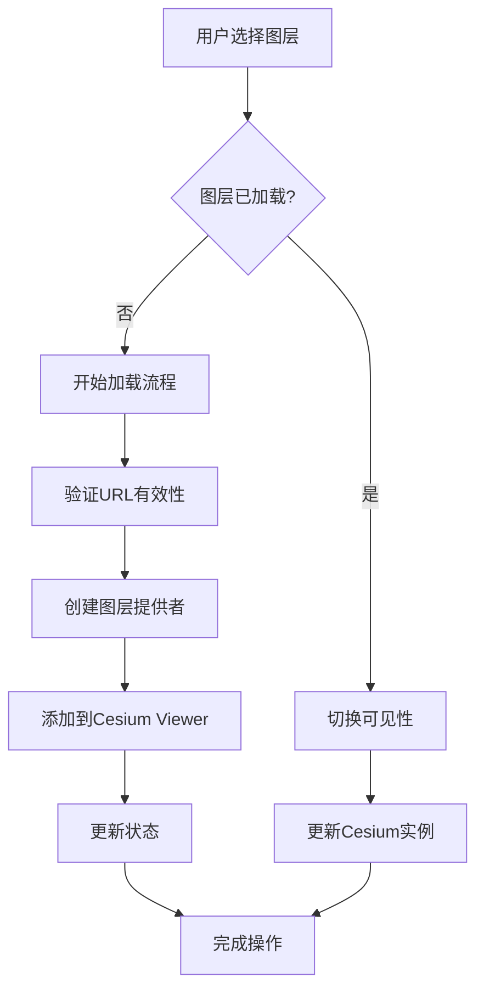

# 图层集成与使用

<cite>
**本文档中引用的文件**
- [OptimizedLayerTree.vue](file://src/mapComponents/OptimizedLayerTree.vue)
- [MapToolbar.vue](file://src/mapComponents/MapToolbar.vue)
- [Map.vue](file://src/mapComponents/Map.vue)
- [useMapHooks.ts](file://src/hook/useMapHooks.ts)
- [commonService.ts](file://src/services/commonService.ts)
- [mapConfig.ts](file://src/config/mapConfig.ts)
- [mapLayers.ts](file://src/stores/mapLayers.ts)
</cite>

## 目录
1. [概述](#概述)
2. [系统架构](#系统架构)
3. [核心组件分析](#核心组件分析)
4. [图层树集成机制](#图层树集成机制)
5. [图层加载流程](#图层加载流程)
6. [透明度控制机制](#透明度控制机制)
7. [错误处理与状态管理](#错误处理与状态管理)
8. [性能优化策略](#性能优化策略)
9. [最佳实践指南](#最佳实践指南)
10. [故障排除](#故障排除)

## 概述

本系统采用模块化架构设计，通过三个核心组件实现完整的图层管理系统：`OptimizedLayerTree.vue`负责图层树的展示和交互，`MapToolbar.vue`提供工具栏界面和图层控制，`Map.vue`承载Cesium地图实例并协调各组件间的通信。系统支持MVT矢量瓦片和3D Tiles三维模型等多种图层类型的动态加载和管理。

## 系统架构



**图表来源**
- [MapToolbar.vue](file://src/mapComponents/MapToolbar.vue#L1-L50)
- [OptimizedLayerTree.vue](file://src/mapComponents/OptimizedLayerTree.vue#L1-L50)
- [Map.vue](file://src/mapComponents/Map.vue#L1-L50)

## 核心组件分析

### OptimizedLayerTree.vue - 图层树组件

图层树组件是整个图层管理系统的核心入口，提供直观的图层层次结构展示和交互控制。

#### 主要功能特性

| 功能模块 | 描述 | 实现方式 |
|---------|------|----------|
| 图层树渲染 | 支持多层级图层结构展示 | 基于NaiveUI Tree组件 |
| 搜索过滤 | 实时搜索和高亮匹配图层 | 深度优先搜索算法 |
| 可见性控制 | 勾选框控制图层显隐 | 事件驱动的状态同步 |
| 类型检测 | 智能识别MVT/3D Tiles图层 | URL模式匹配算法 |
| 状态管理 | 图层加载状态跟踪 | 内置状态映射表 |

#### 图层类型智能识别

系统实现了智能图层类型检测机制，能够根据URL特征自动识别图层类型：



**图表来源**
- [OptimizedLayerTree.vue](file://src/mapComponents/OptimizedLayerTree.vue#L326-L351)

**章节来源**
- [OptimizedLayerTree.vue](file://src/mapComponents/OptimizedLayerTree.vue#L1-L687)

### MapToolbar.vue - 工具栏组件

工具栏组件提供统一的图层控制界面，集成了图层树面板和其他地图工具。

#### 面板管理机制



**图表来源**
- [MapToolbar.vue](file://src/mapComponents/MapToolbar.vue#L128-L144)

#### 图层加载事件处理

工具栏组件通过事件通信机制与图层树组件协作：



**图表来源**
- [MapToolbar.vue](file://src/mapComponents/MapToolbar.vue#L146-L185)
- [useMapHooks.ts](file://src/hook/useMapHooks.ts#L35-L93)

**章节来源**
- [MapToolbar.vue](file://src/mapComponents/MapToolbar.vue#L1-L504)

### Map.vue - 地图容器组件

地图容器组件承载Cesium Viewer实例，协调各个子组件的工作。

#### 地图初始化流程



**图表来源**
- [Map.vue](file://src/mapComponents/Map.vue#L360-L387)

**章节来源**
- [Map.vue](file://src/mapComponents/Map.vue#L1-L432)

## 图层树集成机制

### 组件间通信架构

系统采用事件驱动的通信模式，确保组件间的松耦合和高内聚：

```mermaid
graph LR
subgraph "事件发射"
OT[OptimizedLayerTree<br/>@layer-toggle<br/>@load-mvt<br/>@load-3dtiles<br/>@layer-opacity-change]
end
subgraph "事件监听"
MT[MapToolbar<br/>handleLayerToggle<br/>handleLoadMVT<br/>handleLoad3DTiles<br/>handleLayerOpacityChange]
M[Map<br/>直接操作Cesium实例]
end
OT --> MT
OT --> M
MT --> M
```

**图表来源**
- [OptimizedLayerTree.vue](file://src/mapComponents/OptimizedLayerTree.vue#L85-L89)
- [MapToolbar.vue](file://src/mapComponents/MapToolbar.vue#L18-L22)

### 图层状态同步机制

系统维护统一的图层状态管理，确保各组件间的状态一致性：

| 状态字段 | 类型 | 描述 | 更新来源 |
|---------|------|------|----------|
| visible | boolean | 图层可见性 | 用户交互/程序控制 |
| opacity | number | 图层透明度 | 用户调节/默认值 |
| loading | boolean | 加载状态 | 异步操作反馈 |
| error | string \| null | 错误信息 | 加载失败提示 |

**章节来源**
- [OptimizedLayerTree.vue](file://src/mapComponents/OptimizedLayerTree.vue#L101-L111)

## 图层加载流程

### MVT图层加载示例

MVT（Mapbox Vector Tiles）图层的加载过程展示了系统的异步处理能力：



**图表来源**
- [MapToolbar.vue](file://src/mapComponents/MapToolbar.vue#L146-L185)
- [useMapHooks.ts](file://src/hook/useMapHooks.ts#L35-L93)

### 3D Tiles图层加载示例

3D Tiles图层加载涉及更复杂的Cesium原生对象操作：



**图表来源**
- [MapToolbar.vue](file://src/mapComponents/MapToolbar.vue#L187-L224)
- [useMapHooks.ts](file://src/hook/useMapHooks.ts#L95-L151)

**章节来源**
- [MapToolbar.vue](file://src/mapComponents/MapToolbar.vue#L146-L224)
- [useMapHooks.ts](file://src/hook/useMapHooks.ts#L35-L151)

## 透明度控制机制

### 不同图层类型的透明度处理

系统针对不同类型的图层提供了专门的透明度控制方法：

| 图层类型 | 控制方式 | 实现方法 | 效果 |
|---------|----------|----------|------|
| MVT图层 | ImageryLayer.alpha | `layer.instance.alpha = opacity` | 整体透明度 |
| 3D Tiles | Cesium3DTileStyle.color | `color('white', ${opacity})` | 颜色混合透明度 |

### 透明度调整流程

```mermaid
flowchart TD
UserAdjust[用户调整透明度] --> EmitEvent[emit("layer-opacity-change")]
EmitEvent --> FindLayer[查找已加载图层]
FindLayer --> CheckType{图层类型}
CheckType --> |MVT| SetAlpha[设置alpha属性]
CheckType --> |3D Tiles| SetStyle[设置颜色样式]
SetAlpha --> LogSuccess[记录成功日志]
SetStyle --> LogSuccess
LogSuccess --> Complete[完成调整]
```

**图表来源**
- [MapToolbar.vue](file://src/mapComponents/MapToolbar.vue#L268-L286)

**章节来源**
- [MapToolbar.vue](file://src/mapComponents/MapToolbar.vue#L268-L286)

## 错误处理与状态管理

### 错误分类与处理策略

系统实现了完善的错误处理机制，针对不同类型的错误提供用户友好的提示：



**图表来源**
- [MapToolbar.vue](file://src/mapComponents/MapToolbar.vue#L166-L183)

### 状态更新机制

系统通过统一的状态更新接口确保图层状态的一致性：



**图表来源**
- [OptimizedLayerTree.vue](file://src/mapComponents/OptimizedLayerTree.vue#L414-L435)

**章节来源**
- [MapToolbar.vue](file://src/mapComponents/MapToolbar.vue#L166-L183)
- [OptimizedLayerTree.vue](file://src/mapComponents/OptimizedLayerTree.vue#L414-L435)

## 性能优化策略

### 图层懒加载机制

系统采用懒加载策略，只在需要时才加载图层资源：



**图表来源**
- [MapToolbar.vue](file://src/mapComponents/MapToolbar.vue#L227-L266)

### 内存管理优化

系统通过以下策略优化内存使用：

| 优化策略 | 实现方式 | 效果 |
|---------|----------|------|
| 图层复用 | 维护loadedLayers Map | 避免重复加载 |
| 状态缓存 | layerStates映射表 | 快速状态查询 |
| 异步处理 | Promise链式调用 | 非阻塞用户体验 |
| 错误恢复 | 降级处理机制 | 提升系统稳定性 |

**章节来源**
- [MapToolbar.vue](file://src/mapComponents/MapToolbar.vue#L108-L110)

## 最佳实践指南

### 图层组织建议

1. **合理分组**：按业务领域或技术类型对图层进行分组
2. **命名规范**：使用清晰、一致的图层命名
3. **类型标识**：准确标识图层类型，便于系统识别
4. **URL规范**：遵循标准的图层URL格式

### 性能优化建议

1. **预加载策略**：对常用图层实施预加载
2. **缓存机制**：利用浏览器缓存减少网络请求
3. **渐进式加载**：优先加载核心图层
4. **错误监控**：建立完善的错误监控体系

### 开发调试建议

1. **日志记录**：详细记录图层加载过程
2. **状态追踪**：实时监控图层状态变化
3. **性能监控**：关注加载时间和内存使用
4. **兼容性测试**：验证不同浏览器的兼容性

## 故障排除

### 常见问题及解决方案

| 问题类型 | 症状 | 可能原因 | 解决方案 |
|---------|------|----------|----------|
| 图层加载失败 | 图层无法显示 | URL错误、权限问题 | 检查URL有效性，验证访问权限 |
| 3D Tiles加载异常 | 模型显示异常 | 版本不兼容、文件损坏 | 更新Cesium版本，检查模型文件 |
| MVT样式错误 | 图层样式异常 | 样式文件格式错误 | 验证style.json格式，检查必需字段 |
| 性能问题 | 页面卡顿 | 图层过多、资源过大 | 实施分层加载，优化图层数量 |

### 调试技巧

1. **开发者工具**：使用浏览器开发者工具监控网络请求
2. **控制台日志**：查看详细的错误信息和调试日志
3. **状态检查**：验证图层状态映射表的正确性
4. **网络监控**：检查图层资源的加载情况

### 监控指标

系统提供了完整的监控指标，帮助开发者了解图层系统的运行状况：

- **加载成功率**：图层加载成功的百分比
- **平均加载时间**：不同类型图层的平均加载时间
- **错误率分布**：各类错误的发生频率
- **内存使用情况**：图层加载对内存的影响

通过这些监控指标，开发团队可以及时发现和解决潜在问题，确保系统的稳定运行。