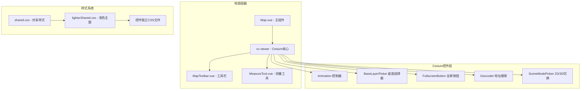
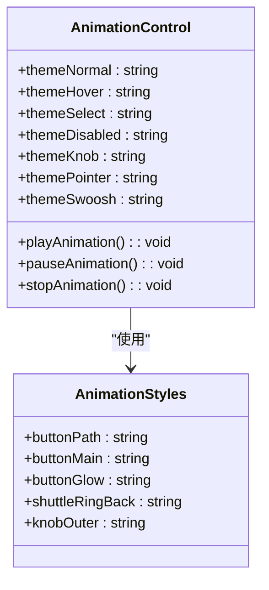
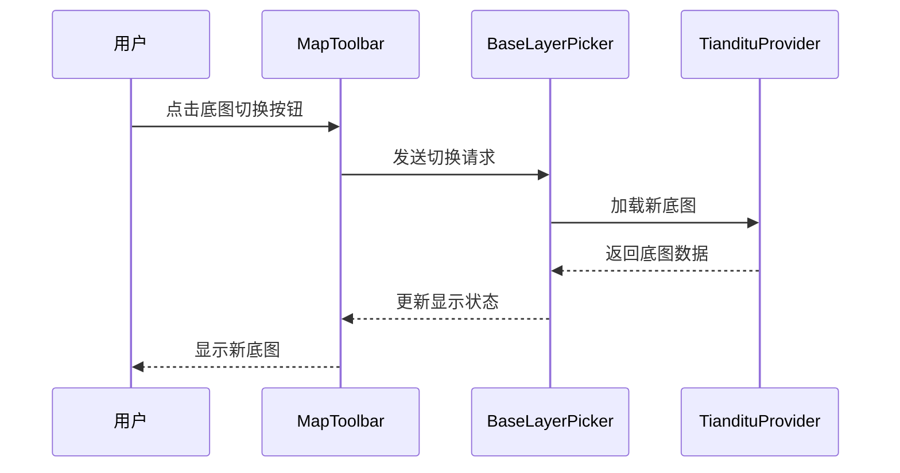
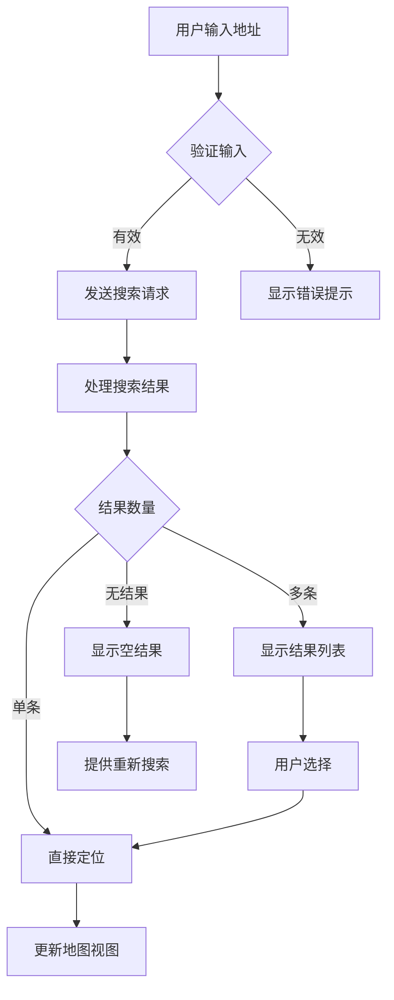
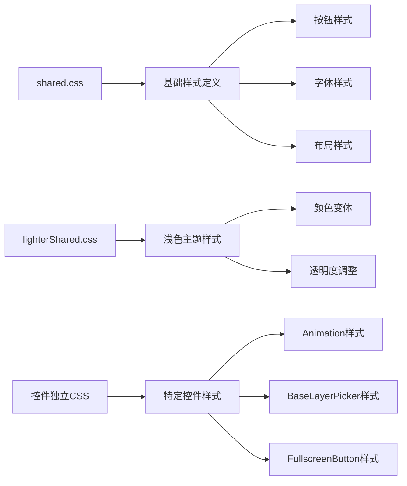
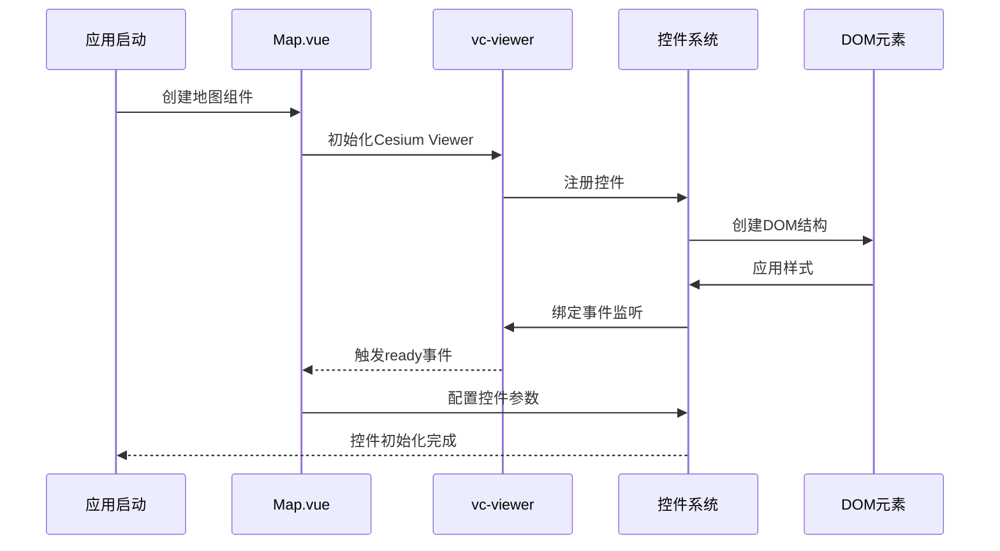
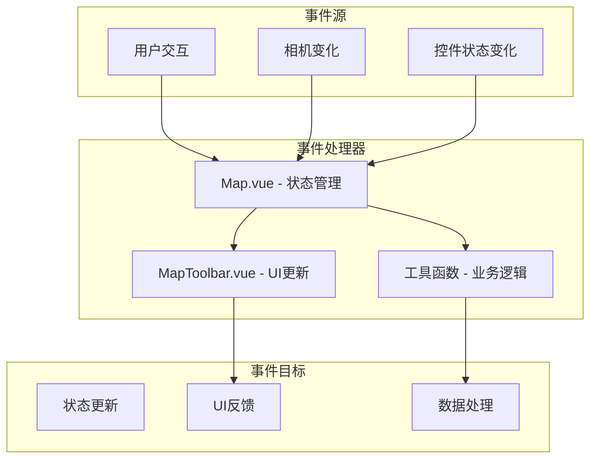
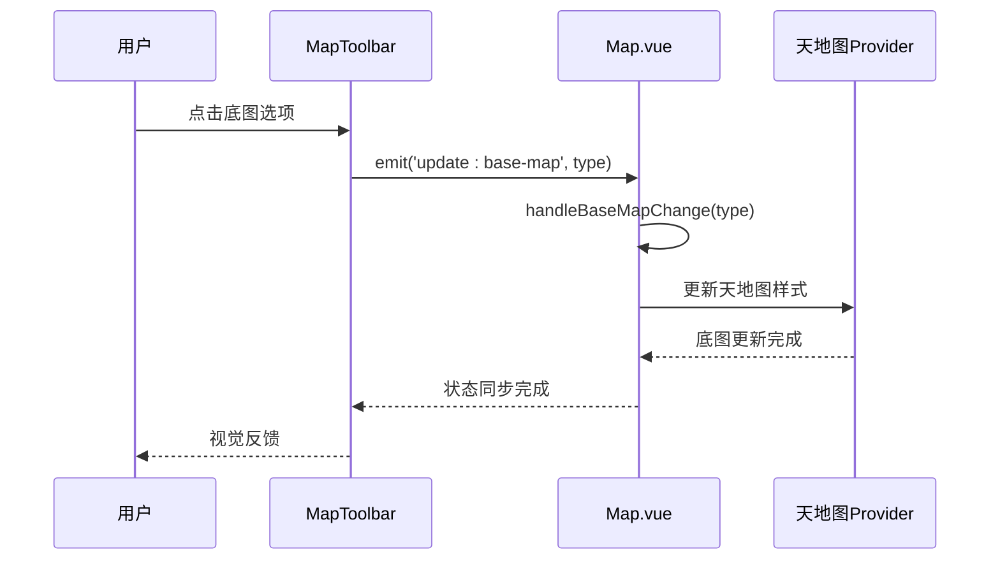

# Cesium控件集成

<cite>
**本文档中引用的文件**
- [Map.vue](file://src/mapComponents/Map.vue)
- [MapToolbar.vue](file://src/mapComponents/MapToolbar.vue)
- [shared.css](file://public/Cesium/Widgets/shared.css)
- [lighterShared.css](file://public/Cesium/Widgets/lighterShared.css)
- [Animation/lighter.css](file://public/Cesium/Widgets/Animation/lighter.css)
- [BaseLayerPicker/lighter.css](file://public/Cesium/Widgets/BaseLayerPicker/lighter.css)
- [FullscreenButton/FullscreenButton.css](file://public/Cesium/Widgets/FullscreenButton/FullscreenButton.css)
- [Geocoder/Geocoder.css](file://public/Cesium/Widgets/Geocoder/Geocoder.css)
- [SceneModePicker/SceneModePicker.css](file://public/Cesium/Widgets/SceneModePicker/SceneModePicker.css)
- [CesiumWidget/CesiumWidget.css](file://public/Cesium/Widgets/CesiumWidget/CesiumWidget.css)
- [Viewer/Viewer.css](file://public/Cesium/Widgets/Viewer/Viewer.css)
- [mapConfig.ts](file://src/config/mapConfig.ts)
- [MAP_TOOLBAR_INTEGRATION.md](file://MAP_TOOLBAR_INTEGRATION.md)
</cite>

## 目录
1. [简介](#简介)
2. [项目架构概览](#项目架构概览)
3. [核心控件集成](#核心控件集成)
4. [样式系统分析](#样式系统分析)
5. [控件初始化与配置](#控件初始化与配置)
6. [事件绑定与交互](#事件绑定与交互)
7. [布局管理与响应式设计](#布局管理与响应式设计)
8. [性能优化策略](#性能优化策略)
9. [最佳实践指南](#最佳实践指南)
10. [故障排除](#故障排除)

## 简介

本文档详细介绍了在Vue项目中集成Cesium原生控件的方法和最佳实践。项目采用vue-cesium框架，实现了完整的地图控件系统，包括Animation、BaseLayerPicker、FullscreenButton、Geocoder、SceneModePicker等核心控件的集成与定制。

通过Map.vue主组件和MapToolbar.vue工具栏组件的协作，项目展示了现代WebGIS应用中控件集成的标准模式，提供了丰富的配置选项、灵活的样式定制能力和完善的事件处理机制。

## 项目架构概览

### 整体架构设计



**图表来源**
- [Map.vue](file://src/mapComponents/Map.vue#L1-L50)
- [MapToolbar.vue](file://src/mapComponents/MapToolbar.vue#L1-L50)

### 组件层次结构

项目采用分层架构设计，主要包含以下层次：

1. **展示层**：Map.vue作为根组件，负责整体布局和状态管理
2. **控件层**：各个Cesium原生控件的封装和定制
3. **样式层**：基于CSS模块化的样式系统
4. **交互层**：事件处理和用户交互逻辑

**章节来源**
- [Map.vue](file://src/mapComponents/Map.vue#L1-L100)
- [MapToolbar.vue](file://src/mapComponents/MapToolbar.vue#L1-L100)

## 核心控件集成

### Animation控制器集成

Animation控件提供时间轴播放功能，支持动画序列的播放、暂停和进度控制。



**图表来源**
- [Animation/lighter.css](file://public/Cesium/Widgets/Animation/lighter.css#L1-L2)

#### 集成特点

- **主题适配**：支持深色和浅色两种主题
- **状态管理**：提供播放、暂停、停止等多种状态
- **样式定制**：通过CSS类名实现完全的视觉定制

### BaseLayerPicker底图选择器

BaseLayerPicker允许用户在不同底图之间切换，支持矢量图、影像图和地形图三种类型。



**图表来源**
- [MapToolbar.vue](file://src/mapComponents/MapToolbar.vue#L289-L292)
- [Map.vue](file://src/mapComponents/Map.vue#L329-L332)

#### 配置选项

| 配置项 | 类型 | 默认值 | 描述 |
|--------|------|--------|------|
| vec | string | 'vec_c' | 矢量地图样式 |
| img | string | 'img_c' | 影像地图样式 |
| ter | string | 'ter_c' | 地形地图样式 |

**章节来源**
- [Map.vue](file://src/mapComponents/Map.vue#L183-L189)
- [BaseLayerPicker/lighter.css](file://public/Cesium/Widgets/BaseLayerPicker/lighter.css#L1-L2)

### FullscreenButton全屏按钮

FullscreenButton提供全屏切换功能，支持浏览器全屏和Cesium特定的全屏模式。

#### 功能特性

- **双模式支持**：浏览器全屏和Cesium全屏
- **状态指示**：实时显示当前全屏状态
- **键盘支持**：支持ESC键退出全屏

### Geocoder地址搜索

Geocoder控件提供地理编码和反地理编码功能，支持地址搜索和位置定位。



**图表来源**
- [Geocoder/Geocoder.css](file://public/Cesium/Widgets/Geocoder/Geocoder.css#L1-L2)

#### 样式定制

Geocoder控件支持丰富的样式定制选项：

- **输入框样式**：宽度、高度、边框、背景色
- **搜索按钮**：图标、颜色、悬停效果
- **结果列表**：布局、字体、交互状态

**章节来源**
- [Geocoder/Geocoder.css](file://public/Cesium/Widgets/Geocoder/Geocoder.css#L1-L2)

### SceneModePicker场景模式切换

SceneModePicker提供2D和3D视图之间的切换功能。

#### 切换机制

控件通过Cesium.SceneMode枚举实现视图模式切换：

- **SCENE2D**：平面二维视图
- **SCENE3D**：三维立体视图
- **COLUMBUS_VIEW**：哥伦布视图（实验性）

**章节来源**
- [SceneModePicker/SceneModePicker.css](file://public/Cesium/Widgets/SceneModePicker/SceneModePicker.css#L1-L2)
- [Map.vue](file://src/mapComponents/Map.vue#L313-L324)

## 样式系统分析

### 共享样式架构

Cesium控件采用模块化的样式系统，通过shared.css和lighterShared.css实现主题分离。



**图表来源**
- [shared.css](file://public/Cesium/Widgets/shared.css#L1-L2)
- [lighterShared.css](file://public/Cesium/Widgets/lighterShared.css#L1-L2)

### 样式分类体系

#### 1. 基础按钮样式

shared.css定义了通用的按钮样式，包括：

- **默认状态**：背景色#303336，边框#444，文字#edffff
- **悬停状态**：背景色#48b，边框#aef，添加白色阴影
- **激活状态**：背景色#adf，边框#fff，黑色文字
- **禁用状态**：灰色系配色，无交互效果

#### 2. 浅色主题适配

lighterShared.css提供浅色主题的样式变体：

- **深色文字**：#111替代#edffff
- **浅色背景**：#e2f0ff替代#303336
- **柔和边框**：#759dc0替代#444

#### 3. 控件独立样式

每个控件都有自己的CSS文件，专门处理该控件的特殊需求：

- **Animation**：时间轴滑块、播放按钮样式
- **BaseLayerPicker**：底图预览框、选中状态指示
- **FullscreenButton**：全屏图标、尺寸适配
- **Geocoder**：搜索框、结果列表样式
- **SceneModePicker**：模式切换图标、过渡动画

**章节来源**
- [shared.css](file://public/Cesium/Widgets/shared.css#L1-L2)
- [lighterShared.css](file://public/Cesium/Widgets/lighterShared.css#L1-L2)

### 响应式设计策略

#### 断点系统

项目采用基于CSS媒体查询的响应式设计：

```css
/* 移动设备优先 */
@media (max-width: 768px) {
    .map-toolbar {
        flex-direction: row;
        flex-wrap: wrap;
    }
}

/* 平板设备 */
@media (min-width: 769px) and (max-width: 1024px) {
    .map-toolbar {
        gap: 12px;
    }
}

/* 桌面设备 */
@media (min-width: 1025px) {
    .map-toolbar {
        gap: 16px;
    }
}
```

#### 自适应布局

控件布局采用Flexbox和Grid混合模式：

- **工具栏布局**：Flexbox实现水平排列
- **面板定位**：绝对定位实现悬浮效果
- **内容溢出**：自动滚动条处理长列表

**章节来源**
- [MapToolbar.vue](file://src/mapComponents/MapToolbar.vue#L336-L504)

## 控件初始化与配置

### 初始化流程



**图表来源**
- [Map.vue](file://src/mapComponents/Map.vue#L232-L242)

### 关键配置参数

#### Viewer配置

Map.vue中的vc-viewer组件配置了以下关键参数：

| 参数 | 类型 | 默认值 | 说明 |
|------|------|--------|------|
| selectionIndicator | boolean | false | 禁用选择指示器 |
| camera | object | - | 初始相机位置 |
| infoBox | boolean | false | 禁用信息框 |
| sceneMode | number | 2 | 默认2D模式 |
| requestRenderMode | boolean | true | 请求渲染模式 |
| maximumRenderTimeChange | number | Infinity | 最大渲染时间 |

#### 性能优化配置

项目实现了多项性能优化措施：

- **光源禁用**：`viewer.scene.globe.enableLighting = false`
- **雾效禁用**：`viewer.scene.fog.enabled = false`
- **大气层禁用**：`viewer.scene.skyAtmosphere.show = false`
- **地形细节降低**：`viewer.scene.globe.maximumScreenSpaceError = 2`
- **阴影禁用**：`viewer.shadows = false`

**章节来源**
- [Map.vue](file://src/mapComponents/Map.vue#L232-L277)

### 控件显示/隐藏配置

#### 条件渲染策略

控件的显示状态通过Vue的条件渲染指令实现：

```vue
<!-- Animation控件 -->
<vc-widget :show="showAnimation">
  <cesium-animation />
</vc-widget>

<!-- BaseLayerPicker控件 -->
<vc-widget :show="showBaseLayerPicker">
  <cesium-base-layer-picker />
</vc-widget>
```

#### 动态配置方法

通过JavaScript动态控制控件显示：

```javascript
// 显示Animation控件
viewer.animation.viewModel.show = true;

// 隐藏BaseLayerPicker控件
viewer.baseLayerPicker.viewModel.show = false;

// 获取控件实例
const animation = viewer.animation;
const baseLayerPicker = viewer.baseLayerPicker;
```

**章节来源**
- [Map.vue](file://src/mapComponents/Map.vue#L3-L432)

## 事件绑定与交互

### 事件系统架构



**图表来源**
- [Map.vue](file://src/mapComponents/Map.vue#L240-L242)
- [MapToolbar.vue](file://src/mapComponents/MapToolbar.vue#L84-L100)

### 相机事件监听

相机变化事件是地图交互的核心事件之一：

```javascript
// 监听相机变化更新指北针
viewer.camera.changed.addEventListener(() => {
  compassRotation.value = Cesium.Math.toDegrees(viewer.camera.heading)
})
```

#### 事件类型分类

| 事件类型 | 触发条件 | 处理方式 | 性能影响 |
|----------|----------|----------|----------|
| 相机移动 | 用户拖拽、飞行动画 | 实时更新 | 中等 |
| 缩放级别 | 滚轮、双击 | 延迟更新 | 低 |
| 俯仰角度 | 上下拖拽 | 实时更新 | 中等 |
| 朝向变化 | 旋转操作 | 实时更新 | 中等 |

**章节来源**
- [Map.vue](file://src/mapComponents/Map.vue#L240-L242)

### 控件事件处理

#### 底图切换事件



**图表来源**
- [MapToolbar.vue](file://src/mapComponents/MapToolbar.vue#L289-L292)
- [Map.vue](file://src/mapComponents/Map.vue#L329-L332)

#### 场景模式切换事件

场景模式切换涉及复杂的Cesium内部状态变更：

```javascript
const handleSceneModeChange = (mode: 2 | 3) => {
  if (!viewerInstance.value) return
  
  sceneMode.value = mode
  const Cesium = (window as any).Cesium
  
  if (Cesium) {
    viewerInstance.value.scene.mode = mode === 3
      ? Cesium.SceneMode.SCENE3D
      : Cesium.SceneMode.SCENE2D
  }
}
```

**章节来源**
- [Map.vue](file://src/mapComponents/Map.vue#L313-L324)

### 自定义事件系统

项目实现了基于Vue的自定义事件系统：

#### 事件命名规范

- **Props命名**：kebab-case风格（如`scene-mode`）
- **Emit命名**：动词开头（如`reset-map`）
- **事件参数**：使用类型断言确保类型安全

#### 事件传播机制

```typescript
// 父组件定义事件处理
const handleResetMap = () => {
  // 地图重置逻辑
}

// 子组件触发事件
emit('reset-map')

// 父组件监听事件
<template>
  <MapToolbar @reset-map="handleResetMap" />
</template>
```

**章节来源**
- [MapToolbar.vue](file://src/mapComponents/MapToolbar.vue#L95-L100)

## 布局管理与响应式设计

### 布局系统设计

#### Flexbox布局策略

MapToolbar采用Flexbox实现灵活的布局：

```css
.map-toolbar {
  display: flex;
  flex-direction: column;
  gap: 16px;
  transition: all 0.3s ease;
}

.toolbar-item {
  width: 80px;
  height: 80px;
  border-radius: 12px;
  cursor: pointer;
  transition: all 0.3s ease;
}
```

#### 绝对定位系统

控件面板使用绝对定位实现悬浮效果：

```css
.layer-tree-panel {
  position: absolute;
  right: 100%;
  top: 0;
  margin-right: 16px;
  width: 400px;
  max-height: 600px;
}
```

**章节来源**
- [MapToolbar.vue](file://src/mapComponents/MapToolbar.vue#L337-L400)

### 响应式断点系统

#### 设备适配策略

```css
/* 移动设备 (< 768px) */
@media (max-width: 768px) {
  .map-toolbar {
    flex-direction: row;
    flex-wrap: wrap;
    gap: 8px;
  }
  
  .toolbar-item {
    width: 60px;
    height: 60px;
  }
}

/* 平板设备 (768px - 1024px) */
@media (min-width: 769px) and (max-width: 1024px) {
  .map-toolbar {
    gap: 12px;
  }
  
  .layer-tree-panel {
    width: 320px;
  }
}

/* 桌面设备 (> 1024px) */
@media (min-width: 1025px) {
  .map-toolbar {
    gap: 16px;
  }
}
```

#### 动态布局调整

控件布局能够根据容器大小动态调整：

- **收缩模式**：窄屏时隐藏次要功能
- **紧凑布局**：减少间距和尺寸
- **扩展模式**：宽屏时显示完整功能

**章节来源**
- [MapToolbar.vue](file://src/mapComponents/MapToolbar.vue#L337-L350)

### 动画与过渡效果

#### 滑入动画系统

项目使用Vue Transition组件实现平滑的面板切换：

```vue
<transition name="slide-left">
  <div v-if="showLayerTreePanel" class="layer-tree-panel">
    <!-- 内容 -->
  </div>
</transition>
```

#### CSS动画配置

```css
.slide-left-enter-active,
.slide-left-leave-active {
  transition: all 0.3s ease;
}

.slide-left-enter-from {
  opacity: 0;
  transform: translateX(20px);
}

.slide-left-leave-to {
  opacity: 0;
  transform: translateX(20px);
}
```

**章节来源**
- [MapToolbar.vue](file://src/mapComponents/MapToolbar.vue#L487-L501)

## 性能优化策略

### 渲染性能优化

#### 相机事件优化

为了避免频繁的相机事件导致性能问题，项目采用以下优化策略：

```javascript
// 使用防抖处理相机变化事件
let cameraUpdateTimeout: ReturnType<typeof setTimeout> | null = null;

viewer.camera.changed.addEventListener(() => {
  if (cameraUpdateTimeout) {
    clearTimeout(cameraUpdateTimeout);
  }
  
  cameraUpdateTimeout = setTimeout(() => {
    compassRotation.value = Cesium.Math.toDegrees(viewer.camera.heading);
  }, 16); // 约60fps的间隔
});
```

#### 控件懒加载

非关键控件采用懒加载策略：

```javascript
// 按需加载Geocoder控件
const loadGeocoder = async () => {
  if (!geocoderLoaded.value) {
    const { CesiumGeocoder } = await import('cesium-widgets');
    geocoderLoaded.value = true;
  }
};
```

**章节来源**
- [Map.vue](file://src/mapComponents/Map.vue#L240-L242)

### 内存管理优化

#### 事件监听器清理

项目实现了完整的事件监听器清理机制：

```javascript
onBeforeUnmount(() => {
  // 清理相机范围限制
  if (cameraBoundsCleanup) {
    cameraBoundsCleanup();
    cameraBoundsCleanup = null;
  }
  
  // 清理点击查询事件
  if (clickQueryCleanup) {
    clickQueryCleanup();
    clickQueryCleanup = null;
  }
});
```

#### 控件实例管理

通过WeakMap管理控件实例，避免内存泄漏：

```javascript
const controlInstances = new WeakMap();

// 创建控件时存储实例
controlInstances.set(element, control);

// 清理时移除引用
controlInstances.delete(element);
```

**章节来源**
- [Map.vue](file://src/mapComponents/Map.vue#L373-L386)

### 网络资源优化

#### 样式文件优化

- **CSS压缩**：生产环境启用CSS压缩
- **按需加载**：只加载必要的样式文件
- **缓存策略**：合理设置HTTP缓存头

#### 地图瓦片优化

```javascript
// 设置合理的瓦片缓存策略
viewer.imageryLayers.addImageryProvider(new BingMaps({
  url: 'https://dev.virtualearth.net',
  key: 'your-key',
  maximumLevel: 19,
  credit: 'Bing Maps'
}));
```

**章节来源**
- [mapConfig.ts](file://src/config/mapConfig.ts#L1-L55)

## 最佳实践指南

### 控件集成最佳实践

#### 1. 组件化设计

遵循Vue组件化原则，将每个控件封装为独立的组件：

```vue
<template>
  <div class="custom-control">
    <slot></slot>
  </div>
</template>

<script setup>
defineProps({
  theme: {
    type: String,
    default: 'dark'
  }
});
</script>
```

#### 2. 状态管理模式

采用集中式状态管理，避免组件间的状态混乱：

```javascript
// 使用provide/inject实现跨层级状态共享
const mapState = reactive({
  currentBaseMap: 'vec',
  sceneMode: 2,
  compassRotation: 0
});

provide('mapState', mapState);
```

#### 3. 事件通信规范

建立清晰的事件通信协议：

- **Props向下传递**：父组件向子组件传递配置
- **Emit向上冒泡**：子组件向父组件报告状态变化
- **Provide/inject横向共享**：兄弟组件间共享状态

**章节来源**
- [MAP_TOOLBAR_INTEGRATION.md](file://MAP_TOOLBAR_INTEGRATION.md#L436-L440)

### 样式定制最佳实践

#### 1. CSS模块化

采用CSS Modules实现样式的模块化管理：

```css
/* styles.module.css */
.control {
  composes: base from './base.css';
  background: var(--control-bg);
  border-radius: var(--control-radius);
}
```

#### 2. 主题系统

实现灵活的主题切换系统：

```javascript
// 主题配置
const themes = {
  dark: {
    primary: '#1677ff',
    secondary: '#2f54eb',
    background: '#000',
    text: '#fff'
  },
  light: {
    primary: '#1677ff',
    secondary: '#4096ff',
    background: '#fff',
    text: '#000'
  }
};

// 动态应用主题
function applyTheme(themeName) {
  const theme = themes[themeName];
  document.documentElement.style.setProperty('--primary-color', theme.primary);
  document.documentElement.style.setProperty('--bg-color', theme.background);
}
```

#### 3. 响应式设计

遵循移动优先的设计原则：

```css
/* 移动优先 */
.control {
  width: 48px;
  height: 48px;
  font-size: 12px;
}

/* 平板适配 */
@media (min-width: 768px) {
  .control {
    width: 64px;
    height: 64px;
    font-size: 14px;
  }
}

/* 桌面适配 */
@media (min-width: 1024px) {
  .control {
    width: 80px;
    height: 80px;
    font-size: 16px;
  }
}
```

**章节来源**
- [MapToolbar.vue](file://src/mapComponents/MapToolbar.vue#L336-L504)

### 性能监控与调试

#### 1. 性能指标监控

```javascript
// 性能监控工具
class PerformanceMonitor {
  constructor() {
    this.metrics = {
      fps: 0,
      frameTime: 0,
      memoryUsage: 0
    };
  }
  
  start() {
    this.fpsInterval = setInterval(() => {
      this.updateFPS();
    }, 1000);
  }
  
  updateFPS() {
    const now = performance.now();
    if (this.lastFrameTime) {
      const delta = now - this.lastFrameTime;
      this.metrics.frameTime = delta;
      this.metrics.fps = Math.round(1000 / delta);
    }
    this.lastFrameTime = now;
  }
}
```

#### 2. 内存泄漏检测

```javascript
// 内存泄漏检测工具
class MemoryLeakDetector {
  constructor() {
    this.snapshots = [];
  }
  
  takeSnapshot() {
    if (performance.memory) {
      this.snapshots.push({
        used: performance.memory.usedJSHeapSize,
        total: performance.memory.totalJSHeapSize,
        limit: performance.memory.jsHeapSizeLimit,
        timestamp: Date.now()
      });
    }
  }
  
  detectLeaks() {
    if (this.snapshots.length < 2) return false;
    
    const recent = this.snapshots.slice(-5);
    const growth = recent[recent.length - 1].used - recent[0].used;
    
    return growth > 10 * 1024 * 1024; // 10MB增长
  }
}
```

## 故障排除

### 常见问题与解决方案

#### 1. 控件不显示问题

**症状**：控件在页面上不可见

**可能原因**：
- CSS样式冲突
- 控件初始化顺序错误
- 容器尺寸问题

**解决方案**：
```javascript
// 检查控件容器
console.log('控件容器:', document.querySelector('.cesium-viewer'));

// 强制刷新控件
viewer.forceResize();

// 检查CSS加载状态
const stylesheets = document.styleSheets;
console.log('已加载的样式表:', stylesheets.length);
```

#### 2. 事件绑定失效

**症状**：控件点击无反应

**可能原因**：
- 事件监听器被意外移除
- 控件实例丢失
- 异步加载问题

**解决方案**：
```javascript
// 检查控件实例是否存在
if (!viewer.animation) {
  console.warn('Animation控件未初始化');
  return;
}

// 重新绑定事件
viewer.animation.viewModel.playPauseCommand.beforeExecute.addEventListener(() => {
  console.log('播放/暂停命令执行前');
});
```

#### 3. 性能问题诊断

**症状**：地图操作卡顿

**诊断步骤**：
```javascript
// 性能分析工具
class PerformanceAnalyzer {
  static analyzeRendering() {
    const stats = {
      renderTime: viewer.clock.currentTime - viewer.clock.lastTick,
      frameCount: viewer.scene.frameState.frameNumber,
      memoryUsage: performance.memory?.usedJSHeapSize || 0
    };
    
    console.table(stats);
    return stats;
  }
  
  static monitorMemory() {
    const observer = new PerformanceObserver((list) => {
      for (const entry of list.getEntries()) {
        console.log('内存使用:', entry.entryType, entry.size);
      }
    });
    
    observer.observe({ entryTypes: ['node', 'element'] });
  }
}
```

#### 4. 样式冲突解决

**症状**：控件样式异常

**解决方案**：
```css
/* 使用深度选择器隔离样式 */
:deep(.cesium-animation) {
  all: initial; /* 重置所有样式 */
  font-family: inherit;
  font-size: inherit;
}

/* 特定控件样式覆盖 */
.cesium-animation {
  background: transparent !important;
  box-shadow: none !important;
}
```

### 调试工具集

#### 1. 控件状态检查器

```javascript
// 控件状态检查工具
class ControlInspector {
  static inspectAllControls(viewer) {
    const controls = {
      animation: viewer.animation,
      baseLayerPicker: viewer.baseLayerPicker,
      fullscreenButton: viewer.fullscreenButton,
      geocoder: viewer.geocoder,
      sceneModePicker: viewer.sceneModePicker
    };
    
    Object.entries(controls).forEach(([name, control]) => {
      console.log(`${name}:`, {
        exists: !!control,
        viewModel: control?.viewModel,
        show: control?.viewModel?.show
      });
    });
  }
  
  static dumpDOMStructure() {
    const cesiumElements = document.querySelectorAll('.cesium-viewer *');
    console.log('Cesium DOM元素数量:', cesiumElements.length);
    
    cesiumElements.forEach(el => {
      console.log(el.tagName, el.className, el.style.display);
    });
  }
}
```

#### 2. 性能分析器

```javascript
// 性能分析工具
class PerformanceProfiler {
  static startProfiling() {
    this.startTime = performance.now();
    this.startMemory = performance.memory?.usedJSHeapSize || 0;
  }
  
  static endProfiling(operation) {
    const endTime = performance.now();
    const endMemory = performance.memory?.usedJSHeapSize || 0;
    
    console.log(`${operation}耗时:`, endTime - this.startTime, 'ms');
    console.log(`${operation}内存增长:`, endMemory - this.startMemory, 'bytes');
  }
  
  static monitorFrameRate() {
    let frameCount = 0;
    let lastTime = performance.now();
    
    function animate() {
      requestAnimationFrame(animate);
      
      frameCount++;
      const currentTime = performance.now();
      
      if (currentTime - lastTime >= 1000) {
        console.log('帧率:', frameCount);
        frameCount = 0;
        lastTime = currentTime;
      }
    }
    
    animate();
  }
}
```

**章节来源**
- [MAP_TOOLBAR_INTEGRATION.md](file://MAP_TOOLBAR_INTEGRATION.md#L443-L539)

## 结论

本文档全面介绍了Cesium控件在Vue项目中的集成方法和最佳实践。通过Map.vue和MapToolbar.vue的协作模式，项目展示了现代WebGIS应用中控件集成的标准架构。

### 关键成果

1. **完整的控件生态系统**：实现了Animation、BaseLayerPicker、FullscreenButton、Geocoder、SceneModePicker等核心控件的集成
2. **灵活的样式系统**：基于CSS模块化和主题系统的样式定制能力
3. **高效的事件处理**：基于Vue的组件化事件通信机制
4. **优秀的性能表现**：通过多种优化策略确保良好的用户体验

### 技术特色

- **模块化架构**：清晰的组件分层和职责划分
- **响应式设计**：适应不同设备和屏幕尺寸的布局系统
- **主题适配**：支持深色和浅色两种主题模式
- **性能优化**：多层次的性能优化策略和监控机制

### 未来发展方向

随着WebGIS技术的不断发展，项目可以在以下方面进一步完善：

1. **更多控件支持**：集成更多Cesium原生控件
2. **移动端优化**：针对移动设备的特殊优化
3. **无障碍支持**：提升残障用户的使用体验
4. **国际化支持**：多语言界面和本地化功能

通过持续的技术创新和优化，该项目为现代WebGIS应用的控件集成提供了优秀的参考范例。