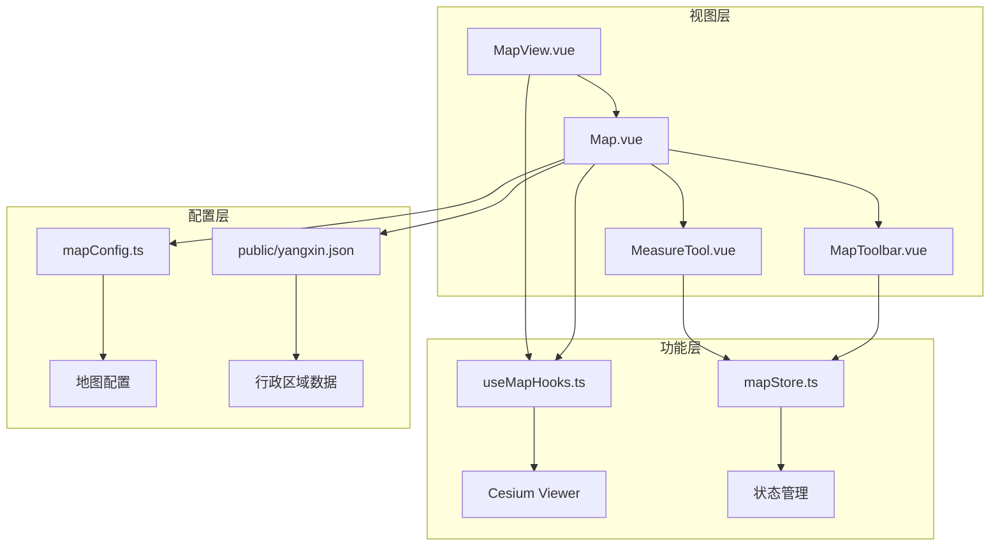
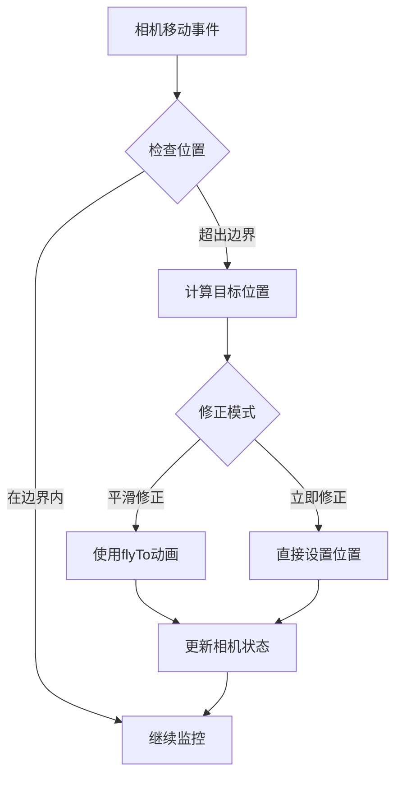
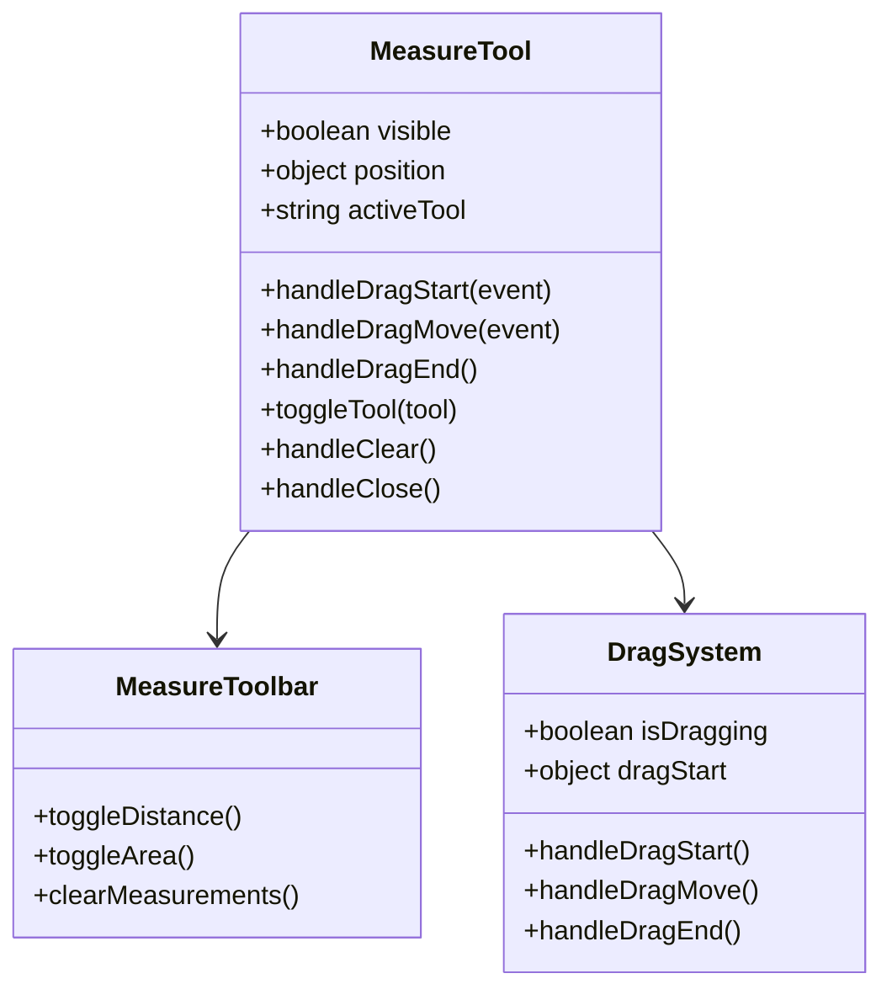
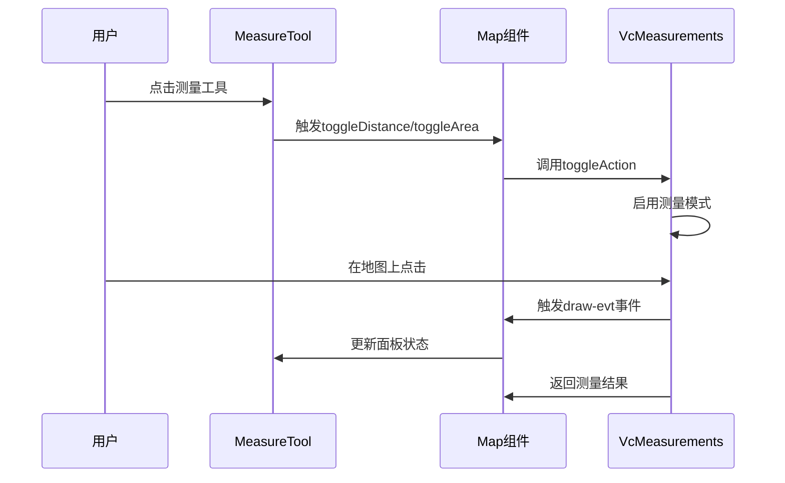
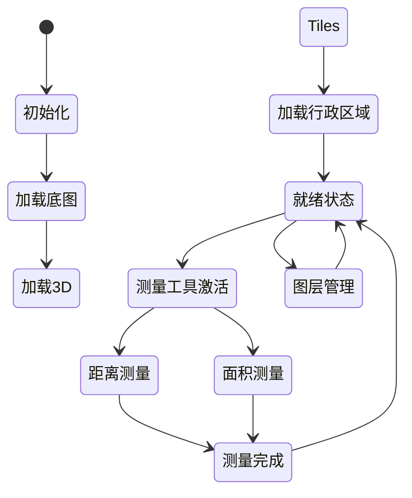
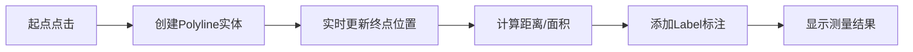

# 地图交互功能

<cite>
**本文档中引用的文件**
- [useMapHooks.ts](file://src/hook/useMapHooks.ts)
- [MeasureTool.vue](file://src/mapComponents/MeasureTool.vue)
- [Map.vue](file://src/mapComponents/Map.vue)
- [MapToolbar.vue](file://src/mapComponents/MapToolbar.vue)
- [mapConfig.ts](file://src/config/mapConfig.ts)
- [MapView.vue](file://src/views/MapView.vue)
- [mapStore.ts](file://src/stores/mapStore.ts)
</cite>

## 目录
1. [简介](#简介)
2. [项目架构概览](#项目架构概览)
3. [核心组件分析](#核心组件分析)
4. [测量工具实现机制](#测量工具实现机制)
5. [地图交互功能架构](#地图交互功能架构)
6. [Cesium图形元素应用](#cesium图形元素应用)
7. [性能优化与最佳实践](#性能优化与最佳实践)
8. [故障排除指南](#故障排除指南)
9. [总结](#总结)

## 简介

本项目是一个基于Vue 3和Cesium的政府Dashboard地图系统，提供了完整的地图交互功能，包括测量工具、图层管理、相机控制等核心功能。测量工具作为其中的重要组成部分，支持距离测量和面积测量两种模式，通过Vue Composition API和Cesium Entity系统实现了高效的地理空间测量功能。

## 项目架构概览

该项目采用模块化架构设计，主要分为以下几个层次：



**图表来源**
- [Map.vue](file://src/mapComponents/Map.vue#L1-L50)
- [MeasureTool.vue](file://src/mapComponents/MeasureTool.vue#L1-L50)
- [MapToolbar.vue](file://src/mapComponents/MapToolbar.vue#L1-L50)

**章节来源**
- [Map.vue](file://src/mapComponents/Map.vue#L1-L432)
- [MeasureTool.vue](file://src/mapComponents/MeasureTool.vue#L1-L267)
- [MapToolbar.vue](file://src/mapComponents/MapToolbar.vue#L1-L504)

## 核心组件分析

### useMapHooks.ts - 地图操作辅助函数

`useMapHooks` 是一个基于Vue Composition API的地图工具函数集合，提供了丰富的地图操作功能：

#### 主要功能模块

1. **图层管理功能**
   - `loadMVTLayer`: 加载MVT矢量瓦片图层
   - `load3DTiles`: 加载3D Tiles图层
   - `set3DTilesVisibility`: 设置3D Tiles可见性
   - `set3DTilesStyle`: 设置3D Tiles样式

2. **相机控制功能**
   - `restrictCameraBounds`: 限制相机平移范围
   - `restrictCameraBoundsByGeoJSON`: 基于GeoJSON边界限制相机范围

3. **图层存储管理**
   - `getLoadedLayers`: 获取已加载的图层
   - `setLoadedLayer`: 存储已加载的图层
   - `getLoadedLayer`: 获取指定ID的图层

#### 相机范围限制机制

相机范围限制功能通过监听相机移动事件，实时检查相机位置是否超出预设边界：



**图表来源**
- [useMapHooks.ts](file://src/hook/useMapHooks.ts#L228-L423)

**章节来源**
- [useMapHooks.ts](file://src/hook/useMapHooks.ts#L33-L545)

### MeasureTool.vue - 测量工具面板

测量工具面板是一个独立的Vue组件，提供直观的测量工具界面：

#### 组件架构设计



**图表来源**
- [MeasureTool.vue](file://src/mapComponents/MeasureTool.vue#L43-L136)

#### 用户交互流程

测量工具的用户交互遵循以下流程：

1. **工具选择阶段**
   - 用户点击测量工具按钮
   - 显示测量工具面板
   - 允许选择距离或面积测量

2. **测量执行阶段**
   - 用户在地图上点击确定测量起点
   - 鼠标移动时实时显示测量线
   - 再次点击确定测量终点

3. **结果展示阶段**
   - 显示测量结果数值
   - 提供清除和关闭选项

**章节来源**
- [MeasureTool.vue](file://src/mapComponents/MeasureTool.vue#L1-L267)

## 测量工具实现机制

### VcMeasurements组件集成

项目使用vue-cesium库中的`VcMeasurements`组件来实现测量功能：

#### 组件配置

```typescript
// VcMeasurements配置
const mainFabOpts = {
  modelValue: false
}

// 测量工具类型
const measurements = ['polyline', 'area']
```

#### 测量功能实现

测量功能通过以下方法实现：



**图表来源**
- [Map.vue](file://src/mapComponents/Map.vue#L134-L160)

### 测量工具切换机制

测量工具的切换通过以下步骤实现：

1. **距离测量切换**
   ```typescript
   const toggleDistance = () => {
     if (!measurementsRef.value) return
     measurementsRef.value.toggleAction('polyline')
     console.log('✅ 切换距离测量')
   }
   ```

2. **面积测量切换**
   ```typescript
   const toggleArea = () => {
     if (!measurementsRef.value) {
       console.warn('⚠️ VcMeasurements 组件未就绪')
       return
     }
     measurementsRef.value.toggleAction('area')
     console.log('✅ 切换面积测量')
   }
   ```

3. **清除测量**
   ```typescript
   const clearMeasurements = () => {
     if (!measurementsRef.value) {
       console.warn('⚠️ VcMeasurements 组件未就绪')
       return
     }
     measurementsRef.value.clearAll()
     console.log('🗑️ 清除所有测量结果')
   }
   ```

**章节来源**
- [Map.vue](file://src/mapComponents/Map.vue#L134-L160)

## 地图交互功能架构

### Map.vue - 主地图组件

主地图组件负责整合所有地图功能，包括测量工具、图层管理、相机控制等：

#### 组件状态管理



**图表来源**
- [Map.vue](file://src/mapComponents/Map.vue#L232-L255)

#### 性能优化策略

地图组件采用了多种性能优化策略：

1. **Cesium性能优化**
   ```typescript
   function optimizeCesiumPerformance(viewer: any, Cesium: any) {
     // 关闭不必要的渲染
     viewer.scene.globe.enableLighting = false
     viewer.scene.fog.enabled = false
     viewer.scene.skyAtmosphere.show = false
     
     // 降低地形细节
     viewer.scene.globe.maximumScreenSpaceError = 2
     
     // 优化渲染性能
     viewer.scene.requestRenderMode = true
     viewer.scene.maximumRenderTimeChange = Infinity
     
     // 禁用阴影
     viewer.shadows = false
   }
   ```

2. **相机范围限制**
   - 基于阳新县行政区域边界限制相机移动
   - 支持平滑修正和立即修正两种模式
   - 自动调整相机高度范围

**章节来源**
- [Map.vue](file://src/mapComponents/Map.vue#L258-L277)

### MapToolbar.vue - 地图工具栏

地图工具栏提供了一系列地图操作功能：

#### 功能模块

1. **图层管理**
   - 图层树面板
   - MVT图层加载
   - 3D Tiles图层管理

2. **底图切换**
   - 矢量地图
   - 影像地图
   - 地形地图

3. **视图控制**
   - 2D/3D切换
   - 地图重置
   - 指北针功能

**章节来源**
- [MapToolbar.vue](file://src/mapComponents/MapToolbar.vue#L1-L504)

## Cesium图形元素应用

### Entity系统应用

虽然项目主要使用VcMeasurements组件进行测量，但在其他场景中展示了Cesium Entity系统的应用：

#### 实体创建示例

```typescript
// 在地图上添加标记点
const addMarkerToMap = (longitude: number, latitude: number) => {
  const entity = viewer.value.entities.add({
    id: "station-marker",
    position: Cesium.Cartesian3.fromDegrees(longitude, latitude),
    billboard: {
      image: GasMarkerIcon,
      scale: 1.0,
      scaleByDistance: new Cesium.NearFarScalar(500, 1, 1000000, 0),
      horizontalOrigin: Cesium.HorizontalOrigin.CENTER,
      verticalOrigin: Cesium.VerticalOrigin.BOTTOM,
      pixelOffset: new Cesium.Cartesian2(0, 0),
    }
  });
}
```

### Polyline和Label的应用

测量工具本质上是通过Cesium的Polyline和Label系统实现的：

#### 测量线绘制



**图表来源**
- [Map.vue](file://src/mapComponents/Map.vue#L163-L179)

### 图形元素生命周期管理

Cesium图形元素的生命周期管理包括：

1. **创建阶段**
   - 初始化Entity对象
   - 设置几何属性
   - 配置样式和外观

2. **更新阶段**
   - 动态更新位置
   - 实时计算测量值
   - 更新标签内容

3. **销毁阶段**
   - 清理Entity对象
   - 释放内存资源
   - 移除事件监听

## 性能优化与最佳实践

### 测量工具性能优化

1. **延迟加载**
   - 测量工具面板按需显示
   - 测量功能只在需要时激活

2. **事件节流**
   - 相机移动事件防抖处理
   - 测量过程中的性能监控

3. **内存管理**
   - 及时清理测量结果
   - 避免内存泄漏

### 坐标系转换

项目涉及多种坐标系的转换：

#### WGS84坐标系
- 默认使用的地理坐标系
- 经度范围：-180° ~ 180°
- 纬度范围：-90° ~ 90°

#### 本地坐标系
- Cesium内部使用的笛卡尔坐标系
- 用于三维空间计算
- 基于地球椭球体模型

#### 坐标转换示例

```typescript
// 经纬度转笛卡尔坐标
const cartesianPosition = Cesium.Cartesian3.fromDegrees(
  longitude, 
  latitude, 
  altitude
);

// 笛卡尔坐标转经纬度
const cartographic = ellipsoid.cartesianToCartographic(cartesianPosition);
const longitude = Cesium.Math.toDegrees(cartographic.longitude);
const latitude = Cesium.Math.toDegrees(cartographic.latitude);
```

### 错误处理机制

项目实现了完善的错误处理机制：

1. **图层加载错误**
   ```typescript
   try {
     const imageryLayer = await cesiumUtils.loadMVTLayer(url);
     loadedLayers.set(layerId, { type: "mvt", instance: imageryLayer });
   } catch (error) {
     const errorMessage = error.message || error;
     // 显示用户友好的错误信息
     layerTreeRef.updateLayerState(layerId, {
       loading: false,
       error: userFriendlyError,
     });
   }
   ```

2. **测量工具错误**
   - 检查组件是否就绪
   - 处理异步加载问题
   - 提供降级方案

**章节来源**
- [MapToolbar.vue](file://src/mapComponents/MapToolbar.vue#L146-L225)

## 故障排除指南

### 常见问题及解决方案

#### 1. 测量工具无法启动

**问题症状**: 点击测量工具无响应

**可能原因**:
- VcMeasurements组件未正确加载
- Cesium Viewer实例未就绪
- 权限不足

**解决方案**:
```typescript
// 检查组件状态
if (!measurementsRef.value) {
  console.warn('VcMeasurements 组件未就绪');
  return;
}

// 检查Cesium状态
if (!viewerInstance.value) {
  console.warn('Cesium Viewer未就绪');
  return;
}
```

#### 2. 相机范围限制失效

**问题症状**: 相机可以移出设定范围

**可能原因**:
- GeoJSON数据格式错误
- 边界计算错误
- 监听器被意外移除

**解决方案**:
```typescript
// 验证GeoJSON格式
if (!geoJson || !geoJson.type) {
  console.warn('GeoJSON数据格式无效');
  return;
}

// 检查边界计算
if (minLon === Infinity || maxLon === -Infinity) {
  console.warn('无法从GeoJSON提取有效坐标');
  return;
}
```

#### 3. 性能问题

**问题症状**: 地图操作卡顿

**优化措施**:
- 减少同时显示的图层数量
- 降低3D Tiles的细节级别
- 禁用不必要的视觉效果

**章节来源**
- [Map.vue](file://src/mapComponents/Map.vue#L134-L160)
- [useMapHooks.ts](file://src/hook/useMapHooks.ts#L441-L525)

## 总结

本项目通过模块化的架构设计，实现了完整的地图交互功能，特别是测量工具系统。主要特点包括：

1. **模块化设计**: 通过useMapHooks提供通用的地图操作功能
2. **组件化架构**: 测量工具、地图工具栏等功能模块化
3. **性能优化**: 采用多种性能优化策略确保流畅体验
4. **错误处理**: 完善的错误处理和降级机制
5. **用户体验**: 直观的界面设计和流畅的交互体验

该系统为政府Dashboard提供了强大的地理信息系统基础，支持各种复杂的地图操作需求，具有良好的扩展性和维护性。