# 地图初始化配置

<cite>
**本文档中引用的文件**
- [Map.vue](file://src/mapComponents/Map.vue)
- [mapConfig.ts](file://src/config/mapConfig.ts)
- [useMapHooks.ts](file://src/hook/useMapHooks.ts)
- [mapStore.ts](file://src/stores/mapStore.ts)
- [main.ts](file://src/main.ts)
- [MapView.vue](file://src/views/MapView.vue)
- [CAMERA_BOUNDS_RESTRICTION.md](file://CAMERA_BOUNDS_RESTRICTION.md)
- [yangxin.json](file://public/yangxin.json)
</cite>

## 目录
1. [简介](#简介)
2. [项目架构概览](#项目架构概览)
3. [Cesium Viewer 初始化](#cesium-viewer-初始化)
4. [地图配置系统](#地图配置系统)
5. [天地图底图集成](#天地图底图集成)
6. [相机边界限制](#相机边界限制)
7. [性能优化策略](#性能优化策略)
8. [生命周期管理](#生命周期管理)
9. [异常处理机制](#异常处理机制)
10. [最佳实践指南](#最佳实践指南)

## 简介

本项目基于 Vue-Cesium 和 Cesium 引擎构建了一个功能完整的地理信息系统，支持天地图底图集成、3D Tiles 数据可视化、测量工具等功能。本文档详细说明了地图初始化配置的核心组件和实现原理。

## 项目架构概览

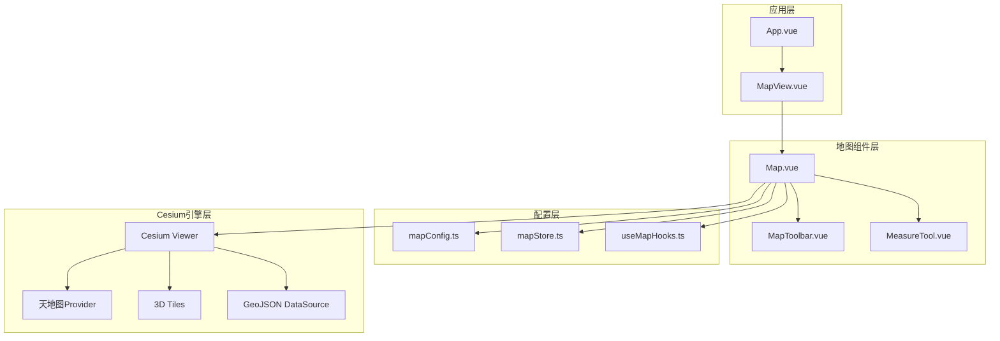

**图表来源**
- [Map.vue](file://src/mapComponents/Map.vue#L1-L50)
- [main.ts](file://src/main.ts#L1-L30)

**章节来源**
- [Map.vue](file://src/mapComponents/Map.vue#L1-L432)
- [main.ts](file://src/main.ts#L1-L30)

## Cesium Viewer 初始化

### 基础配置

Cesium Viewer 的初始化通过 Vue-Cesium 插件完成，配置包含以下核心参数：

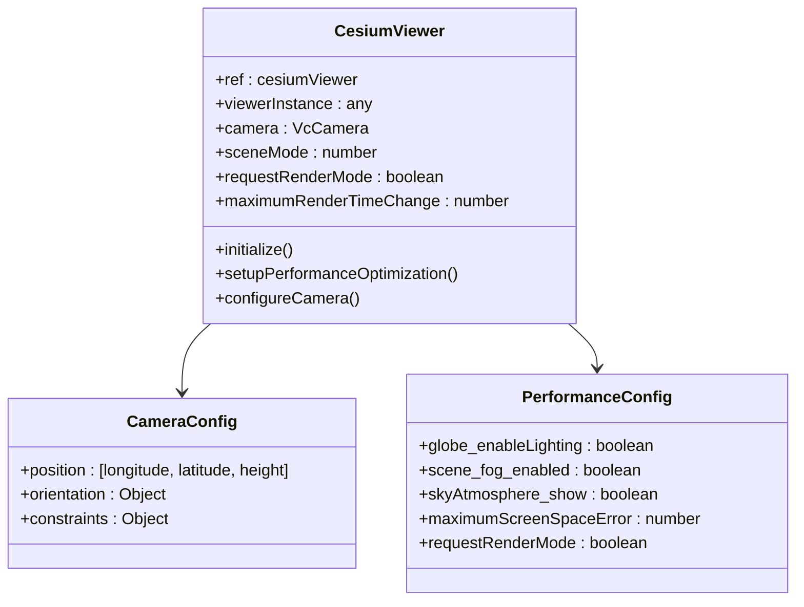

**图表来源**
- [Map.vue](file://src/mapComponents/Map.vue#L114-L118)
- [Map.vue](file://src/mapComponents/Map.vue#L258-L277)

### 地图容器初始化

地图容器采用响应式设计，支持动态尺寸调整：

| 属性 | 值 | 说明 |
|------|-----|------|
| width | 100% | 容器宽度占满父元素 |
| height | 100% | 容器高度占满父元素 |
| position | relative | 相对定位基点 |
| transform-style | preserve-3d | 保持3D变换上下文 |
| perspective | none | 禁用透视效果 |

### Cesium 配置项注入

通过 VueCesium 插件注入 Cesium 配置：

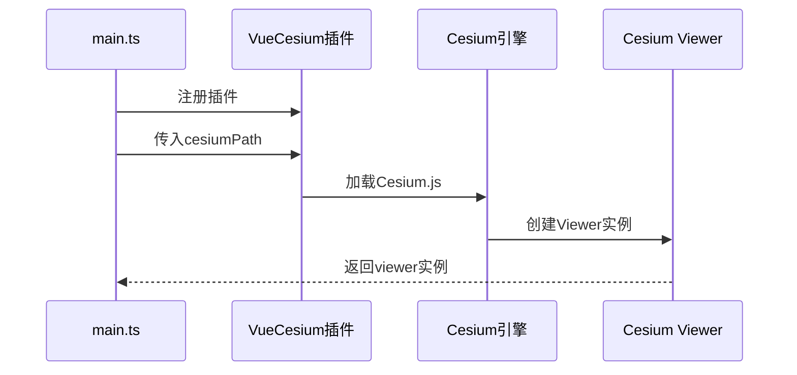

**图表来源**
- [main.ts](file://src/main.ts#L25-L27)

**章节来源**
- [Map.vue](file://src/mapComponents/Map.vue#L1-L50)
- [main.ts](file://src/main.ts#L1-L30)

## 地图配置系统

### 核心配置参数

mapConfig.ts 定义了地图系统的核心配置：

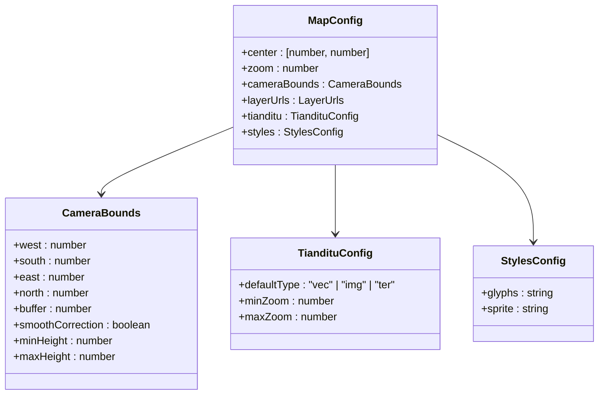

**图表来源**
- [mapConfig.ts](file://src/config/mapConfig.ts#L9-L55)

### 地图中心点配置

地图默认中心点设置为阳新县坐标：

| 参数 | 值 | 说明 |
|------|-----|------|
| 经度 | 115.186322 | 阳新县地理中心经度 |
| 纬度 | 29.864861 | 阳新县地理中心纬度 |
| 默认缩放级别 | 11 | 初始视野级别 |

### 相机边界限制配置

相机边界限制提供了精确的地理范围控制：

| 边界参数 | 数值 | 单位 | 用途 |
|----------|------|------|------|
| 西边界 | 114.8 | 经度 | 最小经度范围 |
| 南边界 | 29.4 | 经度 | 最小纬度范围 |
| 东边界 | 115.6 | 经度 | 最大经度范围 |
| 北边界 | 30.2 | 经度 | 最大纬度范围 |
| 边界缓冲 | 0.1 | 度 | 防止越界 |
| 最小高度 | 10000 | 米 | 最大放大级别 |
| 最大高度 | 150000 | 米 | 最小放大级别 |

**章节来源**
- [mapConfig.ts](file://src/config/mapConfig.ts#L1-L55)

## 天地图底图集成

### 天地图配置项

天地图集成支持三种底图模式：

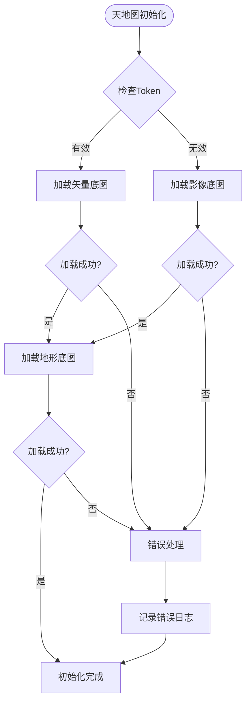

**图表来源**
- [Map.vue](file://src/mapComponents/Map.vue#L182-L190)
- [Map.vue](file://src/mapComponents/Map.vue#L296-L308)

### 底图模式配置

| 底图类型 | 样式标识 | 特点 | 适用场景 |
|----------|----------|------|----------|
| 矢量底图 | vec_c | 矢量渲染，可编辑 | 数据展示、规划 |
| 影像底图 | img_c | 高清卫星影像 | 地形分析、实景对比 |
| 地形底图 | ter_c | 三维地形效果 | 三维分析、景观设计 |

### 天地图Token配置

天地图Token通过环境变量注入：

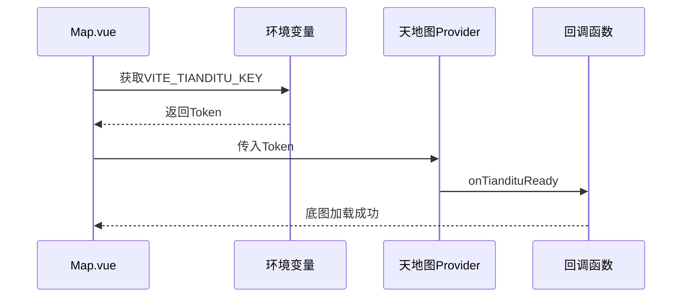

**图表来源**
- [Map.vue](file://src/mapComponents/Map.vue#L102-L104)
- [Map.vue](file://src/mapComponents/Map.vue#L296-L308)

**章节来源**
- [Map.vue](file://src/mapComponents/Map.vue#L6-L13)
- [mapConfig.ts](file://src/config/mapConfig.ts#L37-L45)

## 相机边界限制

### 边界限制机制

相机边界限制通过 useMapHooks 提供的两个主要函数实现：

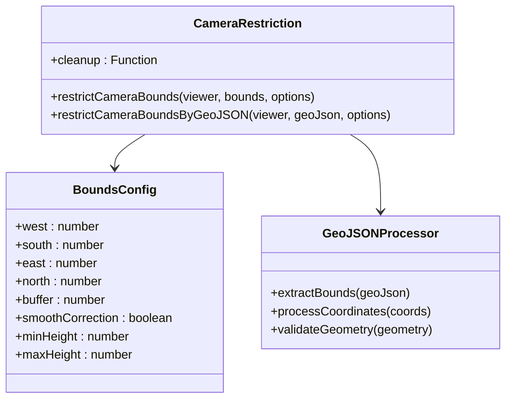

**图表来源**
- [useMapHooks.ts](file://src/hook/useMapHooks.ts#L206-L545)

### GeoJSON边界处理

系统支持多种GeoJSON格式的边界处理：

| GeoJSON类型 | 支持情况 | 处理方式 |
|-------------|----------|----------|
| Feature | ✅ | 直接提取geometry |
| FeatureCollection | ✅ | 遍历所有features |
| Polygon | ✅ | 直接处理几何体 |
| MultiPolygon | ✅ | 递归处理每个子多边形 |

### 平滑修正机制

相机位置修正支持两种模式：

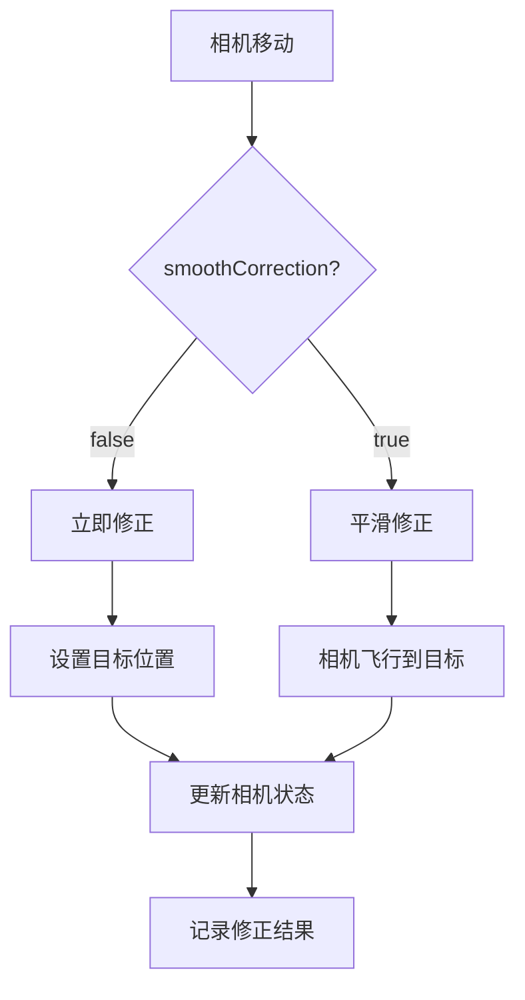

**图表来源**
- [useMapHooks.ts](file://src/hook/useMapHooks.ts#L364-L414)

**章节来源**
- [useMapHooks.ts](file://src/hook/useMapHooks.ts#L206-L545)
- [CAMERA_BOUNDS_RESTRICTION.md](file://CAMERA_BOUNDS_RESTRICTION.md#L32-L89)

## 性能优化策略

### Cesium性能优化

地图组件实现了多层次的性能优化：

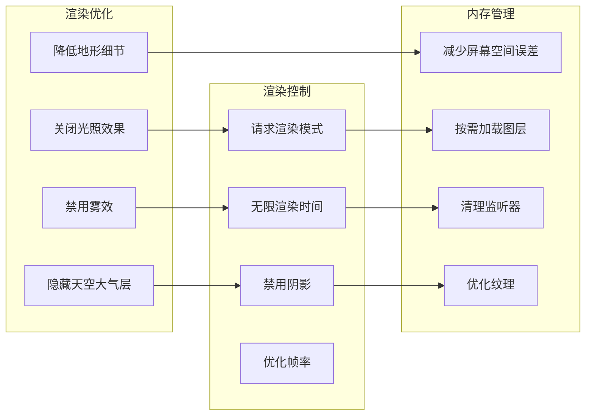

**图表来源**
- [Map.vue](file://src/mapComponents/Map.vue#L258-L277)

### 优化配置参数

| 优化项目 | 配置值 | 效果 |
|----------|--------|------|
| 全局光照 | false | 减少计算开销 |
| 雾效 | false | 提升渲染速度 |
| 天空大气层 | false | 降低渲染复杂度 |
| 地形屏幕空间误差 | 2 | 降低地形细节 |
| 请求渲染模式 | true | 按需渲染 |
| 最大渲染时间 | Infinity | 优化性能 |

### 3D Tiles优化

3D Tiles图层的性能优化配置：

| 参数 | 默认值 | 优化策略 |
|------|--------|----------|
| maximumScreenSpaceError | 16 | 平衡质量和性能 |
| maximumMemoryUsage | 512MB | 控制内存使用 |
| 可见性控制 | 动态 | 按需显示 |

**章节来源**
- [Map.vue](file://src/mapComponents/Map.vue#L258-L277)
- [useMapHooks.ts](file://src/hook/useMapHooks.ts#L102-L151)

## 生命周期管理

### 组件生命周期

地图组件遵循Vue组件生命周期的最佳实践：

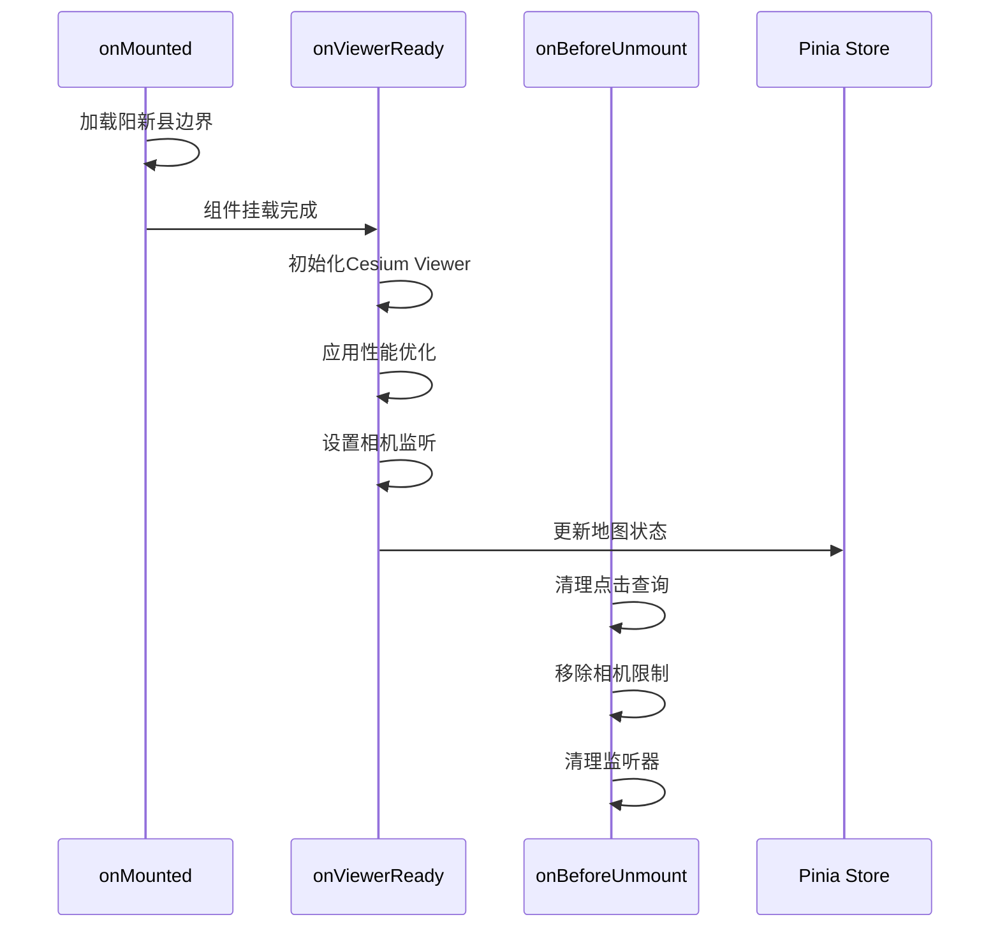

**图表来源**
- [Map.vue](file://src/mapComponents/Map.vue#L361-L387)

### 资源清理机制

系统实现了完善的资源清理机制：

| 清理项目 | 清理时机 | 清理内容 |
|----------|----------|----------|
| 点击查询清理 | 组件卸载 | 移除鼠标事件监听 |
| 相机边界清理 | 组件卸载 | 移除相机移动监听 |
| 监听器清理 | 组件卸载 | 清理所有事件监听器 |
| 图层清理 | 组件卸载 | 清理所有图层实例 |

### 状态管理集成

地图状态通过 Pinia Store 进行集中管理：

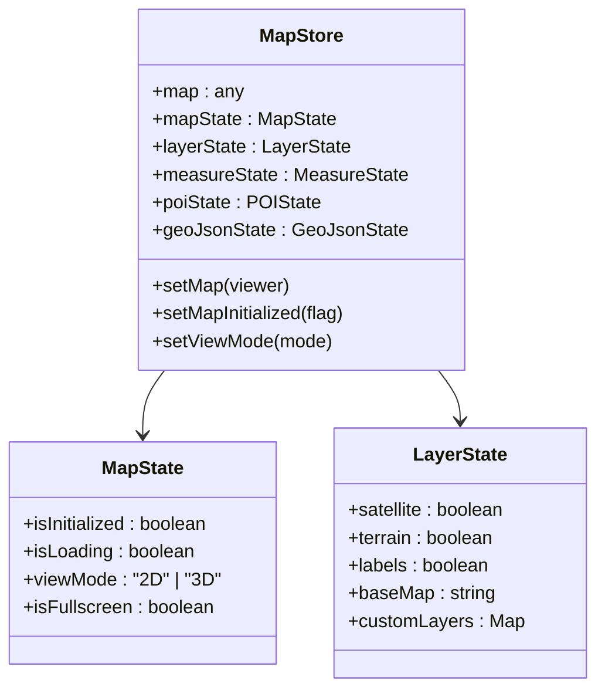

**图表来源**
- [mapStore.ts](file://src/stores/mapStore.ts#L18-L400)

**章节来源**
- [Map.vue](file://src/mapComponents/Map.vue#L361-L387)
- [mapStore.ts](file://src/stores/mapStore.ts#L18-L400)

## 异常处理机制

### 天地图加载异常

天地图加载提供了完善的错误处理机制：

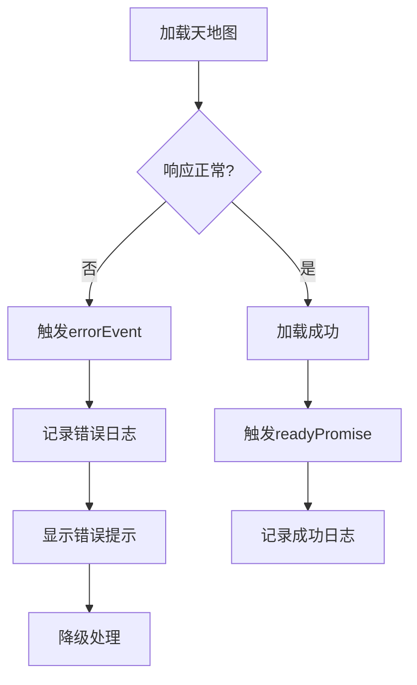

**图表来源**
- [Map.vue](file://src/mapComponents/Map.vue#L296-L308)

### 错误处理策略

| 错误类型 | 处理策略 | 用户体验 |
|----------|----------|----------|
| Token无效 | 显示提示信息 | 引导用户配置Token |
| 网络超时 | 重试机制 | 显示加载状态 |
| 数据格式错误 | 降级处理 | 使用默认底图 |
| 内存不足 | 限制图层数量 | 优先加载核心图层 |

### 性能监控

系统内置了性能监控机制：

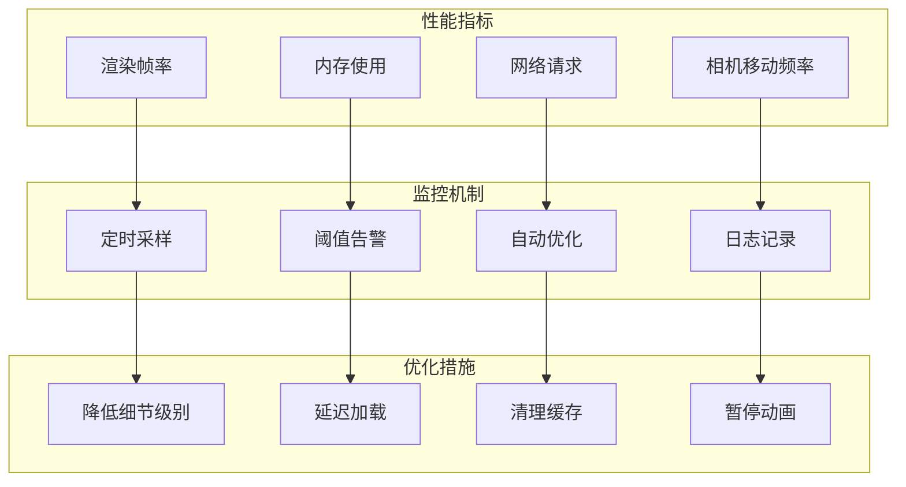

**章节来源**
- [Map.vue](file://src/mapComponents/Map.vue#L296-L308)
- [Map.vue](file://src/mapComponents/Map.vue#L258-L277)

## 最佳实践指南

### 开发建议

1. **配置管理**
   - 使用环境变量管理敏感配置
   - 提供配置验证机制
   - 支持配置热更新

2. **性能优化**
   - 启用必要的性能优化选项
   - 实现按需加载机制
   - 监控内存使用情况

3. **用户体验**
   - 提供加载状态指示
   - 实现优雅降级
   - 优化移动端体验

### 部署注意事项

1. **Cesium资源路径**
   - 确保Cesium资源文件完整部署
   - 配置正确的CDN地址
   - 处理跨域资源共享问题

2. **天地图Token**
   - 在生产环境中配置有效的Token
   - 实现Token轮换机制
   - 监控使用配额

3. **网络优化**
   - 启用gzip压缩
   - 使用CDN加速
   - 实现资源预加载

### 维护建议

1. **版本升级**
   - 定期更新Cesium版本
   - 测试兼容性
   - 更新依赖库

2. **监控告警**
   - 监控加载成功率
   - 跟踪性能指标
   - 建立故障响应机制

3. **文档维护**
   - 保持配置文档同步
   - 记录变更历史
   - 提供迁移指南

**章节来源**
- [Map.vue](file://src/mapComponents/Map.vue#L1-L432)
- [mapConfig.ts](file://src/config/mapConfig.ts#L1-L55)
- [useMapHooks.ts](file://src/hook/useMapHooks.ts#L1-L545)