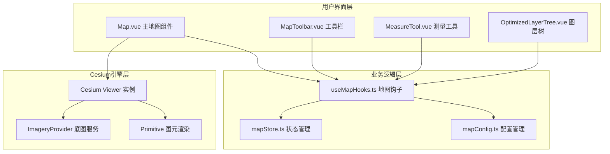
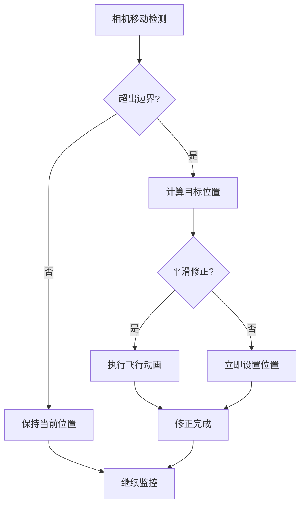
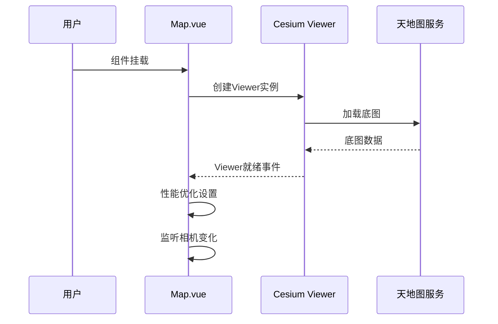
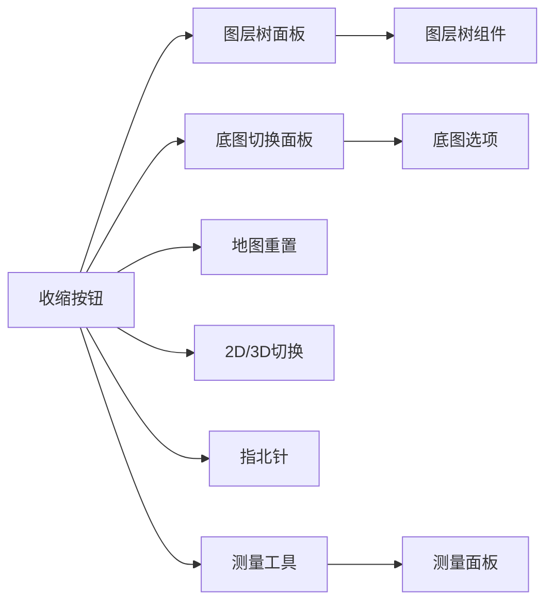
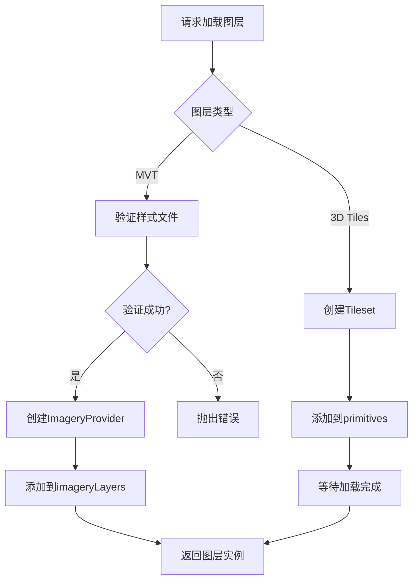
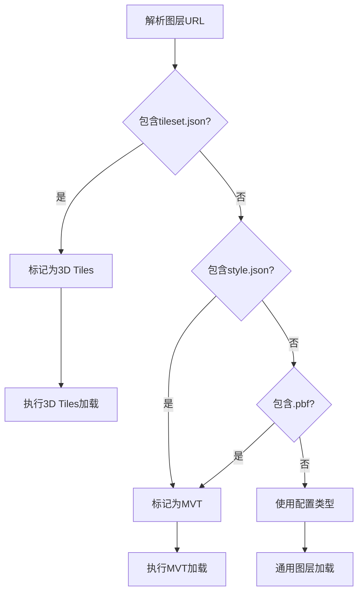
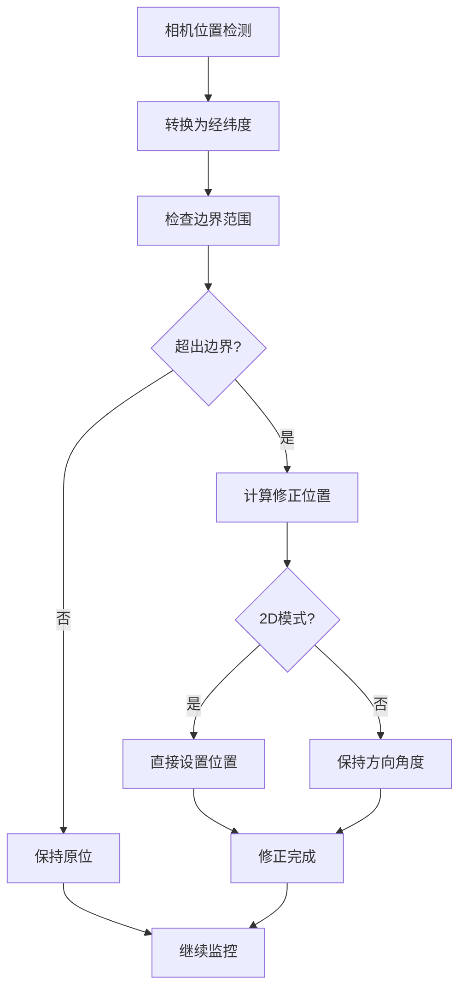
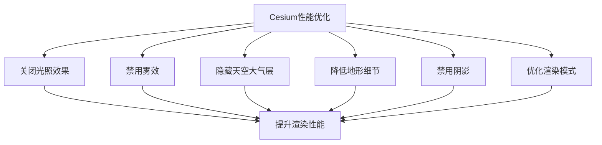
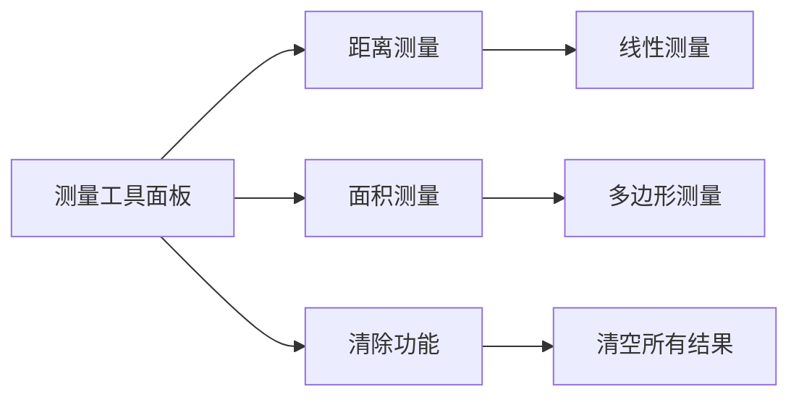

# 地图可视化功能

<cite>
**本文档中引用的文件**
- [mapConfig.ts](file://src/config/mapConfig.ts)
- [useMapHooks.ts](file://src/hook/useMapHooks.ts)
- [Map.vue](file://src/mapComponents/Map.vue)
- [MapToolbar.vue](file://src/mapComponents/MapToolbar.vue)
- [OptimizedLayerTree.vue](file://src/mapComponents/OptimizedLayerTree.vue)
- [MeasureTool.vue](file://src/mapComponents/MeasureTool.vue)
- [mapStore.ts](file://src/stores/mapStore.ts)
- [yangxin.json](file://public/yangxin.json)
- [variables.scss](file://src/assets/styles/variables.scss)
</cite>

## 目录
1. [简介](#简介)
2. [项目架构概览](#项目架构概览)
3. [地图配置系统](#地图配置系统)
4. [Cesium Widget集成](#cesium-widget集成)
5. [地图工具栏功能](#地图工具栏功能)
6. [图层管理系统](#图层管理系统)
7. [相机控制与交互](#相机控制与交互)
8. [性能优化策略](#性能优化策略)
9. [测量工具集成](#测量工具集成)
10. [故障排除指南](#故障排除指南)
11. [总结](#总结)

## 简介

本项目是一个基于Vue 3和Cesium的三维地图可视化系统，专为政府Dashboard设计。该系统提供了完整的地图功能，包括底图切换、图层管理、相机控制、测量工具等核心功能。系统采用模块化架构，支持高性能的三维地球渲染和丰富的交互体验。

## 项目架构概览

系统采用分层架构设计，主要包含以下核心模块：



**图表来源**
- [Map.vue](file://src/mapComponents/Map.vue#L1-L50)
- [useMapHooks.ts](file://src/hook/useMapHooks.ts#L33-L545)
- [mapStore.ts](file://src/stores/mapStore.ts#L18-L400)

**章节来源**
- [Map.vue](file://src/mapComponents/Map.vue#L1-L432)
- [useMapHooks.ts](file://src/hook/useMapHooks.ts#L1-L545)

## 地图配置系统

### mapConfig.ts 配置详解

地图配置系统位于 [`mapConfig.ts`](file://src/config/mapConfig.ts)，提供了完整的地图初始化参数配置：

#### 地图中心点配置
- **默认中心点**: 阳新县坐标 [115.186322, 29.864861]
- **初始缩放级别**: zoom: 11
- **相机初始位置**: 50公里高度

#### 相机边界限制配置
系统实现了严格的相机范围限制机制：



**图表来源**
- [useMapHooks.ts](file://src/hook/useMapHooks.ts#L228-L423)

#### 天地图配置
支持三种底图类型：
- **矢量地图 (vec)**: 基础地理信息
- **影像地图 (img)**: 卫星影像图
- **地形地图 (ter)**: 地形高程图

**章节来源**
- [mapConfig.ts](file://src/config/mapConfig.ts#L1-L55)

## Cesium Widget集成

### Map.vue 组件架构

主地图组件 [`Map.vue`](file://src/mapComponents/Map.vue) 是整个地图系统的入口点，集成了Cesium的所有核心功能：

#### Cesium Viewer 初始化


**图表来源**
- [Map.vue](file://src/mapComponents/Map.vue#L232-L256)

#### 样式定制选项
系统提供了完整的CSS样式定制能力：

| 样式类别 | 配置项 | 默认值 | 说明 |
|---------|--------|--------|------|
| 基础容器 | width/height | 100% | 地图容器尺寸 |
| Cesium Viewer | transform | scale(1) | 确保不被父级变换影响 |
| 指北针 | rotation | 动态计算 | 基于相机方位角 |
| 响应式布局 | viewport | 视口适配 | 移动设备优化 |

**章节来源**
- [Map.vue](file://src/mapComponents/Map.vue#L407-L432)

## 地图工具栏功能

### MapToolbar.vue 交互设计

工具栏组件提供了完整的地图操作界面：

#### 核心功能模块



**图表来源**
- [MapToolbar.vue](file://src/mapComponents/MapToolbar.vue#L1-L504)

#### 底图切换机制
支持三种底图类型的无缝切换：

| 底图类型 | 标识符 | 天地图样式 | 用途 |
|---------|--------|-----------|------|
| 矢量地图 | vec | vec_c | 基础地理信息展示 |
| 影像地图 | img | img_c | 卫星影像查看 |
| 地形地图 | ter | ter_c | 地形高程分析 |

**章节来源**
- [MapToolbar.vue](file://src/mapComponents/MapToolbar.vue#L112-L116)

## 图层管理系统

### useMapHooks.ts 地图操作辅助函数

地图钩子系统提供了完整的图层管理功能：

#### 图层类型定义
```typescript
interface MVTLayer {
  type: 'mvt';
  instance: ImageryLayer;
}

interface TilesetLayer {
  type: '3dtiles';
  instance: Cesium3DTileset;
}
```

#### 图层加载流程



**图表来源**
- [useMapHooks.ts](file://src/hook/useMapHooks.ts#L40-L151)

#### 图层状态管理
系统维护图层的完整生命周期状态：

| 状态属性 | 类型 | 说明 |
|---------|------|------|
| visible | boolean | 图层可见性 |
| opacity | number | 透明度 (0-1) |
| loading | boolean | 加载状态 |
| error | string \| null | 错误信息 |

**章节来源**
- [useMapHooks.ts](file://src/hook/useMapHooks.ts#L18-L29)

### OptimizedLayerTree.vue 图层树组件

图层树组件提供了可视化的图层管理界面：

#### 智能图层类型检测
系统能够智能识别图层类型，即使后端配置不准确也能正常工作：



**图表来源**
- [OptimizedLayerTree.vue](file://src/mapComponents/OptimizedLayerTree.vue#L326-L351)

**章节来源**
- [OptimizedLayerTree.vue](file://src/mapComponents/OptimizedLayerTree.vue#L1-L687)

## 相机控制与交互

### 相机范围限制系统

系统实现了精确的相机范围限制机制，确保用户不会移出指定区域：

#### 边界检测算法


**图表来源**
- [useMapHooks.ts](file://src/hook/useMapHooks.ts#L276-L416)

#### 相机控制功能

| 功能 | 方法 | 参数 | 说明 |
|------|------|------|------|
| 地图重置 | handleResetMap | 无 | 飞回到初始位置 |
| 2D/3D切换 | handleSceneModeChange | mode: 2\|3 | 切换视图模式 |
| 指北重置 | resetNorth | 无 | 重置相机朝向 |
| 相机限制 | restrictCameraBounds | bounds, options | 设置边界范围 |

**章节来源**
- [useMapHooks.ts](file://src/hook/useMapHooks.ts#L228-L423)

## 性能优化策略

### Cesium性能优化配置

系统在 [`Map.vue`](file://src/mapComponents/Map.vue) 中实现了全面的性能优化：

#### 渲染优化设置



**图表来源**
- [Map.vue](file://src/mapComponents/Map.vue#L259-L277)

#### 性能配置参数

| 优化项目 | 配置值 | 效果 |
|---------|--------|------|
| 光照效果 | enableLighting=false | 减少计算开销 |
| 雾效 | fog.enabled=false | 提升远距离渲染 |
| 天空大气层 | skyAtmosphere.show=false | 降低复杂度 |
| 地形细节 | maximumScreenSpaceError=2 | 平衡质量和性能 |
| 阴影 | shadows=false | 显著提升帧率 |

**章节来源**
- [Map.vue](file://src/mapComponents/Map.vue#L259-L277)

### 图层懒加载策略

系统实现了智能的图层懒加载机制：

#### 加载时机控制
- **按需加载**: 只有当图层被选中时才加载
- **预加载**: 在用户交互前预先加载常用图层
- **缓存管理**: 维护已加载图层的缓存池

#### 内存管理
- **自动清理**: 组件卸载时自动清理图层资源
- **内存监控**: 监控图层占用的内存使用情况
- **资源回收**: 及时释放不再使用的图层资源

## 测量工具集成

### MeasureTool.vue 测量功能

测量工具提供了直观的距离和面积测量功能：

#### 测量工具类型



**图表来源**
- [MeasureTool.vue](file://src/mapComponents/MeasureTool.vue#L1-L267)

#### 测量工具状态管理

| 状态属性 | 类型 | 说明 |
|---------|------|------|
| activeTool | 'distance'\|'area'\|null | 当前激活的测量工具 |
| visible | boolean | 面板可见性 |
| position | {x, y} | 面板位置坐标 |

**章节来源**
- [MeasureTool.vue](file://src/mapComponents/MeasureTool.vue#L44-L267)

## 故障排除指南

### 常见问题及解决方案

#### 天地图加载失败
**问题**: 天地图底图无法加载
**原因**: Token配置错误或网络连接问题
**解决方案**: 
1. 检查 `.env` 文件中的 `VITE_TIANDITU_KEY`
2. 确认Token的有效性和权限
3. 检查网络连接状态

#### 图层加载超时
**问题**: MVT或3D Tiles图层加载缓慢
**原因**: 网络延迟或服务器响应慢
**解决方案**:
1. 检查网络连接质量
2. 调整加载超时时间
3. 使用本地缓存替代在线资源

#### 相机控制异常
**问题**: 相机范围限制失效
**原因**: 监听器未正确绑定或Cesium实例未就绪
**解决方案**:
1. 确认Cesium Viewer已完全初始化
2. 检查相机监听器的绑定状态
3. 验证边界配置参数的正确性

**章节来源**
- [Map.vue](file://src/mapComponents/Map.vue#L297-L308)
- [useMapHooks.ts](file://src/hook/useMapHooks.ts#L228-L423)

## 总结

本地图可视化系统通过模块化的设计和完善的架构，提供了功能丰富、性能优异的三维地图解决方案。系统的主要优势包括：

### 技术特点
- **模块化架构**: 清晰的组件分离和职责划分
- **性能优化**: 全面的Cesium性能调优策略
- **交互友好**: 直观的工具栏和测量功能
- **扩展性强**: 支持多种图层类型和自定义配置

### 功能完整性
- **底图切换**: 支持矢量、影像、地形三种底图
- **图层管理**: 完整的图层加载、显示、隐藏控制
- **相机控制**: 精确的范围限制和交互功能
- **测量工具**: 实用的距离和面积测量功能

### 应用价值
该系统为政府Dashboard提供了强大的地理信息可视化能力，能够满足各种城市管理、规划和监测需求，具有很高的实用价值和推广意义。