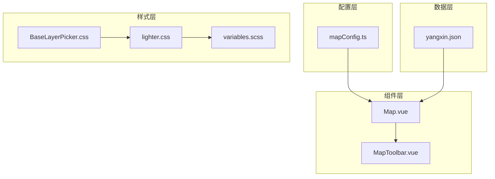
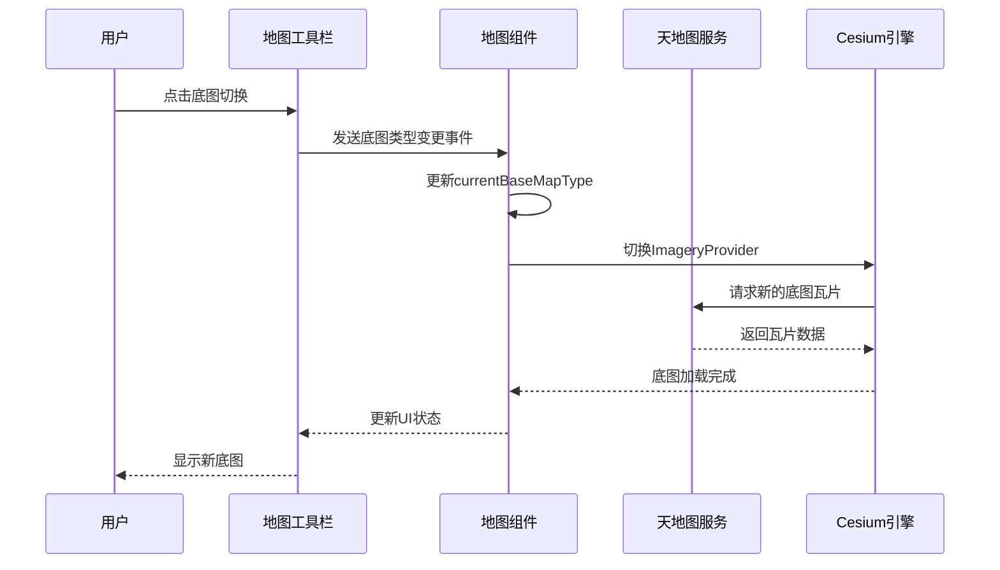
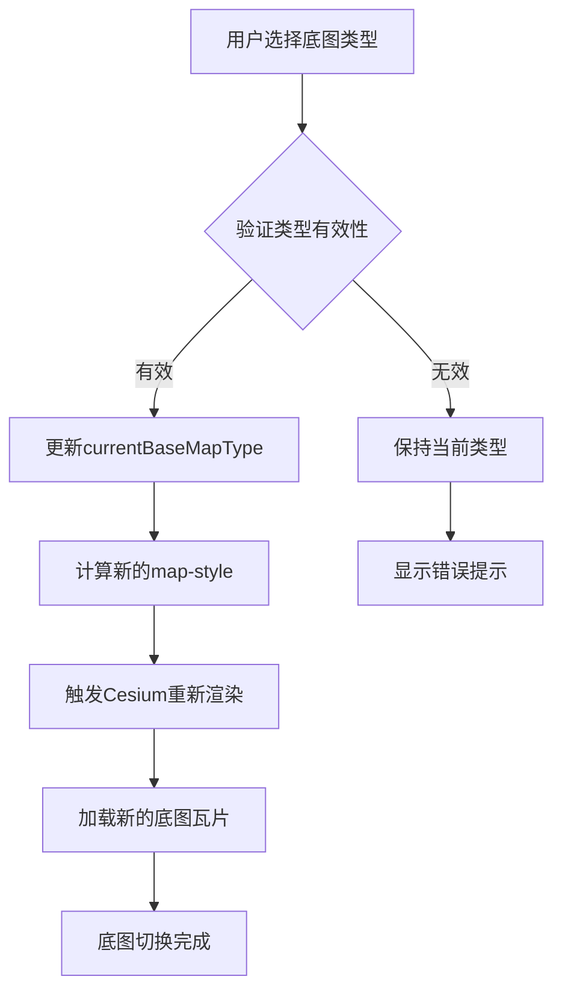
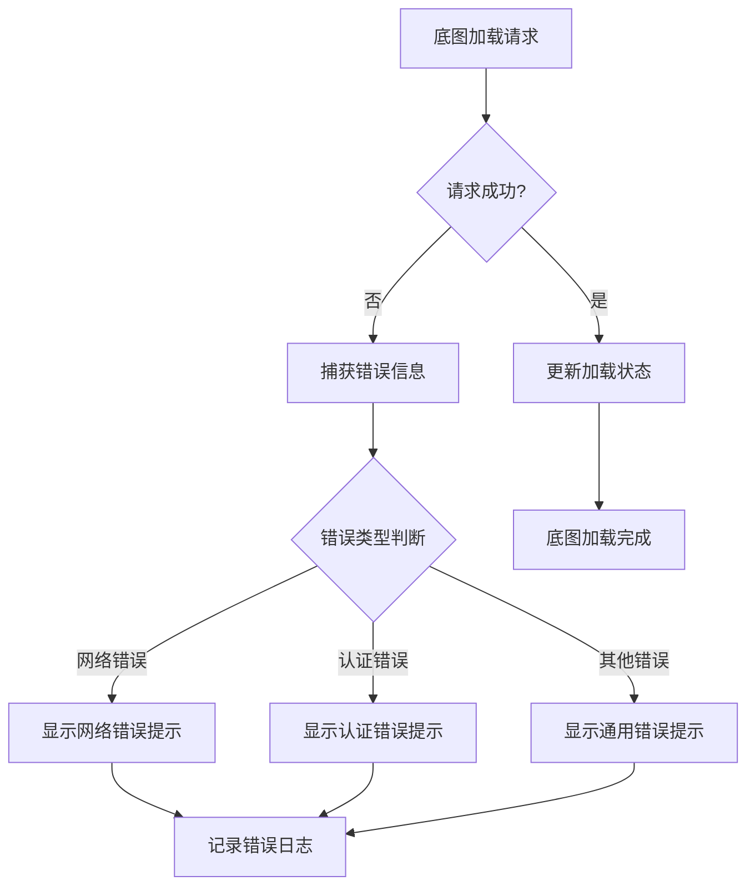
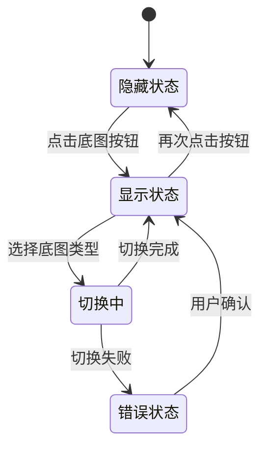
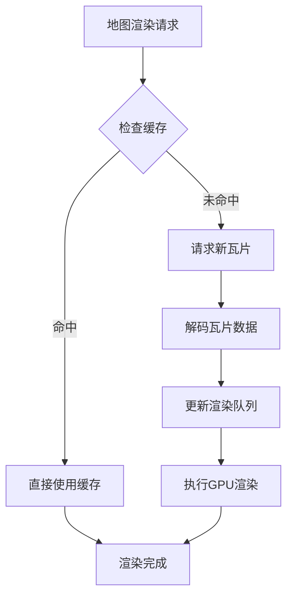
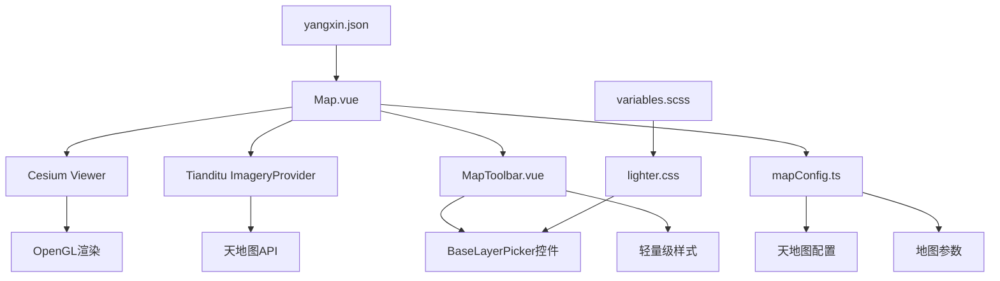

# 底图管理

<cite>
**本文档中引用的文件**
- [mapConfig.ts](file://src/config/mapConfig.ts)
- [Map.vue](file://src/mapComponents/Map.vue)
- [MapToolbar.vue](file://src/mapComponents/MapToolbar.vue)
- [yangxin.json](file://public/yangxin.json)
- [BaseLayerPicker.css](file://public/Cesium/Widgets/BaseLayerPicker/BaseLayerPicker.css)
- [lighter.css](file://public/Cesium/Widgets/BaseLayerPicker/lighter.css)
- [variables.scss](file://src/assets/styles/variables.scss)
</cite>

## 目录
1. [简介](#简介)
2. [项目结构](#项目结构)
3. [核心配置](#核心配置)
4. [架构概览](#架构概览)
5. [详细组件分析](#详细组件分析)
6. [依赖关系分析](#依赖关系分析)
7. [性能考虑](#性能考虑)
8. [故障排除指南](#故障排除指南)
9. [结论](#结论)

## 简介

底图管理功能是政府dashboard系统中的核心地理信息系统组件，负责提供多种底图类型（影像图、矢量图、地形图）的动态切换能力。该功能基于天地图服务，通过Cesium引擎实现高性能的地图渲染，并提供了完整的用户交互界面和样式定制方案。

## 项目结构

底图管理功能主要分布在以下关键文件中：

**图表来源**
- [mapConfig.ts](file://src/config/mapConfig.ts#L1-L55)
- [Map.vue](file://src/mapComponents/Map.vue#L1-L432)
- [MapToolbar.vue](file://src/mapComponents/MapToolbar.vue#L1-L504)

**章节来源**
- [mapConfig.ts](file://src/config/mapConfig.ts#L1-L55)
- [Map.vue](file://src/mapComponents/Map.vue#L1-L432)

## 核心配置

### 天地图配置

系统通过mapConfig.ts中的tianditu配置项定义默认底图类型和缩放级别限制：

| 配置项 | 类型 | 默认值 | 描述 |
|--------|------|--------|------|
| defaultType | "vec" \| "img" \| "ter" | "vec" | 默认底图类型：矢量图、影像图、地形图 |
| minZoom | number | 3 | 最小缩放级别 |
| maxZoom | number | 15 | 最大缩放级别 |

### 地图中心点配置

| 参数 | 值 | 描述 |
|------|-----|------|
| center | [115.186322, 29.864861] | 阳新县地图中心坐标 |
| zoom | 11 | 默认缩放级别 |
| cameraBounds.west | 114.8 | 西边界（最小经度） |
| cameraBounds.south | 29.4 | 南边界（最小纬度） |
| cameraBounds.east | 115.6 | 东边界（最大经度） |
| cameraBounds.north | 30.2 | 北边界（最大纬度） |

**章节来源**
- [mapConfig.ts](file://src/config/mapConfig.ts#L37-L55)

## 架构概览

底图管理系统采用分层架构设计，实现了配置、组件、数据和服务的分离：

**图表来源**
- [MapToolbar.vue](file://src/mapComponents/MapToolbar.vue#L288-L292)
- [Map.vue](file://src/mapComponents/Map.vue#L330-L333)

## 详细组件分析

### Map.vue - 地图主组件

Map.vue是底图管理的核心组件，负责Cesium Viewer的初始化和底图切换逻辑：

#### 底图类型管理

系统支持三种底图类型，通过currentBaseMapType响应式变量进行管理：

**图表来源**
- [Map.vue](file://src/mapComponents/Map.vue#L182-L190)
- [Map.vue](file://src/mapComponents/Map.vue#L330-L333)

#### 天地图ImageryProvider配置

底图切换通过Cesium的ImageryProvider实现，支持以下样式映射：

| 底图类型 | 天地图样式 | URL模板 |
|----------|------------|---------|
| 矢量图 | vec_c | 天地图矢量+中文标注 |
| 影像图 | img_c | 天地图影像+中文标注 |
| 地形图 | ter_c | 天地图地形+中文标注 |

#### 错误处理机制

系统实现了完善的错误处理机制：

**图表来源**
- [Map.vue](file://src/mapComponents/Map.vue#L298-L307)

**章节来源**
- [Map.vue](file://src/mapComponents/Map.vue#L1-L432)

### MapToolbar.vue - 地图工具栏

MapToolbar.vue提供用户友好的底图切换界面，包含以下功能：

#### 底图切换面板

工具栏提供三个底图选项：

| 图标 | 底图类型 | 标签 | 功能描述 |
|------|----------|------|----------|
| 🛰️ | img | 影像地图 | 提供卫星影像底图 |
| 🗺️ | vec | 矢量地图 | 提供矢量矢量底图 |
| 🏔️ | ter | 地形地图 | 提供地形高程底图 |

#### 用户交互流程

**图表来源**
- [MapToolbar.vue](file://src/mapComponents/MapToolbar.vue#L28-L44)

**章节来源**
- [MapToolbar.vue](file://src/mapComponents/MapToolbar.vue#L1-L504)

### BaseLayerPicker控件集成

系统集成了Cesium的BaseLayerPicker控件，提供了原生的底图切换功能：

#### 控件样式定制

通过lighter.css文件实现样式定制：

| 样式类 | 效果 | 自定义属性 |
|--------|------|------------|
| .cesium-lighter | 主题样式 | 轻量级配色方案 |
| .cesium-baseLayerPicker-itemIcon | 图标边框 | 蓝色边框效果 |
| .cesium-baseLayerPicker-selectedItem | 选中状态 | 双重边框突出显示 |

#### 控件行为配置

**图表来源**
- [BaseLayerPicker.css](file://public/Cesium/Widgets/BaseLayerPicker/BaseLayerPicker.css#L1-L2)
- [lighter.css](file://public/Cesium/Widgets/BaseLayerPicker/lighter.css#L1-L1)

**章节来源**
- [BaseLayerPicker.css](file://public/Cesium/Widgets/BaseLayerPicker/BaseLayerPicker.css#L1-L2)
- [lighter.css](file://public/Cesium/Widgets/BaseLayerPicker/lighter.css#L1-L1)

### 性能优化策略

#### 缓存策略

系统实现了多层次的缓存机制：

1. **浏览器缓存**: 利用CDN缓存天地图瓦片
2. **内存缓存**: Cesium自动管理瓦片内存缓存
3. **预加载策略**: 在用户操作前预加载相邻层级的瓦片

#### 渲染优化

**图表来源**
- [Map.vue](file://src/mapComponents/Map.vue#L260-L276)

**章节来源**
- [Map.vue](file://src/mapComponents/Map.vue#L260-L276)

## 依赖关系分析

底图管理系统的依赖关系如下：

**图表来源**
- [Map.vue](file://src/mapComponents/Map.vue#L1-L432)
- [MapToolbar.vue](file://src/mapComponents/MapToolbar.vue#L1-L504)
- [mapConfig.ts](file://src/config/mapConfig.ts#L1-L55)

**章节来源**
- [Map.vue](file://src/mapComponents/Map.vue#L1-L432)
- [MapToolbar.vue](file://src/mapComponents/MapToolbar.vue#L1-L504)
- [mapConfig.ts](file://src/config/mapConfig.ts#L1-L55)

## 性能考虑

### 渲染性能优化

系统采用了多项性能优化措施：

1. **请求渲染模式**: 设置`requestRenderMode=true`减少CPU占用
2. **最大渲染时间**: 配置`maximumRenderTimeChange=Infinity`避免频繁重绘
3. **场景模式优化**: 根据需求切换2D/3D模式
4. **阴影禁用**: 通过`shadows=false`提升渲染性能

### 内存管理

- **瓦片缓存限制**: Cesium自动管理瓦片内存使用
- **垃圾回收**: 定期清理未使用的资源
- **异步加载**: 避免阻塞主线程

### 网络优化

- **CDN加速**: 使用天地图CDN服务
- **压缩传输**: 支持瓦片数据压缩
- **预加载机制**: 提前加载相邻层级瓦片

## 故障排除指南

### 常见问题及解决方案

#### 天地图加载失败

**症状**: 底图无法正常显示，控制台出现错误信息

**可能原因**:
1. 天地图Token配置错误
2. 网络连接问题
3. IP地址未在天地图后台备案

**解决方案**:
1. 检查环境变量VITE_TIANDITU_KEY配置
2. 验证网络连接状态
3. 在天地图开发者平台添加IP白名单

#### 底图切换卡顿

**症状**: 底图切换时出现明显延迟

**优化建议**:
1. 检查网络带宽和延迟
2. 调整Cesium渲染参数
3. 优化地图缩放级别范围

#### 移动设备适配问题

**症状**: 移动设备上底图显示异常

**解决方案**:
1. 检查viewport meta标签配置
2. 调整Cesium的响应式参数
3. 优化触摸事件处理

**章节来源**
- [Map.vue](file://src/mapComponents/Map.vue#L298-L307)

## 结论

底图管理功能通过精心设计的架构和优化策略，实现了高性能、易用性的地图底图切换能力。系统支持多种底图类型，提供了完整的用户交互界面，并通过多层次的性能优化确保流畅的用户体验。

### 主要特性总结

1. **多底图支持**: 影像图、矢量图、地形图三类底图无缝切换
2. **用户友好**: 直观的工具栏界面和流畅的切换体验
3. **性能优化**: 多层次缓存和渲染优化策略
4. **错误处理**: 完善的错误检测和用户反馈机制
5. **样式定制**: 支持主题切换和自定义样式

### 技术亮点

- 基于Vue 3的响应式设计
- Cesium引擎的高性能渲染
- 天地图服务的稳定接入
- 模块化的组件架构
- 完善的TypeScript类型定义

该底图管理系统为政府dashboard提供了坚实的基础地理信息服务，能够满足复杂地理信息展示和分析的需求。