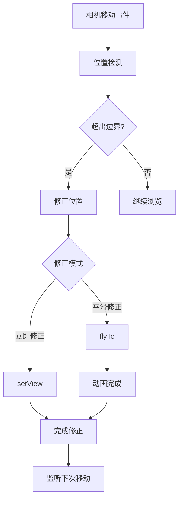
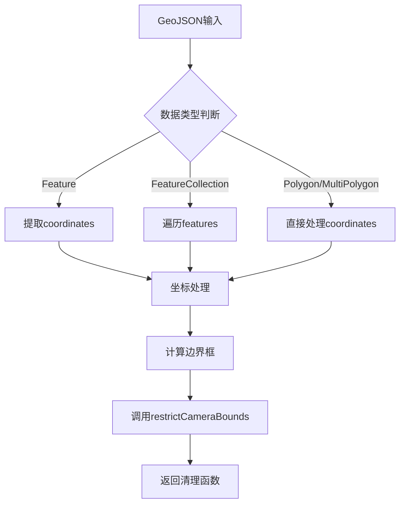
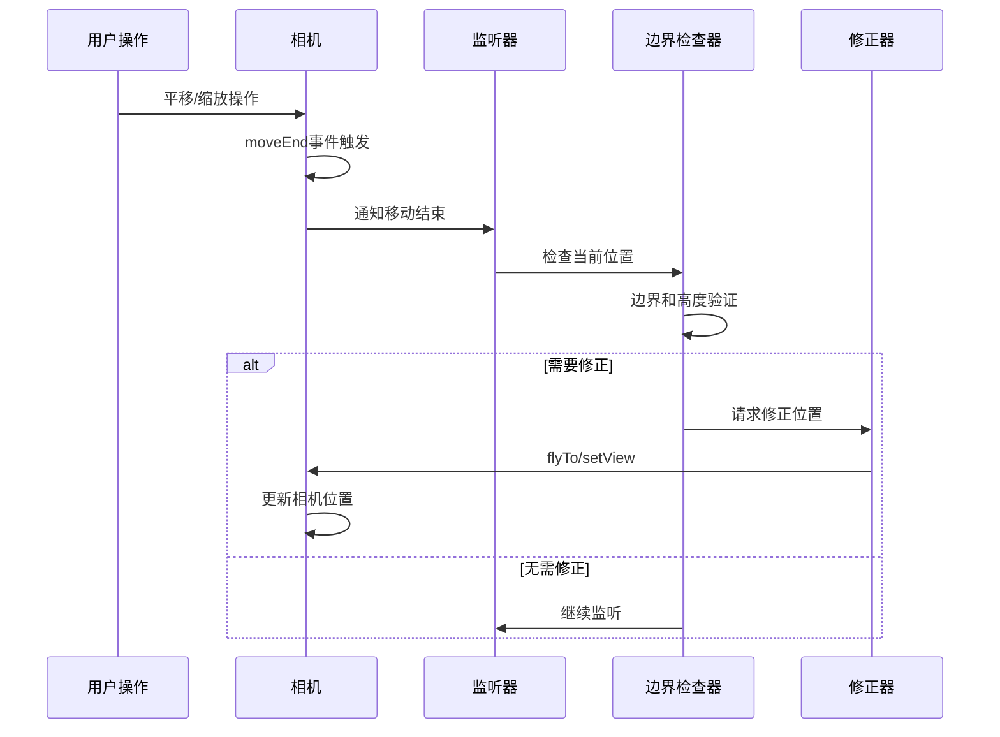
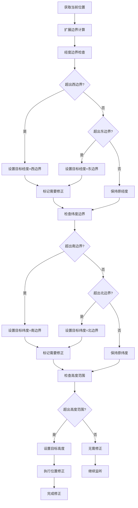

# 相机控制

<cite>
**本文档中引用的文件**
- [useMapHooks.ts](file://src/hook/useMapHooks.ts)
- [mapConfig.ts](file://src/config/mapConfig.ts)
- [Map.vue](file://src/mapComponents/Map.vue)
- [CAMERA_BOUNDS_RESTRICTION.md](file://CAMERA_BOUNDS_RESTRICTION.md)
</cite>

## 目录
1. [简介](#简介)
2. [核心功能概述](#核心功能概述)
3. [相机范围限制机制](#相机范围限制机制)
4. [配置参数详解](#配置参数详解)
5. [使用方式](#使用方式)
6. [工作原理](#工作原理)
7. [性能考虑](#性能考虑)
8. [常见问题解决方案](#常见问题解决方案)
9. [最佳实践](#最佳实践)
10. [总结](#总结)

## 简介

本系统实现了基于Cesium的相机范围限制功能，类似于OpenLayers的`extent`功能，能够有效限制用户在指定地理边界和高度范围内的地图浏览行为。该功能通过监听相机移动事件，在相机超出预设边界时自动进行位置修正，确保用户始终在可控的范围内进行地图操作。

## 核心功能概述

相机控制功能包含以下核心特性：

- **平移范围限制**：限制相机在指定的经纬度边界内移动
- **缩放级别控制**：限制相机的高度范围（最小/最大放大级别）
- **2D/3D模式兼容**：自动适配Cesium的2D和3D场景模式
- **防死循环机制**：智能标志位避免修正过程中的无限循环
- **平滑/立即修正模式**：可选的平滑飞行或立即位置修正
- **GeoJSON边界支持**：自动从GeoJSON数据计算边界范围



**图表来源**
- [useMapHooks.ts](file://src/hook/useMapHooks.ts#L275-L418)

## 相机范围限制机制

### restrictCameraBounds函数

`restrictCameraBounds`函数是基于矩形边界的相机范围限制核心实现，它接受地理边界和配置选项作为参数。

#### 函数签名
```typescript
function restrictCameraBounds(
  viewer: any,
  bounds: { west: number; south: number; east: number; north: number },
  options: {
    buffer?: number;
    smoothCorrection?: boolean;
    minHeight?: number;
    maxHeight?: number;
  } = {}
): () => void
```

#### 主要参数说明

| 参数 | 类型 | 说明 |
|------|------|------|
| `bounds.west` | number | 西边界（最小经度，度数） |
| `bounds.south` | number | 南边界（最小纬度，度数） |
| `bounds.east` | number | 东边界（最大经度，度数） |
| `bounds.north` | number | 北边界（最大纬度，度数） |
| `options.buffer` | number | 边界缓冲距离（度），默认0.05 |
| `options.smoothCorrection` | boolean | 是否使用平滑修正，默认false |
| `options.minHeight` | number | 最小高度（米），默认5000 |
| `options.maxHeight` | number | 最大高度（米），默认300000 |

### restrictCameraBoundsByGeoJSON函数

该函数基于GeoJSON数据自动计算边界范围，支持多种GeoJSON格式。

#### 支持的GeoJSON格式
- `Feature` 对象（单个要素）
- `FeatureCollection` 对象（要素集合）
- `Polygon` / `MultiPolygon` 对象（直接几何对象）



**图表来源**
- [useMapHooks.ts](file://src/hook/useMapHooks.ts#L441-L525)

**章节来源**
- [useMapHooks.ts](file://src/hook/useMapHooks.ts#L206-L545)

## 配置参数详解

### mapConfig.ts中的cameraBounds配置

系统提供了统一的配置文件来管理相机范围限制参数：

```typescript
cameraBounds: {
  west: 114.8,           // 西边界（最小经度）
  south: 29.4,           // 南边界（最小纬度）
  east: 115.6,           // 东边界（最大经度）
  north: 30.2,           // 北边界（最大纬度）
  buffer: 0.1,           // 边界缓冲距离（度）
  smoothCorrection: false,  // 立即修正模式
  minHeight: 10000,      // 最小高度10km（最大放大）
  maxHeight: 150000      // 最大高度150km（最小放大）
}
```

### 参数调优建议

#### 阳新县范围配置（约0.8°×0.8°区域）
```typescript
cameraBounds: {
  west: 114.8,
  south: 29.4,
  east: 115.6,
  north: 30.2,
  buffer: 0.1,           // 10%缓冲区
  smoothCorrection: false,  // 推荐立即修正
  minHeight: 10000,      // 10km，看清街道
  maxHeight: 150000      // 150km，看到整个县域
}
```

#### 更大区域配置（省级范围）
```typescript
cameraBounds: {
  buffer: 0.2,           // 更大缓冲区
  minHeight: 50000,      // 50km
  maxHeight: 500000      // 500km
}
```

#### 更小区域配置（园区/社区）
```typescript
cameraBounds: {
  buffer: 0.01,          // 1%缓冲区
  minHeight: 500,        // 500m，看清建筑
  maxHeight: 20000       // 20km
}
```

**章节来源**
- [mapConfig.ts](file://src/config/mapConfig.ts#L16-L26)

## 使用方式

### 方式1：使用矩形边界（配置文件）

在`Map.vue`中启用相机范围限制：

```typescript
// 在onViewerReady回调中启用
async function onViewerReady({ Cesium, viewer }: any) {
  // ... 其他初始化代码
  
  // 从配置文件读取相机边界配置
  const { west, south, east, north, buffer, smoothCorrection, minHeight, maxHeight } = mapConfig.cameraBounds
  
  // 启用相机范围限制
  cameraBoundsCleanup = restrictCameraBounds(viewer, {
    west, south, east, north
  }, {
    buffer,
    smoothCorrection,
    minHeight,
    maxHeight
  })
}
```

### 方式2：使用GeoJSON边界

基于动态加载的GeoJSON数据限制相机范围：

```typescript
// 在onViewerReady中启用GeoJSON边界限制
async function onViewerReady({ Cesium, viewer }: any) {
  // ... 其他初始化代码
  
  // 等待GeoJSON数据加载完成
  if (yangxinGeoJSON.value) {
    const { buffer, smoothCorrection, minHeight, maxHeight } = mapConfig.cameraBounds
    
    // 基于GeoJSON边界启用相机限制
    cameraBoundsCleanup = restrictCameraBoundsByGeoJSON(viewer, yangxinGeoJSON.value, {
      buffer,
      smoothCorrection,
      minHeight,
      maxHeight
    })
  }
}
```

### 清理函数调用

在组件卸载时必须清理相机范围限制监听器：

```typescript
onBeforeUnmount(() => {
  // 清理点击查询事件
  if (clickQueryCleanup) {
    clickQueryCleanup()
    clickQueryCleanup = null
  }
  
  // 清理相机范围限制
  if (cameraBoundsCleanup) {
    cameraBoundsCleanup()
    cameraBoundsCleanup = null
  }
})
```

**章节来源**
- [Map.vue](file://src/mapComponents/Map.vue#L232-L255)
- [Map.vue](file://src/mapComponents/Map.vue#L372-L386)

## 工作原理

### 监听机制

相机范围限制通过监听Cesium的`camera.moveEnd`事件实现：



**图表来源**
- [useMapHooks.ts](file://src/hook/useMapHooks.ts#L275-L418)

### 死循环防护机制

为了避免修正过程中再次触发修正导致的无限循环，系统使用`isCorrecting`标志位：

```typescript
// 标记是否正在修正位置（避免死循环）
let isCorrecting = false;

// 监听相机移动结束事件
const removeListener = viewer.camera.moveEnd.addEventListener(() => {
  // 如果正在修正，跳过本次检查
  if (isCorrecting) {
    isCorrecting = false;
    return;
  }
  
  // 执行边界检查和修正逻辑
  // ...
  
  // 开始修正时设置标志位
  isCorrecting = true;
  
  // 修正完成后重置标志位
  camera.flyTo({
    // ... 修正参数
    complete: () => { isCorrecting = false; },
    cancel: () => { isCorrecting = false; }
  });
});
```

### 2D/3D模式适配

系统自动识别当前场景模式并采用相应的处理方式：

#### 2D模式处理
- 使用`camera.positionCartographic`获取相机位置
- 直接设置`camera.position`，不设置`orientation`
- 避免2D模式下的黑屏问题

#### 3D模式处理
- 使用`camera.pickEllipsoid()`获取屏幕中心点
- 保持原有的`heading`、`pitch`、`roll`方向
- 使用`camera.setView()`保持视角一致性

### 边界检查算法



**图表来源**
- [useMapHooks.ts](file://src/hook/useMapHooks.ts#L314-L346)

**章节来源**
- [useMapHooks.ts](file://src/hook/useMapHooks.ts#L275-L418)

## 性能考虑

### 监听器管理

相机范围限制会持续监听相机移动事件，因此需要妥善管理监听器的生命周期：

- **及时清理**：在组件卸载时调用清理函数移除监听器
- **内存泄漏预防**：避免监听器累积导致内存泄漏
- **条件启用**：根据实际需求选择是否启用范围限制

### 修正模式选择

#### 立即修正（推荐）
- **优点**：响应速度快，用户体验好
- **缺点**：可能显得突兀
- **适用场景**：大多数应用场景

#### 平滑修正
- **优点**：视觉效果更自然
- **缺点**：可能导致死循环风险
- **注意事项**：需要足够大的缓冲区（≥0.1度）

### 位置获取优化

系统针对不同场景模式采用最优的位置获取策略：

- **2D模式**：直接使用`camera.positionCartographic`
- **3D模式**：使用`camera.pickEllipsoid()`获取屏幕中心点

这种差异化处理确保了在各种场景模式下的准确性和性能。

## 常见问题解决方案

### 问题1：死循环问题

**现象**：相机修正后再次触发修正，导致无限循环

**原因**：`flyTo/setView`操作会触发`moveEnd`事件

**解决方案**：使用`isCorrecting`标志位跳过修正期间的检查

### 问题2：2D模式黑屏

**现象**：2D模式下相机修正后地图变黑

**原因**：2D模式下使用了3D的`orientation`参数

**解决方案**：2D模式只设置`position`，不设置`orientation`

### 问题3：高度失控

**现象**：相机放大过度或缩小过度

**原因**：未限制`height`参数

**解决方案**：添加`minHeight`/`maxHeight`检查和修正

### 问题4：位置偏移

**现象**：修正后位置出现偏差

**原因**：2D/3D模式下位置获取方式不同

**解决方案**：
- 2D模式：直接使用`camera.positionCartographic`
- 3D模式：使用`camera.pickEllipsoid()`获取屏幕中心

### 问题5：平滑修正导致的重复触发

**现象**：开启`smoothCorrection`后可能出现重复修正

**解决方案**：
- 设置合适的缓冲区大小（≥0.1度）
- 或者使用立即修正模式（推荐）

**章节来源**
- [CAMERA_BOUNDS_RESTRICTION.md](file://CAMERA_BOUNDS_RESTRICTION.md#L228-L250)

## 最佳实践

### 参数配置建议

1. **缓冲区设置**：推荐设置为区域大小的5-15%
   ```typescript
   // 阳新县范围（0.8°×0.8°）：缓冲区0.05-0.12度
   buffer: 0.1
   ```

2. **高度范围设置**：
   - `minHeight`：建议≥1000m，避免地形细节问题
   - `maxHeight`：经验公式：`maxHeight ≈ (边界长度/2) × 111000米`
   - 预留安全余量

3. **修正模式选择**：
   - 大多数场景推荐`smoothCorrection: false`
   - 需要平滑效果时确保缓冲区足够大

### 使用时机

1. **组件挂载时启用**：在`onViewerReady`回调中启用
2. **组件卸载时清理**：在`onBeforeUnmount`中清理监听器
3. **动态边界场景**：基于GeoJSON数据的动态边界限制

### 错误处理

```typescript
// 安全的相机范围限制启用
try {
  cameraBoundsCleanup = restrictCameraBounds(viewer, bounds, options)
} catch (error) {
  console.error('相机范围限制启用失败:', error)
  // 提供降级方案或错误提示
}
```

### 日志监控

系统提供了详细的日志输出，便于调试和监控：

```typescript
// 启用时的日志
console.log('✅ 相机平移范围限制已启用:', {
  bounds,
  buffer,
  smoothCorrection,
  heightRange: `${minHeight}m - ${maxHeight}m`,
  mode: viewer.scene.mode === Cesium.SceneMode.SCENE2D ? '2D' : '3D'
})

// 修正时的日志
console.log(`📍 相机修正: 位置: (${lon.toFixed(4)}, ${lat.toFixed(4)}) -> (${targetLon.toFixed(4)}, ${targetLat.toFixed(4)})`)
```

## 总结

本相机控制功能提供了完整而灵活的地理边界和高度范围限制解决方案。通过`restrictCameraBounds`和`restrictCameraBoundsByGeoJSON`两个核心函数，系统能够满足从简单矩形边界到复杂GeoJSON多边形的各种限制需求。

### 主要优势

1. **全面兼容性**：支持2D/3D场景模式，适应不同的使用场景
2. **智能防护**：内置死循环防护和模式适配机制
3. **灵活配置**：丰富的参数配置满足不同业务需求
4. **性能优化**：合理的监听器管理和位置获取策略
5. **易于集成**：清晰的API设计和完善的错误处理

### 应用价值

该功能特别适用于政府dashboard、城市规划、应急管理等需要精确地理范围控制的应用场景，能够有效提升用户体验和系统的稳定性。

通过合理配置参数和遵循最佳实践，开发者可以快速集成这一强大的相机控制功能，为用户提供专业级的地图浏览体验。