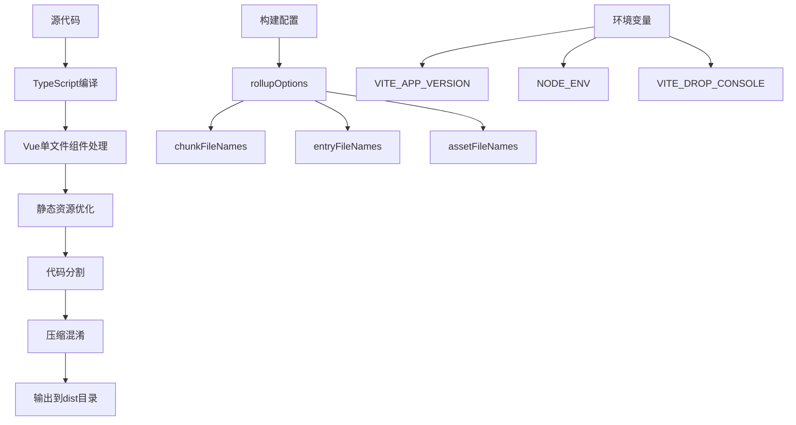
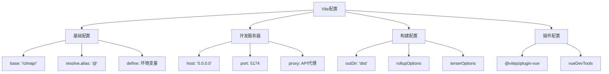
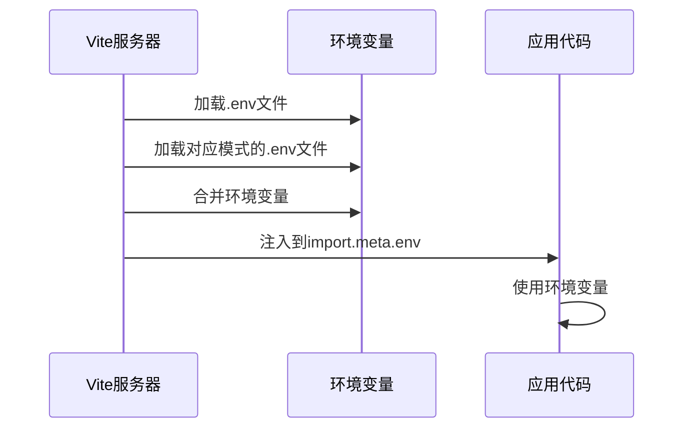
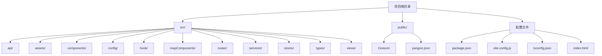

# 快速入门

<cite>
**本文档中引用的文件**
- [package.json](file://package.json)
- [vite.config.js](file://vite.config.js)
- [index.html](file://index.html)
- [src/main.ts](file://src/main.ts)
- [src/App.vue](file://src/App.vue)
- [src/router/index.ts](file://src/router/index.ts)
- [src/config/mapConfig.ts](file://src/config/mapConfig.ts)
- [tsconfig.json](file://tsconfig.json)
- [src/api/apiConfig.ts](file://src/api/apiConfig.ts)
- [src/stores/auth.ts](file://src/stores/auth.ts)
- [src/views/LoginView.vue](file://src/views/LoginView.vue)
- [src/views/WaterSupply/index.vue](file://src/views/WaterSupply/index.vue)
- [src/views/gasModule/index.vue](file://src/views/gasModule/index.vue)
</cite>

## 目录
1. [项目简介](#项目简介)
2. [系统要求](#系统要求)
3. [环境搭建](#环境搭建)
4. [项目初始化](#项目初始化)
5. [开发服务器启动](#开发服务器启动)
6. [生产构建流程](#生产构建流程)
7. [Vite配置详解](#vite配置详解)
8. [环境变量配置](#环境变量配置)
9. [项目结构概览](#项目结构概览)
10. [常见问题解决](#常见问题解决)
11. [部署指南](#部署指南)

## 项目简介

本项目是一个基于Vue 3和TypeScript的政府Dashboard管理系统，采用现代化的前端技术栈，集成了Cesium三维地图、Ant Design Vue组件库、Pinia状态管理和Vue Router路由系统。项目主要服务于政府机构的安全监测和预警平台，提供供水、燃气等专项业务的可视化管理功能。

### 核心特性
- **多业务模块支持**：涵盖供水、燃气等专项业务
- **三维地图集成**：基于Cesium实现丰富的地理信息系统功能
- **响应式设计**：适配各种屏幕尺寸的仪表板界面
- **模块化架构**：清晰的组件分离和状态管理
- **国际化支持**：内置中文语言包

## 系统要求

在开始之前，请确保您的开发环境满足以下要求：

### 必需软件
- **Node.js**: 版本 ^20.19.0 || >=22.12.0
- **包管理器**: pnpm (推荐) 或 npm
- **操作系统**: Windows 10+ / macOS 10.15+ / Linux Ubuntu 18.04+
- **现代浏览器**: Chrome 64+, Firefox 55+, Safari 12+, Edge 79+

### 推荐工具
- **IDE**: VS Code (推荐) 或 WebStorm
- **Git**: 版本控制工具
- **浏览器开发者工具**: 调试和性能分析

## 环境搭建

### 1. 安装Node.js

首先确保已安装Node.js。可以通过以下方式验证：

```bash
node --version
npm --version
```

如果未安装，可以从[Node.js官网](https://nodejs.org/)下载并安装LTS版本。

### 2. 安装pnpm包管理器

推荐使用pnpm作为包管理器，它比npm更高效且占用更少磁盘空间：

```bash
# 全局安装pnpm
npm install -g pnpm

# 验证安装
pnpm --version
```

### 3. 验证环境

执行以下命令验证环境配置：

```bash
# 检查Node.js版本
node --version

# 检查pnpm版本
pnpm --version

# 检查Git版本（如果需要）
git --version
```

## 项目初始化

### 1. 克隆项目

```bash
# 克隆项目仓库
git clone <repository-url>
cd government-dashboard

# 或者直接下载ZIP文件解压
```

### 2. 安装依赖

使用pnpm安装项目依赖：

```bash
# 安装所有依赖
pnpm install

# 如果遇到网络问题，可以使用淘宝镜像
pnpm install --registry=https://registry.npmmirror.com
```

**依赖安装过程说明**：
- **生产依赖**：包括Vue 3、Cesium、ECharts等核心库
- **开发依赖**：包括TypeScript、Vite、ESLint等开发工具
- **预期安装时间**：约2-5分钟（取决于网络速度）

### 3. 项目结构验证

安装完成后，验证项目结构：

```bash
# 查看项目根目录结构
ls -la

# 验证关键文件存在
ls -la package.json vite.config.js src/
```

**Section sources**
- [package.json](file://package.json#L1-L48)
- [vite.config.js](file://vite.config.js#L1-L81)

## 开发服务器启动

### 启动开发服务器

```bash
# 启动开发服务器
pnpm dev

# 或指定端口启动
pnpm dev --port 3000
```

### 开发服务器配置

开发服务器启动后，您将看到类似以下输出：

```
  VITE v7.0.6  ready in 1234 ms

  ➜  Local:   http://localhost:5174/
  ➜  Network: http://192.168.x.x:5174/
  ➜  press h to show help
```

### 访问应用

打开浏览器访问：
- **本地访问**: http://localhost:5174/
- **网络访问**: http://<您的IP>:5174/

### 开发服务器特性

- **热更新(HMR)**：代码修改自动刷新
- **TypeScript支持**：实时类型检查
- **Source Map**：调试时定位原始代码
- **反向代理**：自动转发API请求

**Section sources**
- [vite.config.js](file://vite.config.js#L28-L40)
- [src/main.ts](file://src/main.ts#L1-L30)

## 生产构建流程

### 构建命令

```bash
# 生产环境构建
pnpm build

# 预览构建结果
pnpm preview
```

### 构建配置详解

项目使用Vite进行构建，以下是关键配置：



**图表来源**
- [vite.config.js](file://vite.config.js#L42-L64)

### 构建产物分析

构建完成后，`dist`目录结构如下：

| 文件类型 | 输出位置 | 描述 |
|---------|---------|------|
| JavaScript | `dist/assets/js/` | 分块化的JS文件，带哈希值 |
| CSS | `dist/assets/css/` | 样式文件，带哈希值 |
| 静态资源 | `dist/assets/` | 图片、字体等资源 |
| HTML | `dist/` | 入口HTML文件 |
| Cesium | `dist/Cesium/` | 三维地图库文件 |

### 构建优化策略

1. **代码分割**：自动分割Vue生态和工具库
2. **资源压缩**：使用Terser进行JavaScript压缩
3. **文件命名**：添加哈希值防止缓存问题
4. **条件编译**：根据环境变量移除调试代码

**Section sources**
- [vite.config.js](file://vite.config.js#L42-L64)

## Vite配置详解

### 基础配置

Vite配置位于`vite.config.js`，采用函数式配置方式：



**图表来源**
- [vite.config.js](file://vite.config.js#L14-L80)

### 关键参数说明

#### 1. 基础路径配置
```javascript
// 设置静态资源基础路径
base: env.VITE_BASE_URL || "/clmap/"
```
- **作用**：指定应用部署的基础路径
- **默认值**：`/clmap/`
- **用途**：当应用部署在子路径时使用

#### 2. 别名配置
```javascript
resolve: {
  alias: {
    "@": fileURLToPath(new URL("./src", import.meta.url)),
  },
}
```
- **作用**：简化模块导入路径
- **示例**：`import { useStore } from '@/stores/auth'`

#### 3. 开发服务器配置
```javascript
server: {
  host: "0.0.0.0",
  port: 5174,
  open: false,
  cors: true,
  proxy: {
    [env.VITE_API_BASE_URL]: {
      target: env.VITE_API_URL,
      changeOrigin: true,
    }
  },
}
```
- **host**: 允许局域网访问
- **port**: 默认5174端口
- **proxy**: API代理配置

#### 4. 构建配置
```javascript
build: {
  target: "es2015",
  outDir: "dist",
  assetsDir: "assets",
  rollupOptions: {
    output: {
      chunkFileNames: "assets/js/[name]-[hash].js",
      entryFileNames: "assets/js/[name]-[hash].js",
      assetFileNames: "assets/[ext]/[name]-[hash].[ext]",
    }
  }
}
```

**Section sources**
- [vite.config.js](file://vite.config.js#L14-L80)

## 环境变量配置

### 环境变量列表

项目支持以下环境变量：

| 变量名 | 默认值 | 描述 | 示例 |
|-------|--------|------|------|
| `VITE_BASE_URL` | `/clmap/` | 应用基础路径 | `/dashboard/` |
| `VITE_API_URL` | - | 后端API服务器地址 | `http://localhost:8080` |
| `VITE_API_BASE_URL` | - | API路径前缀 | `/api` |
| `VITE_APP_VERSION` | `1.0.0` | 应用版本号 | `1.2.3` |
| `VITE_DROP_CONSOLE` | `false` | 构建时移除console | `true` |
| `VITE_DROP_DEBUGGER` | `false` | 构建时移除debugger | `true` |

### 创建环境变量文件

在项目根目录创建`.env`文件：

```bash
# 开发环境
VITE_BASE_URL=/clmap/
VITE_API_URL=http://localhost:8080
VITE_API_BASE_URL=/api
VITE_APP_VERSION=1.0.0
VITE_DROP_CONSOLE=false
VITE_DROP_DEBUGGER=false

# 测试环境
# VITE_API_URL=http://test-api.example.com

# 生产环境
# VITE_API_URL=http://prod-api.example.com
```

### 环境变量使用

```typescript
// 在代码中使用环境变量
const apiUrl = import.meta.env.VITE_API_URL;
const appName = import.meta.env.VITE_APP_NAME || 'Government Dashboard';

// 构建时定义的常量
console.log(__APP_VERSION__); // "1.0.0"
console.log(__BUILD_TIME__);  // ISO时间戳
```

### 环境变量加载机制



**图表来源**
- [vite.config.js](file://vite.config.js#L15-L17)

**Section sources**
- [vite.config.js](file://vite.config.js#L15-L17)
- [vite.config.js](file://vite.config.js#L66-L70)

## 项目结构概览

### 目录结构



**图表来源**
- [package.json](file://package.json#L1-L48)
- [tsconfig.json](file://tsconfig.json#L1-L41)

### 核心模块说明

#### 1. 应用入口
- **`src/main.ts`**: 应用初始化入口
- **`src/App.vue`**: 根组件，全局布局容器

#### 2. 视图模块
- **`src/views/WaterSupply/`**: 供水专项模块
- **`src/views/gasModule/`**: 燃气专项模块
- **`src/views/LoginView.vue`**: 登录页面

#### 3. 组件系统
- **`src/components/`**: 可复用通用组件
- **`src/mapComponents/`**: 地图相关组件
- **`src/views/*/components/`**: 页面内专用组件

#### 4. 状态管理
- **`src/stores/`**: Pinia状态管理
- **`src/stores/auth.ts`**: 认证状态管理

#### 5. API服务
- **`src/api/`**: API接口封装
- **`src/services/`**: 业务服务层

**Section sources**
- [src/main.ts](file://src/main.ts#L1-L30)
- [src/App.vue](file://src/App.vue#L1-L162)
- [src/router/index.ts](file://src/router/index.ts#L1-L118)

## 常见问题解决

### 1. 端口冲突问题

**问题描述**：开发服务器启动时提示端口已被占用

**解决方案**：
```bash
# 方法1：使用其他端口
pnpm dev --port 3000

# 方法2：查找并终止占用端口的进程
# Windows
netstat -ano | findstr :5174
taskkill /PID <PID> /F

# macOS/Linux
lsof -ti :5174 | xargs kill -9
```

### 2. CORS跨域问题

**问题描述**：API请求被浏览器阻止

**解决方案**：
```javascript
// vite.config.js 中的代理配置
server: {
  proxy: {
    '/api': {
      target: 'http://localhost:8080',
      changeOrigin: true,
      rewrite: (path) => path.replace(/^\/api/, '')
    }
  }
}
```

### 3. 静态资源加载失败

**问题描述**：Cesium或图片资源无法加载

**解决方案**：
```bash
# 检查Cesium资源是否正确复制
ls -la public/Cesium/

# 确保VITE_BASE_URL配置正确
echo $VITE_BASE_URL
```

### 4. TypeScript类型错误

**问题描述**：TypeScript编译报错

**解决方案**：
```bash
# 清理TypeScript缓存
rm -rf node_modules/.cache
pnpm clean

# 重新安装依赖
pnpm install

# 检查tsconfig.json配置
pnpm tsc --noEmit
```

### 5. 依赖安装失败

**问题描述**：pnpm install失败

**解决方案**：
```bash
# 清理缓存
pnpm store prune

# 使用淘宝镜像
pnpm install --registry=https://registry.npmmirror.com

# 检查网络连接
curl -I https://registry.npmjs.org/
```

### 6. 地图组件加载问题

**问题描述**：Cesium地图无法显示

**解决方案**：
```typescript
// 检查Cesium路径配置
const baseUrl = import.meta.env.VITE_BASE_URL;
console.log('Cesium路径:', baseUrl + '/Cesium/Cesium.js');

// 确保public/Cesium目录存在
ls -la public/Cesium/
```

**Section sources**
- [vite.config.js](file://vite.config.js#L28-L40)
- [src/main.ts](file://src/main.ts#L25-L27)

## 部署指南

### 1. 生产环境部署

#### 构建应用
```bash
# 生产环境构建
pnpm build

# 验证构建结果
ls -la dist/
```

#### 部署到Nginx

创建Nginx配置文件：

```nginx
server {
    listen 80;
    server_name dashboard.example.com;
    
    root /var/www/dashboard/dist;
    index index.html;
    
    location / {
        try_files $uri $uri/ /index.html;
    }
    
    location /api/ {
        proxy_pass http://localhost:8080/;
        proxy_set_header Host $host;
        proxy_set_header X-Real-IP $remote_addr;
    }
    
    location /Cesium/ {
        alias /var/www/dashboard/public/Cesium/;
    }
}
```

#### 部署到Apache

```apache
<VirtualHost *:80>
    ServerName dashboard.example.com
    
    DocumentRoot "/var/www/dashboard/dist"
    
    <Directory "/var/www/dashboard/dist">
        Options Indexes FollowSymLinks
        AllowOverride All
        Require all granted
        
        # SPA路由支持
        RewriteEngine On
        RewriteBase /
        RewriteRule ^index\.html$ - [L]
        RewriteCond %{REQUEST_FILENAME} !-f
        RewriteCond %{REQUEST_FILENAME} !-d
        RewriteRule . /index.html [L]
    </Directory>
    
    ProxyPass /api/ http://localhost:8080/
    ProxyPassReverse /api/ http://localhost:8080/
</VirtualHost>
```

### 2. Docker部署

创建Dockerfile：

```dockerfile
FROM nginx:alpine

# 复制构建产物
COPY dist/ /usr/share/nginx/html/

# 复制Nginx配置
COPY nginx.conf /etc/nginx/conf.d/default.conf

EXPOSE 80

CMD ["nginx", "-g", "daemon off;"]
```

创建nginx.conf：

```nginx
server {
    listen 80;
    server_name localhost;
    
    root /usr/share/nginx/html;
    index index.html;
    
    location / {
        try_files $uri $uri/ /index.html;
    }
    
    location /api/ {
        proxy_pass http://backend:8080/;
        proxy_set_header Host $host;
        proxy_set_header X-Real-IP $remote_addr;
    }
}
```

构建和运行容器：

```bash
# 构建镜像
docker build -t government-dashboard .

# 运行容器
docker run -d -p 80:80 \
  -e VITE_API_URL=http://api.example.com \
  --name dashboard government-dashboard
```

### 3. 性能优化建议

#### 1. 资源优化
- 启用Gzip压缩
- 设置长期缓存策略
- 使用CDN分发静态资源

#### 2. 代码优化
- 启用代码分割
- 移除调试代码
- 压缩图片资源

#### 3. 服务器优化
- 启用HTTP/2
- 配置SSL证书
- 设置适当的缓存头

### 4. 监控和维护

#### 日志监控
```bash
# 查看应用日志
tail -f logs/app.log

# 查看错误日志
tail -f logs/error.log
```

#### 性能监控
```bash
# 监控内存使用
ps aux | grep vite

# 监控网络连接
netstat -tulpn | grep :5174
```

**Section sources**
- [vite.config.js](file://vite.config.js#L42-L64)
- [package.json](file://package.json#L9-L14)

## 结语

本快速入门指南涵盖了从环境搭建到生产部署的完整流程。通过遵循本指南，您应该能够成功运行和部署政府Dashboard项目。

### 下一步建议

1. **熟悉项目架构**：深入理解Vue 3和TypeScript的最佳实践
2. **学习Cesium集成**：掌握三维地图开发技巧
3. **优化用户体验**：根据实际需求调整UI设计
4. **完善测试**：添加单元测试和集成测试
5. **持续集成**：配置CI/CD流水线

### 获取帮助

- **GitHub Issues**: 报告bug和功能请求
- **官方文档**: 查阅详细的技术文档
- **社区支持**: 加入Vue和Cesium开发者社区

祝您开发愉快！