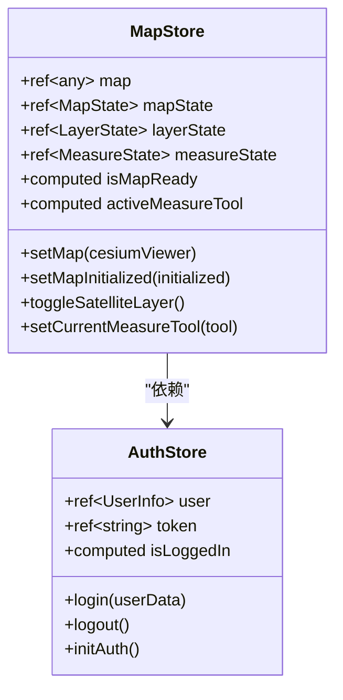
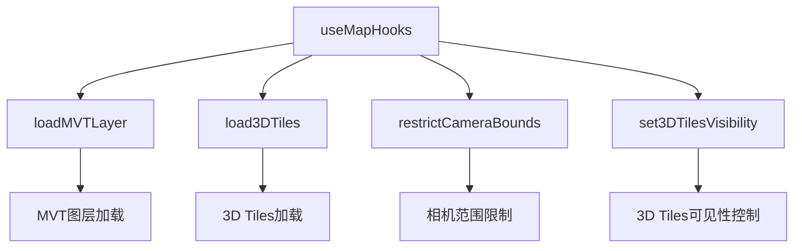
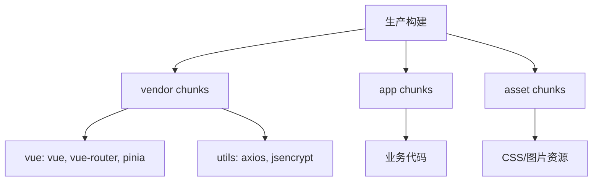
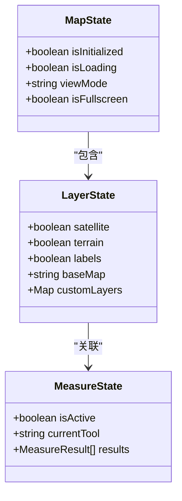
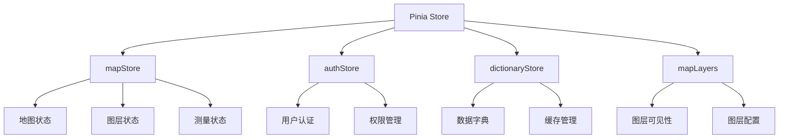
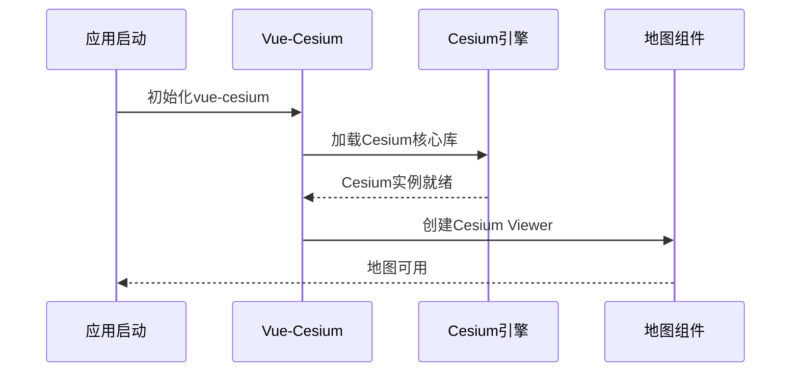
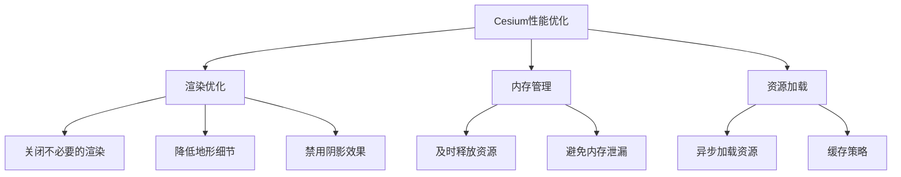
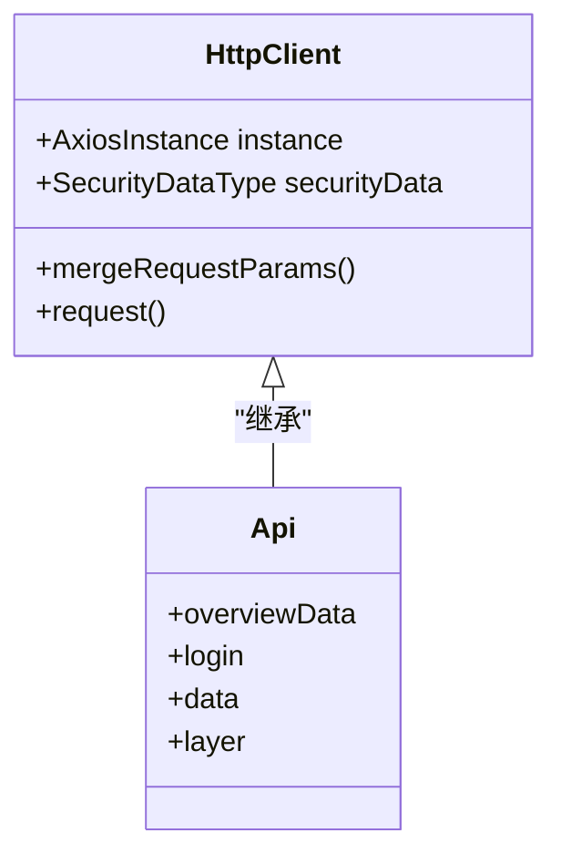
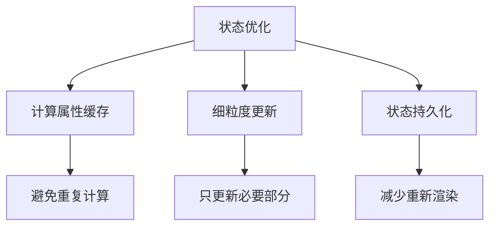
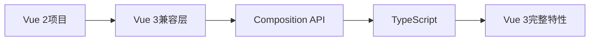

# 技术栈与依赖

<cite>
**本文档中引用的文件**
- [package.json](file://package.json)
- [vite.config.js](file://vite.config.js)
- [tsconfig.json](file://tsconfig.json)
- [src/main.ts](file://src/main.ts)
- [src/App.vue](file://src/App.vue)
- [src/stores/mapStore.ts](file://src/stores/mapStore.ts)
- [src/stores/auth.ts](file://src/stores/auth.ts)
- [src/config/mapConfig.ts](file://src/config/mapConfig.ts)
- [src/mapComponents/Map.vue](file://src/mapComponents/Map.vue)
- [src/services/commonService.ts](file://src/services/commonService.ts)
- [src/router/index.ts](file://src/router/index.ts)
- [src/hook/useMapHooks.ts](file://src/hook/useMapHooks.ts)
- [src/types/index.ts](file://src/types/index.ts)
- [src/assets/styles/variables.scss](file://src/assets/styles/variables.scss)
</cite>

## 目录
1. [项目概述](#项目概述)
2. [核心技术栈](#核心技术栈)
3. [Vue 3 Composition API 使用模式](#vue-3-composition-api-使用模式)
4. [Vite 构建工具配置](#vite-构建工具配置)
5. [TypeScript 类型系统应用](#typescript-类型系统应用)
6. [Pinia 状态管理实现](#pinia-状态管理实现)
7. [Cesium 三维地球引擎集成](#cesium-三维地球引擎集成)
8. [Naive UI 组件库](#naive-ui-组件库)
9. [HTTP 请求处理](#http-请求处理)
10. [依赖版本兼容性矩阵](#依赖版本兼容性矩阵)
11. [性能优化策略](#性能优化策略)
12. [升级指南](#升级指南)

## 项目概述

本项目是一个基于现代前端技术栈开发的政府dashboard系统，专注于城市生命线安全监测与预警。项目采用Vue 3作为核心框架，集成了Cesium三维地球引擎，提供了完整的GIS可视化解决方案。

### 技术架构特点

- **现代化前端架构**：基于Vue 3 Composition API的响应式设计
- **高性能三维可视化**：集成Cesium引擎实现地理信息系统
- **模块化状态管理**：使用Pinia进行状态管理
- **类型安全开发**：全面使用TypeScript确保代码质量
- **工程化构建**：基于Vite的现代化构建流程

## 核心技术栈

### 前端框架与工具链

| 技术组件 | 版本 | 作用描述 |
|---------|------|----------|
| Vue | ^3.5.18 | 核心前端框架，提供响应式UI组件 |
| TypeScript | ^5.9.2 | 类型安全的JavaScript超集 |
| Vite | ^7.0.6 | 现代化构建工具，提供快速开发体验 |
| Pinia | ^3.0.3 | Vue 3官方状态管理库 |

### 三维地球引擎

| 技术组件 | 版本 | 作用描述 |
|---------|------|----------|
| Cesium | 内置 | 三维地球引擎核心库 |
| vue-cesium | ^3.2.9 | Vue 3与Cesium的集成封装 |

### UI组件库

| 技术组件 | 版本 | 作用描述 |
|---------|------|----------|
| Naive UI | ^2.40.1 | 高性能Vue 3组件库 |

### 开发工具与辅助库

| 技术组件 | 版本 | 作用描述 |
|---------|------|----------|
| ESLint | ^9.34.0 | 代码质量检查工具 |
| Prettier | ^3.6.2 | 代码格式化工具 |
| Sass | ^1.90.0 | CSS预处理器 |
| dayjs | ^1.11.15 | 轻量级日期处理库 |
| lodash-es | ^4.17.21 | JavaScript实用工具库 |

**章节来源**
- [package.json](file://package.json#L16-L31)
- [vite.config.js](file://vite.config.js#L1-L81)

## Vue 3 Composition API 使用模式

### 响应式数据管理

项目广泛使用Vue 3的Composition API进行状态管理和逻辑组织，主要体现在以下几个方面：

#### 1. 响应式状态定义



**图表来源**
- [src/stores/mapStore.ts](file://src/stores/mapStore.ts#L18-L400)
- [src/stores/auth.ts](file://src/stores/auth.ts#L14-L76)

#### 2. 生命周期钩子使用

项目在组件中充分利用Vue 3的生命周期钩子：

- **onMounted**：用于初始化地图组件、加载数据
- **onBeforeUnmount**：清理事件监听器和定时器
- **watch**：监听状态变化并执行相应逻辑

#### 3. 自定义Hook模式

项目实现了专门的地图操作Hook：



**图表来源**
- [src/hook/useMapHooks.ts](file://src/hook/useMapHooks.ts#L33-L545)

### 组件通信模式

#### 1. Props与Emits模式
- 使用TypeScript定义严格的Props类型
- 通过Emits传递事件和状态更新

#### 2. Provide/Inject模式
- 在响应式包装器中提供缩放比例给子组件
- 实现跨层级的状态共享

**章节来源**
- [src/stores/mapStore.ts](file://src/stores/mapStore.ts#L1-L400)
- [src/stores/auth.ts](file://src/stores/auth.ts#L1-L76)
- [src/hook/useMapHooks.ts](file://src/hook/useMapHooks.ts#L1-L545)

## Vite 构建工具配置

### 开发环境配置

Vite配置针对开发体验进行了优化：

#### 1. 开发服务器设置
- **主机配置**：`host: "0.0.0.0"` 支持局域网访问
- **端口配置**：`port: 5174` 避免端口冲突
- **代理配置**：自动转发API请求到后端服务

#### 2. 环境变量管理
- 支持多种环境变量前缀（VITE_*）
- 动态配置基础路径和API地址

### 生产环境优化

#### 1. 代码分割策略


**图表来源**
- [vite.config.js](file://vite.config.js#L59-L62)

#### 2. 压缩与优化
- 使用Terser进行JavaScript压缩
- 条件性移除console和debugger语句
- 启用Source Map便于调试

#### 3. 资源处理
- 自动化的chunk命名规则
- 智能的资源打包策略
- CDN友好的文件结构

**章节来源**
- [vite.config.js](file://vite.config.js#L1-L81)

## TypeScript 类型系统应用

### 类型定义体系

项目建立了完整的类型定义体系：

#### 1. 状态类型定义



**图表来源**
- [src/stores/mapStore.ts](file://src/stores/mapStore.ts#L22-L66)

#### 2. API类型安全

项目使用自动生成的API类型：
- 基于OpenAPI规范的类型定义
- 严格的请求和响应类型验证
- 泛型支持灵活的API调用

#### 3. 组件类型声明

- Props类型严格定义
- Emits事件类型安全
- 插槽内容类型约束

### 类型推导与智能提示

#### 1. 编译时检查
- 严格的类型检查确保代码质量
- 零运行时类型错误风险
- IDE智能提示和重构支持

#### 2. 运行时类型保护
- 类型守卫函数
- 可选链操作符的安全使用
- 类型断言的谨慎应用

**章节来源**
- [src/stores/mapStore.ts](file://src/stores/mapStore.ts#L1-L400)
- [src/types/index.ts](file://src/types/index.ts#L1-L10)

## Pinia 状态管理实现

### Store架构设计

#### 1. 模块化状态管理



**图表来源**
- [src/stores/mapStore.ts](file://src/stores/mapStore.ts#L18-L400)
- [src/stores/auth.ts](file://src/stores/auth.ts#L14-L76)

#### 2. 状态持久化策略

- **localStorage**：用户认证信息持久化
- **内存缓存**：频繁访问的数据缓存
- **会话状态**：临时状态的生命周期管理

#### 3. 异步状态处理

- **Loading状态**：网络请求的加载指示
- **错误处理**：统一的错误状态管理
- **重试机制**：失败请求的自动重试

### 状态同步与响应式

#### 1. 响应式更新
- 自动化的状态变更通知
- 组件级别的细粒度更新
- 计算属性的高效缓存

#### 2. 跨组件状态共享
- 全局状态的一致性保证
- 组件间的解耦通信
- 状态变更的追踪和调试

**章节来源**
- [src/stores/mapStore.ts](file://src/stores/mapStore.ts#L1-L400)
- [src/stores/auth.ts](file://src/stores/auth.ts#L1-L76)

## Cesium 三维地球引擎集成

### Vue-Cesium封装机制

#### 1. 初始化配置



**图表来源**
- [src/main.ts](file://src/main.ts#L15-L27)
- [src/mapComponents/Map.vue](file://src/mapComponents/Map.vue#L232-L238)

#### 2. 地图组件架构

项目实现了完整的Cesium地图组件：

- **Viewer容器**：Cesium Viewer实例管理
- **图层系统**：多类型图层的统一管理
- **工具集成**：测量、导航等工具的封装
- **事件处理**：用户交互事件的捕获和处理

#### 3. 性能优化策略



**图表来源**
- [src/mapComponents/Map.vue](file://src/mapComponents/Map.vue#L260-L277)

### 三维地球功能

#### 1. 基础地图功能
- **天地图集成**：支持矢量、影像、地形底图
- **3D Tiles支持**：高质量三维建筑模型
- **GeoJSON渲染**：动态地理数据可视化

#### 2. 高级功能
- **测量工具**：距离、面积测量
- **相机控制**：平滑的视角切换
- **图层管理**：动态图层的显示/隐藏

#### 3. 地理围栏功能

项目实现了基于GeoJSON的地理围栏限制：

- **边界检测**：防止地图超出指定范围
- **高度限制**：控制相机的海拔范围
- **平滑修正**：避免用户意外移出范围

**章节来源**
- [src/main.ts](file://src/main.ts#L15-L27)
- [src/mapComponents/Map.vue](file://src/mapComponents/Map.vue#L1-L432)
- [src/config/mapConfig.ts](file://src/config/mapConfig.ts#L1-L55)
- [src/hook/useMapHooks.ts](file://src/hook/useMapHooks.ts#L228-L423)

## Naive UI 组件库

### 组件库引入方式

#### 1. 全局注册
```typescript
// 在main.ts中全局注册
import naive from 'naive-ui'
app.use(naive)
```

#### 2. 按需加载
- 支持Tree Shaking减少包体积
- 按需引入特定组件提升性能

### 样式定制能力

#### 1. 主题配置
- **语言国际化**：支持中文界面
- **主题切换**：深色/浅色模式适配
- **字体配置**：自定义字体样式

#### 2. 样式覆盖
```scss
// 全局样式定制
:deep(.n-button) {
  border-radius: 8px;
  font-weight: 500;
}

// 组件特定样式
.n-dialog {
  box-shadow: 0 4px 12px rgba(0, 0, 0, 0.15);
}
```

### 组件使用模式

#### 1. Provider模式
```vue
<n-config-provider :locale="zhCN" :date-locale="dateZhCN">
  <n-dialog-provider>
    <n-message-provider>
      <RouterView />
    </n-message-provider>
  </n-dialog-provider>
</n-config-provider>
```

#### 2. 组件组合
- **消息提示**：全局通知和确认对话框
- **表单组件**：丰富的输入控件
- **布局组件**：灵活的页面布局

**章节来源**
- [src/main.ts](file://src/main.ts#L12-L13)
- [src/App.vue](file://src/App.vue#L8-L23)
- [src/assets/styles/variables.scss](file://src/assets/styles/variables.scss#L55-L115)

## HTTP 请求处理

### Axios 配置架构

#### 1. 客户端封装



**图表来源**
- [src/api/common.ts](file://src/api/common.ts#L736-L775)

#### 2. 请求拦截器

- **认证令牌注入**：自动添加JWT令牌
- **请求头标准化**：统一的内容类型设置
- **错误预处理**：统一的错误响应格式

#### 3. 响应拦截器

- **状态码处理**：自动处理HTTP状态码
- **数据转换**：响应数据的标准化处理
- **错误统一**：全局错误处理机制

### 服务层抽象

#### 1. 业务服务封装
```typescript
// 通用服务层示例
export async function login(account: string, password: string) {
  const loginData: LearunIapplicationLoginInputDto = {
    account,
    password,
  };
  const res = await commonApi.login.loginCreate(loginData);
  return res;
}
```

#### 2. API工厂模式
- **客户端生成**：基于OpenAPI自动生成
- **类型安全**：完整的TypeScript类型支持
- **模块化组织**：按业务领域分离API

### 安全特性

#### 1. 数据加密
- **RSA加密**：密码传输加密
- **动态密钥**：每次请求获取新的公钥
- **防重放攻击**：时间戳和随机数验证

#### 2. 认证机制
- **JWT令牌**：无状态认证
- **自动刷新**：令牌过期自动续期
- **权限控制**：基于角色的访问控制

**章节来源**
- [src/services/commonService.ts](file://src/services/commonService.ts#L1-L131)
- [src/api/common.ts](file://src/api/common.ts#L736-L775)

## 依赖版本兼容性矩阵

### 核心依赖兼容性

| 依赖项 | 当前版本 | 推荐版本 | 兼容性说明 | 性能影响 |
|--------|----------|----------|------------|----------|
| Vue | 3.5.18 | 3.5.x | 完全兼容 | 轻微 |
| TypeScript | 5.9.2 | 5.9.x | 完全兼容 | 轻微 |
| Vite | 7.0.6 | 7.0.x | 完全兼容 | 轻微 |
| Pinia | 3.0.3 | 3.0.x | 完全兼容 | 轻微 |
| Naive UI | 2.40.1 | 2.40.x | 完全兼容 | 轻微 |
| Cesium | 内置 | 1.115.x | 完全兼容 | 中等 |
| vue-cesium | 3.2.9 | 3.2.x | 完全兼容 | 中等 |

### 浏览器兼容性

| 浏览器 | 最低版本 | 支持程度 | 性能表现 |
|--------|----------|----------|----------|
| Chrome | 90+ | 完全支持 | 优秀 |
| Firefox | 88+ | 完全支持 | 优秀 |
| Safari | 14+ | 基本支持 | 良好 |
| Edge | 90+ | 完全支持 | 优秀 |

### Node.js 版本要求

- **最低版本**：Node.js 20.19.0
- **推荐版本**：Node.js 22.12.0+
- **兼容性**：支持长期维护版(LTS)

## 性能优化策略

### 构建时优化

#### 1. 代码分割
- **Vendor分离**：核心库独立打包
- **业务代码分割**：按路由拆分代码块
- **懒加载**：组件级别的动态导入

#### 2. 资源优化
- **图片压缩**：智能的图片资源处理
- **CSS优化**：SCSS编译优化
- **字体优化**：Web字体的延迟加载

### 运行时优化

#### 1. 状态管理优化


#### 2. 地图性能优化
- **Cesium优化**：关闭不必要的渲染特性
- **图层管理**：按需加载和卸载图层
- **内存管理**：及时清理不再使用的资源

#### 3. 组件优化
- **Keep-Alive**：关键组件的缓存
- **虚拟滚动**：大数据列表的优化
- **防抖节流**：高频事件的处理

### 监控与调试

#### 1. 性能监控
- **加载时间**：关键资源的加载统计
- **内存使用**：应用内存占用监控
- **渲染性能**：帧率和渲染时间跟踪

#### 2. 错误监控
- **异常捕获**：全局错误处理
- **性能警告**：性能问题的早期发现
- **用户体验**：用户行为分析

## 升级指南

### Vue 3 升级策略

#### 1. 渐进式迁移


#### 2. 升级步骤
1. **依赖更新**：逐步更新Vue相关依赖
2. **语法迁移**：将Options API迁移到Composition API
3. **类型检查**：引入TypeScript进行类型检查
4. **测试验证**：确保功能完整性

### 重大版本升级注意事项

#### 1. Vue 3.4 → 3.5
- **Composition API增强**：新的生命周期钩子
- **模板编译优化**：更好的性能表现
- **TypeScript支持改进**：更完善的类型推导

#### 2. Cesium升级
- **API变更**：注意Cesium API的变更
- **性能影响**：新版本可能带来性能提升
- **兼容性测试**：确保现有功能正常

#### 3. Vite升级
- **配置变更**：检查vite.config.js的兼容性
- **插件更新**：相关插件的版本匹配
- **构建优化**：利用新版本的构建优化特性

### 升级检查清单

#### 1. 必要检查
- [ ] 依赖版本兼容性验证
- [ ] TypeScript类型检查
- [ ] 浏览器兼容性测试
- [ ] 性能基准测试

#### 2. 推荐检查
- [ ] 代码质量扫描
- [ ] 安全漏洞检查
- [ ] 用户体验测试
- [ ] 文档更新

### 回滚策略

#### 1. 版本锁定
- 使用package-lock.json锁定版本
- 定期备份重要配置文件
- 建立版本发布流程

#### 2. 快速回滚
- 准备回滚脚本
- 保留上一版本的部署包
- 建立监控告警机制

通过遵循这些升级指南，可以确保项目的稳定性和安全性，同时获得最新的功能和性能改进。