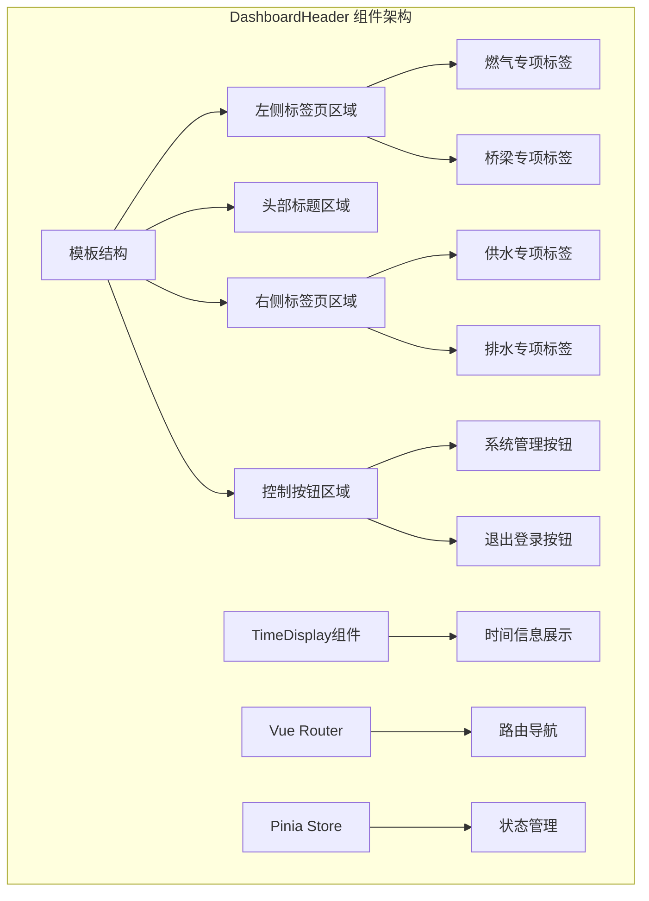
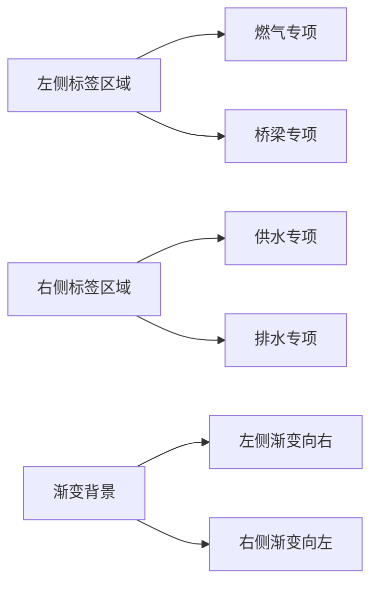
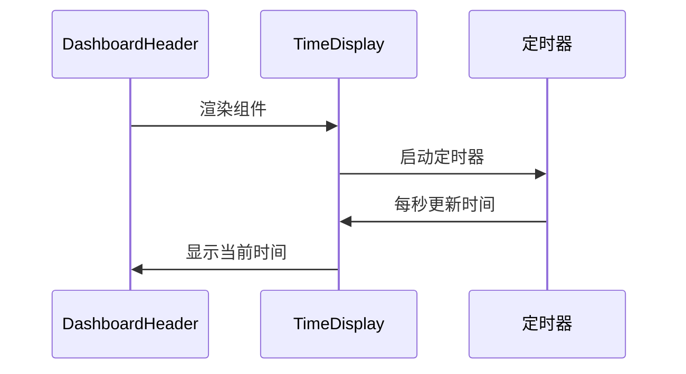
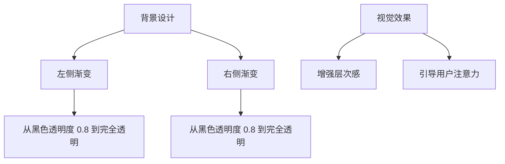
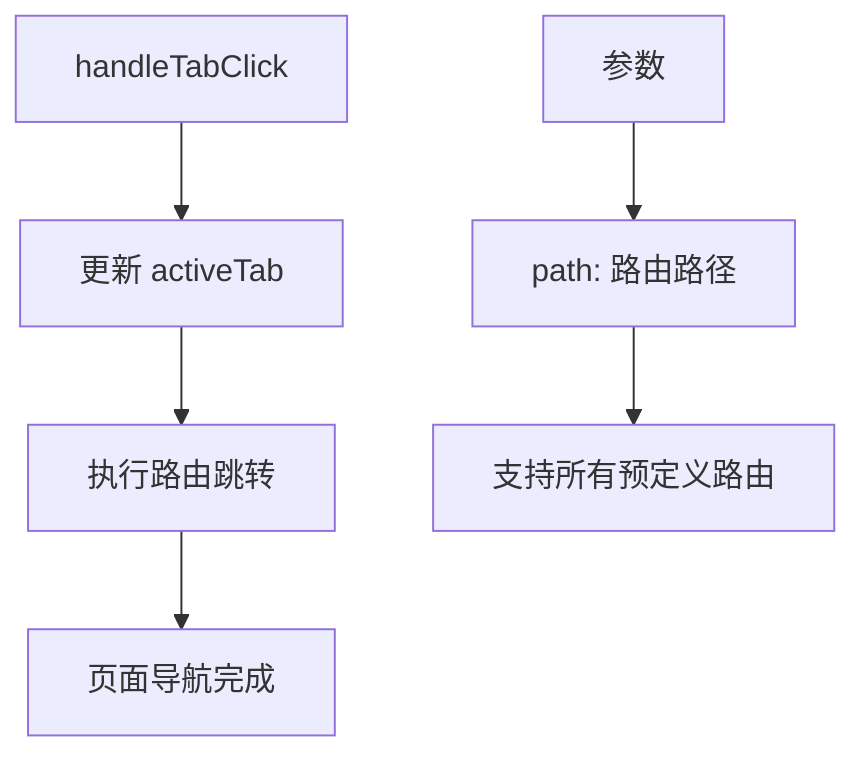
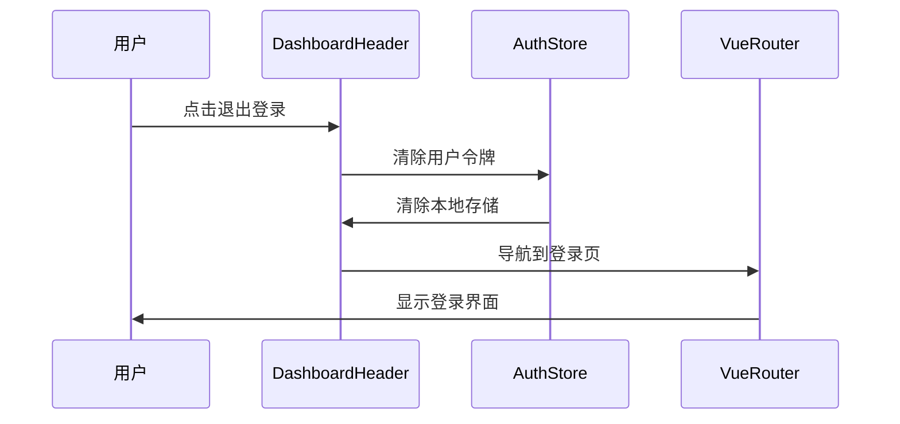
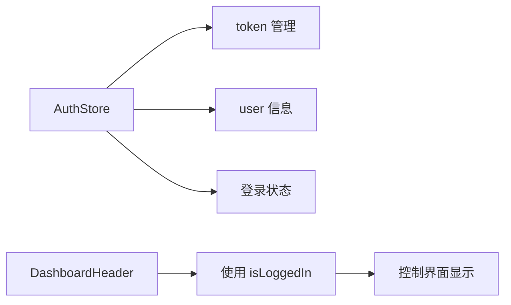

# DashboardHeader.vue 组件详细文档

<cite>
**本文档中引用的文件**
- [DashboardHeader.vue](file://src/components/DashboardHeader.vue)
- [TimeDisplay.vue](file://src/components/TimeDisplay.vue)
- [router/index.ts](file://src/router/index.ts)
- [stores/auth.ts](file://src/stores/auth.ts)
- [views/WaterSupply/index.vue](file://src/views/WaterSupply/index.vue)
- [views/gasModule/index.vue](file://src/views/gasModule/index.vue)
- [assets/styles/variables.scss](file://src/assets/styles/variables.scss)
- [assets/main.css](file://src/assets/main.css)
</cite>

## 目录
1. [简介](#简介)
2. [组件架构概览](#组件架构概览)
3. [核心功能模块](#核心功能模块)
4. [标签页系统](#标签页系统)
5. [时间显示组件](#时间显示组件)
6. [路由管理系统](#路由管理系统)
7. [响应式设计与视觉效果](#响应式设计与视觉效果)
8. [事件处理机制](#事件处理机制)
9. [状态管理](#状态管理)
10. [最佳实践与优化建议](#最佳实践与优化建议)

## 简介

DashboardHeader.vue 是政府安全综合监测预警平台的核心导航组件，作为整个应用的头部导航中枢，负责管理专项监测模块的标签页切换、系统控制功能以及时间信息展示。该组件采用 Vue 3 Composition API 构建，集成了响应式设计、路由管理和状态同步等功能。

## 组件架构概览



**图表来源**
- [DashboardHeader.vue](file://src/components/DashboardHeader.vue#L1-L51)

**章节来源**
- [DashboardHeader.vue](file://src/components/DashboardHeader.vue#L1-L233)

## 核心功能模块

### 1. 左侧专项监测模块

左侧区域包含两个主要的专项监测标签：
- **燃气专项** (`/gas`): 负责燃气系统的监控和预警
- **桥梁专项** (`/bridge`): 负责桥梁结构的安全监测

每个标签项都具有以下特性：
- 独特的背景图片和激活状态样式
- 点击切换路由并更新激活状态
- 支持动态样式绑定和视觉反馈

### 2. 右侧专项监测模块

右侧区域包含两个主要的专项监测标签：
- **供水专项** (`/waterProject`): 负责供水系统的监控
- **排水专项** (`/drainage`): 负责排水系统的监控

### 3. 系统控制功能

右侧控制区域提供以下功能：
- **系统管理按钮**: 提供系统配置和管理入口
- **退出登录按钮**: 安全退出当前会话

**章节来源**
- [DashboardHeader.vue](file://src/components/DashboardHeader.vue#L3-L49)

## 标签页系统

### 布局设计

标签页采用水平排列的布局设计，分为左右两侧对称分布：



**图表来源**
- [DashboardHeader.vue](file://src/components/DashboardHeader.vue#L149-L155)

### 点击切换逻辑

标签页的切换逻辑通过以下步骤实现：

1. **事件触发**: 用户点击标签项
2. **状态更新**: 更新 `activeTab` 响应式变量
3. **路由跳转**: 使用 Vue Router 进行页面导航
4. **视觉反馈**: 自动更新标签激活状态

### 激活状态管理

激活状态通过 Vue 的响应式系统自动管理：
- 初始值基于当前路由路径
- 路由变化时自动同步更新
- 支持即时的状态反馈

**章节来源**
- [DashboardHeader.vue](file://src/components/DashboardHeader.vue#L54-L102)

## 时间显示组件

### TimeDisplay 组件集成

TimeDisplay 组件作为时间信息展示的核心组件，提供实时的时间和日期显示功能：



**图表来源**
- [TimeDisplay.vue](file://src/components/TimeDisplay.vue#L24-L40)
- [DashboardHeader.vue](file://src/components/DashboardHeader.vue#L4)

### 时间格式化功能

TimeDisplay 组件提供精确的时间格式化：

| 时间元素 | 格式 | 示例 |
|---------|------|------|
| 日期 | YYYY.MM.DD | 2025.11.23 |
| 时间 | HH:mm:ss | 14:30:45 |

### 生命周期管理

组件实现了完整的生命周期管理：
- **挂载时**: 初始化时间并启动定时器
- **卸载时**: 清理定时器防止内存泄漏

**章节来源**
- [TimeDisplay.vue](file://src/components/TimeDisplay.vue#L1-L69)

## 路由管理系统

### Vue Router 集成

DashboardHeader 组件深度集成了 Vue Router，实现智能的路由管理和状态同步：

```mermaid
graph TD
A[路由监听] --> B[watch(route.path)]
B --> C[更新 activeTab]
C --> D[同步标签状态]
E[标签点击] --> F[handleTabClick]
F --> G[更新 activeTab]
G --> H[router.push]
H --> I[页面跳转]
```

**图表来源**
- [DashboardHeader.vue](file://src/components/DashboardHeader.vue#L66-L73)
- [DashboardHeader.vue](file://src/components/DashboardHeader.vue#L75-L82)

### 路由配置映射

系统支持的路由路径及其对应的功能：

| 路由路径 | 页面组件 | 功能描述 |
|---------|----------|----------|
| `/gas` | GasModule | 燃气专项监测 |
| `/bridge` | BridgeModule | 桥梁专项监测 |
| `/waterProject` | WaterSupplyView | 供水专项监测 |
| `/drainage` | DrainageModule | 排水专项监测 |
| `/mapView` | MapView | 地图可视化界面 |

### 路由守卫机制

系统实现了完善的路由守卫机制：
- **身份验证检查**: 确保用户已登录
- **权限控制**: 基于角色的访问控制
- **页面标题管理**: 动态更新浏览器标题

**章节来源**
- [router/index.ts](file://src/router/index.ts#L78-L112)

## 响应式设计与视觉效果

### 渐变背景系统

组件采用了创新的渐变背景设计：



**图表来源**
- [DashboardHeader.vue](file://src/components/DashboardHeader.vue#L149-L155)

### 按钮悬停效果

控制按钮实现了流畅的悬停交互效果：

| 效果类型 | 实现方式 | 触发条件 |
|---------|----------|----------|
| 透明度变化 | `opacity: 0.8` | 鼠标悬停 |
| 缩放效果 | `scale(1.02)` | 鼠标悬停 |
| 过渡动画 | `transition: all 0.3s ease` | 所有状态变化 |

### 标签页激活状态视觉反馈

激活状态通过多重视觉元素呈现：

1. **背景图片切换**: 正常状态 vs 激活状态
2. **文字渐变效果**: 静态渐变 vs 动态渐变
3. **阴影效果**: 增强立体感

**章节来源**
- [DashboardHeader.vue](file://src/components/DashboardHeader.vue#L158-L208)

## 事件处理机制

### handleTabClick 函数实现

标签页点击事件处理函数提供了完整的交互逻辑：



**图表来源**
- [DashboardHeader.vue](file://src/components/DashboardHeader.vue#L75-L82)

### handleLogout 函数实现

退出登录功能确保用户会话的安全清理：



**图表来源**
- [DashboardHeader.vue](file://src/components/DashboardHeader.vue#L97-L102)
- [stores/auth.ts](file://src/stores/auth.ts#L33-L40)

### handleTitleClick 函数实现

头部标题点击事件提供了便捷的主页导航：

| 条件 | 行为 | 目的 |
|------|------|------|
| 当前不是 mapView | 导航到 `/mapView` | 快速返回主界面 |
| 当前是 mapView | 无操作 | 避免重复导航 |

**章节来源**
- [DashboardHeader.vue](file://src/components/DashboardHeader.vue#L90-L95)

## 状态管理

### Pinia Store 集成

组件与 Pinia 状态管理库深度集成：



**图表来源**
- [stores/auth.ts](file://src/stores/auth.ts#L17-L18)

### 路由状态同步

组件实现了双向的状态同步机制：
- **路由 → 组件**: 监听路由变化自动更新激活状态
- **组件 → 路由**: 用户交互时更新路由状态

### 本地存储管理

系统维护了完善的本地存储策略：
- **令牌存储**: 安全保存用户认证信息
- **用户信息**: 缓存用户基本信息
- **自动清理**: 退出登录时彻底清除敏感数据

**章节来源**
- [stores/auth.ts](file://src/stores/auth.ts#L16-L40)

## 最佳实践与优化建议

### 性能优化策略

1. **响应式状态管理**: 使用 Vue 3 的响应式系统减少不必要的重新渲染
2. **事件委托**: 合理使用事件处理器避免内存泄漏
3. **懒加载**: TimeDisplay 组件实现了按需加载机制

### 可访问性考虑

1. **语义化 HTML**: 使用适当的 HTML 元素和属性
2. **键盘导航**: 支持键盘操作的标签页切换
3. **屏幕阅读器**: 提供适当的 ARIA 属性

### 维护性建议

1. **模块化设计**: 将不同功能分离到独立的子组件
2. **类型安全**: 使用 TypeScript 提供类型安全保障
3. **测试覆盖**: 为关键功能编写单元测试

### 扩展性规划

1. **插件化架构**: 支持动态添加新的专项监测模块
2. **主题系统**: 实现可配置的主题切换机制
3. **国际化支持**: 为多语言环境做好准备

**章节来源**
- [DashboardHeader.vue](file://src/components/DashboardHeader.vue#L1-L233)