# 响应式包装器

<cite>
**本文档中引用的文件**
- [ResponsiveWrapper.vue](file://src/components/ResponsiveWrapper.vue)
- [Map.vue](file://src/mapComponents/Map.vue)
- [MapToolbar.vue](file://src/mapComponents/MapToolbar.vue)
- [MeasureTool.vue](file://src/mapComponents/MeasureTool.vue)
- [App.vue](file://src/App.vue)
- [MapView.vue](file://src/views/MapView.vue)
- [MapToolbarDemo.vue](file://src/views/MapToolbarDemo.vue)
- [PersistentLayout.vue](file://src/layouts/PersistentLayout.vue)
</cite>

## 更新摘要
**变更内容**
- 开发环境缩放逻辑已注释，改为仅通过URL参数控制
- 增强URL参数监听机制，支持MutationObserver实时监听
- 改进缩放模式检测功能，支持hash路由参数解析
- 优化组件性能，包含防抖机制和will-change优化
- 增强响应式数据暴露，提供scaleRatio、currentScaleMode、enableScale给父组件

## 目录
1. [简介](#简介)
2. [项目结构](#项目结构)
3. [核心组件](#核心组件)
4. [架构概览](#架构概览)
5. [详细组件分析](#详细组件分析)
6. [依赖关系分析](#依赖关系分析)
7. [性能考虑](#性能考虑)
8. [故障排除指南](#故障排除指南)
9. [结论](#结论)

## 简介

ResponsiveWrapper.vue是一个专门设计用于实现响应式布局的基础组件，它通过CSS Transform和Scale技术确保界面元素在不同分辨率下保持一致的视觉效果。该组件作为地图工具栏和测量工具等子组件的容器，提供了强大的自适应缩放能力，是政府仪表板项目中地图可视化系统的核心基础设施。

**更新** 该组件现已具备增强的URL参数解析能力，支持从传统search参数和hash路由参数中获取配置信息，并实现了实时参数监听机制，使缩放控制更加灵活和动态。开发环境的自动缩放功能已被注释，改为完全依赖URL参数控制，提高了可控性和一致性。

该组件的主要特点包括：
- 基于CSS Transform的高效缩放机制
- 支持按宽度或高度进行自适应缩放
- **新增** 支持URL参数控制（包括hash路由）
- **新增** 实时参数监听和动态缩放控制
- 内置防抖处理和性能优化
- 与Vue 3组合式API深度集成
- **新增** 暴露响应式数据供父组件使用

## 项目结构

ResponsiveWrapper组件在项目中的组织结构体现了清晰的分层架构：

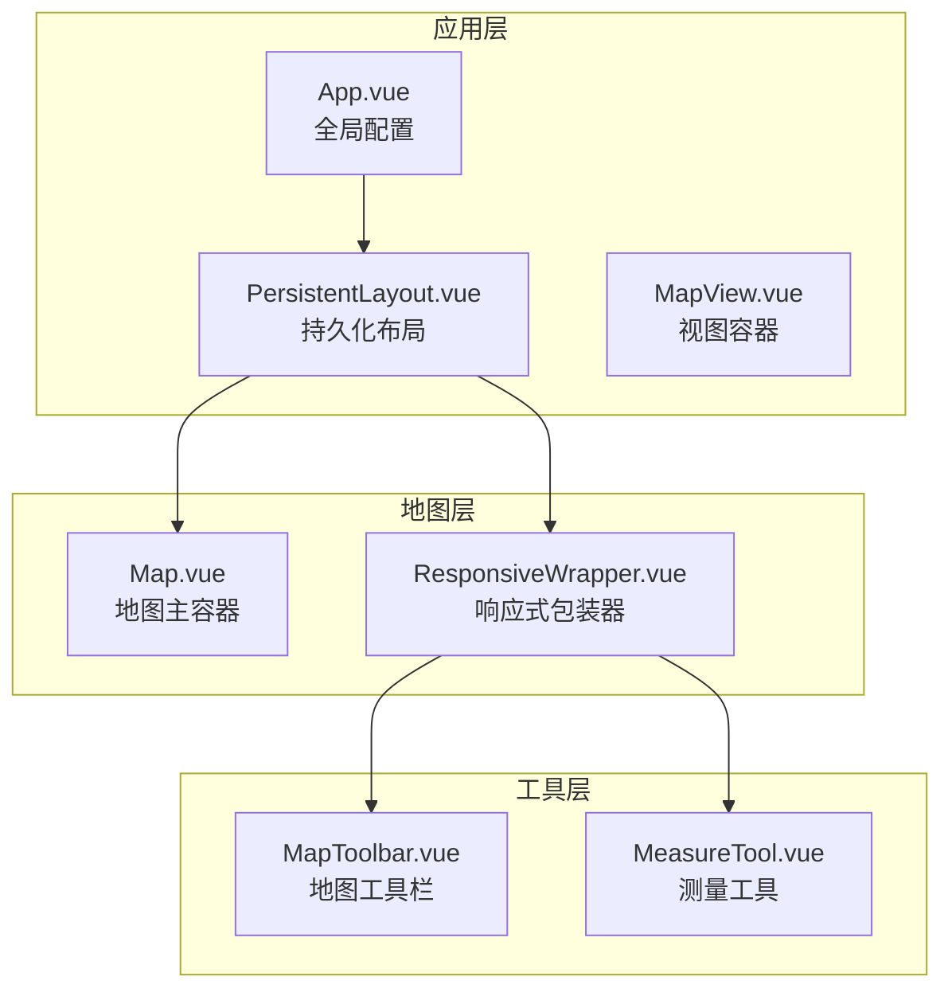

**图表来源**
- [App.vue:1-159](file://src/App.vue#L1-L159)
- [PersistentLayout.vue:1-58](file://src/layouts/PersistentLayout.vue#L1-L58)
- [MapView.vue:1-171](file://src/views/MapView.vue#L1-L171)
- [Map.vue:1-432](file://src/mapComponents/Map.vue#L1-L432)
- [ResponsiveWrapper.vue:1-243](file://src/components/ResponsiveWrapper.vue#L1-L243)

**章节来源**
- [App.vue:1-159](file://src/App.vue#L1-L159)
- [PersistentLayout.vue:1-58](file://src/layouts/PersistentLayout.vue#L1-L58)
- [MapView.vue:1-171](file://src/views/MapView.vue#L1-L171)
- [Map.vue:1-432](file://src/mapComponents/Map.vue#L1-L432)

## 核心组件

### ResponsiveWrapper组件架构

ResponsiveWrapper组件采用了现代化的Vue 3架构设计，结合了组合式API的强大功能：

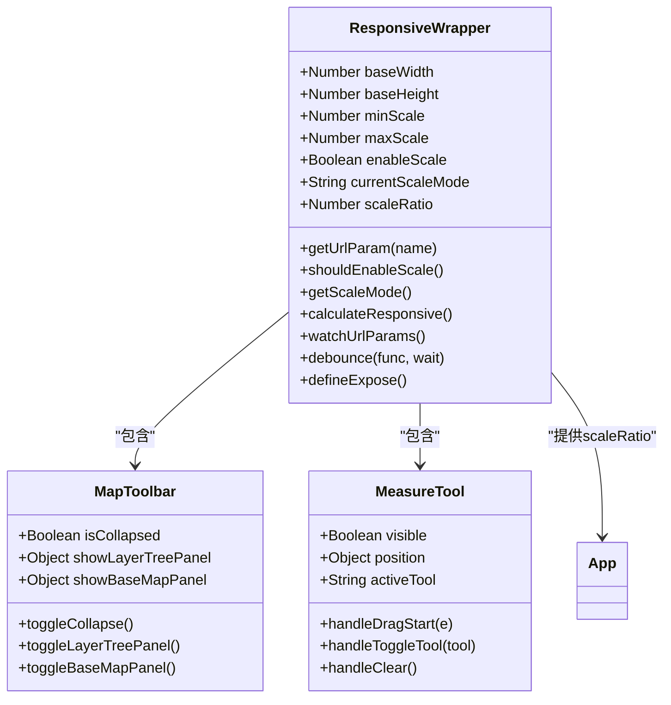

**图表来源**
- [ResponsiveWrapper.vue:15-166](file://src/components/ResponsiveWrapper.vue#L15-L166)
- [MapToolbar.vue:78-333](file://src/mapComponents/MapToolbar.vue#L78-L333)
- [MeasureTool.vue:43-137](file://src/mapComponents/MeasureTool.vue#L43-L137)

### 核心功能特性

**更新** ResponsiveWrapper组件实现了以下核心功能：

1. **自适应缩放计算**：基于窗口尺寸动态计算缩放比例
2. **多模式缩放支持**：支持按宽度或高度进行缩放
3. **URL参数控制**：通过URL参数动态调整缩放模式（支持hash路由）
4. **实时参数监听**：监听URL变化并动态更新缩放设置
5. **性能优化**：内置防抖机制减少频繁重绘
6. **状态管理**：提供响应式数据供子组件使用
7. **组件暴露**：向父组件暴露scaleRatio、currentScaleMode、enableScale

**章节来源**
- [ResponsiveWrapper.vue:15-166](file://src/components/ResponsiveWrapper.vue#L15-L166)

## 架构概览

### 响应式布局工作原理

**更新** ResponsiveWrapper组件通过CSS Transform的scale属性实现界面元素的自适应缩放，并集成了智能的URL参数控制系统：

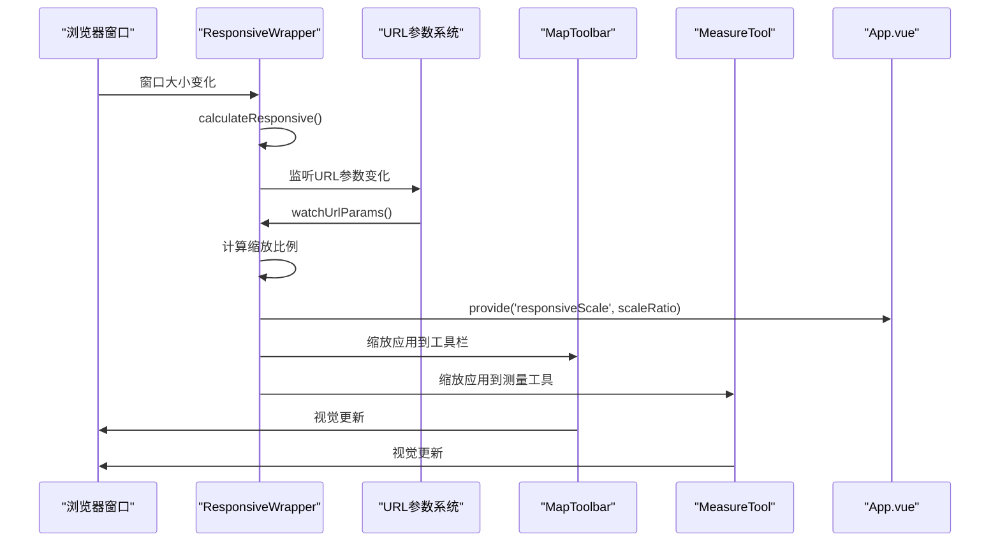

**图表来源**
- [ResponsiveWrapper.vue:89-132](file://src/components/ResponsiveWrapper.vue#L89-L132)
- [Map.vue:192-194](file://src/mapComponents/Map.vue#L192-L194)

### 插槽使用模式

ResponsiveWrapper作为容器组件，采用了标准的Vue插槽模式：

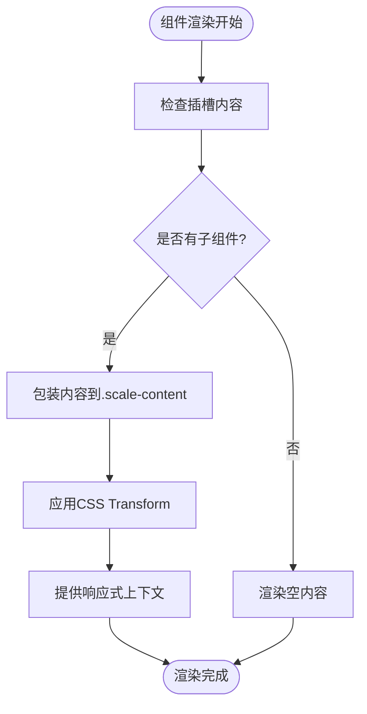

**图表来源**
- [ResponsiveWrapper.vue:1-12](file://src/components/ResponsiveWrapper.vue#L1-L12)

**章节来源**
- [ResponsiveWrapper.vue:1-12](file://src/components/ResponsiveWrapper.vue#L1-L12)

## 详细组件分析

### 缩放算法实现

**更新** ResponsiveWrapper的核心是其智能的缩放算法，该算法能够根据不同的场景需求自动调整界面元素的大小，并集成了动态URL参数控制系统：

#### 缩放模式选择

组件支持两种主要的缩放模式：

1. **宽度优先模式** (`width`): 基于屏幕宽度进行缩放
2. **高度优先模式** (`height`): 基于屏幕高度进行缩放

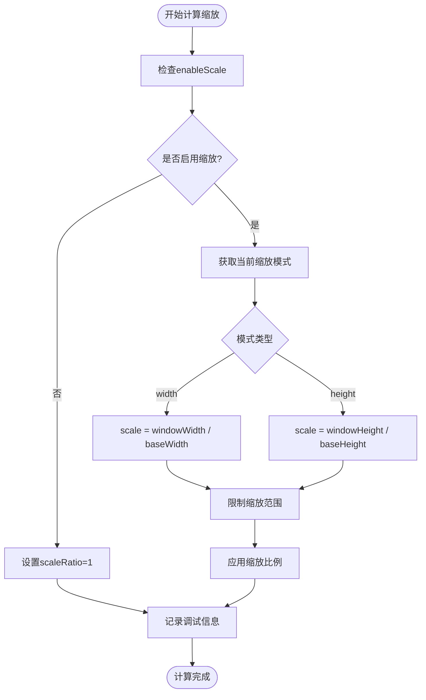

**图表来源**
- [ResponsiveWrapper.vue:89-120](file://src/components/ResponsiveWrapper.vue#L89-L120)

#### URL参数控制系统

**新增** 组件提供了灵活的URL参数控制系统，允许通过URL动态调整缩放行为，并支持hash路由：

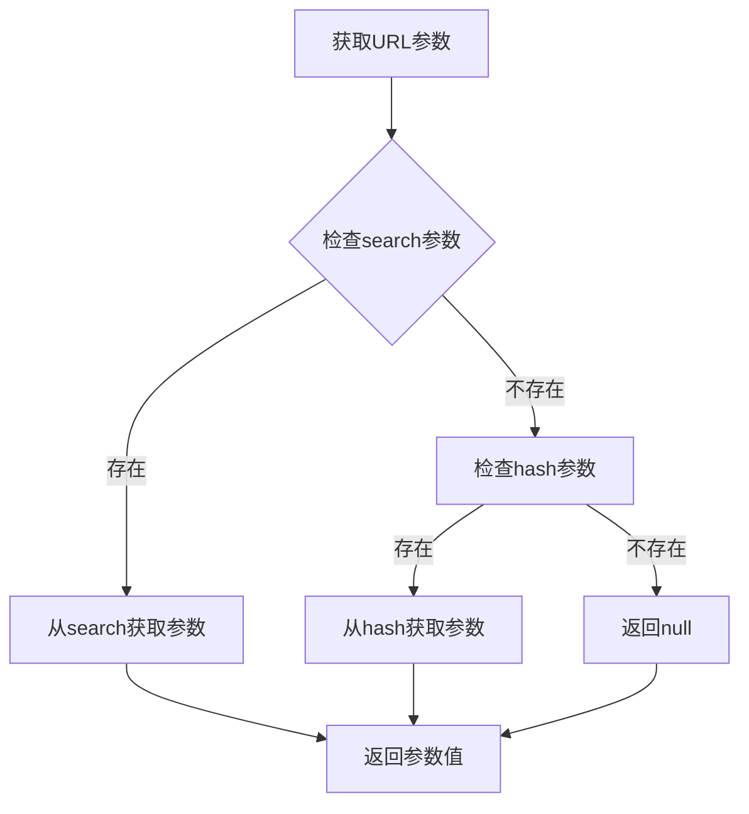

**图表来源**
- [ResponsiveWrapper.vue:41-56](file://src/components/ResponsiveWrapper.vue#L41-L56)

**章节来源**
- [ResponsiveWrapper.vue:41-74](file://src/components/ResponsiveWrapper.vue#L41-L74)

### 全局样式协同机制

ResponsiveWrapper与App.vue中的全局样式形成了良好的协同工作机制：

#### 样式隔离与交互

组件通过精心设计的CSS规则实现了样式隔离与交互的平衡：

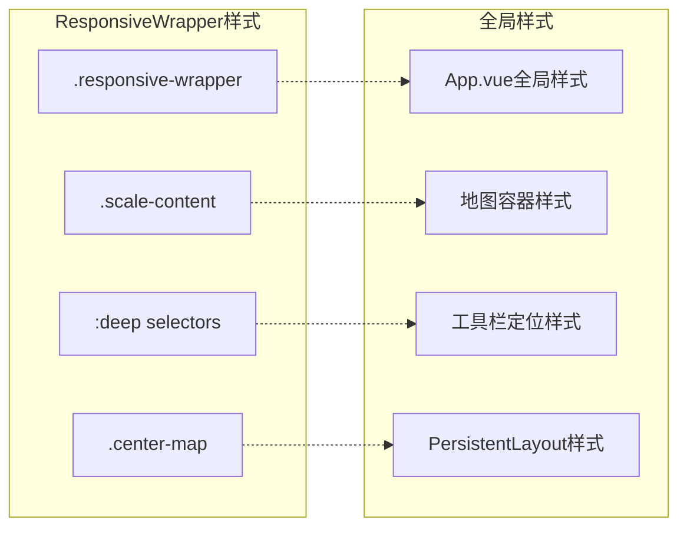

**图表来源**
- [ResponsiveWrapper.vue:169-243](file://src/components/ResponsiveWrapper.vue#L169-L243)
- [App.vue:32-159](file://src/App.vue#L32-L159)
- [PersistentLayout.vue:50-57](file://src/layouts/PersistentLayout.vue#L50-L57)

#### 指针事件管理

组件实现了精细的指针事件管理系统，确保用户交互的流畅性：

| 元素类别 | 指针事件状态 | 说明 |
|----------|-------------|------|
| `.header` | `pointer-events: auto` | 头部区域可交互 |
| `.left-content` | `pointer-events: auto` | 左侧面板可交互 |
| `.right-content` | `pointer-events: auto` | 右侧面板可交互 |
| `.map-toolbar` | `pointer-events: auto` | 地图工具栏可交互 |
| `.sidebar-module` | `pointer-events: auto` | 侧边栏模块可交互 |
| `.login-card` | `pointer-events: auto` | 登录卡片可交互 |
| 其他元素 | `pointer-events: none` | 默认禁用交互 |
| `.center-map` | `pointer-events: auto` | 地图区域可交互 |

**章节来源**
- [ResponsiveWrapper.vue:180-188](file://src/components/ResponsiveWrapper.vue#L180-L188)

### 子组件集成模式

#### MapToolbar集成

**更新** ResponsiveWrapper与MapToolbar的集成展示了组件化设计的最佳实践，现在支持动态缩放控制：

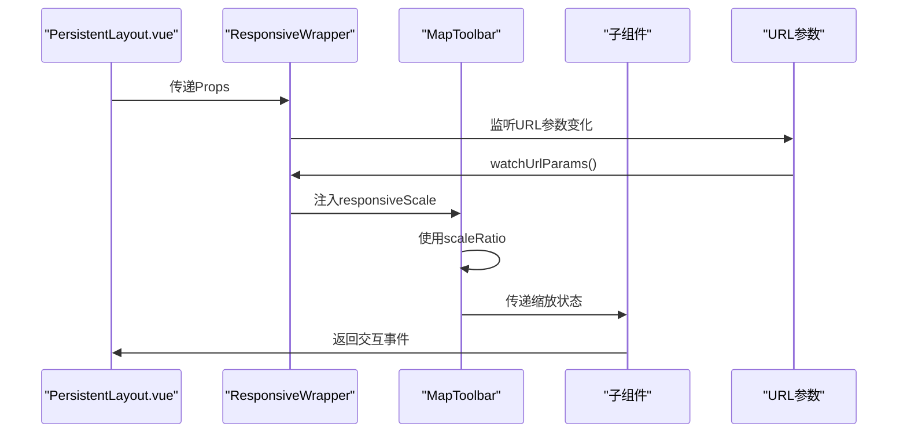

**图表来源**
- [PersistentLayout.vue:18-30](file://src/layouts/PersistentLayout.vue#L18-L30)
- [ResponsiveWrapper.vue:145-146](file://src/components/ResponsiveWrapper.vue#L145-L146)

#### MeasureTool集成

测量工具的集成同样体现了响应式设计的理念：

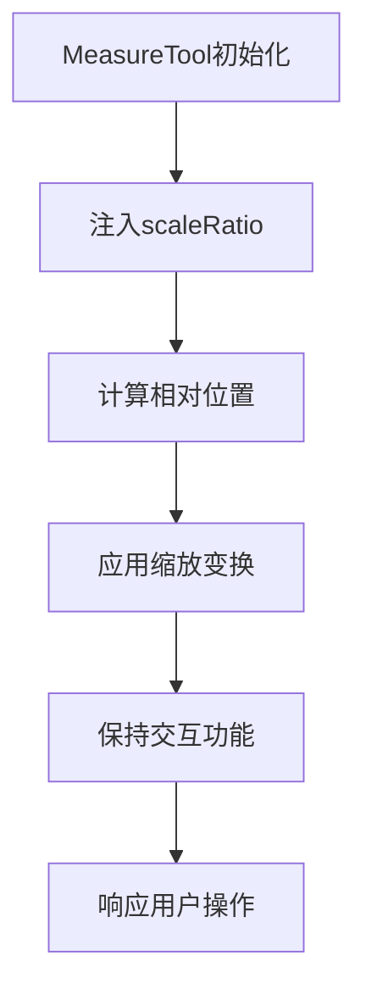

**图表来源**
- [MeasureTool.vue:43-62](file://src/mapComponents/MeasureTool.vue#L43-L62)

**章节来源**
- [PersistentLayout.vue:18-30](file://src/layouts/PersistentLayout.vue#L18-L30)
- [MeasureTool.vue:43-62](file://src/mapComponents/MeasureTool.vue#L43-L62)

### 性能优化策略

**更新** 组件实现了多项性能优化策略，包括智能的URL参数监听机制：

#### 防抖机制

组件实现了高效的防抖机制来优化性能：

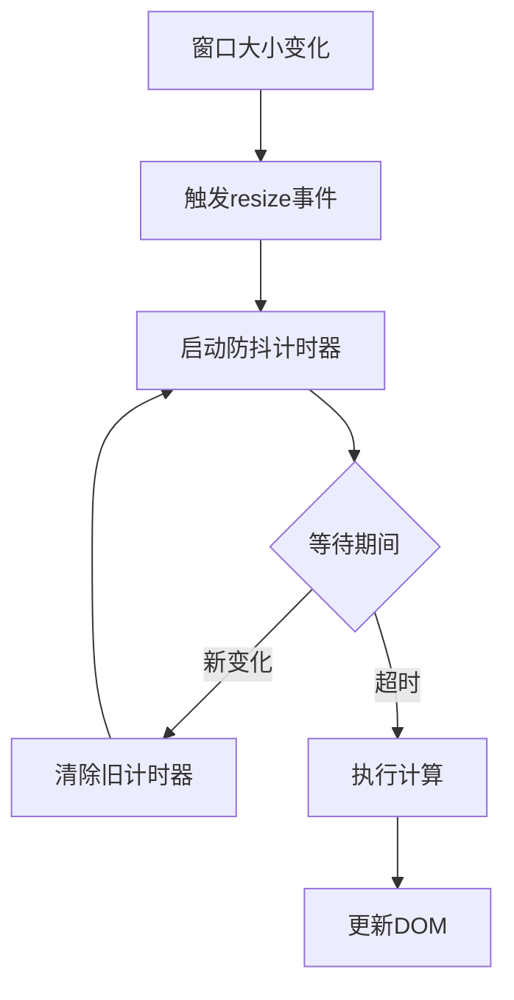

**图表来源**
- [ResponsiveWrapper.vue:134-143](file://src/components/ResponsiveWrapper.vue#L134-L143)

#### MutationObserver监控

**新增** 组件使用MutationObserver来监听URL参数的变化：

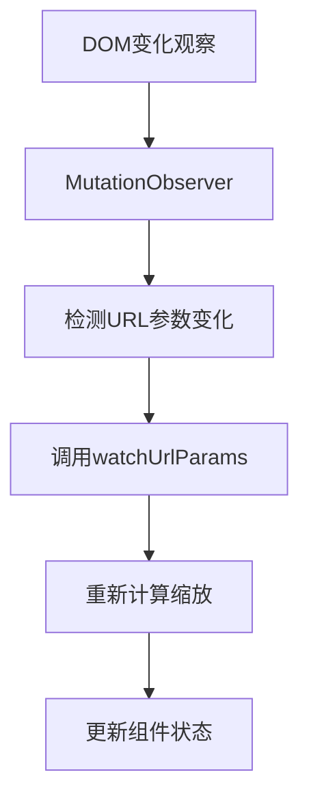

**图表来源**
- [ResponsiveWrapper.vue:152-154](file://src/components/ResponsiveWrapper.vue#L152-L154)

**章节来源**
- [ResponsiveWrapper.vue:134-154](file://src/components/ResponsiveWrapper.vue#L134-L154)

## 依赖关系分析

### 组件依赖图

**更新** ResponsiveWrapper组件的依赖关系体现了清晰的分层架构，新增了URL参数处理和实时监听功能：

```mermaid
graph TB
subgraph "外部依赖"
Vue[Vue 3 Composition API]
CSS[CSS Transform]
MutationObserver[MutationObserver API]
URLSearchParams[URLSearchParams API]
</subgraph>
subgraph "内部依赖"
Props[Props定义]
Computed[Computed属性]
Watch[Watch监听]
Lifecycle[生命周期钩子]
Expose[defineExpose]
</subgraph>
subgraph "子组件"
MapToolbar[MapToolbar.vue]
MeasureTool[MeasureTool.vue]
DashboardHeader[DashboardHeader.vue]
</subgraph>
Vue --> Props
Vue --> Computed
Vue --> Watch
Vue --> Lifecycle
Vue --> Expose
Props --> MapToolbar
Props --> MeasureTool
Props --> DashboardHeader
Computed --> MapToolbar
Computed --> MeasureTool
Computed --> DashboardHeader
Expose --> MapToolbar
Expose --> MeasureTool
```

**图表来源**
- [ResponsiveWrapper.vue:15-166](file://src/components/ResponsiveWrapper.vue#L15-L166)
- [PersistentLayout.vue:34-48](file://src/layouts/PersistentLayout.vue#L34-L48)

### 提供和注入机制

组件使用Vue的Provide/Inject机制实现跨层级的状态共享：

| 提供的服务 | 类型 | 用途 |
|-----------|------|------|
| `responsiveScale` | Ref<number> | 缩放比例提供给子组件 |
| **新增** `scaleRatio` | Ref<number> | 暴露给父组件使用 |
| **新增** `currentScaleMode` | Ref<string> | 暴露给父组件使用 |
| **新增** `enableScale` | Ref<boolean> | 暴露给父组件使用 |

**章节来源**
- [ResponsiveWrapper.vue:161-166](file://src/components/ResponsiveWrapper.vue#L161-L166)

## 性能考虑

### 渲染优化

**更新** ResponsiveWrapper组件采用了多种性能优化策略：

1. **Transform优化**：使用CSS Transform而非改变尺寸属性
2. **Will-Change属性**：预声明transform变化以获得硬件加速
3. **防抖处理**：减少频繁的重计算
4. **条件渲染**：只在必要时更新样式
5. **MutationObserver优化**：智能监听URL变化，避免轮询

### 内存管理

组件实现了完善的生命周期管理：

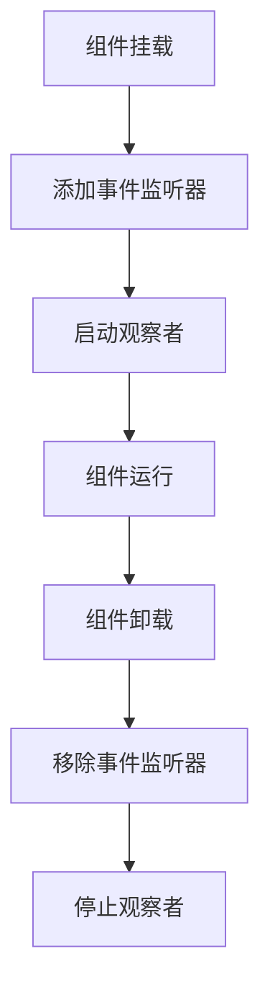

**图表来源**
- [ResponsiveWrapper.vue:148-159](file://src/components/ResponsiveWrapper.vue#L148-L159)

## 故障排除指南

### 常见问题及解决方案

#### 缩放不生效

**问题描述**：界面元素没有正确缩放

**可能原因**：
1. 父容器尺寸未正确设置
2. CSS样式冲突
3. 浏览器兼容性问题
4. **新增** URL参数未正确传递
5. **新增** 开发环境缩放逻辑被注释

**解决方案**：
1. 检查父容器的position属性
2. 验证CSS优先级
3. 测试不同浏览器的兼容性
4. **新增** 确认URL参数格式正确（如：`?showStyle=width`）
5. **新增** 确认不是在开发环境中使用

#### 子组件交互失效

**问题描述**：工具栏或测量工具无法正常交互

**可能原因**：
1. pointer-events被意外覆盖
2. z-index层级问题
3. 事件冒泡被阻止
4. **新增** 缩放模式切换导致的布局问题

**解决方案**：
1. 检查CSS选择器优先级
2. 调整z-index值
3. 确认事件处理逻辑
4. **新增** 检查缩放模式配置是否正确

#### URL参数监听失效

**新增** **问题描述**：URL参数变化后缩放设置未更新

**可能原因**：
1. MutationObserver未正确初始化
2. URL参数格式不正确
3. hash路由参数解析失败

**解决方案**：
1. 检查MutationObserver配置
2. 验证URL参数格式（支持search和hash两种形式）
3. 确认hash路由参数包含问号分隔符

#### 开发环境缩放问题

**新增** **问题描述**：开发环境中缩放功能不可用

**可能原因**：
1. 开发环境缩放逻辑被注释
2. 未正确传递URL参数

**解决方案**：
1. 确认开发环境缩放逻辑已被注释
2. 在URL中添加`?showStyle=width`或`?showStyle=height`

**章节来源**
- [ResponsiveWrapper.vue:180-188](file://src/components/ResponsiveWrapper.vue#L180-L188)

## 结论

**更新** ResponsiveWrapper.vue组件是政府仪表板项目中响应式设计的重要基石。经过增强后，该组件不仅保持了原有的响应式布局能力，还新增了强大的URL参数解析和实时监听功能，使其成为更加完善和灵活的布局解决方案。

组件的设计充分体现了现代前端开发的最佳实践：

1. **架构清晰**：采用分层架构，职责明确
2. **性能优秀**：通过防抖和硬件加速优化性能
3. **扩展性强**：支持多种缩放模式和配置选项
4. **维护友好**：代码结构清晰，易于理解和维护
5. **智能化**：支持动态URL参数控制和实时监听
6. **组件化**：提供完整的响应式数据暴露机制
7. **可控性**：通过URL参数精确控制缩放行为

该组件不仅为地图工具栏和测量工具提供了可靠的响应式基础，更为整个项目的可扩展性和用户体验奠定了坚实的基础。随着项目的发展，这个组件将继续发挥重要作用，支撑更多复杂场景下的响应式需求。

**使用示例**

要在URL中启用缩放功能，可以使用以下格式：

- 传统URL：`http://localhost:3000/?showStyle=width`
- Hash路由：`http://localhost:3000/#/?showStyle=height`

这将分别启用按宽度或按高度的自适应缩放模式，为不同分辨率的设备提供最佳的视觉体验。

**更新** 在开发环境中，由于缩放逻辑已被注释，需要手动添加URL参数来启用缩放功能。生产环境中，组件将根据URL参数自动判断是否启用缩放，提供了更好的可控性和一致性。