# 响应式包装器

<cite>
**本文档中引用的文件**
- [ResponsiveWrapper.vue](file://src/components/ResponsiveWrapper.vue)
- [Map.vue](file://src/mapComponents/Map.vue)
- [MapToolbar.vue](file://src/mapComponents/MapToolbar.vue)
- [MeasureTool.vue](file://src/mapComponents/MeasureTool.vue)
- [App.vue](file://src/App.vue)
- [MapView.vue](file://src/views/MapView.vue)
- [MapToolbarDemo.vue](file://src/views/MapToolbarDemo.vue)
- [MAP_TOOLBAR_INTEGRATION.md](file://MAP_TOOLBAR_INTEGRATION.md)
</cite>

## 目录
1. [简介](#简介)
2. [项目结构](#项目结构)
3. [核心组件](#核心组件)
4. [架构概览](#架构概览)
5. [详细组件分析](#详细组件分析)
6. [依赖关系分析](#依赖关系分析)
7. [性能考虑](#性能考虑)
8. [故障排除指南](#故障排除指南)
9. [结论](#结论)

## 简介

ResponsiveWrapper.vue是一个专门设计用于实现响应式布局的基础组件，它通过CSS Transform和Scale技术确保界面元素在不同分辨率下保持一致的视觉效果。该组件作为地图工具栏和测量工具等子组件的容器，提供了强大的自适应缩放能力，是政府仪表板项目中地图可视化系统的核心基础设施。

该组件的主要特点包括：
- 基于CSS Transform的高效缩放机制
- 支持按宽度或高度进行自适应缩放
- 提供灵活的配置选项和URL参数控制
- 内置防抖处理和性能优化
- 与Vue 3组合式API深度集成

## 项目结构

ResponsiveWrapper组件在项目中的组织结构体现了清晰的分层架构：

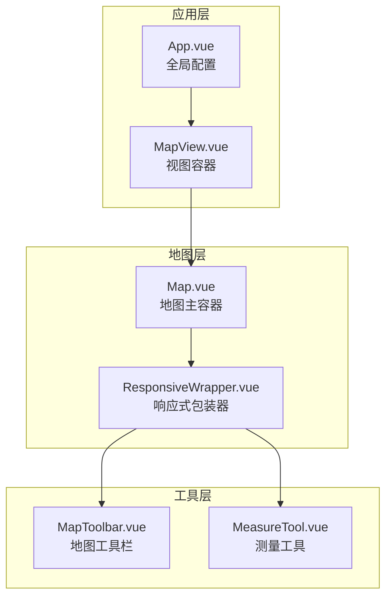

**图表来源**
- [App.vue](file://src/App.vue#L1-L162)
- [MapView.vue](file://src/views/MapView.vue#L1-L171)
- [Map.vue](file://src/mapComponents/Map.vue#L1-L432)
- [ResponsiveWrapper.vue](file://src/components/ResponsiveWrapper.vue#L1-L211)

**章节来源**
- [App.vue](file://src/App.vue#L1-L162)
- [MapView.vue](file://src/views/MapView.vue#L1-L171)
- [Map.vue](file://src/mapComponents/Map.vue#L1-L432)

## 核心组件

### ResponsiveWrapper组件架构

ResponsiveWrapper组件采用了现代化的Vue 3架构设计，结合了组合式API的强大功能：

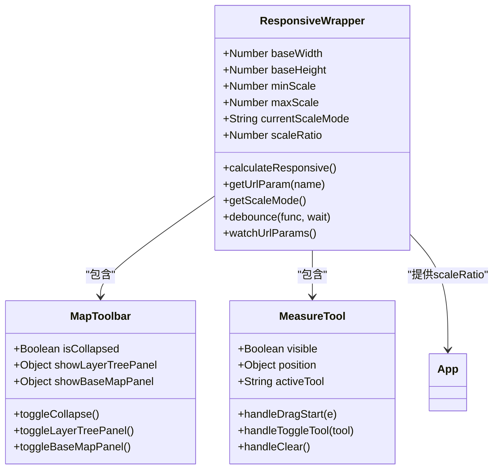

**图表来源**
- [ResponsiveWrapper.vue](file://src/components/ResponsiveWrapper.vue#L15-L135)
- [MapToolbar.vue](file://src/mapComponents/MapToolbar.vue#L78-L333)
- [MeasureTool.vue](file://src/mapComponents/MeasureTool.vue#L43-L137)

### 核心功能特性

ResponsiveWrapper组件实现了以下核心功能：

1. **自适应缩放计算**：基于窗口尺寸动态计算缩放比例
2. **多模式缩放支持**：支持按宽度或高度进行缩放
3. **URL参数控制**：通过URL参数动态调整缩放模式
4. **性能优化**：内置防抖机制减少频繁重绘
5. **状态管理**：提供响应式数据供子组件使用

**章节来源**
- [ResponsiveWrapper.vue](file://src/components/ResponsiveWrapper.vue#L15-L135)

## 架构概览

### 响应式布局工作原理

ResponsiveWrapper组件通过CSS Transform的scale属性实现界面元素的自适应缩放：

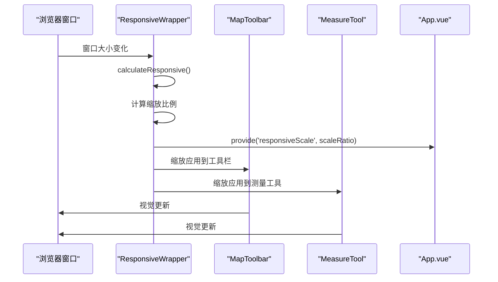

**图表来源**
- [ResponsiveWrapper.vue](file://src/components/ResponsiveWrapper.vue#L67-L92)
- [Map.vue](file://src/mapComponents/Map.vue#L192-L194)

### 插槽使用模式

ResponsiveWrapper作为容器组件，采用了标准的Vue插槽模式：

**图表来源**
- [ResponsiveWrapper.vue](file://src/components/ResponsiveWrapper.vue#L2-L10)

**章节来源**
- [ResponsiveWrapper.vue](file://src/components/ResponsiveWrapper.vue#L2-L10)

## 详细组件分析

### 缩放算法实现

ResponsiveWrapper的核心是其智能的缩放算法，该算法能够根据不同的场景需求自动调整界面元素的大小：

#### 缩放模式选择

组件支持两种主要的缩放模式：

1. **宽度优先模式** (`width`): 基于屏幕宽度进行缩放
2. **高度优先模式** (`height`): 基于屏幕高度进行缩放

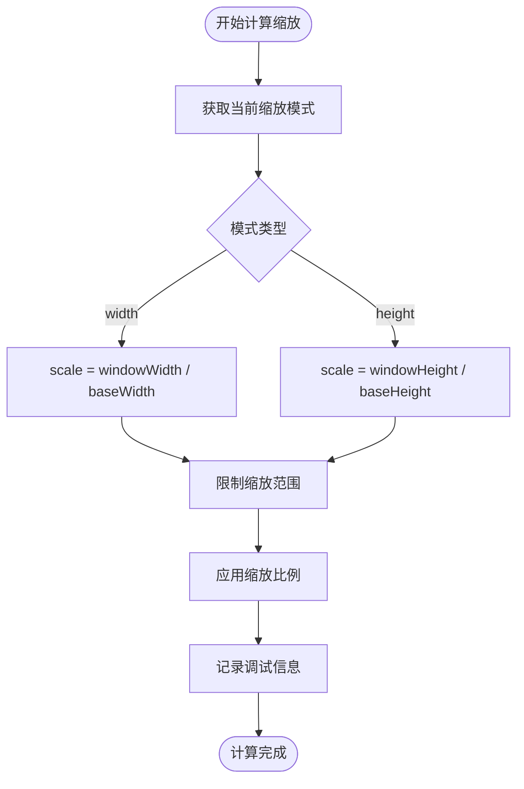

**图表来源**
- [ResponsiveWrapper.vue](file://src/components/ResponsiveWrapper.vue#L67-L92)

#### URL参数控制系统

组件提供了灵活的URL参数控制系统，允许通过URL动态调整缩放行为：

| 参数名 | 类型 | 默认值 | 说明 |
|--------|------|--------|------|
| `showStyle` | String | 'width' | 缩放模式：'width' 或 'height' |

**章节来源**
- [ResponsiveWrapper.vue](file://src/components/ResponsiveWrapper.vue#L42-L54)

### 全局样式协同机制

ResponsiveWrapper与App.vue中的全局样式形成了良好的协同工作机制：

#### 样式隔离与交互

组件通过精心设计的CSS规则实现了样式隔离与交互的平衡：

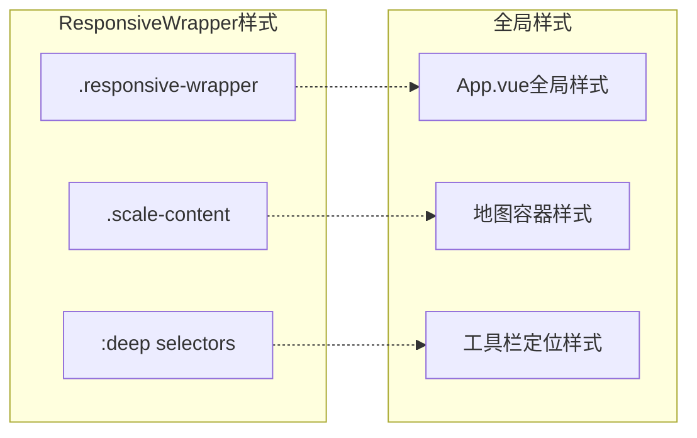

**图表来源**
- [ResponsiveWrapper.vue](file://src/components/ResponsiveWrapper.vue#L138-L211)
- [App.vue](file://src/App.vue#L35-L162)

#### 指针事件管理

组件实现了精细的指针事件管理系统，确保用户交互的流畅性：

| 元素类别 | 指针事件状态 | 说明 |
|----------|-------------|------|
| `.header` | `pointer-events: auto` | 头部区域可交互 |
| `.left-content` | `pointer-events: auto` | 左侧面板可交互 |
| `.right-content` | `pointer-events: auto` | 右侧面板可交互 |
| `.map-toolbar` | `pointer-events: auto` | 地图工具栏可交互 |
| `.sidebar-module` | `pointer-events: auto` | 侧边栏模块可交互 |
| `.login-card` | `pointer-events: auto` | 登录卡片可交互 |
| 其他元素 | `pointer-events: none` | 默认禁用交互 |

**章节来源**
- [ResponsiveWrapper.vue](file://src/components/ResponsiveWrapper.vue#L148-L156)

### 子组件集成模式

#### MapToolbar集成

ResponsiveWrapper与MapToolbar的集成展示了组件化设计的最佳实践：

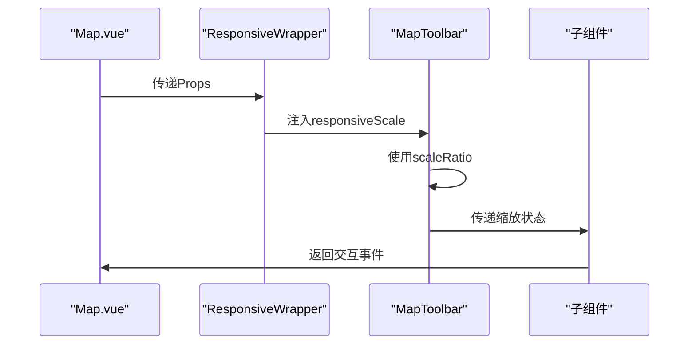

**图表来源**
- [Map.vue](file://src/mapComponents/Map.vue#L40-L49)
- [ResponsiveWrapper.vue](file://src/components/ResponsiveWrapper.vue#L114-L116)

#### MeasureTool集成

测量工具的集成同样体现了响应式设计的理念：

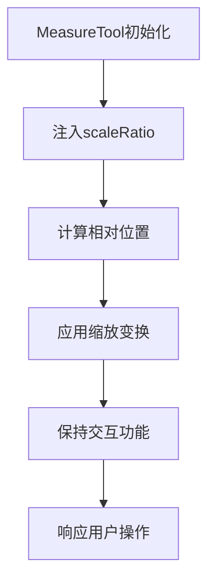

**图表来源**
- [MeasureTool.vue](file://src/mapComponents/MeasureTool.vue#L43-L62)

**章节来源**
- [Map.vue](file://src/mapComponents/Map.vue#L40-L49)
- [MeasureTool.vue](file://src/mapComponents/MeasureTool.vue#L43-L62)

### 性能优化策略

#### 防抖机制

组件实现了高效的防抖机制来优化性能：

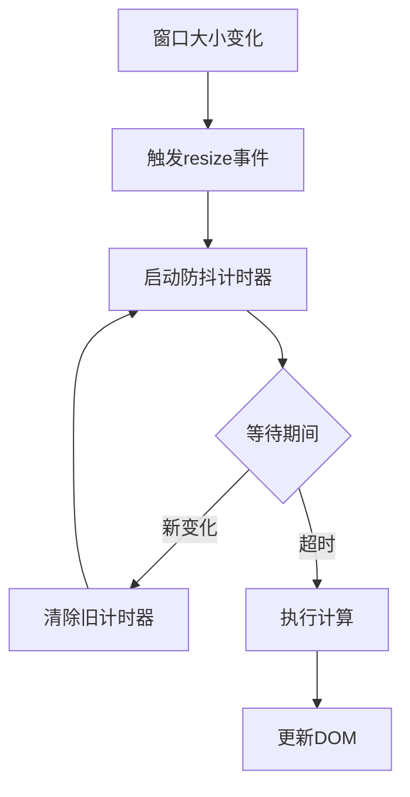

**图表来源**
- [ResponsiveWrapper.vue](file://src/components/ResponsiveWrapper.vue#L104-L111)

#### MutationObserver监控

组件使用MutationObserver来监听URL参数的变化：

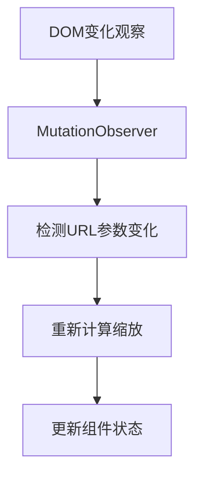

**图表来源**
- [ResponsiveWrapper.vue](file://src/components/ResponsiveWrapper.vue#L121-L123)

**章节来源**
- [ResponsiveWrapper.vue](file://src/components/ResponsiveWrapper.vue#L104-L123)

## 依赖关系分析

### 组件依赖图

ResponsiveWrapper组件的依赖关系体现了清晰的分层架构：

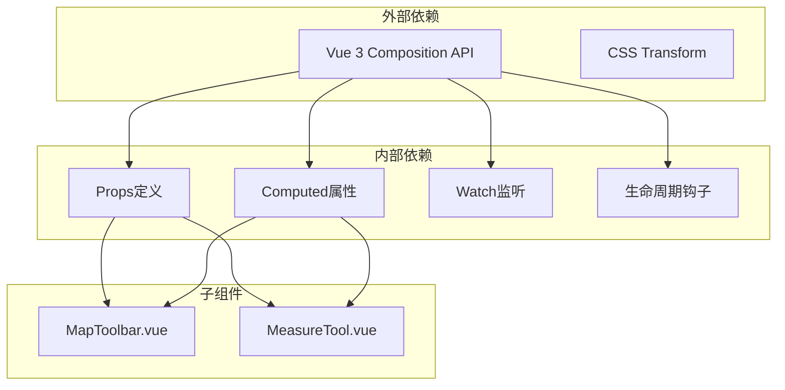

**图表来源**
- [ResponsiveWrapper.vue](file://src/components/ResponsiveWrapper.vue#L15-L135)
- [Map.vue](file://src/mapComponents/Map.vue#L60-L65)

### 提供和注入机制

组件使用Vue的Provide/Inject机制实现跨层级的状态共享：

| 提供的服务 | 类型 | 用途 |
|-----------|------|------|
| `responsiveScale` | Ref\<number\> | 缩放比例提供给子组件 |

**章节来源**
- [ResponsiveWrapper.vue](file://src/components/ResponsiveWrapper.vue#L114-L116)

## 性能考虑

### 渲染优化

ResponsiveWrapper组件采用了多种性能优化策略：

1. **Transform优化**：使用CSS Transform而非改变尺寸属性
2. **Will-Change属性**：预声明transform变化以获得硬件加速
3. **防抖处理**：减少频繁的重计算
4. **条件渲染**：只在必要时更新样式

### 内存管理

组件实现了完善的生命周期管理：

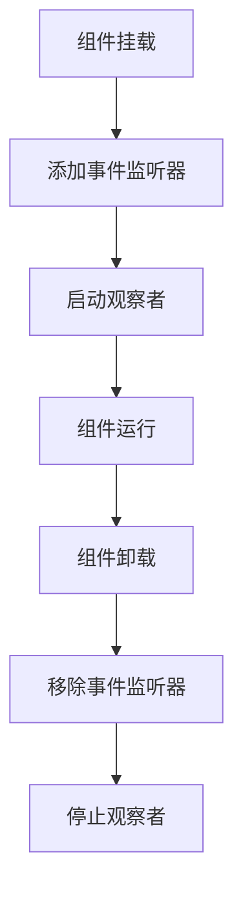

**图表来源**
- [ResponsiveWrapper.vue](file://src/components/ResponsiveWrapper.vue#L117-L128)

## 故障排除指南

### 常见问题及解决方案

#### 缩放不生效

**问题描述**：界面元素没有正确缩放

**可能原因**：
1. 父容器尺寸未正确设置
2. CSS样式冲突
3. 浏览器兼容性问题

**解决方案**：
1. 检查父容器的position属性
2. 验证CSS优先级
3. 测试不同浏览器的兼容性

#### 子组件交互失效

**问题描述**：工具栏或测量工具无法正常交互

**可能原因**：
1. pointer-events被意外覆盖
2. z-index层级问题
3. 事件冒泡被阻止

**解决方案**：
1. 检查CSS选择器优先级
2. 调整z-index值
3. 确认事件处理逻辑

**章节来源**
- [ResponsiveWrapper.vue](file://src/components/ResponsiveWrapper.vue#L148-L156)

## 结论

ResponsiveWrapper.vue组件是政府仪表板项目中响应式设计的重要基石。它通过创新的CSS Transform缩放技术，成功解决了多分辨率环境下界面元素的自适应问题。组件的设计充分体现了现代前端开发的最佳实践：

1. **架构清晰**：采用分层架构，职责明确
2. **性能优秀**：通过防抖和硬件加速优化性能
3. **扩展性强**：支持多种缩放模式和配置选项
4. **维护友好**：代码结构清晰，易于理解和维护

该组件不仅为地图工具栏和测量工具提供了可靠的响应式基础，更为整个项目的可扩展性和用户体验奠定了坚实的基础。随着项目的发展，这个组件将继续发挥重要作用，支撑更多复杂场景下的响应式需求。