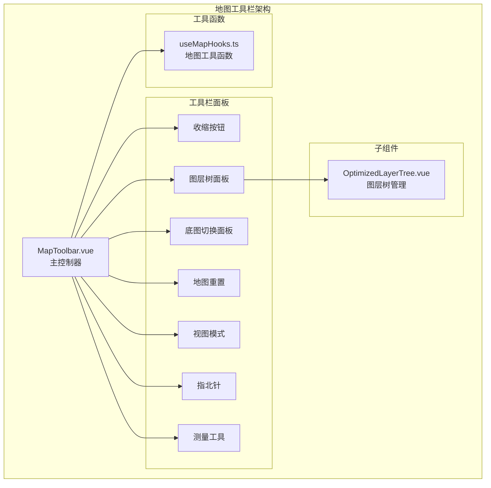
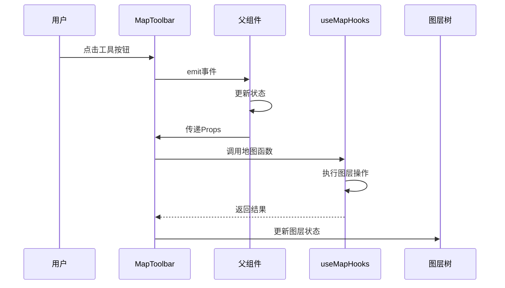
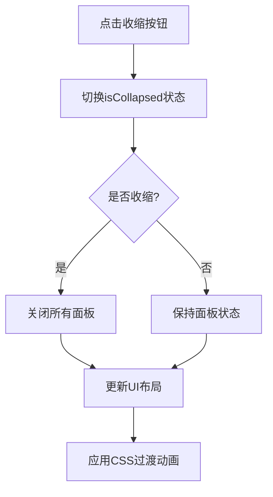
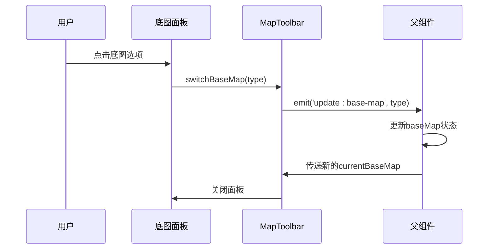
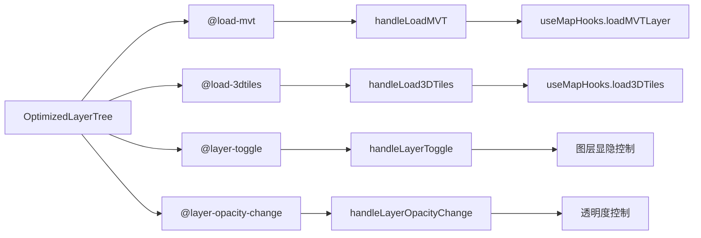
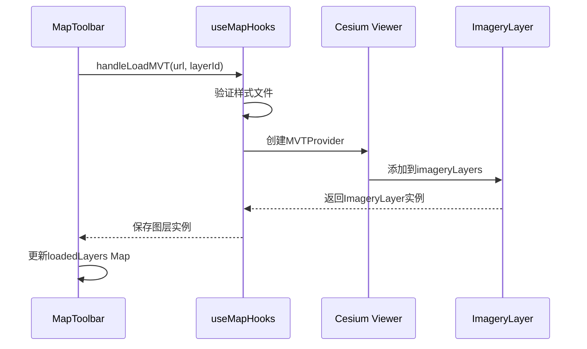
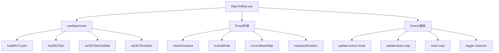
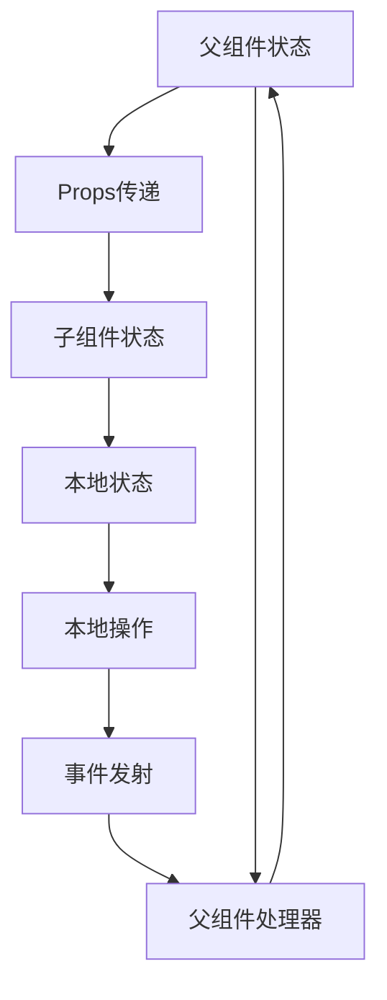
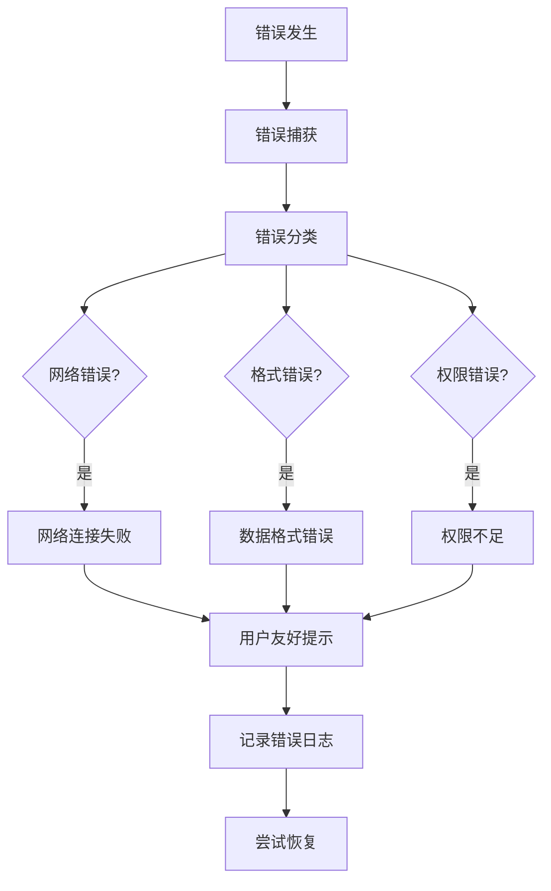

# 地图工具栏组件全面文档

<cite>
**本文档引用的文件**
- [MapToolbar.vue](file://src/mapComponents/MapToolbar.vue)
- [useMapHooks.ts](file://src/hook/useMapHooks.ts)
- [mapConfig.ts](file://src/config/mapConfig.ts)
- [mapStore.ts](file://src/stores/mapStore.ts)
- [OptimizedLayerTree.vue](file://src/mapComponents/OptimizedLayerTree.vue)
- [README_LAYER_TREE.md](file://src/mapComponents/README_LAYER_TREE.md)
- [MAP_TOOLBAR_INTEGRATION.md](file://MAP_TOOLBAR_INTEGRATION.md)
</cite>

## 目录
1. [概述](#概述)
2. [组件架构](#组件架构)
3. [核心功能模块](#核心功能模块)
4. [工具栏交互逻辑](#工具栏交互逻辑)
5. [底图切换系统](#底图切换系统)
6. [图层树集成](#图层树集成)
7. [图层管理机制](#图层管理机制)
8. [事件通信模式](#事件通信模式)
9. [状态管理](#状态管理)
10. [性能优化](#性能优化)
11. [错误处理](#错误处理)
12. [最佳实践](#最佳实践)

## 概述

MapToolbar.vue是一个功能完整的地图交互控制中心，作为政府Dashboard项目中地图模块的核心组件，提供了一系列地图操作工具和界面控制功能。该组件采用现代化的Vue 3 Composition API设计，实现了响应式的工具栏界面和高效的图层管理系统。

### 主要特性

- **收缩/展开交互**：支持工具栏的收缩和展开，节省屏幕空间
- **多维度地图控制**：提供底图切换、视图模式切换、指北针控制等功能
- **图层树集成**：深度集成OptimizedLayerTree组件，支持MVT和3D Tiles图层管理
- **实时状态同步**：与父组件建立双向通信，确保状态一致性
- **错误处理机制**：完善的错误捕获和用户友好的提示系统

## 组件架构

### 组件层次结构



**图表来源**
- [MapToolbar.vue](file://src/mapComponents/MapToolbar.vue#L1-L75)
- [OptimizedLayerTree.vue](file://src/mapComponents/OptimizedLayerTree.vue#L1-L50)

### 数据流向



**图表来源**
- [MapToolbar.vue](file://src/mapComponents/MapToolbar.vue#L95-L100)
- [useMapHooks.ts](file://src/hook/useMapHooks.ts#L33-L545)

**章节来源**
- [MapToolbar.vue](file://src/mapComponents/MapToolbar.vue#L1-L75)
- [MAP_TOOLBAR_INTEGRATION.md](file://MAP_TOOLBAR_INTEGRATION.md#L1-L50)

## 核心功能模块

### 工具栏基础功能

MapToolbar组件提供了七个核心功能模块，每个模块都有独特的交互逻辑和视觉反馈：

#### 1. 收缩/展开控制
- **实现机制**：通过`isCollapsed`状态控制工具栏的显示/隐藏
- **交互行为**：点击收缩按钮时切换状态，同时关闭所有打开的面板
- **视觉效果**：使用CSS过渡动画实现平滑的展开/收缩效果

#### 2. 图层树管理
- **集成方式**：深度集成OptimizedLayerTree组件
- **功能特性**：支持图层的显示/隐藏、透明度调节、搜索过滤
- **状态管理**：维护图层的加载状态和错误信息

#### 3. 底图切换系统
- **支持类型**：影像地图、矢量地图、地形地图三种底图类型
- **切换逻辑**：通过`currentBaseMap`属性控制当前底图类型
- **面板交互**：点击底图按钮显示切换面板，点击其他地方关闭

#### 4. 地图重置功能
- **操作行为**：重置地图到初始状态
- **触发方式**：点击重置按钮
- **状态恢复**：清除所有自定义设置，恢复默认配置

#### 5. 2D/3D视图切换
- **模式控制**：在2D和3D视图之间切换
- **状态同步**：通过`sceneMode`属性管理当前视图模式
- **用户体验**：提供即时的视图切换反馈

#### 6. 指北针控制
- **方向指示**：显示当前地图的正北方向
- **旋转动画**：指北针随相机旋转而自动调整角度
- **重置功能**：点击指北针可重置到正北方向

#### 7. 测量工具
- **工具集成**：提供测量工具的开关控制
- **事件通信**：通过`toggle-measure`事件与父组件通信
- **状态管理**：支持测量工具的开启/关闭状态

**章节来源**
- [MapToolbar.vue](file://src/mapComponents/MapToolbar.vue#L1-L75)
- [MapToolbar.vue](file://src/mapComponents/MapToolbar.vue#L112-L306)

## 工具栏交互逻辑

### 收缩/展开机制

工具栏的收缩/展开功能是通过状态驱动的方式实现的，具有以下特点：

#### 状态管理
- **isCollapsed**：布尔值状态，控制工具栏的显示/隐藏
- **面板状态**：收缩时自动关闭所有打开的面板
- **视觉反馈**：使用CSS类名切换实现不同的布局样式

#### 交互流程



**图表来源**
- [MapToolbar.vue](file://src/mapComponents/MapToolbar.vue#L118-L126)

#### 面板互斥逻辑

工具栏实现了智能的面板互斥机制，确保同一时间只有一个面板处于打开状态：

- **图层树面板优先**：打开图层树时自动关闭底图面板
- **底图面板优先**：打开底图面板时自动关闭图层树面板
- **状态同步**：通过`showLayerTreePanel`和`showBaseMapPanel`两个独立状态管理

### 面板显示控制

每个功能面板都采用了条件渲染和过渡动画相结合的方式：

#### 条件渲染机制
- **v-if指令**：根据面板状态决定是否渲染面板内容
- **transition组件**：为面板显示/隐藏添加动画效果
- **slide-left动画**：面板从右侧滑入的动画效果

#### 动画配置
- **进入动画**：`slide-left-enter-active` - 0.3秒过渡时间
- **离开动画**：`slide-left-leave-active` - 0.3秒过渡时间
- **关键帧**：从透明+偏移状态到完全显示状态

**章节来源**
- [MapToolbar.vue](file://src/mapComponents/MapToolbar.vue#L118-L144)
- [MapToolbar.vue](file://src/mapComponents/MapToolbar.vue#L387-L502)

## 底图切换系统

### 底图类型配置

MapToolbar支持三种基础底图类型的切换，每种类型都有明确的标识和视觉效果：

#### 底图类型定义

| 类型 | 值 | 标签 | 图标 | 特点 |
|------|----|----- |----- |------|
| 影像地图 | img | 影像地图 | 🛰️ | 高分辨率卫星影像，适合详细观察 |
| 矢量地图 | vec | 矢量地图 | 🗺️ | 矢量渲染，可调整颜色和样式 |
| 地形地图 | ter | 地形地图 | 🏔️ | 地形高程显示，适合地形分析 |

### 底图切换面板实现

底图切换面板采用了简洁直观的设计，提供清晰的视觉反馈：

#### 面板结构
- **标题区域**：显示"底图切换"标题
- **选项列表**：垂直排列的底图选项
- **激活状态**：当前选中的底图显示高亮效果

#### 交互设计
- **悬停效果**：鼠标悬停时选项向左移动并变色
- **激活样式**：当前底图选项显示蓝色边框和加粗文字
- **点击行为**：点击任意选项立即切换底图并关闭面板

### 切换逻辑机制

底图切换遵循严格的单选逻辑和状态同步机制：

#### 切换流程


**图表来源**
- [MapToolbar.vue](file://src/mapComponents/MapToolbar.vue#L288-L292)

#### 状态管理
- **currentBaseMap**：父组件传递的当前底图类型
- **baseMapTypes**：预定义的底图类型配置数组
- **active状态**：通过CSS类名实现的视觉激活效果

**章节来源**
- [MapToolbar.vue](file://src/mapComponents/MapToolbar.vue#L112-L116)
- [MapToolbar.vue](file://src/mapComponents/MapToolbar.vue#L288-L292)

## 图层树集成

### 集成架构

MapToolbar与OptimizedLayerTree组件建立了深度的集成关系，形成了完整的图层管理体系：

#### 集成特点
- **组件封装**：OptimizedLayerTree作为MapToolbar的子组件
- **事件通信**：通过自定义事件实现父子组件通信
- **状态共享**：共享图层加载状态和错误信息

### 图层树面板设计

图层树面板采用了现代化的UI设计，提供良好的用户体验：

#### 面板特性
- **宽度配置**：固定400px宽度，适中的显示范围
- **背景效果**：半透明背景+毛玻璃效果
- **边框设计**：蓝色边框和圆角设计
- **阴影效果**：立体阴影增强视觉层次

#### 内容布局
- **标题栏**：显示"图层"标题
- **搜索框**：支持图层名称搜索
- **图层数统计**：显示当前图层数量
- **图层树**：展示完整的图层树结构

### 事件处理机制

图层树组件通过四个关键事件与MapToolbar进行通信：

#### 事件定义

| 事件名 | 参数 | 用途 |
|--------|------|------|
| load-mvt | url, layerId | 加载MVT矢量瓦片图层 |
| load-3dtiles | url, layerId | 加载3D Tiles三维模型 |
| layer-toggle | layerId, visible, layerData | 图层显隐切换 |
| layer-opacity-change | layerId, opacity | 图层透明度调整 |

#### 事件流程



**图表来源**
- [MapToolbar.vue](file://src/mapComponents/MapToolbar.vue#L18-L23)
- [OptimizedLayerTree.vue](file://src/mapComponents/OptimizedLayerTree.vue#L85-L90)

**章节来源**
- [MapToolbar.vue](file://src/mapComponents/MapToolbar.vue#L18-L23)
- [OptimizedLayerTree.vue](file://src/mapComponents/OptimizedLayerTree.vue#L1-L50)
- [README_LAYER_TREE.md](file://src/mapComponents/README_LAYER_TREE.md#L1-L50)

## 图层管理机制

### 图层类型支持

MapToolbar支持多种图层类型的加载和管理，每种类型都有专门的处理逻辑：

#### 支持的图层类型

| 类型 | 描述 | 加载方法 | 控制方式 |
|------|------|----------|----------|
| MVT | 矢量瓦片图层 | loadMVTLayer | ImageryLayer.show属性 |
| 3dTile | 3D Tiles模型 | load3DTiles | Cesium3DTileset.show属性 |
| tile | 普通瓦片图层 | layer-toggle | 通用图层控制 |
| wms | WMS服务图层 | layer-toggle | 通用图层控制 |

### 图层加载流程

图层加载采用了异步处理和状态管理相结合的方式：

#### MVT图层加载



**图表来源**
- [MapToolbar.vue](file://src/mapComponents/MapToolbar.vue#L146-L185)
- [useMapHooks.ts](file://src/hook/useMapHooks.ts#L40-L92)

#### 3D Tiles图层加载

3D Tiles图层的加载过程更加复杂，涉及更多的配置和优化：

- **初始化配置**：设置最大屏幕空间误差和内存使用限制
- **准备等待**：等待tileset完全加载完成
- **相机调整**：自动调整相机视角以适应模型
- **可见性控制**：支持运行时的显示/隐藏控制

### 图层状态管理

图层状态通过Map数据结构进行管理，提供高效的状态查询和更新：

#### 状态结构
```typescript
interface LayerState {
  visible: boolean;    // 是否可见
  opacity: number;     // 透明度 (0-1)
  loading: boolean;    // 加载状态
  error: string | null; // 错误信息
}
```

#### 状态更新机制
- **Map存储**：使用`loadedLayers` Map存储图层实例
- **状态映射**：通过图层ID快速查找和更新状态
- **错误处理**：记录详细的错误信息供用户参考

### 图层显隐控制

图层显隐控制是地图应用中最频繁的操作之一，需要精确的状态管理：

#### 控制逻辑
- **显示逻辑**：检查图层是否存在，不存在则先加载
- **隐藏逻辑**：根据图层类型调用相应的隐藏方法
- **状态同步**：及时更新图层状态和UI反馈

#### 透明度调整

透明度调整支持两种图层类型的差异化处理：

- **MVT图层**：通过`alpha`属性控制透明度
- **3D Tiles**：通过Cesium3DTileStyle设置颜色透明度

**章节来源**
- [MapToolbar.vue](file://src/mapComponents/MapToolbar.vue#L146-L286)
- [useMapHooks.ts](file://src/hook/useMapHooks.ts#L40-L180)

## 事件通信模式

### 父子组件通信架构

MapToolbar采用了标准的Vue父子组件通信模式，通过Props传递状态，通过Events通知变更：

#### Props传递

```typescript
interface Props {
  viewerInstance: any;           // Cesium Viewer实例
  sceneMode: 2 | 3;             // 场景模式 (2=2D, 3=3D)
  currentBaseMap: 'vec' | 'img' | 'ter'; // 当前底图类型
  compassRotation: number;       // 指北针旋转角度
}
```

#### Events通知

MapToolbar通过四个关键事件与父组件通信：

| 事件名 | 参数 | 触发时机 | 用途 |
|--------|------|----------|------|
| update:scene-mode | mode: 2 \| 3 | 视图模式切换 | 更新场景模式 |
| update:base-map | type: 'vec' \| 'img' \| 'ter' | 底图切换 | 更新底图类型 |
| reset-map | 无 | 地图重置 | 重置地图状态 |
| toggle-measure | 无 | 测量工具切换 | 切换测量工具 |

### 依赖注入模式

组件通过依赖注入的方式获取地图工具函数：

#### useMapHooks集成
- **函数注入**：通过`useMapHooks()`获取地图操作函数
- **类型安全**：完整的TypeScript类型定义
- **功能封装**：将复杂的Cesium操作封装为易用的函数

#### 依赖关系图



**图表来源**
- [MapToolbar.vue](file://src/mapComponents/MapToolbar.vue#L78-L100)
- [useMapHooks.ts](file://src/hook/useMapHooks.ts#L33-L545)

### 通信最佳实践

#### 状态同步原则
- **单向数据流**：父组件管理状态，子组件响应状态变化
- **事件驱动**：子组件通过事件通知父组件状态变更
- **类型安全**：使用TypeScript确保类型正确性

#### 错误处理策略
- **事件传播**：错误通过事件向上层传播
- **状态标记**：在状态中记录错误信息
- **用户提示**：提供友好的错误提示信息

**章节来源**
- [MapToolbar.vue](file://src/mapComponents/MapToolbar.vue#L78-L100)
- [MapToolbar.vue](file://src/mapComponents/MapToolbar.vue#L95-L100)

## 状态管理

### 本地状态管理

MapToolbar维护了多个本地状态变量，用于控制UI行为和用户交互：

#### UI状态变量

| 变量名 | 类型 | 默认值 | 用途 |
|--------|------|--------|------|
| isCollapsed | ref<boolean> | false | 工具栏收缩状态 |
| showLayerTreePanel | ref<boolean> | false | 图层树面板显示状态 |
| showBaseMapPanel | ref<boolean> | false | 底图切换面板显示状态 |
| layerTreeRef | ref<any> | null | 图层树组件引用 |

#### 图层状态管理

- **loadedLayers**：Map结构，存储已加载图层的实例和状态
- **状态持久化**：图层状态在组件销毁后仍然保持
- **状态查询**：通过图层ID快速获取图层状态

### 状态同步机制

#### 与父组件的状态同步



**图表来源**
- [MapToolbar.vue](file://src/mapComponents/MapToolbar.vue#L84-L100)

#### 状态更新流程

1. **父组件更新**：父组件修改状态并重新渲染
2. **Props传递**：新的Props值传递给子组件
3. **状态同步**：子组件更新本地状态
4. **UI刷新**：组件重新渲染以反映新状态

### 状态持久化

#### 图层状态持久化
- **Map存储**：使用JavaScript Map对象存储图层状态
- **键值对结构**：以图层ID为键，图层信息为值
- **生命周期管理**：组件销毁时保留状态，便于恢复

#### 用户偏好持久化
- **收缩状态**：记住用户的工具栏显示偏好
- **面板状态**：记住上次打开的面板
- **配置记忆**：记住用户的常用设置

**章节来源**
- [MapToolbar.vue](file://src/mapComponents/MapToolbar.vue#L102-L111)
- [MapToolbar.vue](file://src/mapComponents/MapToolbar.vue#L328-L333)

## 性能优化

### 渲染优化

#### 条件渲染策略
- **v-if vs v-show**：关键面板使用v-if实现真正的条件渲染
- **懒加载**：面板内容仅在需要时才渲染
- **减少DOM节点**：收缩状态下移除不必要的DOM元素

#### 动画优化
- **CSS过渡**：使用CSS3过渡实现流畅的动画效果
- **硬件加速**：利用GPU加速提升动画性能
- **动画节流**：避免频繁的状态变化导致的动画冲突

### 内存管理

#### 图层实例管理
- **弱引用**：合理使用WeakMap避免内存泄漏
- **及时清理**：组件销毁时清理图层实例引用
- **状态复用**：复用相同图层的实例，避免重复加载

#### 事件监听优化
- **事件委托**：使用事件委托减少事件监听器数量
- **及时解绑**：组件销毁时移除所有事件监听器
- **防抖处理**：对高频事件进行防抖处理

### 网络优化

#### 图层加载优化
- **并发控制**：限制同时加载的图层数量
- **缓存策略**：缓存已加载的图层实例
- **错误重试**：实现智能的错误重试机制

#### 数据传输优化
- **压缩传输**：使用gzip等压缩算法减少传输数据量
- **增量更新**：只传输变化的数据部分
- **预加载策略**：预测用户需求提前加载相关内容

**章节来源**
- [MapToolbar.vue](file://src/mapComponents/MapToolbar.vue#L387-L502)
- [MapToolbar.vue](file://src/mapComponents/MapToolbar.vue#L146-L286)

## 错误处理

### 错误分类体系

MapToolbar实现了完善的错误分类和处理机制：

#### 图层加载错误

| 错误类型 | 检测方式 | 用户友好提示 | 处理策略 |
|----------|----------|--------------|----------|
| 网络错误 | HTTP状态码404/500 | "样式文件不存在" | 提供重试按钮 |
| 格式错误 | JSON解析失败 | "样式文件格式错误" | 显示错误详情 |
| 权限错误 | 认证失败 | "权限不足" | 引导用户登录 |
| 版本不兼容 | Cesium版本检测 | "Cesium版本不兼容" | 提示升级 |

#### 底图切换错误
- **网络超时**：天地图API请求超时处理
- **配额限制**：达到API调用配额时的降级处理
- **参数错误**：无效的底图类型参数

### 错误处理流程



**图表来源**
- [MapToolbar.vue](file://src/mapComponents/MapToolbar.vue#L161-L184)
- [MapToolbar.vue](file://src/mapComponents/MapToolbar.vue#L201-L223)

### 用户体验优化

#### 错误提示设计
- **视觉反馈**：使用红色警告图标和醒目的文本
- **信息丰富**：提供具体的错误原因和解决建议
- **操作指引**：提供重试、忽略等操作选项

#### 日志记录系统
- **错误追踪**：记录详细的错误堆栈信息
- **用户行为**：记录用户在出错前的操作序列
- **环境信息**：记录浏览器版本、网络状况等环境信息

### 恢复机制

#### 自动恢复
- **重试机制**：网络错误时自动重试1-3次
- **降级处理**：主服务不可用时使用备用服务
- **状态回滚**：操作失败时回滚到之前的状态

#### 手动恢复
- **重试按钮**：提供明确的重试操作入口
- **刷新页面**：在严重错误时提供页面刷新选项
- **联系支持**：提供技术支持联系方式

**章节来源**
- [MapToolbar.vue](file://src/mapComponents/MapToolbar.vue#L161-L184)
- [MapToolbar.vue](file://src/mapComponents/MapToolbar.vue#L201-L223)

## 最佳实践

### 开发规范

#### 组件设计原则
- **单一职责**：每个组件只负责一个特定的功能领域
- **松耦合**：组件间通过事件和Props进行通信
- **高内聚**：相关功能集中在同一个组件内部

#### 代码组织
- **模块化**：将不同功能分离到不同的模块中
- **可复用性**：设计可复用的子组件和工具函数
- **测试友好**：编写易于测试的组件和函数

### 性能最佳实践

#### 渲染性能
- **虚拟化**：对于大量数据的列表使用虚拟滚动
- **懒加载**：按需加载组件和数据
- **防抖节流**：对高频操作进行防抖或节流处理

#### 内存管理
- **及时清理**：组件销毁时清理所有资源
- **避免循环引用**：防止内存泄漏
- **合理使用缓存**：平衡内存使用和性能提升

### 安全考虑

#### 输入验证
- **参数校验**：对所有输入参数进行严格校验
- **类型检查**：使用TypeScript确保类型安全
- **边界检查**：防止数组越界等常见问题

#### 权限控制
- **访问控制**：根据用户权限控制功能可用性
- **数据脱敏**：敏感数据进行适当的脱敏处理
- **审计日志**：记录重要操作的审计信息

### 可维护性

#### 文档规范
- **代码注释**：为复杂逻辑添加详细的注释
- **API文档**：为公共接口提供完整的文档
- **变更日志**：记录重要的功能变更和修复

#### 测试策略
- **单元测试**：为关键功能编写单元测试
- **集成测试**：测试组件间的集成效果
- **端到端测试**：模拟真实用户操作流程

### 兼容性处理

#### 浏览器兼容
- **渐进增强**：在基础功能上提供高级特性
- **polyfill使用**：为旧浏览器提供必要的polyfill
- **特性检测**：运行时检测浏览器特性支持情况

#### 设备适配
- **响应式设计**：适配不同尺寸的屏幕
- **触摸优化**：为移动设备提供优化的触摸交互
- **性能适配**：根据设备性能调整功能复杂度

**章节来源**
- [MAP_TOOLBAR_INTEGRATION.md](file://MAP_TOOLBAR_INTEGRATION.md#L1-L100)
- [README_LAYER_TREE.md](file://src/mapComponents/README_LAYER_TREE.md#L200-L252)