# 地图组件

<cite>
**本文档引用的文件**
- [Map.vue](file://src/mapComponents/Map.vue)
- [MeasureTool.vue](file://src/mapComponents/MeasureTool.vue)
- [MapToolbar.vue](file://src/mapComponents/MapToolbar.vue)
- [useMapHooks.ts](file://src/hook/useMapHooks.ts)
- [mapConfig.ts](file://src/config/mapConfig.ts)
- [OptimizedLayerTree.vue](file://src/mapComponents/OptimizedLayerTree.vue)
- [README_LAYER_TREE.md](file://src/mapComponents/README_LAYER_TREE.md)
- [package.json](file://package.json)
- [yangxin.json](file://public/yangxin.json)
</cite>

## 更新摘要
**变更内容**
- 新增MVT矢量瓦片支持，通过`mvt-imagery-provider`库实现
- 增强3D Tiles集成，提供更好的模型加载和样式控制
- 改进图层管理系统，统一管理MVT和3D Tiles图层
- 优化相机边界限制功能，支持更精确的地理范围控制
- 新增图层树组件，提供可视化的图层管理界面

## 目录
1. [简介](#简介)
2. [项目结构](#项目结构)
3. [核心组件](#核心组件)
4. [架构概览](#架构概览)
5. [详细组件分析](#详细组件分析)
6. [MVT矢量瓦片系统](#mvt矢量瓦片系统)
7. [3D Tiles增强集成](#3d-tiles增强集成)
8. [图层管理系统](#图层管理系统)
9. [依赖关系分析](#依赖关系分析)
10. [性能考虑](#性能考虑)
11. [故障排除指南](#故障排除指南)
12. [结论](#结论)

## 简介

Map.vue 是一个基于 Vue-Cesium 的三维地图核心容器组件，专为阳新县政府dashboard设计。该组件集成了天地图底图服务、MVT矢量瓦片、3D Tiles模型展示、GeoJSON边界限制、测量工具集成等功能，提供了完整的三维地理信息系统解决方案。

**更新** 新增了对MVT矢量瓦片的原生支持，通过`mvt-imagery-provider`库实现，同时增强了3D Tiles的集成能力和图层管理功能。

## 项目结构

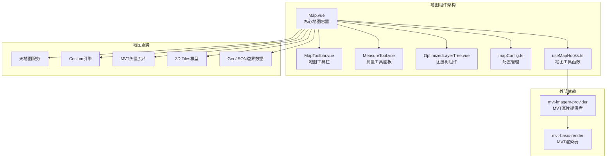

**图表来源**
- [Map.vue](file://src/mapComponents/Map.vue#L1-L76)
- [MapToolbar.vue](file://src/mapComponents/MapToolbar.vue#L1-L561)
- [OptimizedLayerTree.vue](file://src/mapComponents/OptimizedLayerTree.vue#L1-L490)
- [useMapHooks.ts](file://src/hook/useMapHooks.ts#L1-L545)

**章节来源**
- [Map.vue](file://src/mapComponents/Map.vue#L1-L627)
- [MapToolbar.vue](file://src/mapComponents/MapToolbar.vue#L1-L561)
- [OptimizedLayerTree.vue](file://src/mapComponents/OptimizedLayerTree.vue#L1-L490)

## 核心组件

### vc-viewer 组件初始化

Map.vue 作为三维地图的核心容器，通过 vc-viewer 组件实现了完整的 Cesium 地图功能：

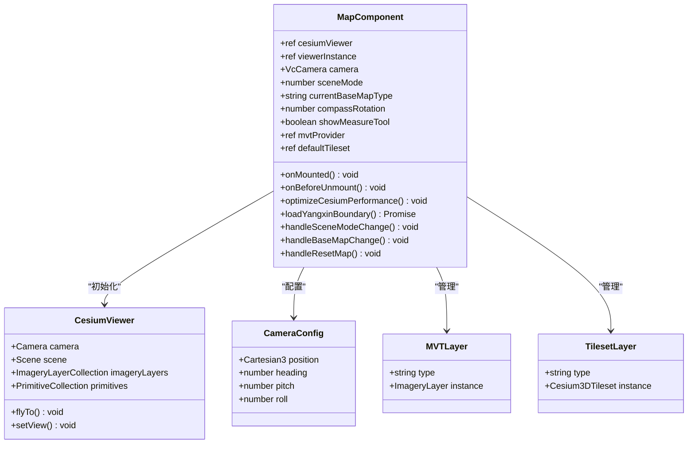

**图表来源**
- [Map.vue](file://src/mapComponents/Map.vue#L123-L125)
- [useMapHooks.ts](file://src/hook/useMapHooks.ts#L18-L26)

### 相机初始配置

组件设置了科学的相机初始位置和场景模式：

| 配置项 | 值 | 说明 |
|--------|-----|------|
| 初始位置 | [115.186322, 29.864861, 50000] | 阳新县中心坐标，50公里高度 |
| 场景模式 | 3D | 默认3D模式浏览 |
| 相机朝向 | heading: 0°, pitch: -90° | 正俯视角度 |
| 渲染优化 | requestRenderMode: true | 手动渲染模式 |

**章节来源**
- [Map.vue](file://src/mapComponents/Map.vue#L200-L202)
- [mapConfig.ts](file://src/config/mapConfig.ts#L11-L14)

## 架构概览

### 组件层次结构

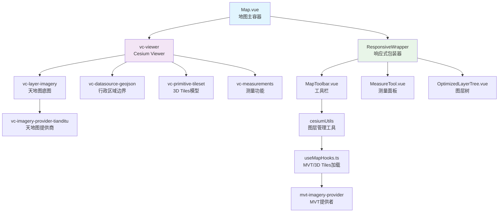

**图表来源**
- [Map.vue](file://src/mapComponents/Map.vue#L3-L43)
- [MapToolbar.vue](file://src/mapComponents/MapToolbar.vue#L165-L204)

## 详细组件分析

### 天地图底图系统

#### 动态底图切换机制

Map.vue 实现了灵活的天地图底图切换功能：

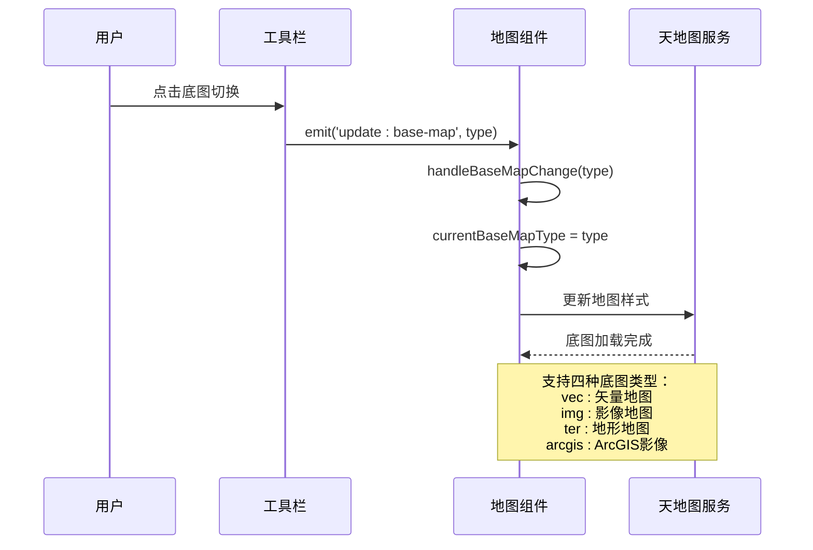

**图表来源**
- [Map.vue](file://src/mapComponents/Map.vue#L463-L480)
- [MapToolbar.vue](file://src/mapComponents/MapToolbar.vue#L328-L338)

#### 底图样式映射表

| 底图类型 | 天地图样式 | 用途 |
|----------|------------|------|
| vec | vec_c | 矢量地图，适合详细信息查看 |
| img | img_c | 影像地图，适合实景对比 |
| ter | ter_c | 地形地图，适合地形分析 |
| arcgis | ArcGIS影像 | 专业地图服务 |

**章节来源**
- [Map.vue](file://src/mapComponents/Map.vue#L169-L192)

### 阳新县行政区域边界

#### GeoJSON数据加载流程

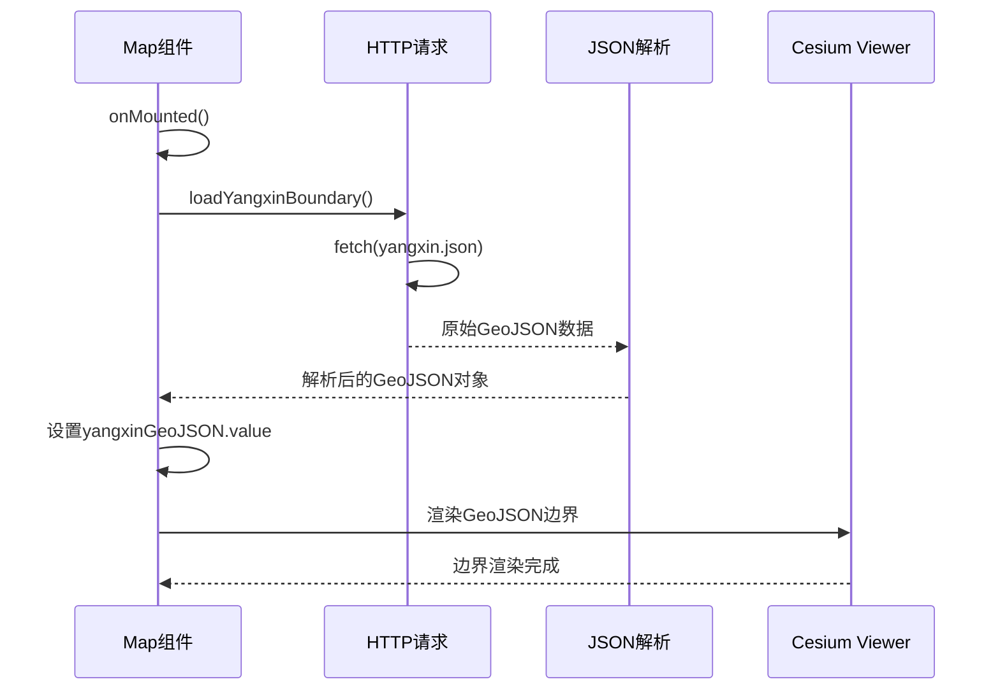

**图表来源**
- [Map.vue](file://src/mapComponents/Map.vue#L274-L283)
- [yangxin.json](file://public/yangxin.json#L1-L13)

#### 边界数据结构

阳新县边界采用 MultiPolygon 格式，包含完整的地理坐标信息：

| 属性 | 值 | 说明 |
|------|-----|------|
| adcode | 420222 | 行政区划代码 |
| name | 阳新县 | 地名 |
| center | [115.212883, 29.841572] | 中心点坐标 |
| centroid | [115.133954, 29.823198] | 几何中心 |
| level | district | 行政级别 |

**章节来源**
- [yangxin.json](file://public/yangxin.json#L3-L12)

### 相机边界限制功能

#### 基于GeoJSON的智能边界限制

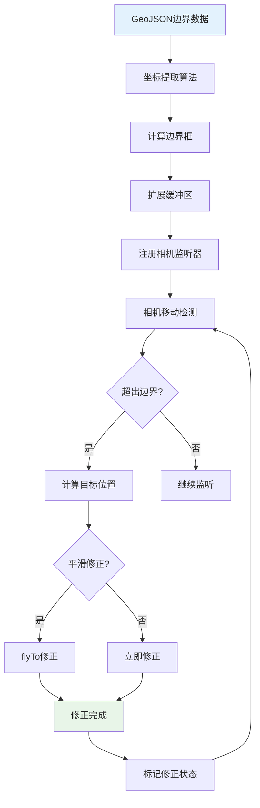

**图表来源**
- [useMapHooks.ts](file://src/hook/useMapHooks.ts#L441-L525)

#### 边界限制配置

| 参数 | 默认值 | 说明 |
|------|--------|------|
| buffer | 0.1度 | 边界缓冲区，防止过于严格 |
| smoothCorrection | false | 是否使用平滑修正 |
| minHeight | 10000米 | 最小高度，最大放大级别 |
| maxHeight | 150000米 | 最大高度，最小放大级别 |

**章节来源**
- [mapConfig.ts](file://src/config/mapConfig.ts#L17-L26)

### 测量工具集成

#### 与MeasureTool组件的协作

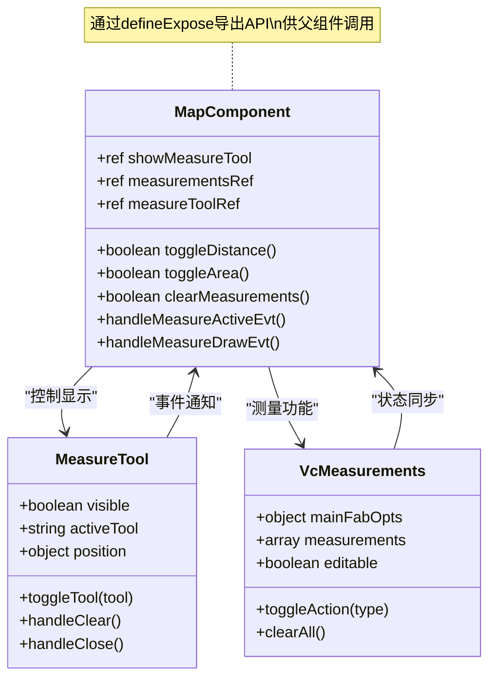

**图表来源**
- [Map.vue](file://src/mapComponents/Map.vue#L143-L145)
- [MeasureTool.vue](file://src/mapComponents/MeasureTool.vue#L104-L122)

#### 测量功能激活逻辑

| 功能 | 方法 | 触发条件 |
|------|------|----------|
| 距离测量 | toggleDistance() | 点击距离工具按钮 |
| 面积测量 | toggleArea() | 点击面积工具按钮 |
| 清除测量 | clearMeasurements() | 点击清除按钮 |
| 激活状态同步 | handleMeasureActiveEvt() | 测量工具状态变化 |

**章节来源**
- [Map.vue](file://src/mapComponents/Map.vue#L219-L246)

### 生命周期管理

#### 资源管理策略

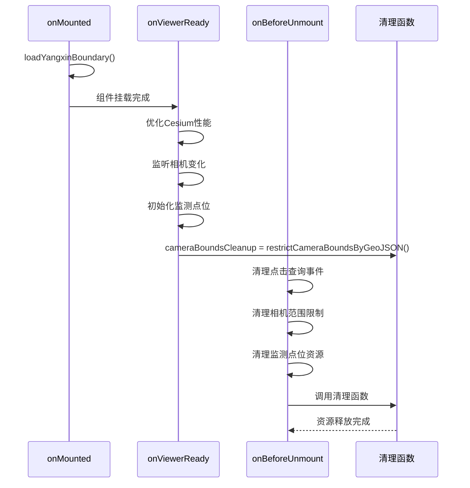

**图表来源**
- [Map.vue](file://src/mapComponents/Map.vue#L539-L565)

#### API接口导出

Map.vue 通过 `defineExpose` 导出了完整的API接口：

| 接口 | 类型 | 用途 |
|------|------|------|
| cesiumViewer | ref | Cesium Viewer实例访问 |
| viewerInstance | ref | Viewer实例引用 |
| selectedFeature | ref | 当前选中要素 |
| mvtProvider | ref | MVT图层提供者 |
| showMeasureTool | ref | 测量工具显示状态 |
| sceneMode | ref | 场景模式（2D/3D） |
| currentBaseMapType | ref | 当前底图类型 |
| compassRotation | ref | 指北针旋转角度 |
| defaultTileset | ref | 默认3D Tiles图层 |
| yangxinBoundary | ref | 阳新县边界数据 |
| toggleMeasureTool | function | 切换测量工具 |
| toggleDefaultTileset | function | 切换默认3D Tiles显示 |
| monitoringPoints | object | 监测点位管理 |
| refreshMonitoringPoints | function | 刷新监测点位 |
| setMonitoringPointsVisible | function | 设置监测点位可见性 |

**章节来源**
- [Map.vue](file://src/mapComponents/Map.vue#L568-L598)

## MVT矢量瓦片系统

### MVT图层加载机制

**更新** 新增了对MVT（Mapbox Vector Tiles）的原生支持，通过`mvt-imagery-provider`库实现。

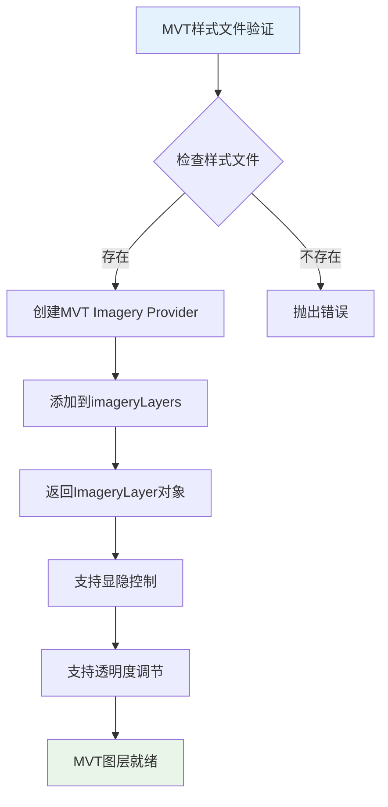

**图表来源**
- [useMapHooks.ts](file://src/hook/useMapHooks.ts#L40-L93)

### MVT图层管理

#### 图层类型定义

```typescript
interface MVTLayer {
  type: 'mvt';
  instance: ImageryLayer; // ImageryLayer对象
}

interface TilesetLayer {
  type: '3dtiles';
  instance: Cesium3DTileset; // Cesium3DTileset对象
}

type MapLayer = MVTLayer | TilesetLayer;
```

#### 图层存储和管理

| 功能 | 方法 | 描述 |
|------|------|------|
| 加载MVT图层 | loadMVTLayer(viewer, styleUrl) | 加载MVT矢量瓦片图层 |
| 获取已加载图层 | getLoadedLayers() | 返回所有已加载图层 |
| 设置图层 | setLoadedLayer(id, layer) | 存储指定ID的图层 |
| 获取图层 | getLoadedLayer(id) | 获取指定ID的图层 |
| 显隐控制 | ImageryLayer.show | 控制MVT图层显隐 |

**章节来源**
- [useMapHooks.ts](file://src/hook/useMapHooks.ts#L18-L31)
- [useMapHooks.ts](file://src/hook/useMapHooks.ts#L40-L93)

### MVT样式验证

#### 样式文件验证流程

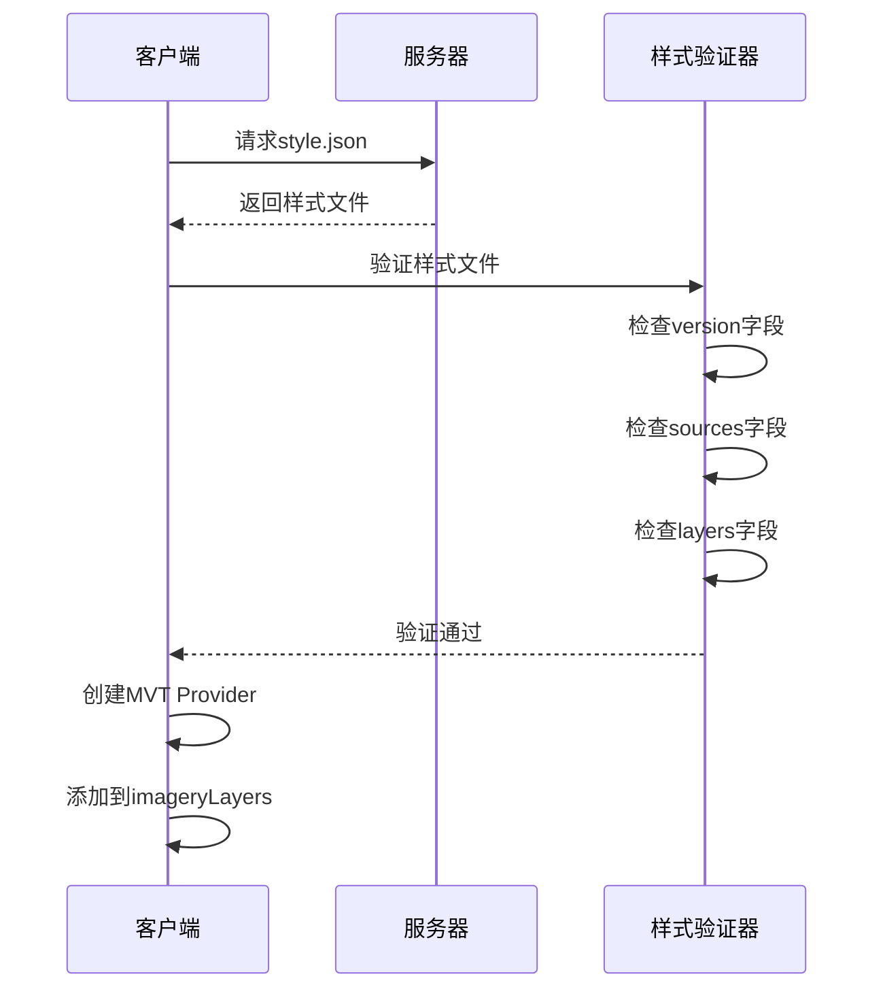

**图表来源**
- [useMapHooks.ts](file://src/hook/useMapHooks.ts#L44-L74)

#### 样式验证规则

| 字段 | 必需性 | 说明 |
|------|--------|------|
| version | 必需 | Mapbox样式规范版本 |
| sources | 必需 | 数据源配置 |
| layers | 必需 | 图层样式定义 |
| glyphs | 可选 | 字体资源路径 |
| sprite | 可选 | 图标精灵图路径 |

**章节来源**
- [useMapHooks.ts](file://src/hook/useMapHooks.ts#L55-L64)
- [mapConfig.ts](file://src/config/mapConfig.ts#L48-L52)

## 3D Tiles增强集成

### 3D Tiles加载优化

**更新** 改进了3D Tiles的加载机制，使用构造函数方式创建实例，解决了`fromUrl`不是函数的问题。

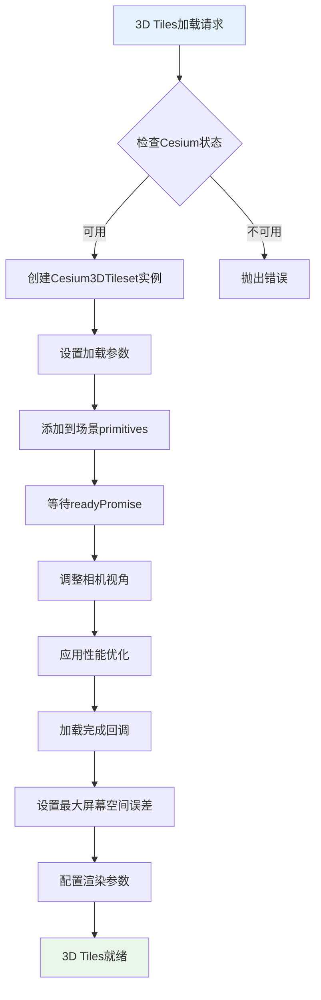

**图表来源**
- [useMapHooks.ts](file://src/hook/useMapHooks.ts#L102-L151)

### 3D Tiles样式控制

#### 样式设置机制

| 功能 | 方法 | 参数 | 说明 |
|------|------|------|------|
| 可见性控制 | set3DTilesVisibility | tileset, visible | 控制3D Tiles显隐 |
| 样式设置 | set3DTilesStyle | tileset, style | 设置Cesium3DTileStyle |
| 透明度控制 | Cesium3DTileStyle | color('white', opacity) | 设置模型透明度 |

#### 样式优化配置

| 参数 | 值 | 优化目的 |
|------|-----|----------|
| maximumScreenSpaceError | 16 | 平衡质量和性能 |
| maximumMemoryUsage | 512MB | 控制内存占用 |
| show | true | 默认显示模型 |
| color | WHITE.withAlpha(0.8) | 透明度设置 |

**章节来源**
- [useMapHooks.ts](file://src/hook/useMapHooks.ts#L158-L180)
- [Map.vue](file://src/mapComponents/Map.vue#L307-L315)

## 图层管理系统

### 图层树组件

**更新** 新增了`OptimizedLayerTree.vue`组件，提供可视化的图层管理界面。

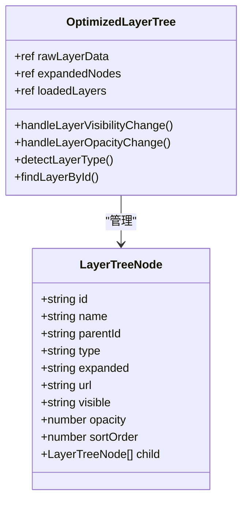

**图表来源**
- [OptimizedLayerTree.vue](file://src/mapComponents/OptimizedLayerTree.vue#L35-L49)

### 图层类型智能识别

#### 容错机制

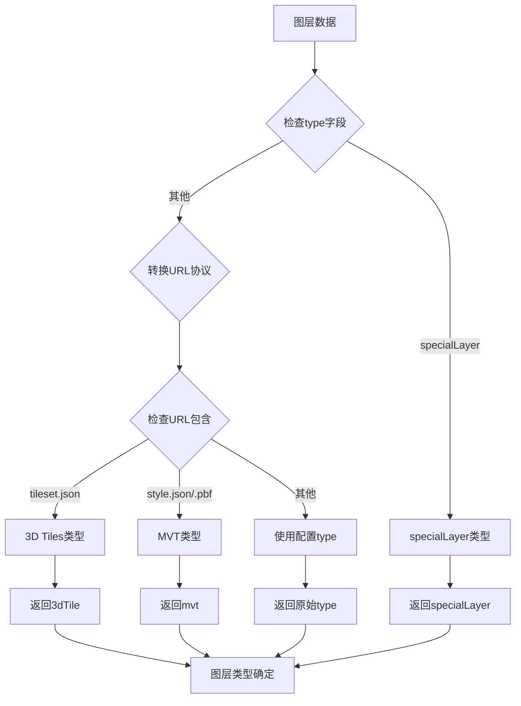

**图表来源**
- [OptimizedLayerTree.vue](file://src/mapComponents/OptimizedLayerTree.vue#L450-L479)

#### 支持的图层类型

| 类型 | 说明 | URL特征 |
|------|------|---------|
| mvt | MVT矢量瓦片 | 包含style.json或.pbf |
| 3dTile | 3D Tiles模型 | 包含tileset.json |
| tile | 普通瓦片 | 其他瓦片服务 |
| wms | WMS服务 | WMS协议 |
| group | 图层分组 | 分组节点 |

**章节来源**
- [OptimizedLayerTree.vue](file://src/mapComponents/OptimizedLayerTree.vue#L9-L14)
- [README_LAYER_TREE.md](file://src/mapComponents/README_LAYER_TREE.md#L1-L49)

### 图层显隐控制

#### 统一控制机制

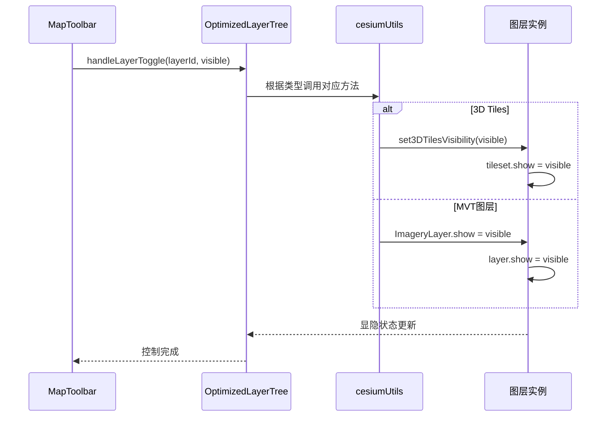

**图表来源**
- [MapToolbar.vue](file://src/mapComponents/MapToolbar.vue#L246-L285)

#### 透明度控制

| 图层类型 | 控制方式 | 参数 |
|----------|----------|------|
| 3D Tiles | Cesium3DTileStyle | color('white', opacity) |
| MVT图层 | ImageryLayer.alpha | 0-1数值 |
| 普通瓦片 | ImageryLayer.alpha | 0-1数值 |

**章节来源**
- [MapToolbar.vue](file://src/mapComponents/MapToolbar.vue#L288-L305)

## 依赖关系分析

### 外部依赖

**更新** 新增了对`mvt-imagery-provider`和`mvt-basic-render`的依赖支持。

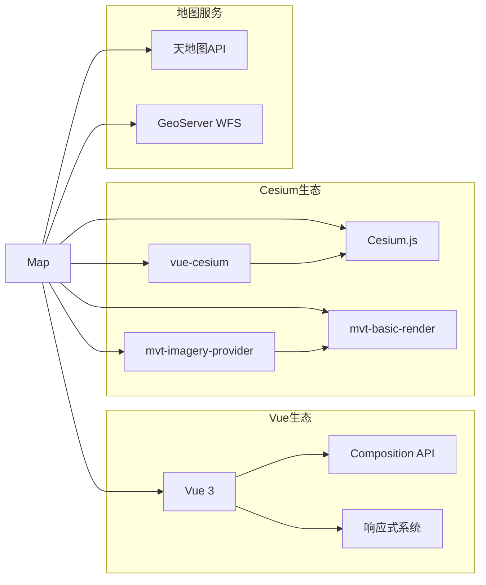

**图表来源**
- [Map.vue](file://src/mapComponents/Map.vue#L82-L91)
- [package.json](file://package.json#L26-L26)

### 内部模块依赖

| 模块 | 依赖 | 说明 |
|------|------|------|
| Map.vue | useMapHooks | 地图工具函数 |
| Map.vue | mapConfig | 地图配置 |
| Map.vue | MeasureTool | 测量工具组件 |
| Map.vue | MapToolbar | 地图工具栏 |
| MapToolbar | useMapHooks | 图层管理工具 |
| useMapHooks | mvt-imagery-provider | MVT图层加载 |
| useMapHooks | Cesium | Cesium核心功能 |
| OptimizedLayerTree | useMapHooks | 图层管理API |

**章节来源**
- [Map.vue](file://src/mapComponents/Map.vue#L82-L91)
- [useMapHooks.ts](file://src/hook/useMapHooks.ts#L14-L15)

## 性能考虑

### 渲染性能优化

**更新** 增强了性能优化策略，特别是针对MVT和3D Tiles的优化。

#### Cesium性能配置

| 优化项 | 配置 | 效果 |
|--------|------|------|
| 光照关闭 | globe.enableLighting = false | 减少计算开销 |
| 雾效关闭 | scene.fog.enabled = false | 提升渲染速度 |
| 天空关闭 | skyAtmosphere.show = false | 降低复杂度 |
| 屏幕空间误差 | maximumScreenSpaceError = 2 | 平衡质量与性能 |
| 请求渲染模式 | requestRenderMode = true | 手动控制渲染 |
| 阴影关闭 | shadows = false | 减少阴影计算 |

**章节来源**
- [Map.vue](file://src/mapComponents/Map.vue#L377-L391)

#### MVT性能优化

**新增** MVT图层的性能优化策略：

| 优化项 | 配置 | 效果 |
|--------|------|------|
| 样式验证 | 预验证style.json | 避免无效请求 |
| 图层缓存 | loadedLayers存储 | 避免重复加载 |
| 显隐控制 | ImageryLayer.show | 动态启停渲染 |
| 透明度调节 | ImageryLayer.alpha | 精细控制显示 |

**章节来源**
- [useMapHooks.ts](file://src/hook/useMapHooks.ts#L44-L74)
- [MapToolbar.vue](file://src/mapComponents/MapToolbar.vue#L260-L282)

#### 渲染时间优化

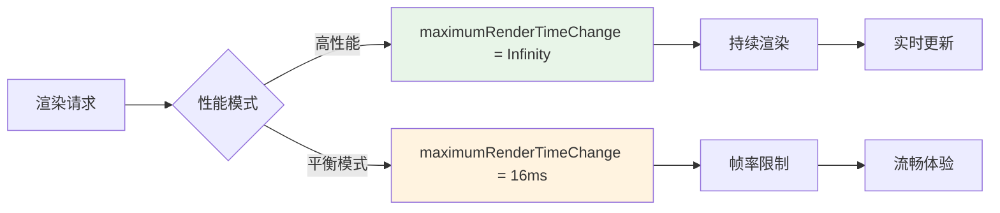

**图表来源**
- [Map.vue](file://src/mapComponents/Map.vue#L386-L386)

### 内存管理

#### 图层资源管理

**更新** 改进了图层资源管理机制：

- **MVT图层**：使用 `imageryLayers.addImageryProvider()` 管理，返回ImageryLayer对象
- **3D Tiles**：通过 `primitives.add()` 添加到场景，支持动态启停
- **GeoJSON边界**：静态数据，无需特殊管理
- **图层缓存**：使用`loadedLayers`存储已加载图层实例

#### 组件卸载清理

```typescript
// 组件卸载时的资源清理
onBeforeUnmount(() => {
  console.log('地图组件即将卸载')
  
  // 清理点击查询事件
  if (clickQueryCleanup) {
    clickQueryCleanup()
    clickQueryCleanup = null
  }
  
  // 清理相机范围限制
  if (cameraBoundsCleanup) {
    cameraBoundsCleanup()
    cameraBoundsCleanup = null
  }
  
  // 清理监测点位资源
  monitoringPoints.cleanup()
})
```

**章节来源**
- [Map.vue](file://src/mapComponents/Map.vue#L548-L565)

## 故障排除指南

### 常见问题及解决方案

#### MVT样式文件加载失败

**症状**：控制台显示MVT样式文件加载错误
**原因**：样式文件不存在或格式不正确
**解决方案**：
1. 检查`style.json`文件路径和URL
2. 验证样式文件包含必需字段：`version`、`sources`、`layers`
3. 确认服务器可访问性和跨域设置

#### 3D Tiles加载超时

**症状**：模型长时间未显示
**原因**：网络延迟或模型文件过大
**解决方案**：
1. 调整 `maximumScreenSpaceError` 参数
2. 检查网络连接
3. 验证模型URL有效性
4. 使用`load3DTiles`的错误处理机制

#### 相机边界限制失效

**症状**：可以超出设定的地理范围
**原因**：边界计算错误或监听器未正确注册
**解决方案**：
1. 检查GeoJSON数据格式
2. 验证边界配置参数
3. 确认监听器注册状态

#### 图层管理异常

**症状**：图层显隐控制失效
**原因**：图层实例未正确存储或类型判断错误
**解决方案**：
1. 检查`loadedLayers`存储状态
2. 验证图层类型判断逻辑
3. 确认图层实例的有效性

**章节来源**
- [useMapHooks.ts](file://src/hook/useMapHooks.ts#L72-L74)
- [MapToolbar.vue](file://src/mapComponents/MapToolbar.vue#L180-L204)

### 调试工具

#### 日志输出

**更新** 增强了调试日志输出：

| 日志类型 | 触发时机 | 内容 |
|----------|----------|------|
| 地图准备就绪 | onViewerReady | Cesium Viewer状态 |
| 底图加载完成 | onTiandituReady | 天地图状态 |
| MVT图层加载 | loadMVTLayer | MVT样式验证结果 |
| 3D Tiles加载 | load3DTiles | 3D Tiles加载状态 |
| 相机修正 | restrictCameraBounds | 位置修正记录 |
| 测量操作 | handleMeasure* | 测量功能状态 |
| 图层管理 | handleLayer* | 图层控制状态 |

#### 性能监控

```typescript
// 性能监控示例
console.log('Cesium性能优化已应用')
console.log('相机范围限制已启用:', {
  bounds: { west, south, east, north },
  buffer,
  smoothCorrection,
  heightRange: `${minHeight}m - ${maxHeight}m`
})
console.log('MVT图层已加载:', {
  layerId,
  styleUrl,
  imageryLayer: imageryLayer instanceof Cesium.ImageryLayer
})
```

**章节来源**
- [Map.vue](file://src/mapComponents/Map.vue#L391-L391)
- [useMapHooks.ts](file://src/hook/useMapHooks.ts#L82-L82)

## 结论

Map.vue 组件是一个功能完整、性能优化的三维地图解决方案，具备以下核心优势：

### 技术特点

**更新** 新增了多项重要技术特性：

1. **完整的地图功能栈**：从底图服务到MVT矢量瓦片和3D模型展示的一体化解决方案
2. **智能边界限制**：基于GeoJSON的精确地理范围控制
3. **灵活的测量工具**：集成化的测量功能，支持距离和面积测量
4. **强大的图层管理**：统一管理MVT和3D Tiles图层，支持动态加载和控制
5. **优秀的性能表现**：多层次的性能优化策略，特别是针对矢量瓦片的优化
6. **完善的生命周期管理**：全面的资源管理和清理机制

### 应用价值

- **政府决策支持**：为阳新县政府提供专业的GIS分析平台
- **可视化展示**：直观的三维地图界面，提升用户体验
- **扩展性强**：模块化设计，便于功能扩展和维护
- **标准化开发**：遵循最佳实践，确保代码质量和可维护性
- **MVT原生支持**：提供专业的矢量瓦片渲染能力

### 发展方向

未来可以考虑的功能增强：

1. **多语言支持**：国际化功能扩展
2. **主题定制**：深色/浅色主题切换
3. **移动端优化**：响应式布局改进
4. **数据分析**：集成更多GIS分析功能
5. **实时数据流**：支持实时数据更新和可视化

通过 Map.vue 组件的设计和实现，展示了现代Web GIS应用的最佳实践，特别是MVT矢量瓦片和3D Tiles的集成方案，为类似项目提供了宝贵的参考价值。