# 地图组件详细文档

<cite>
**本文档引用的文件**
- [Map.vue](file://src/mapComponents/Map.vue)
- [MeasureTool.vue](file://src/mapComponents/MeasureTool.vue)
- [MapToolbar.vue](file://src/mapComponents/MapToolbar.vue)
- [useMapHooks.ts](file://src/hook/useMapHooks.ts)
- [mapConfig.ts](file://src/config/mapConfig.ts)
- [yangxin.json](file://public/yangxin.json)
- [CAMERA_BOUNDS_RESTRICTION.md](file://CAMERA_BOUNDS_RESTRICTION.md)
</cite>

## 目录
1. [简介](#简介)
2. [项目结构](#项目结构)
3. [核心组件](#核心组件)
4. [架构概览](#架构概览)
5. [详细组件分析](#详细组件分析)
6. [依赖关系分析](#依赖关系分析)
7. [性能考虑](#性能考虑)
8. [故障排除指南](#故障排除指南)
9. [结论](#结论)

## 简介

Map.vue 是一个基于 Vue-Cesium 的三维地图核心容器组件，专为阳新县政府dashboard设计。该组件集成了天地图底图服务、3D Tiles模型展示、GeoJSON边界限制、测量工具集成等功能，提供了完整的三维地理信息系统解决方案。

## 项目结构

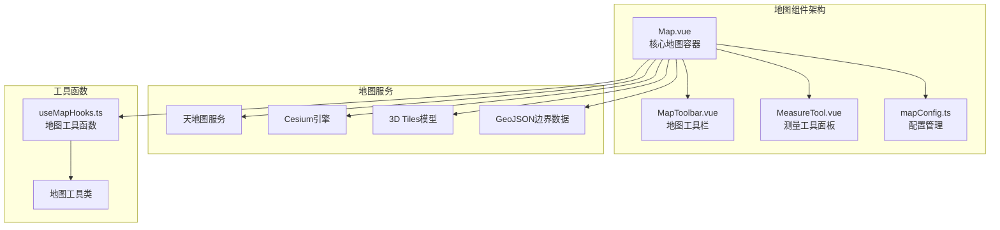

**图表来源**
- [Map.vue](file://src/mapComponents/Map.vue#L1-L50)
- [MapToolbar.vue](file://src/mapComponents/MapToolbar.vue#L1-L50)
- [MeasureTool.vue](file://src/mapComponents/MeasureTool.vue#L1-L50)

**章节来源**
- [Map.vue](file://src/mapComponents/Map.vue#L1-L432)
- [MapToolbar.vue](file://src/mapComponents/MapToolbar.vue#L1-L504)

## 核心组件

### vc-viewer 组件初始化

Map.vue 作为三维地图的核心容器，通过 vc-viewer 组件实现了完整的 Cesium 地图功能：

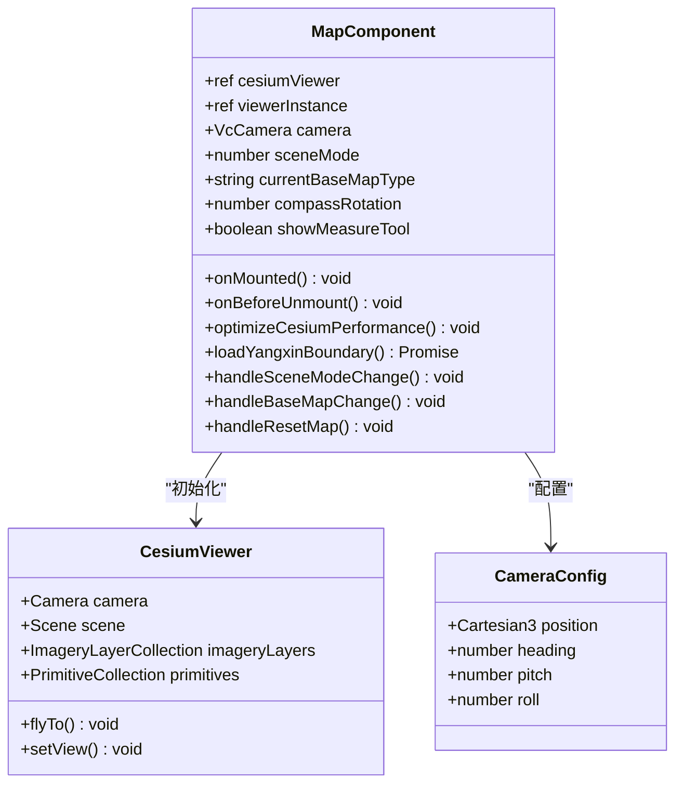

**图表来源**
- [Map.vue](file://src/mapComponents/Map.vue#L55-L120)

### 相机初始配置

组件设置了科学的相机初始位置和场景模式：

| 配置项 | 值 | 说明 |
|--------|-----|------|
| 初始位置 | [115.186322, 29.864861, 50000] | 阳新县中心坐标，50公里高度 |
| 场景模式 | 2D | 默认2D模式浏览 |
| 相机朝向 | heading: 0°, pitch: -90° | 正俯视角度 |
| 渲染优化 | requestRenderMode: true | 手动渲染模式 |

**章节来源**
- [Map.vue](file://src/mapComponents/Map.vue#L115-L118)
- [mapConfig.ts](file://src/config/mapConfig.ts#L11-L12)

## 架构概览

### 组件层次结构

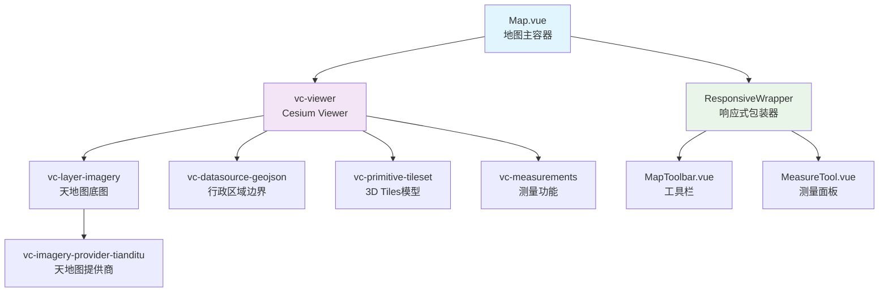

**图表来源**
- [Map.vue](file://src/mapComponents/Map.vue#L3-L48)

## 详细组件分析

### 天地图底图系统

#### 动态底图切换机制

Map.vue 实现了灵活的天地图底图切换功能：

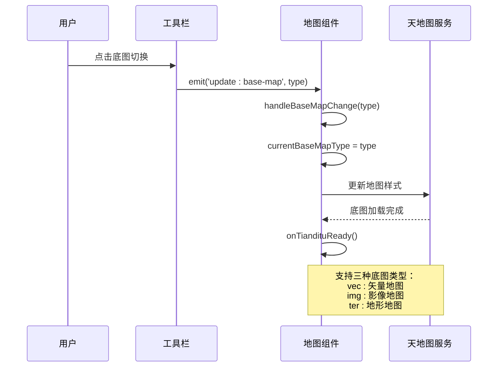

**图表来源**
- [Map.vue](file://src/mapComponents/Map.vue#L330-L333)
- [MapToolbar.vue](file://src/mapComponents/MapToolbar.vue#L289-L292)

#### 底图样式映射表

| 底图类型 | 天地图样式 | 用途 |
|----------|------------|------|
| vec | vec_c | 矢量地图，适合详细信息查看 |
| img | img_c | 影像地图，适合实景对比 |
| ter | ter_c | 地形地图，适合地形分析 |

**章节来源**
- [Map.vue](file://src/mapComponents/Map.vue#L183-L189)

### 3D Tiles模型系统

#### 模型加载与配置

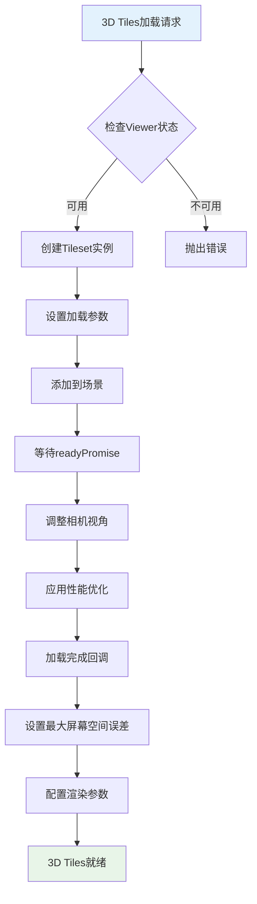

**图表来源**
- [Map.vue](file://src/mapComponents/Map.vue#L217-L227)

#### 性能优化配置

| 参数 | 值 | 优化目的 |
|------|-----|----------|
| maximumScreenSpaceError | 16 | 平衡质量和性能 |
| maximumMemoryUsage | 512MB | 控制内存占用 |
| show | true | 默认显示模型 |

**章节来源**
- [Map.vue](file://src/mapComponents/Map.vue#L131-L133)

### 阳新县行政区域边界

#### GeoJSON数据加载流程

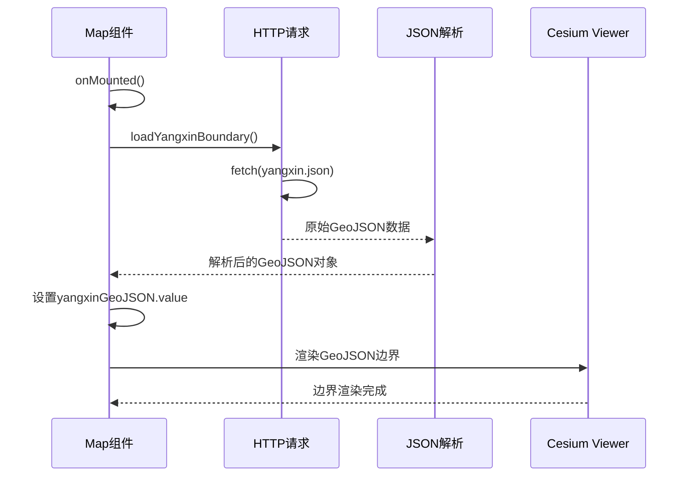

**图表来源**
- [Map.vue](file://src/mapComponents/Map.vue#L197-L206)
- [yangxin.json](file://public/yangxin.json#L1-L755)

#### 边界数据结构

阳新县边界采用 MultiPolygon 格式，包含完整的地理坐标信息：

| 属性 | 值 | 说明 |
|------|-----|------|
| adcode | 420222 | 行政区划代码 |
| name | 阳新县 | 地名 |
| center | [115.212883, 29.841572] | 中心点坐标 |
| centroid | [115.133954, 29.823198] | 几何中心 |
| level | district | 行政级别 |

**章节来源**
- [yangxin.json](file://public/yangxin.json#L2-L13)

### 相机边界限制功能

#### 基于GeoJSON的智能边界限制

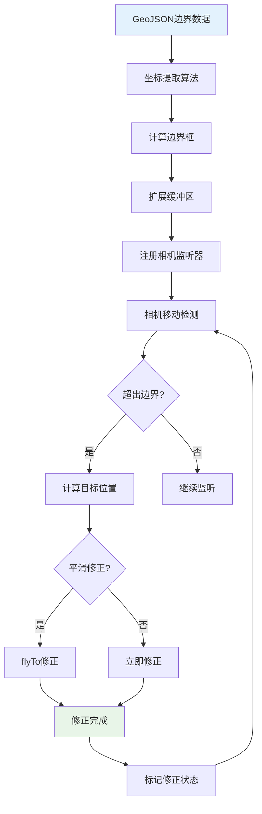

**图表来源**
- [useMapHooks.ts](file://src/hook/useMapHooks.ts#L441-L525)

#### 边界限制配置

| 参数 | 默认值 | 说明 |
|------|--------|------|
| buffer | 0.1度 | 边界缓冲区，防止过于严格 |
| smoothCorrection | false | 是否使用平滑修正 |
| minHeight | 10000米 | 最小高度，最大放大级别 |
| maxHeight | 150000米 | 最大高度，最小放大级别 |

**章节来源**
- [mapConfig.ts](file://src/config/mapConfig.ts#L17-L26)

### 测量工具集成

#### 与MeasureTool组件的协作

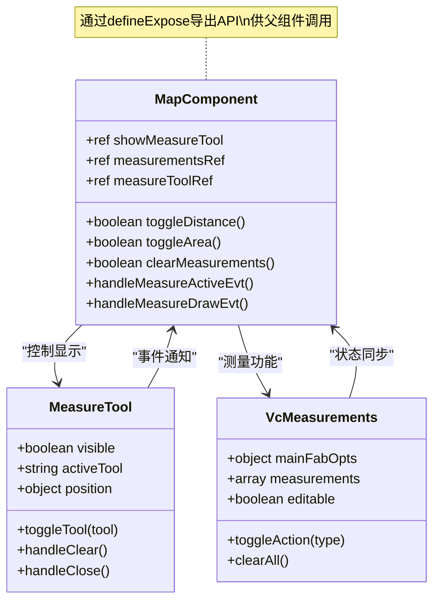

**图表来源**
- [Map.vue](file://src/mapComponents/Map.vue#L134-L161)
- [MeasureTool.vue](file://src/mapComponents/MeasureTool.vue#L104-L122)

#### 测量功能激活逻辑

| 功能 | 方法 | 触发条件 |
|------|------|----------|
| 距离测量 | toggleDistance() | 点击距离工具按钮 |
| 面积测量 | toggleArea() | 点击面积工具按钮 |
| 清除测量 | clearMeasurements() | 点击清除按钮 |
| 激活状态同步 | handleMeasureActiveEvt() | 测量工具状态变化 |

**章节来源**
- [Map.vue](file://src/mapComponents/Map.vue#L134-L161)

### 生命周期管理

#### 资源管理策略

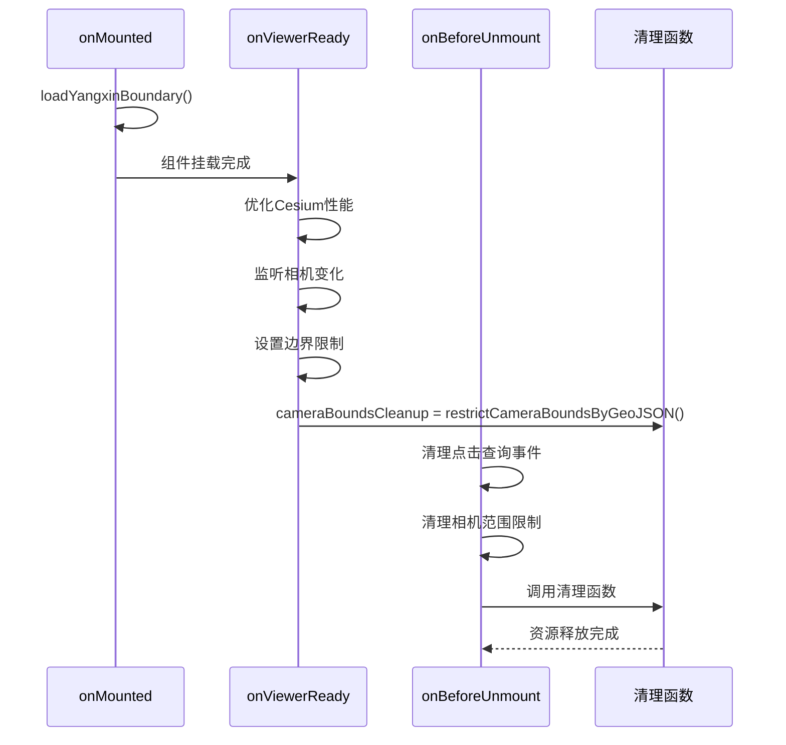

**图表来源**
- [Map.vue](file://src/mapComponents/Map.vue#L361-L387)

#### API接口导出

Map.vue 通过 `defineExpose` 导出了完整的API接口：

| 接口 | 类型 | 用途 |
|------|------|------|
| cesiumViewer | ref | Cesium Viewer实例访问 |
| viewerInstance | ref | Viewer实例引用 |
| selectedFeature | ref | 当前选中要素 |
| mvtProvider | ref | MVT图层提供者 |
| showMeasureTool | ref | 测量工具显示状态 |
| sceneMode | ref | 场景模式（2D/3D） |
| currentBaseMapType | ref | 当前底图类型 |
| compassRotation | ref | 指北针旋转角度 |
| defaultTileset | ref | 默认3D Tiles图层 |
| yangxinBoundary | ref | 阳新县边界数据 |
| toggleMeasureTool | function | 切换测量工具 |

**章节来源**
- [Map.vue](file://src/mapComponents/Map.vue#L389-L403)

## 依赖关系分析

### 外部依赖

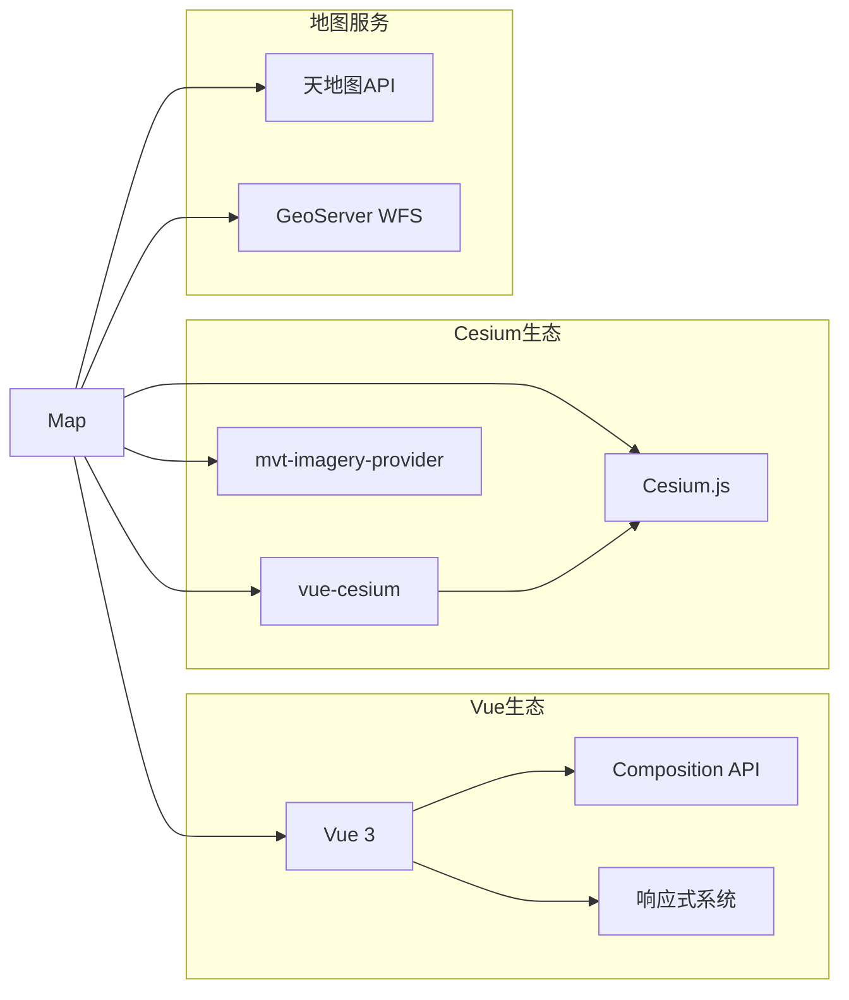

**图表来源**
- [Map.vue](file://src/mapComponents/Map.vue#L55-L62)

### 内部模块依赖

| 模块 | 依赖 | 说明 |
|------|------|------|
| Map.vue | useMapHooks | 地图工具函数 |
| Map.vue | mapConfig | 地图配置 |
| Map.vue | MeasureTool | 测量工具组件 |
| Map.vue | MapToolbar | 地图工具栏 |
| useMapHooks | MVTImageryProvider | MVT图层加载 |
| useMapHooks | Cesium | Cesium核心功能 |

**章节来源**
- [Map.vue](file://src/mapComponents/Map.vue#L58-L62)
- [useMapHooks.ts](file://src/hook/useMapHooks.ts#L14-L16)

## 性能考虑

### 渲染性能优化

Map.vue 实施了多层次的性能优化策略：

#### Cesium性能配置

| 优化项 | 配置 | 效果 |
|--------|------|------|
| 光照关闭 | globe.enableLighting = false | 减少计算开销 |
| 雾效关闭 | scene.fog.enabled = false | 提升渲染速度 |
| 天空关闭 | skyAtmosphere.show = false | 降低复杂度 |
| 屏幕空间误差 | maximumScreenSpaceError = 2 | 平衡质量与性能 |
| 请求渲染模式 | requestRenderMode = true | 手动控制渲染 |

**章节来源**
- [Map.vue](file://src/mapComponents/Map.vue#L261-L276)

#### 渲染时间优化

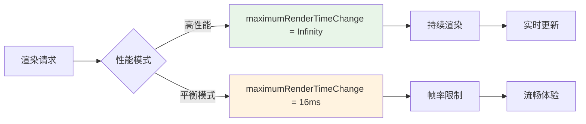

**图表来源**
- [Map.vue](file://src/mapComponents/Map.vue#L270-L272)

### 内存管理

#### 图层资源管理

- **MVT图层**：使用 `imageryLayers.addImageryProvider()` 管理
- **3D Tiles**：通过 `primitives.add()` 添加到场景
- **GeoJSON边界**：静态数据，无需特殊管理

#### 组件卸载清理

```typescript
// 组件卸载时的资源清理
onBeforeUnmount(() => {
  // 清理点击查询事件
  if (clickQueryCleanup) {
    clickQueryCleanup()
    clickQueryCleanup = null
  }
  
  // 清理相机范围限制
  if (cameraBoundsCleanup) {
    cameraBoundsCleanup()
    cameraBoundsCleanup = null
  }
})
```

**章节来源**
- [Map.vue](file://src/mapComponents/Map.vue#L373-L387)

## 故障排除指南

### 常见问题及解决方案

#### 天地图加载失败

**症状**：控制台显示天地图加载错误
**原因**：Token配置错误或网络问题
**解决方案**：
1. 检查 `.env` 文件中的 `VITE_TIANDITU_KEY`
2. 确认Token有效性
3. 检查网络连接

#### 3D Tiles加载超时

**症状**：模型长时间未显示
**原因**：网络延迟或模型文件过大
**解决方案**：
1. 调整 `maximumScreenSpaceError` 参数
2. 检查网络连接
3. 验证模型URL有效性

#### 相机边界限制失效

**症状**：可以超出设定的地理范围
**原因**：边界计算错误或监听器未正确注册
**解决方案**：
1. 检查GeoJSON数据格式
2. 验证边界配置参数
3. 确认监听器注册状态

**章节来源**
- [Map.vue](file://src/mapComponents/Map.vue#L298-L308)
- [useMapHooks.ts](file://src/hook/useMapHooks.ts#L425-L427)

### 调试工具

#### 日志输出

Map.vue 提供了丰富的调试日志：

| 日志类型 | 触发时机 | 内容 |
|----------|----------|------|
| 地图准备就绪 | onViewerReady | Cesium Viewer状态 |
| 底图加载完成 | onTiandituReady | 天地图状态 |
| 3D Tiles加载完成 | on3DTilesReady | 模型状态 |
| 相机修正 | restrictCameraBounds | 位置修正记录 |
| 测量操作 | handleMeasure* | 测量功能状态 |

#### 性能监控

```typescript
// 性能监控示例
console.log('Cesium性能优化已应用')
console.log('相机范围限制已启用:', {
  bounds: { west, south, east, north },
  buffer,
  smoothCorrection,
  heightRange: `${minHeight}m - ${maxHeight}m`
})
```

**章节来源**
- [Map.vue](file://src/mapComponents/Map.vue#L277-L277)
- [useMapHooks.ts](file://src/hook/useMapHooks.ts#L264-L269)

## 结论

Map.vue 组件是一个功能完整、性能优化的三维地图解决方案，具备以下核心优势：

### 技术特点

1. **完整的地图功能栈**：从底图服务到3D模型展示的一体化解决方案
2. **智能边界限制**：基于GeoJSON的精确地理范围控制
3. **灵活的测量工具**：集成化的测量功能，支持距离和面积测量
4. **优秀的性能表现**：多层次的性能优化策略
5. **完善的生命周期管理**：全面的资源管理和清理机制

### 应用价值

- **政府决策支持**：为阳新县政府提供专业的GIS分析平台
- **可视化展示**：直观的三维地图界面，提升用户体验
- **扩展性强**：模块化设计，便于功能扩展和维护
- **标准化开发**：遵循最佳实践，确保代码质量和可维护性

### 发展方向

未来可以考虑的功能增强：

1. **多语言支持**：国际化功能扩展
2. **主题定制**：深色/浅色主题切换
3. **移动端优化**：响应式布局改进
4. **数据分析**：集成更多GIS分析功能

通过 Map.vue 组件的设计和实现，展示了现代Web GIS应用的最佳实践，为类似项目提供了宝贵的参考价值。