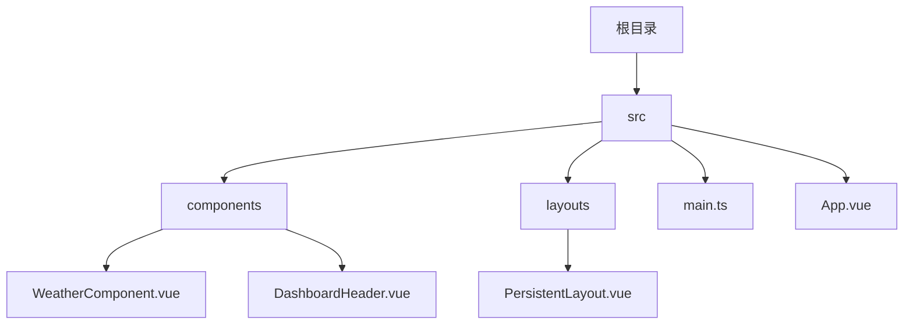
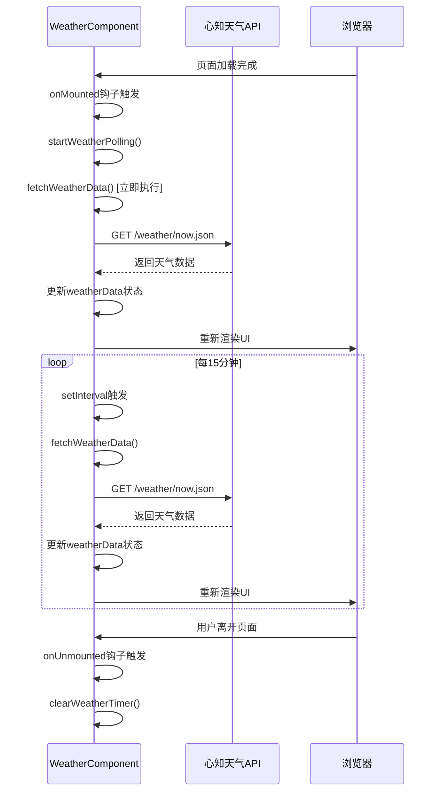
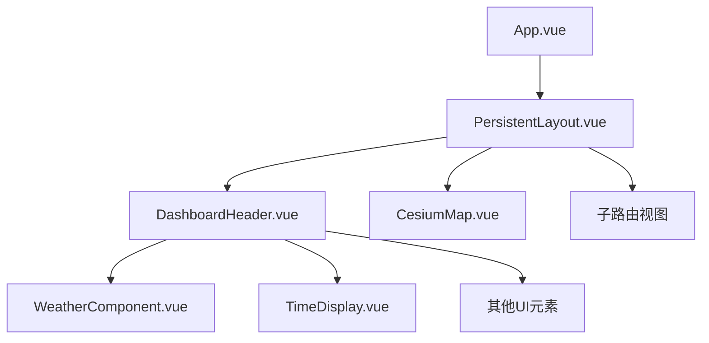
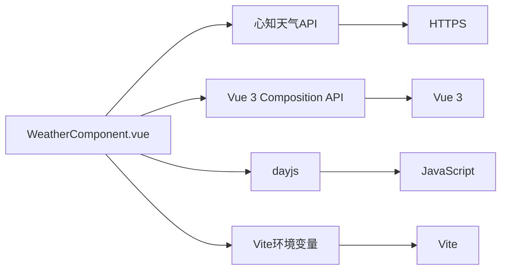

# 天气信息组件

<cite>
**本文档中引用的文件**   
- [WeatherComponent.vue](file://src/components/WeatherComponent.vue)
- [DashboardHeader.vue](file://src/components/DashboardHeader.vue)
- [main.ts](file://src/main.ts)
- [App.vue](file://src/App.vue)
- [index.ts](file://src/types/index.ts)
</cite>

## 目录
1. [简介](#简介)
2. [项目结构](#项目结构)
3. [核心组件](#核心组件)
4. [架构概述](#架构概述)
5. [详细组件分析](#详细组件分析)
6. [依赖分析](#依赖分析)
7. [性能考虑](#性能考虑)
8. [故障排除指南](#故障排除指南)
9. [结论](#结论)
10. [附录](#附录)（如有必要）

## 简介
天气信息组件是政府仪表板项目中的一个关键功能模块，负责在仪表板的头部区域实时显示当前天气状况。该组件通过调用第三方天气API获取数据，并以可视化的方式展示天气图标、温度和天气描述。它集成在持久化布局的头部导航栏中，确保在用户切换不同业务模块时始终保持可见和更新。

## 项目结构
天气信息组件位于`src/components/`目录下，作为独立的Vue 3组合式API组件实现。它被`DashboardHeader.vue`组件引用，并最终集成到`PersistentLayout.vue`的布局框架中，确保在整个应用的路由切换过程中保持状态和持续更新。



**Diagram sources**
- [WeatherComponent.vue](file://src/components/WeatherComponent.vue)
- [DashboardHeader.vue](file://src/components/DashboardHeader.vue)
- [PersistentLayout.vue](file://src/layouts/PersistentLayout.vue)

**Section sources**
- [WeatherComponent.vue](file://src/components/WeatherComponent.vue)
- [DashboardHeader.vue](file://src/components/DashboardHeader.vue)

## 核心组件
`WeatherComponent.vue`是实现天气信息展示的核心组件。它负责从心知天气API获取数据，管理组件内部状态，并将天气信息渲染到UI上。该组件使用TypeScript定义了清晰的数据接口，并通过`onMounted`和`onUnmounted`生命周期钩子管理定时更新逻辑。

**Section sources**
- [WeatherComponent.vue](file://src/components/WeatherComponent.vue#L1-L132)

## 架构概述
天气信息组件遵循典型的Vue 3组合式API架构。它通过`fetchWeatherData`函数发起HTTP请求获取天气数据，并使用`ref`响应式引用存储数据。组件通过`setInterval`设置了一个15分钟的定时器，实现数据的自动轮询更新。错误处理机制确保了在API请求失败时不会导致应用崩溃。



**Diagram sources**
- [WeatherComponent.vue](file://src/components/WeatherComponent.vue#L53-L106)

## 详细组件分析

### 天气组件分析
`WeatherComponent.vue`是一个功能完整的独立组件，实现了从数据获取到UI渲染的完整流程。

#### 组件结构
```mermaid
classDiagram
class WeatherComponent {
+baseUrl : string
+weatherData : Ref~WeatherResult~
+weatherTimer : number | null
+getWeatherImagePath(code : string) : string
+fetchWeatherData() : Promise~void~
+formatTime(dateString : string) : string
+startWeatherPolling() : void
+clearWeatherTimer() : void
}
class WeatherNow {
+text : string
+code : string
+temperature : string
}
class WeatherResult {
+location : { name : string }
+now : WeatherNow
+last_update : string
}
class WeatherResponse {
+results : WeatherResult[]
}
WeatherComponent --> WeatherResult : "包含"
WeatherResult --> WeatherNow : "包含"
WeatherComponent --> WeatherResponse : "接收"
```

**Diagram sources**
- [WeatherComponent.vue](file://src/components/WeatherComponent.vue#L21-L37)

#### 数据流分析
```mermaid
flowchart TD
Start([组件挂载]) --> Init["初始化定时器"]
Init --> Fetch["立即获取天气数据"]
Fetch --> API["调用心知天气API"]
API --> Success{"请求成功?"}
Success --> |是| Parse["解析JSON响应"]
Parse --> Update["更新weatherData状态"]
Update --> Render["触发UI重新渲染"]
Success --> |否| Error["捕获错误并输出到控制台"]
Error --> Render
loop "每15分钟" Update
End([组件卸载]) --> Clear["清除定时器"]
```

**Diagram sources**
- [WeatherComponent.vue](file://src/components/WeatherComponent.vue#L52-L106)

**Section sources**
- [WeatherComponent.vue](file://src/components/WeatherComponent.vue#L1-L132)

### 集成分析
天气组件通过`DashboardHeader.vue`集成到应用的主布局中，成为用户界面的一部分。



**Diagram sources**
- [DashboardHeader.vue](file://src/components/DashboardHeader.vue#L42)
- [PersistentLayout.vue](file://src/layouts/PersistentLayout.vue)

**Section sources**
- [DashboardHeader.vue](file://src/components/DashboardHeader.vue#L1-L236)
- [PersistentLayout.vue](file://src/layouts/PersistentLayout.vue#L1-L55)

## 依赖分析
天气信息组件主要依赖于外部API和Vue框架的核心功能。



**Diagram sources**
- [WeatherComponent.vue](file://src/components/WeatherComponent.vue#L12-L14)
- [WeatherComponent.vue](file://src/components/WeatherComponent.vue#L43-L48)

**Section sources**
- [WeatherComponent.vue](file://src/components/WeatherComponent.vue#L12-L14)
- [main.ts](file://src/main.ts#L21)

## 性能考虑
天气组件通过15分钟的轮询间隔在数据实时性和网络性能之间取得了平衡。组件在卸载时会清除定时器，防止内存泄漏。使用`v-if`指令确保在没有数据时不会渲染DOM元素，优化了渲染性能。

## 故障排除指南
如果天气信息无法显示，请检查以下几点：
1. 确认网络连接正常，可以访问`https://api.seniverse.com`
2. 检查浏览器控制台是否有API请求错误
3. 确认Vite环境变量`VITE_BASE_URL`已正确配置
4. 验证天气API密钥是否有效
5. 检查`public/weatherIcons/`目录下是否存在对应的天气图标文件

**Section sources**
- [WeatherComponent.vue](file://src/components/WeatherComponent.vue#L67-L69)
- [WeatherComponent.vue](file://src/components/WeatherComponent.vue#L17-L19)

## 结论
天气信息组件是一个设计良好、功能完整的Vue组件，成功地将实时天气信息集成到政府仪表板应用中。它通过合理的架构设计和错误处理机制，确保了功能的稳定性和用户体验的流畅性。组件的模块化设计使其易于维护和扩展。