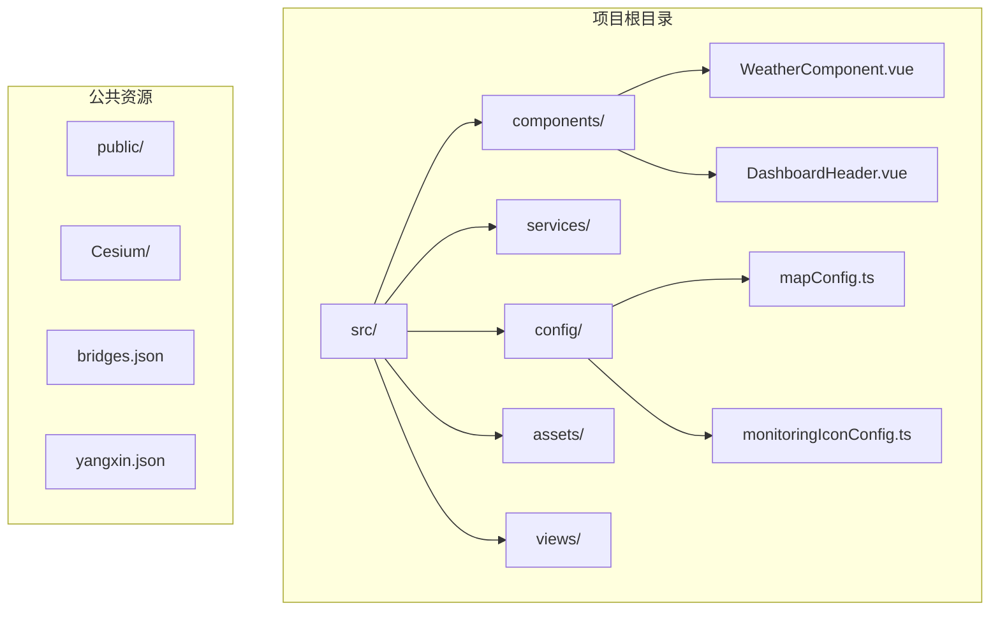
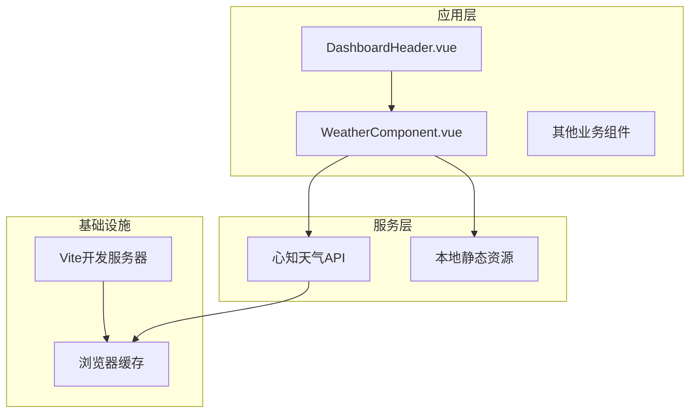
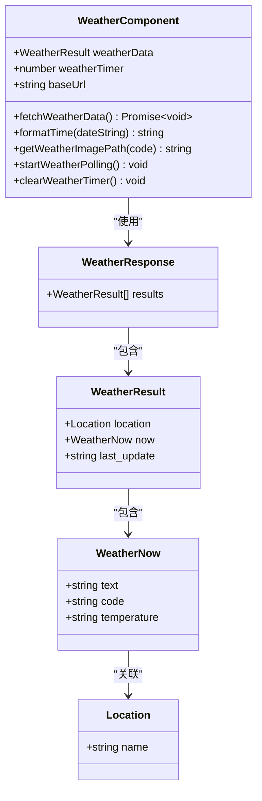
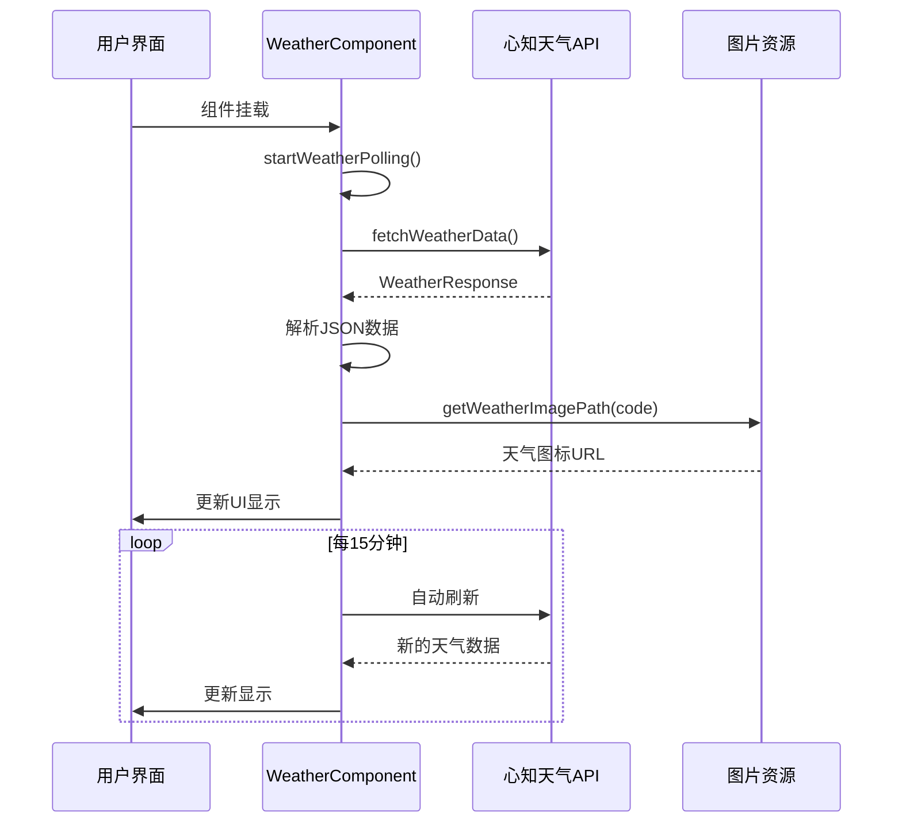
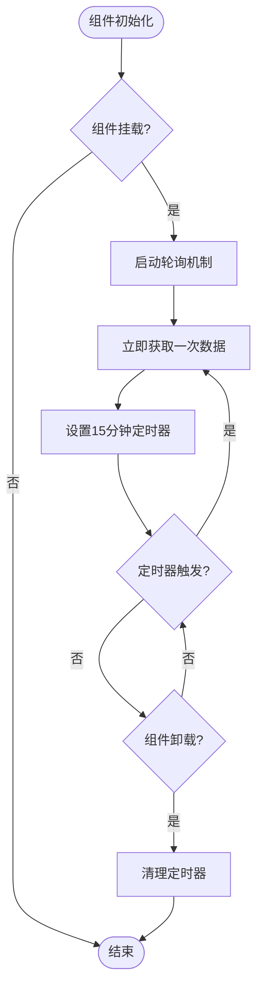
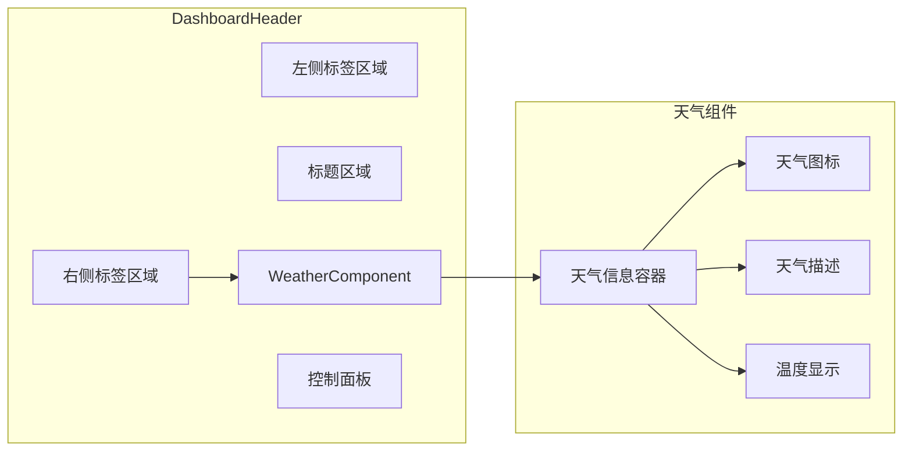

# 天气组件

<cite>
**本文档引用的文件**
- [WeatherComponent.vue](file://src/components/WeatherComponent.vue)
- [DashboardHeader.vue](file://src/components/DashboardHeader.vue)
- [main.ts](file://src/main.ts)
- [mapConfig.ts](file://src/config/mapConfig.ts)
- [package.json](file://package.json)
- [index.html](file://index.html)
</cite>

## 目录
1. [简介](#简介)
2. [项目结构](#项目结构)
3. [核心组件](#核心组件)
4. [架构概览](#架构概览)
5. [详细组件分析](#详细组件分析)
6. [依赖关系分析](#依赖关系分析)
7. [性能考虑](#性能考虑)
8. [故障排除指南](#故障排除指南)
9. [结论](#结论)

## 简介

天气组件是政府dashboard项目中的一个Vue 3组件，用于实时显示指定位置的天气信息。该组件集成了心知天气API，提供当前天气状况、温度和天气图标显示功能。组件设计为响应式，具有自动更新机制，每15分钟从API获取最新的天气数据。

## 项目结构

该项目采用Vue 3 + TypeScript + Vite的现代前端技术栈构建，天气组件位于components目录下，与项目的主要组件结构保持一致。



**图表来源**
- [WeatherComponent.vue](file://src/components/WeatherComponent.vue#L1-L131)
- [DashboardHeader.vue](file://src/components/DashboardHeader.vue#L1-L236)
- [mapConfig.ts](file://src/config/mapConfig.ts#L1-L55)

**章节来源**
- [WeatherComponent.vue](file://src/components/WeatherComponent.vue#L1-L131)
- [DashboardHeader.vue](file://src/components/DashboardHeader.vue#L1-L236)
- [mapConfig.ts](file://src/config/mapConfig.ts#L1-L55)

## 核心组件

天气组件的核心功能包括：

### 数据模型定义
组件定义了完整的TypeScript接口来描述天气API的响应格式：
- WeatherNow：当前天气信息（天气现象、代码、温度）
- WeatherResult：单个地点的天气结果（位置信息、当前天气、最后更新时间）
- WeatherResponse：API响应主体（包含多个地点的结果数组）

### API集成
- 使用心知天气免费版API获取实时天气数据
- 固定位置：江西省上饶市（坐标：29.85:115.2）
- 支持中文显示和摄氏温度单位
- 15分钟自动刷新机制

### 用户界面
- 响应式布局设计
- 天气图标动态加载
- 时间戳格式化显示
- 点击提示功能显示最后更新时间

**章节来源**
- [WeatherComponent.vue](file://src/components/WeatherComponent.vue#L21-L37)
- [WeatherComponent.vue](file://src/components/WeatherComponent.vue#L43-L48)
- [WeatherComponent.vue](file://src/components/WeatherComponent.vue#L109-L131)

## 架构概览

天气组件在整个应用架构中的位置和交互关系如下：



**图表来源**
- [DashboardHeader.vue](file://src/components/DashboardHeader.vue#L42-L60)
- [WeatherComponent.vue](file://src/components/WeatherComponent.vue#L43-L48)
- [WeatherComponent.vue](file://src/components/WeatherComponent.vue#L15-L18)

## 详细组件分析

### 组件类图



**图表来源**
- [WeatherComponent.vue](file://src/components/WeatherComponent.vue#L21-L37)
- [WeatherComponent.vue](file://src/components/WeatherComponent.vue#L11-L131)

### 数据流序列图



**图表来源**
- [WeatherComponent.vue](file://src/components/WeatherComponent.vue#L82-L98)
- [WeatherComponent.vue](file://src/components/WeatherComponent.vue#L53-L70)
- [WeatherComponent.vue](file://src/components/WeatherComponent.vue#L17-L18)

### 生命周期流程图



**图表来源**
- [WeatherComponent.vue](file://src/components/WeatherComponent.vue#L100-L106)
- [WeatherComponent.vue](file://src/components/WeatherComponent.vue#L82-L98)

**章节来源**
- [WeatherComponent.vue](file://src/components/WeatherComponent.vue#L1-L131)

### 组件集成分析

天气组件作为DashboardHeader的子组件被集成到主界面中：



**图表来源**
- [DashboardHeader.vue](file://src/components/DashboardHeader.vue#L42-L60)
- [WeatherComponent.vue](file://src/components/WeatherComponent.vue#L2-L8)

**章节来源**
- [DashboardHeader.vue](file://src/components/DashboardHeader.vue#L41-L60)

## 依赖关系分析

### 外部依赖

项目使用以下关键依赖来支持天气组件的功能：

```mermaid
graph TB
subgraph "运行时依赖"
A[vue@^3.5.18]
B[dayjs@^1.11.15]
C[pinia@^3.0.3]
D[naive-ui@^2.40.1]
E[vue-cesium@^3.2.9]
end
subgraph "开发依赖"
F[@typescript-eslint/eslint-plugin]
G[@vitejs/plugin-vue]
H[sass@^1.90.0]
I[vite@^7.0.6]
end
WeatherComponent --> A
WeatherComponent --> B
WeatherComponent --> C
```

**图表来源**
- [package.json](file://package.json#L15-L32)
- [package.json](file://package.json#L33-L48)

### 环境配置

天气组件依赖于Vite的环境变量配置：

| 配置项 | 值 | 用途 |
|--------|-----|------|
| VITE_BASE_URL | 未在代码中显式设置 | 提供静态资源基础路径 |
| API密钥 | S7UpaNKFdnOsxV2sE | 心知天气API访问凭证 |
| 位置坐标 | 29.85:115.2 | 上饶市坐标（固定） |

**章节来源**
- [WeatherComponent.vue](file://src/components/WeatherComponent.vue#L15-L18)
- [WeatherComponent.vue](file://src/components/WeatherComponent.vue#L44-L45)

## 性能考虑

### 缓存策略
- **定时刷新**：15分钟间隔避免频繁API调用
- **浏览器缓存**：静态图片资源利用浏览器缓存机制
- **内存管理**：组件卸载时自动清理定时器，防止内存泄漏

### 网络优化
- **单一请求**：每次只获取必要的天气数据
- **错误处理**：网络异常时记录错误但不影响应用其他功能
- **资源压缩**：生产环境下Vite自动进行资源压缩

### 用户体验
- **即时显示**：组件挂载后立即获取数据
- **优雅降级**：API失败时组件仍可正常渲染空状态
- **响应式设计**：适配不同屏幕尺寸的显示需求

## 故障排除指南

### 常见问题及解决方案

| 问题类型 | 症状 | 可能原因 | 解决方案 |
|----------|------|----------|----------|
| API请求失败 | 控制台显示网络错误 | 网络连接问题或API限制 | 检查网络连接，确认API密钥有效 |
| 图片加载失败 | 天气图标显示为占位符 | 图片资源路径错误 | 验证VITE_BASE_URL配置 |
| 数据不更新 | 天气信息长时间不变 | 定时器未正确设置 | 检查组件生命周期钩子 |
| 显示异常 | 组件样式错乱 | CSS类名冲突 | 检查scoped样式作用域 |

### 调试建议

1. **网络请求调试**：使用浏览器开发者工具的Network选项卡监控API请求
2. **数据验证**：在控制台输出weatherData变量检查数据结构
3. **定时器检查**：确认weatherTimer变量的状态和值
4. **错误日志**：关注console.error输出的错误信息

**章节来源**
- [WeatherComponent.vue](file://src/components/WeatherComponent.vue#L67-L69)
- [WeatherComponent.vue](file://src/components/WeatherComponent.vue#L93-L98)

## 结论

天气组件是一个设计精良的Vue 3组件，具有以下特点：

### 优势
- **模块化设计**：独立的组件结构，易于维护和复用
- **响应式更新**：自动化的数据刷新机制
- **错误处理**：完善的异常捕获和处理逻辑
- **性能优化**：合理的缓存策略和资源管理

### 改进建议
- **配置化**：将API密钥和位置参数提取为可配置项
- **国际化**：支持多语言切换功能
- **主题定制**：提供更多的样式定制选项
- **数据持久化**：考虑将天气数据存储在本地缓存中

该组件成功地将外部天气API集成到政府dashboard项目中，为用户提供实时的天气信息显示，是项目前端架构中不可或缺的一部分。