# 核心组件架构

<cite>
**本文档中引用的文件**
- [App.vue](file://src/App.vue)
- [PersistentLayout.vue](file://src/layouts/PersistentLayout.vue)
- [MapView.vue](file://src/views/MapView.vue)
- [Map.vue](file://src/mapComponents/Map.vue)
- [MapToolbar.vue](file://src/mapComponents/MapToolbar.vue)
- [DashboardHeader.vue](file://src/components/DashboardHeader.vue)
- [ResponsiveWrapper.vue](file://src/components/ResponsiveWrapper.vue)
- [main.ts](file://src/main.ts)
- [router/index.ts](file://src/router/index.ts)
- [mapStore.ts](file://src/stores/mapStore.ts)
- [useMapHooks.ts](file://src/hook/useMapHooks.ts)
- [useMonitoringPoints.ts](file://src/hook/useMonitoringPoints.ts)
- [mapConfig.ts](file://src/config/mapConfig.ts)
</cite>

## 更新摘要
**变更内容**
- 新增PersistentLayout.vue持久化布局系统，实现地图和头部组件的持久化
- 路由系统从keep-alive改为嵌套路由实现持久化布局
- 改进组件通信机制，使用provide/inject替代keep-alive
- MapToolbar.vue现在注入监测点位管理Hook，增强组件间协作

## 目录
1. [项目概述](#项目概述)
2. [应用入口架构](#应用入口架构)
3. [路由系统设计](#路由系统设计)
4. [状态管理系统](#状态管理系统)
5. [持久化布局系统](#持久化布局系统)
6. [地图组件架构](#地图组件架构)
7. [工具栏组件设计](#工具栏组件设计)
8. [响应式布局系统](#响应式布局系统)
9. [组件通信机制](#组件通信机制)
10. [架构总结](#架构总结)

## 项目概述

该政府dashboard项目是一个基于Vue 3和Cesium的地理信息系统，采用现代化的前端架构设计，实现了完整的GIS功能和响应式布局。项目核心围绕地图可视化、数据展示和用户交互展开，具有清晰的组件层次结构和完善的通信机制。最新的架构变更引入了持久化布局系统，进一步提升了用户体验和性能表现。

## 应用入口架构

### App.vue根组件职责

App.vue作为整个应用的根组件，承担着全局配置和路由管理的重要职责：

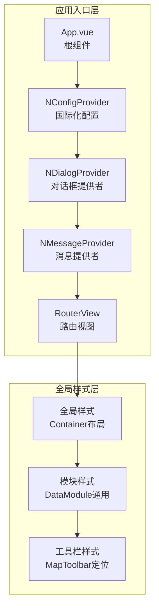

**图表来源**
- [App.vue](file://src/App.vue#L12-L20)

#### 核心功能特性

1. **全局UI提供者配置**
   - 集成Naive UI组件库的国际化配置
   - 统一的消息提示和对话框管理
   - 响应式布局的基础配置

2. **路由视图管理**
   - 使用router-view作为唯一的路由出口
   - 布局逻辑由嵌套路由组件管理
   - 无需keep-alive缓存，简化组件生命周期管理

3. **全局样式系统**
   - 定义左侧和右侧内容区域的布局规范
   - 提供数据模块的通用样式模板
   - 实现渐变背景和动画效果

**章节来源**
- [App.vue](file://src/App.vue#L1-L159)

### 应用初始化流程

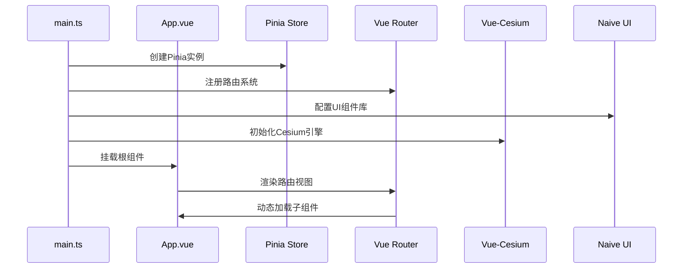

**图表来源**
- [main.ts](file://src/main.ts#L10-L29)

**章节来源**
- [main.ts](file://src/main.ts#L1-L30)

## 路由系统设计

### 路由架构概览

项目采用Vue Router实现多页面应用的路由管理，支持动态路由和权限控制。最新的架构变更引入了嵌套路由系统，通过PersistentLayout组件实现布局的持久化：

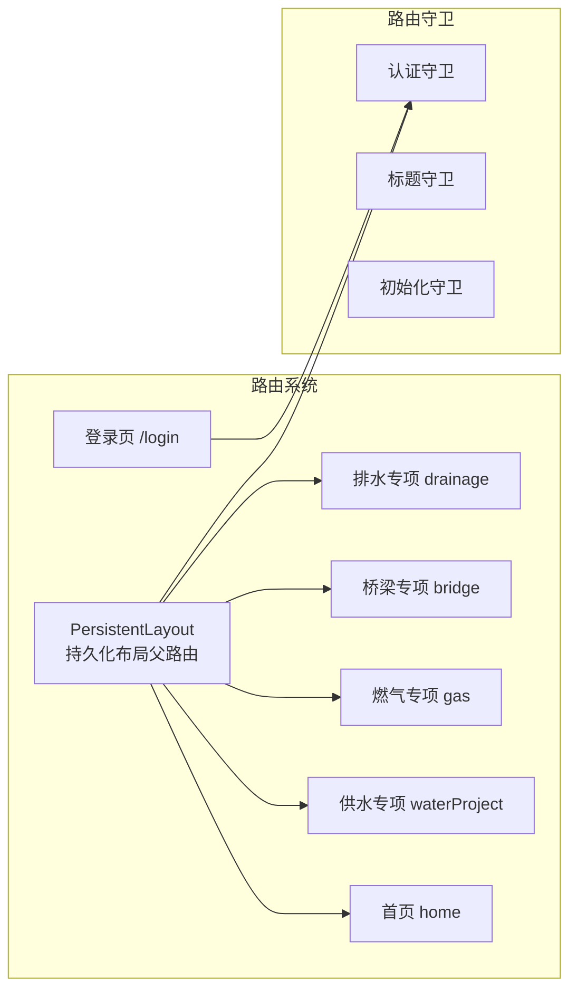

**图表来源**
- [router/index.ts](file://src/router/index.ts#L17-L89)

#### 路由配置特点

1. **嵌套路由结构**
   - 登录页使用独立布局，无需认证
   - 业务模块通过PersistentLayout实现布局持久化
   - 子路由组件按功能分类组织

2. **权限控制机制**
   - 路由元信息控制认证需求
   - 登录状态验证和自动跳转
   - 未授权访问的重定向处理

3. **导航守卫系统**
   - beforeEach执行认证检查
   - afterEach记录路由变更日志
   - 自动初始化认证状态

**章节来源**
- [router/index.ts](file://src/router/index.ts#L1-L136)

## 状态管理系统

### Pinia状态架构

项目使用Pinia作为状态管理解决方案，提供了集中化的状态控制：

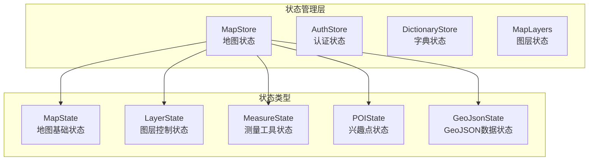

**图表来源**
- [mapStore.ts](file://src/stores/mapStore.ts#L18-L400)

#### 核心状态管理功能

1. **地图状态控制**
   - Viewer实例管理
   - 视图模式切换（2D/3D）
   - 全屏模式控制
   - 加载状态跟踪

2. **图层状态管理**
   - 基础图层控制（卫星、地形、标签）
   - 自定义图层管理
   - 图层树状态维护
   - 图层可见性和透明度控制

3. **测量工具集成**
   - 测量工具激活状态
   - 测量结果数据管理
   - 测量工具类型控制

**章节来源**
- [mapStore.ts](file://src/stores/mapStore.ts#L1-L400)

## 持久化布局系统

### PersistentLayout.vue架构设计

PersistentLayout.vue是本次架构变更的核心组件，实现了地图和头部组件的持久化布局：

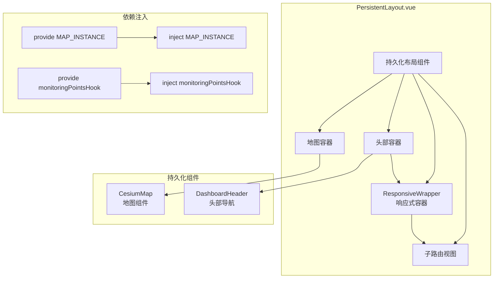

**图表来源**
- [PersistentLayout.vue](file://src/layouts/PersistentLayout.vue#L11-L47)

#### 核心功能特性

1. **布局持久化机制**
   - 地图组件始终挂载，不会随路由切换而销毁
   - 头部导航和响应式容器保持不变
   - 子路由内容通过router-view动态更新

2. **依赖注入系统**
   - 通过provide向子组件提供地图实例引用
   - 提供监测点位管理Hook，支持响应式数据共享
   - 使用computed确保响应式数据的正确传递

3. **路由切换优化**
   - 使用:ke="route.fullPath"确保子组件在路由变化时强制重新创建
   - 保持布局框架稳定，提升用户体验
   - 减少组件重新初始化的开销

**章节来源**
- [PersistentLayout.vue](file://src/layouts/PersistentLayout.vue#L1-L58)

### 持久化布局通信流程

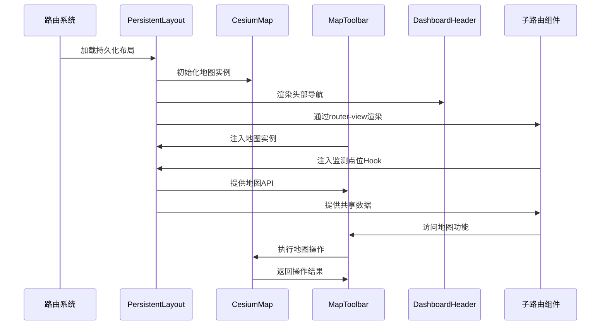

**图表来源**
- [PersistentLayout.vue](file://src/layouts/PersistentLayout.vue#L34-L47)

## 地图组件架构

### Map.vue组件设计

Map.vue是项目的核心地图组件，负责Cesium Viewer实例的完整生命周期管理：

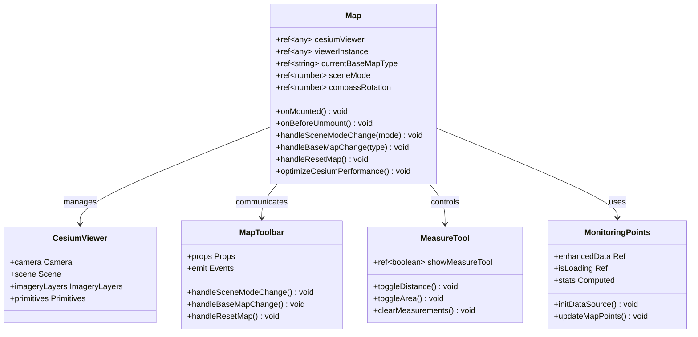

**图表来源**
- [Map.vue](file://src/mapComponents/Map.vue#L80-L404)

#### 组件核心功能

1. **Cesium Viewer生命周期管理**
   - 初始化Viewer实例
   - 性能优化配置
   - 清理函数注册
   - 销毁前资源释放

2. **相机控制系统**
   - 初始相机位置设置
   - 相机范围限制
   - 指北针旋转跟踪
   - 场景模式切换（2D/3D）

3. **底图切换机制**
   - 天地图服务集成
   - 底图类型管理（矢量、影像、地形）
   - 动态底图切换
   - 加载状态监控

4. **测量工具集成**
   - VcMeasurements组件封装
   - 距离和面积测量
   - 测量结果管理
   - 工具状态同步

5. **监测点位管理**
   - useMonitoringPoints Hook集成
   - 增强数据处理和渲染
   - 防重叠算法实现
   - 相机高度自适应

**章节来源**
- [Map.vue](file://src/mapComponents/Map.vue#L1-L627)

### 地图组件通信流程

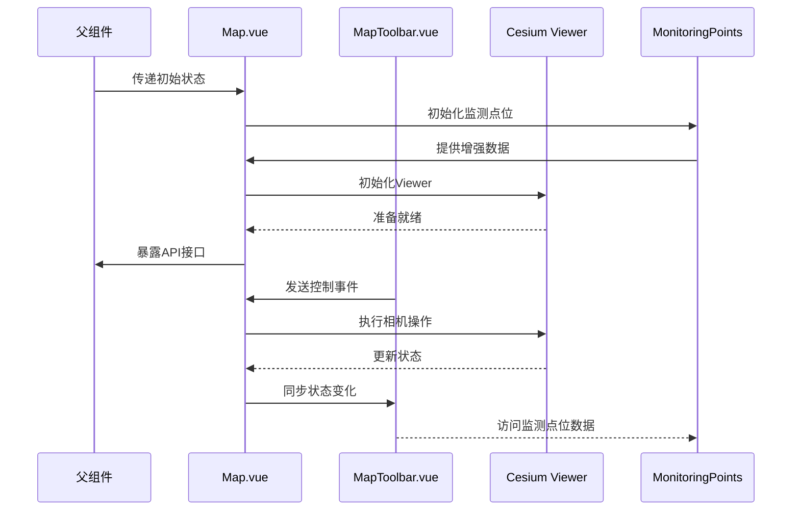

**图表来源**
- [Map.vue](file://src/mapComponents/Map.vue#L310-L358)

## 工具栏组件设计

### MapToolbar.vue通信机制

MapToolbar.vue作为地图工具栏组件，实现了与父组件的双向通信：

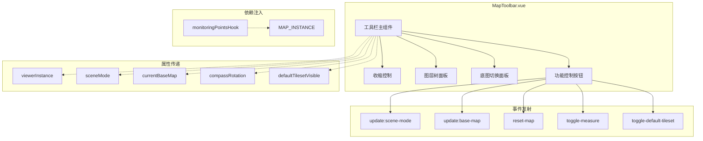

**图表来源**
- [MapToolbar.vue](file://src/mapComponents/MapToolbar.vue#L90-L118)

#### 事件通信机制

1. **事件发射类型**
   - `update:scene-mode`: 场景模式切换事件
   - `update:base-map`: 底图类型变更事件
   - `reset-map`: 地图重置事件
   - `toggle-measure`: 测量工具切换事件
   - `toggle-default-tileset`: 默认3D Tiles切换事件

2. **属性传递系统**
   - `viewerInstance`: Cesium Viewer实例引用
   - `sceneMode`: 当前场景模式状态
   - `currentBaseMap`: 当前底图类型
   - `compassRotation`: 指北针旋转角度
   - `defaultTilesetVisible`: 默认3D Tiles显示状态

3. **依赖注入系统**
   - 注入监测点位管理Hook（来自PersistentLayout）
   - 提供响应式数据访问能力
   - 支持跨组件状态共享

4. **UI状态管理**
   - 面板展开/收起控制
   - 激活状态高亮显示
   - 动画过渡效果
   - 响应式布局适配

**章节来源**
- [MapToolbar.vue](file://src/mapComponents/MapToolbar.vue#L1-L561)

### 工具栏功能模块

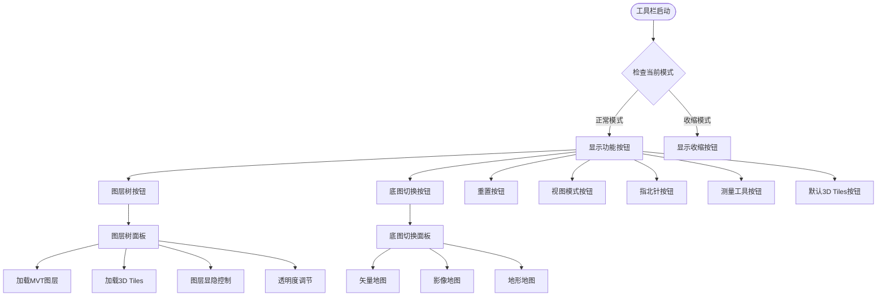

**图表来源**
- [MapToolbar.vue](file://src/mapComponents/MapToolbar.vue#L11-L75)

## 响应式布局系统

### ResponsiveWrapper组件架构

ResponsiveWrapper.vue实现了完整的响应式布局系统，支持多种缩放模式：

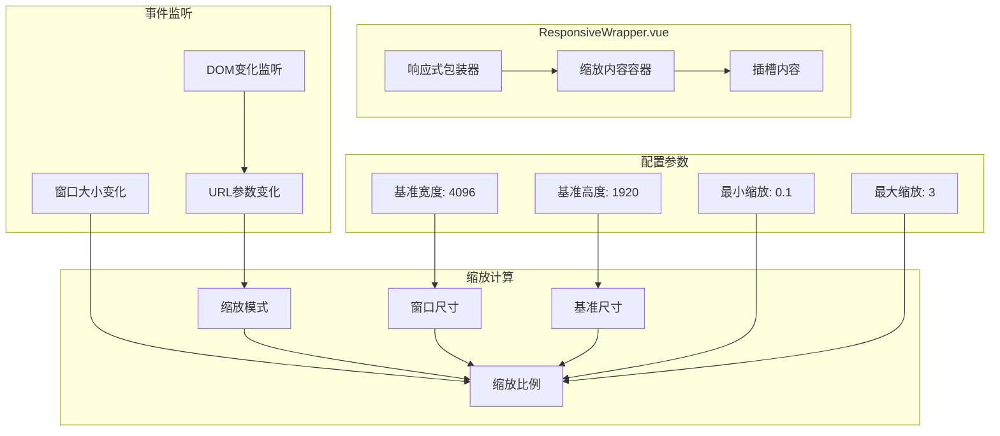

**图表来源**
- [ResponsiveWrapper.vue](file://src/components/ResponsiveWrapper.vue#L14-L135)

#### 响应式计算逻辑

1. **缩放模式支持**
   - `width`模式：按宽度比例缩放
   - `height`模式：按高度比例缩放
   - URL参数优先级控制
   - 默认宽度模式

2. **尺寸计算算法**
   ```typescript
   // 宽度模式计算
   scale = windowWidth / baseWidth
   
   // 高度模式计算  
   scale = windowHeight / baseHeight
   
   // 范围限制
   scale = clamp(scale, minScale, maxScale)
   ```

3. **事件监听机制**
   - 窗口resize事件防抖处理
   - URL参数变化监听
   - DOM变化观察器
   - 响应式数据更新

**章节来源**
- [ResponsiveWrapper.vue](file://src/components/ResponsiveWrapper.vue#L1-L211)

### 分辨率适配原理

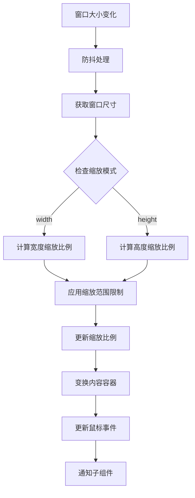

**图表来源**
- [ResponsiveWrapper.vue](file://src/components/ResponsiveWrapper.vue#L67-L92)

## 组件通信机制

### 父子组件通信模式

项目采用了多种组件通信模式，确保数据流的清晰和高效：

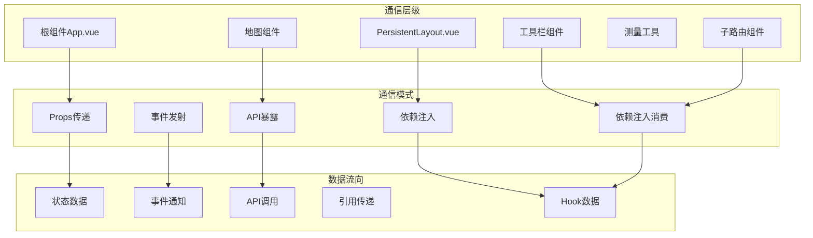

#### 通信机制详解

1. **Props传递模式**
   - 父组件向子组件传递配置数据
   - 类型安全的接口定义
   - 默认值和验证机制

2. **事件发射模式**
   - 子组件向父组件发送状态变更
   - 自定义事件命名规范
   - 事件参数结构化设计

3. **依赖注入模式**
   - 响应式数据跨层级共享
   - provide/inject组合使用
   - 响应式引用传递

4. **API暴露模式**
   - 子组件向父组件暴露方法
   - defineExpose统一接口
   - 类型安全的方法签名

5. **Hook共享机制**
   - useMonitoringPoints Hook跨组件共享
   - 响应式数据的自动更新
   - 组件间状态的一致性保证

**章节来源**
- [Map.vue](file://src/mapComponents/Map.vue#L390-L404)
- [MapToolbar.vue](file://src/mapComponents/MapToolbar.vue#L328-L333)
- [PersistentLayout.vue](file://src/layouts/PersistentLayout.vue#L40-L47)

### 数据流架构

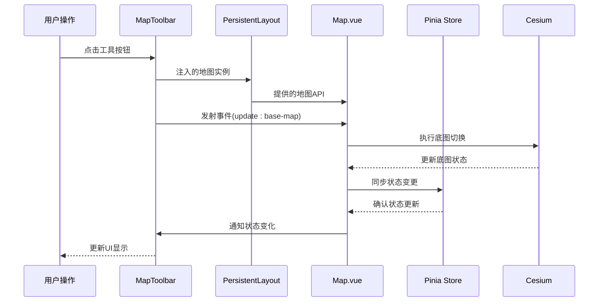

**图表来源**
- [MapToolbar.vue](file://src/mapComponents/MapToolbar.vue#L288-L292)
- [Map.vue](file://src/mapComponents/Map.vue#L328-L333)

## 架构总结

### 整体架构特点

该项目展现了现代前端架构的最佳实践，具有以下特点：

1. **模块化设计**
   - 清晰的组件分层结构
   - 职责单一的功能模块
   - 可复用的工具函数集合

2. **持久化布局**
   - 通过嵌套路由实现布局持久化
   - 地图和头部组件保持不变
   - 子路由内容动态更新
   - 提升用户体验和性能

3. **状态管理**
   - 集中式状态管理
   - 响应式数据驱动
   - 类型安全的状态定义

4. **通信机制**
   - 多种通信模式支持
   - 明确的数据流向
   - 异步事件处理
   - Hook共享机制

5. **性能优化**
   - 组件缓存策略
   - 资源懒加载
   - 防抖和节流处理
   - 持久化布局减少重渲染

### 技术栈优势

1. **Vue 3生态系统**
   - Composition API的灵活性
   - 响应式系统的高效性
   - 组件开发的现代化体验

2. **Cesium集成**
   - 强大的3D地球渲染能力
   - 丰富的GIS功能支持
   - 高性能的图形处理

3. **TypeScript支持**
   - 编译时类型检查
   - 开发时智能提示
   - 运行时类型保障

4. **现代路由系统**
   - 嵌套路由的灵活性
   - 持久化布局的性能优势
   - 简化的组件生命周期管理

### 架构扩展性

该架构设计具备良好的扩展性：
- 新功能模块易于集成
- 状态管理可水平扩展
- 组件通信机制灵活
- 插件化开发支持
- Hook共享机制便于数据复用

通过这种架构设计，项目实现了功能完整性、性能优化和开发效率的平衡，为政府dashboard应用提供了坚实的技术基础。持久化布局系统的引入进一步提升了用户体验，使地图应用在多模块切换时保持流畅和一致的性能表现。