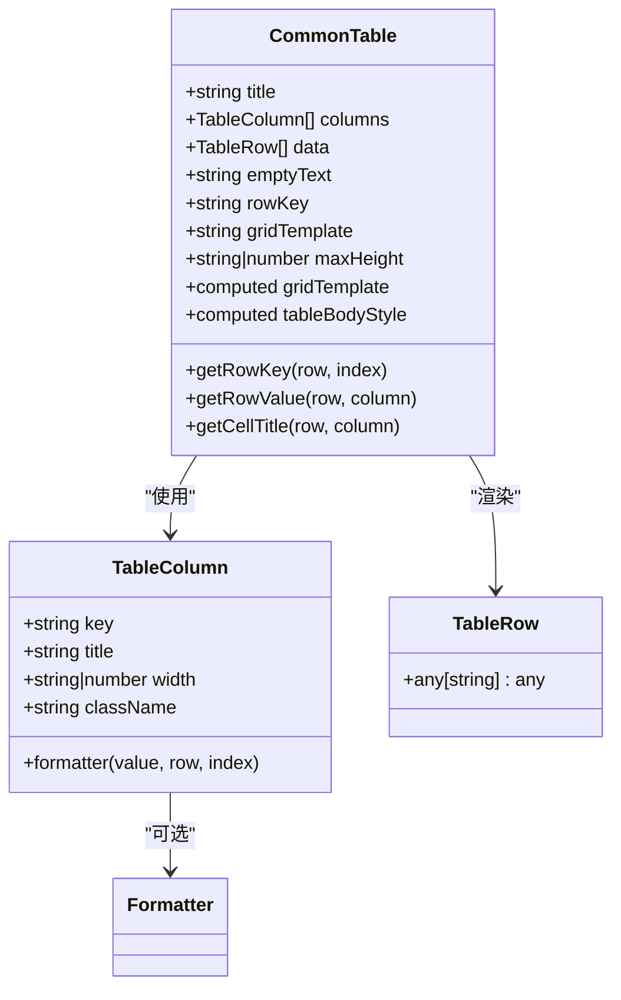
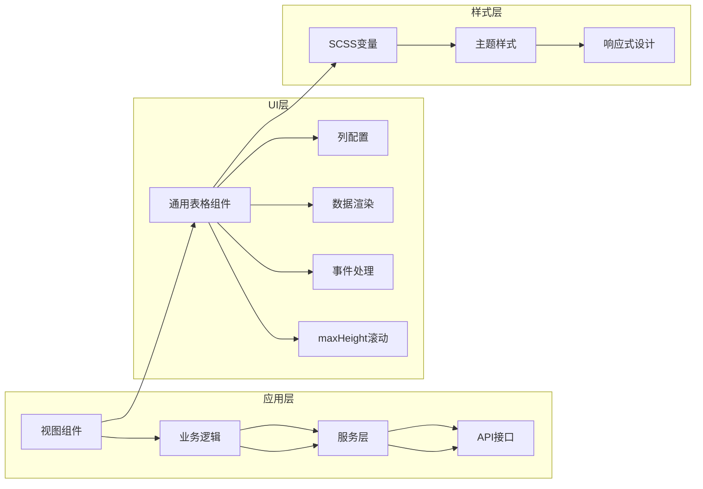
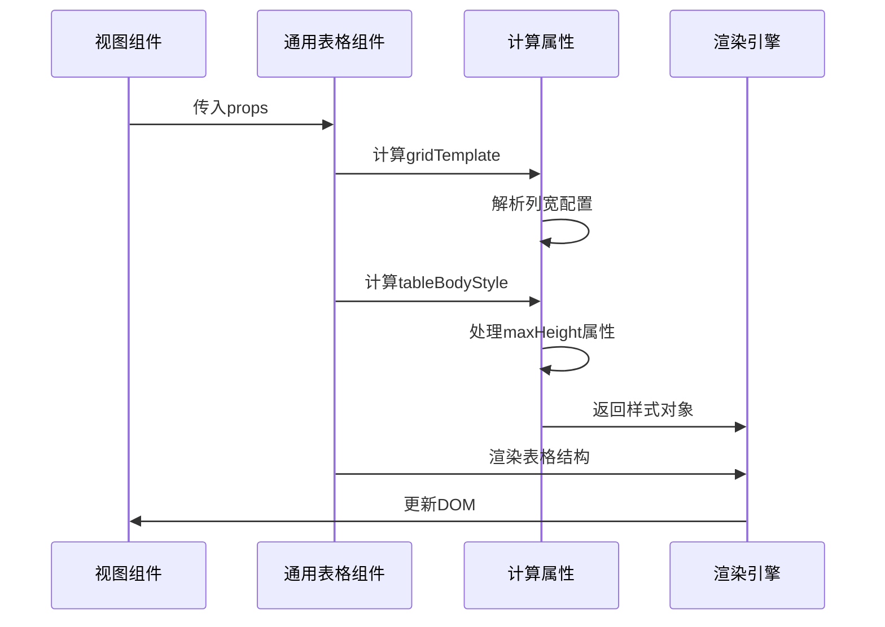
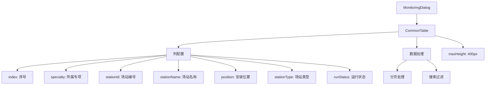
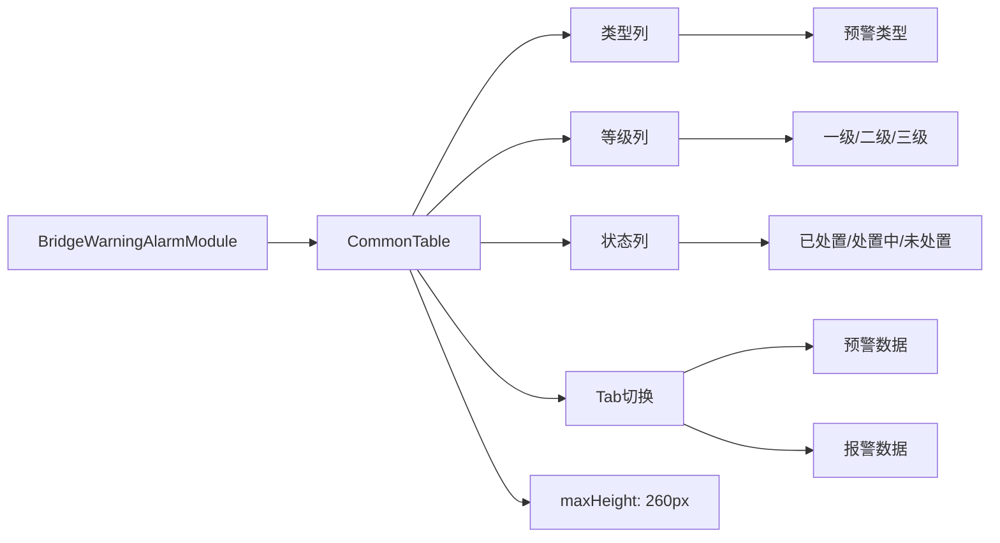
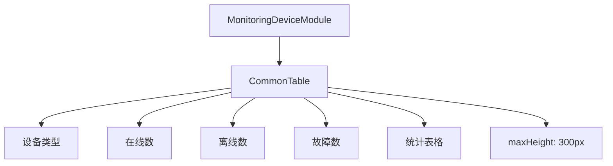
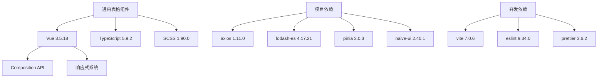

# 通用表格组件

<cite>
**本文档引用的文件**
- [CommonTable.vue](file://src/components/CommonTable.vue)
- [MonitoringDialog.vue](file://src/views/GasModule/components/map/MonitoringDialog.vue)
- [BridgeWarningAlarmModule.vue](file://src/views/BridgeModule/components/BridgeWarningAlarmModule.vue)
- [InfrastructureModule.vue](file://src/views/GasModule/components/InfrastructureModule.vue)
- [MonitoringDeviceModule.vue](file://src/views/BridgeModule/components/MonitoringDeviceModule.vue)
- [MonitoringEarlyWarningModule.vue](file://src/views/HomeModule/components/MonitoringEarlyWarningModule.vue)
- [commonService.ts](file://src/services/commonService.ts)
- [variables.scss](file://src/assets/styles/variables.scss)
- [package.json](file://package.json)
- [main.ts](file://src/main.ts)
</cite>

## 更新摘要
**变更内容**
- 新增maxHeight属性支持可滚动内容区域
- 更新组件属性配置表，添加maxHeight字段说明
- 增强性能考虑章节，包含滚动优化建议
- 更新故障排除指南，添加滚动相关问题解决方案

## 目录
1. [简介](#简介)
2. [项目结构](#项目结构)
3. [核心组件](#核心组件)
4. [架构概览](#架构概览)
5. [详细组件分析](#详细组件分析)
6. [依赖分析](#依赖分析)
7. [性能考虑](#性能考虑)
8. [故障排除指南](#故障排除指南)
9. [结论](#结论)

## 简介

通用表格组件是政府dashboard项目中的核心UI组件之一，采用Vue 3 Composition API和TypeScript实现。该组件提供了高度可定制的数据表格解决方案，支持响应式布局、自定义列宽、数据格式化等功能，广泛应用于各个业务模块中。

该组件的设计理念是提供一个轻量级、高性能且易于使用的表格解决方案，能够满足政府dashboard项目中各种数据展示需求。通过灵活的配置选项和插槽机制，开发者可以轻松地创建符合业务需求的表格界面。

**更新** 新增maxHeight属性，支持可配置的最大内容高度和垂直滚动功能，有效解决大数据量场景下的性能和用户体验问题。

## 项目结构

政府dashboard项目采用模块化的组织方式，通用表格组件位于components目录下，与其他组件协同工作：

```mermaid
graph TB
subgraph "项目结构"
A[src/components/] --> B[CommonTable.vue]
A --> C[DashboardHeader.vue]
A --> D[ResponsiveWrapper.vue]
E[src/views/] --> F[GasModule/]
E --> G[BridgeModule/]
E --> H[HomeModule/]
F --> I[InfrastructureModule.vue]
F --> J[MonitoringDialog.vue]
G --> K[BridgeWarningAlarmModule.vue]
L[src/services/] --> M[commonService.ts]
L --> N[gasService.ts]
L --> O[bridgeService.ts]
end
end
```

**图表来源**
- [CommonTable.vue](file://src/components/CommonTable.vue#L1-L309)
- [MonitoringDialog.vue](file://src/views/GasModule/components/map/MonitoringDialog.vue#L1-L200)
- [BridgeWarningAlarmModule.vue](file://src/views/BridgeModule/components/BridgeWarningAlarmModule.vue#L1-L200)

**章节来源**
- [CommonTable.vue](file://src/components/CommonTable.vue#L1-L309)
- [package.json](file://package.json#L1-L49)

## 核心组件

### 组件架构设计

通用表格组件采用了现代化的Vue 3设计模式，具有以下核心特性：



**图表来源**
- [CommonTable.vue](file://src/components/CommonTable.vue#L65-L150)

### 主要功能特性

1. **响应式布局**: 使用CSS Grid实现自适应列宽分配
2. **数据格式化**: 支持自定义格式化函数处理显示数据
3. **空数据处理**: 提供友好的空数据状态显示
4. **滚动支持**: 可配置的最大高度和垂直滚动
5. **样式定制**: 支持自定义CSS类名和网格模板

**更新** 新增maxHeight属性，支持数值像素值和CSS单位，自动启用垂直滚动条。

**章节来源**
- [CommonTable.vue](file://src/components/CommonTable.vue#L62-L150)

## 架构概览

通用表格组件在整个项目架构中扮演着重要的角色，作为数据展示的基础组件被多个业务模块复用：



**图表来源**
- [CommonTable.vue](file://src/components/CommonTable.vue#L1-L309)
- [variables.scss](file://src/assets/styles/variables.scss#L1-L218)

## 详细组件分析

### 组件属性配置

通用表格组件提供了丰富的配置选项，满足不同场景下的使用需求：

| 属性名 | 类型 | 默认值 | 描述 |
|--------|------|--------|------|
| title | string | '' | 表格标题文本 |
| columns | TableColumn[] | 必填 | 列配置数组 |
| data | TableRow[] | [] | 表格数据数组 |
| emptyText | string | '暂无数据' | 空数据时的提示文本 |
| rowKey | string | 'id' | 行数据的唯一标识字段名 |
| gridTemplate | string | '' | 自定义CSS Grid模板 |
| maxHeight | string \| number | '' | 表格内容的最大高度，支持数值像素值和CSS单位 |

**更新** 新增maxHeight属性，支持数字像素值（如400）和CSS单位字符串（如'400px'、'50%'），当设置此属性时，表格内容区域将启用垂直滚动。

### 列配置详解

每个列可以通过TableColumn接口进行详细配置：

```mermaid
flowchart TD
A[列配置] --> B[key: 列标识符]
A --> C[title: 列标题]
A --> D[width: 列宽]
A --> E[className: CSS类名]
A --> F[formatter: 格式化函数]
D --> G[支持数值像素值]
D --> H[支持CSS fr单位]
D --> I[支持百分比]
F --> J[接收(value, row, index)]
F --> K[返回格式化后的值]
```

**图表来源**
- [CommonTable.vue](file://src/components/CommonTable.vue#L65-L72)

### 数据渲染流程

组件采用虚拟DOM和计算属性优化渲染性能：



**图表来源**
- [CommonTable.vue](file://src/components/CommonTable.vue#L106-L129)

**章节来源**
- [CommonTable.vue](file://src/components/CommonTable.vue#L79-L104)

### 实际应用场景

#### 燃气场站监控对话框

在燃气模块中，通用表格组件被用于展示场站列表数据：



**图表来源**
- [MonitoringDialog.vue](file://src/views/GasModule/components/map/MonitoringDialog.vue#L112-L128)

#### 桥梁预警报警模块

在桥梁模块中，表格组件用于展示预警和报警统计数据：



**图表来源**
- [BridgeWarningAlarmModule.vue](file://src/views/BridgeModule/components/BridgeWarningAlarmModule.vue#L161-L169)

#### 监测设备模块

在桥梁监测设备模块中，表格组件用于展示设备状态统计：



**图表来源**
- [MonitoringDeviceModule.vue](file://src/views/BridgeModule/components/MonitoringDeviceModule.vue#L47-L56)

**章节来源**
- [MonitoringDialog.vue](file://src/views/GasModule/components/map/MonitoringDialog.vue#L43-L76)
- [BridgeWarningAlarmModule.vue](file://src/views/BridgeModule/components/BridgeWarningAlarmModule.vue#L102-L111)
- [MonitoringDeviceModule.vue](file://src/views/BridgeModule/components/MonitoringDeviceModule.vue#L47-L56)

## 依赖分析

### 技术栈依赖

通用表格组件基于现代前端技术栈构建，主要依赖包括：



**图表来源**
- [package.json](file://package.json#L15-L48)

### 样式系统集成

组件深度集成了项目的样式系统，使用SCSS变量和混合器：

| 样式变量 | 值 | 用途 |
|----------|----|----|
| --primary-color | #1677ff | 主色调 |
| --success-color | #52c41a | 成功状态色 |
| --warning-color | #faad14 | 警告状态色 |
| --error-color | #ff4d4f | 错误状态色 |
| $font-size-xxl | 24px | 超大字体 |
| $font-size-3xl | 30px | 超大字体 |
| $font-size-4xl | 32px | 超大字体 |

**章节来源**
- [variables.scss](file://src/assets/styles/variables.scss#L1-L218)
- [package.json](file://package.json#L15-L48)

## 性能考虑

### 渲染优化策略

通用表格组件采用了多种性能优化技术：

1. **计算属性缓存**: 使用`computed`属性缓存网格模板和样式计算结果
2. **条件渲染**: 仅在有数据时渲染表格主体，空数据时显示占位符
3. **虚拟滚动**: 对于大量数据场景，建议使用虚拟滚动技术
4. **懒加载**: 图片资源采用懒加载策略
5. **滚动优化**: maxHeight属性启用CSS滚动，避免DOM溢出问题

**更新** 新增滚动优化建议，maxHeight属性自动启用`overflow-y: auto`样式，提供流畅的滚动体验。

### 内存管理

组件实现了良好的内存管理机制：

- 使用`withDefaults`确保属性的默认值正确设置
- 合理的事件监听器清理机制
- 避免不必要的DOM操作
- 滚动容器的内存优化

### 最佳实践

1. **合理设置maxHeight**: 根据内容量和屏幕空间设置合适的最大高度
2. **使用CSS单位**: 建议使用百分比或相对单位以适配不同屏幕尺寸
3. **避免过度滚动**: 大量数据时考虑分页或虚拟滚动方案
4. **性能监控**: 监控滚动性能，必要时优化数据渲染

**章节来源**
- [CommonTable.vue](file://src/components/CommonTable.vue#L106-L115)

## 故障排除指南

### 常见问题及解决方案

#### 表格列宽显示异常

**问题描述**: 表格列宽无法正确显示或布局错乱

**可能原因**:
1. gridTemplate属性配置错误
2. 列宽单位不匹配
3. CSS样式冲突

**解决方案**:
1. 检查gridTemplate属性的CSS Grid语法
2. 确保列宽使用正确的单位（px、fr、%）
3. 检查是否有其他CSS规则影响表格布局

#### 数据格式化问题

**问题描述**: 表格数据显示格式不符合预期

**可能原因**:
1. formatter函数返回值类型不正确
2. 数据源结构不符合预期

**解决方案**:
1. 确保formatter函数返回字符串或其他可显示的类型
2. 检查数据源的结构和字段名

#### 性能问题

**问题描述**: 大数据量时表格渲染缓慢

**解决方案**:
1. 考虑使用虚拟滚动技术
2. 优化formatter函数的性能
3. 合理设置maxHeight属性启用滚动

**更新** 新增滚动相关问题解决方案：

#### 滚动条显示问题

**问题描述**: maxHeight设置后滚动条不显示或显示异常

**可能原因**:
1. maxHeight值设置过小导致内容溢出
2. 父容器高度限制
3. CSS样式覆盖

**解决方案**:
1. 确保maxHeight值大于表格内容高度
2. 检查父容器的height和max-height设置
3. 验证CSS样式优先级，确保overflow-y: auto生效

#### 滚动性能问题

**问题描述**: 滚动时出现卡顿或延迟

**解决方案**:
1. 减少maxHeight内的DOM节点数量
2. 优化表格数据的渲染复杂度
3. 考虑使用虚拟滚动替代简单滚动
4. 确保formatter函数执行效率

**章节来源**
- [CommonTable.vue](file://src/components/CommonTable.vue#L136-L149)

## 结论

通用表格组件作为政府dashboard项目的核心UI组件，展现了现代前端开发的最佳实践。通过精心设计的架构和丰富的功能特性，该组件成功地满足了项目中各种数据展示需求。

### 主要优势

1. **高度可定制**: 通过灵活的配置选项支持各种使用场景
2. **性能优化**: 采用多种优化策略确保流畅的用户体验
3. **类型安全**: 完整的TypeScript类型定义提供编译时检查
4. **样式统一**: 深度集成项目样式系统，保持视觉一致性
5. **滚动支持**: 新增maxHeight属性提供灵活的内容滚动控制

**更新** 新增的maxHeight属性显著提升了组件在大数据量场景下的可用性和性能表现，为用户提供了更好的交互体验。

### 技术亮点

- 响应式布局设计，适配不同屏幕尺寸
- 灵活的数据格式化机制
- 优雅的空数据处理体验
- 完善的错误处理和边界情况处理
- **新增** 智能滚动控制，支持可配置的最大内容高度

该组件不仅满足了当前项目的需求，也为未来的功能扩展奠定了坚实的基础。通过持续的优化和完善，通用表格组件将继续为政府dashboard项目提供稳定可靠的数据展示能力。