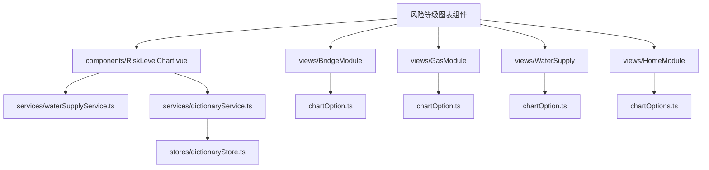
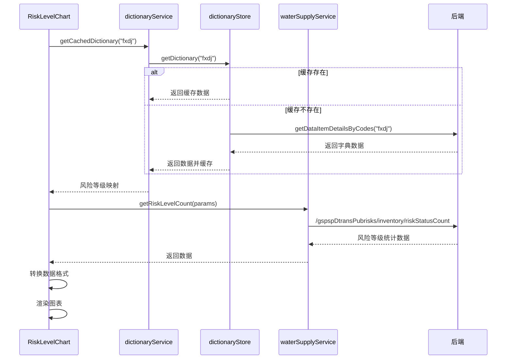
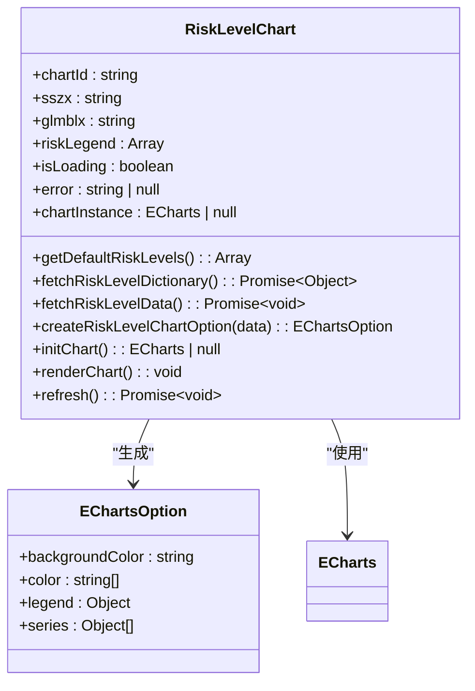
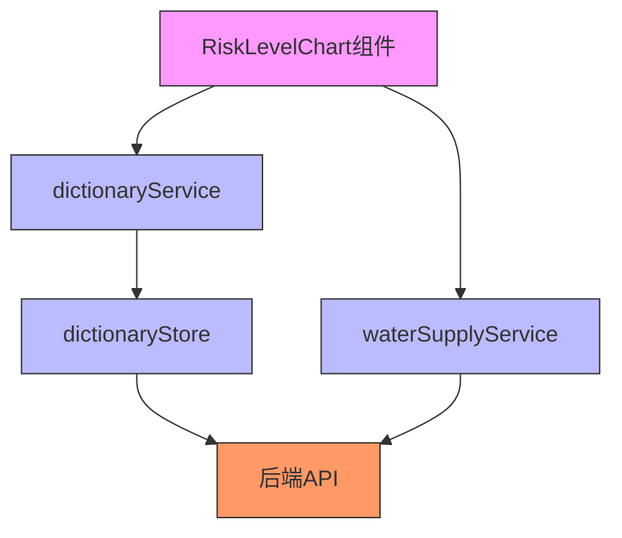
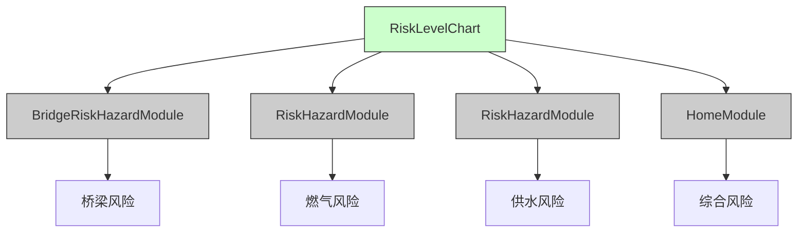
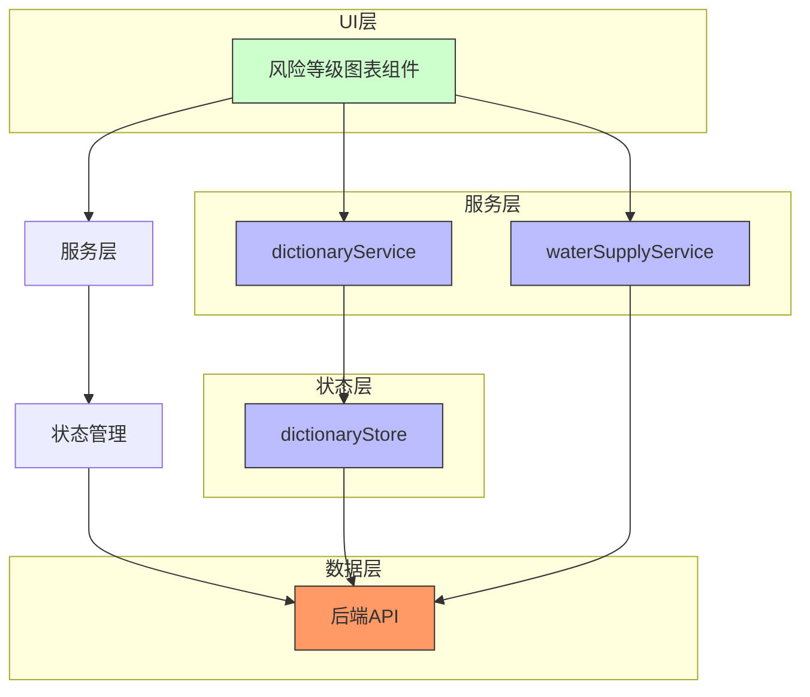

# 风险等级图表组件

<cite>
**本文档引用的文件**   
- [RiskLevelChart.vue](file://src/components/RiskLevelChart.vue)
- [waterSupplyService.ts](file://src/services/waterSupplyService.ts)
- [dictionaryService.ts](file://src/services/dictionaryService.ts)
- [dictionaryStore.ts](file://src/stores/dictionaryStore.ts)
- [BridgeRiskHazardModule.vue](file://src/views/BridgeModule/components/BridgeRiskHazardModule.vue)
- [RiskHazardModule.vue](file://src/views/GasModule/components/RiskHazardModule.vue)
- [RiskHazardModule.vue](file://src/views/WaterSupply/components/RiskHazardModule.vue)
- [chartOption.ts](file://src/views/BridgeModule/chartOption.ts)
- [chartOption.ts](file://src/views/GasModule/chartOption.ts)
- [chartOption.ts](file://src/views/WaterSupply/chartOption.ts)
- [chartOptions.ts](file://src/views/HomeModule/components/chartOptions.ts)
</cite>

## 目录
1. [项目结构](#项目结构)
2. [核心组件分析](#核心组件分析)
3. [数据获取与处理](#数据获取与处理)
4. [图表配置与渲染](#图表配置与渲染)
5. [依赖服务分析](#依赖服务分析)
6. [使用场景分析](#使用场景分析)
7. [架构关系图](#架构关系图)

## 项目结构

**图表来源**
- [RiskLevelChart.vue](file://src/components/RiskLevelChart.vue)
- [waterSupplyService.ts](file://src/services/waterSupplyService.ts)
- [dictionaryService.ts](file://src/services/dictionaryService.ts)
- [dictionaryStore.ts](file://src/stores/dictionaryStore.ts)

**本节来源**
- [RiskLevelChart.vue](file://src/components/RiskLevelChart.vue)

## 核心组件分析

风险等级图表组件（RiskLevelChart.vue）是一个基于Vue 3和ECharts实现的可复用组件，用于展示风险等级的多环形图。该组件采用组合式API（setup语法糖）编写，具有良好的封装性和可维护性。

组件主要功能包括：
- 通过props接收外部参数（chartId、sszx、glmblx）
- 从后端服务获取风险等级数据
- 根据字典服务获取风险等级配置
- 渲染多环形图展示风险分布
- 提供刷新方法供父组件调用

组件的模板结构包含两个主要部分：ECharts图表容器和风险图例显示区域。图例区域以列表形式展示各风险等级的数量，采用渐变色文本增强视觉效果。

**本节来源**
- [RiskLevelChart.vue](file://src/components/RiskLevelChart.vue)

## 数据获取与处理

风险等级图表组件的数据获取流程如下：

1. **参数验证**：检查是否提供了sszx（城市安全中心标识）或glmblx（管理目标类型）参数
2. **字典获取**：通过`getCachedDictionary("fxdj")`获取风险等级字典
3. **数据请求**：调用`getRiskLevelCount`服务获取风险等级统计数据
4. **数据转换**：将原始数据转换为图表所需格式

数据获取过程包含完整的错误处理机制，当获取失败时会显示默认数据。组件还实现了数据缓存机制，通过`dictionaryStore`避免重复请求相同的字典数据。

**图表来源**
- [RiskLevelChart.vue](file://src/components/RiskLevelChart.vue#L76-L155)
- [waterSupplyService.ts](file://src/services/waterSupplyService.ts#L157-L170)
- [dictionaryService.ts](file://src/services/dictionaryService.ts)
- [dictionaryStore.ts](file://src/stores/dictionaryStore.ts)

**本节来源**
- [RiskLevelChart.vue](file://src/components/RiskLevelChart.vue#L76-L155)
- [waterSupplyService.ts](file://src/services/waterSupplyService.ts#L157-L170)

## 图表配置与渲染

风险等级图表采用多环形图（环套环）的形式展示不同风险等级的分布情况。每个风险等级对应一个环，环的大小表示该等级的风险数量。

图表配置的关键特性包括：

- **动态半径配置**：四个风险等级（重大风险、较大风险、一般风险、低风险）分别对应不同的半径
- **引导线样式**：根据是否有数据动态调整引导线样式
- **占位样式**：当某个风险等级无数据时，显示半透明的占位环
- **颜色映射**：固定的颜色配置，重大风险为橙红色，较大风险为黄色，一般风险为绿色，低风险为蓝色

图表渲染过程在组件挂载时自动执行，并监听props参数变化，当参数变化时会自动刷新数据和图表。组件还暴露了`refresh`方法供父组件手动调用刷新。

**图表来源**
- [RiskLevelChart.vue](file://src/components/RiskLevelChart.vue#L158-L241)
- [chartOption.ts](file://src/views/BridgeModule/chartOption.ts#L74-L118)
- [chartOption.ts](file://src/views/GasModule/chartOption.ts#L74-L118)
- [chartOption.ts](file://src/views/WaterSupply/chartOption.ts#L74-L118)

**本节来源**
- [RiskLevelChart.vue](file://src/components/RiskLevelChart.vue#L158-L241)

## 依赖服务分析

风险等级图表组件依赖多个服务层组件，形成了清晰的分层架构：

1. **waterSupplyService**：提供`getRiskLevelCount`方法，封装了与后端API的通信逻辑
2. **dictionaryService**：提供`getCachedDictionary`方法，用于获取系统字典数据
3. **dictionaryStore**：基于Pinia的状态管理，缓存字典数据避免重复请求

这种分层设计实现了关注点分离，使组件专注于UI展示，而将数据获取和状态管理交给专门的服务处理。

**图表来源**
- [waterSupplyService.ts](file://src/services/waterSupplyService.ts#L157-L170)
- [dictionaryService.ts](file://src/services/dictionaryService.ts)
- [dictionaryStore.ts](file://src/stores/dictionaryStore.ts)

**本节来源**
- [waterSupplyService.ts](file://src/services/waterSupplyService.ts#L157-L170)
- [dictionaryService.ts](file://src/services/dictionaryService.ts)
- [dictionaryStore.ts](file://src/stores/dictionaryStore.ts)

## 使用场景分析

风险等级图表组件在多个业务模块中被复用，体现了良好的组件化设计：

1. **桥梁模块**：`BridgeRiskHazardModule.vue`中使用该组件展示桥梁风险等级分布
2. **燃气模块**：`RiskHazardModule.vue`中使用该组件展示燃气设施风险等级
3. **供水模块**：`RiskHazardModule.vue`中使用该组件展示供水管网风险等级
4. **首页模块**：虽然首页使用了不同的图表形式，但其数据结构和设计理念与该组件一致

各模块通过传递不同的参数（sszx或glmblx）来获取特定业务领域的风险数据，实现了组件的高度复用。

**图表来源**
- [BridgeRiskHazardModule.vue](file://src/views/BridgeModule/components/BridgeRiskHazardModule.vue)
- [RiskHazardModule.vue](file://src/views/GasModule/components/RiskHazardModule.vue)
- [RiskHazardModule.vue](file://src/views/WaterSupply/components/RiskHazardModule.vue)

**本节来源**
- [BridgeRiskHazardModule.vue](file://src/views/BridgeModule/components/BridgeRiskHazardModule.vue)
- [RiskHazardModule.vue](file://src/views/GasModule/components/RiskHazardModule.vue)
- [RiskHazardModule.vue](file://src/views/WaterSupply/components/RiskHazardModule.vue)

## 架构关系图

**图表来源**
- [RiskLevelChart.vue](file://src/components/RiskLevelChart.vue)
- [waterSupplyService.ts](file://src/services/waterSupplyService.ts)
- [dictionaryService.ts](file://src/services/dictionaryService.ts)
- [dictionaryStore.ts](file://src/stores/dictionaryStore.ts)

**本节来源**
- [RiskLevelChart.vue](file://src/components/RiskLevelChart.vue)
- [waterSupplyService.ts](file://src/services/waterSupplyService.ts)
- [dictionaryService.ts](file://src/services/dictionaryService.ts)
- [dictionaryStore.ts](file://src/stores/dictionaryStore.ts)