# 风险等级图表组件

<cite>
**本文档引用的文件**
- [RiskLevelChart.vue](file://src/components/RiskLevelChart.vue)
- [waterSupplyService.ts](file://src/services/waterSupplyService.ts)
- [dictionaryService.ts](file://src/services/dictionaryService.ts)
- [dictionaryStore.ts](file://src/stores/dictionaryStore.ts)
- [BridgeRiskHazardModule.vue](file://src/views/BridgeModule/components/BridgeRiskHazardModule.vue)
- [GasRiskHazardModule.vue](file://src/views/GasModule/components/RiskHazardModule.vue)
- [WaterSupplyRiskHazardModule.vue](file://src/views/WaterSupply/components/RiskHazardModule.vue)
- [chartOption.ts](file://src/views/BridgeModule/chartOption.ts)
- [index.ts](file://src/types/index.ts)
</cite>

## 目录
1. [简介](#简介)
2. [项目结构](#项目结构)
3. [核心组件](#核心组件)
4. [架构概览](#架构概览)
5. [详细组件分析](#详细组件分析)
6. [依赖关系分析](#依赖关系分析)
7. [性能考虑](#性能考虑)
8. [故障排除指南](#故障排除指南)
9. [结论](#结论)

## 简介

风险等级图表组件是一个基于 Vue 3 和 ECharts 的可视化组件，专门用于展示城市基础设施的风险等级分布情况。该组件采用多环形图设计，能够直观地显示重大风险、较大风险、一般风险和低风险四个等级的数量分布。

该组件具有以下特点：
- **响应式设计**：支持不同屏幕尺寸的自适应布局
- **实时数据更新**：通过字典缓存机制实现数据的动态刷新
- **丰富的交互功能**：支持悬停动画、渐变色彩等视觉效果
- **模块化架构**：可作为独立组件在不同业务模块中复用

## 项目结构

该项目采用模块化的前端架构，风险等级图表组件位于组件层，与服务层、存储层和视图层形成清晰的分层结构：

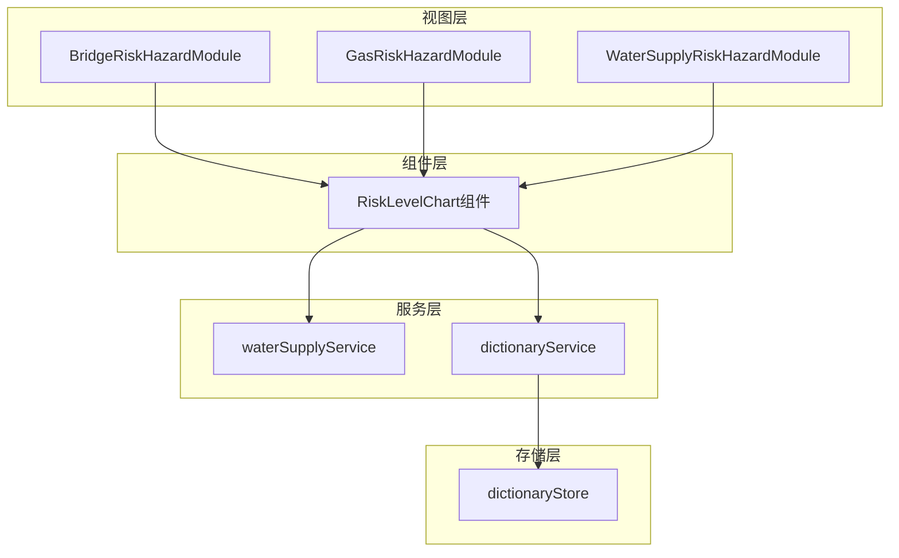

**图表来源**
- [RiskLevelChart.vue](file://src/components/RiskLevelChart.vue#L1-L374)
- [BridgeRiskHazardModule.vue](file://src/views/BridgeModule/components/BridgeRiskHazardModule.vue#L1-L585)
- [GasRiskHazardModule.vue](file://src/views/GasModule/components/RiskHazardModule.vue#L1-L651)
- [WaterSupplyRiskHazardModule.vue](file://src/views/WaterSupply/components/RiskHazardModule.vue#L1-L421)

**章节来源**
- [RiskLevelChart.vue](file://src/components/RiskLevelChart.vue#L1-L374)
- [BridgeRiskHazardModule.vue](file://src/views/BridgeModule/components/BridgeRiskHazardModule.vue#L1-L585)

## 核心组件

### RiskLevelChart 组件

RiskLevelChart 是一个功能完整的风险等级可视化组件，具备以下核心功能：

#### 主要属性配置

| 属性名 | 类型 | 默认值 | 描述 |
|--------|------|--------|------|
| chartId | string | "risk-chart" | 图表容器的唯一标识符 |
| sszx | string | "" | 城市安全中心标识参数 |
| glmblx | string | "" | 管理目标类型参数 |

#### 颜色配置系统

组件内置了完整的风险等级颜色映射系统：

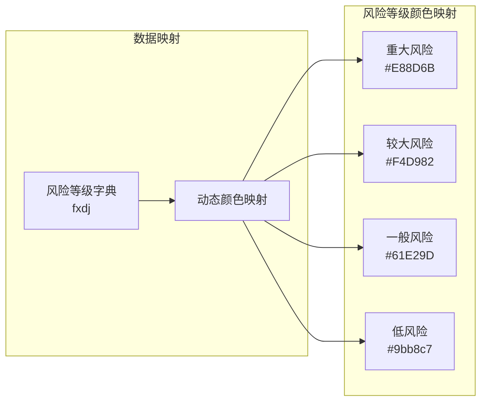

**图表来源**
- [RiskLevelChart.vue](file://src/components/RiskLevelChart.vue#L47-L52)
- [RiskLevelChart.vue](file://src/components/RiskLevelChart.vue#L76-L97)

#### 数据获取流程

组件采用异步数据获取机制，支持多种数据源：

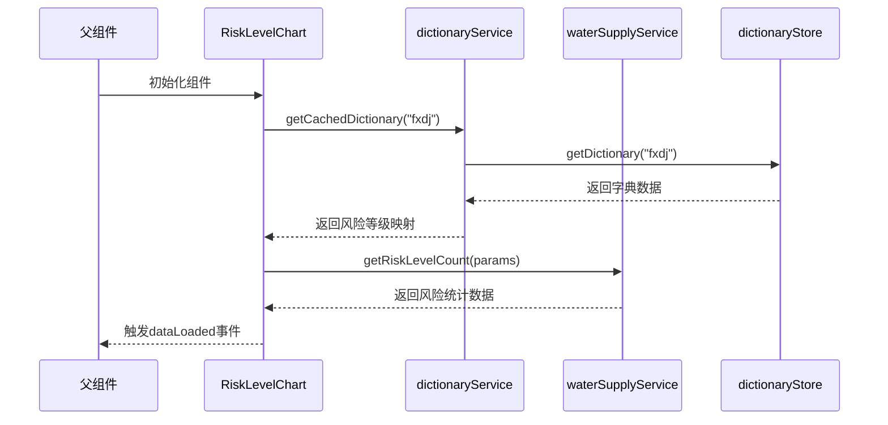

**图表来源**
- [RiskLevelChart.vue](file://src/components/RiskLevelChart.vue#L76-L156)
- [dictionaryService.ts](file://src/services/dictionaryService.ts#L15-L18)
- [waterSupplyService.ts](file://src/services/waterSupplyService.ts#L160-L170)

**章节来源**
- [RiskLevelChart.vue](file://src/components/RiskLevelChart.vue#L25-L39)
- [RiskLevelChart.vue](file://src/components/RiskLevelChart.vue#L47-L52)
- [RiskLevelChart.vue](file://src/components/RiskLevelChart.vue#L76-L156)

## 架构概览

### 组件层次结构

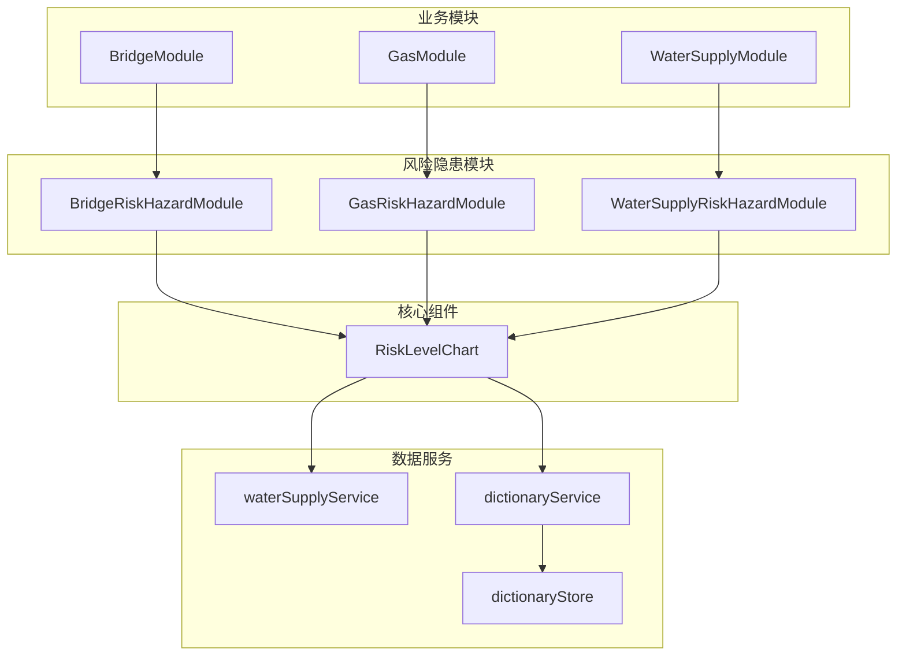

**图表来源**
- [BridgeRiskHazardModule.vue](file://src/views/BridgeModule/components/BridgeRiskHazardModule.vue#L10-L14)
- [GasRiskHazardModule.vue](file://src/views/GasModule/components/RiskHazardModule.vue#L10-L13)
- [WaterSupplyRiskHazardModule.vue](file://src/views/WaterSupply/components/RiskHazardModule.vue#L8-L11)

### 数据流架构

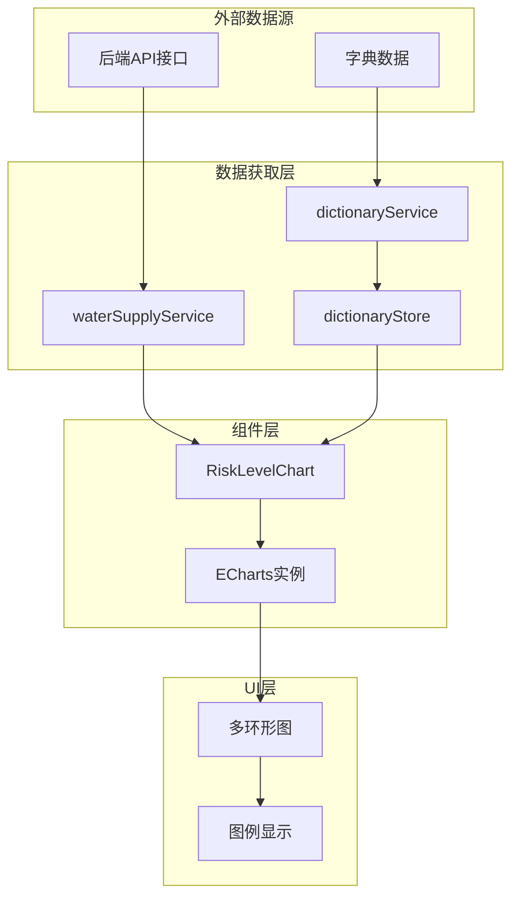

**图表来源**
- [RiskLevelChart.vue](file://src/components/RiskLevelChart.vue#L205-L242)
- [waterSupplyService.ts](file://src/services/waterSupplyService.ts#L160-L170)
- [dictionaryService.ts](file://src/services/dictionaryService.ts#L15-L18)

**章节来源**
- [RiskLevelChart.vue](file://src/components/RiskLevelChart.vue#L1-L374)
- [chartOption.ts](file://src/views/BridgeModule/chartOption.ts#L78-L118)

## 详细组件分析

### 图表渲染机制

#### 多环形图配置

RiskLevelChart 采用独特的多环形图设计，通过四个同心圆环展示不同风险等级的比例关系：

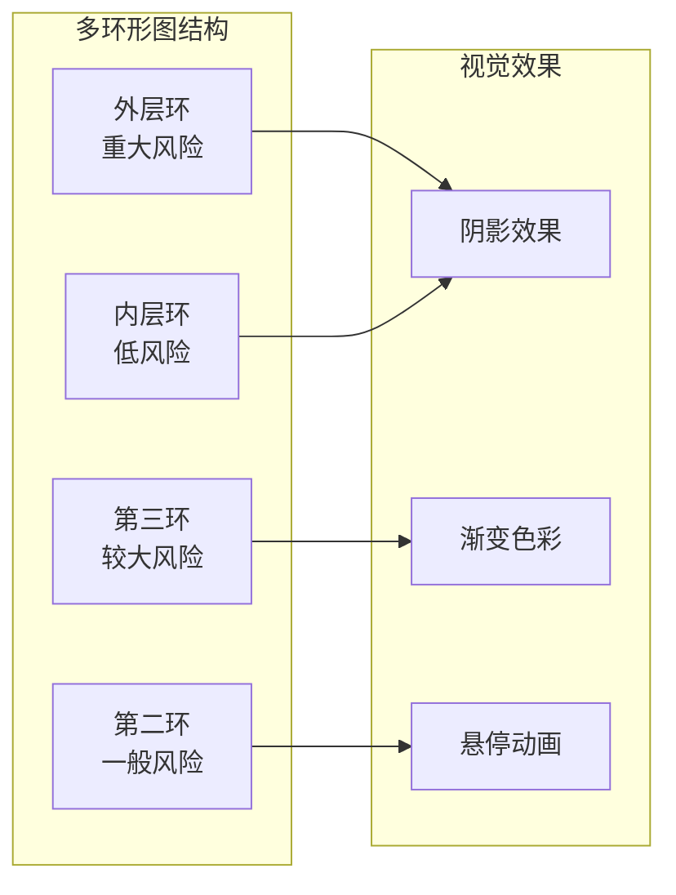

**图表来源**
- [RiskLevelChart.vue](file://src/components/RiskLevelChart.vue#L208-L214)
- [RiskLevelChart.vue](file://src/components/RiskLevelChart.vue#L222-L234)

#### 图表选项配置

组件提供了灵活的图表配置选项：

| 配置项 | 值 | 说明 |
|--------|-----|------|
| backgroundColor | transparent | 透明背景 |
| color | ["#9bb8c7", "#61E29D", "#F4D982", "#E88D6B"] | 风险等级颜色序列 |
| legend.show | false | 隐藏图例 |
| series.length | 4 | 四个风险等级环形图 |

**章节来源**
- [RiskLevelChart.vue](file://src/components/RiskLevelChart.vue#L236-L242)

### 数据处理流程

#### 风险等级数据转换

组件实现了完整的数据处理管道，将原始 API 数据转换为图表可用的格式：

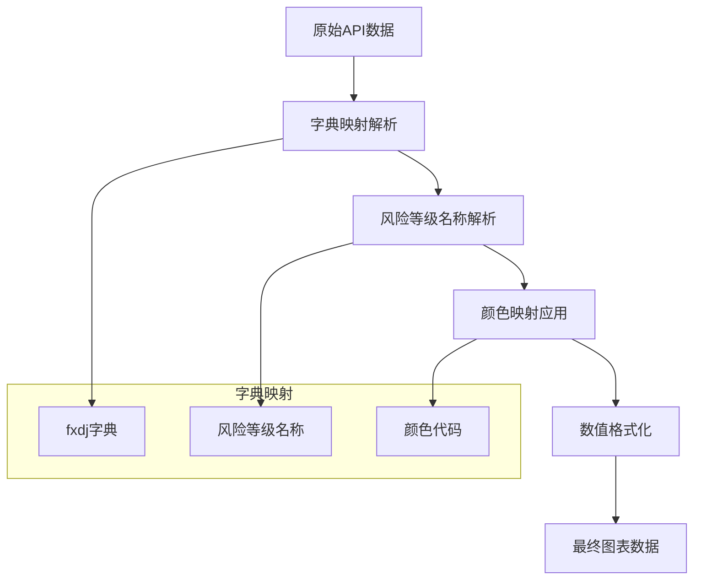

**图表来源**
- [RiskLevelChart.vue](file://src/components/RiskLevelChart.vue#L140-L147)

#### 错误处理机制

组件具备完善的错误处理能力：

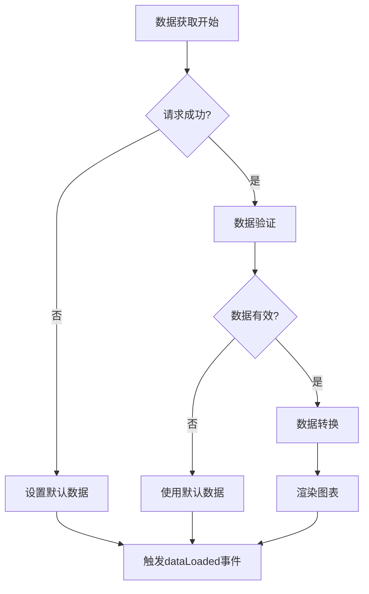

**图表来源**
- [RiskLevelChart.vue](file://src/components/RiskLevelChart.vue#L148-L156)

**章节来源**
- [RiskLevelChart.vue](file://src/components/RiskLevelChart.vue#L103-L156)

### 组件生命周期管理

#### 初始化流程

组件遵循标准的 Vue 3 生命周期模式：

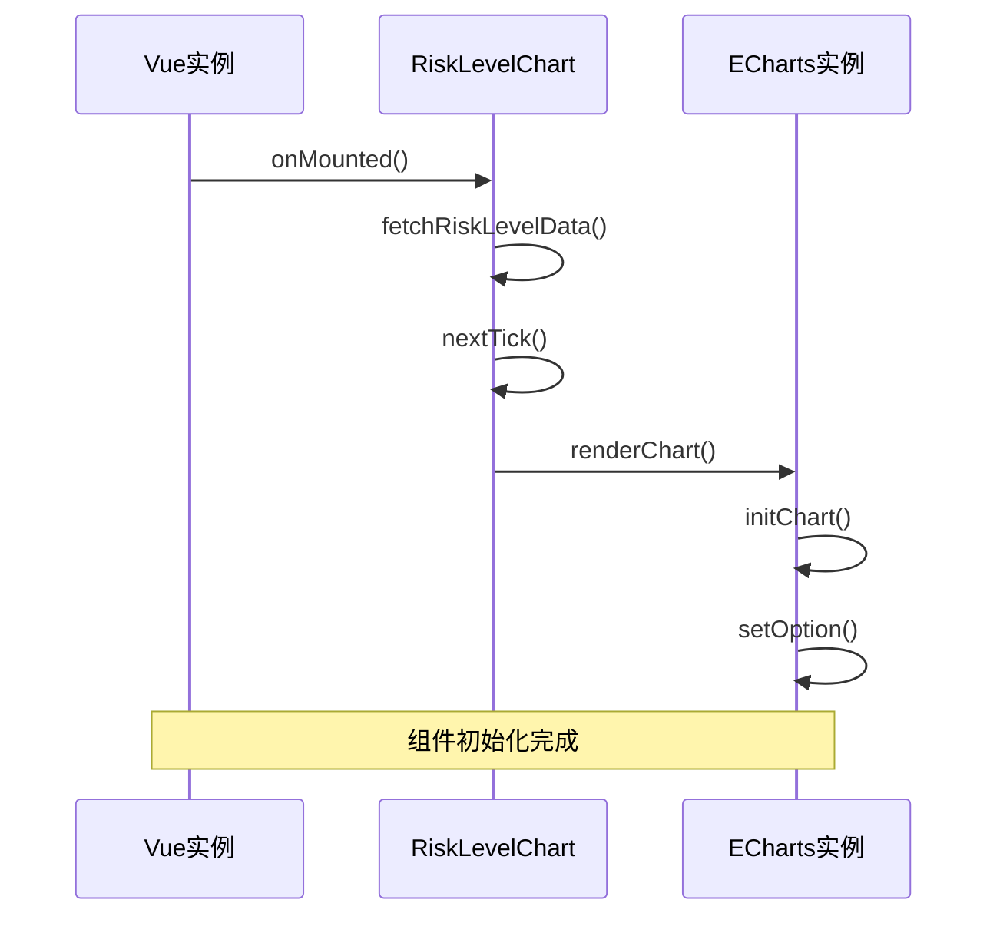

**图表来源**
- [RiskLevelChart.vue](file://src/components/RiskLevelChart.vue#L288-L292)

#### 销毁清理

组件实现了完整的资源清理机制：

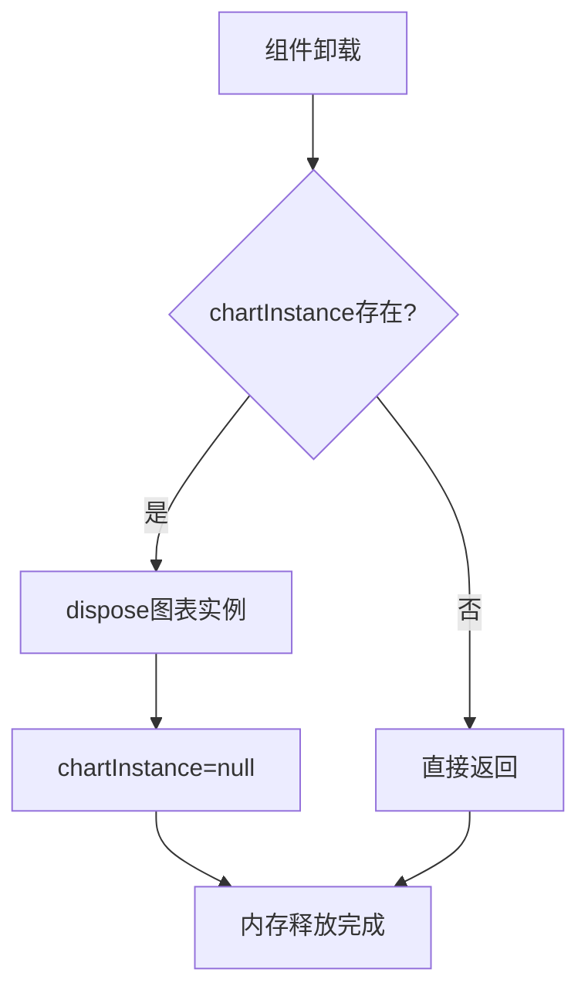

**图表来源**
- [RiskLevelChart.vue](file://src/components/RiskLevelChart.vue#L294-L299)

**章节来源**
- [RiskLevelChart.vue](file://src/components/RiskLevelChart.vue#L287-L307)

## 依赖关系分析

### 组件间依赖

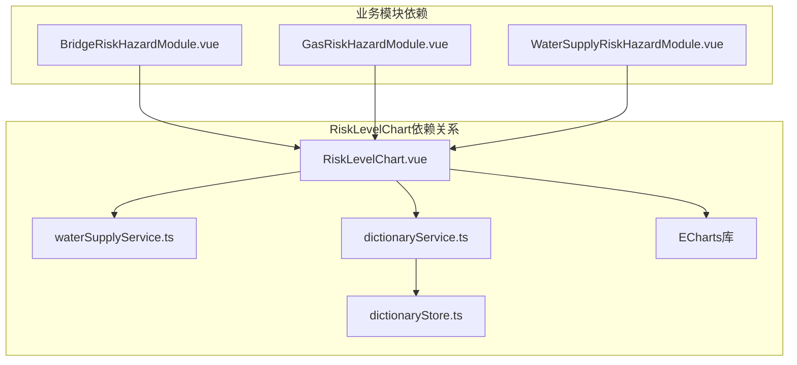

**图表来源**
- [RiskLevelChart.vue](file://src/components/RiskLevelChart.vue#L21-L23)
- [BridgeRiskHazardModule.vue](file://src/views/BridgeModule/components/BridgeRiskHazardModule.vue#L63-L64)

### 数据依赖链

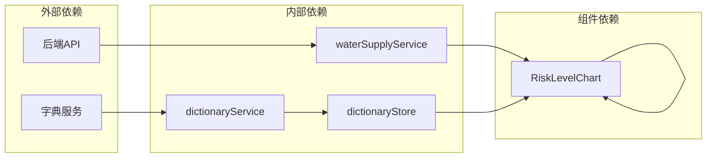

**图表来源**
- [waterSupplyService.ts](file://src/services/waterSupplyService.ts#L1-L186)
- [dictionaryService.ts](file://src/services/dictionaryService.ts#L1-L45)
- [dictionaryStore.ts](file://src/stores/dictionaryStore.ts#L1-L225)

**章节来源**
- [RiskLevelChart.vue](file://src/components/RiskLevelChart.vue#L21-L23)
- [waterSupplyService.ts](file://src/services/waterSupplyService.ts#L1-L186)
- [dictionaryService.ts](file://src/services/dictionaryService.ts#L1-L45)

## 性能考虑

### 内存管理优化

组件采用了多项内存管理策略：

1. **图表实例管理**：每次重新渲染前自动销毁旧的 ECharts 实例
2. **字典缓存机制**：避免重复的 API 请求
3. **异步数据加载**：不阻塞主线程

### 渲染性能优化

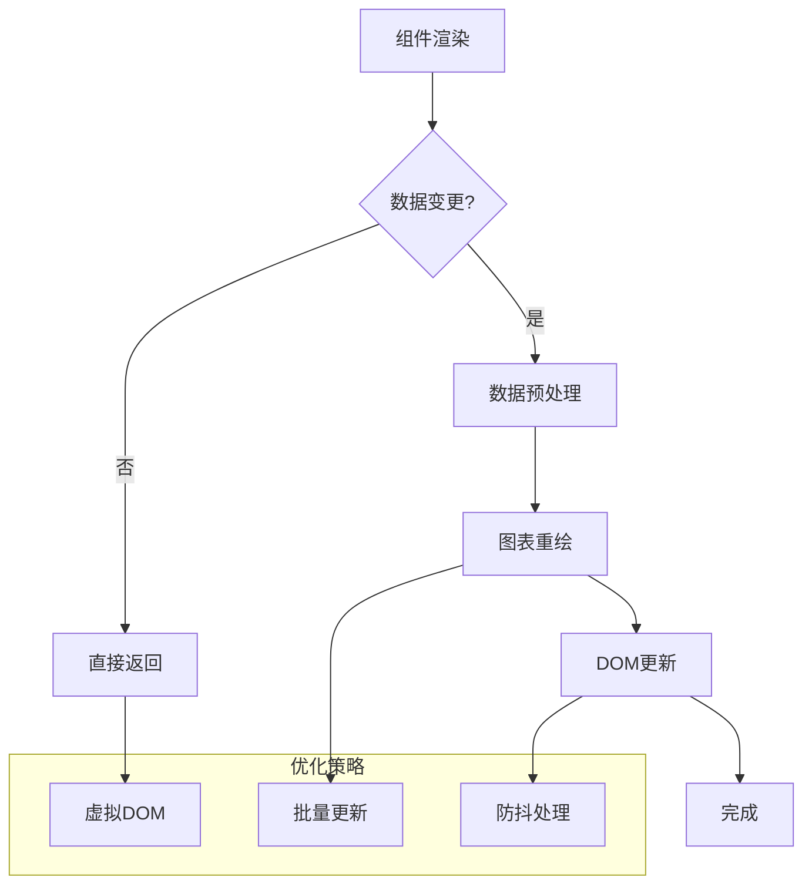

### 缓存策略

组件实现了多层次的缓存机制：

| 缓存层级 | 存储位置 | 缓存内容 | 过期策略 |
|----------|----------|----------|----------|
| 应用级缓存 | Pinia Store | 字典数据 | 手动清除 |
| 组件级缓存 | 组件状态 | 图表实例 | 组件销毁 |
| 浏览器缓存 | 本地存储 | 用户偏好 | 浏览器清理 |

**章节来源**
- [RiskLevelChart.vue](file://src/components/RiskLevelChart.vue#L248-L259)
- [dictionaryStore.ts](file://src/stores/dictionaryStore.ts#L38-L97)

## 故障排除指南

### 常见问题及解决方案

#### 数据加载失败

**问题症状**：图表显示默认数据，控制台出现错误信息

**可能原因**：
1. API 接口不可用
2. 字典数据获取失败
3. 网络连接异常

**解决步骤**：
1. 检查网络连接状态
2. 验证 API 接口可用性
3. 查看浏览器开发者工具中的错误日志
4. 确认字典服务正常工作

#### 图表渲染异常

**问题症状**：图表无法正常显示或显示不完整

**可能原因**：
1. DOM 元素未就绪
2. ECharts 实例初始化失败
3. 图表容器尺寸异常

**解决步骤**：
1. 确保 chartId 对应的 DOM 元素存在
2. 检查组件是否在正确的生命周期中调用
3. 验证图表容器的 CSS 样式设置

#### 数据映射错误

**问题症状**：风险等级名称显示为代码值而非中文名称

**可能原因**：
1. 字典数据获取失败
2. 字典映射配置错误
3. API 返回数据格式异常

**解决步骤**：
1. 检查字典服务的返回数据
2. 验证字典编码配置
3. 确认 API 数据格式符合预期

**章节来源**
- [RiskLevelChart.vue](file://src/components/RiskLevelChart.vue#L92-L96)
- [RiskLevelChart.vue](file://src/components/RiskLevelChart.vue#L148-L152)

### 调试技巧

#### 开发者工具使用

1. **Vue DevTools**：检查组件状态和 props 传递
2. **浏览器网络面板**：监控 API 请求和响应
3. **ECharts 工具箱**：使用官方调试工具分析图表渲染

#### 日志记录

组件在关键节点添加了详细的日志输出，便于问题诊断：

- 数据获取开始和结束
- 错误处理和异常捕获
- 图表渲染状态

**章节来源**
- [RiskLevelChart.vue](file://src/components/RiskLevelChart.vue#L117-L118)
- [RiskLevelChart.vue](file://src/components/RiskLevelChart.vue#L149-L150)

## 结论

风险等级图表组件是一个设计精良、功能完整的可视化解决方案。它成功地将复杂的风险数据转化为直观的多环形图，为政府Dashboard提供了强大的数据可视化能力。

### 主要优势

1. **模块化设计**：组件独立性强，可在不同业务模块中复用
2. **数据驱动**：基于真实数据的动态可视化，确保信息准确性
3. **用户体验**：丰富的视觉效果和交互功能，提升用户满意度
4. **性能优化**：完善的缓存和内存管理机制，保证运行效率

### 技术亮点

- **多环形图创新设计**：通过同心圆环展示风险等级层次
- **字典驱动的数据映射**：确保风险等级名称的准确性和一致性
- **响应式布局**：适配不同屏幕尺寸和设备类型
- **错误处理机制**：完善的异常处理和降级策略

### 应用前景

该组件不仅适用于当前的政府Dashboard项目，还可以扩展应用到其他需要风险可视化展示的场景中，如企业风险管理、项目监控等，具有良好的通用性和扩展价值。