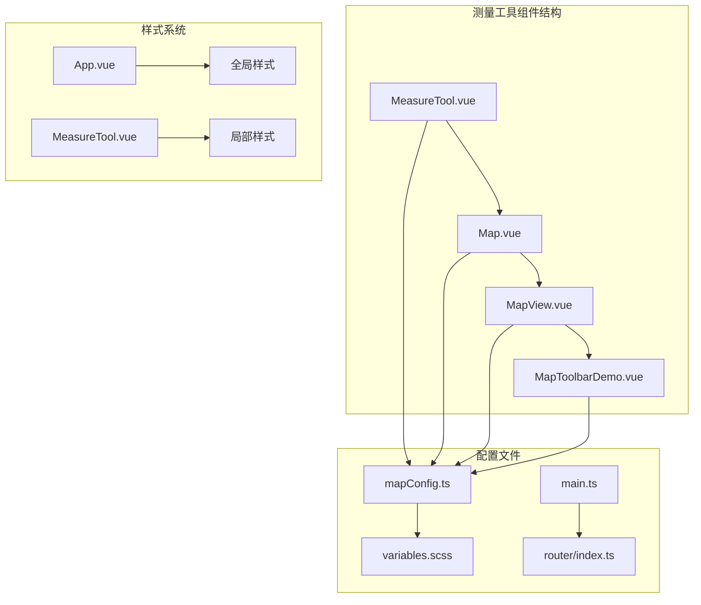
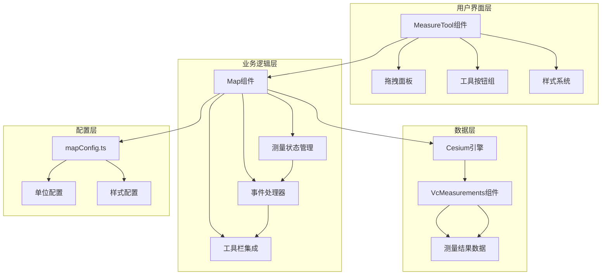
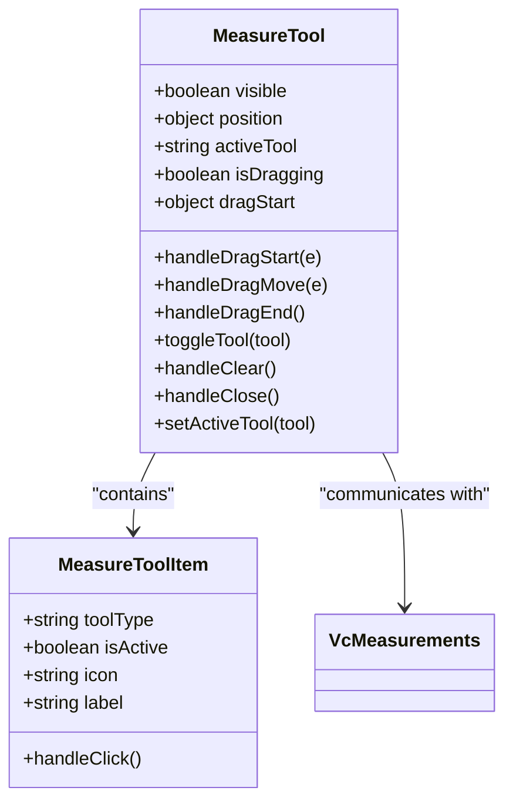
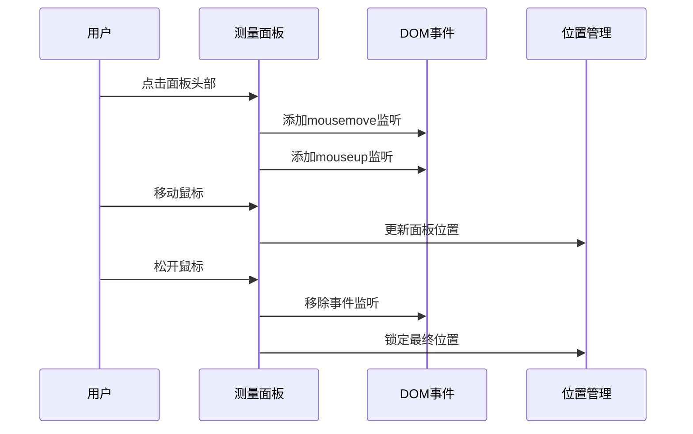
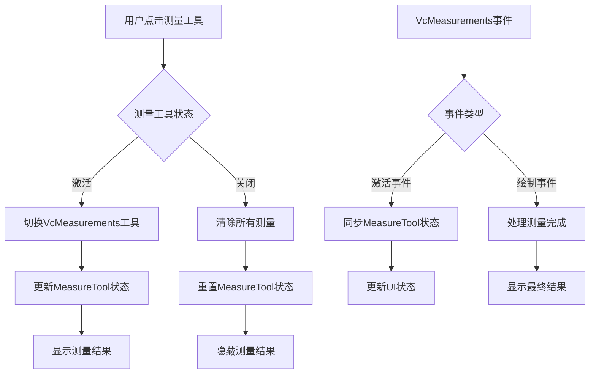
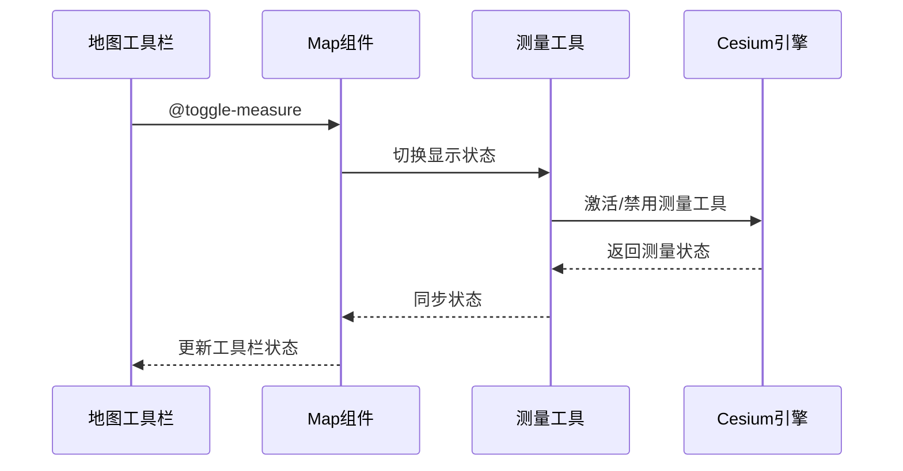
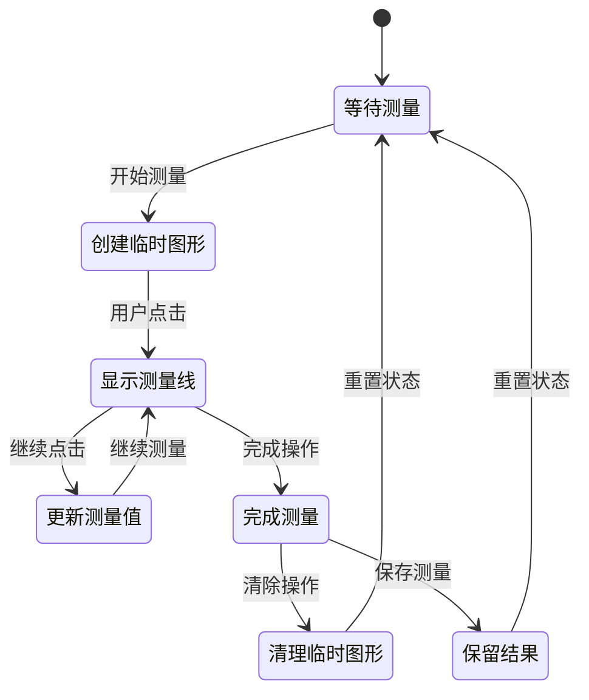

# 测量工具

<cite>
**本文档中引用的文件**
- [MeasureTool.vue](file://src/mapComponents/MeasureTool.vue)
- [Map.vue](file://src/mapComponents/Map.vue)
- [MapView.vue](file://src/views/MapView.vue)
- [MapToolbarDemo.vue](file://src/views/MapToolbarDemo.vue)
- [mapConfig.ts](file://src/config/mapConfig.ts)
- [variables.scss](file://src/assets/styles/variables.scss)
- [main.ts](file://src/main.ts)
- [router/index.ts](file://src/router/index.ts)
- [App.vue](file://src/App.vue)
</cite>

## 目录
1. [简介](#简介)
2. [项目结构](#项目结构)
3. [核心组件](#核心组件)
4. [架构概览](#架构概览)
5. [详细组件分析](#详细组件分析)
6. [与其他组件的集成](#与其他组件的集成)
7. [测量结果显示与单位转换](#测量结果显示与单位转换)
8. [代码示例](#代码示例)
9. [临时图形管理](#临时图形管理)
10. [故障排除指南](#故障排除指南)
11. [总结](#总结)

## 简介

测量工具是政府Dashboard项目中的一个重要功能模块，提供了距离测量、面积测量和高度测量等地理空间分析能力。该工具采用Vue 3 + TypeScript技术栈构建，集成了Cesium地球引擎，为用户提供直观的测量界面和精确的测量结果。

测量工具的核心特性包括：
- 支持距离和面积两种测量模式
- 实时测量结果显示和动态更新
- 可拖拽的浮动工具面板
- 与地图组件的深度集成
- 自动化的临时图形生命周期管理
- 响应式的样式设计

## 项目结构

测量工具相关的文件组织结构如下：



**图表来源**
- [MeasureTool.vue](file://src/mapComponents/MeasureTool.vue#L1-L267)
- [Map.vue](file://src/mapComponents/Map.vue#L1-L432)
- [mapConfig.ts](file://src/config/mapConfig.ts#L1-L55)

**章节来源**
- [MeasureTool.vue](file://src/mapComponents/MeasureTool.vue#L1-L267)
- [Map.vue](file://src/mapComponents/Map.vue#L1-L432)

## 核心组件

测量工具主要由以下核心组件构成：

### MeasureTool组件
负责提供用户交互界面和工具切换功能，包含距离测量、面积测量和清除操作三个主要功能。

### Map组件
作为测量工具的宿主组件，负责与Cesium引擎的集成，管理测量工具的状态同步和事件处理。

### MapView组件
提供测量工具的测试和演示环境，展示如何在实际应用中集成和使用测量功能。

**章节来源**
- [MeasureTool.vue](file://src/mapComponents/MeasureTool.vue#L43-L136)
- [Map.vue](file://src/mapComponents/Map.vue#L54-L403)

## 架构概览

测量工具的整体架构采用分层设计，实现了清晰的职责分离：



**图表来源**
- [MeasureTool.vue](file://src/mapComponents/MeasureTool.vue#L1-L41)
- [Map.vue](file://src/mapComponents/Map.vue#L1-L53)

## 详细组件分析

### MeasureTool组件详细分析

MeasureTool组件是一个独立的测量工具面板，具有以下核心功能：

#### 组件结构


**图表来源**
- [MeasureTool.vue](file://src/mapComponents/MeasureTool.vue#L47-L136)

#### 工具切换机制
测量工具支持两种测量模式的切换：

1. **距离测量模式**：使用`polyline`工具进行直线距离测量
2. **面积测量模式**：使用`area`工具进行多边形面积测量

#### 拖拽功能实现
组件实现了完整的拖拽功能，允许用户自由调整工具面板的位置：



**图表来源**
- [MeasureTool.vue](file://src/mapComponents/MeasureTool.vue#L69-L101)

**章节来源**
- [MeasureTool.vue](file://src/mapComponents/MeasureTool.vue#L43-L136)

### Map组件集成分析

Map组件作为测量工具的主要宿主，实现了与测量工具的深度集成：

#### 测量状态同步


**图表来源**
- [Map.vue](file://src/mapComponents/Map.vue#L134-L180)

#### 测量工具初始化
Map组件通过`VcMeasurements`组件提供底层测量功能：

| 配置项 | 值 | 说明 |
|--------|-----|------|
| `main-fab-opts.modelValue` | `false` | 禁用主浮动按钮 |
| `measurements` | `['polyline', 'area']` | 支持的距离和面积测量 |
| `editable` | `true` | 允许编辑测量图形 |

**章节来源**
- [Map.vue](file://src/mapComponents/Map.vue#L34-L48)
- [Map.vue](file://src/mapComponents/Map.vue#L134-L180)

## 与其他组件的集成

### 与Map.vue的集成方式

测量工具与Map组件的集成采用了props传递和事件通信的方式：

#### Props接收
Map组件通过`v-model:visible`双向绑定控制测量工具的显示状态：

```typescript
// 在Map.vue中
<MeasureTool v-model:visible="showMeasureTool" 
  @toggle-distance="toggleDistance" 
  @toggle-area="toggleArea"
  @clear="clearMeasurements" 
  ref="measureToolRef" />
```

#### 事件通信
测量工具通过自定义事件向Map组件传递状态变更：

| 事件名 | 参数 | 用途 |
|--------|------|------|
| `update:visible` | `boolean` | 控制测量工具显示状态 |
| `toggle-distance` | 无 | 切换距离测量模式 |
| `toggle-area` | 无 | 切换面积测量模式 |
| `clear` | 无 | 清除所有测量结果 |

### 与MapToolbar.vue的集成

测量工具与地图工具栏通过统一的测量切换接口集成：



**图表来源**
- [Map.vue](file://src/mapComponents/Map.vue#L43-L44)
- [MapView.vue](file://src/views/MapView.vue#L101-L107)

**章节来源**
- [Map.vue](file://src/mapComponents/Map.vue#L43-L48)
- [MapView.vue](file://src/views/MapView.vue#L101-L107)

## 测量结果显示与单位转换

### 显示样式设计

测量工具采用了现代化的UI设计，具有以下特点：

#### 主题色彩系统
基于CSS变量的主题系统确保了一致的视觉体验：

| 样式类别 | 颜色值 | 用途 |
|----------|--------|------|
| 主色调 | `#1677ff` | 激活状态和主要交互元素 |
| 成功色 | `#52c41a` | 正常状态和辅助元素 |
| 错误色 | `#ff4d4f` | 清除按钮和警告状态 |
| 背景色 | `rgba(0, 15, 35, 0.95)` | 面板背景和毛玻璃效果 |

#### 响应式布局
测量工具采用flex布局实现响应式设计，支持不同屏幕尺寸：

```scss
.measure-toolbar {
  display: flex;
  gap: 0;
  padding: 16px 20px;
  cursor: default;
}

.measure-tool-item {
  flex: 1;
  display: flex;
  flex-direction: column;
  align-items: center;
  gap: 8px;
  padding: 12px 8px;
}
```

### 单位转换逻辑

虽然当前实现中没有显式的单位转换代码，但基于Cesium引擎的测量结果会自动根据坐标系统进行单位适配：

#### 距离测量单位
- **平面距离**：米(m)为基本单位
- **球面距离**：考虑地球曲率的弧长计算
- **显示格式**：自动选择合适的精度和单位

#### 面积测量单位
- **平面面积**：平方米(m²)为基本单位
- **球面面积**：考虑地球曲率的投影面积
- **显示格式**：自动转换为公顷(ha)或平方公里(km²)等更易读的单位

**章节来源**
- [MeasureTool.vue](file://src/mapComponents/MeasureTool.vue#L139-L266)
- [variables.scss](file://src/assets/styles/variables.scss#L1-L155)

## 代码示例

### 在其他页面中调用测量工具

以下展示了如何在Vue组件中通过ref访问地图组件的测量功能：

#### 基本调用示例

```typescript
// 在组件中使用ref访问地图测量功能
<script setup lang="ts">
import { ref } from 'vue'
import Map from '@/mapComponents/Map.vue'

// 创建组件引用
const mapRef = ref<InstanceType<typeof Map>>()

// 切换测量工具
function toggleMeasurement() {
  if (mapRef.value?.toggleMeasureTool) {
    mapRef.value.toggleMeasureTool()
  }
}

// 获取测量状态
function getMeasurementStatus() {
  return mapRef.value?.showMeasureTool.value || false
}
</script>

<template>
  <div>
    <Map ref="mapRef" />
    <button @click="toggleMeasurement">
      {{ showMeasureTool ? '关闭测量' : '开启测量' }}
    </button>
  </div>
</template>
```

#### 高级测量控制示例

```typescript
// 高级测量控制功能
<script setup lang="ts">
import { ref } from 'vue'
import Map from '@/mapComponents/Map.vue'

const mapRef = ref<InstanceType<typeof Map>>()
const measurementType = ref<'distance' | 'area' | null>(null)

// 切换特定测量类型
function toggleSpecificMeasurement(type: 'distance' | 'area') {
  if (!mapRef.value?.viewerInstance) return
  
  // 设置测量工具类型
  measurementType.value = type
  
  // 触发测量切换
  if (type === 'distance') {
    mapRef.value.toggleDistance()
  } else {
    mapRef.value.toggleArea()
  }
}

// 清除所有测量
function clearAllMeasurements() {
  if (mapRef.value?.clearMeasurements) {
    mapRef.value.clearMeasurements()
  }
}
</script>
```

### 通过路由集成测量功能

#### 路由配置示例

```typescript
// 在路由配置中添加测量视图
const routes: RouteRecordRaw[] = [
  {
    path: '/map-with-measure',
    name: 'MapWithMeasure',
    component: () => import('@/views/MapView.vue'),
    meta: {
      requiresAuth: false,
      title: '带测量功能的地图'
    }
  }
]
```

#### 页面集成示例

```vue
<!-- 测量功能集成页面 -->
<template>
  <div class="map-view">
    <Map ref="mapRef" />
    <div class="measurement-controls">
      <button @click="toggleDistance">距离测量</button>
      <button @click="toggleArea">面积测量</button>
      <button @click="clearAll">清除测量</button>
    </div>
  </div>
</template>

<script setup lang="ts">
import { ref } from 'vue'
import Map from '@/mapComponents/Map.vue'

const mapRef = ref<InstanceType<typeof Map>>()

// 测量功能控制
const toggleDistance = () => {
  if (mapRef.value?.toggleDistance) {
    mapRef.value.toggleDistance()
  }
}

const toggleArea = () => {
  if (mapRef.value?.toggleArea) {
    mapRef.value.toggleArea()
  }
}

const clearAll = () => {
  if (mapRef.value?.clearMeasurements) {
    mapRef.value.clearMeasurements()
  }
}
</script>
```

**章节来源**
- [MapView.vue](file://src/views/MapView.vue#L101-L107)
- [Map.vue](file://src/mapComponents/Map.vue#L390-L403)

## 临时图形管理

### 临时图形的创建机制

测量工具在用户进行测量操作时会动态创建临时图形对象，这些图形具有以下特征：

#### 生命周期管理


#### 图形创建流程
1. **测量开始**：用户点击地图开始测量
2. **临时图形创建**：系统自动创建测量线或测量区域
3. **实时更新**：随着用户操作实时更新测量结果
4. **结果固定**：测量完成后固定最终结果
5. **自动清理**：用户清除或重新测量时自动清理

### 临时图形的销毁机制

#### 自动清理触发条件
- 用户主动执行清除操作
- 切换测量工具类型
- 关闭测量工具面板
- 页面卸载或组件销毁

#### 内存管理策略
```typescript
// 清理函数示例
onBeforeUnmount(() => {
  // 清理测量相关的事件监听
  if (measurementsRef.value) {
    measurementsRef.value.clearAll()
  }
  
  // 清理拖拽事件
  document.removeEventListener('mousemove', handleDragMove)
  document.removeEventListener('mouseup', handleDragEnd)
})
```

**章节来源**
- [Map.vue](file://src/mapComponents/Map.vue#L153-L161)
- [MeasureTool.vue](file://src/mapComponents/MeasureTool.vue#L69-L101)

## 故障排除指南

### 常见问题及解决方案

#### 测量工具无法显示
**问题症状**：测量工具面板不出现或显示异常

**可能原因**：
1. `visible` prop未正确设置
2. Cesium引擎未正确初始化
3. 样式文件加载失败

**解决方案**：
```typescript
// 检查Cesium初始化状态
if (!measurementsRef.value) {
  console.warn('VcMeasurements组件未就绪')
  return
}

// 强制刷新测量工具
measureToolRef.value?.setActiveTool(null)
```

#### 测量结果不准确
**问题症状**：测量结果与预期不符

**可能原因**：
1. 坐标系统不匹配
2. 地图投影设置错误
3. 测量精度配置不当

**解决方案**：
```typescript
// 检查地图投影设置
console.log('当前投影模式:', viewer.scene.mode)

// 验证测量精度
if (viewer.scene.globe.maximumScreenSpaceError) {
  viewer.scene.globe.maximumScreenSpaceError = 2
}
```

#### 性能问题
**问题症状**：测量操作卡顿或响应缓慢

**可能原因**：
1. Cesium性能优化不足
2. 测量图形过于复杂
3. 内存泄漏

**解决方案**：
```typescript
// 优化Cesium性能
optimizeCesiumPerformance(viewer, Cesium)

// 减少测量精度
viewer.scene.globe.maximumScreenSpaceError = 4
viewer.scene.requestRenderMode = true
viewer.scene.maximumRenderTimeChange = Infinity
```

### 调试技巧

#### 测量状态监控
```typescript
// 监控测量事件
const handleMeasureActiveEvt = (e: any) => {
  console.log('测量激活状态:', e)
  console.log('当前激活工具:', measureToolRef.value?.activeTool.value)
}

const handleMeasureDrawEvt = (e: any) => {
  console.log('测量绘制事件:', e)
  if (e.finished) {
    console.log('测量完成，结果:', e.result)
  }
}
```

#### 性能监控
```typescript
// 测量性能监控
const startTime = performance.now()
measurementsRef.value?.toggleAction('polyline')
setTimeout(() => {
  const endTime = performance.now()
  console.log(`测量工具启动耗时: ${endTime - startTime}ms`)
}, 0)
```

**章节来源**
- [Map.vue](file://src/mapComponents/Map.vue#L134-L180)
- [Map.vue](file://src/mapComponents/Map.vue#L259-L277)

## 总结

测量工具作为政府Dashboard项目的重要组成部分，展现了现代Web GIS应用的设计理念和技术实现。通过深入分析其架构和实现细节，我们可以看到以下关键特点：

### 技术亮点
1. **模块化设计**：MeasureTool组件的独立性和可复用性
2. **事件驱动架构**：通过props和emit实现组件间的松耦合通信
3. **响应式UI**：基于CSS变量的主题系统和响应式布局
4. **性能优化**：合理的内存管理和Cesium引擎优化

### 功能特性
1. **多测量模式**：支持距离和面积测量的无缝切换
2. **实时反馈**：动态更新的测量结果和可视化效果
3. **用户友好**：直观的拖拽面板和清晰的操作指引
4. **扩展性强**：易于集成到其他页面和组件中

### 最佳实践
1. **组件封装**：将复杂的测量逻辑封装在独立组件中
2. **状态管理**：通过ref和响应式数据管理测量状态
3. **事件处理**：合理使用Vue的事件系统实现组件通信
4. **样式隔离**：使用scoped样式和CSS变量确保样式一致性

测量工具的成功实现为政府Dashboard项目提供了强大的地理空间分析能力，同时也为类似项目提供了宝贵的技术参考和最佳实践指导。随着技术的不断发展，测量工具将继续演进，为用户提供更加精准和便捷的测量体验。