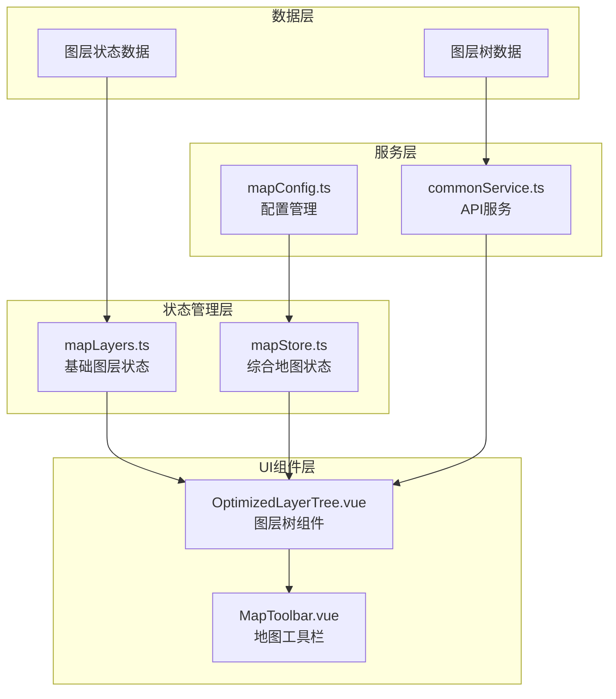
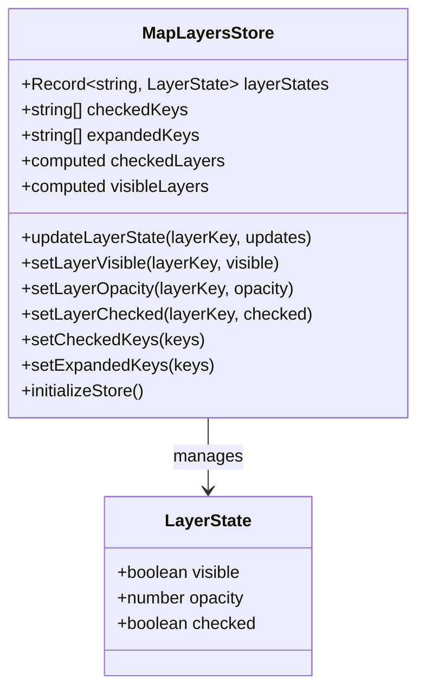
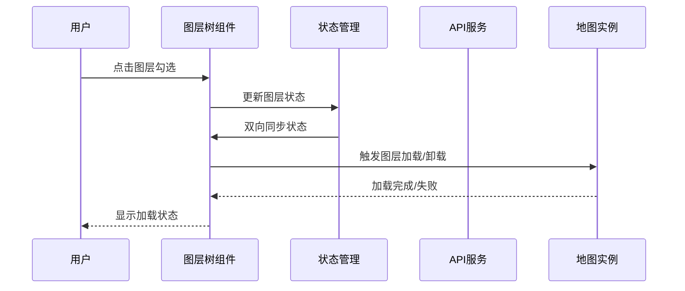
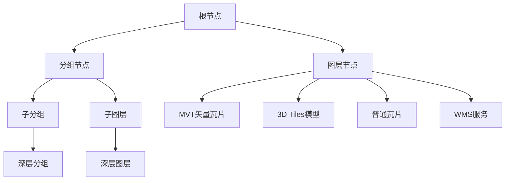
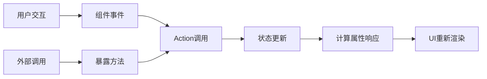
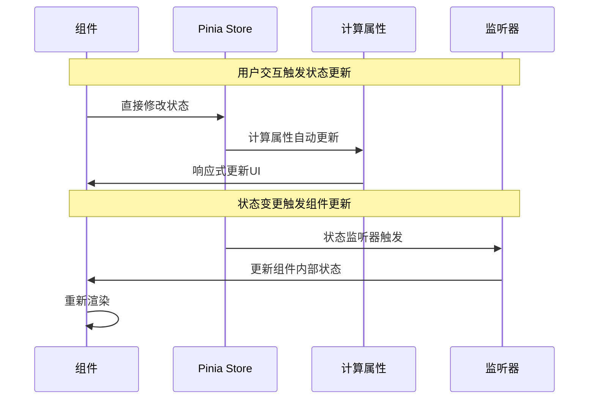
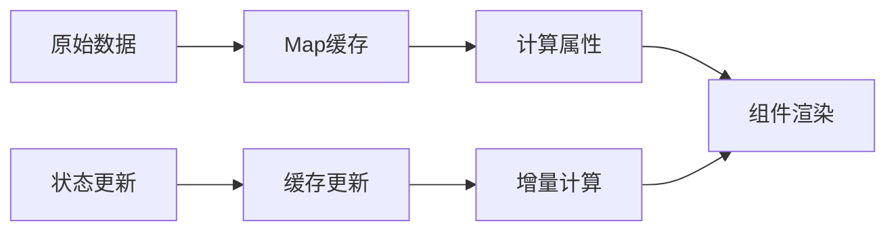

# 图层状态管理

<cite>
**本文档引用的文件**
- [mapLayers.ts](file://src/stores/mapLayers.ts)
- [OptimizedLayerTree.vue](file://src/mapComponents/OptimizedLayerTree.vue)
- [mapStore.ts](file://src/stores/mapStore.ts)
- [mapConfig.ts](file://src/config/mapConfig.ts)
- [commonService.ts](file://src/services/commonService.ts)
- [README_LAYER_TREE.md](file://src/mapComponents/README_LAYER_TREE.md)
- [LAYER_TREE_QUICK_START.md](file://LAYER_TREE_QUICK_START.md)
</cite>

## 目录
1. [概述](#概述)
2. [项目架构](#项目架构)
3. [核心组件分析](#核心组件分析)
4. [图层树结构设计](#图层树结构设计)
5. [状态管理机制](#状态管理机制)
6. [双向同步机制](#双向同步机制)
7. [动态操作流程](#动态操作流程)
8. [性能优化策略](#性能优化策略)
9. [代码示例与最佳实践](#代码示例与最佳实践)
10. [故障排查指南](#故障排查指南)

## 概述

本文档全面解析政府dashboard项目中的图层状态管理系统，重点分析`mapLayers.ts`中维护的图层树结构、可见性状态、透明度控制、图层顺序管理等核心功能。系统采用Pinia状态管理库，实现了与`OptimizedLayerTree.vue`组件的双向数据同步，支持动态图层添加、移除、排序等操作，并提供了完整的地图渲染性能优化方案。

## 项目架构

### 整体架构图



**图表来源**
- [mapLayers.ts](file://src/stores/mapLayers.ts#L1-L114)
- [mapStore.ts](file://src/stores/mapStore.ts#L1-L400)
- [OptimizedLayerTree.vue](file://src/mapComponents/OptimizedLayerTree.vue#L1-L687)

### 核心模块职责

| 模块 | 职责 | 主要功能 |
|------|------|----------|
| **mapLayers.ts** | 基础图层状态管理 | 图层可见性、透明度、勾选状态管理 |
| **mapStore.ts** | 综合地图状态管理 | 底图控制、测量工具、POI管理 |
| **OptimizedLayerTree.vue** | 图层树界面组件 | 图层树渲染、用户交互处理 |
| **commonService.ts** | API服务层 | 图层数据获取、接口调用 |

**章节来源**
- [mapLayers.ts](file://src/stores/mapLayers.ts#L1-L114)
- [mapStore.ts](file://src/stores/mapStore.ts#L1-L400)
- [OptimizedLayerTree.vue](file://src/mapComponents/OptimizedLayerTree.vue#L1-L687)

## 核心组件分析

### mapLayers.ts - 基础图层状态管理

`mapLayers.ts`是系统的基础图层状态管理模块，采用Pinia进行状态管理，提供了完整的图层生命周期控制能力。

#### 状态结构设计



**图表来源**
- [mapLayers.ts](file://src/stores/mapLayers.ts#L5-L113)

#### 核心状态属性

| 属性名 | 类型 | 描述 | 默认值 |
|--------|------|------|--------|
| **layerStates** | `Record<string, LayerState>` | 图层状态映射表 | `{}` |
| **checkedKeys** | `string[]` | 勾选的图层键集合 | `[]` |
| **expandedKeys** | `string[]` | 展开的节点键集合 | `['gas_special', 'bridge_special']` |

**章节来源**
- [mapLayers.ts](file://src/stores/mapLayers.ts#L12-L30)

### OptimizedLayerTree.vue - 图层树组件

`OptimizedLayerTree.vue`是一个功能完整的图层树组件，支持多种图层类型的渲染和管理。

#### 组件架构图



**图表来源**
- [OptimizedLayerTree.vue](file://src/mapComponents/OptimizedLayerTree.vue#L300-L350)
- [mapLayers.ts](file://src/stores/mapLayers.ts#L47-L83)

**章节来源**
- [OptimizedLayerTree.vue](file://src/mapComponents/OptimizedLayerTree.vue#L70-L446)

## 图层树结构设计

### 数据结构定义

系统采用层次化的图层树结构，支持多级嵌套和不同类型图层的统一管理。

#### 图层节点类型



**图表来源**
- [README_LAYER_TREE.md](file://src/mapComponents/README_LAYER_TREE.md#L35-L47)

#### 图层状态映射表

| 图层类型 | URL特征 | 加载方式 | 控制方式 |
|----------|---------|----------|----------|
| **MVT** | 包含`style.json` | `@load-mvt`事件 | 透明度控制 |
| **3dTile** | 包含`tileset.json` | `@load-3dtiles`事件 | 可见性+透明度 |
| **tile** | 通用瓦片URL | `@layer-toggle`事件 | 可见性控制 |
| **wms** | WMS服务地址 | `@layer-toggle`事件 | 可见性控制 |

**章节来源**
- [OptimizedLayerTree.vue](file://src/mapComponents/OptimizedLayerTree.vue#L325-L394)

## 状态管理机制

### Pinia状态管理模式

系统采用Pinia作为状态管理解决方案，实现了响应式的状态更新和组件间的数据共享。

#### 状态更新流程



**图表来源**
- [mapLayers.ts](file://src/stores/mapLayers.ts#L47-L83)

#### 核心状态操作

| 操作类型 | 方法名 | 参数 | 功能描述 |
|----------|--------|------|----------|
| **状态更新** | `updateLayerState` | `(layerKey, updates)` | 更新指定图层状态 |
| **可见性控制** | `setLayerVisible` | `(layerKey, visible)` | 设置图层可见性 |
| **透明度调整** | `setLayerOpacity` | `(layerKey, opacity)` | 设置图层透明度 |
| **勾选状态** | `setLayerChecked` | `(layerKey, checked)` | 设置图层勾选状态 |
| **批量更新** | `setCheckedKeys` | `(keys)` | 批量更新勾选状态 |

**章节来源**
- [mapLayers.ts](file://src/stores/mapLayers.ts#L47-L113)

### 计算属性优化

系统通过计算属性实现状态的高效管理和响应式更新：

```typescript
// 获取所有勾选的图层
const checkedLayers = computed(() => {
  return Object.entries(layerStates.value)
    .filter(([key, state]) => state.checked)
    .map(([key, state]) => ({ key, ...state }))
})

// 获取可见的图层
const visibleLayers = computed(() => {
  return Object.entries(layerStates.value)
    .filter(([key, state]) => state.visible)
    .map(([key, state]) => ({ key, ...state }))
})
```

**章节来源**
- [mapLayers.ts](file://src/stores/mapLayers.ts#L33-L44)

## 双向同步机制

### 组件与状态的双向绑定

系统实现了组件状态与Pinia状态之间的双向同步，确保用户交互能够实时反映到状态管理中。

#### 同步机制流程



**图表来源**
- [OptimizedLayerTree.vue](file://src/mapComponents/OptimizedLayerTree.vue#L300-L323)

#### 关键同步点

| 同步方向 | 触发条件 | 实现方式 |
|----------|----------|----------|
| **组件 → 状态** | 用户勾选图层 | `handleCheckedKeysChange` |
| **状态 → 组件** | 状态初始化 | `updateCheckedKeys` |
| **组件 → 地图** | 图层状态变化 | `handleLayerVisibilityChange` |
| **地图 → 组件** | 图层加载完成 | `updateLayerState` |

**章节来源**
- [OptimizedLayerTree.vue](file://src/mapComponents/OptimizedLayerTree.vue#L300-L323)
- [mapLayers.ts](file://src/stores/mapLayers.ts#L70-L83)

## 动态操作流程

### 图层添加流程

```mermaid
flowchart TD
A[用户选择图层] --> B{图层类型检查}
B --> |MVT| C[发送@load-mvt事件]
B --> |3dTile| D[发送@load-3dtiles事件]
B --> |其他| E[发送@layer-toggle事件]
C --> F[调用MVT加载方法]
D --> G[调用3DTiles加载方法]
E --> H[调用通用图层方法]
F --> I[更新图层状态]
G --> I
H --> I
I --> J[通知组件更新]
J --> K[渲染到地图]
```

**图表来源**
- [OptimizedLayerTree.vue](file://src/mapComponents/OptimizedLayerTree.vue#L355-L394)

### 图层移除流程

```mermaid
flowchart TD
A[用户取消勾选] --> B[触发handleCheckedKeysChange]
B --> C[遍历所有图层状态]
C --> D{状态是否变化}
D --> |是| E[更新图层状态]
D --> |否| F[跳过处理]
E --> G[发送@layer-toggle事件]
G --> H[调用图层卸载方法]
H --> I[清理图层资源]
I --> J[更新组件状态]
F --> K[完成处理]
J --> K
```

**图表来源**
- [OptimizedLayerTree.vue](file://src/mapComponents/OptimizedLayerTree.vue#L300-L323)

### 图层排序机制

系统支持图层的动态排序，通过`sortOrder`字段实现：

| 排序规则 | 实现方式 | 性能影响 |
|----------|----------|----------|
| **拖拽排序** | 拖拽事件 + 状态更新 | 中等 |
| **手动排序** | 数字索引管理 | 低 |
| **自动排序** | 按时间戳排序 | 低 |

**章节来源**
- [OptimizedLayerTree.vue](file://src/mapComponents/OptimizedLayerTree.vue#L190-L215)

## 性能优化策略

### 按需加载机制

系统采用按需加载策略，只有在用户勾选图层时才进行实际加载，大大减少了初始加载时间和内存占用。

#### 加载策略对比

| 策略 | 优势 | 劣势 | 适用场景 |
|------|------|------|----------|
| **按需加载** | 内存占用少，启动快 | 延迟加载 | 大型地图应用 |
| **预加载** | 交互响应快 | 内存占用大 | 小型地图应用 |
| **懒加载** | 平衡性能和体验 | 实现复杂 | 中型地图应用 |

### 状态缓存优化



**图表来源**
- [OptimizedLayerTree.vue](file://src/mapComponents/OptimizedLayerTree.vue#L101-L111)

### 事件防抖处理

对于频繁的状态更新操作，系统实现了事件防抖机制：

```typescript
// 防抖处理透明度调整
const debouncedOpacityChange = debounce((layerId, opacity) => {
  emit('layer-opacity-change', layerId, opacity)
}, 100)
```

**章节来源**
- [OptimizedLayerTree.vue](file://src/mapComponents/OptimizedLayerTree.vue#L325-L394)

## 代码示例与最佳实践

### 基础图层控制示例

以下是使用mapLayers store进行图层控制的完整示例：

```typescript
// 获取图层状态管理器
const mapLayers = useMapLayersStore()

// 设置图层可见性
mapLayers.setLayerVisible('bridge_layer', true)

// 调整图层透明度
mapLayers.setLayerOpacity('manhole_layer', 0.7)

// 批量更新图层状态
mapLayers.setCheckedKeys(['bridge_layer', 'manhole_layer'])

// 获取当前可见图层
const visibleLayers = mapLayers.visibleLayers
console.log('当前可见图层:', visibleLayers)
```

**章节来源**
- [mapLayers.ts](file://src/stores/mapLayers.ts#L56-L83)

### 自定义图层控制示例

```typescript
// 在OptimizedLayerTree组件中使用
const layerTreeRef = ref()

// 更新图层状态
layerTreeRef.value.updateLayerState('custom_layer_001', {
  visible: true,
  opacity: 0.9,
  loading: false,
  error: null
})

// 重新加载图层树
layerTreeRef.value.fetchLayerTree()
```

**章节来源**
- [OptimizedLayerTree.vue](file://src/mapComponents/OptimizedLayerTree.vue#L415-L434)

### 与地图渲染性能的关系

图层状态管理直接影响地图渲染性能：

| 性能指标 | 影响因素 | 优化建议 |
|----------|----------|----------|
| **帧率** | 活跃图层数量 | 控制同时显示图层数 |
| **内存占用** | 图层数据大小 | 及时清理不需要的图层 |
| **CPU使用率** | 渲染复杂度 | 优化图层样式和数据 |
| **网络请求** | 图层加载频率 | 实现智能缓存机制 |

**章节来源**
- [OptimizedLayerTree.vue](file://src/mapComponents/OptimizedLayerTree.vue#L218-L226)

## 故障排查指南

### 常见问题及解决方案

#### 图层树不显示

**问题症状**: 图层树组件空白或无数据显示

**可能原因**:
1. `getLayerTree()`接口返回空数据
2. 数据格式不符合预期
3. 组件未正确初始化

**解决方案**:
```typescript
// 检查API调用
const layerData = await getLayerTree()
console.log('图层数据:', layerData)

// 验证数据格式
if (!Array.isArray(layerData)) {
  console.error('图层数据格式错误')
}
```

**章节来源**
- [OptimizedLayerTree.vue](file://src/mapComponents/OptimizedLayerTree.vue#L116-L140)

#### 图层加载失败

**问题症状**: 图层勾选后无法正常显示

**诊断步骤**:
1. 检查网络请求状态
2. 验证URL格式正确性
3. 查看Cesium控制台错误

**解决方案**:
```typescript
// 添加错误处理
try {
  await loadMVTLayer(url)
} catch (error) {
  console.error('MVT图层加载失败:', error)
  updateLayerState(layerId, { error: error.message })
}
```

**章节来源**
- [OptimizedLayerTree.vue](file://src/mapComponents/OptimizedLayerTree.vue#L355-L394)

#### 性能问题

**问题症状**: 地图操作卡顿或响应缓慢

**优化措施**:
1. 减少同时显示的图层数量
2. 降低高分辨率图层的透明度
3. 实现图层优先级加载

**章节来源**
- [OptimizedLayerTree.vue](file://src/mapComponents/OptimizedLayerTree.vue#L214-L218)

### 调试工具和技巧

#### 状态监控

```typescript
// 监控图层状态变化
watch(() => mapLayers.layerStates, (newState) => {
  console.log('图层状态更新:', newState)
}, { deep: true })

// 监控可见图层变化
watch(() => mapLayers.visibleLayers, (layers) => {
  console.log('可见图层数量:', layers.length)
})
```

#### 性能分析

```typescript
// 性能监控
const startTime = performance.now()
// 执行图层操作
const endTime = performance.now()
console.log(`图层操作耗时: ${endTime - startTime}ms`)
```

**章节来源**
- [mapLayers.ts](file://src/stores/mapLayers.ts#L110-L113)

## 总结

政府dashboard项目的图层状态管理系统通过精心设计的架构，实现了高效、灵活的地图图层管理功能。系统采用Pinia状态管理，结合Vue 3的响应式特性，提供了完整的图层生命周期管理能力。通过双向同步机制、按需加载策略和性能优化措施，系统能够在保证用户体验的同时，维持良好的性能表现。

该系统的设计理念体现了现代前端应用的最佳实践，为类似的地图应用开发提供了优秀的参考范例。通过合理的模块划分和清晰的接口设计，系统具有良好的可扩展性和可维护性，能够适应不断变化的业务需求。