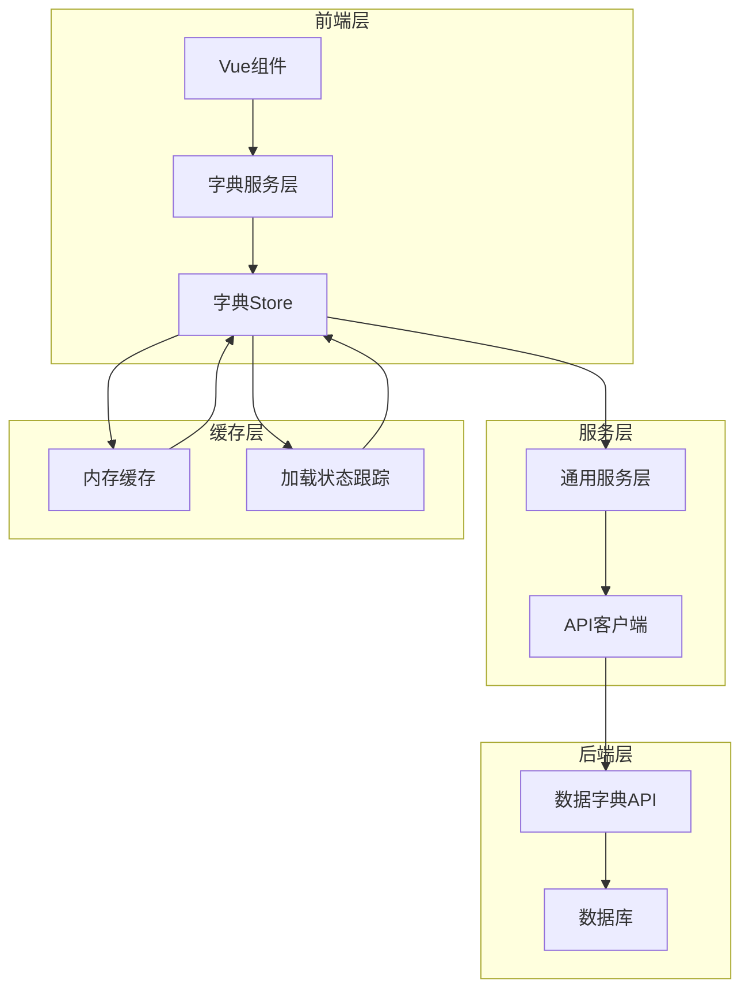
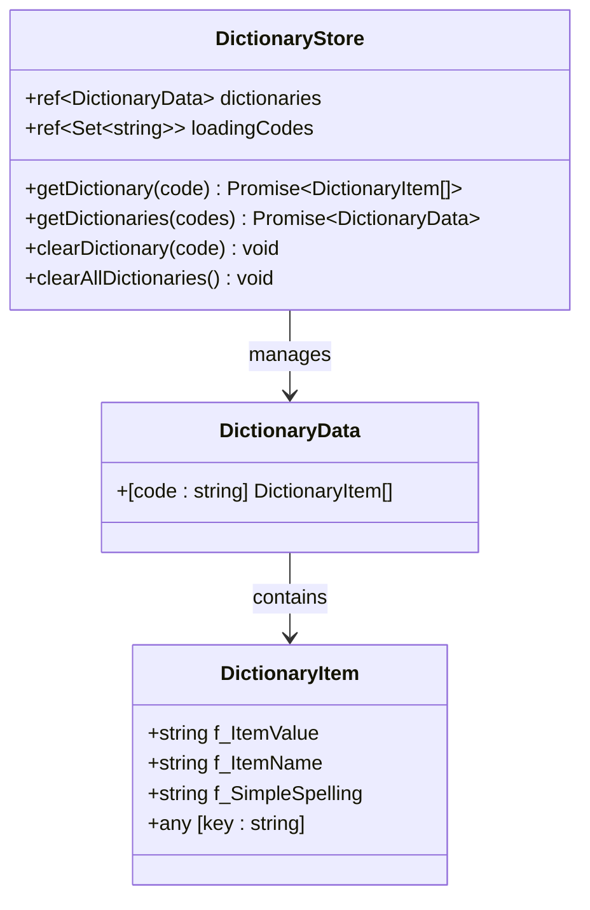
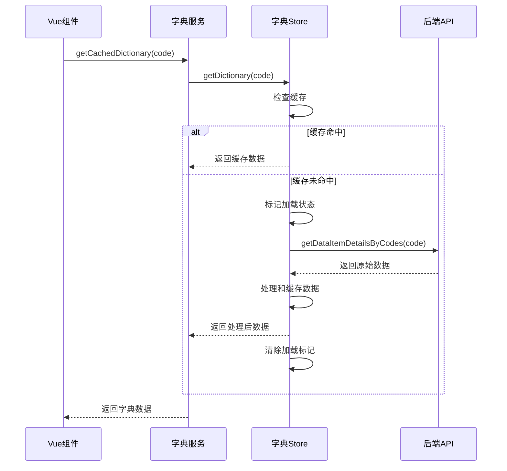
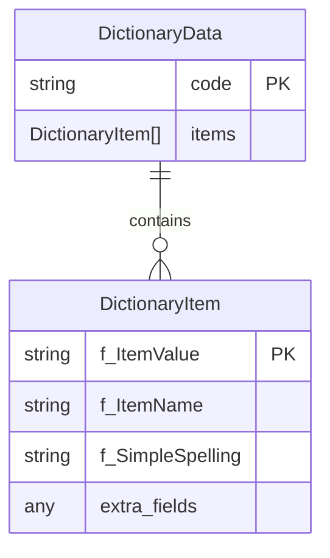
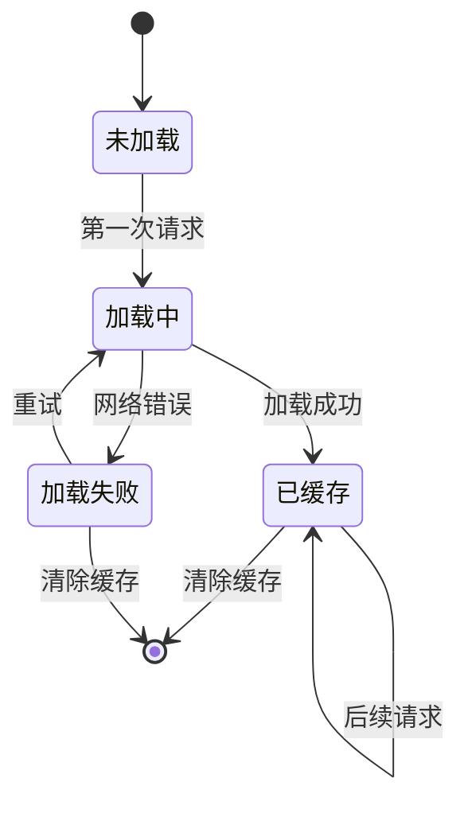
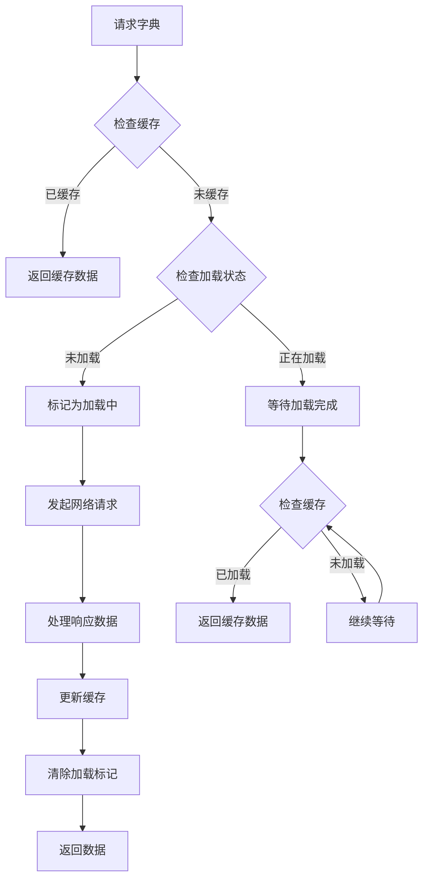
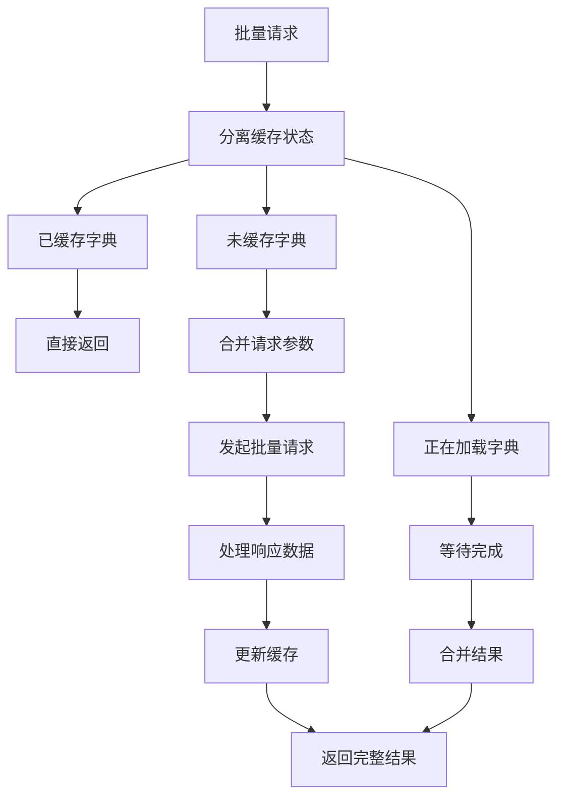

# 字典缓存管理

<cite>
**本文档引用的文件**
- [dictionaryStore.ts](file://src/stores/dictionaryStore.ts)
- [dictionaryService.ts](file://src/services/dictionaryService.ts)
- [commonService.ts](file://src/services/commonService.ts)
- [gasService.ts](file://src/services/gasService.ts)
- [waterSupplyService.ts](file://src/services/waterSupplyService.ts)
- [WaterQualityModule.vue](file://src/views/WaterSupply/components/WaterQualityModule.vue)
- [DICTIONARY_CACHE_OPTIMIZATION.md](file://DICTIONARY_CACHE_OPTIMIZATION.md)
- [common.ts](file://src/api/common.ts)
</cite>

## 目录
1. [概述](#概述)
2. [系统架构](#系统架构)
3. [核心组件分析](#核心组件分析)
4. [数据结构设计](#数据结构设计)
5. [缓存机制详解](#缓存机制详解)
6. [异步加载策略](#异步加载策略)
7. [服务层集成](#服务层集成)
8. [前端组件使用](#前端组件使用)
9. [容错处理与调试](#容错处理与调试)
10. [性能优化建议](#性能优化建议)
11. [最佳实践](#最佳实践)

## 概述

字典缓存管理系统是政府dashboard项目中的核心数据管理组件，负责统一管理和缓存各类业务字典数据。该系统通过引入Pinia状态管理，实现了高效的字典数据缓存机制，显著提升了系统的响应性能和用户体验。

### 主要特性

- **智能缓存机制**：基于字典编码的内存缓存，避免重复网络请求
- **并发控制**：自动处理并发请求，防止重复加载
- **批量操作**：支持单个和批量字典数据获取
- **错误恢复**：完善的错误处理和降级机制
- **灵活配置**：支持缓存清除和重置功能

## 系统架构



**图表来源**
- [dictionaryStore.ts](file://src/stores/dictionaryStore.ts#L26-L222)
- [dictionaryService.ts](file://src/services/dictionaryService.ts#L8-L45)

## 核心组件分析

### 字典Store组件

字典Store是整个缓存系统的核心，基于Pinia状态管理构建，提供完整的字典数据管理功能。



**图表来源**
- [dictionaryStore.ts](file://src/stores/dictionaryStore.ts#L14-L24)

**章节来源**
- [dictionaryStore.ts](file://src/stores/dictionaryStore.ts#L26-L222)

### 字典服务层

字典服务层提供简洁的API接口，封装了复杂的缓存逻辑，使上层组件能够轻松获取字典数据。



**图表来源**
- [dictionaryService.ts](file://src/services/dictionaryService.ts#L15-L28)
- [dictionaryStore.ts](file://src/stores/dictionaryStore.ts#L38-L95)

**章节来源**
- [dictionaryService.ts](file://src/services/dictionaryService.ts#L8-L45)

## 数据结构设计

### 字典项类型定义

系统定义了标准化的字典项数据结构，确保数据的一致性和可扩展性：

| 字段名 | 类型 | 描述 | 必填 |
|--------|------|------|------|
| f_ItemValue | string | 字典值，用于数据存储和传输 | 是 |
| f_ItemName | string | 字典名称，用于显示和用户交互 | 是 |
| f_SimpleSpelling | string | 简拼，用于拼音搜索和快速查询 | 否 |

### 字典数据结构



**图表来源**
- [dictionaryStore.ts](file://src/stores/dictionaryStore.ts#L14-L24)

**章节来源**
- [dictionaryStore.ts](file://src/stores/dictionaryStore.ts#L14-L24)

## 缓存机制详解

### 缓存策略

系统采用基于字典编码的内存缓存策略，具有以下特点：

1. **按需加载**：仅在首次访问时加载字典数据
2. **永久缓存**：除非手动清除，否则数据一直保留在内存中
3. **分类存储**：按字典编码分类存储，便于管理和查找

### 缓存生命周期



### 并发控制机制

系统实现了智能的并发控制，防止同一字典的重复请求：



**图表来源**
- [dictionaryStore.ts](file://src/stores/dictionaryStore.ts#L44-L58)
- [dictionaryStore.ts](file://src/stores/dictionaryStore.ts#L131-L152)

**章节来源**
- [dictionaryStore.ts](file://src/stores/dictionaryStore.ts#L38-L95)
- [dictionaryStore.ts](file://src/stores/dictionaryStore.ts#L103-L194)

## 异步加载策略

### 单个字典加载

系统提供了高效的单个字典加载机制，支持超时控制和重试机制：

- **超时控制**：最多等待5秒（50次轮询，每次100ms）
- **错误处理**：网络错误时返回空数组，不影响其他功能
- **状态跟踪**：使用Set数据结构跟踪正在加载的字典

### 批量字典加载

批量加载功能优化了网络请求效率：



**图表来源**
- [dictionaryStore.ts](file://src/stores/dictionaryStore.ts#L104-L194)

**章节来源**
- [dictionaryStore.ts](file://src/stores/dictionaryStore.ts#L103-L194)

## 服务层集成

### gasService.ts中的字典使用

虽然gasService.ts本身不直接使用字典缓存，但它是系统的重要组成部分，展示了字典数据在实际业务中的应用场景。

### waterSupplyService.ts中的字典使用

waterSupplyService.ts展示了字典数据在供水模块中的典型应用，特别是在水质监测数据处理中的使用。

**章节来源**
- [gasService.ts](file://src/services/gasService.ts#L1-L218)
- [waterSupplyService.ts](file://src/services/waterSupplyService.ts#L1-L162)

## 前端组件使用

### WaterQualityModule组件示例

WaterQualityModule组件展示了字典缓存在实际业务中的应用：

```typescript
// 字典数据获取示例
const dictionaries = await getCachedDictionary("gs_szjcsb");
szMap.value = dictionaries.reduce((acc, cur) => {
  acc[cur.f_ItemValue] = cur.f_ItemName;
  return acc;
}, {});

// 数据映射和展示
const parameters = [];
for (let key in jcz) {
  parameters.push({
    id: key,
    name: szMap.value[key],           // 使用字典名称
    value: jcz[key]?.jcz,
    unit: jcz[key]?.jcdw || "",
    status: "normal",
  });
}
```

### 下拉框数据填充场景

以下是字典数据在下拉框组件中的典型使用模式：

```typescript
// 组件中获取字典数据
const equipmentStatusOptions = ref([]);

onMounted(async () => {
  // 获取设备状态字典
  const statusDict = await getCachedDictionary('gs_szjcsb');
  equipmentStatusOptions.value = statusDict.map(item => ({
    label: item.f_ItemName,
    value: item.f_ItemValue
  }));
});

// 表单验证和数据绑定
const formData = reactive({
  equipmentStatus: '',
  maintenanceType: ''
});

// 批量获取多个字典
const loadMultipleDictionaries = async () => {
  const codes = ['equipment_type', 'maintenance_status', 'priority_level'];
  const dictResults = await getCachedDictionaries(codes);
  
  // 处理不同类型的字典数据
  equipmentTypes.value = dictResults.equipment_type || [];
  statusOptions.value = dictResults.maintenance_status || [];
  priorityOptions.value = dictResults.priority_level || [];
};
```

**章节来源**
- [WaterQualityModule.vue](file://src/views/WaterSupply/components/WaterQualityModule.vue#L60-L95)

## 容错处理与调试

### 加载失败的容错处理

系统实现了完善的错误处理机制：

1. **网络错误处理**：捕获网络请求异常，返回空数组
2. **数据格式验证**：验证API返回数据的格式正确性
3. **降级策略**：即使加载失败，也不会影响应用的正常运行

### 调试和监控

系统提供了多种调试和监控手段：

```typescript
// 开发环境下的调试信息
console.error(`获取字典数据失败 (${code}):`, error);

// 缓存状态监控
watchEffect(() => {
  console.log('当前字典缓存:', dictionaryStore.dictionaries);
  console.log('正在加载的字典:', Array.from(dictionaryStore.loadingCodes));
});

// 性能监控
const startTime = performance.now();
const data = await dictionaryStore.getDictionary(code);
const endTime = performance.now();
console.log(`字典加载耗时: ${endTime - startTime}ms`);
```

### 常见问题排查

| 问题类型 | 可能原因 | 解决方案 |
|----------|----------|----------|
| 字典数据为空 | API接口异常或数据不存在 | 检查API接口状态，确认字典编码正确 |
| 加载超时 | 网络延迟或服务器响应慢 | 增加超时时间或优化网络连接 |
| 内存占用过高 | 缓存数据过多 | 定期清理不需要的字典缓存 |
| 并发冲突 | 多个组件同时请求相同字典 | 使用批量加载或等待机制 |

**章节来源**
- [dictionaryStore.ts](file://src/stores/dictionaryStore.ts#L89-L95)
- [dictionaryStore.ts](file://src/stores/dictionaryStore.ts#L181-L187)

## 性能优化建议

### 缓存优化策略

1. **预加载常用字典**：在应用启动时预加载常用的字典数据
2. **懒加载非关键字典**：对于不常用的字典采用懒加载策略
3. **定期清理过期缓存**：实现缓存过期机制，定期清理长时间未使用的字典

### 网络优化

1. **批量请求优化**：尽可能使用批量接口减少网络请求数量
2. **压缩传输数据**：对字典数据进行适当的压缩处理
3. **CDN加速**：将静态字典数据部署到CDN节点

### 内存优化

```typescript
// 实现缓存大小限制
class LimitedDictionaryStore {
  private cache = new Map<string, DictionaryItem[]>();
  private maxSize = 100;
  
  set(key: string, value: DictionaryItem[]) {
    if (this.cache.size >= this.maxSize) {
      // 移除最旧的缓存项
      const oldestKey = this.cache.keys().next().value;
      this.cache.delete(oldestKey);
    }
    this.cache.set(key, value);
  }
}
```

## 最佳实践

### 字典编码规范

1. **语义化命名**：使用有意义的字典编码，如`equipment_type`、`status_code`
2. **层次化组织**：按业务模块组织字典编码，避免命名冲突
3. **版本控制**：对重要的字典添加版本标识，便于升级和兼容

### 使用建议

1. **合理选择加载方式**：根据使用场景选择单个或批量加载
2. **及时清理缓存**：在数据发生重大变化时及时清理相关缓存
3. **错误边界处理**：在组件层面添加适当的错误边界处理
4. **用户体验优化**：为字典加载添加适当的加载指示器

### 开发规范

```typescript
// 推荐的字典使用模式
export async function loadEquipmentData() {
  try {
    // 批量获取相关字典
    const dictCodes = ['equipment_type', 'status_code', 'priority_level'];
    const dicts = await getCachedDictionaries(dictCodes);
    
    // 验证必需的字典是否加载成功
    if (!dicts.equipment_type || dicts.equipment_type.length === 0) {
      throw new Error('设备类型字典加载失败');
    }
    
    // 处理业务逻辑
    return processEquipmentData(dicts);
  } catch (error) {
    console.error('设备数据加载失败:', error);
    // 返回默认值或显示错误提示
    return getDefaultEquipmentData();
  }
}
```

通过遵循这些最佳实践，可以充分发挥字典缓存系统的优势，提升应用的性能和用户体验。