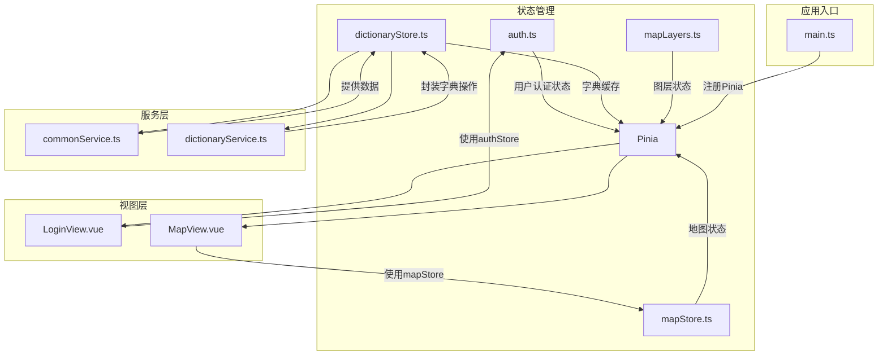
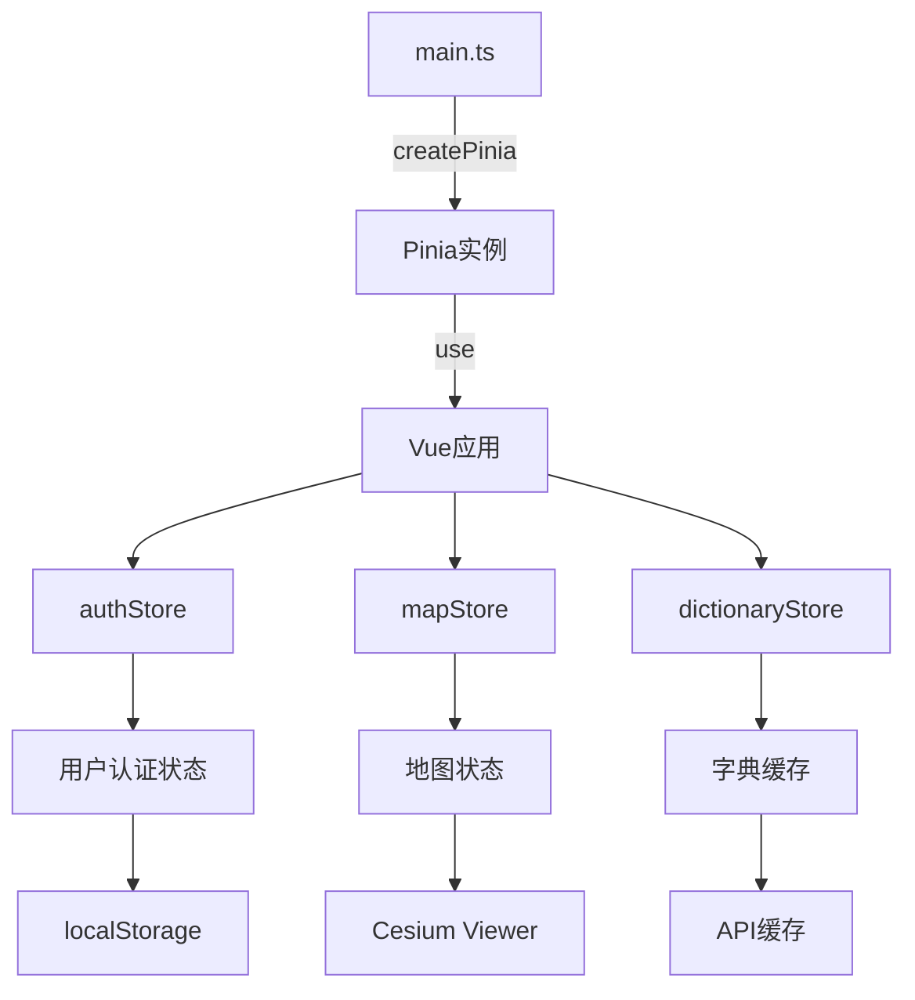
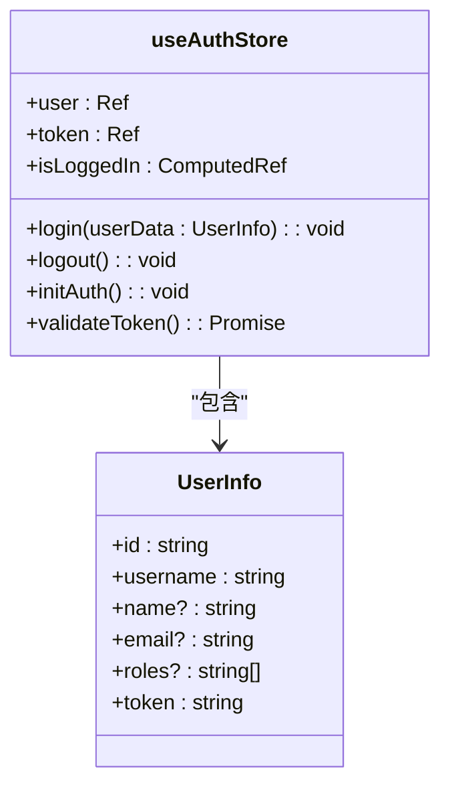
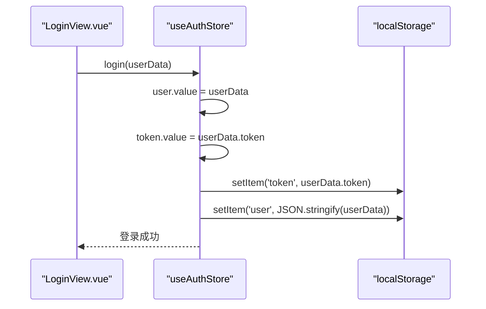
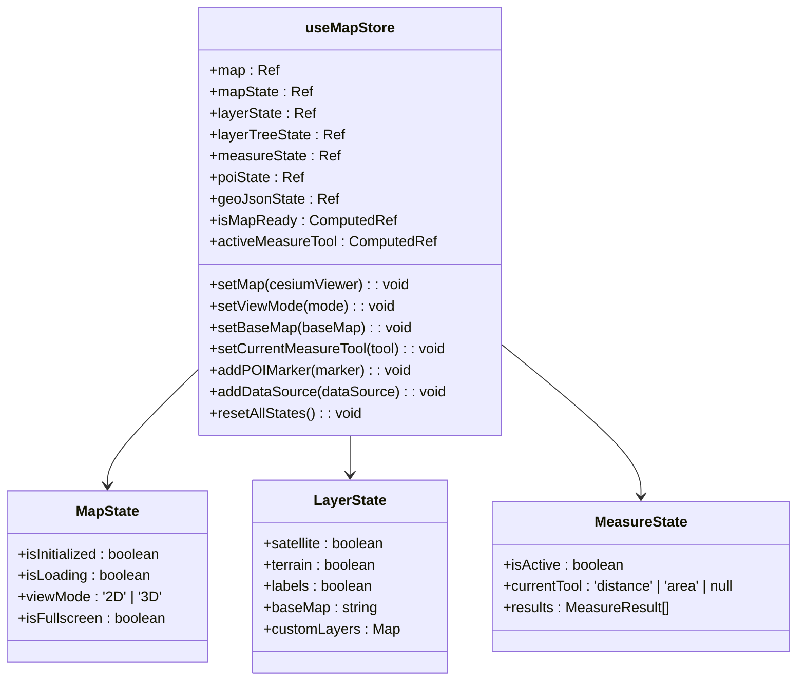
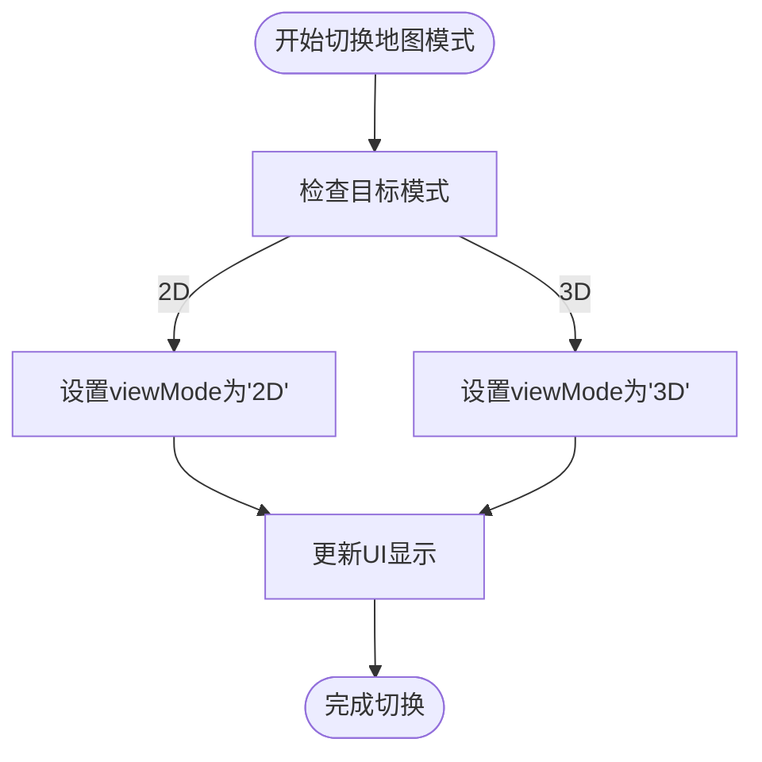
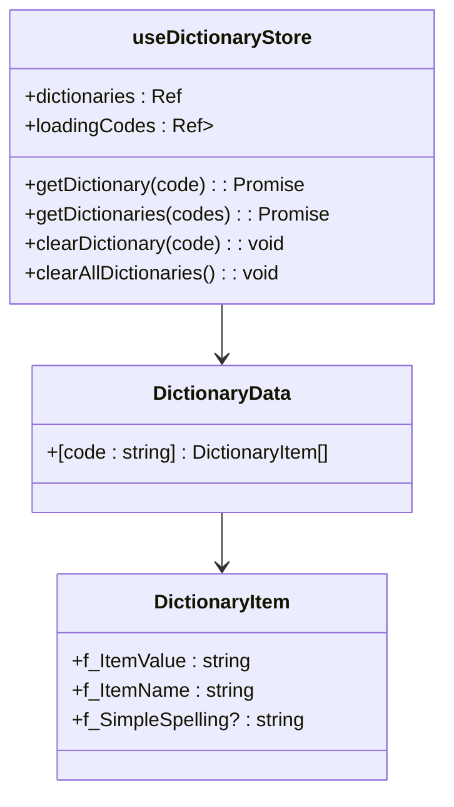
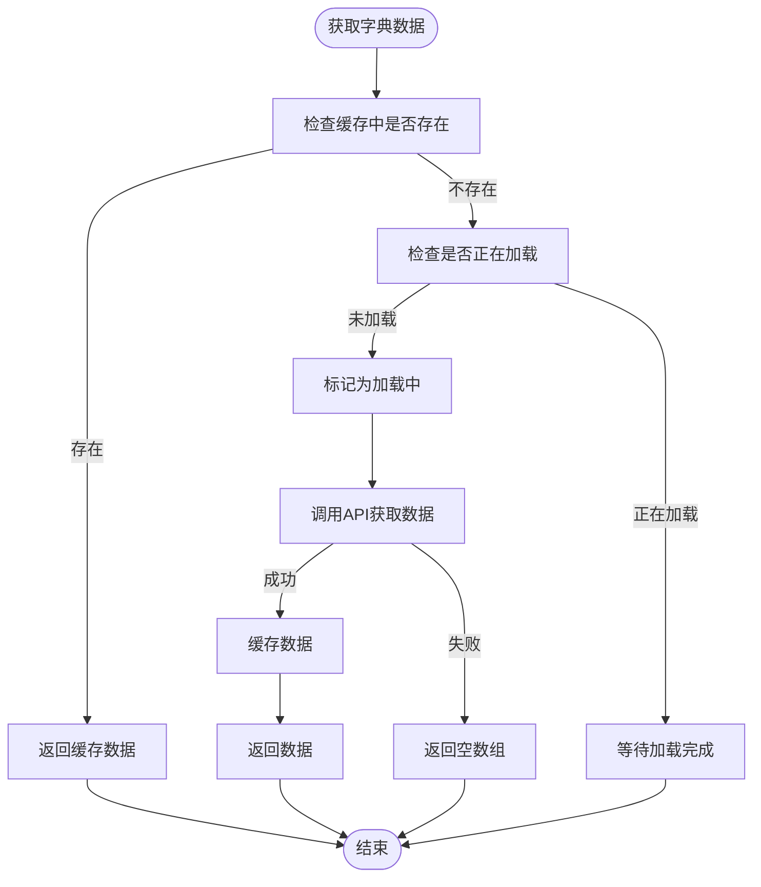
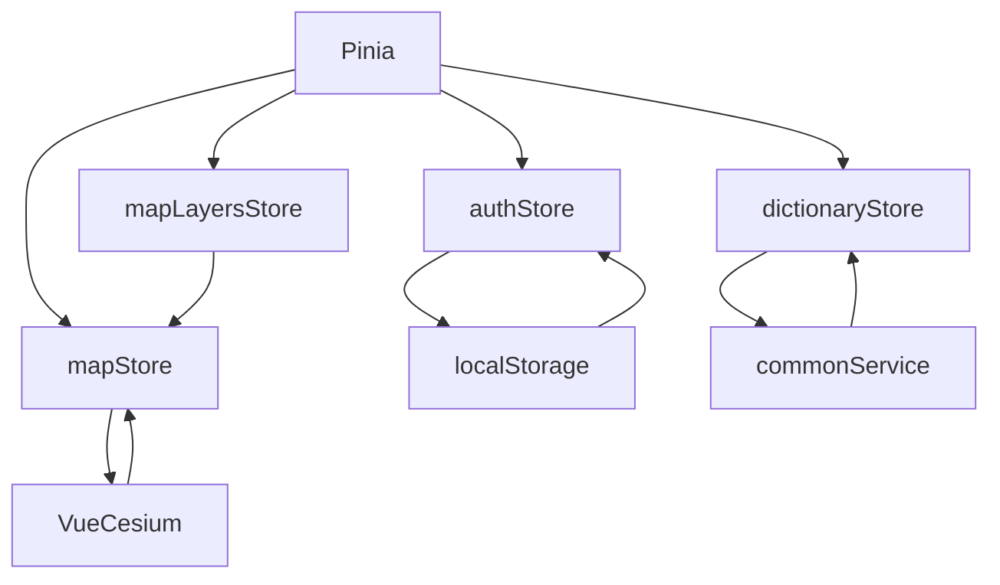

# 状态管理

<cite>
**本文档引用的文件**
- [auth.ts](file://src/stores/auth.ts)
- [mapStore.ts](file://src/stores/mapStore.ts)
- [dictionaryStore.ts](file://src/stores/dictionaryStore.ts)
- [main.ts](file://src/main.ts)
- [commonService.ts](file://src/services/commonService.ts)
- [dictionaryService.ts](file://src/services/dictionaryService.ts)
- [LoginView.vue](file://src/views/LoginView.vue)
</cite>

## 目录
1. [简介](#简介)
2. [项目结构](#项目结构)
3. [核心组件](#核心组件)
4. [架构概览](#架构概览)
5. [详细组件分析](#详细组件分析)
6. [依赖分析](#依赖分析)
7. [性能考虑](#性能考虑)
8. [故障排除指南](#故障排除指南)
9. [结论](#结论)

## 简介
本文档深入解析Pinia在政府Dashboard项目中的状态管理应用。重点说明用户认证状态、地图相关状态（底图类型、场景模式）的存储机制，以及字典缓存策略。文档还描述了状态持久化方案、模块间状态共享模式、状态变更追踪方法和调试技巧，并解释在main.ts中注册store的流程和作用。

## 项目结构
项目采用模块化设计，状态管理相关文件集中存放在`src/stores`目录下，包括`auth.ts`、`mapStore.ts`、`dictionaryStore.ts`和`mapLayers.ts`。这些store通过Pinia进行统一管理，并在`main.ts`中注册。状态管理与视图组件（如`LoginView.vue`和`MapView.vue`）和服务层（如`commonService.ts`）紧密协作，形成完整的状态管理闭环。

**图源**
- [auth.ts](file://src/stores/auth.ts)
- [mapStore.ts](file://src/stores/mapStore.ts)
- [dictionaryStore.ts](file://src/stores/dictionaryStore.ts)
- [main.ts](file://src/main.ts)

**本节来源**
- [src/stores](file://src/stores)
- [src/main.ts](file://src/main.ts)

## 核心组件
本项目的核心状态管理组件包括用户认证状态管理、地图状态管理和字典缓存管理。这些组件通过Pinia实现响应式状态管理，确保应用各部分之间的状态同步和一致性。

**本节来源**
- [auth.ts](file://src/stores/auth.ts)
- [mapStore.ts](file://src/stores/mapStore.ts)
- [dictionaryStore.ts](file://src/stores/dictionaryStore.ts)

## 架构概览
系统采用Pinia作为状态管理库，通过模块化store设计实现关注点分离。`authStore`管理用户认证状态，`mapStore`管理地图相关状态，`dictionaryStore`管理字典缓存。所有store在`main.ts`中通过`createPinia()`创建并注册到Vue应用实例中，实现全局状态管理。

**图源**
- [main.ts](file://src/main.ts)
- [auth.ts](file://src/stores/auth.ts)
- [mapStore.ts](file://src/stores/mapStore.ts)
- [dictionaryStore.ts](file://src/stores/dictionaryStore.ts)

## 详细组件分析
### 用户认证状态管理分析
`authStore`负责管理用户认证状态，包括用户信息、token和登录状态。它实现了状态持久化，将token和用户信息存储在localStorage中，确保页面刷新后状态不丢失。

#### 用户认证状态类图

**图源**
- [auth.ts](file://src/stores/auth.ts#L1-L76)

#### 用户登录流程序列图

**图源**
- [auth.ts](file://src/stores/auth.ts#L20-L30)
- [LoginView.vue](file://src/views/LoginView.vue#L75-L83)

**本节来源**
- [auth.ts](file://src/stores/auth.ts)
- [LoginView.vue](file://src/views/LoginView.vue)

### 地图状态管理分析
`mapStore`是项目中最复杂的store，管理Cesium Viewer实例、地图状态、图层状态、测量工具状态、POI数据状态和GeoJSON数据状态。它提供了丰富的API来控制地图的各种行为。

#### 地图状态管理类图

**图源**
- [mapStore.ts](file://src/stores/mapStore.ts#L1-L400)

#### 地图模式切换流程

**图源**
- [mapStore.ts](file://src/stores/mapStore.ts#L106-L108)

**本节来源**
- [mapStore.ts](file://src/stores/mapStore.ts)
- [Map.vue](file://src/mapComponents/Map.vue)

### 字典缓存管理分析
`dictionaryStore`实现了高效的字典数据缓存机制，避免重复请求后端API，提高应用性能。

#### 字典缓存策略类图

**图源**
- [dictionaryStore.ts](file://src/stores/dictionaryStore.ts#L1-L222)

#### 字典数据获取流程

**图源**
- [dictionaryStore.ts](file://src/stores/dictionaryStore.ts#L38-L96)

**本节来源**
- [dictionaryStore.ts](file://src/stores/dictionaryStore.ts)
- [commonService.ts](file://src/services/commonService.ts)

## 依赖分析
项目状态管理依赖于Pinia库，通过模块化设计实现store之间的解耦。各store之间通过明确的API进行交互，避免了直接的状态依赖。

**图源**
- [package.json](file://package.json)
- [main.ts](file://src/main.ts)
- [auth.ts](file://src/stores/auth.ts)
- [dictionaryStore.ts](file://src/stores/dictionaryStore.ts)
- [mapStore.ts](file://src/stores/mapStore.ts)

**本节来源**
- [package.json](file://package.json)
- [src/stores](file://src/stores)
- [src/services](file://src/services)

## 性能考虑
状态管理在性能方面有以下考虑：
1. **字典缓存**：避免重复请求相同的字典数据，减少网络开销
2. **状态持久化**：通过localStorage保存关键状态，减少初始化时间
3. **响应式优化**：使用ref和computed实现精确的响应式更新，避免不必要的渲染
4. **批量操作**：提供批量获取字典数据的API，减少请求数量

## 故障排除指南
### 状态变更追踪方法
1. **使用Vue DevTools**：可以实时查看所有store的状态变化
2. **添加日志**：在关键状态变更处添加console.log
3. **Pinia插件**：可以使用Pinia的devtools插件进行更详细的追踪

### 常见问题及解决方案
1. **状态未持久化**：检查localStorage操作是否正确执行
2. **字典数据未缓存**：确保getDictionary方法正确处理缓存逻辑
3. **地图状态不同步**：检查mapStore的actions是否正确更新状态

**本节来源**
- [auth.ts](file://src/stores/auth.ts)
- [dictionaryStore.ts](file://src/stores/dictionaryStore.ts)
- [mapStore.ts](file://src/stores/mapStore.ts)

## 结论
本项目通过Pinia实现了高效的状态管理，各store职责分明，代码结构清晰。用户认证状态管理确保了安全的用户会话，地图状态管理提供了丰富的地图交互功能，字典缓存管理优化了应用性能。整体状态管理方案设计合理，易于维护和扩展。