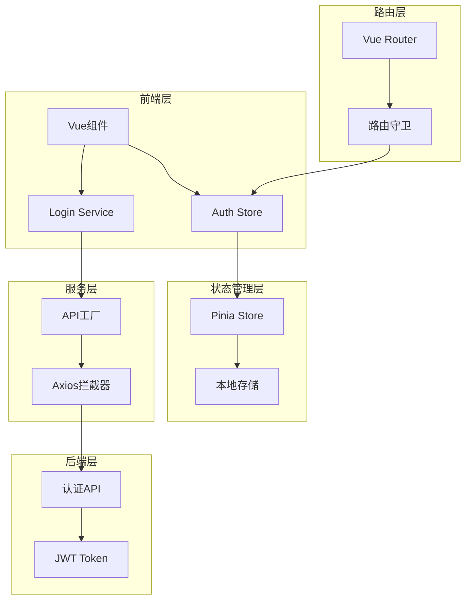
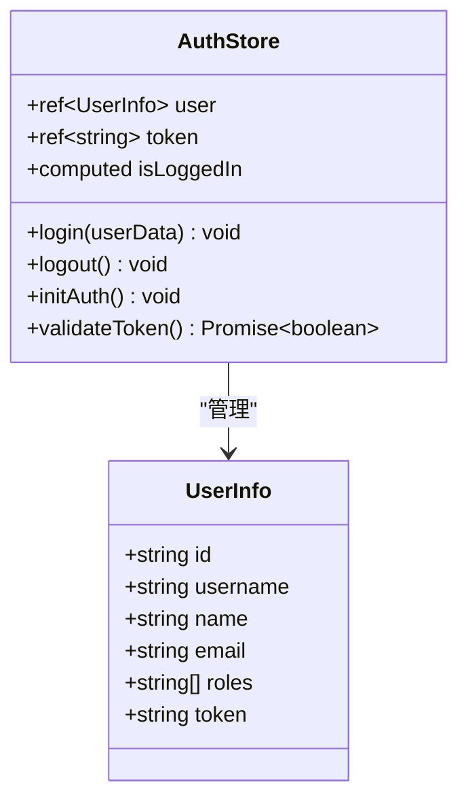
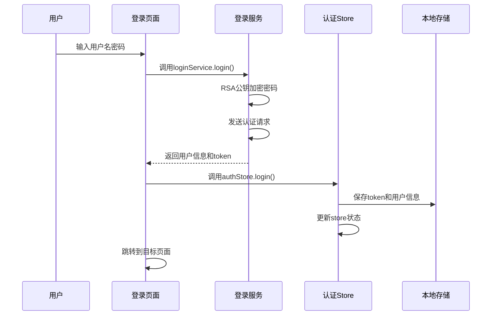
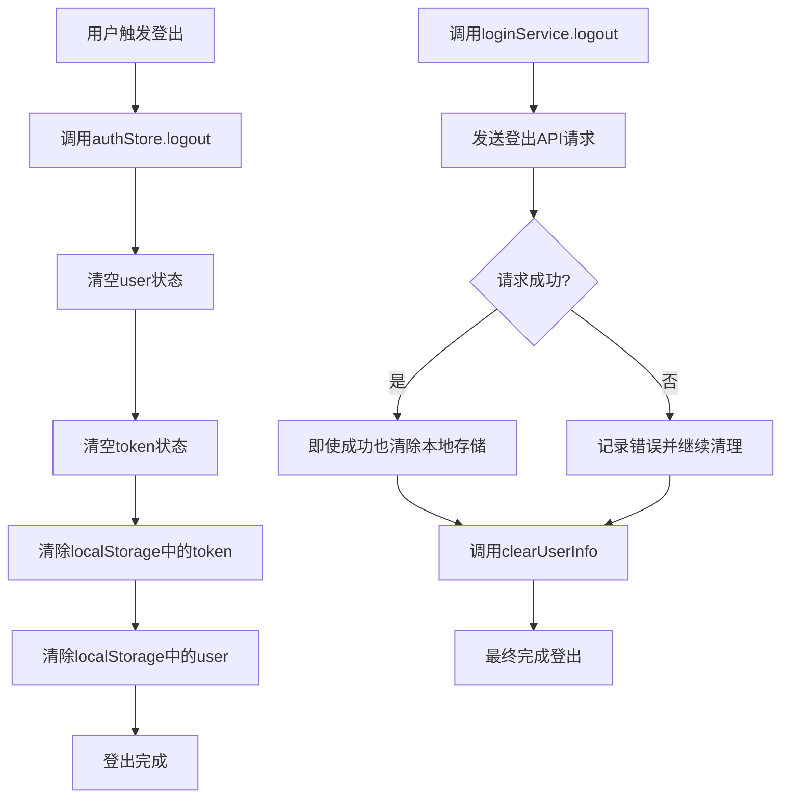
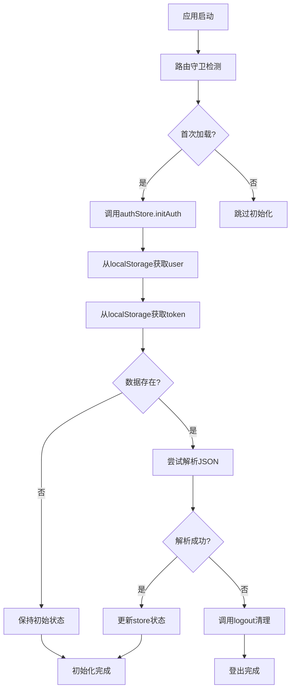
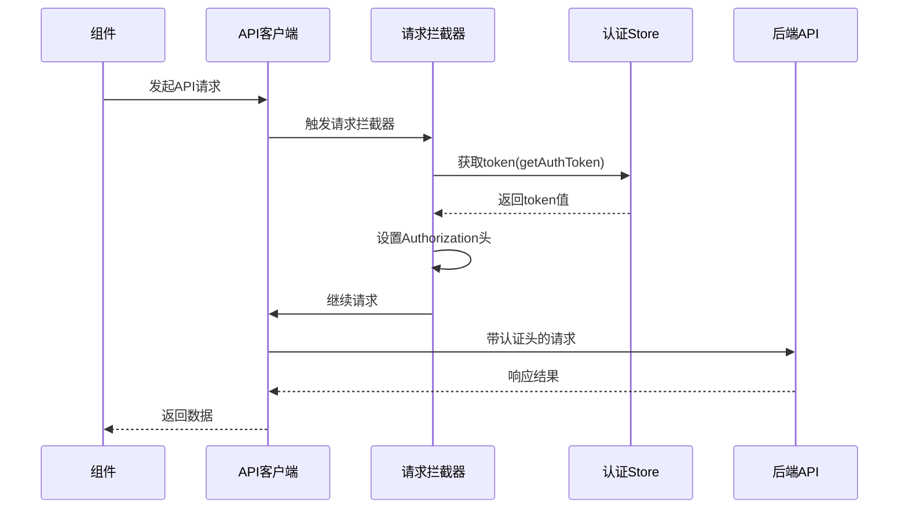
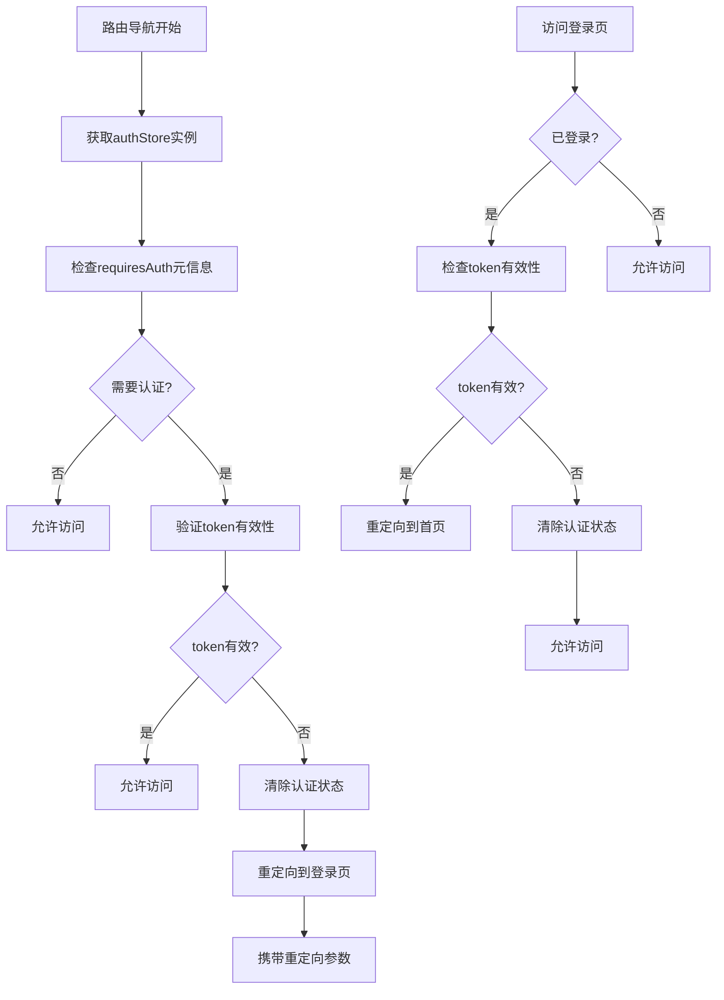
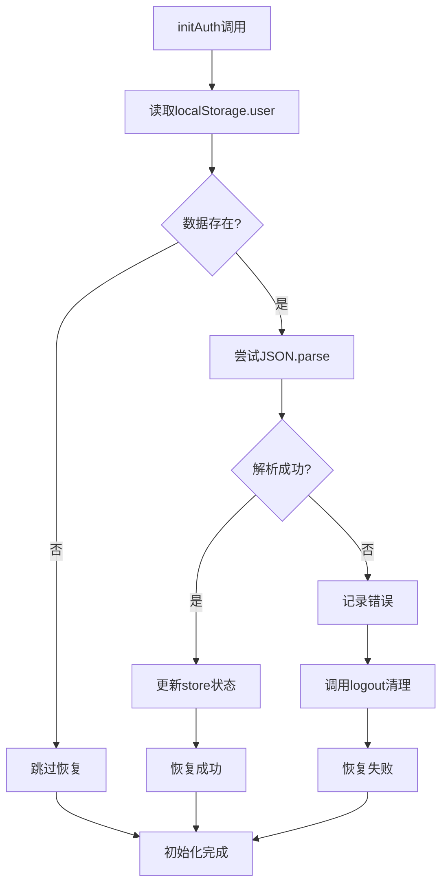

# 认证状态管理

<cite>
**本文档中引用的文件**
- [src/stores/auth.ts](file://src/stores/auth.ts)
- [src/services/loginService.ts](file://src/services/loginService.ts)
- [src/router/index.ts](file://src/router/index.ts)
- [src/views/LoginView.vue](file://src/views/LoginView.vue)
- [src/api/apiFactory.ts](file://src/api/apiFactory.ts)
- [src/api/apiConfig.ts](file://src/api/apiConfig.ts)
- [src/main.ts](file://src/main.ts)
- [src/types/index.ts](file://src/types/index.ts)
</cite>

## 目录
1. [简介](#简介)
2. [项目架构概览](#项目架构概览)
3. [认证状态数据结构](#认证状态数据结构)
4. [核心认证方法实现](#核心认证方法实现)
5. [与API拦截器的集成](#与api拦截器的集成)
6. [路由守卫集成](#路由守卫集成)
7. [组件中使用认证store](#组件中使用认证store)
8. [常见认证问题及解决方案](#常见认证问题及解决方案)
9. [最佳实践建议](#最佳实践建议)

## 简介

本系统采用基于Pinia的状态管理方案实现用户认证功能，通过集中化的auth store管理用户的登录状态、token信息和用户数据。该认证系统具备完整的登录、登出、token刷新和状态持久化功能，同时与API拦截器和路由守卫深度集成，确保应用的安全性和用户体验。

## 项目架构概览

系统的认证架构采用分层设计，主要包含以下核心组件：



**图表来源**
- [src/stores/auth.ts](file://src/stores/auth.ts#L1-L76)
- [src/services/loginService.ts](file://src/services/loginService.ts#L1-L283)
- [src/router/index.ts](file://src/router/index.ts#L1-L118)

## 认证状态数据结构

### UserInfo接口定义

系统定义了标准化的用户信息接口，包含认证所需的核心字段：



**图表来源**
- [src/stores/auth.ts](file://src/stores/auth.ts#L5-L12)

### 状态字段详解

| 字段名 | 类型 | 描述 | 初始化方式 |
|--------|------|------|------------|
| `user` | `UserInfo \| null` | 当前登录用户信息 | 从localStorage恢复或null |
| `token` | `string \| null` | JWT访问令牌 | 从localStorage.getItem('token') |
| `isLoggedIn` | `ComputedRef<boolean>` | 登录状态计算属性 | `!!token.value` |

**章节来源**
- [src/stores/auth.ts](file://src/stores/auth.ts#L16-L18)

## 核心认证方法实现

### 登录流程

登录过程包含多个步骤，确保安全性和数据一致性：



**图表来源**
- [src/views/LoginView.vue](file://src/views/LoginView.vue#L71-L95)
- [src/services/loginService.ts](file://src/services/loginService.ts#L85-L107)

### 登出流程

登出操作清理所有认证相关数据：



**图表来源**
- [src/stores/auth.ts](file://src/stores/auth.ts#L33-L40)
- [src/services/loginService.ts](file://src/services/loginService.ts#L114-L122)

### 初始化认证

系统启动时自动恢复之前的认证状态：



**图表来源**
- [src/stores/auth.ts](file://src/stores/auth.ts#L43-L55)
- [src/router/index.ts](file://src/router/index.ts#L85-L88)

**章节来源**
- [src/stores/auth.ts](file://src/stores/auth.ts#L21-L74)

## 与API拦截器的集成

### 请求拦截器配置

系统通过API工厂函数配置全局请求拦截器，自动添加认证头：



**图表来源**
- [src/api/apiFactory.ts](file://src/api/apiFactory.ts#L100-L107)

### 响应拦截器处理

响应拦截器负责处理认证相关的HTTP状态码：

| HTTP状态码 | 处理逻辑 | 用户体验 |
|------------|----------|----------|
| 401 | 清除token，跳转登录页 | 显示"登录已过期，请重新登录" |
| 403 | 权限不足提示 | 显示"没有权限访问该资源" |
| 500 | 服务器错误提示 | 显示"服务器内部错误" |

**章节来源**
- [src/api/apiFactory.ts](file://src/api/apiFactory.ts#L147-L202)

## 路由守卫集成

### 路由守卫架构

路由守卫确保只有认证用户才能访问受保护的路由：



**图表来源**
- [src/router/index.ts](file://src/router/index.ts#L78-L111)

### 路由守卫配置

| 路由名称 | requiresAuth | 重定向行为 |
|----------|--------------|------------|
| Login | false | 无 |
| GasModule | false | 无 |
| WaterSupply | false | 无 |
| MapView | false | 无 |

**章节来源**
- [src/router/index.ts](file://src/router/index.ts#L14-L70)

## 组件中使用认证store

### 基本使用模式

在Vue组件中使用认证store的标准模式：

```typescript
// 组件中使用认证store的示例路径
// 参考: [src/views/LoginView.vue](file://src/views/LoginView.vue#L37-L44)
```

### 监听认证状态变化

组件可以通过多种方式监听认证状态变化：

```typescript
// 监听登录状态变化的示例路径
// 参考: [src/stores/auth.ts](file://src/stores/auth.ts#L18)
```

### 认证状态在组件中的应用

| 应用场景 | 使用方式 | 示例代码路径 |
|----------|----------|--------------|
| 显示用户名 | `authStore.user?.username` | [src/views/LoginView.vue](file://src/views/LoginView.vue#L79-L82) |
| 控制显示/隐藏 | `authStore.isLoggedIn` | [src/router/index.ts](file://src/router/index.ts#L99-L104) |
| 权限控制 | `authStore.user?.roles` | [src/services/loginService.ts](file://src/services/loginService.ts#L257-L271) |

**章节来源**
- [src/views/LoginView.vue](file://src/views/LoginView.vue#L37-L44)

## 常见认证问题及解决方案

### Token过期处理

#### 问题描述
当JWT token过期时，系统需要优雅地处理认证失效情况。

#### 解决方案
1. **自动检测机制**：通过响应拦截器检测401状态码
2. **自动登出**：清除本地存储的token和用户信息
3. **用户体验**：跳转到登录页面并显示友好提示

```mermaid
flowchart TD
A[API请求] --> B[收到401响应]
B --> C[响应拦截器处理]
C --> D[清除localStorage.token]
D --> E[跳转到登录页]
E --> F[显示"登录已过期"提示]
F --> G[用户重新登录]
```

**图表来源**
- [src/api/apiFactory.ts](file://src/api/apiFactory.ts#L154-L157)

### 登录状态恢复失败

#### 问题描述
从localStorage恢复认证状态时可能遇到JSON解析错误。

#### 解决方案
系统提供完善的错误处理机制：



**图表来源**
- [src/stores/auth.ts](file://src/stores/auth.ts#L47-L55)

### RSA加密问题

#### 问题描述
密码传输过程中需要RSA公钥加密，可能出现公钥获取失败的情况。

#### 解决方案
1. **延迟获取**：在需要加密时动态获取公钥
2. **错误处理**：提供友好的错误提示
3. **降级策略**：确保系统在加密失败时仍能正常运行

**章节来源**
- [src/services/loginService.ts](file://src/services/loginService.ts#L17-L32)
- [src/services/loginService.ts](file://src/services/loginService.ts#L257-L271)

## 最佳实践建议

### 安全性建议

1. **Token存储**：使用localStorage存储token，便于跨会话保持登录状态
2. **加密传输**：密码传输前使用RSA公钥加密
3. **自动清理**：登出时立即清除所有认证相关数据
4. **错误处理**：提供详细的错误信息但避免泄露敏感数据

### 性能优化建议

1. **懒加载**：认证相关的组件和服务按需加载
2. **缓存策略**：合理利用localStorage减少重复请求
3. **状态同步**：确保store状态与localStorage保持同步

### 可维护性建议

1. **模块化设计**：将认证逻辑分离到独立的服务类中
2. **类型安全**：使用TypeScript确保类型安全
3. **错误边界**：在关键位置设置错误边界
4. **日志记录**：记录重要的认证事件便于调试

### 扩展性建议

1. **多模块支持**：支持不同的业务模块认证
2. **第三方集成**：预留第三方认证集成接口
3. **多租户支持**：为多租户架构做好准备
4. **国际化支持**：提供多语言错误提示