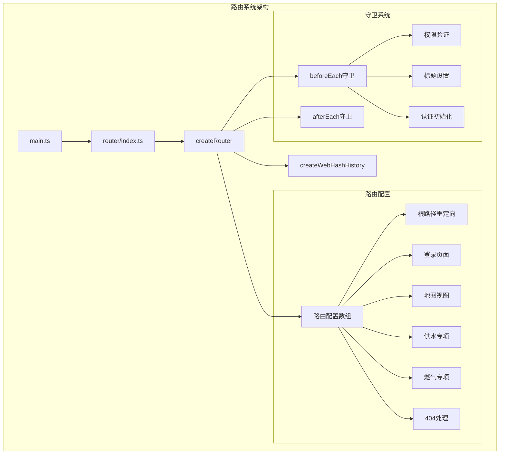
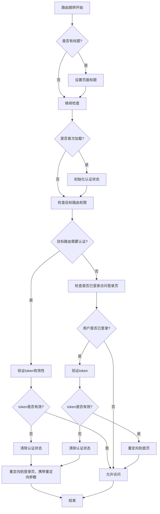
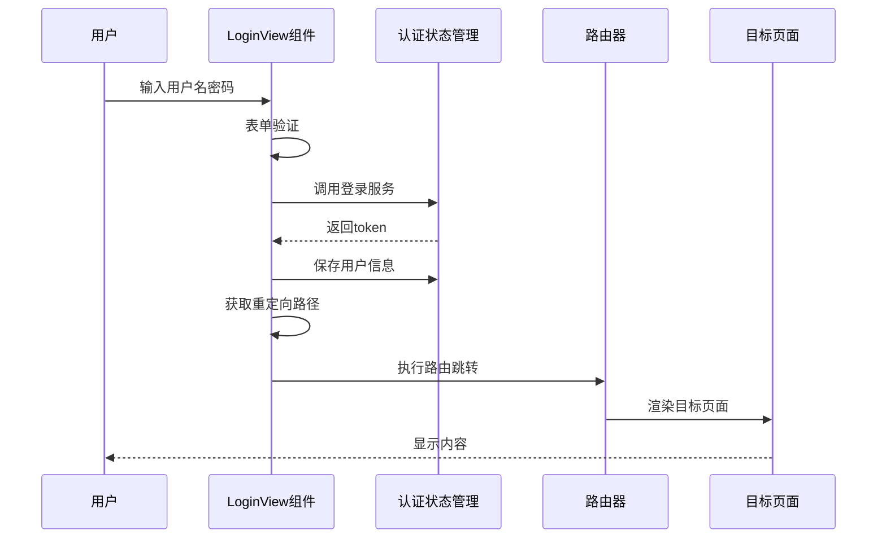
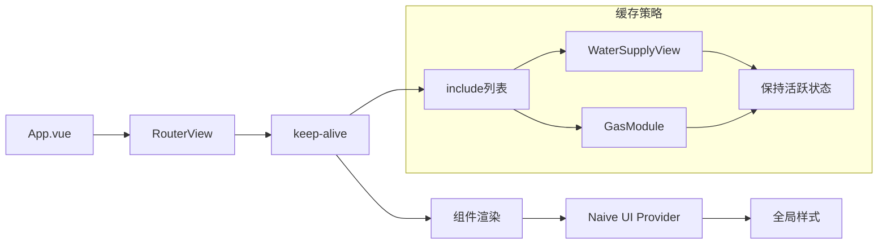
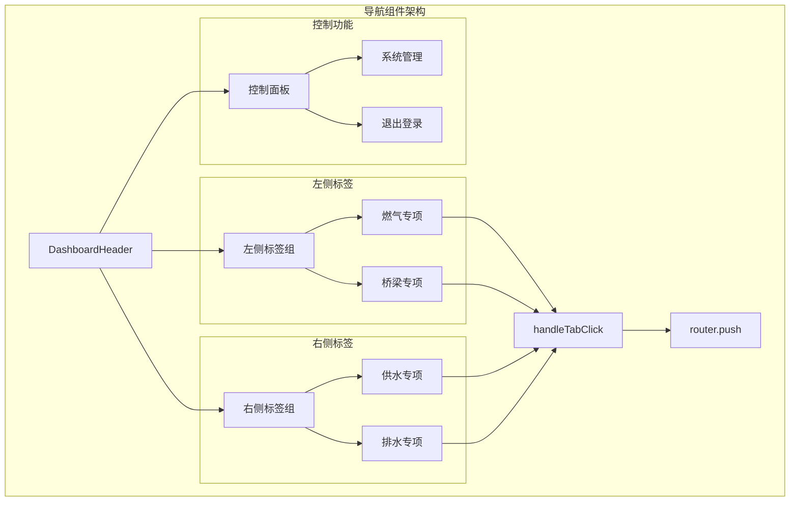

# 路由与导航

<cite>
**本文档中引用的文件**
- [src/router/index.ts](file://src/router/index.ts)
- [src/views/LoginView.vue](file://src/views/LoginView.vue)
- [src/App.vue](file://src/App.vue)
- [src/stores/auth.ts](file://src/stores/auth.ts)
- [src/main.ts](file://src/main.ts)
- [src/components/DashboardHeader.vue](file://src/components/DashboardHeader.vue)
- [src/views/WaterSupply/index.vue](file://src/views/WaterSupply/index.vue)
- [src/views/gasModule/index.vue](file://src/views/gasModule/index.vue)
</cite>

## 目录
1. [项目概述](#项目概述)
2. [路由配置架构](#路由配置架构)
3. [核心路由定义](#核心路由定义)
4. [路由守卫与权限控制](#路由守卫与权限控制)
5. [登录重定向机制](#登录重定向机制)
6. [App.vue路由视图渲染](#appvue路由视图渲染)
7. [动态路由与查询参数](#动态路由与查询参数)
8. [导航组件与路由跳转](#导航组件与路由跳转)
9. [keep-alive缓存策略](#keep-alive缓策略)
10. [最佳实践与优化建议](#最佳实践与优化建议)

## 项目概述

本政府dashboard项目采用Vue 3 + TypeScript + Vue Router构建现代化的单页应用，提供了完整的路由导航系统。系统包含燃气专项、供水专项等多个业务模块，通过精心设计的路由架构实现了高效的页面管理和权限控制。

### 技术栈特点
- **Vue 3 Composition API**: 使用setup语法糖和响应式API
- **TypeScript**: 强类型支持和更好的开发体验
- **Vue Router 4**: 基于历史模式的路由管理
- **Pinia状态管理**: 统一的状态管理方案
- **Naive UI**: 企业级UI组件库

## 路由配置架构

### 路由器初始化



**图表来源**
- [src/main.ts](file://src/main.ts#L19-L23)
- [src/router/index.ts](file://src/router/index.ts#L73-L76)

### 路由表结构

系统路由表采用TypeScript接口定义，确保类型安全和开发效率：

| 路由路径 | 名称 | 组件 | 权限要求 | 页面标题 |
|---------|------|------|----------|----------|
| `/` | 首页重定向 | 无 | 无需认证 | 无 |
| `/login` | Login | LoginView | 无需认证 | 登录 - 安全综合检测预警平台 |
| `/mapView` | mapView | MapView | 无需认证 | 无 |
| `/waterProject` | waterProject | WaterSupplyView | 无需认证 | 供水专项 |
| `/gas` | gas | GasModule | 无需认证 | 燃气专项 |
| `/:pathMatch(.*)*` | NotFound | 重定向到首页 | 无 | 404错误 |

**节来源**
- [src/router/index.ts](file://src/router/index.ts#L8-L70)

## 核心路由定义

### 根路径重定向

系统默认重定向到燃气专项模块，提供灵活的入口点选择：

```typescript
// 根路径重定向配置
{
  path: '/',
  redirect: '/gas' // 或 '/bridge'，按需选择
}
```

### 登录页面路由

登录页面配置了详细的元信息，包括标题和认证要求：

```typescript
{
  path: '/login',
  name: 'Login',
  component: LoginView,
  meta: {
    requiresAuth: false,
    title: '登录 - 安全综合检测预警平台'
  }
}
```

### 业务模块路由

#### 燃气专项模块
- **组件**: GasModule
- **标题**: 燃气专项
- **权限**: 无需认证
- **特点**: 使用Cesium地图组件，支持三维可视化

#### 供水专项模块
- **组件**: WaterSupplyView
- **标题**: 供水专项
- **权限**: 无需认证
- **特点**: 响应式布局，支持多屏适配

**节来源**
- [src/router/index.ts](file://src/router/index.ts#L9-L70)

## 路由守卫与权限控制

### beforeEach守卫实现

系统实现了完整的前置守卫机制，确保路由访问的安全性和用户体验：



**图表来源**
- [src/router/index.ts](file://src/router/index.ts#L78-L111)

### 权限控制逻辑

#### 认证状态检查
- **首次加载**: 自动初始化认证状态
- **token验证**: 调用authStore.validateToken()检查令牌有效性
- **自动登出**: 无效token时自动清除认证信息

#### 路由权限分类
- **公开路由**: `/login`, `/mapView`, `/waterProject`, `/gas`
- **受限路由**: 需要认证才能访问的页面（预留扩展）

**节来源**
- [src/router/index.ts](file://src/router/index.ts#L78-L111)
- [src/stores/auth.ts](file://src/stores/auth.ts#L58-L62)

## 登录重定向机制

### LoginView组件重定向逻辑

登录成功后，系统会根据查询参数进行智能重定向：



**图表来源**
- [src/views/LoginView.vue](file://src/views/LoginView.vue#L71-L91)

### 重定向参数处理

系统通过查询参数传递重定向信息：
- **参数名称**: `redirect`
- **默认值**: `'/'`（首页）
- **来源**: 路由守卫自动添加

**节来源**
- [src/views/LoginView.vue](file://src/views/LoginView.vue#L71-L91)

## App.vue路由视图渲染

### RouterView组件配置

App.vue中使用了高级的RouterView配置，结合keep-alive实现智能缓存：



**图表来源**
- [src/App.vue](file://src/App.vue#L16-L19)

### keep-alive缓存策略

#### 缓存范围
- **WaterSupplyView**: 供水专项模块
- **GasModule**: 燃气专项模块

#### 缓存优势
- **性能提升**: 避免重复渲染，减少资源消耗
- **状态保持**: 组件内部状态得以保留
- **用户体验**: 快速切换，流畅体验

**节来源**
- [src/App.vue](file://src/App.vue#L16-L19)

## 动态路由与查询参数

### 路由参数使用示例

虽然当前项目主要使用静态路由，但系统架构支持动态路由扩展：

#### 查询参数传递
```typescript
// DashboardHeader.vue中的路由跳转示例
const handleTabClick = (path) => {
  activeTab.value = path;
  router.push(path); // 支持查询参数传递
};
```

#### 参数接收示例
```typescript
// 在目标组件中接收参数
import { useRoute } from 'vue-router';

const route = useRoute();
const moduleId = route.query.moduleId; // 获取查询参数
```

### URL参数监听

ResponsiveWrapper组件实现了URL参数变化的监听机制：

```typescript
// 监听URL变化
const observer = new MutationObserver(watchUrlParams);
observer.observe(document, { subtree: true, childList: true });
```

**节来源**
- [src/components/DashboardHeader.vue](file://src/components/DashboardHeader.vue#L76-L81)
- [src/components/ResponsiveWrapper.vue](file://src/components/ResponsiveWrapper.vue#L121-L123)

## 导航组件与路由跳转

### DashboardHeader导航组件

头部导航组件提供了直观的模块切换功能：



**图表来源**
- [src/components/DashboardHeader.vue](file://src/components/DashboardHeader.vue#L1-L50)

### 导航事件处理

#### 标签点击事件
```typescript
const handleTabClick = (path) => {
  activeTab.value = path;
  router.push(path);
};
```

#### 退出登录事件
```typescript
const handleLogout = () => {
  localStorage.removeItem("token");
  router.push("/login");
};
```

**节来源**
- [src/components/DashboardHeader.vue](file://src/components/DashboardHeader.vue#L76-L101)

## keep-alive缓存策略

### 缓存配置详解

系统采用精确的组件名称匹配实现智能缓存：

#### include配置
```typescript
<keep-alive :include="['WaterSupplyView', 'GasModule']">
  <component :is="Component" />
</keep-alive>
```

#### 缓存生命周期
- **激活**: 组件首次加载或从缓存中恢复
- **失活**: 切换到其他路由
- **销毁**: 组件被明确移除

### 缓存优化策略

#### 组件命名规范
每个需要缓存的组件都定义了明确的name选项：

```typescript
// WaterSupplyView组件示例
defineOptions({
  name: 'WaterSupplyView'
});

// GasModule组件示例
defineOptions({
  name: "GasModule"
});
```

#### 性能监控
系统在afterEach守卫中记录路由跳转日志：

```typescript
router.afterEach((to, from) => {
  console.log(`路由跳转: ${from.path} -> ${to.path}`);
});
```

**节来源**
- [src/views/WaterSupply/index.vue](file://src/views/WaterSupply/index.vue#L67-L68)
- [src/views/gasModule/index.vue](file://src/views/gasModule/index.vue#L36-L37)
- [src/router/index.ts](file://src/router/index.ts#L114-L116)

## 最佳实践与优化建议

### 路由设计原则

1. **语义化路由**: 使用清晰的路径命名
2. **权限分离**: 明确区分公开和受保护路由
3. **SEO友好**: 为重要页面设置标题
4. **用户体验**: 提供合理的重定向机制

### 性能优化建议

1. **懒加载**: 对大型模块实施路由懒加载
2. **缓存策略**: 合理使用keep-alive缓存
3. **预加载**: 在空闲时间预加载关键资源
4. **代码分割**: 实施模块化打包策略

### 安全考虑

1. **token管理**: 实现安全的token存储和验证
2. **权限控制**: 基于角色的访问控制
3. **CSRF防护**: 实施适当的跨站请求伪造防护
4. **审计日志**: 记录重要的路由访问行为

### 扩展性设计

1. **插件化架构**: 支持动态添加新的业务模块
2. **配置驱动**: 通过配置文件管理路由规则
3. **中间件模式**: 实现可插拔的路由中间件
4. **版本兼容**: 保证路由系统的向后兼容性

通过以上完善的路由与导航系统，项目实现了高效、安全、易维护的单页应用架构，为政府dashboard提供了坚实的技术基础。