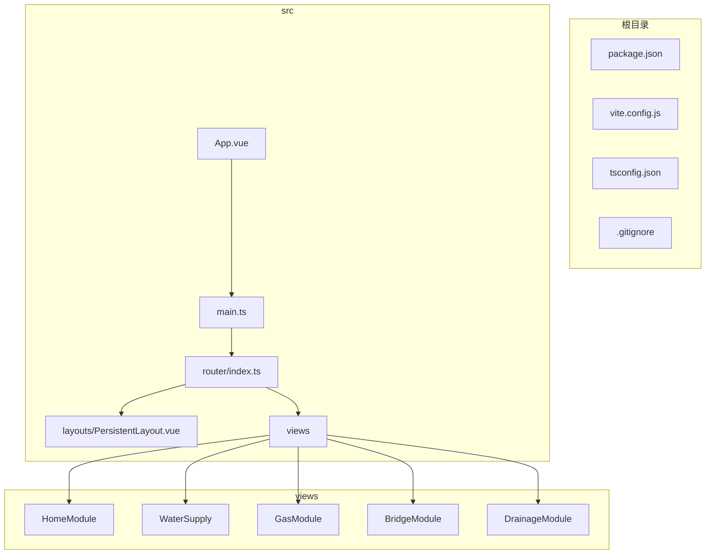
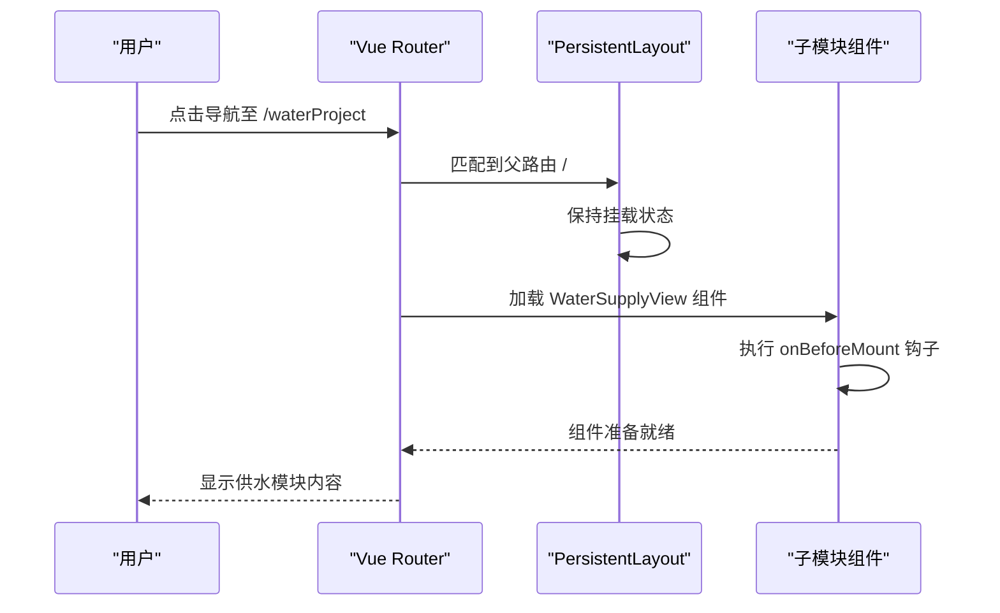
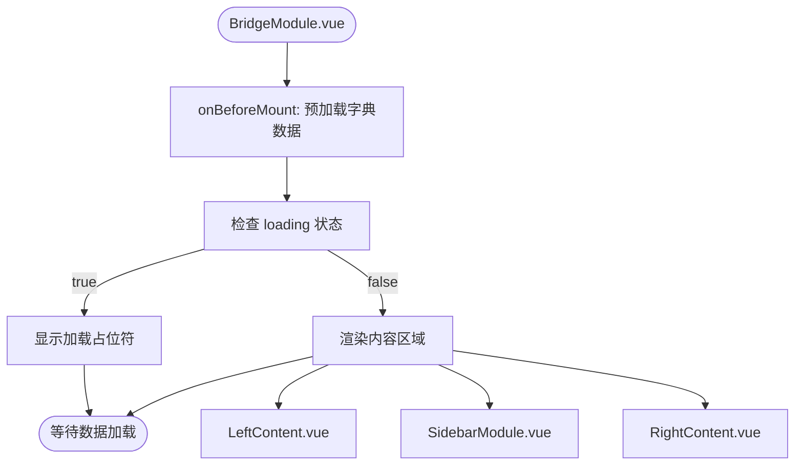
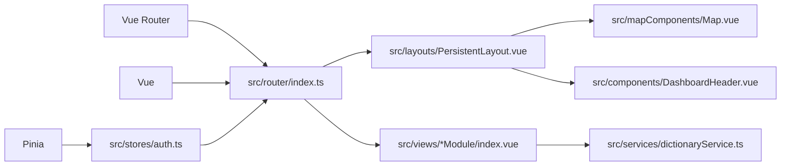

# 嵌套路由配置

<cite>
**本文档引用文件**   
- [index.ts](file://src/router/index.ts)
- [PersistentLayout.vue](file://src/layouts/PersistentLayout.vue)
- [App.vue](file://src/App.vue)
- [main.ts](file://src/main.ts)
- [WaterSupply/index.vue](file://src/views/WaterSupply/index.vue)
- [GasModule/index.vue](file://src/views/GasModule/index.vue)
- [BridgeModule/index.vue](file://src/views/BridgeModule/index.vue)
- [HomeModule/index.vue](file://src/views/HomeModule/index.vue)
- [DrainageModule/index.vue](file://src/views/DrainageModule/index.vue)
</cite>

## 目录
1. [简介](#简介)
2. [项目结构](#项目结构)
3. [核心组件](#核心组件)
4. [架构概述](#架构概述)
5. [详细组件分析](#详细组件分析)
6. [依赖分析](#依赖分析)
7. [性能考虑](#性能考虑)
8. [故障排除指南](#故障排除指南)
9. [结论](#结论)

## 简介
本项目为政府综合检测预警平台，采用Vue 3与Vue Router实现前端路由管理。系统通过嵌套路由设计，实现了持久化布局，确保在模块切换时地图和头部导航等核心组件保持稳定，不被重新渲染。项目包含多个业务模块，如供水、燃气、桥梁、排水和综合态势，每个模块均通过子路由组织其内部功能组件。

## 项目结构
项目采用模块化设计，主要分为以下几个部分：
- `public/`: 静态资源，包含Cesium地图库及其相关资源。
- `src/`: 源代码目录。
  - `assets/`: 项目静态资源，如样式、字体和图片。
  - `components/`: 全局可复用的UI组件。
  - `config/`: 项目配置文件。
  - `hook/`: 自定义组合式函数。
  - `layouts/`: 页面布局组件。
  - `mapComponents/`: 地图相关组件。
  - `router/`: 路由配置。
  - `services/`: API服务调用。
  - `stores/`: Pinia状态管理。
  - `types/`: TypeScript类型定义。
  - `views/`: 视图组件，按业务模块组织。
- 根目录包含构建和依赖管理配置文件。



**图示来源**
- [main.ts](file://src/main.ts#L1-L30)
- [App.vue](file://src/App.vue#L1-L159)
- [index.ts](file://src/router/index.ts#L1-L136)

**本节来源**
- [项目结构](file://workspace_path)

## 核心组件
路由系统的核心在于`src/router/index.ts`中的路由配置。该配置定义了两种布局：
1.  **独立布局**: 用于登录页(`/login`)，不包含持久化布局。
2.  **持久化布局**: 用于所有业务模块，其父路由`/`使用`PersistentLayout.vue`作为组件，并通过`children`属性定义了多个子路由。

每个业务模块（如`WaterSupplyView`, `GasModule`）都是一个独立的Vue组件，作为子路由的`component`。当用户在不同模块间切换时，`PersistentLayout.vue`保持挂载状态，只有`<router-view>`内的内容会被更新。

**本节来源**
- [index.ts](file://src/router/index.ts#L1-L136)
- [PersistentLayout.vue](file://src/layouts/PersistentLayout.vue#L1-L55)

## 架构概述
系统的路由架构采用“父-子”嵌套模式，实现了布局的持久化。

```mermaid
graph TD
A[/] --> B[PersistentLayout.vue]
A --> C[/login]
C --> D[LoginView.vue]
B --> E[/home]
B --> F[/waterProject]
B --> G[/gas]
B --> H[/bridge]
B --> I[/drainage]
E --> J[HomeModule.vue]
F --> K[WaterSupplyView.vue]
G --> L[GasModule.vue]
H --> M[BridgeModule.vue]
I --> N[DrainageModule.vue]
subgraph "持久化层"
B
end
subgraph "动态更新层"
J
K
L
M
N
end
```

**图示来源**
- [index.ts](file://src/router/index.ts#L1-L136)
- [PersistentLayout.vue](file://src/layouts/PersistentLayout.vue#L1-L55)

## 详细组件分析

### 持久化布局组件分析
`PersistentLayout.vue`是实现嵌套路由持久化的核心。它通过以下方式工作：
1.  **固定组件**: `<CesiumMap>`和`<DashboardHeader>`被直接放置在模板中，不会随路由变化而销毁。
2.  **动态出口**: 使用`<router-view>`作为子路由的渲染出口。
3.  **强制刷新**: 通过`:key="route.fullPath"`确保子组件在路由参数变化时能被重新创建，避免状态残留。

#### 对于API/服务组件：


**图示来源**
- [PersistentLayout.vue](file://src/layouts/PersistentLayout.vue#L1-L55)
- [WaterSupply/index.vue](file://src/views/WaterSupply/index.vue#L1-L99)

**本节来源**
- [PersistentLayout.vue](file://src/layouts/PersistentLayout.vue#L1-L55)
- [WaterSupply/index.vue](file://src/views/WaterSupply/index.vue#L1-L99)

### 业务模块组件分析
以`BridgeModule`为例，其内部结构展示了子路由组件的典型模式。

#### 对于复杂逻辑组件：


**图示来源**
- [BridgeModule/index.vue](file://src/views/BridgeModule/index.vue#L1-L79)
- [BridgeModule/leftContent.vue](file://src/views/BridgeModule/leftContent.vue#L1-L32)
- [BridgeModule/rightContent.vue](file://src/views/BridgeModule/rightContent.vue#L1-L32)

**本节来源**
- [BridgeModule/index.vue](file://src/views/BridgeModule/index.vue#L1-L79)
- [BridgeModule/leftContent.vue](file://src/views/BridgeModule/leftContent.vue#L1-L32)
- [BridgeModule/rightContent.vue](file://src/views/BridgeModule/rightContent.vue#L1-L32)

## 依赖分析
项目的路由功能依赖于多个核心库和内部模块。



**图示来源**
- [index.ts](file://src/router/index.ts#L1-L136)
- [main.ts](file://src/main.ts#L1-L30)
- [package.json](file://package.json#L1-L10)

**本节来源**
- [index.ts](file://src/router/index.ts#L1-L136)
- [main.ts](file://src/main.ts#L1-L30)
- [package.json](file://package.json#L1-L10)

## 性能考虑
嵌套路由的持久化设计显著提升了用户体验和性能：
- **减少重绘**: 地图和头部组件不会因路由切换而重新渲染，避免了昂贵的Cesium地图初始化开销。
- **状态保持**: 用户在模块间切换时，地图视角、图层状态等信息得以保留。
- **预加载优化**: 各模块在`onBeforeMount`钩子中预加载所需字典数据，确保组件渲染时数据就绪。

## 故障排除指南
在开发和维护嵌套路由时，可能遇到以下问题：
- **子组件未更新**: 检查`PersistentLayout.vue`中`<router-view>`的`:key`是否绑定到`route.fullPath`。
- **权限验证失败**: 确保`router.beforeEach`守卫中的`authStore.validateToken()`逻辑正确，并正确处理跳转。
- **样式冲突**: 由于全局样式在`App.vue`中定义，需注意子组件的样式作用域，避免意外覆盖。

**本节来源**
- [index.ts](file://src/router/index.ts#L96-L134)
- [App.vue](file://src/App.vue#L31-L158)

## 结论
该项目的嵌套路由配置设计精良，通过`PersistentLayout.vue`作为父路由组件，成功实现了地图和导航的持久化。这种架构不仅提升了应用性能，也优化了用户体验。各业务模块作为子路由被清晰地组织起来，代码结构清晰，易于维护和扩展。路由守卫确保了应用的安全性，而模块化的组件设计则保证了代码的可复用性。