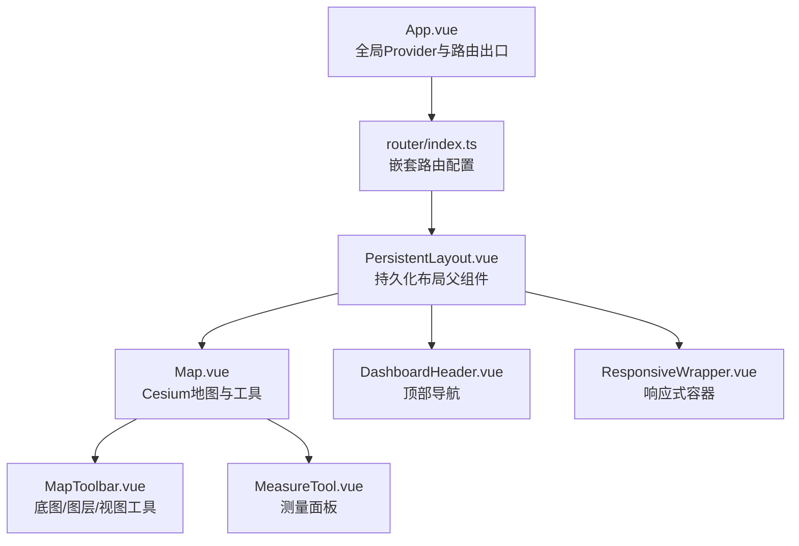
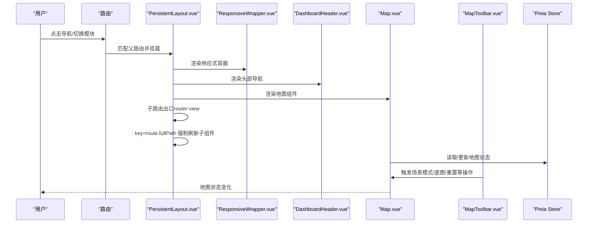
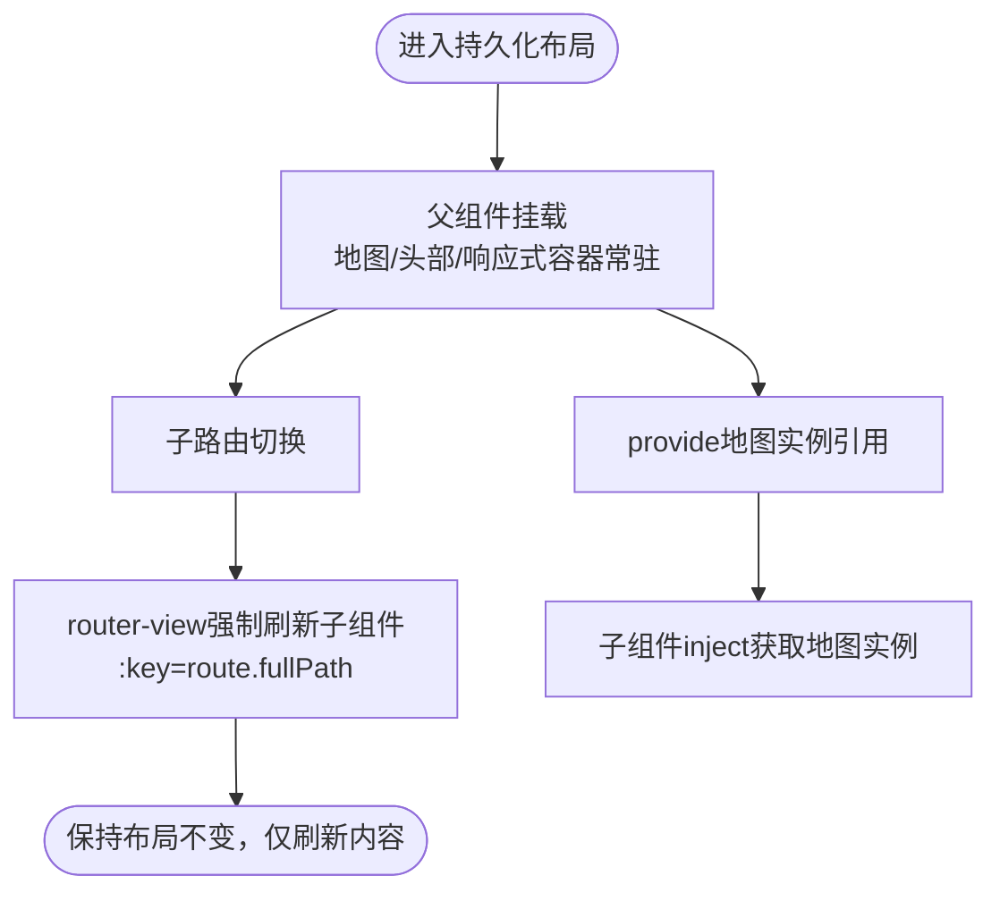
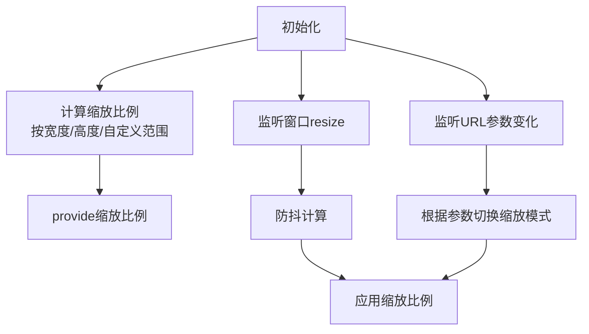
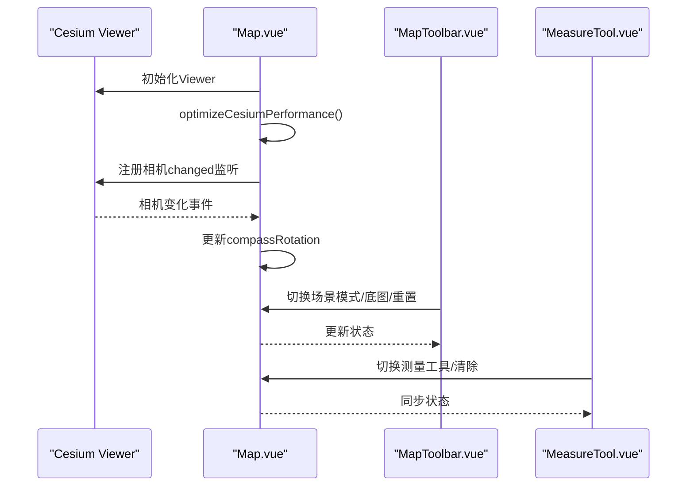
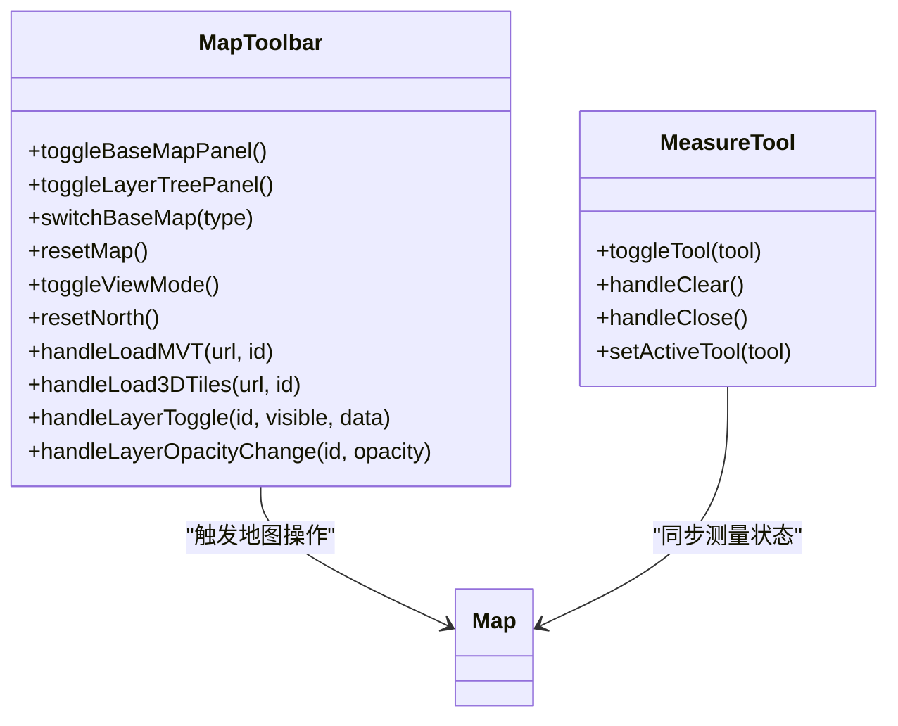
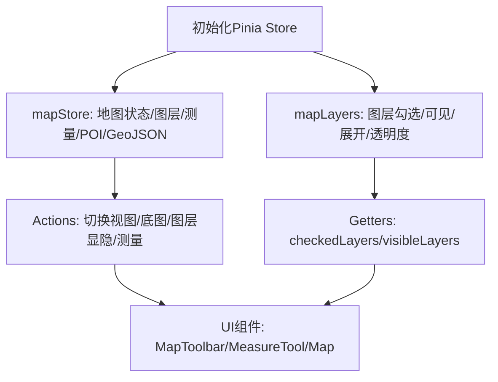
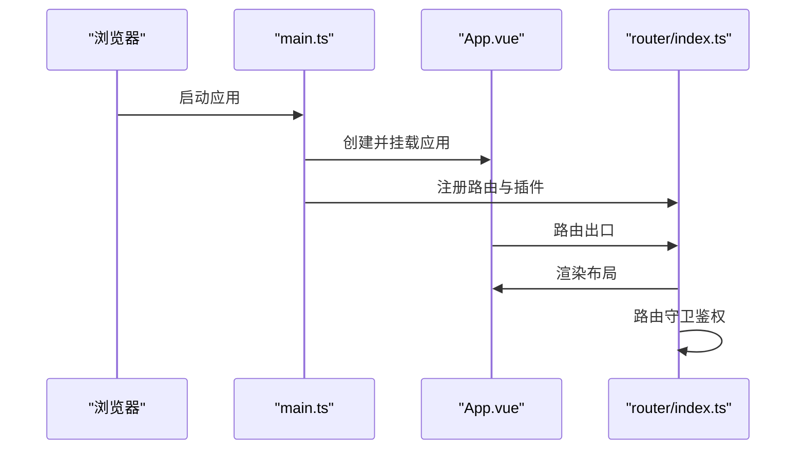
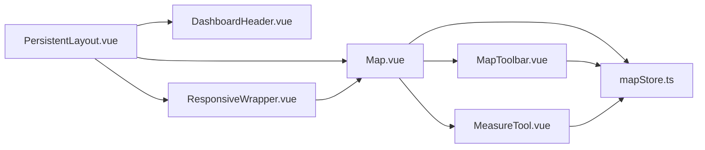

# 持久化布局

<cite>
**本文引用的文件**
- [PersistentLayout.vue](file://src/layouts/PersistentLayout.vue)
- [router/index.ts](file://src/router/index.ts)
- [App.vue](file://src/App.vue)
- [ResponsiveWrapper.vue](file://src/components/ResponsiveWrapper.vue)
- [DashboardHeader.vue](file://src/components/DashboardHeader.vue)
- [Map.vue](file://src/mapComponents/Map.vue)
- [MapToolbar.vue](file://src/mapComponents/MapToolbar.vue)
- [MeasureTool.vue](file://src/mapComponents/MeasureTool.vue)
- [mapStore.ts](file://src/stores/mapStore.ts)
- [mapLayers.ts](file://src/stores/mapLayers.ts)
- [mapConfig.ts](file://src/config/mapConfig.ts)
- [main.ts](file://src/main.ts)
- [package.json](file://package.json)
</cite>

## 目录
1. [简介](#简介)
2. [项目结构](#项目结构)
3. [核心组件](#核心组件)
4. [架构总览](#架构总览)
5. [详细组件分析](#详细组件分析)
6. [依赖关系分析](#依赖关系分析)
7. [性能考量](#性能考量)
8. [故障排查指南](#故障排查指南)
9. [结论](#结论)
10. [附录](#附录)

## 简介
本文件围绕“持久化布局”主题，系统梳理政府dashboard项目中地图与头部导航在路由切换时保持不变的设计与实现。该布局通过嵌套路由将地图、头部与响应式容器作为父级持久化组件，子路由内容在不销毁父级的前提下动态刷新，从而在多模块切换时维持地图状态与交互体验的连续性。

## 项目结构
- 应用入口与全局配置位于根目录，应用通过根组件承载全局UI Provider，并通过路由出口承载布局。
- 持久化布局组件作为嵌套路由的父级，内部包含地图、头部与响应式容器，子路由内容通过router-view渲染。
- 地图组件负责底图、3D Tiles、测量等核心能力；工具栏与测量面板提供交互入口；Pinia状态管理贯穿地图状态、图层树与POI/GeoJSON等数据。

图表来源
- [App.vue](file://src/App.vue#L1-L30)
- [router/index.ts](file://src/router/index.ts#L1-L95)
- [PersistentLayout.vue](file://src/layouts/PersistentLayout.vue#L1-L32)
- [Map.vue](file://src/mapComponents/Map.vue#L1-L67)
- [DashboardHeader.vue](file://src/components/DashboardHeader.vue#L1-L53)
- [ResponsiveWrapper.vue](file://src/components/ResponsiveWrapper.vue#L1-L20)
- [MapToolbar.vue](file://src/mapComponents/MapToolbar.vue#L1-L40)
- [MeasureTool.vue](file://src/mapComponents/MeasureTool.vue#L1-L20)

章节来源
- [App.vue](file://src/App.vue#L1-L30)
- [router/index.ts](file://src/router/index.ts#L1-L95)

## 核心组件
- 持久化布局父组件：负责将地图、头部与响应式容器作为持久化层，子路由内容通过router-view按需刷新。
- 响应式容器：提供基于基准宽高的缩放策略，保证不同分辨率下的布局一致性。
- 地图组件：集成Cesium Viewer、底图切换、3D Tiles、测量工具与工具栏，提供相机控制、场景模式切换等功能。
- 工具栏与测量面板：提供底图切换、图层树、视图模式、指北针、测量工具等交互入口。
- Pinia状态管理：集中管理地图Viewer实例、图层树、测量、POI与GeoJSON等状态。

章节来源
- [PersistentLayout.vue](file://src/layouts/PersistentLayout.vue#L1-L32)
- [ResponsiveWrapper.vue](file://src/components/ResponsiveWrapper.vue#L1-L60)
- [Map.vue](file://src/mapComponents/Map.vue#L1-L120)
- [MapToolbar.vue](file://src/mapComponents/MapToolbar.vue#L1-L120)
- [MeasureTool.vue](file://src/mapComponents/MeasureTool.vue#L1-L60)
- [mapStore.ts](file://src/stores/mapStore.ts#L1-L120)

## 架构总览
持久化布局采用“嵌套路由 + provide/inject”的方式实现：
- 根组件承载全局Provider与路由出口。
- 父路由指向持久化布局组件，其内部包含地图、头部与响应式容器。
- 子路由通过router-view渲染，使用: key="route.fullPath"确保每次路由变化时子组件强制刷新，同时父级持久化组件保持不变。
- 地图组件通过provide向子组件暴露实例引用，便于子模块直接调用地图能力。

图表来源
- [router/index.ts](file://src/router/index.ts#L29-L81)
- [PersistentLayout.vue](file://src/layouts/PersistentLayout.vue#L18-L31)
- [Map.vue](file://src/mapComponents/Map.vue#L1-L67)
- [MapToolbar.vue](file://src/mapComponents/MapToolbar.vue#L1-L80)
- [mapStore.ts](file://src/stores/mapStore.ts#L1-L120)

## 详细组件分析

### 持久化布局组件（PersistentLayout.vue）
- 设计要点
  - 作为嵌套路由父组件，始终挂载，避免地图与头部在路由切换时销毁重建。
  - 通过provide向子组件注入地图实例引用，便于子模块直接调用地图能力。
  - 子路由内容通过router-view渲染，使用:key="route.fullPath"确保子组件在路由变化时强制刷新。
- 交互与状态
  - 与响应式容器配合，保证不同分辨率下布局一致。
  - 与地图组件配合，提供统一的地图交互入口与工具栏。

图表来源
- [PersistentLayout.vue](file://src/layouts/PersistentLayout.vue#L11-L31)

章节来源
- [PersistentLayout.vue](file://src/layouts/PersistentLayout.vue#L1-L32)

### 响应式容器（ResponsiveWrapper.vue）
- 功能概述
  - 基于基准宽高与窗口尺寸计算缩放比例，支持按宽度或高度缩放。
  - 通过provide向子组件暴露缩放比例，供地图与UI元素进行适配。
  - 监听窗口resize与URL参数变化，动态调整缩放策略。
- 交互要点
  - 通过scoped样式与深度选择器，确保地图区域可穿透交互，其他区域恢复鼠标事件。
  - 为工具栏、侧边模块等交互区域保留pointer-events。

图表来源
- [ResponsiveWrapper.vue](file://src/components/ResponsiveWrapper.vue#L60-L135)

章节来源
- [ResponsiveWrapper.vue](file://src/components/ResponsiveWrapper.vue#L1-L135)

### 地图组件（Map.vue）
- 能力概览
  - 集成Cesium Viewer，支持天地图底图、默认3D Tiles、测量工具等。
  - 提供场景模式切换（2D/3D）、底图切换、相机重置、指北针、默认3D Tiles显隐等。
  - 通过defineExpose导出地图实例与工具方法，供父组件与子组件调用。
- 性能优化
  - 关闭不必要的光照、雾、天空等效果，降低地形细节，启用请求渲染模式，减少CPU/GPU占用。
- 交互流程
  - onViewerReady中注册相机变化监听，更新指北针角度。
  - 加载阳新县边界GeoJSON，用于后续相机范围限制（注释掉的实现）。

图表来源
- [Map.vue](file://src/mapComponents/Map.vue#L277-L322)
- [MapToolbar.vue](file://src/mapComponents/MapToolbar.vue#L304-L349)
- [MeasureTool.vue](file://src/mapComponents/MeasureTool.vue#L103-L123)

章节来源
- [Map.vue](file://src/mapComponents/Map.vue#L1-L120)
- [Map.vue](file://src/mapComponents/Map.vue#L277-L322)
- [Map.vue](file://src/mapComponents/Map.vue#L440-L466)

### 工具栏与测量面板（MapToolbar.vue / MeasureTool.vue）
- 工具栏
  - 提供底图切换、图层树面板、2D/3D切换、指北针、测量工具、默认3D Tiles显隐等入口。
  - 与地图组件通信，触发场景模式、底图类型、相机重置等操作。
  - 与图层树组件协作，加载MVT/3D Tiles并控制显隐与透明度。
- 测量面板
  - 支持距离与面积测量工具切换与清除。
  - 提供拖拽定位与关闭面板的能力。

图表来源
- [MapToolbar.vue](file://src/mapComponents/MapToolbar.vue#L1-L120)
- [MeasureTool.vue](file://src/mapComponents/MeasureTool.vue#L1-L120)

章节来源
- [MapToolbar.vue](file://src/mapComponents/MapToolbar.vue#L1-L120)
- [MeasureTool.vue](file://src/mapComponents/MeasureTool.vue#L1-L120)

### Pinia状态管理（mapStore.ts / mapLayers.ts）
- 地图状态管理
  - 管理Cesium Viewer实例、地图状态（初始化、加载、视图模式、全屏）、图层状态（卫星、地形、标签、底图类型、自定义图层）、测量工具状态、POI数据与GeoJSON数据。
  - 提供重置与清理方法，确保在模块切换时可恢复初始状态。
- 图层树状态管理
  - 维护图层勾选、可见性、展开节点、透明度等状态，支持批量同步与初始化。
- 配置与环境
  - mapConfig提供地图中心、缩放、相机边界、天地图配置与样式资源等。

图表来源
- [mapStore.ts](file://src/stores/mapStore.ts#L1-L120)
- [mapLayers.ts](file://src/stores/mapLayers.ts#L1-L60)
- [mapConfig.ts](file://src/config/mapConfig.ts#L1-L55)

章节来源
- [mapStore.ts](file://src/stores/mapStore.ts#L1-L120)
- [mapLayers.ts](file://src/stores/mapLayers.ts#L1-L60)
- [mapConfig.ts](file://src/config/mapConfig.ts#L1-L55)

### 路由与应用入口（router/index.ts / App.vue / main.ts）
- 路由
  - 登录页独立布局，业务模块使用持久化布局父路由，子路由包括首页与各专项模块。
  - 路由守卫处理鉴权与标题设置，首次进入时初始化认证。
- 应用入口
  - 注册Pinia、路由、Naive UI与VueCesium插件，设置Cesium资源路径。
- 全局Provider
  - 根组件提供国际化与对话框/消息等全局UI能力。

图表来源
- [main.ts](file://src/main.ts#L1-L30)
- [App.vue](file://src/App.vue#L1-L30)
- [router/index.ts](file://src/router/index.ts#L1-L95)

章节来源
- [router/index.ts](file://src/router/index.ts#L1-L95)
- [App.vue](file://src/App.vue#L1-L30)
- [main.ts](file://src/main.ts#L1-L30)

## 依赖关系分析
- 组件耦合
  - PersistentLayout依赖Map、DashboardHeader、ResponsiveWrapper，形成稳定的布局框架。
  - Map依赖MapToolbar、MeasureTool、ResponsiveWrapper提供的缩放比例与地图实例。
  - 工具栏与测量面板通过事件与状态与地图组件解耦协作。
- 状态耦合
  - mapStore与mapLayers通过Pinia集中管理，避免跨组件重复维护状态。
  - 子模块通过inject获取地图实例，减少跨层级传参。
- 外部依赖
  - Vue、Vue Router、Pinia、Naive UI、VueCesium等。

图表来源
- [PersistentLayout.vue](file://src/layouts/PersistentLayout.vue#L11-L31)
- [Map.vue](file://src/mapComponents/Map.vue#L1-L67)
- [MapToolbar.vue](file://src/mapComponents/MapToolbar.vue#L1-L80)
- [MeasureTool.vue](file://src/mapComponents/MeasureTool.vue#L1-L40)
- [mapStore.ts](file://src/stores/mapStore.ts#L1-L120)

章节来源
- [package.json](file://package.json#L15-L32)

## 性能考量
- 渲染优化
  - 通过嵌套路由与: key="route.fullPath"确保子组件刷新时父级不重建，减少地图重绘成本。
  - Map组件启用请求渲染模式与降低地形细节，减少CPU/GPU占用。
- 交互优化
  - 响应式容器采用防抖计算缩放比例，避免频繁重排。
  - 工具栏与测量面板采用局部状态管理，避免全局状态抖动。
- 资源管理
  - 通过defineExpose暴露地图实例，便于子模块按需调用，避免重复初始化。

章节来源
- [Map.vue](file://src/mapComponents/Map.vue#L305-L322)
- [ResponsiveWrapper.vue](file://src/components/ResponsiveWrapper.vue#L94-L113)
- [PersistentLayout.vue](file://src/layouts/PersistentLayout.vue#L23-L31)

## 故障排查指南
- 路由切换后地图丢失或状态异常
  - 检查PersistentLayout是否作为父路由存在且未被keep-alive包裹。
  - 确认子路由出口使用:key="route.fullPath"强制刷新。
- 底图/3D Tiles加载失败
  - 查看MapToolbar的错误处理逻辑，确认网络与资源路径正确。
  - 检查mapConfig中的天地图Token与样式资源URL。
- 测量工具无法使用
  - 确认Map组件已初始化VcMeasurements并正确绑定事件。
  - 检查MeasureTool与Map之间的事件同步。
- 响应式缩放异常
  - 检查ResponsiveWrapper的缩放模式与URL参数，确认防抖计算生效。
  - 确认地图容器样式未被父级transform影响。

章节来源
- [PersistentLayout.vue](file://src/layouts/PersistentLayout.vue#L23-L31)
- [MapToolbar.vue](file://src/mapComponents/MapToolbar.vue#L162-L241)
- [Map.vue](file://src/mapComponents/Map.vue#L386-L413)
- [ResponsiveWrapper.vue](file://src/components/ResponsiveWrapper.vue#L41-L101)
- [mapConfig.ts](file://src/config/mapConfig.ts#L1-L55)

## 结论
该持久化布局通过嵌套路由与provide/inject机制，实现了地图与头部在多模块切换时的稳定保持，结合Pinia状态管理与响应式容器，兼顾了用户体验与性能表现。工具栏与测量面板的模块化设计进一步提升了交互灵活性与可维护性。

## 附录
- 相关配置
  - 地图配置：中心点、缩放、相机边界、天地图与样式资源。
  - 插件与依赖：Vue、Vue Router、Pinia、Naive UI、VueCesium等。

章节来源
- [mapConfig.ts](file://src/config/mapConfig.ts#L1-L55)
- [package.json](file://package.json#L15-L32)