# 部署与构建

<cite>
**本文档中引用的文件**
- [vite.config.js](file://vite.config.js)
- [package.json](file://package.json)
- [index.html](file://index.html)
- [tsconfig.json](file://tsconfig.json)
- [src/main.ts](file://src/main.ts)
- [src/router/index.ts](file://src/router/index.ts)
- [src/stores/auth.ts](file://src/stores/auth.ts)
- [src/api/apiConfig.ts](file://src/api/apiConfig.ts)
- [src/config/mapConfig.ts](file://src/config/mapConfig.ts)
</cite>

## 目录
1. [项目概述](#项目概述)
2. [构建系统架构](#构建系统架构)
3. [Vite配置详解](#vite配置详解)
4. [包管理与脚本](#包管理与脚本)
5. [环境变量配置](#环境变量配置)
6. [构建流程详解](#构建流程详解)
7. [生产环境部署](#生产环境部署)
8. [性能优化策略](#性能优化策略)
9. [CDN资源配置](#cdn资源配置)
10. [故障排除指南](#故障排除指南)

## 项目概述

本项目是一个基于Vue 3和TypeScript的政府安全监测预警平台，采用现代化的前端构建工具链，支持多业务模块的统一管理。项目集成了Cesium地球可视化、地图服务、实时监控等功能，需要经过完整的构建和部署流程才能在生产环境中运行。

### 技术栈特点
- **框架**: Vue 3.5.18 + TypeScript 5.9.2
- **构建工具**: Vite 7.0.6
- **状态管理**: Pinia 3.0.3
- **路由管理**: Vue Router 4.5.1
- **UI组件库**: Naive UI 2.40.1
- **地图可视化**: Vue Cesium 3.2.9
- **图表库**: ECharts 6.0.0 + ECharts GL 2.0.9

## 构建系统架构

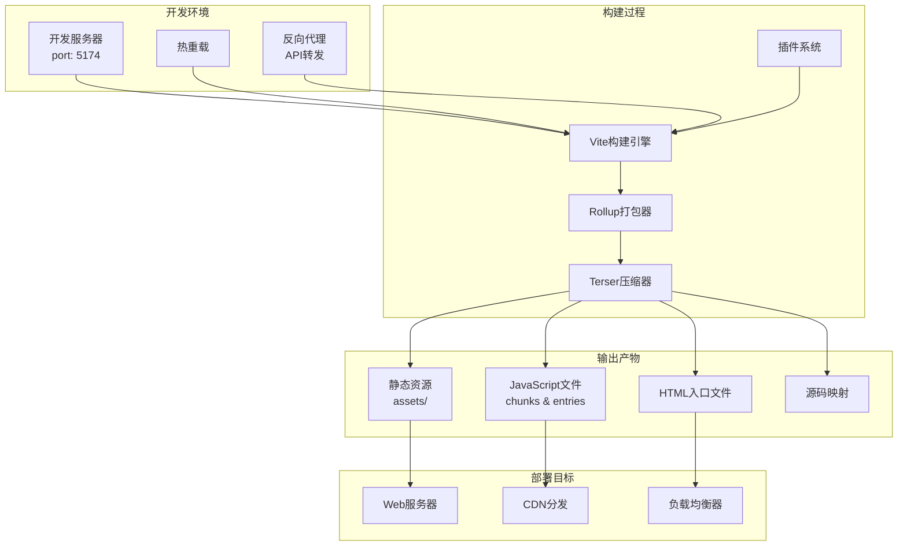

**图表来源**
- [vite.config.js](file://vite.config.js#L14-L80)
- [package.json](file://package.json#L9-L13)

## Vite配置详解

### 基础配置结构

Vite配置采用了动态工厂函数模式，根据不同的命令和模式返回相应的配置对象。这种设计提供了灵活的环境适配能力。

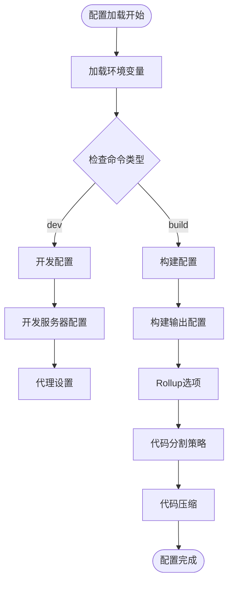

**图表来源**
- [vite.config.js](file://vite.config.js#L14-L80)

### 输出目录与资源路径

构建配置中的输出目录和资源路径设置直接影响部署的灵活性：

| 配置项 | 默认值 | 说明 | 影响 |
|--------|--------|------|------|
| `outDir` | `"dist"` | 构建输出目录 | 生产文件存放位置 |
| `assetsDir` | `"assets"` | 静态资源子目录 | 资源文件组织结构 |
| `base` | `"/clmap/"` | 静态资源基础路径 | 部署子路径配置 |
| `chunkFileNames` | `"assets/js/[name]-[hash].js"` | 分块文件命名规则 | 缓存控制策略 |
| `entryFileNames` | `"assets/js/[name]-[hash].js"` | 入口文件命名规则 | 主文件识别 |
| `assetFileNames` | `"assets/[ext]/[name]-[hash].[ext]"` | 资源文件命名规则 | 不同类型文件分类 |

**章节来源**
- [vite.config.js](file://vite.config.js#L44-L58)

### 代码压缩与优化

项目使用Terser作为代码压缩器，并提供了灵活的配置选项：

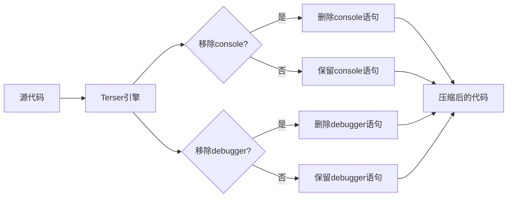

**图表来源**
- [vite.config.js](file://vite.config.js#L47-L53)

**章节来源**
- [vite.config.js](file://vite.config.js#L47-L53)

## 包管理与脚本

### 构建脚本配置

项目通过package.json定义了标准的构建生命周期脚本：

| 脚本名称 | 命令 | 用途 | 特点 |
|----------|------|------|------|
| `dev` | `vite` | 启动开发服务器 | 支持热重载和源码映射 |
| `build` | `vite build` | 生产环境构建 | 生成优化的静态文件 |
| `preview` | `vite preview` | 预览构建结果 | 本地模拟生产环境 |
| `swagger` | `npx swagger-typescript-api` | API文档生成 | 自动生成TypeScript接口 |

**章节来源**
- [package.json](file://package.json#L9-L13)

### 依赖管理策略

项目采用分层依赖管理，区分生产依赖和开发依赖：

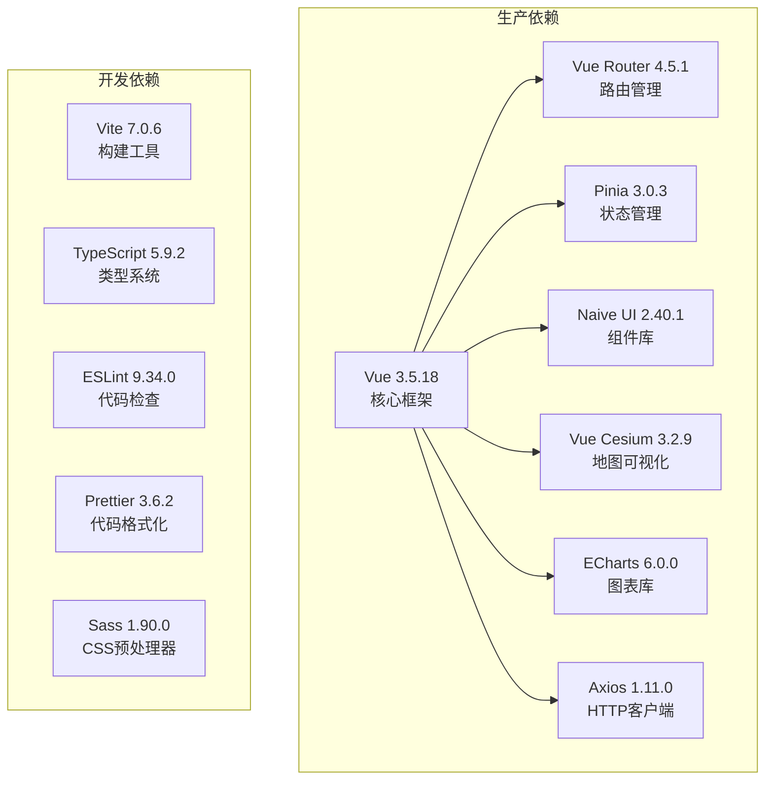

**图表来源**
- [package.json](file://package.json#L15-L46)

**章节来源**
- [package.json](file://package.json#L15-L46)

## 环境变量配置

### 环境变量体系

项目通过Vite的环境变量加载机制实现灵活的配置管理：

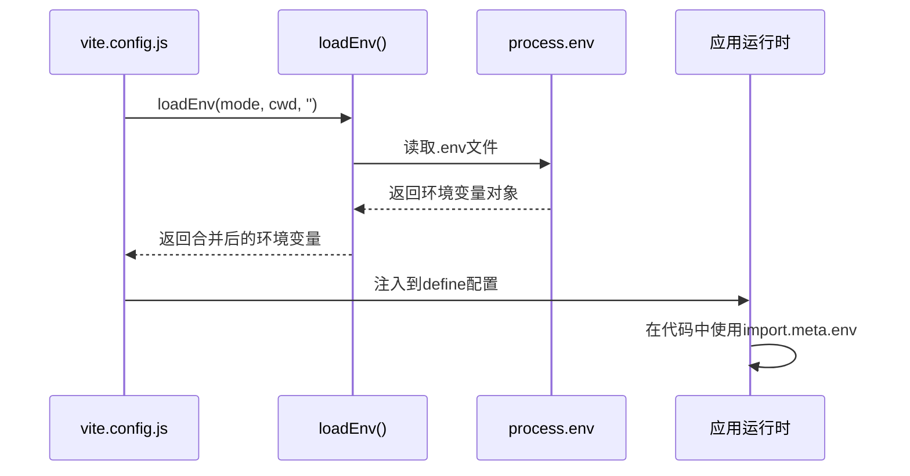

**图表来源**
- [vite.config.js](file://vite.config.js#L15-L17)

### 关键环境变量

| 变量名 | 类型 | 默认值 | 用途 | 示例 |
|--------|------|--------|------|------|
| `VITE_BASE_URL` | String | `"/clmap/"` | 静态资源基础路径 | `"/dashboard/"` |
| `VITE_API_URL` | String | - | 后端API服务器地址 | `"https://api.example.com"` |
| `VITE_API_BASE_URL` | String | - | API路由前缀 | `"/api"` |
| `VITE_DROP_CONSOLE` | Boolean | `"false"` | 构建时移除console | `"true"` |
| `VITE_DROP_DEBUGGER` | Boolean | `"false"` | 构建时移除debugger | `"true"` |
| `VITE_APP_VERSION` | String | `"1.0.0"` | 应用版本号 | `"2.1.0-beta.1"` |

### 运行时环境变量

应用运行时可以通过`import.meta.env`访问环境变量：

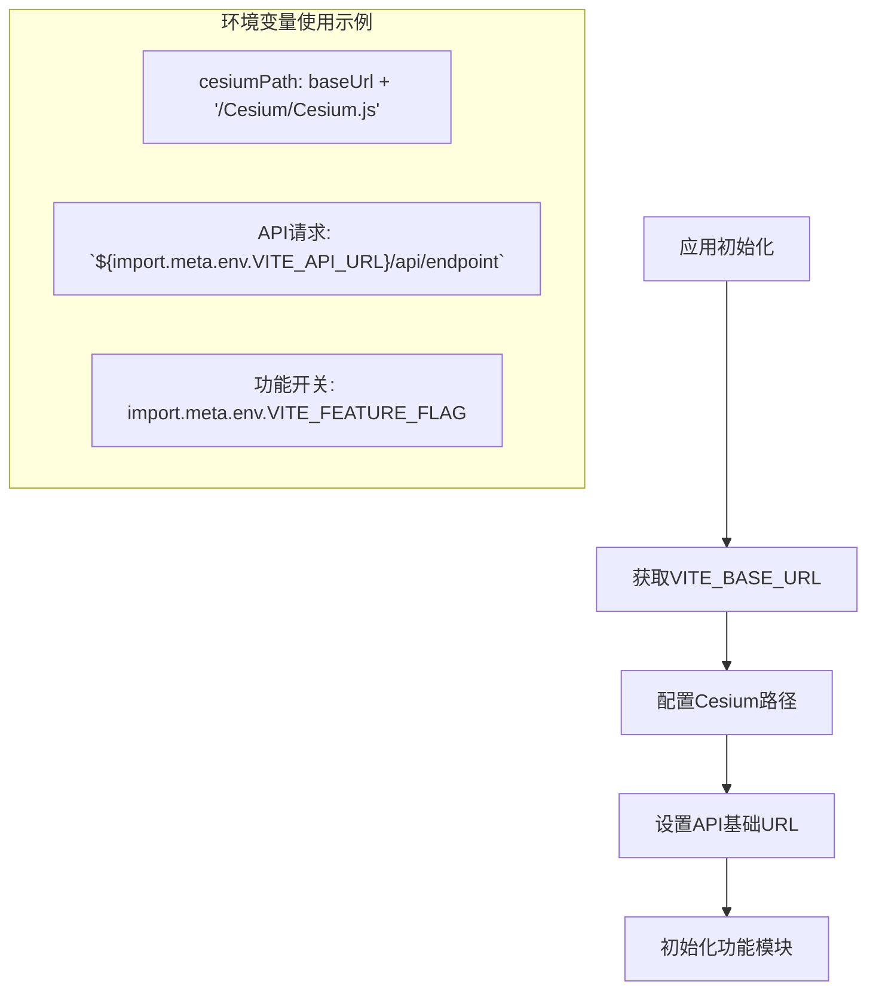

**图表来源**
- [src/main.ts](file://src/main.ts#L20-L27)
- [vite.config.js](file://vite.config.js#L67-L70)

**章节来源**
- [vite.config.js](file://vite.config.js#L19-L20)
- [src/main.ts](file://src/main.ts#L20-L27)

## 构建流程详解

### 开发构建流程

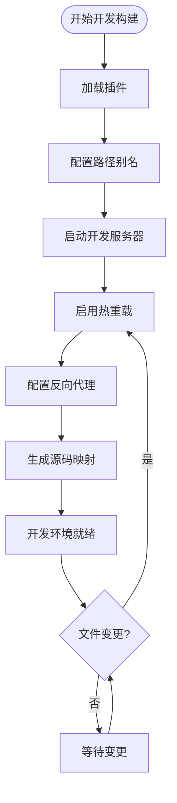

**图表来源**
- [vite.config.js](file://vite.config.js#L18-L40)

### 生产构建流程

生产构建包含多个优化阶段，确保最终产物的性能和兼容性：

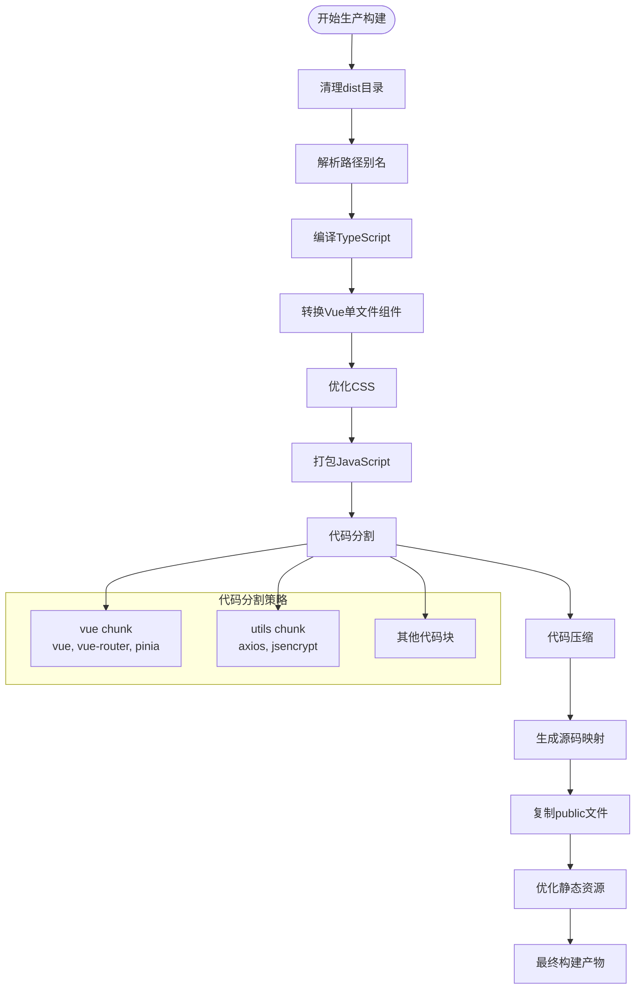

**图表来源**
- [vite.config.js](file://vite.config.js#L41-L64)

### 构建配置详解

#### 目标兼容性设置
- **目标版本**: ES2015，确保广泛的浏览器兼容性
- **模块格式**: ES模块，支持现代浏览器的原生导入导出

#### 源码映射配置
- **开发环境**: 启用源码映射，便于调试
- **生产环境**: 条件性启用，平衡性能和调试需求

**章节来源**
- [vite.config.js](file://vite.config.js#L43-L46)

## 生产环境部署

### 部署架构设计

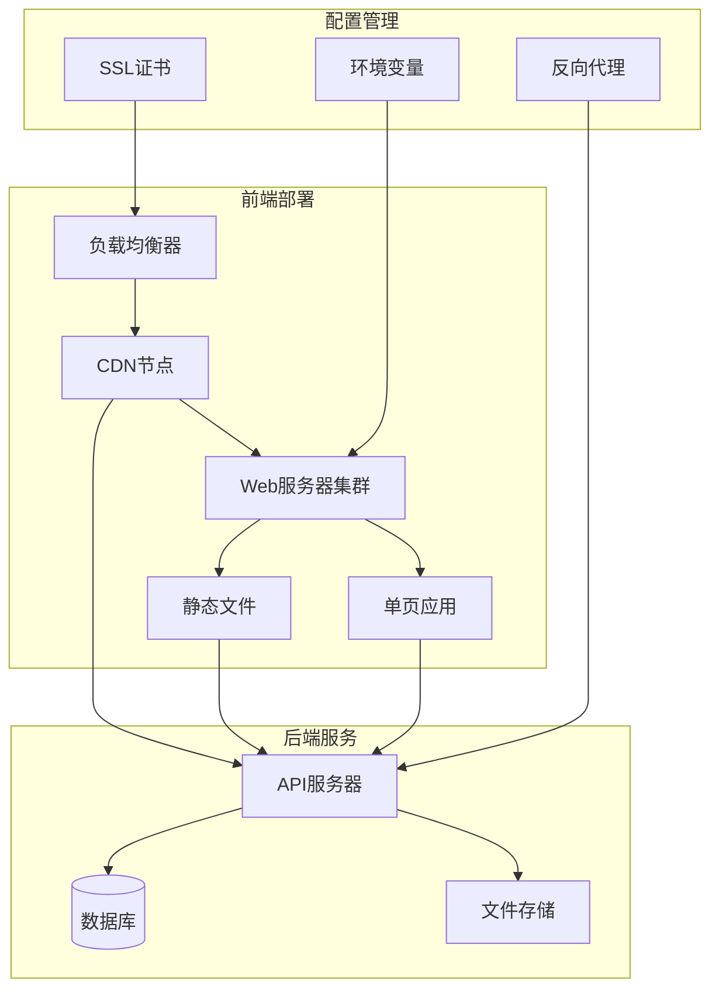

### 部署准备清单

| 准备项目 | 必要性 | 说明 | 注意事项 |
|----------|--------|------|----------|
| 环境变量配置 | 必须 | 设置所有必需的环境变量 | 包括API地址、CDN路径等 |
| 域名解析 | 必须 | 配置域名指向CDN或服务器 | 确保DNS生效 |
| SSL证书 | 推荐 | 配置HTTPS证书 | 提升安全性 |
| CDN配置 | 推荐 | 配置静态资源CDN | 提升加载速度 |
| 反向代理 | 必须 | 配置API代理 | 解决跨域问题 |
| 负载均衡 | 推荐 | 配置多实例负载 | 提升可用性 |

### 部署步骤

#### 1. 代码构建
```bash
# 安装依赖
pnpm install

# 构建生产版本
pnpm build

# 预览构建结果
pnpm preview
```

#### 2. 文件传输
将`dist`目录下的所有文件上传到Web服务器或CDN：

```bash
# 使用rsync同步文件
rsync -avz dist/ user@server:/var/www/html/

# 或使用FTP/SFTP
scp -r dist/* user@server:/var/www/html/
```

#### 3. 服务器配置

##### Nginx配置示例
```nginx
server {
    listen 80;
    server_name dashboard.example.com;
    root /var/www/html;
    
    # 静态资源缓存
    location ~* \.(js|css|png|jpg|jpeg|gif|ico|svg)$ {
        expires 1y;
        add_header Cache-Control "public, immutable";
    }
    
    # SPA路由处理
    location / {
        try_files $uri /index.html;
    }
    
    # API代理
    location /api/ {
        proxy_pass http://localhost:3000/;
        proxy_set_header Host $host;
        proxy_set_header X-Real-IP $remote_addr;
    }
}
```

##### Apache配置示例
```apache
<VirtualHost *:80>
    ServerName dashboard.example.com
    DocumentRoot /var/www/html
    
    # 启用重写模块
    RewriteEngine On
    
    # SPA路由处理
    RewriteCond %{REQUEST_FILENAME} !-f
    RewriteCond %{REQUEST_FILENAME} !-d
    RewriteRule ^(.*)$ /index.html [L,QSA]
    
    # 静态资源缓存
    <FilesMatch "\.(js|css|png|jpg|jpeg|gif|ico|svg)$">
        Header set Cache-Control "max-age=31536000, public"
    </FilesMatch>
</VirtualHost>
```

**章节来源**
- [vite.config.js](file://vite.config.js#L29-L39)
- [src/main.ts](file://src/main.ts#L25-L27)

## 性能优化策略

### Rollup代码分割策略

项目采用了精细化的代码分割策略，通过`manualChunks`配置实现了智能的代码分离：

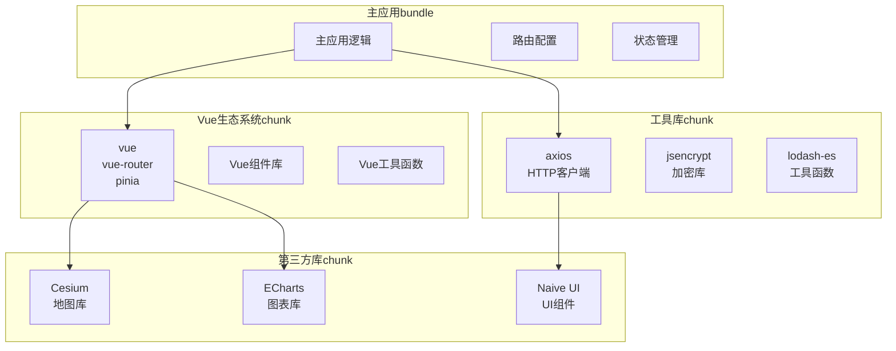

**图表来源**
- [vite.config.js](file://vite.config.js#L59-L62)

### 代码分割效果分析

| 分割策略 | 优势 | 适用场景 | 缓存效果 |
|----------|------|----------|----------|
| Vue生态分离 | 减少主包体积 | Vue应用通用 | 高频更新频率 |
| HTTP工具分离 | 独立缓存 | API请求频繁 | 中等更新频率 |
| 地图可视化分离 | 按需加载 | 地图功能使用 | 低频更新频率 |
| 图表库分离 | 功能独立 | 图表展示场景 | 低频更新频率 |

### 资源优化策略

#### 静态资源优化
- **图片压缩**: 使用WebP格式替代传统图片格式
- **字体优化**: 使用WOFF2字体格式
- **CSS优化**: 移除未使用的样式，压缩CSS文件
- **JavaScript优化**: Terser压缩，移除调试代码

#### 缓存策略
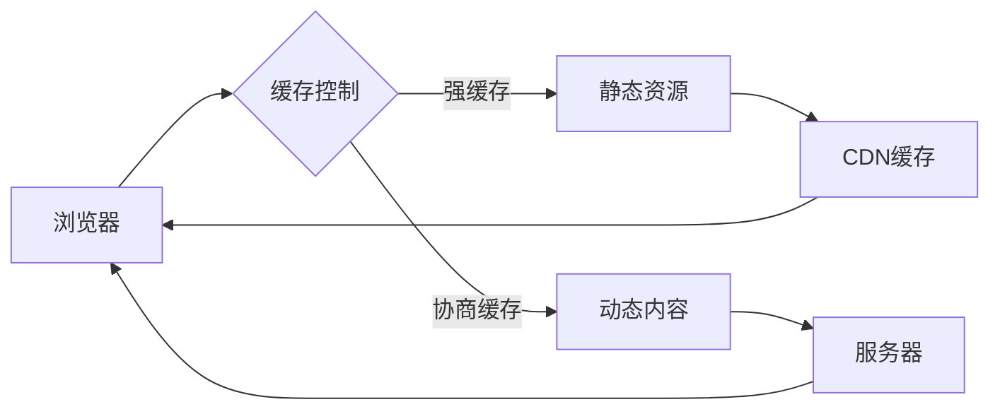

**章节来源**
- [vite.config.js](file://vite.config.js#L55-L63)

## CDN资源配置

### CDN集成方案

对于大型政府项目，CDN是提升用户体验的关键因素。以下是CDN配置的最佳实践：

#### 资源路径配置
```javascript
// 在vite.config.js中配置CDN路径
const cdnBase = env.VITE_CDN_URL || 'https://cdn.example.com';
const resourcePaths = {
  // Vue生态系统
  vue: `${cdnBase}/vendor/vue.js`,
  axios: `${cdnBase}/vendor/axios.js`,
  
  // 地图可视化
  cesium: `${cdnBase}/vendor/cesium/Cesium.js`,
  
  // 图表库
  echarts: `${cdnBase}/vendor/echarts.js`,
  
  // UI组件库
  naiveUI: `${cdnBase}/vendor/naive-ui.js`
};
```

#### CDN资源加载策略

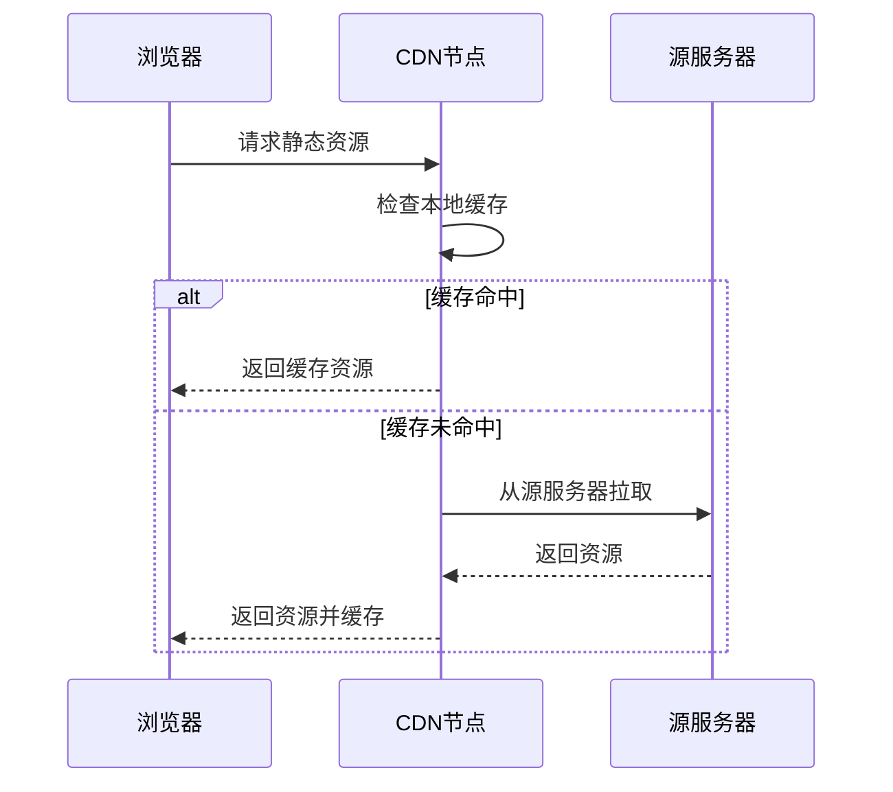

### CDN配置最佳实践

| 配置项 | 推荐值 | 说明 | 性能影响 |
|--------|--------|------|----------|
| 缓存时间 | 1年 | 静态资源长期缓存 | 显著提升加载速度 |
| 压缩格式 | Gzip/Brotli | 启用文本压缩 | 减少传输大小 |
| HTTPS | 强制HTTPS | 安全传输 | 提升安全性 |
| 多CDN节点 | 3个以上 | 全球分布 | 提升访问速度 |
| 回退机制 | 源站回退 | CDN故障处理 | 提升可用性 |

### 动态资源CDN配置

对于项目中的动态资源（如地图瓦片、API数据），可以采用以下配置：

```javascript
// 地图资源CDN配置
const mapConfig = {
  // 天地图CDN
  tianditu: {
    vec: 'https://t0.tianditu.gov.cn/vec_c/wmts?...',
    img: 'https://t0.tianditu.gov.cn/img_c/wmts?...'
  },
  
  // Cesium资源CDN
  cesium: {
    base: 'https://cdn.jsdelivr.net/npm/@vue-cesium/',
    workers: 'https://cdn.jsdelivr.net/npm/@vue-cesium/workers/'
  }
};
```

**章节来源**
- [src/config/mapConfig.ts](file://src/config/mapConfig.ts#L49-L52)

## 故障排除指南

### 常见构建问题

#### 1. 环境变量未生效
**症状**: 应用无法正确识别环境变量，导致API地址错误或功能异常

**解决方案**:
```bash
# 检查环境变量文件
ls -la .env*

# 验证环境变量加载
echo $VITE_API_URL

# 重启开发服务器
pnpm dev
```

#### 2. 路径别名失效
**症状**: 导入模块时出现"Cannot resolve module"错误

**解决方案**:
```javascript
// 检查tsconfig.json中的路径配置
{
  "compilerOptions": {
    "paths": {
      "@/*": ["src/*"]
    }
  }
}

// 检查vite.config.js中的别名配置
resolve: {
  alias: {
    "@": fileURLToPath(new URL("./src", import.meta.url))
  }
}
```

#### 3. 代码分割不生效
**症状**: 所有代码被打包成一个文件，没有实现按需加载

**解决方案**:
```javascript
// 检查rollupOptions配置
rollupOptions: {
  output: {
    manualChunks: {
      // 确保模块列表正确
      vue: ["vue", "vue-router", "pinia"],
      utils: ["axios", "jsencrypt"]
    }
  }
}
```

### 生产部署问题

#### 1. 资源404错误
**症状**: 页面显示正常，但静态资源（CSS、JS）加载失败

**诊断步骤**:
```bash
# 检查base配置是否正确
# 在vite.config.js中确认
base: env.VITE_BASE_URL || "/clmap/"

# 检查服务器配置
# 确保静态资源路径正确
location /clmap/ {
    alias /var/www/html/clmap/;
}
```

#### 2. API跨域问题
**症状**: 前端请求后端API时出现跨域错误

**解决方案**:
```javascript
// 在vite.config.js中配置代理
server: {
  proxy: {
    [env.VITE_API_BASE_URL]: {
      target: env.VITE_API_URL,
      changeOrigin: true,
      rewrite: (path) => path.replace(/^\/api/, '')
    }
  }
}
```

#### 3. 路由刷新页面丢失
**症状**: 在生产环境中直接访问某个路由时，出现404错误

**解决方案**:
```javascript
// 确保服务器配置支持SPA路由
// Nginx配置示例
location / {
    try_files $uri /index.html;
}
```

### 性能问题诊断

#### 1. 首屏加载慢
**诊断工具**:
- Chrome DevTools Performance面板
- WebPageTest在线测试
- Lighthouse审计报告

**优化建议**:
```javascript
// 检查代码分割效果
// 在浏览器开发者工具中查看Network面板
// 确保主要功能模块按需加载

// 优化图片资源
// 使用WebP格式，压缩图片尺寸
```

#### 2. 内存占用过高
**诊断方法**:
```javascript
// 在浏览器控制台检查内存使用
window.performance.memory && console.log(window.performance.memory);

// 检查是否存在内存泄漏
// 监听unhandledrejection事件
window.addEventListener('unhandledrejection', (event) => {
  console.error('Unhandled rejection:', event.reason);
});
```

### 日志监控配置

```javascript
// 在main.ts中添加错误监控
if (process.env.NODE_ENV === 'production') {
  window.onerror = function(message, filename, lineno, colno, error) {
    console.error('Global error:', { message, filename, lineno, error });
    // 发送错误日志到监控系统
    return true;
  };
}
```

**章节来源**
- [vite.config.js](file://vite.config.js#L15-L17)
- [src/main.ts](file://src/main.ts#L1-L30)

## 总结

本部署与构建文档详细介绍了政府安全监测预警平台的完整技术栈和部署流程。通过Vite构建工具的精心配置，项目实现了：

1. **灵活的环境配置**: 支持开发、测试、生产多环境部署
2. **高性能构建**: 通过代码分割和资源优化实现快速加载
3. **可扩展的架构**: 支持CDN集成和微服务部署
4. **完善的监控**: 提供详细的错误追踪和性能监控

遵循本文档的指导原则和最佳实践，可以确保项目在各种部署环境中稳定运行，为政府部门提供可靠的数字化服务支撑。