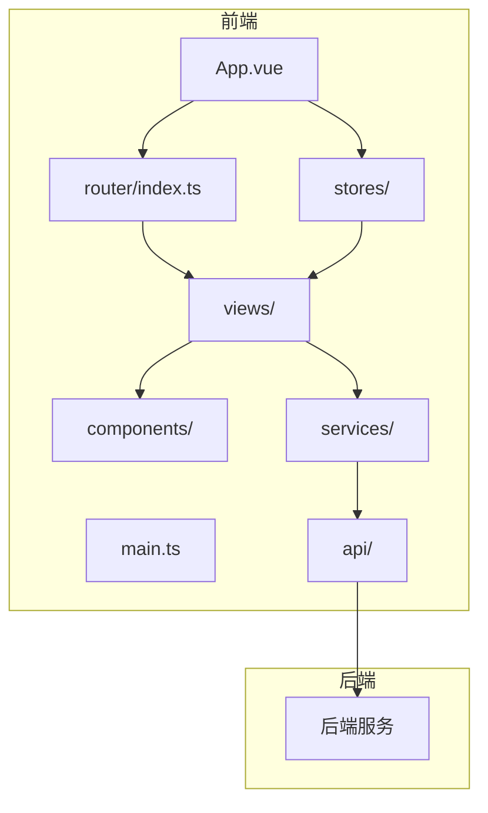
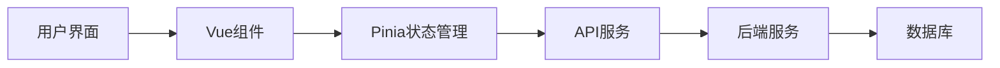
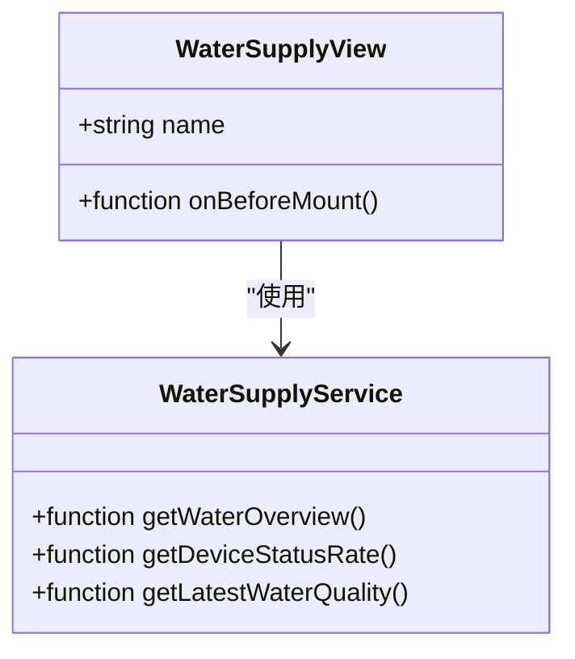
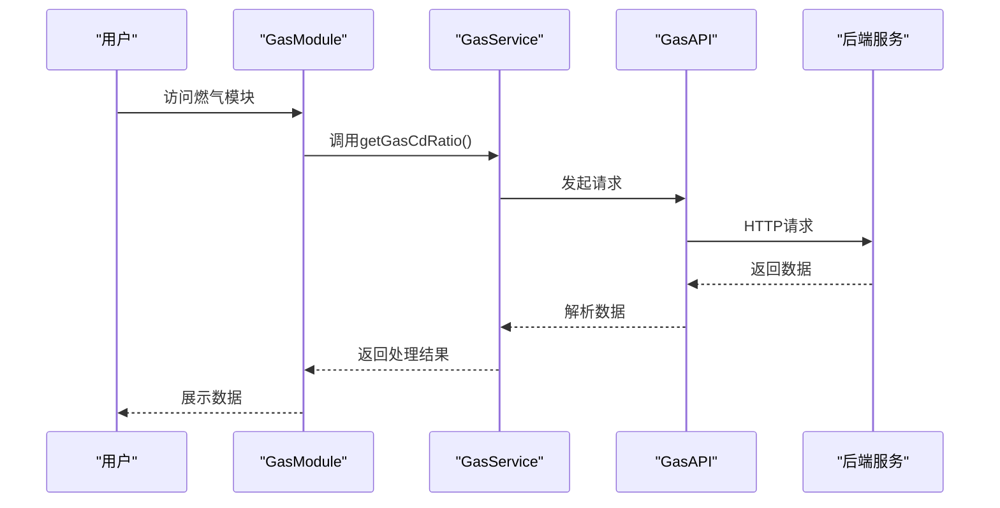
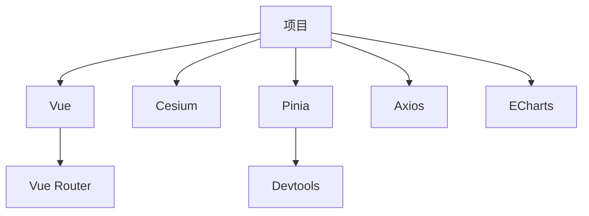

# 项目概述

<cite>
**本文档引用的文件**  
- [main.ts](file://src/main.ts)
- [App.vue](file://src/App.vue)
- [vite.config.js](file://vite.config.js)
- [package.json](file://package.json)
- [index.html](file://index.html)
- [router/index.ts](file://src/router/index.ts)
- [stores/mapStore.ts](file://src/stores/mapStore.ts)
- [config/mapConfig.ts](file://src/config/mapConfig.ts)
- [views/WaterSupply/index.vue](file://src/views/WaterSupply/index.vue)
- [views/gasModule/index.vue](file://src/views/gasModule/index.vue)
- [api/apiConfig.ts](file://src/api/apiConfig.ts)
- [services/waterSupplyService.ts](file://src/services/waterSupplyService.ts)
- [services/gasService.ts](file://src/services/gasService.ts)
- [types/index.ts](file://src/types/index.ts)
</cite>

## 目录
1. [引言](#引言)
2. [项目结构](#项目结构)
3. [核心组件](#核心组件)
4. [架构概览](#架构概览)
5. [详细组件分析](#详细组件分析)
6. [依赖分析](#依赖分析)
7. [性能考量](#性能考量)
8. [故障排除指南](#故障排除指南)
9. [结论](#结论)

## 引言
政府仪表盘项目是一个城市安全综合监测预警平台，旨在通过三维可视化技术对燃气、供水等关键基础设施进行实时监控和预警。该平台基于Vue 3、Cesium和Pinia构建，采用组件化开发模式和集中式状态管理机制，为城市管理者提供直观、高效的安全监管工具。

## 项目结构
该项目采用模块化设计，主要分为以下几个部分：
- `public/`：存放静态资源，包括Cesium库文件和地图配置。
- `src/`：源代码目录，包含API接口、组件、配置、服务、状态管理、类型定义和视图。
- `src/api/`：定义与后端服务通信的API接口。
- `src/components/`：通用UI组件。
- `src/mapComponents/`：地图相关组件。
- `src/services/`：业务逻辑服务层。
- `src/stores/`：使用Pinia进行状态管理。
- `src/views/`：页面级组件，如供水和燃气模块。

**图源**  
- [main.ts](file://src/main.ts)
- [App.vue](file://src/App.vue)
- [router/index.ts](file://src/router/index.ts)
- [stores/mapStore.ts](file://src/stores/mapStore.ts)

**节源**  
- [main.ts](file://src/main.ts)
- [App.vue](file://src/App.vue)
- [vite.config.js](file://vite.config.js)

## 核心组件
本项目的核心组件包括地图组件、数据展示模块和服务调用层。地图组件基于Cesium实现三维可视化，数据展示模块通过ECharts进行图表渲染，服务调用层则负责与后端API交互。

**节源**  
- [views/WaterSupply/index.vue](file://src/views/WaterSupply/index.vue)
- [views/gasModule/index.vue](file://src/views/gasModule/index.vue)
- [services/waterSupplyService.ts](file://src/services/waterSupplyService.ts)
- [services/gasService.ts](file://src/services/gasService.ts)

## 架构概览
系统采用前后端分离架构，前端使用Vue 3框架，结合Cesium进行三维地图渲染，Pinia进行状态管理。后端提供RESTful API接口，前端通过Axios进行数据请求。

**图源**  
- [main.ts](file://src/main.ts)
- [App.vue](file://src/App.vue)
- [api/apiConfig.ts](file://src/api/apiConfig.ts)

## 详细组件分析
### 供水模块分析
供水模块提供了供水管网的三维可视化展示，包括管网分布、设备状态、水质监测等功能。

#### 对象导向组件

**图源**  
- [views/WaterSupply/index.vue](file://src/views/WaterSupply/index.vue)
- [services/waterSupplyService.ts](file://src/services/waterSupplyService.ts)

### 燃气模块分析
燃气模块专注于燃气管网的监控，提供管网长度占比、材质占比、应急能力统计等功能。

#### API/服务组件

**图源**  
- [views/gasModule/index.vue](file://src/views/gasModule/index.vue)
- [services/gasService.ts](file://src/services/gasService.ts)
- [api/apiConfig.ts](file://src/api/apiConfig.ts)

## 依赖分析
项目依赖主要包括Vue生态、Cesium、Pinia、Axios等。通过`package.json`文件管理所有依赖项，并使用Vite作为构建工具。

**图源**  
- [package.json](file://package.json)
- [vite.config.js](file://vite.config.js)

**节源**  
- [package.json](file://package.json)
- [vite.config.js](file://vite.config.js)

## 性能考量
为了提升性能，项目采用了以下措施：
- 使用Vite进行快速开发和构建。
- 通过Pinia进行状态管理，避免不必要的重新渲染。
- 利用Cesium的LOD（Level of Detail）技术优化三维渲染性能。
- 在服务层进行数据缓存，减少重复请求。

## 故障排除指南
常见问题及解决方案：
- **地图加载缓慢**：检查网络连接，确保Cesium资源正确加载。
- **数据不更新**：确认API接口是否正常，检查服务层逻辑。
- **样式错乱**：验证SCSS编译是否成功，检查CSS类名冲突。

**节源**  
- [main.ts](file://src/main.ts)
- [App.vue](file://src/App.vue)
- [vite.config.js](file://vite.config.js)

## 结论
政府仪表盘项目通过先进的前端技术和三维可视化手段，实现了对城市关键基础设施的全面监控。其模块化设计和清晰的架构使得系统易于维护和扩展，为城市安全管理提供了强有力的技术支持。