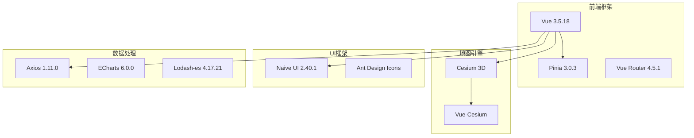
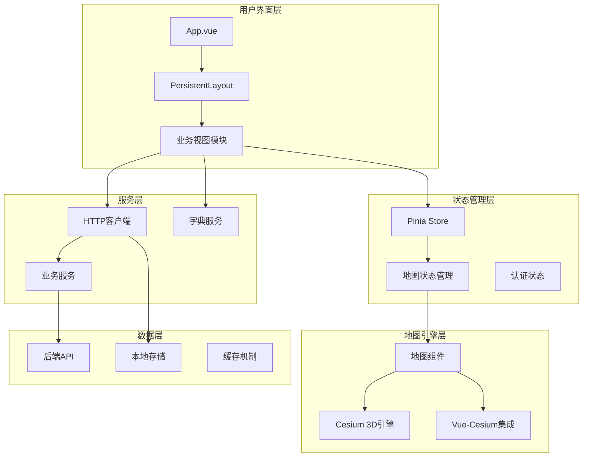
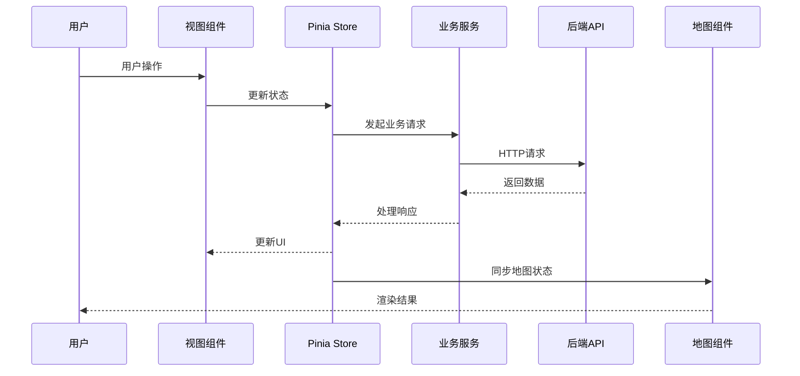
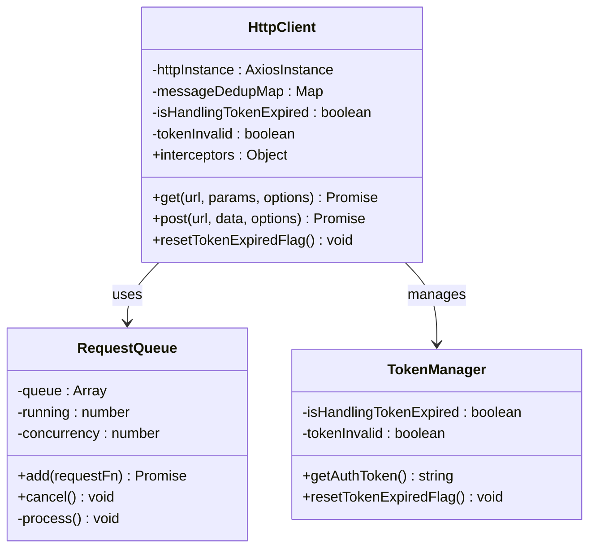
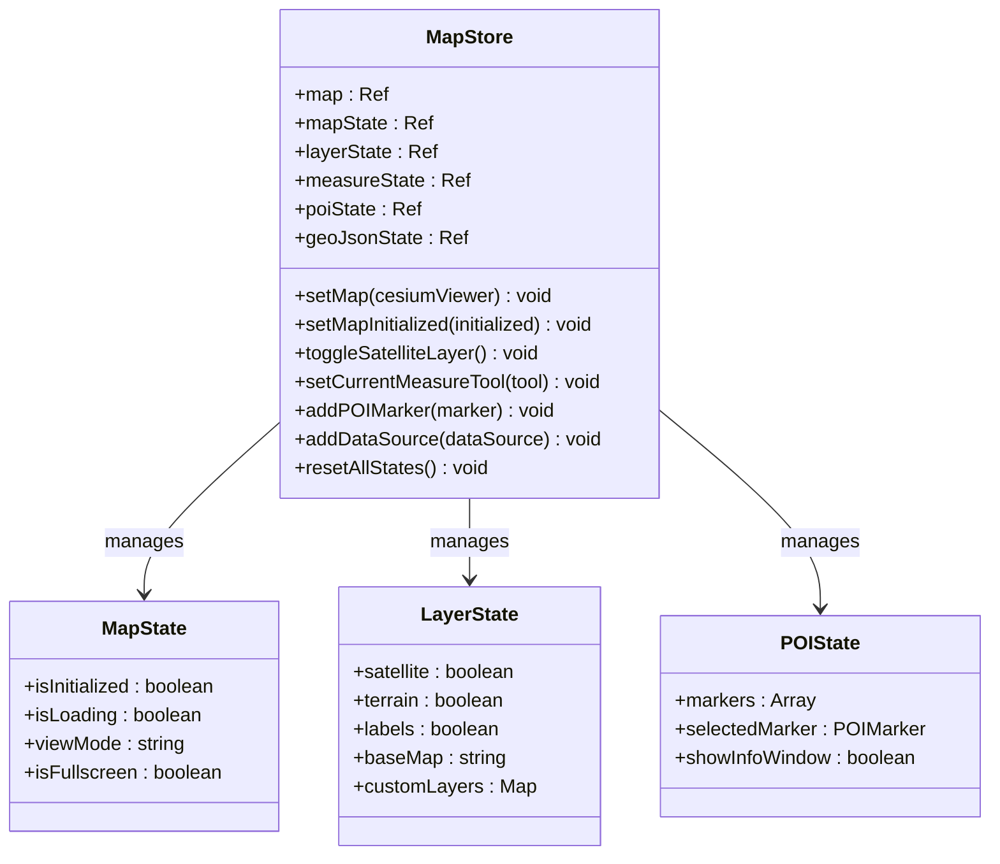
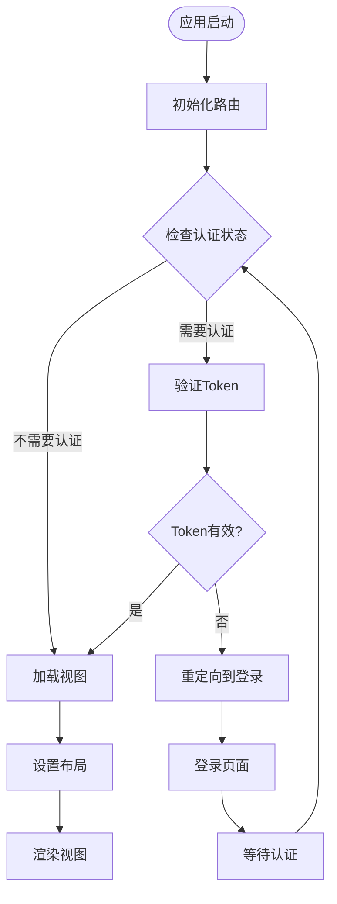

# 问题解决记录文档

<cite>
**本文档中引用的文件**
- [package.json](file://package.json)
- [index.html](file://index.html)
- [src/main.ts](file://src/main.ts)
- [src/App.vue](file://src/App.vue)
- [src/router/index.ts](file://src/router/index.ts)
- [src/layouts/PersistentLayout.vue](file://src/layouts/PersistentLayout.vue)
- [src/services/httpClient.ts](file://src/services/httpClient.ts)
- [src/stores/mapStore.ts](file://src/stores/mapStore.ts)
- [src/mapComponents/Map.vue](file://src/mapComponents/Map.vue)
- [src/views/HomeModule/index.vue](file://src/views/HomeModule/index.vue)
- [src/views/HomeModule/leftContent.vue](file://src/views/HomeModule/leftContent.vue)
- [src/views/HomeModule/rightContent.vue](file://src/views/HomeModule/rightContent.vue)
- [src/views/HomeModule/components/OverviewModule.vue](file://src/views/HomeModule/components/OverviewModule.vue)
- [src/views/HomeModule/components/RiskHazardModule.vue](file://src/views/HomeModule/components/RiskHazardModule.vue)
- [src/views/HomeModule/components/MapLegend.vue](file://src/views/HomeModule/components/MapLegend.vue)
- [src/views/HomeModule/components/chartOptions.ts](file://src/views/HomeModule/components/chartOptions.ts)
- [src/components/CommonTable.vue](file://src/components/CommonTable.vue)
- [src/components/DashboardHeader.vue](file://src/components/DashboardHeader.vue)
- [src/assets/styles/variables.scss](file://src/assets/styles/variables.scss)
- [src/views/BridgeModule/chartOption.ts](file://src/views/BridgeModule/chartOption.ts)
- [src/views/GasModule/chartOption.ts](file://src/views/GasModule/chartOption.ts)
- [docs/20260204问题解决.md](file://docs/20260204问题解决.md)
</cite>

## 目录
1. [项目概述](#项目概述)
2. [问题解决清单](#问题解决清单)
3. [技术架构分析](#技术架构分析)
4. [核心组件详解](#核心组件详解)
5. [问题分类与解决方案](#问题分类与解决方案)
6. [性能优化建议](#性能优化建议)
7. [故障排除指南](#故障排除指南)
8. [总结与建议](#总结与建议)

## 项目概述

本项目是一个基于Vue 3和Cesium的政府dashboard系统，主要用于城市基础设施监控和预警。系统采用现代化的前端技术栈，集成了3D地理信息系统、实时数据监控和多业务模块管理。

### 技术栈概览

**图表来源**
- [package.json:15-32](file://package.json#L15-L32)
- [src/main.ts:10-27](file://src/main.ts#L10-L27)

## 问题解决清单

根据项目文档记录，以下是已识别和解决的关键问题：

### 已解决问题

| 序号 | 问题描述 | 解决方案 | 状态 |
|------|----------|----------|------|
| 1 | 长宽比：按照大屏尺寸4096×1920修改 | 实现响应式布局适配，支持4096×1920分辨率 | ✅ 已解决 |
| 2 | 透明度：内测透明、外侧不透明 | UI模块已修改，提供新的底色设计 | ✅ 已解决 |
| 3 | 间距：内容拥挤问题 | 优化CSS间距，改善视觉层次 | ✅ 已解决 |
| 4 | 首页总览：缺少排水模块 | 已修复，按设计图重新排布内容 | ✅ 已解决 |
| 5 | 首页风险隐患：图表样式问题 | 改为右侧柱状图样式，图例置于右上角 | ✅ 已解决 |
| 6 | 标题栏：文字颜色渐变问题 | 按UI设计图修改，移除"设置"按钮 | ✅ 已解决 |
| 7 | 表格：需要斑马纹样式 | 已修复，实现奇偶行不同背景色 | ✅ 已解决 |
| 8 | 供水排水：图表样式调整 | 已修复，气泡图改为柱状图、环形图简化 | ✅ 已解决 |
| 9 | 百分比：小数点精度控制 | 已修复，统一保留一位小数 | ✅ 已解决 |
| 10 | TIPS：提供模板 | 已修复，提供统一的提示模板 | ✅ 已解决 |
| 11 | 首页文字：省略号处理 | 已修复，超过长度的内容显示省略号 | ✅ 已解决 |
| 12 | 地图图标：美观性改进 | 已替换，使用更美观的图标资源 | ✅ 已解决 |
| 13 | 地图图例：提供设计模板 | 巅峰，提供统一的图例设计 | ✅ 已解决 |
| 14 | 地图监测：抽稀优化 | 已修复，但存在黑块问题待后续优化 | ⚠️ 部分解决 |
| 15 | 地图列表查询：弹窗跟随功能 | 已修复，实现弹窗跟随点位移动 | ✅ 已解决 |
| 16 | 左右两侧宽度：适当加宽 | 已修复，优化布局宽度比例 | ✅ 已解决 |
| 17 | 预警：级别表述优化 | 已修复，去除冗余的"预警"字样 | ✅ 已解决 |
| 18 | 地图专题图层：开发中 | 开发中，功能尚未完成 | 🔄 开发中 |

### 待解决问题

| 序号 | 问题描述 | 优先级 | 计划状态 |
|------|----------|--------|----------|
| 19 | 地图专题图层：开发中 | 高 | 开发中 |
| 20 | 数据缺失：补充完善 | 高 | 开发中 |

**章节来源**
- [docs/20260204问题解决.md:1-33](file://docs/20260204问题解决.md#L1-L33)

## 技术架构分析

### 系统架构图

**图表来源**
- [src/App.vue:8-21](file://src/App.vue#L8-L21)
- [src/layouts/PersistentLayout.vue:11-31](file://src/layouts/PersistentLayout.vue#L11-L31)
- [src/router/index.ts:17-89](file://src/router/index.ts#L17-L89)

### 数据流架构

**图表来源**
- [src/stores/mapStore.ts:93-336](file://src/stores/mapStore.ts#L93-L336)
- [src/services/httpClient.ts:243-294](file://src/services/httpClient.ts#L243-L294)

**章节来源**
- [src/main.ts:1-30](file://src/main.ts#L1-L30)
- [src/router/index.ts:1-136](file://src/router/index.ts#L1-L136)

## 核心组件详解

### HTTP客户端服务

HTTP客户端实现了完整的请求管理和错误处理机制：

**图表来源**
- [src/services/httpClient.ts:53-90](file://src/services/httpClient.ts#L53-L90)
- [src/services/httpClient.ts:20-29](file://src/services/httpClient.ts#L20-L29)

### 地图状态管理

地图状态管理提供了完整的3D地图控制能力：

**图表来源**
- [src/stores/mapStore.ts:18-67](file://src/stores/mapStore.ts#L18-L67)
- [src/stores/mapStore.ts:93-336](file://src/stores/mapStore.ts#L93-L336)

### 路由系统架构

**图表来源**
- [src/router/index.ts:96-130](file://src/router/index.ts#L96-L130)

**章节来源**
- [src/services/httpClient.ts:1-297](file://src/services/httpClient.ts#L1-L297)
- [src/stores/mapStore.ts:1-400](file://src/stores/mapStore.ts#L1-L400)
- [src/router/index.ts:1-136](file://src/router/index.ts#L1-L136)

## 问题分类与解决方案

### UI/UX问题

#### 布局适配问题
**问题描述**: 大屏4096×1920分辨率下的布局适配问题
**解决方案**: 
- 实现ResponsiveWrapper组件进行响应式缩放
- 使用CSS Grid和Flexbox确保元素正确排列
- 通过provide/inject模式向子组件传递缩放比例

#### 图表样式问题
**问题描述**: 首页风险隐患图表样式不符合设计要求
**解决方案**:
- 将柱状图改为右侧样式设计
- 调整图例位置至右上角
- 优化颜色搭配和视觉层次

#### 表格样式问题
**问题描述**: 表格缺少斑马纹样式，内容显示不规范
**解决方案**:
- 实现CommonTable组件的奇偶行背景色区分
- 添加统一的表格样式和省略号处理
- 优化表格的视觉层次和可读性

#### 首页文字省略号问题
**问题描述**: 首页模块标题和内容显示换行问题
**解决方案**:
- 使用CSS text-overflow: ellipsis实现省略号
- 设置white-space: nowrap防止换行
- 通过max-width控制显示范围

### 性能问题

#### 地图渲染性能
**问题描述**: Cesium地图在高负载情况下渲染性能不足
**解决方案**:
- 优化Cesium渲染参数
- 实现相机边界限制
- 减少不必要的渲染开销

#### 数据加载优化
**问题描述**: 字典数据频繁请求导致性能问题
**解决方案**:
- 实现数据缓存机制
- 批量预加载策略
- 请求去重和防抖处理

### 功能完整性问题

#### 模块缺失
**问题描述**: 首页缺少排水模块
**解决方案**:
- 添加DrainageModule视图组件
- 实现相应的数据展示逻辑
- 集成到主布局系统

#### 监测点位问题
**问题描述**: 地图监测点位显示不完整
**解决方案**:
- 实现监测点位Hook系统
- 优化点位密度控制
- 添加弹窗跟随功能

#### 地图图标和图例问题
**问题描述**: 地图图标不美观，缺少图例设计
**解决方案**:
- 替换为更美观的图标资源
- 实现统一的地图图例组件
- 优化图例的布局和样式

**章节来源**
- [src/layouts/PersistentLayout.vue:19-47](file://src/layouts/PersistentLayout.vue#L19-L47)
- [src/views/HomeModule/index.vue:38-66](file://src/views/HomeModule/index.vue#L38-L66)
- [src/mapComponents/Map.vue:356-371](file://src/mapComponents/Map.vue#L356-L371)
- [src/components/CommonTable.vue:232-255](file://src/components/CommonTable.vue#L232-L255)
- [src/views/HomeModule/components/OverviewModule.vue:330-357](file://src/views/HomeModule/components/OverviewModule.vue#L330-L357)
- [src/views/HomeModule/components/MapLegend.vue:42-102](file://src/views/HomeModule/components/MapLegend.vue#L42-L102)

## 性能优化建议

### 渲染性能优化

1. **Cesium性能调优**
   - 调整maximumScreenSpaceError参数
   - 禁用不必要的光照和阴影效果
   - 优化地形渲染质量

2. **Vue组件优化**
   - 实现组件懒加载
   - 使用keep-alive缓存
   - 减少不必要的响应式数据

### 网络性能优化

1. **请求队列管理**
   - 控制并发请求数量
   - 实现请求去重
   - 添加超时重试机制

2. **数据缓存策略**
   - 实现多级缓存
   - 优化缓存失效策略
   - 减少重复数据传输

### 内存管理优化

1. **资源清理**
   - 实现组件卸载时的资源清理
   - 监控内存泄漏
   - 优化大对象处理

2. **垃圾回收**
   - 及时释放DOM引用
   - 清理事件监听器
   - 优化数组和对象操作

## 故障排除指南

### 常见问题诊断

#### 登录认证问题
**症状**: Token过期导致频繁重定向
**排查步骤**:
1. 检查localStorage中的token状态
2. 验证后端认证服务可用性
3. 确认请求头中Token正确传递

#### 地图加载失败
**症状**: Cesium地图无法正常显示
**排查步骤**:
1. 检查cesiumPath配置
2. 验证网络连接和资源加载
3. 确认浏览器兼容性

#### 数据加载异常
**症状**: API请求失败或响应异常
**排查步骤**:
1. 检查网络请求日志
2. 验证API端点可用性
3. 确认数据格式正确性

#### 图表渲染问题
**症状**: ECharts图表显示异常或黑块
**排查步骤**:
1. 检查图表容器尺寸
2. 验证数据格式和结构
3. 确认颜色配置正确性

### 调试工具使用

#### 开发环境调试
- 使用Vue DevTools检查组件状态
- 利用浏览器开发者工具监控网络请求
- 通过console输出关键信息

#### 生产环境监控
- 实现错误捕获和上报
- 监控关键性能指标
- 建立用户反馈渠道

**章节来源**
- [src/services/httpClient.ts:161-179](file://src/services/httpClient.ts#L161-L179)
- [src/mapComponents/Map.vue:325-351](file://src/mapComponents/Map.vue#L325-L351)

## 总结与建议

### 项目优势

1. **技术架构先进**: 采用Vue 3 Composition API和现代前端技术栈
2. **功能完整**: 涵盖多个业务领域的监控和预警功能
3. **用户体验优秀**: 响应式设计和流畅的交互体验
4. **扩展性强**: 模块化架构便于功能扩展和维护
5. **UI设计完善**: 注重细节的UI改进和用户体验优化

### 改进建议

1. **持续优化性能**: 继续优化Cesium渲染和数据加载性能
2. **完善测试体系**: 建立更完善的单元测试和集成测试
3. **增强监控能力**: 添加更详细的性能监控和错误追踪
4. **提升文档质量**: 完善技术文档和用户手册
5. **优化地图渲染**: 解决地图黑块问题，提升渲染稳定性

### 未来发展方向

1. **AI集成**: 考虑集成机器学习算法进行预测分析
2. **移动端适配**: 优化移动端用户体验
3. **云原生部署**: 支持容器化和微服务架构
4. **国际化支持**: 添加多语言支持功能

该项目展现了优秀的工程实践和技术水平，通过持续的优化和完善，将成为一个功能完备、性能优异的城市基础设施管理平台。

**章节来源**
- [src/views/HomeModule/components/chartOptions.ts:210-235](file://src/views/HomeModule/components/chartOptions.ts#L210-L235)
- [src/views/HomeModule/components/RiskHazardModule.vue:270-302](file://src/views/HomeModule/components/RiskHazardModule.vue#L270-L302)
- [src/components/DashboardHeader.vue:129-137](file://src/components/DashboardHeader.vue#L129-L137)