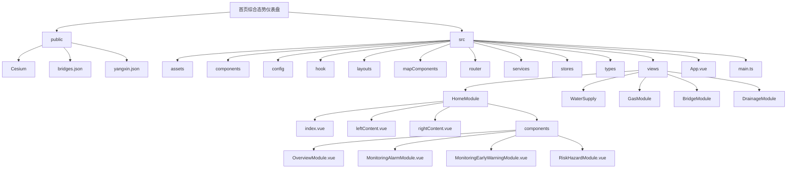
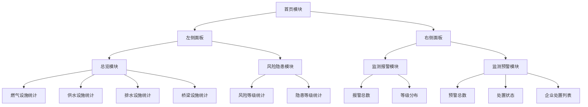
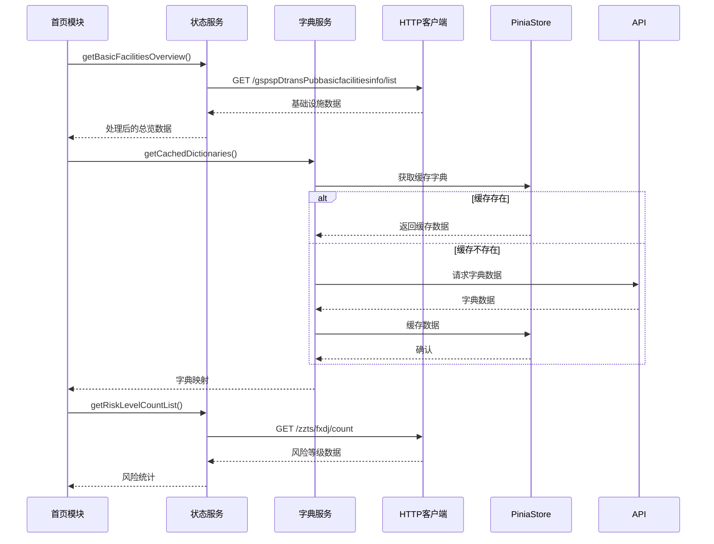
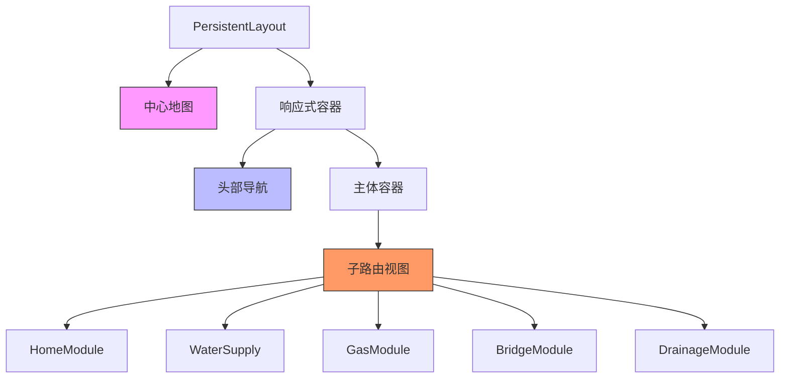

# 首页综合态势仪表盘

<cite>
**本文档引用文件**  
- [main.ts](file://src/main.ts)
- [App.vue](file://src/App.vue)
- [PersistentLayout.vue](file://src/layouts/PersistentLayout.vue)
- [HomeModule/index.vue](file://src/views/HomeModule/index.vue)
- [HomeModule/leftContent.vue](file://src/views/HomeModule/leftContent.vue)
- [HomeModule/rightContent.vue](file://src/views/HomeModule/rightContent.vue)
- [OverviewModule.vue](file://src/views/HomeModule/components/OverviewModule.vue)
- [MonitoringAlarmModule.vue](file://src/views/HomeModule/components/MonitoringAlarmModule.vue)
- [MonitoringEarlyWarningModule.vue](file://src/views/HomeModule/components/MonitoringEarlyWarningModule.vue)
- [RiskHazardModule.vue](file://src/views/HomeModule/components/RiskHazardModule.vue)
- [statusService.ts](file://src/services/statusService.ts)
- [dictionaryService.ts](file://src/services/dictionaryService.ts)
- [chartOptions.ts](file://src/views/HomeModule/components/chartOptions.ts)
</cite>

## 目录
1. [项目结构](#项目结构)
2. [核心组件分析](#核心组件分析)
3. [首页模块架构](#首页模块架构)
4. [数据流与服务调用](#数据流与服务调用)
5. [图表配置与可视化](#图表配置与可视化)
6. [持久化布局机制](#持久化布局机制)

## 项目结构



**Diagram sources**
- [src/views/HomeModule/index.vue](file://src/views/HomeModule/index.vue)
- [src/views/HomeModule/components/OverviewModule.vue](file://src/views/HomeModule/components/OverviewModule.vue)
- [src/views/HomeModule/components/MonitoringAlarmModule.vue](file://src/views/HomeModule/components/MonitoringAlarmModule.vue)

**Section sources**
- [src/main.ts](file://src/main.ts)
- [src/App.vue](file://src/App.vue)
- [src/router/index.ts](file://src/router/index.ts)

## 核心组件分析

首页综合态势仪表盘采用Vue 3 + Pinia + TypeScript技术栈，基于VueCesium实现三维地理信息可视化。系统通过嵌套路由和持久化布局确保地图和头部导航在模块切换时不重新渲染，提升性能和用户体验。

系统入口文件`main.ts`初始化Vue应用，配置Pinia状态管理、Naive UI组件库和VueCesium三维地图框架。`App.vue`作为根组件，通过`n-config-provider`设置中文语言环境，并定义全局样式布局。

**Section sources**
- [src/main.ts](file://src/main.ts#L1-L30)
- [src/App.vue](file://src/App.vue#L1-L159)

## 首页模块架构

首页模块采用左右双栏布局，左侧展示总览和风险隐患信息，右侧展示监测报警和预警处置数据。通过`PersistentLayout.vue`实现持久化布局，确保地图和头部在路由切换时保持状态。



**Diagram sources**
- [src/views/HomeModule/index.vue](file://src/views/HomeModule/index.vue)
- [src/views/HomeModule/leftContent.vue](file://src/views/HomeModule/leftContent.vue)
- [src/views/HomeModule/rightContent.vue](file://src/views/HomeModule/rightContent.vue)

**Section sources**
- [src/views/HomeModule/index.vue](file://src/views/HomeModule/index.vue#L1-L76)
- [src/views/HomeModule/leftContent.vue](file://src/views/HomeModule/leftContent.vue#L1-L29)
- [src/views/HomeModule/rightContent.vue](file://src/views/HomeModule/rightContent.vue#L1-L29)

## 数据流与服务调用

系统通过`statusService.ts`提供综合态势数据接口，包括风险等级、隐患等级、监测报警、预警处置和基础设施总览等统计信息。数据获取采用分层架构，通过`dictionaryService.ts`统一管理字典数据缓存。



**Diagram sources**
- [src/services/statusService.ts](file://src/services/statusService.ts#L1-L56)
- [src/services/dictionaryService.ts](file://src/services/dictionaryService.ts#L1-L45)
- [src/views/HomeModule/components/OverviewModule.vue](file://src/views/HomeModule/components/OverviewModule.vue#L30-L134)

**Section sources**
- [src/services/statusService.ts](file://src/services/statusService.ts#L1-L56)
- [src/services/dictionaryService.ts](file://src/services/dictionaryService.ts#L1-L45)

## 图表配置与可视化

系统采用ECharts实现数据可视化，通过`chartOptions.ts`统一管理图表配置。各类图表采用渐变色、象形柱图等高级视觉效果，提升数据表现力。

```mermaid
classDiagram
class ChartOptions {
+CHART_GRID_CONFIG
+AXIS_LABEL_STYLE
+X_AXIS_CONFIG
+Y_AXIS_CONFIG
+LEGEND_CONFIG
+TOOLTIP_CONFIG
+getRiskPictorialBarOption()
+getHazardPictorialBarOption()
+getMonitoringAlarmChartOption()
+getMonitoringEarlyWarningChartOption()
}
class SeriesData {
+name : string
+type : "bar"|"pictorialBar"
+data : number[]
+itemStyle : {color : string}
}
class LevelMapping {
+[key : string] : {name : string, key : string, order : number}
}
ChartOptions --> SeriesData
ChartOptions --> LevelMapping
ChartOptions ..> "creates" EChartsOption
```

**Diagram sources**
- [src/views/HomeModule/components/chartOptions.ts](file://src/views/HomeModule/components/chartOptions.ts#L1-L429)
- [src/views/HomeModule/components/MonitoringAlarmModule.vue](file://src/views/HomeModule/components/MonitoringAlarmModule.vue#L37-L224)
- [src/views/HomeModule/components/RiskHazardModule.vue](file://src/views/HomeModule/components/RiskHazardModule.vue#L48-L317)

**Section sources**
- [src/views/HomeModule/components/chartOptions.ts](file://src/views/HomeModule/components/chartOptions.ts#L1-L429)

## 持久化布局机制

系统通过`PersistentLayout.vue`实现持久化布局，采用嵌套路由设计模式。地图组件和头部导航作为持久化层，不随路由切换而重新渲染，子路由内容通过`<router-view>`动态加载。



**Diagram sources**
- [src/layouts/PersistentLayout.vue](file://src/layouts/PersistentLayout.vue#L1-L55)
- [src/router/index.ts](file://src/router/index.ts#L1-L136)

**Section sources**
- [src/layouts/PersistentLayout.vue](file://src/layouts/PersistentLayout.vue#L1-L55)
- [src/router/index.ts](file://src/router/index.ts#L1-L136)